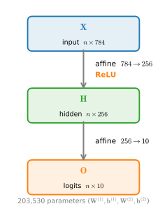
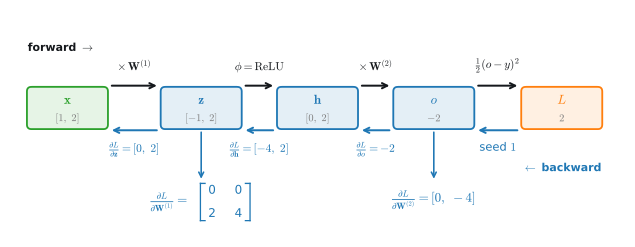

```{.python .input}
%load_ext d2lbook.tab
tab.interact_select('mxnet', 'pytorch', 'tensorflow', 'jax')
```

# Numerical Stability and Initialization
:label:`sec_numerical_stability`


Every model so far has required us to initialize its parameters
from some chosen distribution, and we have taken those choices for granted.
They are not innocuous.
The initialization scheme interacts with the choice of activation function
to determine whether gradients flow at a usable scale,
or instead *vanish* (so learning stalls) or *explode* (so it diverges),
and hence how fast, or whether, optimization converges at all.
This section makes the failure modes concrete
and develops the variance-preserving heuristics
(Xavier and He initialization) that fix them.

```{.python .input #numerical-stability-and-init-numerical-stability-and-initialization}
%%tab mxnet
%matplotlib inline
from d2l import mxnet as d2l
from mxnet import autograd, np, npx
npx.set_np()
```

```{.python .input #numerical-stability-and-init-numerical-stability-and-initialization}
%%tab pytorch
%matplotlib inline
from d2l import torch as d2l
import torch
```

```{.python .input #numerical-stability-and-init-numerical-stability-and-initialization}
%%tab tensorflow
%matplotlib inline
from d2l import tensorflow as d2l
import tensorflow as tf
```

```{.python .input #numerical-stability-and-init-numerical-stability-and-initialization}
%%tab jax
%matplotlib inline
from d2l import jax as d2l
import jax
from jax import numpy as jnp
from jax import grad, vmap
```

## Vanishing and Exploding Gradients

Consider a deep network with $L$ layers,
input $\mathbf{x}$ and output $\mathbf{o}$.
With each layer $l$ defined by a transformation $f_l$
parametrized by weights $\mathbf{W}^{(l)}$,
whose hidden layer output is $\mathbf{h}^{(l)}$ (let $\mathbf{h}^{(0)} = \mathbf{x}$),
our network can be expressed as:

$$\mathbf{h}^{(l)} = f_l (\mathbf{h}^{(l-1)}) \textrm{ and thus } \mathbf{o} = f_L \circ \cdots \circ f_1(\mathbf{x}).$$

If all the hidden layer output and the input are vectors,
we can write the gradient of $\mathbf{o}$ with respect to
any set of parameters $\mathbf{W}^{(l)}$ as follows:

$$\partial_{\mathbf{W}^{(l)}} \mathbf{o} = \underbrace{\partial_{\mathbf{h}^{(L-1)}} \mathbf{h}^{(L)}}_{ \mathbf{M}^{(L)} \stackrel{\textrm{def}}{=}} \cdots \underbrace{\partial_{\mathbf{h}^{(l)}} \mathbf{h}^{(l+1)}}_{ \mathbf{M}^{(l+1)} \stackrel{\textrm{def}}{=}} \underbrace{\partial_{\mathbf{W}^{(l)}} \mathbf{h}^{(l)}}_{ \mathbf{v}^{(l)} \stackrel{\textrm{def}}{=}}.$$

In other words, this gradient is
the product of $L-l$ matrices
$\mathbf{M}^{(L)} \cdots \mathbf{M}^{(l+1)}$
and the gradient operator $\mathbf{v}^{(l)}$.
Thus we are susceptible to the same
problems of numerical underflow that often crop up
when multiplying together too many probabilities.
When dealing with probabilities, a common trick is to
switch into log-space, i.e., shifting
pressure from the mantissa to the exponent
of the numerical representation.
Unfortunately, our problem above is more serious:
each Jacobian $\mathbf{M}^{(l)}$ can stretch or shrink the vectors it acts on
by widely varying factors (its *singular values* — for the rectangular
Jacobians that arise when layer widths differ, these are the right notion of
"how much the matrix scales things").
A per-layer factor of $\rho$ compounds to $\rho^{\,L-l}$ across the product,
so factors even modestly different from $1$
make the overall gradient *very large* or *very small* geometrically fast;
the spectral-radius account of such iterated products is developed
in :numref:`subsec_mdl-spectral-radius`.

The risks posed by unstable gradients
go beyond numerical representation.
Gradients of unpredictable magnitude
also threaten the stability of our optimization algorithms.
We may be facing parameter updates that are either
(i) excessively large, destroying our model
(the *exploding gradient* problem);
or (ii) excessively small
(the *vanishing gradient* problem),
rendering learning impossible as parameters
hardly move on each update.


### Vanishing Gradients

One frequent culprit causing the vanishing gradient problem
is the choice of the activation function $\sigma$
that is appended following each layer's linear operations.
Historically, the sigmoid function
$1/(1 + \exp(-x))$ (introduced in :numref:`sec_mlp`)
was popular because it resembles a thresholding function.
Since early artificial neural networks were inspired
by biological neural networks,
the idea of neurons that fire either *fully* or *not at all*
(like biological neurons) seemed appealing.
Let's take a closer look at the sigmoid
to see why it can cause vanishing gradients.

```{.python .input #numerical-stability-and-init-vanishing-gradients}
%%tab mxnet
x = np.arange(-8.0, 8.0, 0.1)
x.attach_grad()
with autograd.record():
    y = npx.sigmoid(x)
y.backward()

d2l.plot(x, [y, x.grad], legend=['sigmoid', 'gradient'], figsize=(4.5, 2.5))
```

```{.python .input #numerical-stability-and-init-vanishing-gradients}
%%tab pytorch
x = torch.arange(-8.0, 8.0, 0.1, requires_grad=True)
y = torch.sigmoid(x)
y.backward(torch.ones_like(x))

d2l.plot(x.detach().numpy(), [y.detach().numpy(), x.grad.numpy()],
         legend=['sigmoid', 'gradient'], figsize=(4.5, 2.5))
```

```{.python .input #numerical-stability-and-init-vanishing-gradients}
%%tab tensorflow
x = tf.Variable(tf.range(-8.0, 8.0, 0.1))
with tf.GradientTape() as t:
    y = tf.nn.sigmoid(x)
d2l.plot(x.numpy(), [y.numpy(), t.gradient(y, x).numpy()],
         legend=['sigmoid', 'gradient'], figsize=(4.5, 2.5))
```

```{.python .input #numerical-stability-and-init-vanishing-gradients}
%%tab jax
x = jnp.arange(-8.0, 8.0, 0.1)
y = jax.nn.sigmoid(x)
grad_sigmoid = vmap(grad(jax.nn.sigmoid))
d2l.plot(x, [y, grad_sigmoid(x)],
         legend=['sigmoid', 'gradient'], figsize=(4.5, 2.5))
```

As you can see, the sigmoid's gradient vanishes
both when its inputs are large and when they are small.
Moreover, the sigmoid's derivative *never exceeds* $0.25$
(its peak, attained at zero),
so even in the Goldilocks zone,
where the inputs to many of the sigmoids are close to zero,
each layer attenuates the backward signal by at least a factor of four:
after only ten sigmoid layers the gradient has shrunk
by $0.25^{10} \approx 10^{-6}$.
Away from that zone the situation is far worse,
and the gradients of the overall product vanish outright.
When our network boasts many layers,
unless we are careful, the gradient
will likely be cut off at some layer.
Indeed, this problem used to plague deep network training.
Consequently, ReLUs, which are more stable
(but less neurally plausible),
have emerged as the default choice for practitioners.


### Exploding Gradients

The opposite problem, when gradients explode,
can be similarly vexing.
To illustrate this a bit better,
we draw 100 Gaussian random matrices
and multiply them with some initial matrix.
For the scale that we picked
(the choice of the variance $\sigma^2=1$),
the matrix product explodes.
When this happens because of the initialization
of a deep network, we have no chance of getting
a gradient descent optimizer to converge.

```{.python .input #numerical-stability-and-init-exploding-gradients}
%%tab mxnet
M = np.random.normal(size=(4, 4))
print('a single matrix', M)
for i in range(100):
    M = np.dot(M, np.random.normal(size=(4, 4)))
print('after multiplying 100 matrices', M)
```

```{.python .input #numerical-stability-and-init-exploding-gradients}
%%tab pytorch
M = torch.normal(0, 1, size=(4, 4))
print('a single matrix \n',M)
for i in range(100):
    M = M @ torch.normal(0, 1, size=(4, 4))
print('after multiplying 100 matrices\n', M)
```

```{.python .input #numerical-stability-and-init-exploding-gradients}
%%tab tensorflow
M = tf.random.normal((4, 4))
print('a single matrix \n', M)
for i in range(100):
    M = tf.matmul(M, tf.random.normal((4, 4)))
print('after multiplying 100 matrices\n', M.numpy())
```

```{.python .input #numerical-stability-and-init-exploding-gradients}
%%tab jax
M = jax.random.normal(d2l.get_key(), (4, 4))
print('a single matrix \n', M)
for i in range(100):
    M = jnp.matmul(M, jax.random.normal(d2l.get_key(), (4, 4)))
print('after multiplying 100 matrices\n', M)
```

### Breaking the Symmetry

Another problem in neural network design
is the symmetry inherent in their parametrization.
Assume that we have a simple MLP
with one hidden layer and two units.
In this case, we could permute the weights $\mathbf{W}^{(1)}$
of the first layer and likewise permute
the weights of the output layer
to obtain the same function.
There is nothing special differentiating
the first and second hidden units.
In other words, we have permutation symmetry
among the hidden units of each layer.

This is more than just a theoretical nuisance.
Consider the aforementioned one-hidden-layer MLP
with two hidden units.
For illustration,
suppose that the output layer transforms the two hidden units into only one output unit.
Imagine what would happen if we initialized
all the parameters of the hidden layer
as $\mathbf{W}^{(1)} = c$ for some constant $c$.
In this case, during forward propagation
either hidden unit takes the same inputs and parameters
producing the same activation
which is fed to the output unit.
During backpropagation,
differentiating the output unit with respect to parameters $\mathbf{W}^{(1)}$ gives a gradient all of whose elements take the same value.
Thus, after gradient-based iteration (e.g., minibatch stochastic gradient descent),
all the elements of $\mathbf{W}^{(1)}$ still take the same value.
Such iterations would
never *break the symmetry* on their own
and we might never be able to realize
the network's expressive power.
The hidden layer would behave
as if it had only a single unit.
Note that while minibatch stochastic gradient descent would not break this symmetry,
dropout regularization (:numref:`sec_dropout`) would!


## Parameter Initialization

One way of addressing (or at least mitigating) the
issues raised above is through careful initialization.
As we will see later,
additional care during optimization
and suitable regularization can further enhance stability.


### Default Initialization

In the previous sections, e.g., in :numref:`sec_linear_concise`,
we initialized weights by drawing them from a normal distribution
with a small, fixed standard deviation.
If we do not specify an initialization method at all,
every framework falls back to a default scheme,
and those defaults are *not* arbitrary:
each samples from a distribution whose spread is tied to the layer's fan-in
(a Xavier- or He-like rule of exactly the kind we derive below).
These defaults work well for moderately sized networks.
They become unreliable, however, as depth grows.
The variance analysis that follows explains both *why* they work
and *where* they break, and what to reach for instead.


### Xavier Initialization
:label:`subsec_xavier`

Let's look at the scale distribution of
an output $o_{i}$ for some fully connected layer
*without nonlinearities*.
With $n_\textrm{in}$ inputs $x_j$
and their associated weights $w_{ij}$ for this layer,
an output is given by

$$o_{i} = \sum_{j=1}^{n_\textrm{in}} w_{ij} x_j.$$

The weights $w_{ij}$ are all drawn
independently from the same distribution.
Furthermore, let's assume that this distribution
has zero mean and variance $\sigma^2$.
Note that this does not mean that the distribution has to be Gaussian,
just that the mean and variance need to exist.
For now, let's assume that the inputs to the layer $x_j$
also have zero mean and variance $\gamma^2$
and that they are independent of $w_{ij}$ and independent of each other.
In this case, we can compute the mean of $o_i$:

$$
\begin{aligned}
    E[o_i] & = \sum_{j=1}^{n_\textrm{in}} E[w_{ij} x_j] \\&= \sum_{j=1}^{n_\textrm{in}} E[w_{ij}] E[x_j] \\&= 0, \end{aligned}$$

and the variance:

$$
\begin{aligned}
    \textrm{Var}[o_i] & = E[o_i^2] - (E[o_i])^2 \\
        & = \sum_{j=1}^{n_\textrm{in}} E[w^2_{ij} x^2_j] - 0 \\
        & = \sum_{j=1}^{n_\textrm{in}} E[w^2_{ij}] E[x^2_j] \\
        & = n_\textrm{in} \sigma^2 \gamma^2.
\end{aligned}
$$

Here we used $E[w_{ij}^2] = \textrm{Var}[w_{ij}] = \sigma^2$,
which holds because the weights have zero mean
($\textrm{Var}[w] = E[w^2] - E[w]^2 = E[w^2]$),
and likewise $E[x_j^2] = \gamma^2$.
In the second line, expanding the square of the sum also produces cross terms
$E[w_{ij} w_{ik} x_j x_k]$ for $j \neq k$;
these vanish because the weights are independent of each other
(and of the inputs) and have zero mean.

One way to keep the variance fixed
is to set $n_\textrm{in} \sigma^2 = 1$.
Now consider backpropagation.
A gradient signal flowing *back* through this layer
is multiplied by $\mathbf{W}^\top$,
so by the identical variance computation,
now summing over the $n_\textrm{out}$ outputs the layer feeds,
its variance is scaled by $n_\textrm{out} \sigma^2$.
Keeping the *backward* signal's variance fixed
therefore requires $n_\textrm{out} \sigma^2 = 1$,
where $n_\textrm{out}$ is the number of outputs of this layer.
This leaves us in a dilemma:
we cannot possibly satisfy both conditions simultaneously.
Instead, we simply try to satisfy:

$$
\begin{aligned}
\frac{1}{2} (n_\textrm{in} + n_\textrm{out}) \sigma^2 = 1 \textrm{ or equivalently }
\sigma = \sqrt{\frac{2}{n_\textrm{in} + n_\textrm{out}}}.
\end{aligned}
$$

This is the reasoning underlying the now-standard
and practically beneficial *Xavier initialization*,
named after the first author of its creators :cite:`Glorot.Bengio.2010`.
Typically, the Xavier initialization
samples weights from a Gaussian distribution
with zero mean and variance
$\sigma^2 = \frac{2}{n_\textrm{in} + n_\textrm{out}}$.
We can also adapt this to
choose the variance when sampling weights
from a uniform distribution.
Note that the uniform distribution $U(-a, a)$ has variance $\frac{a^2}{3}$.
Plugging $\frac{a^2}{3}$ into our condition on $\sigma^2$
prompts us to initialize according to

$$U\left(-\sqrt{\frac{6}{n_\textrm{in} + n_\textrm{out}}}, \sqrt{\frac{6}{n_\textrm{in} + n_\textrm{out}}}\right).$$

Though the assumption that there are no nonlinearities
in the above mathematical reasoning
can be easily violated in neural networks,
the Xavier initialization method
turns out to work well in practice.


### He Initialization
:label:`subsec_he_init`

The Xavier analysis above assumed a layer *without nonlinearities*.
The argument breaks in a specific, fixable way once we insert a ReLU.
First, note what the variance computation above actually consumed:
because the weights have zero mean, $E[o_i] = 0$ no matter what the inputs are,
and $\textrm{Var}[o_i] = n_\textrm{in} \sigma^2 E[x_j^2]$ depends on the inputs
only through their *second moment* $E[x_j^2]$.
So the quantity we must track through the nonlinearity is the second moment.
Recall that $\textrm{ReLU}(z) = \max(0, z)$ zeroes every negative pre-activation
and passes every positive one through unchanged.
If the pre-activations are symmetric about zero,
as they are when the weights have zero mean,
then $\textrm{ReLU}(z)^2$ equals $z^2$ on the positive half of the distribution
and equals $0$ on the negative half,
so the rectifier **halves the second moment**:
$E[\textrm{ReLU}(z)^2] = \tfrac{1}{2}E[z^2]$.
(Its effect on the *variance* is messier, because $\textrm{ReLU}(z)$
is no longer zero-mean; see exercise 3.)

Propagating this halved second moment through
the same forward computation as before,
the variance of the layer output is now
$\textrm{Var}[o_i] = \tfrac{1}{2} n_\textrm{in} \sigma^2 \gamma^2$,
where $\gamma^2$ now denotes the variance of the pre-activations
feeding the ReLU, and
the extra factor of $\tfrac{1}{2}$ comes from the rectifier.
To keep the variance fixed across layers
we must compensate by *doubling* the weight variance:

$$\sigma^2 = \frac{2}{n_\textrm{in}}.$$

This is *He* (or *Kaiming*) *initialization* :cite:`He.Zhang.Ren.ea.2015`,
and it is the standard choice for the ReLU-family activations
this chapter uses throughout.
Because Xavier and He differ only by this factor of two
and by which fan size they key on, they are easy to confuse;
the rule of thumb is **Xavier for $\tanh$ and sigmoid, He for ReLU**.
Most frameworks ship both as named initializers
(e.g., PyTorch's `kaiming_normal_` and `kaiming_uniform_` —
a variant of the latter is the default for `nn.Linear`),
and we return to invoking them through the parameter-initialization API
in :numref:`chap_computation`.


### Watching the Variance Propagate

The 100-matrix product above showed the *explosion* half of the story. Now
that we have the fix in hand, we can demonstrate the whole thesis of this
section in one plot: push a unit-scale signal through $50$ ReLU layers of
width $100$ and track the second moment $E[(h^{(l)})^2]$ of the activations
(the quantity the He argument preserves) layer by layer, under three weight
scales: the naive $\mathcal{N}(0,1)$, Xavier, and He. To avoid floating-point
overflow along the way, we renormalize the activations after each layer and
accumulate the per-layer gains instead; because ReLU is positively
homogeneous ($\operatorname{ReLU}(a\mathbf{x}) = a\operatorname{ReLU}(\mathbf{x})$
for $a > 0$), this rescaling is exact, not an approximation.

```{.python .input #numerical-stability-and-init-depth-sweep}
%%tab pytorch
depth, width = 50, 100
scales = {'N(0, 1)': 1.0, 'Xavier': (2 / (width + width)) ** 0.5,
          'He': (2 / width) ** 0.5}
curves = []
for scale in scales.values():
    h, m, curve = torch.randn(1000, width), 1.0, []
    for _ in range(depth):
        h = torch.relu(h @ (scale * torch.randn(width, width)))
        gain = float((h ** 2).mean())  # this layer's factor on E[h^2]
        m *= gain
        curve.append(m)
        h = h / gain ** 0.5  # renormalize: exact, since ReLU is homogeneous
    curves.append(curve)
d2l.plot(list(range(1, depth + 1)), curves, 'layer', 'second moment of h',
         legend=list(scales), yscale='log')
```

```{.python .input #numerical-stability-and-init-depth-sweep}
%%tab mxnet
depth, width = 50, 100
scales = {'N(0, 1)': 1.0, 'Xavier': (2 / (width + width)) ** 0.5,
          'He': (2 / width) ** 0.5}
curves = []
for scale in scales.values():
    h, m, curve = np.random.normal(size=(1000, width)), 1.0, []
    for _ in range(depth):
        h = npx.relu(np.dot(h, scale * np.random.normal(
            size=(width, width))))
        gain = float((h ** 2).mean())  # this layer's factor on E[h^2]
        m *= gain
        curve.append(m)
        h = h / gain ** 0.5  # renormalize: exact, since ReLU is homogeneous
    curves.append(curve)
d2l.plot(list(range(1, depth + 1)), curves, 'layer', 'second moment of h',
         legend=list(scales), yscale='log')
```

```{.python .input #numerical-stability-and-init-depth-sweep}
%%tab tensorflow
depth, width = 50, 100
scales = {'N(0, 1)': 1.0, 'Xavier': (2 / (width + width)) ** 0.5,
          'He': (2 / width) ** 0.5}
curves = []
for scale in scales.values():
    h, m, curve = tf.random.normal((1000, width)), 1.0, []
    for _ in range(depth):
        h = tf.nn.relu(tf.matmul(h, scale * tf.random.normal(
            (width, width))))
        gain = float(tf.reduce_mean(h ** 2))  # factor on E[h^2]
        m *= gain
        curve.append(m)
        h = h / gain ** 0.5  # renormalize: exact, since ReLU is homogeneous
    curves.append(curve)
d2l.plot(list(range(1, depth + 1)), curves, 'layer', 'second moment of h',
         legend=list(scales), yscale='log')
```

```{.python .input #numerical-stability-and-init-depth-sweep}
%%tab jax
depth, width = 50, 100
scales = {'N(0, 1)': 1.0, 'Xavier': (2 / (width + width)) ** 0.5,
          'He': (2 / width) ** 0.5}
curves = []
for scale in scales.values():
    h, m, curve = jax.random.normal(d2l.get_key(), (1000, width)), 1.0, []
    for _ in range(depth):
        h = jax.nn.relu(h @ (scale * jax.random.normal(
            d2l.get_key(), (width, width))))
        gain = float((h ** 2).mean())  # this layer's factor on E[h^2]
        m *= gain
        curve.append(m)
        h = h / gain ** 0.5  # renormalize: exact, since ReLU is homogeneous
    curves.append(curve)
d2l.plot(list(range(1, depth + 1)), curves, 'layer', 'second moment of h',
         legend=list(scales), yscale='log')
```

The plot tells the entire story at a glance. Under $\mathcal{N}(0,1)$ weights
each layer multiplies the signal's scale by roughly $n_\textrm{in}/2 = 50$, and
fifty layers compound that to an astronomical $\sim\!10^{80}$: the exploding
regime. Xavier, derived for *linear* layers, is off by exactly the rectifier's
factor of $\tfrac{1}{2}$ per layer, so the signal *vanishes* like $2^{-l}$,
reaching $\sim\!10^{-15}$ by the bottom of the stack. He initialization
compensates for the rectifier and holds the signal's scale essentially flat
across all fifty layers (the slight downward drift is a finite-width
fluctuation effect, not a bias in the rule). Only the He-initialized network
delivers usable forward signals, and by the symmetric backward argument,
usable gradients. Exercise 4 asks you to repeat the sweep with the
nonlinearity removed, where Xavier is the scheme that stays flat.

### Beyond

The reasoning above barely scratches the surface
of modern approaches to parameter initialization.
A deep learning framework often implements over a dozen different heuristics.
Moreover, parameter initialization continues to be
a hot area of fundamental research in deep learning.
Among these are heuristics specialized for
tied (shared) parameters, super-resolution,
sequence models, and other situations.
For instance,
:citet:`Xiao.Bahri.Sohl-Dickstein.ea.2018` demonstrated the possibility of training
10,000-layer neural networks without architectural tricks
by using a carefully-designed initialization method.

In very deep networks, normalization layers (:numref:`sec_batch_norm`)
and residual connections (:numref:`sec_resnet`)
largely remove this burden from initialization
by re-centering activations during training;
we cover them in later chapters.

If the topic interests you we suggest
a deep dive into this module's offerings,
reading the papers that proposed and analyzed each heuristic,
and then exploring the latest publications on the topic.
Perhaps you will stumble across or even invent
a clever idea and contribute an implementation to deep learning frameworks.


## Summary

Vanishing and exploding gradients are common issues in deep networks. Great care in parameter initialization is required to ensure that gradients and parameters remain well controlled.
Initialization heuristics are needed to ensure that the initial gradients are neither too large nor too small.
Random initialization is key to ensuring that symmetry is broken before optimization.
Xavier initialization keeps the variance of activations and gradients roughly constant across layers by scaling weights according to the number of inputs and outputs.
For ReLU networks, He initialization scales the weight variance to $2/n_\textrm{in}$ to compensate for the rectifier halving the activations' second moment.
ReLU activation functions mitigate the vanishing gradient problem. This can accelerate convergence.

## Exercises

1. Can you design other cases where a neural network might exhibit symmetry that needs breaking, besides the permutation symmetry in an MLP's layers?
1. Can we initialize all weight parameters in linear regression or in softmax regression to the same value?
1. The Xavier derivation assumed a linear layer. Repeat it for a layer followed by a ReLU: show that, for zero-mean symmetric pre-activations $z$, $E[\textrm{ReLU}(z)^2] = \tfrac{1}{2}E[z^2]$, and conclude that preserving forward variance requires $\sigma^2 = 2/n_\textrm{in}$ (He initialization). Where does the factor of two come from intuitively? Why is the analogous statement for variances false? For $z \sim \mathcal{N}(0, \tau^2)$, compute $\textrm{Var}[\textrm{ReLU}(z)]$ explicitly and show that it equals $\left(\tfrac{1}{2} - \tfrac{1}{2\pi}\right)\tau^2$, not $\tfrac{1}{2}\tau^2$.
1. Rerun this section's depth-sweep experiment with the ReLU removed, i.e., for a purely *linear* stack of 50 layers of width 100 under the same three schemes. Which scheme keeps the signal's scale flat now, and why does the winner change relative to the ReLU sweep? What does this predict for activations that are approximately linear around zero, such as tanh?
1. Look up analytic bounds on the eigenvalues of the product of two matrices. What does this tell you about ensuring that gradients are well conditioned?
1. If we know that some terms diverge, can we fix this after the fact? Look at the paper on layerwise adaptive rate scaling  for inspiration :cite:`You.Gitman.Ginsburg.2017`.


:begin_tab:`mxnet`
[Discussions](https://d2l.discourse.group/t/103)
:end_tab:

:begin_tab:`pytorch`
[Discussions](https://d2l.discourse.group/t/104)
:end_tab:

:begin_tab:`tensorflow`
[Discussions](https://d2l.discourse.group/t/235)
:end_tab:

:begin_tab:`jax`
[Discussions](https://d2l.discourse.group/t/17986)
:end_tab:

<!-- slides -->

::: {.slide}
::: {.cover}
[Dive into Deep Learning · §5.4]{.kicker}

Numerical stability & **initialization**<br>Why deep nets once refused to train, and the variance rule that fixed them.
:::
:::

::: {.slide title="Why does the starting point matter so much?"}
[Motivation]{.kicker}

::: {.cols .vc}
::: {.col}
A deep net composes many layers before any loss is seen. The **initial**
weights decide whether a signal survives the trip, forward and back.

Three ideas made deep training routine:

1. **Non-saturating activations** (ReLU).
2. **Variance-preserving init** (Xavier, He).
3. **Symmetry breaking** (random, never constant).

::: {.d2l-note}
Get init wrong and the gradient either **dies** at zero or **blows up** to NaN before learning starts.
:::
:::

::: {.col .fig}
{width=58%}
:::
:::
:::

::: {.slide}
::: {.divider}
[01]{.dnum}

[Unstable Gradients]{.dtitle}

[why the chain rule makes depth dangerous]{.dsub}
:::
:::

::: {.slide title="The gradient is a product down the chain"}
[Unstable Gradients]{.kicker}

Backprop multiplies one Jacobian per layer. For a weight in layer $\ell$,

$$\partial_{\mathbf{W}^{(\ell)}} \mathbf{o} =
\underbrace{\mathbf{M}^{(L)} \cdots \mathbf{M}^{(\ell+1)}}_{L-\ell \text{ Jacobians}}\,
\mathbf{v}^{(\ell)},
\qquad \mathbf{M}^{(k)} = \partial_{\mathbf{h}^{(k-1)}} \mathbf{h}^{(k)}.$$

{width=86%}
:::

::: {.slide title="Two ways a long product misbehaves"}
[Unstable Gradients]{.kicker}

Whether the product grows or shrinks is set by the Jacobians' **scale**.

. . .

- Factors with spectral radius $< 1$ $\Rightarrow$ the product **shrinks geometrically** $\Rightarrow$ *vanishing* gradient: bottom layers stop learning.

. . .

- Factors with spectral radius $> 1$ $\Rightarrow$ the product **grows geometrically** $\Rightarrow$ *exploding* gradient: updates overshoot, loss goes to NaN.

::: {.d2l-note .rule}
A constant per-layer factor $\rho$ compounds to $\rho^{\,L-\ell}$. Only $\rho \approx 1$ stays usable across depth.
:::
:::

::: {.slide title="Vanishing: the sigmoid saturates"}
[Unstable Gradients · vanishing]{.kicker}

::: {.cols .vc}
::: {.col}
The sigmoid's derivative **peaks at $0.25$** and is flat at zero in both tails.

Stack ten such layers and $0.25^{10} \approx 10^{-6}$: the bottom layer sees a millionth of the gradient.

::: {.d2l-note}
ReLU's derivative is exactly **1** wherever a unit is active, so it does not attenuate the signal. Hence ReLU is the modern default.
:::
:::

::: {.col .fig .big}
@!numerical-stability-and-init-vanishing-gradients
:::
:::
:::

::: {.slide title="Exploding: a product of random matrices" except="tensorflow"}
[Unstable Gradients · exploding]{.kicker}

Multiply one hundred $\mathcal{N}(0,1)$ matrices ($\sigma^2 = 1$, each factor too large) and the entries run away to $\sim\!10^{24}$. A poorly scaled init does exactly this to the gradient.

@numerical-stability-and-init-exploding-gradients
:::

::: {.slide title="Exploding: a product of random matrices" only="tensorflow"}
[Unstable Gradients · exploding]{.kicker}

Multiply one hundred $\mathcal{N}(0,1)$ matrices ($\sigma^2 = 1$, each factor too large) and the entries run away to $\sim\!10^{24}$. A poorly scaled init does exactly this to the gradient.

@-numerical-stability-and-init-exploding-gradients
:::

::: {.slide title="The three crashes you will actually see"}
[Unstable Gradients · in practice]{.kicker}

- **Loss is NaN from step 1** $\to$ exploding *initialization* (weights too large).

. . .

- **Loss spikes mid-training** $\to$ exploding gradient on a bad batch.

. . .

- **Loss refuses to drop** $\to$ vanishing gradient (saturated activations), or a learning rate that is simply too small.
:::

::: {.slide title="Random init breaks a hidden symmetry"}
[Unstable Gradients · symmetry]{.kicker}

Set every weight in a layer to the same constant $c$:

- Every hidden unit computes the **same** function.
- Every unit gets the **same** gradient.
- After each update the weights are **still** identical.

An $h$-unit layer is then stuck behaving like a **single** unit, forever.

::: {.d2l-note .warn}
Gradient descent alone never breaks this tie. **Random** initialization does; so does dropout. Bias may still start at $0$.
:::
:::

::: {.slide}
::: {.divider}
[02]{.dnum}

[Variance-Preserving Init]{.dtitle}

[keep the signal's scale constant through depth]{.dsub}
:::
:::

::: {.slide title="Keep the variance constant, layer to layer"}
[Initialization]{.kicker}

For a linear layer $o_i = \sum_{j=1}^{n_\textrm{in}} w_{ij} x_j$ with i.i.d. zero-mean weights ($\textrm{Var} = \sigma^2$) and inputs ($\textrm{Var} = \gamma^2$):

$$\mathbb{E}[o_i] = 0,
\qquad
\textrm{Var}[o_i] = n_\textrm{in}\, \sigma^2\, \gamma^2.$$

. . .

To carry the input's variance through unchanged ($\textrm{Var}[o] = \gamma^2$), the only knob is $\sigma^2$:

$$\sigma^2 = \frac{1}{n_\textrm{in}}.$$
:::

::: {.slide title="Forward and backward disagree, so compromise"}
[Initialization]{.kicker}

The same variance count run **backward** through $\mathbf{W}^\top$ sums over the $n_\textrm{out}$ outputs instead:

$$\text{forward: } n_\textrm{in}\,\sigma^2 = 1
\qquad
\text{backward: } n_\textrm{out}\,\sigma^2 = 1.$$

Both cannot hold at once unless $n_\textrm{in} = n_\textrm{out}$, so **Xavier** splits the difference by averaging the two fan sizes.

::: {.d2l-note .rule}
Preserve the activation scale on the way in **and** the gradient scale on the way out: one $\sigma^2$, two demands.
:::
:::

::: {.slide title="Xavier and He: one factor of two apart"}
[Initialization]{.kicker}

::: {.cols .vc}
::: {.col}
**Xavier / Glorot** (2010), for $\tanh$ and sigmoid:

$$\sigma^2 = \frac{2}{n_\textrm{in} + n_\textrm{out}}.$$

**He / Kaiming** (2015), for ReLU:

$$\sigma^2 = \frac{2}{n_\textrm{in}}.$$
:::

::: {.col .narrow}
::: {.d2l-note}
ReLU zeroes half a symmetric signal, **halving** its variance, so He **doubles** the weight variance to compensate.
:::

Rule of thumb: **Xavier for $\tanh$/sigmoid, He for ReLU.** Both ship as framework defaults.
:::
:::
:::

::: {.slide title="Init is the floor, not the ceiling"}
[Beyond]{.kicker}

Good init buys a deep net that trains without NaNs. To reach **hundreds** of layers, modern architecture re-normalizes *during* training:

- **BatchNorm / LayerNorm** rescale activations to unit variance each step, lifting the burden off init.
- **Residual connections** $\mathbf{h}^{(\ell+1)} = \mathbf{h}^{(\ell)} + f(\mathbf{h}^{(\ell)})$ give the gradient a shortcut, so shrinkage stops compounding.

We return to both in the chapters on modern CNNs.
:::

::: {.slide title="Recap"}
[Wrap-up]{.kicker}

::: {.cols}
::: {.col}
- A deep gradient is a **product of per-layer Jacobians**, so it vanishes or explodes without care.
- **Vanishing:** saturating activations (sigmoid/tanh) crush the signal; ReLU keeps it.
- **Exploding:** over-large weights drive the product, and the loss, to NaN.
:::

::: {.col}
- **Fix the scale:** init weights so $\textrm{Var}$ is preserved, via **Xavier** ($\tanh$) and **He** (ReLU).
- **Break the symmetry:** random init, never a constant.
- **At scale:** normalization + residuals + careful init together reach 100+ layers.
:::
:::
:::
