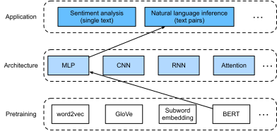

# Natural Language Inference: Fine-Tuning BERT
:label:`sec_natural-language-inference-bert`

In earlier sections of this chapter,
we have designed an attention-based architecture
(in :numref:`sec_natural-language-inference-attention`)
for the natural language inference task
on the SNLI dataset (as described in :numref:`sec_natural-language-inference-and-dataset`).
Now we revisit this task by fine-tuning BERT.
As discussed in :numref:`sec_finetuning-bert`,
natural language inference is a sequence-level text pair classification problem,
and fine-tuning BERT only requires an additional MLP-based architecture,
as illustrated in :numref:`fig_nlp-map-nli-bert`.


:label:`fig_nlp-map-nli-bert`

In this section,
we will download a pretrained small version of BERT,
then fine-tune it
for natural language inference on the SNLI dataset.

```{.python .input}
#@tab mxnet
from d2l import mxnet as d2l
import json
import multiprocessing
from mxnet import gluon, np, npx
from mxnet.gluon import nn
import os

npx.set_np()
```

```{.python .input}
#@tab pytorch
from d2l import torch as d2l
import json
import multiprocessing
import torch
from torch import nn
import os
```

```{.python .input}
#@tab jax
from d2l import jax as d2l
import jax
from jax import numpy as jnp
from flax import linen as nn
import optax
import numpy as np
import json
import os
```

```{.python .input}
#@tab tensorflow
from d2l import tensorflow as d2l
import tensorflow as tf
import keras
import numpy as np
import json
import multiprocessing
import os
```

## [**Loading Pretrained BERT**]

We have explained how to pretrain BERT on the WikiText-2 dataset in
:numref:`sec_bert-dataset` and :numref:`sec_bert-pretraining`
(note that the original BERT model is pretrained on much bigger corpora).
As discussed in :numref:`sec_bert-pretraining`,
the original BERT model has hundreds of millions of parameters.
In the following,
we provide two versions of pretrained BERT:
"bert.base" is about as big as the original BERT base model that requires a lot of computational resources to fine-tune,
while "bert.small" is a small version to facilitate demonstration.

```{.python .input}
#@tab mxnet
d2l.DATA_HUB['bert.base'] = (d2l.DATA_URL + 'bert.base.zip',
                             '7b3820b35da691042e5d34c0971ac3edbd80d3f4')
d2l.DATA_HUB['bert.small'] = (d2l.DATA_URL + 'bert.small.zip',
                              'a4e718a47137ccd1809c9107ab4f5edd317bae2c')
```

```{.python .input}
#@tab pytorch
d2l.DATA_HUB['bert.base'] = (d2l.DATA_URL + 'bert.base.torch.zip',
                             '225d66f04cae318b841a13d32af3acc165f253ac')
d2l.DATA_HUB['bert.small'] = (d2l.DATA_URL + 'bert.small.torch.zip',
                              'c72329e68a732bef0452e4b96a1c341c8910f81f')
```

```{.python .input}
#@tab jax
d2l.DATA_HUB['bert.base'] = (d2l.DATA_URL + 'bert.base.torch.zip',
                             '225d66f04cae318b841a13d32af3acc165f253ac')
d2l.DATA_HUB['bert.small'] = (d2l.DATA_URL + 'bert.small.torch.zip',
                              'c72329e68a732bef0452e4b96a1c341c8910f81f')

def _load_torch_state_dict(path):
    """Load a PyTorch state-dict file as {str: numpy.ndarray} without torch.

    Works for files saved with ``torch.save(model.state_dict(), path)``
    using pickle protocol 2 (the default for PyTorch <= 2.x CPU tensors).
    """
    import pickle, struct, io
    from collections import OrderedDict

    dtype_info = {
        'FloatStorage': (np.float32, 4), 'HalfStorage': (np.float16, 2),
        'LongStorage': (np.int64, 8),    'IntStorage': (np.int32, 4),
        'DoubleStorage': (np.float64, 8),
    }

    class _StorageRef:
        __slots__ = ('dtype_name', 'key', 'location', 'size')
        def __init__(self, dtype_name, key, location, size):
            self.dtype_name = dtype_name; self.key = key
            self.location = location; self.size = size

    class _TensorRef:
        __slots__ = ('storage', 'offset', 'size', 'stride')
        def __init__(self, storage, offset, size, stride):
            self.storage = storage; self.offset = offset
            self.size = tuple(size); self.stride = tuple(stride)

    class _StorageType:
        __slots__ = ('name',)
        def __init__(self, name): self.name = name
        def __call__(self, _): return self

    class _Unpickler(pickle.Unpickler):
        def find_class(self, module, name):
            if module == 'collections' and name == 'OrderedDict':
                return OrderedDict
            if module == 'torch._utils' and name == '_rebuild_tensor_v2':
                return (lambda s, o, sz, st, *a, **k:
                        _TensorRef(s, o, sz, st))
            if module == 'torch' and name in dtype_info:
                return _StorageType(name)
            return super().find_class(module, name)
        def persistent_load(self, saved_id):
            if isinstance(saved_id, tuple) and saved_id[0] == 'storage':
                st = saved_id[1]
                return _StorageRef(
                    st.name if isinstance(st, _StorageType) else 'FloatStorage',
                    saved_id[2], saved_id[3], saved_id[4])
            raise RuntimeError(f'Unknown persistent id: {saved_id}')

    with open(path, 'rb') as f:
        content = f.read()

    buf = io.BytesIO(content)
    for _ in range(3):                     # skip magic, proto, sysinfo
        _Unpickler(buf).load()
    data = _Unpickler(buf).load()          # OrderedDict of _TensorRef
    storage_keys = _Unpickler(buf).load()  # list of storage keys
    pos = buf.tell()

    key_dtype = {}
    for tref in data.values():
        if isinstance(tref, _TensorRef):
            key_dtype[tref.storage.key] = tref.storage.dtype_name

    storages = {}
    for key in storage_keys:
        dname = key_dtype.get(key, 'FloatStorage')
        np_dt, esz = dtype_info[dname]
        n = struct.unpack('<Q', content[pos:pos+8])[0]; pos += 8
        storages[key] = np.frombuffer(content, np_dt, count=n, offset=pos)
        pos += n * esz

    result = OrderedDict()
    for name, tref in data.items():
        if isinstance(tref, _TensorRef):
            s = storages[tref.storage.key]
            ne = 1
            for d in tref.size:
                ne *= d
            result[name] = s[tref.offset:tref.offset+ne].reshape(
                tref.size).copy()
    return result
```

Either pretrained BERT model contains a "vocab.json" file that defines the vocabulary set
and a "pretrained.params" file of the pretrained parameters.
We implement the following `load_pretrained_model` function to [**load pretrained BERT parameters**].

```{.python .input}
#@tab mxnet
def load_pretrained_model(pretrained_model, num_hiddens, ffn_num_hiddens,
                          num_heads, num_blks, dropout, max_len, devices):
    data_dir = d2l.download_extract(pretrained_model)
    # Define an empty vocabulary to load the predefined vocabulary
    vocab = d2l.Vocab()
    vocab.idx_to_token = json.load(open(os.path.join(data_dir, 'vocab.json')))
    vocab.token_to_idx = {token: idx for idx, token in enumerate(
        vocab.idx_to_token)}
    bert = d2l.BERTModel(len(vocab), num_hiddens, ffn_num_hiddens, num_heads, 
                         num_blks, dropout, max_len)
    # Load pretrained BERT parameters
    bert.load_parameters(os.path.join(data_dir, 'pretrained.params'),
                         ctx=devices)
    return bert, vocab
```

```{.python .input}
#@tab pytorch
def load_pretrained_model(pretrained_model, num_hiddens, ffn_num_hiddens,
                          num_heads, num_blks, dropout, max_len, devices):
    data_dir = d2l.download_extract(pretrained_model)
    # Define an empty vocabulary to load the predefined vocabulary
    vocab = d2l.Vocab()
    vocab.idx_to_token = json.load(open(os.path.join(data_dir, 'vocab.json')))
    vocab.token_to_idx = {token: idx for idx, token in enumerate(
        vocab.idx_to_token)}
    bert = d2l.BERTModel(
        len(vocab), num_hiddens, ffn_num_hiddens=ffn_num_hiddens, num_heads=4,
        num_blks=2, dropout=0.2, max_len=max_len)
    # Load pretrained BERT parameters
    bert.load_state_dict(torch.load(os.path.join(data_dir,
                                                 'pretrained.params')))
    return bert, vocab
```

```{.python .input}
#@tab jax
def load_pretrained_model(pretrained_model, num_hiddens, ffn_num_hiddens,
                          num_heads, num_blks, dropout, max_len, devices):
    data_dir = d2l.download_extract(pretrained_model)
    # Define an empty vocabulary to load the predefined vocabulary
    vocab = d2l.Vocab()
    vocab.idx_to_token = json.load(open(os.path.join(data_dir, 'vocab.json')))
    vocab.token_to_idx = {token: idx for idx, token in enumerate(
        vocab.idx_to_token)}
    bert = d2l.BERTModel(
        len(vocab), num_hiddens, ffn_num_hiddens=ffn_num_hiddens, num_heads=4,
        num_blks=2, dropout=0.2, max_len=max_len)
    # Initialize model parameters with dummy inputs
    dummy_tokens = jnp.ones((2, max_len), dtype=jnp.int32)
    dummy_segments = jnp.zeros((2, max_len), dtype=jnp.int32)
    dummy_valid_lens = jnp.array([max_len, max_len], dtype=jnp.float32)
    key = jax.random.PRNGKey(0)
    params = bert.init(key, dummy_tokens, dummy_segments, dummy_valid_lens,
                       training=False)
    # Load pretrained PyTorch BERT parameters (as numpy) and convert to JAX
    pt_state_dict = _load_torch_state_dict(
        os.path.join(data_dir, 'pretrained.params'))
    params = _convert_torch_to_jax_bert(params, pt_state_dict)
    return bert, vocab, params

def _convert_torch_to_jax_bert(params, pt_state_dict):
    """Convert PyTorch BERT state dict (numpy arrays) to JAX/Flax params."""
    import copy
    new_params = copy.deepcopy(dict(params))
    p = pt_state_dict
    jax_p = new_params['params']
    # Encoder: token, segment, position embeddings
    enc = jax_p['encoder']
    enc['token_embedding']['embedding'] = jnp.array(
        p['encoder.token_embedding.weight'])
    enc['segment_embedding']['embedding'] = jnp.array(
        p['encoder.segment_embedding.weight'])
    enc['pos_embedding'] = jnp.array(
        p['encoder.pos_embedding'])
    # Transformer encoder blocks
    for i in range(2):
        prefix = f'encoder.blks.{i}'
        blk = enc[f'blks_{i}']
        # Multi-head attention
        attn = blk['attention']
        for name in ['W_q', 'W_k', 'W_v', 'W_o']:
            attn[name]['kernel'] = jnp.array(
                p[f'{prefix}.attention.{name}.weight'].T)
            attn[name]['bias'] = jnp.array(
                p[f'{prefix}.attention.{name}.bias'])
        # Addnorm layers (LayerNorm)
        for ln_name in ['addnorm1', 'addnorm2']:
            blk[ln_name]['LayerNorm_0']['scale'] = jnp.array(
                p[f'{prefix}.{ln_name}.ln.weight'])
            blk[ln_name]['LayerNorm_0']['bias'] = jnp.array(
                p[f'{prefix}.{ln_name}.ln.bias'])
        # FFN
        ffn = blk['ffn']
        ffn['dense1']['kernel'] = jnp.array(
            p[f'{prefix}.ffn.dense1.weight'].T)
        ffn['dense1']['bias'] = jnp.array(
            p[f'{prefix}.ffn.dense1.bias'])
        ffn['dense2']['kernel'] = jnp.array(
            p[f'{prefix}.ffn.dense2.weight'].T)
        ffn['dense2']['bias'] = jnp.array(
            p[f'{prefix}.ffn.dense2.bias'])
    # Hidden (tanh) layer
    jax_p['hidden']['kernel'] = jnp.array(
        p['hidden.0.weight'].T)
    jax_p['hidden']['bias'] = jnp.array(
        p['hidden.0.bias'])
    new_params['params'] = jax_p
    return new_params
```

```{.python .input}
#@tab tensorflow
d2l.DATA_HUB['bert.base'] = (d2l.DATA_URL + 'bert.base.torch.zip',
                             '225d66f04cae318b841a13d32af3acc165f253ac')
d2l.DATA_HUB['bert.small'] = (d2l.DATA_URL + 'bert.small.torch.zip',
                              'c72329e68a732bef0452e4b96a1c341c8910f81f')

def load_pretrained_model(pretrained_model, num_hiddens, ffn_num_hiddens,
                          num_heads, num_blks, dropout, max_len, devices):
    data_dir = d2l.download_extract(pretrained_model)
    # Define an empty vocabulary to load the predefined vocabulary
    vocab = d2l.Vocab()
    vocab.idx_to_token = json.load(open(os.path.join(data_dir, 'vocab.json')))
    vocab.token_to_idx = {token: idx for idx, token in enumerate(
        vocab.idx_to_token)}
    bert = d2l.BERTModel(
        len(vocab), num_hiddens, ffn_num_hiddens=ffn_num_hiddens,
        num_heads=num_heads, num_blks=num_blks, dropout=dropout,
        max_len=max_len)
    # Warm up model weights with a dummy forward pass
    dummy_tokens = tf.ones((2, max_len), dtype=tf.int32)
    dummy_segments = tf.zeros((2, max_len), dtype=tf.int32)
    dummy_valid_lens = tf.cast(
        tf.fill((2,), max_len), dtype=tf.float32)
    bert(dummy_tokens, dummy_segments, dummy_valid_lens, training=False)
    # Load pretrained PyTorch parameters as numpy arrays
    import pickle, struct, io
    from collections import OrderedDict

    dtype_info = {
        'FloatStorage': (np.float32, 4), 'HalfStorage': (np.float16, 2),
        'LongStorage': (np.int64, 8),    'IntStorage': (np.int32, 4),
        'DoubleStorage': (np.float64, 8),
    }

    class _StorageRef:
        __slots__ = ('dtype_name', 'key', 'location', 'size')
        def __init__(self, dtype_name, key, location, size):
            self.dtype_name = dtype_name; self.key = key
            self.location = location; self.size = size

    class _TensorRef:
        __slots__ = ('storage', 'offset', 'size', 'stride')
        def __init__(self, storage, offset, size, stride):
            self.storage = storage; self.offset = offset
            self.size = tuple(size); self.stride = tuple(stride)

    class _StorageType:
        __slots__ = ('name',)
        def __init__(self, name): self.name = name
        def __call__(self, _): return self

    class _Unpickler(pickle.Unpickler):
        def find_class(self, module, name):
            if module == 'collections' and name == 'OrderedDict':
                return OrderedDict
            if module == 'torch._utils' and name == '_rebuild_tensor_v2':
                return (lambda s, o, sz, st, *a, **k:
                        _TensorRef(s, o, sz, st))
            if module == 'torch' and name in dtype_info:
                return _StorageType(name)
            return super().find_class(module, name)
        def persistent_load(self, saved_id):
            if isinstance(saved_id, tuple) and saved_id[0] == 'storage':
                st = saved_id[1]
                return _StorageRef(
                    st.name if isinstance(st, _StorageType) else 'FloatStorage',
                    saved_id[2], saved_id[3], saved_id[4])
            raise RuntimeError(f'Unknown persistent id: {saved_id}')

    path = os.path.join(data_dir, 'pretrained.params')
    with open(path, 'rb') as f:
        content = f.read()
    buf = io.BytesIO(content)
    for _ in range(3):
        _Unpickler(buf).load()
    data = _Unpickler(buf).load()
    storage_keys = _Unpickler(buf).load()
    pos = buf.tell()
    key_dtype = {}
    for tref in data.values():
        if isinstance(tref, _TensorRef):
            key_dtype[tref.storage.key] = tref.storage.dtype_name
    storages = {}
    for key in storage_keys:
        dname = key_dtype.get(key, 'FloatStorage')
        np_dt, esz = dtype_info[dname]
        n = struct.unpack('<Q', content[pos:pos+8])[0]; pos += 8
        storages[key] = np.frombuffer(content, np_dt, count=n, offset=pos)
        pos += n * esz
    pt = OrderedDict()
    for name, tref in data.items():
        if isinstance(tref, _TensorRef):
            s = storages[tref.storage.key]
            ne = 1
            for d in tref.size:
                ne *= d
            pt[name] = s[tref.offset:tref.offset+ne].reshape(
                tref.size).copy()
    # Assign pretrained weights to the Keras BERTModel
    enc = bert.encoder
    enc.token_embedding.embeddings.assign(pt['encoder.token_embedding.weight'])
    enc.segment_embedding.embeddings.assign(
        pt['encoder.segment_embedding.weight'])
    enc.pos_embedding.assign(pt['encoder.pos_embedding'])
    for i in range(num_blks):
        blk = enc.blks[i]
        prefix = f'encoder.blks.{i}'
        for attr, name in [('W_q', 'W_q'), ('W_k', 'W_k'),
                           ('W_v', 'W_v'), ('W_o', 'W_o')]:
            w = getattr(blk.attention, attr)
            w.kernel.assign(pt[f'{prefix}.attention.{name}.weight'].T)
            w.bias.assign(pt[f'{prefix}.attention.{name}.bias'])
        blk.addnorm1.ln.gamma.assign(pt[f'{prefix}.addnorm1.ln.weight'])
        blk.addnorm1.ln.beta.assign(pt[f'{prefix}.addnorm1.ln.bias'])
        blk.addnorm2.ln.gamma.assign(pt[f'{prefix}.addnorm2.ln.weight'])
        blk.addnorm2.ln.beta.assign(pt[f'{prefix}.addnorm2.ln.bias'])
        blk.ffn.dense1.kernel.assign(pt[f'{prefix}.ffn.dense1.weight'].T)
        blk.ffn.dense1.bias.assign(pt[f'{prefix}.ffn.dense1.bias'])
        blk.ffn.dense2.kernel.assign(pt[f'{prefix}.ffn.dense2.weight'].T)
        blk.ffn.dense2.bias.assign(pt[f'{prefix}.ffn.dense2.bias'])
    bert.hidden.kernel.assign(pt['hidden.0.weight'].T)
    bert.hidden.bias.assign(pt['hidden.0.bias'])
    return bert, vocab
```

To facilitate demonstration on most machines,
we will load and fine-tune the small version ("bert.small") of the pretrained BERT in this section.
In the exercise, we will show how to fine-tune the much larger "bert.base" to significantly improve the testing accuracy.

```{.python .input}
#@tab mxnet, pytorch
devices = d2l.try_all_gpus()
bert, vocab = load_pretrained_model(
    'bert.small', num_hiddens=256, ffn_num_hiddens=512, num_heads=4,
    num_blks=2, dropout=0.1, max_len=512, devices=devices)
```

```{.python .input}
#@tab jax
devices = d2l.try_all_gpus()
bert, vocab, bert_params = load_pretrained_model(
    'bert.small', num_hiddens=256, ffn_num_hiddens=512, num_heads=4,
    num_blks=2, dropout=0.1, max_len=512, devices=devices)
```

```{.python .input}
#@tab tensorflow
devices = d2l.try_all_gpus()
bert, vocab = load_pretrained_model(
    'bert.small', num_hiddens=256, ffn_num_hiddens=512, num_heads=4,
    num_blks=2, dropout=0.1, max_len=512, devices=devices)
```

## [**The Dataset for Fine-Tuning BERT**]

For the downstream task natural language inference on the SNLI dataset,
we define a customized dataset class `SNLIBERTDataset`.
In each example,
the premise and hypothesis form a pair of text sequence
and is packed into one BERT input sequence as depicted in :numref:`fig_bert-two-seqs`.
Recall :numref:`subsec_bert_input_rep` that segment IDs
are used to distinguish the premise and the hypothesis in a BERT input sequence.
With the predefined maximum length of a BERT input sequence (`max_len`),
the last token of the longer of the input text pair keeps getting removed until
`max_len` is met.
To accelerate generation of the SNLI dataset
for fine-tuning BERT,
we use 4 worker processes to generate training or testing examples in parallel.

```{.python .input}
#@tab mxnet
class SNLIBERTDataset(gluon.data.Dataset):
    def __init__(self, dataset, max_len, vocab=None):
        all_premise_hypothesis_tokens = [[
            p_tokens, h_tokens] for p_tokens, h_tokens in zip(
            *[d2l.tokenize([s.lower() for s in sentences])
              for sentences in dataset[:2]])]
        
        self.labels = np.array(dataset[2])
        self.vocab = vocab
        self.max_len = max_len
        (self.all_token_ids, self.all_segments,
         self.valid_lens) = self._preprocess(all_premise_hypothesis_tokens)
        print('read ' + str(len(self.all_token_ids)) + ' examples')

    def _preprocess(self, all_premise_hypothesis_tokens):
        pool = multiprocessing.Pool(4)  # Use 4 worker processes
        out = pool.map(self._mp_worker, all_premise_hypothesis_tokens)
        all_token_ids = [
            token_ids for token_ids, segments, valid_len in out]
        all_segments = [segments for token_ids, segments, valid_len in out]
        valid_lens = [valid_len for token_ids, segments, valid_len in out]
        return (np.array(all_token_ids, dtype='int32'),
                np.array(all_segments, dtype='int32'), 
                np.array(valid_lens))

    def _mp_worker(self, premise_hypothesis_tokens):
        p_tokens, h_tokens = premise_hypothesis_tokens
        self._truncate_pair_of_tokens(p_tokens, h_tokens)
        tokens, segments = d2l.get_tokens_and_segments(p_tokens, h_tokens)
        token_ids = self.vocab[tokens] + [self.vocab['<pad>']] \
                             * (self.max_len - len(tokens))
        segments = segments + [0] * (self.max_len - len(segments))
        valid_len = len(tokens)
        return token_ids, segments, valid_len

    def _truncate_pair_of_tokens(self, p_tokens, h_tokens):
        # Reserve slots for '<CLS>', '<SEP>', and '<SEP>' tokens for the BERT
        # input
        while len(p_tokens) + len(h_tokens) > self.max_len - 3:
            if len(p_tokens) > len(h_tokens):
                p_tokens.pop()
            else:
                h_tokens.pop()

    def __getitem__(self, idx):
        return (self.all_token_ids[idx], self.all_segments[idx],
                self.valid_lens[idx]), self.labels[idx]

    def __len__(self):
        return len(self.all_token_ids)
```

```{.python .input}
#@tab pytorch
class SNLIBERTDataset(torch.utils.data.Dataset):
    def __init__(self, dataset, max_len, vocab=None):
        all_premise_hypothesis_tokens = [[
            p_tokens, h_tokens] for p_tokens, h_tokens in zip(
            *[d2l.tokenize([s.lower() for s in sentences])
              for sentences in dataset[:2]])]
        
        self.labels = torch.tensor(dataset[2])
        self.vocab = vocab
        self.max_len = max_len
        (self.all_token_ids, self.all_segments,
         self.valid_lens) = self._preprocess(all_premise_hypothesis_tokens)
        print('read ' + str(len(self.all_token_ids)) + ' examples')

    def _preprocess(self, all_premise_hypothesis_tokens):
        pool = multiprocessing.Pool(4)  # Use 4 worker processes
        out = pool.map(self._mp_worker, all_premise_hypothesis_tokens)
        all_token_ids = [
            token_ids for token_ids, segments, valid_len in out]
        all_segments = [segments for token_ids, segments, valid_len in out]
        valid_lens = [valid_len for token_ids, segments, valid_len in out]
        return (torch.tensor(all_token_ids, dtype=torch.long),
                torch.tensor(all_segments, dtype=torch.long), 
                torch.tensor(valid_lens))

    def _mp_worker(self, premise_hypothesis_tokens):
        p_tokens, h_tokens = premise_hypothesis_tokens
        self._truncate_pair_of_tokens(p_tokens, h_tokens)
        tokens, segments = d2l.get_tokens_and_segments(p_tokens, h_tokens)
        token_ids = self.vocab[tokens] + [self.vocab['<pad>']] \
                             * (self.max_len - len(tokens))
        segments = segments + [0] * (self.max_len - len(segments))
        valid_len = len(tokens)
        return token_ids, segments, valid_len

    def _truncate_pair_of_tokens(self, p_tokens, h_tokens):
        # Reserve slots for '<CLS>', '<SEP>', and '<SEP>' tokens for the BERT
        # input
        while len(p_tokens) + len(h_tokens) > self.max_len - 3:
            if len(p_tokens) > len(h_tokens):
                p_tokens.pop()
            else:
                h_tokens.pop()

    def __getitem__(self, idx):
        return (self.all_token_ids[idx], self.all_segments[idx],
                self.valid_lens[idx]), self.labels[idx]

    def __len__(self):
        return len(self.all_token_ids)
```

```{.python .input}
#@tab jax
class SNLIBERTDataset:
    def __init__(self, dataset, max_len, vocab=None):
        all_premise_hypothesis_tokens = [[
            p_tokens, h_tokens] for p_tokens, h_tokens in zip(
            *[d2l.tokenize([s.lower() for s in sentences])
              for sentences in dataset[:2]])]
        
        self.labels = jnp.array(dataset[2])
        self.vocab = vocab
        self.max_len = max_len
        (self.all_token_ids, self.all_segments,
         self.valid_lens) = self._preprocess(all_premise_hypothesis_tokens)
        print('read ' + str(len(self.all_token_ids)) + ' examples')

    def _preprocess(self, all_premise_hypothesis_tokens):
        # JAX arrays cannot be passed across process boundaries, so we use a
        # plain list comprehension instead of multiprocessing.Pool.
        out = [self._mp_worker(tokens)
               for tokens in all_premise_hypothesis_tokens]
        all_token_ids = [
            token_ids for token_ids, segments, valid_len in out]
        all_segments = [segments for token_ids, segments, valid_len in out]
        valid_lens = [valid_len for token_ids, segments, valid_len in out]
        return (jnp.array(all_token_ids, dtype=jnp.int32),
                jnp.array(all_segments, dtype=jnp.int32), 
                jnp.array(valid_lens))

    def _mp_worker(self, premise_hypothesis_tokens):
        p_tokens, h_tokens = premise_hypothesis_tokens
        self._truncate_pair_of_tokens(p_tokens, h_tokens)
        tokens, segments = d2l.get_tokens_and_segments(p_tokens, h_tokens)
        token_ids = self.vocab[tokens] + [self.vocab['<pad>']] \
                             * (self.max_len - len(tokens))
        segments = segments + [0] * (self.max_len - len(segments))
        valid_len = len(tokens)
        return token_ids, segments, valid_len

    def _truncate_pair_of_tokens(self, p_tokens, h_tokens):
        # Reserve slots for '<CLS>', '<SEP>', and '<SEP>' tokens for the BERT
        # input
        while len(p_tokens) + len(h_tokens) > self.max_len - 3:
            if len(p_tokens) > len(h_tokens):
                p_tokens.pop()
            else:
                h_tokens.pop()

    def __getitem__(self, idx):
        return (self.all_token_ids[idx], self.all_segments[idx],
                self.valid_lens[idx]), self.labels[idx]

    def __len__(self):
        return len(self.all_token_ids)
```

```{.python .input}
#@tab tensorflow
class SNLIBERTDataset:
    def __init__(self, dataset, max_len, vocab=None):
        all_premise_hypothesis_tokens = [[
            p_tokens, h_tokens] for p_tokens, h_tokens in zip(
            *[d2l.tokenize([s.lower() for s in sentences])
              for sentences in dataset[:2]])]

        self.labels = np.array(dataset[2])
        self.vocab = vocab
        self.max_len = max_len
        (self.all_token_ids, self.all_segments,
         self.valid_lens) = self._preprocess(all_premise_hypothesis_tokens)
        print('read ' + str(len(self.all_token_ids)) + ' examples')

    def _preprocess(self, all_premise_hypothesis_tokens):
        pool = multiprocessing.Pool(4)  # Use 4 worker processes
        out = pool.map(self._mp_worker, all_premise_hypothesis_tokens)
        all_token_ids = [
            token_ids for token_ids, segments, valid_len in out]
        all_segments = [segments for token_ids, segments, valid_len in out]
        valid_lens = [valid_len for token_ids, segments, valid_len in out]
        return (np.array(all_token_ids, dtype='int32'),
                np.array(all_segments, dtype='int32'),
                np.array(valid_lens))

    def _mp_worker(self, premise_hypothesis_tokens):
        p_tokens, h_tokens = premise_hypothesis_tokens
        self._truncate_pair_of_tokens(p_tokens, h_tokens)
        tokens, segments = d2l.get_tokens_and_segments(p_tokens, h_tokens)
        token_ids = self.vocab[tokens] + [self.vocab['<pad>']] \
                             * (self.max_len - len(tokens))
        segments = segments + [0] * (self.max_len - len(segments))
        valid_len = len(tokens)
        return token_ids, segments, valid_len

    def _truncate_pair_of_tokens(self, p_tokens, h_tokens):
        # Reserve slots for '<CLS>', '<SEP>', and '<SEP>' tokens for the BERT
        # input
        while len(p_tokens) + len(h_tokens) > self.max_len - 3:
            if len(p_tokens) > len(h_tokens):
                p_tokens.pop()
            else:
                h_tokens.pop()

    def __getitem__(self, idx):
        return (self.all_token_ids[idx], self.all_segments[idx],
                self.valid_lens[idx]), self.labels[idx]

    def __len__(self):
        return len(self.all_token_ids)
```

After downloading the SNLI dataset,
we [**generate training and testing examples**]
by instantiating the `SNLIBERTDataset` class.
Such examples will be read in minibatches during training and testing
of natural language inference.

```{.python .input}
#@tab mxnet
# Reduce `batch_size` if there is an out of memory error. In the original BERT
# model, `max_len` = 512
batch_size, max_len, num_workers = 512, 128, d2l.get_dataloader_workers()
data_dir = d2l.download_extract('SNLI')
train_set = SNLIBERTDataset(d2l.read_snli(data_dir, True), max_len, vocab)
test_set = SNLIBERTDataset(d2l.read_snli(data_dir, False), max_len, vocab)
train_iter = gluon.data.DataLoader(train_set, batch_size, shuffle=True,
                                   num_workers=num_workers)
test_iter = gluon.data.DataLoader(test_set, batch_size,
                                  num_workers=num_workers)
```

```{.python .input}
#@tab pytorch
# Reduce `batch_size` if there is an out of memory error. In the original BERT
# model, `max_len` = 512
batch_size, max_len, num_workers = 512, 128, d2l.get_dataloader_workers()
data_dir = d2l.download_extract('SNLI')
train_set = SNLIBERTDataset(d2l.read_snli(data_dir, True), max_len, vocab)
test_set = SNLIBERTDataset(d2l.read_snli(data_dir, False), max_len, vocab)
train_iter = torch.utils.data.DataLoader(train_set, batch_size, shuffle=True,
                                   num_workers=num_workers)
test_iter = torch.utils.data.DataLoader(test_set, batch_size,
                                  num_workers=num_workers)
```

```{.python .input}
#@tab jax
# Reduce `batch_size` if there is an out of memory error. In the original BERT
# model, `max_len` = 512
batch_size, max_len = 512, 128
data_dir = d2l.download_extract('SNLI')
train_set = SNLIBERTDataset(d2l.read_snli(data_dir, True), max_len, vocab)
test_set = SNLIBERTDataset(d2l.read_snli(data_dir, False), max_len, vocab)
train_iter = d2l.load_array(
    (train_set.all_token_ids, train_set.all_segments,
     train_set.valid_lens, train_set.labels), batch_size, is_train=True)
test_iter = d2l.load_array(
    (test_set.all_token_ids, test_set.all_segments,
     test_set.valid_lens, test_set.labels), batch_size, is_train=False)
```

```{.python .input}
#@tab tensorflow
# Reduce `batch_size` if there is an out of memory error. In the original BERT
# model, `max_len` = 512
batch_size, max_len = 512, 128
data_dir = d2l.download_extract('SNLI')
train_set = SNLIBERTDataset(d2l.read_snli(data_dir, True), max_len, vocab)
test_set = SNLIBERTDataset(d2l.read_snli(data_dir, False), max_len, vocab)
AUTOTUNE = tf.data.AUTOTUNE
train_iter = tf.data.Dataset.from_tensor_slices(
    (train_set.all_token_ids, train_set.all_segments,
     train_set.valid_lens, train_set.labels)
).shuffle(buffer_size=len(train_set.labels)).batch(batch_size).prefetch(AUTOTUNE)
test_iter = tf.data.Dataset.from_tensor_slices(
    (test_set.all_token_ids, test_set.all_segments,
     test_set.valid_lens, test_set.labels)
).batch(batch_size).prefetch(AUTOTUNE)
```

## Fine-Tuning BERT

As :numref:`fig_bert-two-seqs` indicates,
fine-tuning BERT for natural language inference
requires only an extra MLP consisting of two fully connected layers
(see `self.hidden` and `self.output` in the following `BERTClassifier` class).
[**This MLP transforms the
BERT representation of the special “&lt;cls&gt;” token**],
which encodes the information of both the premise and the hypothesis,
(**into three outputs of natural language inference**):
entailment, contradiction, and neutral.

```{.python .input}
#@tab mxnet
class BERTClassifier(nn.Block):
    def __init__(self, bert):
        super(BERTClassifier, self).__init__()
        self.encoder = bert.encoder
        self.hidden = bert.hidden
        self.output = nn.Dense(3)

    def forward(self, inputs):
        tokens_X, segments_X, valid_lens_x = inputs
        encoded_X = self.encoder(tokens_X, segments_X, valid_lens_x)
        return self.output(self.hidden(encoded_X[:, 0, :]))
```

```{.python .input}
#@tab pytorch
class BERTClassifier(nn.Module):
    def __init__(self, bert):
        super(BERTClassifier, self).__init__()
        self.encoder = bert.encoder
        self.hidden = bert.hidden
        self.output = nn.LazyLinear(3)

    def forward(self, inputs):
        tokens_X, segments_X, valid_lens_x = inputs
        encoded_X = self.encoder(tokens_X, segments_X, valid_lens_x)
        return self.output(self.hidden(encoded_X[:, 0, :]))
```

```{.python .input}
#@tab jax
class BERTClassifier(nn.Module):
    bert: d2l.BERTModel

    @nn.compact
    def __call__(self, tokens_X, segments_X, valid_lens_x, training=False):
        encoded_X = self.bert.encoder(
            tokens_X, segments_X, valid_lens_x, training=training)
        return nn.Dense(3)(
            jnp.tanh(self.bert.hidden(encoded_X[:, 0, :])))
```

```{.python .input}
#@tab tensorflow
class BERTClassifier(keras.Model):
    def __init__(self, bert):
        super(BERTClassifier, self).__init__()
        self.encoder = bert.encoder
        self.hidden = bert.hidden
        self.output_layer = keras.layers.Dense(3)

    def call(self, inputs, training=False):
        tokens_X, segments_X, valid_lens_x = inputs
        encoded_X = self.encoder(tokens_X, segments_X, valid_lens_x,
                                 training=training)
        return self.output_layer(self.hidden(encoded_X[:, 0, :]))
```

In the following,
the pretrained BERT model `bert` is fed into the `BERTClassifier` instance `net` for
the downstream application.
In common implementations of BERT fine-tuning,
only the parameters of the output layer of the additional MLP (`net.output`) will be learned from scratch.
All the parameters of the pretrained BERT encoder (`net.encoder`) and the hidden layer of the additional MLP (`net.hidden`) will be fine-tuned.

```{.python .input}
#@tab mxnet
net = BERTClassifier(bert)
net.output.initialize(ctx=devices)
```

```{.python .input}
#@tab pytorch
net = BERTClassifier(bert)
```

```{.python .input}
#@tab jax
net = BERTClassifier(bert)
# Initialize the classifier with pretrained BERT parameters
dummy_tokens = jnp.ones((2, max_len), dtype=jnp.int32)
dummy_segments = jnp.zeros((2, max_len), dtype=jnp.int32)
dummy_valid_lens = jnp.array([max_len, max_len], dtype=jnp.float32)
rng = jax.random.PRNGKey(0)
params = net.init(rng, dummy_tokens, dummy_segments, dummy_valid_lens,
                  training=False)
# Copy pretrained BERT encoder and hidden layer parameters
import copy
new_params = copy.deepcopy(dict(params))
new_params['params']['bert'] = bert_params['params']
params = new_params
```

```{.python .input}
#@tab tensorflow
net = BERTClassifier(bert)
# Warm up the classifier with a dummy forward pass
dummy_tokens = tf.ones((2, max_len), dtype=tf.int32)
dummy_segments = tf.zeros((2, max_len), dtype=tf.int32)
dummy_valid_lens = tf.cast(tf.fill((2,), max_len), dtype=tf.float32)
net((dummy_tokens, dummy_segments, dummy_valid_lens), training=False)
```

Recall that
in :numref:`sec_bert`
both the `MaskLM` class and the `NextSentencePred` class
have parameters in their employed MLPs.
These parameters are part of those in the pretrained BERT model
`bert`, and thus part of parameters in `net`.
However, such parameters are only for computing
the masked language modeling loss
and the next sentence prediction loss
during pretraining.
These two loss functions are irrelevant to fine-tuning downstream applications,
thus the parameters of the employed MLPs in 
`MaskLM` and `NextSentencePred` are not updated (staled) when BERT is fine-tuned.

To allow parameters with stale gradients,
the flag `ignore_stale_grad=True` is set in the `step` function of `d2l.train_batch_ch13`.
We use this function to train and evaluate the model `net` using the training set
(`train_iter`) and the testing set (`test_iter`) of SNLI.
Due to the limited computational resources, [**the training**] and testing accuracy
can be further improved: we leave its discussions in the exercises.

```{.python .input}
#@tab mxnet
lr, num_epochs = 1e-4, 5
trainer = gluon.Trainer(net.collect_params(), 'adam', {'learning_rate': lr})
loss = gluon.loss.SoftmaxCrossEntropyLoss()
d2l.train_ch13(net, train_iter, test_iter, loss, trainer, num_epochs, devices,
               d2l.split_batch_multi_inputs)
```

```{.python .input}
#@tab pytorch
lr, num_epochs = 1e-4, 5
trainer = torch.optim.Adam(net.parameters(), lr=lr)
loss = nn.CrossEntropyLoss(reduction='none')
net(next(iter(train_iter))[0])
d2l.train_ch13(net, train_iter, test_iter, loss, trainer, num_epochs, devices)
```

```{.python .input}
#@tab jax
lr, num_epochs = 1e-4, 5
optimizer = optax.adam(lr)
opt_state = optimizer.init(params)

def loss_fn(params, tokens_X, segments_X, valid_lens_x, labels, rng):
    logits = net.apply(params, tokens_X, segments_X, valid_lens_x,
                       training=True, rngs={'dropout': rng})
    return optax.softmax_cross_entropy_with_integer_labels(
        logits, labels).mean()

@jax.jit
def train_step(params, opt_state, tokens_X, segments_X, valid_lens_x,
               labels, rng):
    loss, grads = jax.value_and_grad(loss_fn)(
        params, tokens_X, segments_X, valid_lens_x, labels, rng)
    updates, opt_state = optimizer.update(grads, opt_state, params)
    params = optax.apply_updates(params, updates)
    return params, opt_state, loss

@jax.jit
def eval_step(params, tokens_X, segments_X, valid_lens_x, labels):
    logits = net.apply(params, tokens_X, segments_X, valid_lens_x,
                       training=False)
    return (logits.argmax(axis=-1) == labels).sum()

rng = jax.random.PRNGKey(0)
for epoch in range(num_epochs):
    train_loss, n_train = 0.0, 0
    for batch in train_iter:
        tokens_X, segments_X, valid_lens_x, labels = (
            batch[0], batch[1], batch[2], batch[3])
        rng, step_rng = jax.random.split(rng)
        params, opt_state, loss = train_step(
            params, opt_state, tokens_X, segments_X, valid_lens_x,
            labels, step_rng)
        train_loss += float(loss) * len(labels)
        n_train += len(labels)
    # Evaluate on test set
    n_correct, n_test = 0, 0
    for batch in test_iter:
        tokens_X, segments_X, valid_lens_x, labels = (
            batch[0], batch[1], batch[2], batch[3])
        n_correct += int(eval_step(
            params, tokens_X, segments_X, valid_lens_x, labels))
        n_test += len(labels)
    print(f'epoch {epoch + 1}, loss {train_loss / n_train:.4f}, '
          f'test acc {n_correct / n_test:.4f}')
```

```{.python .input}
#@tab tensorflow
lr, num_epochs = 1e-4, 5
# Wrap tf.data batches for Keras: each batch is
# (tokens_X, segments_X, valid_lens_x, labels)
def reformat(tokens_X, segments_X, valid_lens_x, labels):
    return (tokens_X, segments_X, valid_lens_x), labels

train_iter_tf = train_iter.map(reformat)
test_iter_tf = test_iter.map(reformat)
net.compile(
    optimizer=keras.optimizers.Adam(lr),
    loss=keras.losses.SparseCategoricalCrossentropy(from_logits=True),
    metrics=['accuracy'])
net.fit(train_iter_tf, validation_data=test_iter_tf, epochs=num_epochs)
```

## Summary

* We can fine-tune the pretrained BERT model for downstream applications, such as natural language inference on the SNLI dataset.
* During fine-tuning, the BERT model becomes part of the model for the downstream application. Parameters that are only related to pretraining loss will not be updated during fine-tuning. 


## Exercises

1. Fine-tune a much larger pretrained BERT model that is about as big as the original BERT base model if your computational resource allows. Set arguments in the `load_pretrained_model` function as: replacing 'bert.small' with 'bert.base', increasing values of `num_hiddens=256`, `ffn_num_hiddens=512`, `num_heads=4`, and `num_blks=2` to 768, 3072, 12, and 12, respectively. By increasing fine-tuning epochs (and possibly tuning other hyperparameters), can you get a testing accuracy higher than 0.86?
1. How to truncate a pair of sequences according to their ratio of length? Compare this pair truncation method and the one used in the `SNLIBERTDataset` class. What are their pros and cons?

:begin_tab:`mxnet`
[Discussions](https://discuss.d2l.ai/t/397)
:end_tab:

:begin_tab:`pytorch`
[Discussions](https://discuss.d2l.ai/t/1526)
:end_tab:

:begin_tab:`jax`
[Discussions](https://discuss.d2l.ai/t/1526)
:end_tab:

:begin_tab:`tensorflow`
[Discussions](https://discuss.d2l.ai/t/1526)
:end_tab:
