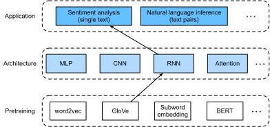

# Sentiment Analysis: Using Recurrent Neural Networks
:label:`sec_sentiment_rnn`


Like word similarity and analogy tasks,
we can also apply pretrained word vectors
to sentiment analysis.
Since the IMDb review dataset
in :numref:`sec_sentiment`
is not very big,
using text representations
that were pretrained
on large-scale corpora
may reduce overfitting of the model.
As a specific example
illustrated in :numref:`fig_nlp-map-sa-rnn`,
we will represent each token
using the pretrained GloVe model,
and feed these token representations
into a multilayer bidirectional RNN
to obtain the text sequence representation,
which will
be transformed into 
sentiment analysis outputs :cite:`Maas.Daly.Pham.ea.2011`.
For the same downstream application,
we will consider a different architectural
choice later.


:label:`fig_nlp-map-sa-rnn`

```{.python .input #sentiment-analysis-rnn-sentiment-analysis-using-recurrent-neural-networks}
#@tab mxnet
from d2l import mxnet as d2l
from mxnet import gluon, init, np, npx
from mxnet.gluon import nn, rnn
npx.set_np()

batch_size = 64
train_iter, test_iter, vocab = d2l.load_data_imdb(batch_size)
```

```{.python .input #sentiment-analysis-rnn-sentiment-analysis-using-recurrent-neural-networks}
#@tab pytorch
from d2l import torch as d2l
import torch
from torch import nn

batch_size = 64
train_iter, test_iter, vocab = d2l.load_data_imdb(batch_size)
```

```{.python .input #sentiment-analysis-rnn-sentiment-analysis-using-recurrent-neural-networks}
#@tab jax
from d2l import jax as d2l
import jax
from jax import numpy as jnp
import flax
from flax import linen as nn
import optax
import numpy as np

batch_size = 64
train_iter, test_iter, vocab = d2l.load_data_imdb(batch_size)
```

```{.python .input #sentiment-analysis-rnn-sentiment-analysis-using-recurrent-neural-networks}
#@tab tensorflow
from d2l import tensorflow as d2l
import tensorflow as tf
import keras
import numpy as np

batch_size = 64
train_iter, test_iter, vocab = d2l.load_data_imdb(batch_size)
# d2l.load_array uses shuffle(buffer_size=1000), which is too small for
# the IMDb training set (25000 examples ordered as 12500 positives then
# 12500 negatives). Reshuffle the full dataset so each epoch sees a
# properly mixed class distribution, matching the PyTorch/JAX behavior.
train_iter = (train_iter.unbatch()
              .shuffle(25000, reshuffle_each_iteration=True)
              .batch(batch_size))
```

## Representing Single Text with RNNs

In text classification tasks,
such as sentiment analysis,
a varying-length text sequence 
will be transformed into fixed-length categories.
In the following `BiRNN` class,
while each token of a text sequence
gets its individual
pretrained GloVe
representation via the embedding layer
(`self.embedding`),
the entire sequence
is encoded by a bidirectional RNN (`self.encoder`).
More concretely,
the hidden states (at the last layer)
of the bidirectional LSTM
at both the initial and final time steps
are concatenated 
as the representation of the text sequence.
This single text representation
is then transformed into output categories
by a fully connected layer (`self.decoder`)
with two outputs ("positive" and "negative").

```{.python .input #sentiment-analysis-rnn-representing-single-text-with-rnns-1}
#@tab mxnet
class BiRNN(nn.Block):
    def __init__(self, vocab_size, embed_size, num_hiddens,
                 num_layers):
        super().__init__()
        self.embedding = nn.Embedding(vocab_size, embed_size)
        # Set `bidirectional` to True to get a bidirectional RNN
        self.encoder = rnn.LSTM(num_hiddens, num_layers=num_layers,
                                bidirectional=True, input_size=embed_size)
        self.decoder = nn.Dense(2)

    def forward(self, inputs):
        # The shape of `inputs` is (batch size, no. of time steps). Because
        # LSTM requires its input's first dimension to be the temporal
        # dimension, the input is transposed before obtaining token
        # representations. The output shape is (no. of time steps, batch size,
        # word vector dimension)
        embeddings = self.embedding(inputs.T)
        # Returns hidden states of the last hidden layer at different time
        # steps. The shape of `outputs` is (no. of time steps, batch size,
        # 2 * no. of hidden units)
        outputs = self.encoder(embeddings)
        # Concatenate the hidden states at the initial and final time steps as
        # the input of the fully connected layer. Its shape is (batch size,
        # 4 * no. of hidden units)
        encoding = np.concatenate((outputs[0], outputs[-1]), axis=1)
        outs = self.decoder(encoding)
        return outs
```

```{.python .input #sentiment-analysis-rnn-representing-single-text-with-rnns-1}
#@tab pytorch
class BiRNN(nn.Module):
    def __init__(self, vocab_size, embed_size, num_hiddens,
                 num_layers, **kwargs):
        super(BiRNN, self).__init__(**kwargs)
        self.embedding = nn.Embedding(vocab_size, embed_size)
        # Set `bidirectional` to True to get a bidirectional RNN
        self.encoder = nn.LSTM(embed_size, num_hiddens, num_layers=num_layers,
                                bidirectional=True)
        self.decoder = nn.Linear(4 * num_hiddens, 2)

    def forward(self, inputs):
        # The shape of `inputs` is (batch size, no. of time steps). Because
        # LSTM requires its input's first dimension to be the temporal
        # dimension, the input is transposed before obtaining token
        # representations. The output shape is (no. of time steps, batch size,
        # word vector dimension)
        embeddings = self.embedding(inputs.T)
        self.encoder.flatten_parameters()
        # Returns hidden states of the last hidden layer at different time
        # steps. The shape of `outputs` is (no. of time steps, batch size,
        # 2 * no. of hidden units)
        outputs, _ = self.encoder(embeddings)
        # Concatenate the hidden states at the initial and final time steps as
        # the input of the fully connected layer. Its shape is (batch size,
        # 4 * no. of hidden units)
        encoding = torch.cat((outputs[0], outputs[-1]), dim=1)
        outs = self.decoder(encoding)
        return outs
```

```{.python .input #sentiment-analysis-rnn-representing-single-text-with-rnns-1}
#@tab jax
class BiRNN(nn.Module):
    vocab_size: int
    embed_size: int
    num_hiddens: int
    num_layers: int

    def setup(self):
        self.embedding = nn.Embed(self.vocab_size, self.embed_size)
        # Forward and backward LSTMs for bidirectional encoding
        self.forward_rnn = nn.RNN(
            nn.OptimizedLSTMCell(self.num_hiddens), reverse=False)
        self.backward_rnn = nn.RNN(
            nn.OptimizedLSTMCell(self.num_hiddens), reverse=True)
        self.decoder = nn.Dense(2)

    def __call__(self, inputs):
        # The shape of `inputs` is (batch size, no. of time steps)
        embeddings = self.embedding(inputs)
        # Run forward and backward RNNs
        # Each output shape is (batch size, no. of time steps, num_hiddens)
        forward_out = self.forward_rnn(embeddings)
        # Flax's `nn.RNN(..., reverse=True)` un-reverses its output back to
        # input order, so `backward_out[:, 0, :]` corresponds to the
        # backward LSTM having consumed the entire reversed sequence (its
        # *final* hidden) while `forward_out[:, -1, :]` is the forward
        # LSTM's final hidden. Concatenate these two: shape (batch size,
        # 2 * num_hiddens).
        backward_out = self.backward_rnn(embeddings)
        encoding = jnp.concatenate(
            [forward_out[:, -1, :], backward_out[:, 0, :]], axis=1)
        outs = self.decoder(encoding)
        return outs
```

```{.python .input #sentiment-analysis-rnn-representing-single-text-with-rnns-1}
#@tab tensorflow
class BiRNN(d2l.Classifier):
    def __init__(self, vocab_size, embed_size, num_hiddens, num_layers,
                 **kwargs):
        super().__init__(**kwargs)
        self.embedding = keras.layers.Embedding(vocab_size, embed_size)
        # Stack bidirectional LSTM layers; all layers return the full
        # sequence so we can concatenate the initial- and final-step
        # hidden states downstream.
        self.encoder = keras.Sequential([
            keras.layers.Bidirectional(
                keras.layers.LSTM(num_hiddens, return_sequences=True))
            for _ in range(num_layers - 1)
        ] + [
            keras.layers.Bidirectional(
                keras.layers.LSTM(num_hiddens, return_sequences=True))
        ])
        self.decoder = keras.layers.Dense(2)

    def call(self, inputs, training=False):
        # inputs shape: (batch_size, num_steps)
        embeddings = self.embedding(inputs)
        # outputs shape: (batch_size, num_steps, 2 * num_hiddens)
        outputs = self.encoder(embeddings, training=training)
        # Concatenate hidden states at initial and final time steps
        # Shape: (batch_size, 4 * num_hiddens)
        encoding = tf.concat([outputs[:, 0, :], outputs[:, -1, :]], axis=1)
        outs = self.decoder(encoding)
        return outs
```

Let's construct a bidirectional RNN with two hidden layers to represent single text for sentiment analysis.

```{.python .input #sentiment-analysis-rnn-representing-single-text-with-rnns-2}
embed_size, num_hiddens, num_layers, devices = 100, 100, 2, d2l.try_all_gpus()
net = BiRNN(len(vocab), embed_size, num_hiddens, num_layers)
```

```{.python .input #sentiment-analysis-rnn-representing-single-text-with-rnns-3}
#@tab mxnet
# Per-block init: Gluon 2.0's Xavier rejects 1D weights, and the fused LSTM
# has 1D internal weights. Initialize Xavier on the 2D blocks; let the LSTM
# use its default initializer.
net.embedding.initialize(init.Xavier(), ctx=devices)
net.encoder.initialize(ctx=devices)
net.decoder.initialize(init.Xavier(), ctx=devices)
```

```{.python .input #sentiment-analysis-rnn-representing-single-text-with-rnns-3}
#@tab pytorch
def init_weights(module):
    if type(module) == nn.Linear:
        nn.init.xavier_uniform_(module.weight)
    if type(module) == nn.LSTM:
        for param in module._flat_weights_names:
            if "weight" in param:
                nn.init.xavier_uniform_(module._parameters[param])
net.apply(init_weights);
```

```{.python .input #sentiment-analysis-rnn-representing-single-text-with-rnns-3}
#@tab jax
# JAX/Flax modules are initialized lazily; we initialize parameters here
dummy_input = jnp.ones((1, 500), dtype=jnp.int32)
params = net.init(jax.random.PRNGKey(0), dummy_input)
```

```{.python .input #sentiment-analysis-rnn-representing-single-text-with-rnns-3}
#@tab tensorflow
# Build the model by calling it once on a dummy input
dummy_input = tf.zeros((1, 500), dtype=tf.int32)
net(dummy_input)
```

## Loading Pretrained Word Vectors

Below we load the pretrained 100-dimensional (needs to be consistent with `embed_size`) GloVe embeddings for tokens in the vocabulary.

```{.python .input #sentiment-analysis-rnn-loading-pretrained-word-vectors-1}
glove_embedding = d2l.TokenEmbedding('glove.6b.100d')
```

Print the shape of the vectors
for all the tokens in the vocabulary.

```{.python .input #sentiment-analysis-rnn-loading-pretrained-word-vectors-2}
embeds = glove_embedding[vocab.idx_to_token]
embeds.shape
```

We use these pretrained
word vectors
to represent tokens in the reviews
and will not update
these vectors during training.

```{.python .input #sentiment-analysis-rnn-loading-pretrained-word-vectors-3}
#@tab mxnet
net.embedding.weight.set_data(embeds)
for p in net.embedding.collect_params().values():
    p.grad_req = 'null'
```

```{.python .input #sentiment-analysis-rnn-loading-pretrained-word-vectors-3}
#@tab pytorch
net.embedding.weight.data.copy_(embeds)
net.embedding.weight.requires_grad = False
```

```{.python .input #sentiment-analysis-rnn-loading-pretrained-word-vectors-3}
#@tab jax
# Set pretrained embedding weights in the parameters
params = flax.core.unfreeze(params)
params['params']['embedding']['embedding'] = jnp.array(embeds)
params = flax.core.freeze(params)
```

```{.python .input #sentiment-analysis-rnn-loading-pretrained-word-vectors-3}
#@tab tensorflow
net.embedding.set_weights([np.array(embeds)])
net.embedding.trainable = False
```

## Training and Evaluating the Model

Now we can train the bidirectional RNN for sentiment analysis.

```{.python .input #sentiment-analysis-rnn-training-and-evaluating-the-model-1}
#@tab mxnet
# Adam's per-step update is ~lr * normalized_step, so unlike SGD it
# doesn't need a 1/batch_size rescale to match PyTorch's lr=0.01
# under d2l.train_batch_ch13's trainer.step(1).
lr, num_epochs = 0.01, 5
trainer = gluon.Trainer(net.collect_params(), 'adam', {'learning_rate': lr})
loss = gluon.loss.SoftmaxCrossEntropyLoss()
d2l.train_ch13(net, train_iter, test_iter, loss, trainer, num_epochs, devices)
```

```{.python .input #sentiment-analysis-rnn-training-and-evaluating-the-model-1}
#@tab pytorch
lr, num_epochs = 0.01, 5
trainer = torch.optim.Adam(net.parameters(), lr=lr)
loss = nn.CrossEntropyLoss(reduction="none")
d2l.train_ch13(net, train_iter, test_iter, loss, trainer, num_epochs, devices)
```

```{.python .input #sentiment-analysis-rnn-training-and-evaluating-the-model-1}
#@tab jax
lr, num_epochs = 0.01, 5
# Work with the inner params dict directly so JIT caches across iterations
params_p = params['params']
optimizer = optax.adam(lr)
opt_state = optimizer.init(params_p)
loss_fn = optax.softmax_cross_entropy_with_integer_labels

@jax.jit
def train_step(params_p, opt_state, X, y):
    def compute_loss(p):
        logits = net.apply({'params': p}, X)
        return loss_fn(logits, y).mean(), logits
    (loss, logits), grads = jax.value_and_grad(
        compute_loss, has_aux=True)(params_p)
    updates, opt_state = optimizer.update(grads, opt_state, params_p)
    params_p = optax.apply_updates(params_p, updates)
    return params_p, opt_state, loss, logits

@jax.jit
def eval_step(params_p, X):
    return net.apply({'params': params_p}, X)

for epoch in range(num_epochs):
    metric = d2l.Accumulator(4)
    for X, y in train_iter:
        params_p, opt_state, l, logits = train_step(
            params_p, opt_state, X, y)
        metric.add(float(l) * len(y), float((logits.argmax(axis=-1) == y).sum()),
                   len(y), len(y))
    # Evaluate
    correct, total = 0, 0
    for X, y in test_iter:
        logits = eval_step(params_p, X)
        correct += int((logits.argmax(axis=-1) == y).sum())
        total += len(y)
    print(f'epoch {epoch + 1}, loss {metric[0] / metric[2]:.3f}, '
          f'train acc {metric[1] / metric[3]:.3f}, '
          f'test acc {correct / total:.3f}')
# Re-wrap params for downstream use (e.g. predict_sentiment)
params = {'params': params_p}
```

```{.python .input #sentiment-analysis-rnn-training-and-evaluating-the-model-1}
#@tab tensorflow
lr, num_epochs = 0.01, 5
net.compile(optimizer=keras.optimizers.Adam(lr),
            loss=keras.losses.SparseCategoricalCrossentropy(from_logits=True),
            metrics=['accuracy'])
net.fit(train_iter, validation_data=test_iter, epochs=num_epochs)
```

We define the following function to predict the sentiment of a text sequence using the trained model `net`.

```{.python .input #sentiment-analysis-rnn-training-and-evaluating-the-model-2}
#@tab mxnet
#@save
def predict_sentiment(net, vocab, sequence):
    """Predict the sentiment of a text sequence."""
    sequence = np.array(vocab[sequence.split()], ctx=d2l.try_gpu())
    label = np.argmax(net(sequence.reshape(1, -1)), axis=1)
    return 'positive' if label == 1 else 'negative'
```

```{.python .input #sentiment-analysis-rnn-training-and-evaluating-the-model-2}
#@tab pytorch
#@save
def predict_sentiment(net, vocab, sequence):
    """Predict the sentiment of a text sequence."""
    sequence = torch.tensor(vocab[sequence.split()], device=d2l.try_gpu())
    label = torch.argmax(net(sequence.reshape(1, -1)), dim=1)
    return 'positive' if label == 1 else 'negative'
```

```{.python .input #sentiment-analysis-rnn-training-and-evaluating-the-model-2}
#@tab jax
#@save
def predict_sentiment(net, params, vocab, sequence):
    """Predict the sentiment of a text sequence."""
    sequence = jnp.array(vocab[sequence.split()])
    label = jnp.argmax(net.apply(params, sequence.reshape(1, -1)), axis=1)
    return 'positive' if label == 1 else 'negative'
```

```{.python .input #sentiment-analysis-rnn-training-and-evaluating-the-model-2}
#@tab tensorflow
#@save
def predict_sentiment(net, vocab, sequence):
    """Predict the sentiment of a text sequence."""
    sequence = tf.constant(vocab[sequence.split()], dtype=tf.int32)
    sequence = tf.reshape(sequence, (1, -1))
    label = tf.argmax(net(sequence, training=False), axis=1)
    return 'positive' if int(label[0]) == 1 else 'negative'
```

Finally, let's use the trained model to predict the sentiment for two simple sentences.

```{.python .input #sentiment-analysis-rnn-training-and-evaluating-the-model-3}
#@tab mxnet, pytorch
predict_sentiment(net, vocab, 'this movie is so great')
```

```{.python .input #sentiment-analysis-rnn-training-and-evaluating-the-model-3}
#@tab jax
predict_sentiment(net, params, vocab, 'this movie is so great')
```

```{.python .input #sentiment-analysis-rnn-training-and-evaluating-the-model-3}
#@tab tensorflow
predict_sentiment(net, vocab, 'this movie is so great')
```

```{.python .input #sentiment-analysis-rnn-training-and-evaluating-the-model-4}
#@tab mxnet, pytorch
predict_sentiment(net, vocab, 'this movie is so bad')
```

```{.python .input #sentiment-analysis-rnn-training-and-evaluating-the-model-4}
#@tab jax
predict_sentiment(net, params, vocab, 'this movie is so bad')
```

```{.python .input #sentiment-analysis-rnn-training-and-evaluating-the-model-4}
#@tab tensorflow
predict_sentiment(net, vocab, 'this movie is so bad')
```

## Summary

* Pretrained word vectors can represent individual tokens in a text sequence.
* Bidirectional RNNs can represent a text sequence, such as via the concatenation of its hidden states at the initial and final time steps. This single text representation can be transformed into categories using a fully connected layer.


## Exercises

1. Increase the number of epochs. Can you improve the training and testing accuracies? How about tuning other hyperparameters?
1. Use larger pretrained word vectors, such as 300-dimensional GloVe embeddings. Does it improve classification accuracy?
1. Can we improve the classification accuracy by using the spaCy tokenization? You need to install spaCy (`pip install spacy`) and install the English package (`python -m spacy download en_core_web_sm`). In the code, first, import spaCy (`import spacy`). Then, load the spaCy English package (`spacy_en = spacy.load('en_core_web_sm')`). Finally, define the function `def tokenizer(text): return [tok.text for tok in spacy_en.tokenizer(text)]` and replace the original `tokenizer` function. Note the different forms of phrase tokens in GloVe and spaCy. For example, the phrase token "new york" takes the form of "new-york" in GloVe and the form of "new york" after the spaCy tokenization.

:begin_tab:`mxnet`
[Discussions](https://d2l.discourse.group/t/392)
:end_tab:

:begin_tab:`pytorch`
[Discussions](https://d2l.discourse.group/t/1424)
:end_tab:

:begin_tab:`jax`
[Discussions](https://d2l.discourse.group/t/1424)
:end_tab:

:begin_tab:`tensorflow`
[Discussions](https://d2l.discourse.group/t/1424)
:end_tab:

<!-- slides -->

::: {.slide title="Sentiment RNN"}
Sentiment classification on IMDb: pretrained word vectors
→ bidirectional LSTM → linear head. Standard
pre-Transformer text-classification recipe.

The encoder reads the review left-to-right and
right-to-left; concatenated final hidden states feed a
binary classifier. GloVe gives a strong initialization
that the LSTM then specializes for sentiment.
:::

::: {.slide title="Pipeline"}
{width=82%}
:::

::: {.slide title="Setup"}
@sentiment-analysis-rnn-sentiment-analysis-using-recurrent-neural-networks
:::

::: {.slide title="BiRNN classifier"}
Class definition: embedding -> bidirectional LSTM -> concatenate
the first and last hidden states -> 2-way decoder. The decoder
input has width $4h$: two directions times two endpoint states.

@sentiment-analysis-rnn-representing-single-text-with-rnns-1
:::

::: {.slide title="BiRNN instance"}
Instantiate a 2-layer BiLSTM with 100-dimensional embeddings and
100 hidden units. Frameworks initialize recurrent weights
differently, but the model contract is the same:

@sentiment-analysis-rnn-representing-single-text-with-rnns-2

. . .

@sentiment-analysis-rnn-representing-single-text-with-rnns-3
:::

::: {.slide title="Loading pretrained GloVe"}
Use 100-dim GloVe vectors trained on Wikipedia + Gigaword.
Initialize the embedding layer from them; freeze or
fine-tune (we **freeze** — we do not update the pretrained
GloVe vectors):

@sentiment-analysis-rnn-loading-pretrained-word-vectors-1

. . .

@sentiment-analysis-rnn-loading-pretrained-word-vectors-2

. . .

@sentiment-analysis-rnn-loading-pretrained-word-vectors-3
:::

::: {.slide title="Training"}
Standard cross-entropy + Adam. Watch validation accuracy, not
just training loss; sentiment models overfit quickly on IMDb if
the embedding and classifier are too large:

@sentiment-analysis-rnn-training-and-evaluating-the-model-1

. . .

@sentiment-analysis-rnn-training-and-evaluating-the-model-2
:::

::: {.slide title="Predict on new reviews"}
The final check should classify clearly positive and clearly
negative synthetic reviews differently. This is not a full
evaluation, but it catches label/order mistakes in the pipeline.

@sentiment-analysis-rnn-training-and-evaluating-the-model-3

. . .

@sentiment-analysis-rnn-training-and-evaluating-the-model-4
:::

::: {.slide title="Recap"}
- BiLSTM-on-GloVe: a strong pre-Transformer baseline for
  text classification.
- Pretrained embeddings carry general-purpose word
  semantics; LSTM specializes for sentiment.
- Easily beaten today by fine-tuned BERT, but a clean
  template for sequence-to-label tasks more broadly.
:::
