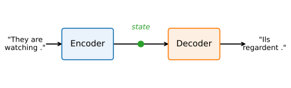
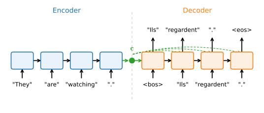

# Encoder-Decoder Models for Sequence Transduction
:label:`sec_seq2seq`

The language models of :numref:`chap_rnn` read a sequence and continue it. Many
of the most useful problems in machine learning have a different shape: read one
sequence and emit a *different* one. Translate an English sentence into French,
transcribe an audio clip into words, summarize a document, answer a question.
The input and the output are both sequences, they usually have different lengths,
and their tokens need not line up position by position. Problems of this kind are
called *sequence transduction*, or *sequence-to-sequence* (seq2seq) learning, and
they were the arena in which recurrent networks first beat classical pipelines at
scale :cite:`Sutskever.Vinyals.Le.2014,Cho.Van-Merrienboer.Gulcehre.ea.2014`.

This section is deliberately historical: it builds the 2014 system that taught
the field what sequence transduction demands, using the recurrent tools of
:numref:`chap_modern_rnn`. You have already met both of its successors — the
attention of :numref:`chap_attention` grew directly out of this model's central
weakness, and the transformer encoder-decoders of :numref:`sec_transformer`
displaced it outright — so read it as the baseline that the rest of this part,
and much of the modern field, is measured against. We introduce the
*encoder-decoder* abstraction that organizes almost every transduction model
built since, assemble a small English-to-French translator from two GRUs, train
it with the teacher forcing of :numref:`sec_rnn` and a masked loss, translate
with the decoding strategies of :numref:`sec_decoding`, and score the results
with a character-level metric. We end by *measuring* the weakness itself: the
encoder squeezes the entire source through a single fixed-size vector, and that
bottleneck is where attention began.

```{.python .input}
%load_ext d2lbook.tab
tab.interact_select('mxnet', 'pytorch', 'tensorflow', 'jax')
```

```{.python .input #seq2seq-imports}
%%tab mxnet
import collections
import math
from d2l import mxnet as d2l
from mxnet import np, npx, init, gluon
from mxnet.gluon import nn
npx.set_np()
```

```{.python .input #seq2seq-imports}
%%tab pytorch
import collections
import math
from d2l import torch as d2l
import torch
from torch import nn
```

```{.python .input #seq2seq-imports}
%%tab tensorflow
import collections
import math
from d2l import tensorflow as d2l
import tensorflow as tf
```

```{.python .input #seq2seq-imports}
%%tab jax
import collections
import math
from d2l import jax as d2l
from flax import nnx
import jax
from jax import numpy as jnp
import optax
```

## Sequence Transduction and the Abstraction
:label:`sec_encoder-decoder`

The trick that makes transduction tractable is to split the model in two
(:numref:`fig_encoder_decoder`). An *encoder* consumes the variable-length source
sequence and compresses it into an intermediate state of fixed shape. A *decoder*
consumes that state and produces the variable-length target, one token at a time.
The state is the sole channel between them: everything the decoder ever learns
about the source, it learns through that one object.


:label:`fig_encoder_decoder`

The decoder half should look familiar: it *is* a language model in the sense of
:numref:`sec_language-model`, factorizing the target probability autoregressively,
only now every factor is additionally conditioned on the encoder state
$\mathbf{c}$,

$$P(y_1, \ldots, y_{T'} \mid x_1, \ldots, x_T) = \prod_{t'=1}^{T'} P(y_{t'} \mid y_1, \ldots, y_{t'-1}, \mathbf{c}).$$
:eqlabel:`eq_seq2seq_conditional`

A decoder is a *conditional* language model, and conditioning is the whole game:
the same next-token machinery, pointed at a source. This is why the abstraction
long outlived the RNN that first filled it. Swap the encoder for a convolutional
audio front-end and you have Whisper transcribing speech; swap it for a vision
backbone and you have an image-captioning model; feed it text and images together
and you have the multimodal front-ends of current assistants. The shape in
:numref:`fig_encoder_decoder` survives; only the encoder changes.

Because the abstraction is reused so widely, it pays to fix it in code as a pair
of interfaces before committing to any particular network. The encoder exposes a
single method that maps an input to outputs. Later stages may need side
information, such as the length of the source excluding padding, so we allow
extra positional arguments.

```{.python .input #seq2seq-abstraction-encoder}
%%tab mxnet
class Encoder(nn.Block):  #@save
    """The base encoder interface for the encoder-decoder architecture."""
    def __init__(self):
        super().__init__()

    # Later there can be additional arguments (e.g., length excluding padding)
    def forward(self, X, *args):
        raise NotImplementedError
```

```{.python .input #seq2seq-abstraction-encoder}
%%tab pytorch
class Encoder(nn.Module):  #@save
    """The base encoder interface for the encoder-decoder architecture."""
    def __init__(self):
        super().__init__()

    # Later there can be additional arguments (e.g., length excluding padding)
    def forward(self, X, *args):
        raise NotImplementedError
```

```{.python .input #seq2seq-abstraction-encoder}
%%tab tensorflow
class Encoder(tf.keras.layers.Layer):  #@save
    """The base encoder interface for the encoder-decoder architecture."""
    def __init__(self):
        super().__init__()

    # Later there can be additional arguments (e.g., length excluding padding)
    def call(self, X, *args):
        raise NotImplementedError
```

```{.python .input #seq2seq-abstraction-encoder}
%%tab jax
class Encoder(nnx.Module):  #@save
    """The base encoder interface for the encoder-decoder architecture."""
    # Later there can be additional arguments (e.g., length excluding padding)
    def __call__(self, X, *args):
        raise NotImplementedError
```

The decoder adds one method, `init_state`, that turns the encoder output into
whatever the decoder wants to carry as its running state, plus a `forward` that
maps the next input token and the current state to an output and an updated state.

```{.python .input #seq2seq-abstraction-decoder}
%%tab mxnet
class Decoder(nn.Block):  #@save
    """The base decoder interface for the encoder-decoder architecture."""
    def __init__(self):
        super().__init__()

    def init_state(self, enc_all_outputs, *args):
        raise NotImplementedError

    def forward(self, X, state):
        raise NotImplementedError
```

```{.python .input #seq2seq-abstraction-decoder}
%%tab pytorch
class Decoder(nn.Module):  #@save
    """The base decoder interface for the encoder-decoder architecture."""
    def __init__(self):
        super().__init__()

    def init_state(self, enc_all_outputs, *args):
        raise NotImplementedError

    def forward(self, X, state):
        raise NotImplementedError
```

```{.python .input #seq2seq-abstraction-decoder}
%%tab tensorflow
class Decoder(tf.keras.layers.Layer):  #@save
    """The base decoder interface for the encoder-decoder architecture."""
    def __init__(self):
        super().__init__()

    def init_state(self, enc_all_outputs, *args):
        raise NotImplementedError

    def call(self, X, state):
        raise NotImplementedError
```

```{.python .input #seq2seq-abstraction-decoder}
%%tab jax
class Decoder(nnx.Module):  #@save
    """The base decoder interface for the encoder-decoder architecture."""
    def init_state(self, enc_all_outputs, *args):
        raise NotImplementedError

    def __call__(self, X, state):
        raise NotImplementedError
```

Wiring them together is a three-line class: run the encoder, hand its output to
`init_state`, then run the decoder. Subclassing `d2l.Classifier` gives us the
training loop and the softmax cross-entropy loss for free, so a concrete
model needs to specify only the encoder, the decoder, and how the two
connect.

```{.python .input #seq2seq-abstraction-together}
%%tab mxnet, pytorch
class EncoderDecoder(d2l.Classifier):  #@save
    """The base class for the encoder-decoder architecture."""
    def __init__(self, encoder, decoder):
        super().__init__()
        self.encoder = encoder
        self.decoder = decoder

    def forward(self, enc_X, dec_X, *args):
        enc_all_outputs = self.encoder(enc_X, *args)
        dec_state = self.decoder.init_state(enc_all_outputs, *args)
        # Return decoder output only
        return self.decoder(dec_X, dec_state)[0]
```

```{.python .input #seq2seq-abstraction-together}
%%tab tensorflow
class EncoderDecoder(d2l.Classifier):  #@save
    """The base class for the encoder-decoder architecture."""
    def __init__(self, encoder, decoder):
        super().__init__()
        self.encoder = encoder
        self.decoder = decoder

    def call(self, enc_X, dec_X, *args, training=None):
        enc_all_outputs = self.encoder(enc_X, *args, training=training)
        dec_state = self.decoder.init_state(enc_all_outputs, *args)
        # Return decoder output only
        return self.decoder(dec_X, dec_state, training=training)[0]
```

```{.python .input #seq2seq-abstraction-together}
%%tab jax
class EncoderDecoder(d2l.Classifier):  #@save
    """The base class for the encoder-decoder architecture."""
    def __init__(self, encoder, decoder):
        super().__init__()
        self.encoder = encoder
        self.decoder = decoder

    def forward(self, enc_X, dec_X, *args):
        enc_all_outputs = self.encoder(enc_X, *args)
        dec_state = self.decoder.init_state(enc_all_outputs, *args)
        # Return decoder output only
        return self.decoder(dec_X, dec_state)[0]
```

## The Machine Translation Dataset
:label:`sec_machine_translation`

To make the abstraction concrete we need data. We use a small English-French
corpus of sentence pairs from the [Tatoeba Project](http://www.manythings.org/anki/):
each line is a tab-separated pair, an English *source* and its French *target*.
Statistical machine translation on corpora like this
:cite:`Brown.Cocke.Della-Pietra.ea.1990` was, for decades, the flagship
application that drove sequence modeling forward, and it remains the cleanest
task on which to see an encoder-decoder learn.

Tokenization follows :numref:`sec_text-sequence` exactly: a byte-level BPE
tokenizer, trained here on both languages at once to yield a *single shared
vocabulary*. Sharing one vocabulary across source and target is standard practice
in translation :cite:`Sennrich.Haddow.Birch.2015`. English and French overlap
heavily in the Latin alphabet, in punctuation, and in outright shared words
("nation", "possible"), so a joint vocabulary spends its budget where it is
actually needed and lets a token learned on one side transfer to the other; and
because BPE starts from raw bytes, no word in either language is ever out of
vocabulary. Our tokenizer reserves the three special ids the batching below
needs: `<pad>`, `<bos>`, and `<eos>`.

Batching pads or truncates every sentence to a fixed length `num_steps`. We append
`<eos>` to mark where a sequence ends (so the decoder can learn to stop), pad
short sentences with `<pad>` to a common length, and truncate long ones. Targets
additionally get a `<bos>` prefix: the decoder is fed the target shifted right (by
one, starting from `<bos>`), and is trained to predict the target shifted left
(ending in `<eos>`), which is exactly the teacher forcing of :numref:`sec_rnn`.
We also record each source's length excluding padding, the bookkeeping an
attention-based decoder uses to mask padded positions
(:numref:`sec_attention-scoring-functions`); our recurrent model here never
reads it.

```{.python .input #seq2seq-mtfraeng}
class MTFraEng(d2l.DataModule):  #@save
    """The English-French dataset, tokenized with a shared byte-level BPE."""
    def __init__(self, batch_size, num_steps=20, num_train=1024, num_val=128,
                 vocab_size=4000):
        super().__init__()
        self.save_hyperparameters()
        pairs = self._pairs(self._preprocess(self._download()))
        # Train ONE shared byte-level BPE over both languages.
        m = min(5000, len(pairs))
        self.tokenizer = d2l.BPETokenizer(
            vocab_size, pattern=d2l.BPETokenizer.GPT2_PATTERN)
        self.tokenizer.train('\n'.join([p[0] for p in pairs[:m]] +
                                       [p[1] for p in pairs[:m]]))
        # src_vocab / tgt_vocab both refer to the shared tokenizer.
        self.src_vocab = self.tgt_vocab = self.tokenizer
        pairs = pairs[:num_train + num_val]
        self.src_sents = [p[0] for p in pairs]
        self.tgt_sents = [p[1] for p in pairs]
        self.arrays = self._encode(pairs)

    def _download(self):
        d2l.extract(d2l.download(
            d2l.DATA_URL + 'fra-eng.zip', self.root,
            '94646ad1522d915e7b0f9296181140edcf86a4f5'))
        with open(self.root + '/fra-eng/fra.txt', encoding='utf-8') as f:
            return f.read()

    def _preprocess(self, text):
        # Normalize spaces, lowercase, and put a space before punctuation.
        text = text.replace(' ', ' ').replace('\xa0', ' ').lower()
        no_space = lambda c, prev: c in ',.!?' and prev != ' '
        return ''.join([' ' + c if i > 0 and no_space(c, text[i - 1]) else c
                        for i, c in enumerate(text)])

    def _pairs(self, text):
        return [ln.split('\t') for ln in text.split('\n') if ln.count('\t') == 1]
```

The `_encode` method turns a list of sentence pairs into the four arrays every
batch carries: the padded source, the decoder input (target with `<bos>`), the
source length excluding padding, and the label (target with `<eos>`). Because it
takes an explicit list of pairs, we reuse it both to build the dataset and,
later, to encode arbitrary sentences we want to translate.

```{.python .input #seq2seq-mtfraeng-encode}
@d2l.add_to_class(MTFraEng)  #@save
def _encode(self, pairs):
    tok, t = self.tokenizer, self.num_steps
    def row(sent, is_tgt):
        ids = tok.encode(sent)
        ids = (ids[:t - 1] + [tok.eos] if len(ids) >= t else
               ids + [tok.eos] + [tok.pad] * (t - 1 - len(ids)))
        return [tok.bos] + ids if is_tgt else ids
    src = d2l.tensor([row(s, False) for s, _ in pairs])
    tgt = d2l.tensor([row(t, True) for _, t in pairs])
    valid_len = d2l.reduce_sum(d2l.astype(src != tok.pad, d2l.int32), 1)
    return src, tgt[:, :-1], valid_len, tgt[:, 1:]

@d2l.add_to_class(MTFraEng)  #@save
def build(self, src_sentences, tgt_sentences):
    return self._encode([(self._preprocess(s), self._preprocess(t))
                         for s, t in zip(src_sentences, tgt_sentences)])

@d2l.add_to_class(MTFraEng)  #@save
def get_dataloader(self, train):
    idx = slice(0, self.num_train) if train else slice(self.num_train, None)
    return self.get_tensorloader(self.arrays, train, idx)
```

Two small shims let the shared tokenizer stand in for the `src_vocab` /
`tgt_vocab` interface that later chapters expect, mapping a special token to its
id and a list of ids back to token strings.

```{.python .input #seq2seq-vocab-shims}
@d2l.add_to_class(d2l.BPETokenizer)  #@save
def __getitem__(self, token):
    return self.specials[token]

@d2l.add_to_class(d2l.BPETokenizer)  #@save
def to_tokens(self, ids):
    return [self.decode([int(i)]) for i in ids]
```

Let us instantiate the dataset and read one small batch. The four tensors are the
source, the decoder input (note the leading `<bos>` id), the source valid length,
and the label (the target shifted one step left).

```{.python .input #seq2seq-mtfraeng-batch}
data = MTFraEng(batch_size=3)
src, dec_in, src_valid_len, label = next(iter(data.train_dataloader()))
print('source:', d2l.astype(src, d2l.int32))
print('decoder input:', d2l.astype(dec_in, d2l.int32))
print('source valid length:', d2l.astype(src_valid_len, d2l.int32))
print('shared vocabulary size:', len(data.tokenizer))
```

Padding is a real cost, so it is worth seeing how much of it we do. The histogram
below plots the distribution of tokenized sentence lengths for the two languages.
Most sentences are short, which is why a modest `num_steps` suffices, and it is
this same skew that makes a masked loss (below) worthwhile: without masking, the
padding on short sentences would dominate the gradient.

```{.python .input #seq2seq-length-hist-fn}
def show_list_len_pair_hist(legend, xlabel, ylabel, xlist, ylist):  #@save
    """Plot the histogram for list length pairs."""
    d2l.set_figsize()
    _, _, patches = d2l.plt.hist(
        [[len(l) for l in xlist], [len(l) for l in ylist]])
    d2l.plt.xlabel(xlabel)
    d2l.plt.ylabel(ylabel)
    for patch in patches[1].patches:
        patch.set_hatch('/')
    d2l.plt.legend(legend)
```

```{.python .input #seq2seq-length-hist}
src_ids = [data.tokenizer.encode(s) for s in data.src_sents]
tgt_ids = [data.tokenizer.encode(s) for s in data.tgt_sents]
show_list_len_pair_hist(['source', 'target'], '# tokens per sentence',
                        'count', src_ids, tgt_ids);
```

## The Seq2Seq Model

We now fill the two interfaces with GRUs (:numref:`sec_gru`). The GRU is a natural
choice: its gated additive state carries information across the sentence without
the vanishing gradients that would cripple a vanilla RNN encoder.

### The Encoder

The encoder embeds each source token and runs a multilayer GRU over the sequence.
It returns the per-step hidden states of the top layer together with the final
hidden state of every layer; the latter is the context $\mathbf{c}$ of
:numref:`fig_encoder_decoder`, a fixed-shape summary of the whole source.

One detail of initialization matters enough to name. The seq2seq paper
:cite:`Sutskever.Vinyals.Le.2014` initializes weights with Xavier-uniform, which
frameworks do not all do by default. In PyTorch we apply a small helper via
`module.apply`; MXNet passes `init.Xavier()` directly; TensorFlow's Keras layers
already default to Xavier (glorot-uniform); and the Flax NNX layers default to
LeCun-normal input weights with orthogonal recurrent weights, a combination
already well suited to RNNs, so we leave it in place.

```{.python .input #seq2seq-init}
%%tab pytorch
def init_seq2seq(module):  #@save
    """Initialize weights for sequence-to-sequence learning."""
    if type(module) == nn.Linear:
        nn.init.xavier_uniform_(module.weight)
    if type(module) == nn.GRU:
        for param in module._flat_weights_names:
            if "weight" in param:
                nn.init.xavier_uniform_(module._parameters[param])
```

```{.python .input #seq2seq-encoder}
%%tab mxnet
class Seq2SeqEncoder(d2l.Encoder):  #@save
    """The RNN encoder for sequence-to-sequence learning."""
    def __init__(self, vocab_size, embed_size, num_hiddens, num_layers,
                 dropout=0):
        super().__init__()
        self.embedding = nn.Embedding(vocab_size, embed_size)
        self.rnn = d2l.GRU(embed_size, num_hiddens, num_layers, dropout)
        self.embedding.initialize(init.Xavier())
        self.rnn.initialize()

    def forward(self, X, *args):
        embs = self.embedding(d2l.transpose(X))
        outputs, state = self.rnn(embs)
        # outputs: (num_steps, batch_size, num_hiddens)
        # state: (num_layers, batch_size, num_hiddens)
        return outputs, state
```

```{.python .input #seq2seq-encoder}
%%tab pytorch
class Seq2SeqEncoder(d2l.Encoder):  #@save
    """The RNN encoder for sequence-to-sequence learning."""
    def __init__(self, vocab_size, embed_size, num_hiddens, num_layers,
                 dropout=0):
        super().__init__()
        self.embedding = nn.Embedding(vocab_size, embed_size)
        self.rnn = d2l.GRU(embed_size, num_hiddens, num_layers, dropout)
        self.apply(init_seq2seq)

    def forward(self, X, *args):
        embs = self.embedding(d2l.astype(d2l.transpose(X), d2l.int64))
        outputs, state = self.rnn(embs)
        # outputs: (num_steps, batch_size, num_hiddens)
        # state: (num_layers, batch_size, num_hiddens)
        return outputs, state
```

```{.python .input #seq2seq-encoder}
%%tab tensorflow
class Seq2SeqEncoder(d2l.Encoder):  #@save
    """The RNN encoder for sequence-to-sequence learning."""
    def __init__(self, vocab_size, embed_size, num_hiddens, num_layers,
                 dropout=0):
        super().__init__()
        self.embedding = tf.keras.layers.Embedding(vocab_size, embed_size)
        self.rnn = d2l.GRU(embed_size, num_hiddens, num_layers, dropout)

    def call(self, X, *args):
        embs = self.embedding(d2l.transpose(X))
        outputs, state = self.rnn(embs)
        # outputs: (num_steps, batch_size, num_hiddens)
        # state: (num_layers, batch_size, num_hiddens)
        return outputs, state
```

```{.python .input #seq2seq-encoder}
%%tab jax
class Seq2SeqEncoder(d2l.Encoder):  #@save
    """The RNN encoder for sequence-to-sequence learning."""
    def __init__(self, vocab_size, embed_size, num_hiddens, num_layers,
                 dropout=0, rngs=None):
        rngs = nnx.Rngs(params=0, dropout=1, carry=2) if rngs is None else rngs
        self.embedding = nnx.Embed(vocab_size, embed_size, rngs=rngs)
        self.rnn = d2l.GRU(embed_size, num_hiddens, num_layers, dropout,
                           rngs=rngs)

    def __call__(self, X, *args):
        embs = self.embedding(d2l.astype(d2l.transpose(X), d2l.int64))
        outputs, state = self.rnn(embs)
        # outputs: (num_steps, batch_size, num_hiddens)
        # state: (num_layers, batch_size, num_hiddens)
        return outputs, state
```

A quick shape check confirms the interface. On a batch of 4 sequences of length 9
with a two-layer GRU of width 16, the per-step outputs have shape (`num_steps`,
`batch_size`, `num_hiddens`) and the final state has one hidden vector per layer.

```{.python .input #seq2seq-encoder-check}
%%tab all
vocab_size, embed_size, num_hiddens, num_layers = 10, 8, 16, 2
batch_size, num_steps = 4, 9
encoder = Seq2SeqEncoder(vocab_size, embed_size, num_hiddens, num_layers)
X = d2l.zeros((batch_size, num_steps))
enc_outputs, enc_state = encoder(X)
d2l.check_shape(enc_outputs, (num_steps, batch_size, num_hiddens))
```

### The Decoder

The decoder generates the target autoregressively. At target step $t'$ it takes
the previous target token $y_{t'-1}$, its own previous hidden state
$\mathbf{s}_{t'-1}$, and the context $\mathbf{c}$, and produces a distribution
over the next token:

$$\mathbf{s}_{t'} = g(y_{t'-1}, \mathbf{c}, \mathbf{s}_{t'-1}).$$
:eqlabel:`eq_seq2seq_s_t`

We realize $g$ with two design choices. First, the decoder's initial hidden state
is the encoder's final hidden state, which requires the two GRUs to share width
and depth. Second, to keep the source in view at every step and not only the
first, we concatenate the context $\mathbf{c}$ (the encoder's top-layer final
state, broadcast across time) onto the decoder's input embedding at *every* step.
A dense layer over the top-layer hidden states produces the vocabulary logits.

```{.python .input #seq2seq-decoder}
%%tab mxnet
class Seq2SeqDecoder(d2l.Decoder):
    """The RNN decoder for sequence-to-sequence learning."""
    def __init__(self, vocab_size, embed_size, num_hiddens, num_layers,
                 dropout=0):
        super().__init__()
        self.embedding = nn.Embedding(vocab_size, embed_size)
        self.rnn = d2l.GRU(embed_size + num_hiddens, num_hiddens, num_layers,
                           dropout)
        self.dense = nn.Dense(vocab_size, flatten=False)
        self.embedding.initialize(init.Xavier())
        self.rnn.initialize()
        self.dense.initialize(init.Xavier())

    def init_state(self, enc_all_outputs, *args):
        return enc_all_outputs

    def forward(self, X, state):
        embs = self.embedding(d2l.transpose(X))
        enc_output, hidden_state = state
        context = enc_output[-1]
        context = np.tile(context, (embs.shape[0], 1, 1))
        embs_and_context = d2l.concat((embs, context), -1)
        outputs, hidden_state = self.rnn(embs_and_context, hidden_state)
        outputs = d2l.swapaxes(self.dense(outputs), 0, 1)
        return outputs, [enc_output, hidden_state]
```

```{.python .input #seq2seq-decoder}
%%tab pytorch
class Seq2SeqDecoder(d2l.Decoder):
    """The RNN decoder for sequence-to-sequence learning."""
    def __init__(self, vocab_size, embed_size, num_hiddens, num_layers,
                 dropout=0):
        super().__init__()
        self.embedding = nn.Embedding(vocab_size, embed_size)
        self.rnn = d2l.GRU(embed_size + num_hiddens, num_hiddens,
                           num_layers, dropout)
        self.dense = nn.LazyLinear(vocab_size)
        self.apply(init_seq2seq)

    def init_state(self, enc_all_outputs, *args):
        return enc_all_outputs

    def forward(self, X, state):
        embs = self.embedding(d2l.astype(d2l.transpose(X), d2l.int64))
        enc_output, hidden_state = state
        context = enc_output[-1]
        context = context.repeat(embs.shape[0], 1, 1)
        embs_and_context = d2l.concat((embs, context), -1)
        outputs, hidden_state = self.rnn(embs_and_context, hidden_state)
        outputs = d2l.swapaxes(self.dense(outputs), 0, 1)
        return outputs, [enc_output, hidden_state]
```

```{.python .input #seq2seq-decoder}
%%tab tensorflow
class Seq2SeqDecoder(d2l.Decoder):
    """The RNN decoder for sequence-to-sequence learning."""
    def __init__(self, vocab_size, embed_size, num_hiddens, num_layers,
                 dropout=0):
        super().__init__()
        self.embedding = tf.keras.layers.Embedding(vocab_size, embed_size)
        self.rnn = d2l.GRU(embed_size + num_hiddens, num_hiddens, num_layers,
                           dropout)
        self.dense = tf.keras.layers.Dense(vocab_size)

    def init_state(self, enc_all_outputs, *args):
        return enc_all_outputs

    def call(self, X, state):
        embs = self.embedding(d2l.transpose(X))
        enc_output, hidden_state = state
        context = enc_output[-1]
        context = tf.tile(tf.expand_dims(context, 0), (embs.shape[0], 1, 1))
        embs_and_context = d2l.concat((embs, context), -1)
        outputs, hidden_state = self.rnn(embs_and_context, hidden_state)
        outputs = d2l.transpose(self.dense(outputs), (1, 0, 2))
        return outputs, [enc_output, hidden_state]
```

```{.python .input #seq2seq-decoder}
%%tab jax
class Seq2SeqDecoder(d2l.Decoder):
    """The RNN decoder for sequence-to-sequence learning."""
    def __init__(self, vocab_size, embed_size, num_hiddens, num_layers,
                 dropout=0, rngs=None):
        rngs = nnx.Rngs(params=2, dropout=3, carry=4) if rngs is None else rngs
        self.embedding = nnx.Embed(vocab_size, embed_size, rngs=rngs)
        self.rnn = d2l.GRU(embed_size + num_hiddens, num_hiddens,
                           num_layers, dropout, rngs=rngs)
        self.dense = nnx.Linear(num_hiddens, vocab_size, rngs=rngs)

    def init_state(self, enc_all_outputs, *args):
        return enc_all_outputs

    def __call__(self, X, state):
        embs = self.embedding(d2l.astype(d2l.transpose(X), d2l.int64))
        enc_output, hidden_state = state
        context = enc_output[-1]
        context = jnp.tile(context, (embs.shape[0], 1, 1))
        embs_and_context = d2l.concat((embs, context), -1)
        outputs, hidden_state = self.rnn(embs_and_context, hidden_state)
        outputs = d2l.swapaxes(self.dense(outputs), 0, 1)
        return outputs, [enc_output, hidden_state]
```

Running the decoder on the same toy batch, the output has shape (`batch_size`,
`num_steps`, `vocab_size`): a distribution over the vocabulary at every step.

```{.python .input #seq2seq-decoder-check}
%%tab all
decoder = Seq2SeqDecoder(vocab_size, embed_size, num_hiddens, num_layers)
state = decoder.init_state(encoder(X))
dec_outputs, state = decoder(X, state)
d2l.check_shape(dec_outputs, (batch_size, num_steps, vocab_size))
```

:numref:`fig_seq2seq_details` unrolls the assembled model. The encoder consumes
the source tokens; its final state becomes the context $\mathbf{c}$ that seeds and
feeds the decoder; the decoder is driven by the teacher-forced target and predicts
the target shifted by one, terminating at `<eos>`.


:label:`fig_seq2seq_details`

### The Loss with Masking

Every batch is padded, but the padding is not real data, and letting the model be
graded on predicting `<pad>` tokens would reward it for the wrong thing. We
therefore compute the usual softmax cross-entropy at every position, then multiply
by a mask that is zero at padded target positions and average over the real tokens
only. This is worth doing carefully because it appears nowhere else in the book,
and, as the exercises show, dropping it visibly degrades translation.

The `Seq2Seq` class ties everything together and swaps SGD for Adam, which
converges faster on this task.

```{.python .input #seq2seq-model}
%%tab pytorch
class Seq2Seq(d2l.EncoderDecoder):  #@save
    """The RNN encoder-decoder for sequence-to-sequence learning."""
    def __init__(self, encoder, decoder, tgt_pad, lr):
        super().__init__(encoder, decoder)
        self.save_hyperparameters()

    def validation_step(self, batch):
        Y_hat = self(*batch[:-1])
        self.plot('loss', self.loss(Y_hat, batch[-1]), train=False)

    def configure_optimizers(self):
        return torch.optim.Adam(self.parameters(), lr=self.lr)
```

```{.python .input #seq2seq-model}
%%tab tensorflow
class Seq2Seq(d2l.EncoderDecoder):  #@save
    """The RNN encoder-decoder for sequence-to-sequence learning."""
    def __init__(self, encoder, decoder, tgt_pad, lr):
        super().__init__(encoder, decoder)
        self.save_hyperparameters()

    def validation_step(self, batch):
        Y_hat = self(*batch[:-1])
        self.plot('loss', self.loss(Y_hat, batch[-1]), train=False)

    def configure_optimizers(self):
        return tf.keras.optimizers.Adam(learning_rate=self.lr)
```

```{.python .input #seq2seq-model}
%%tab mxnet
class Seq2Seq(d2l.EncoderDecoder):  #@save
    """The RNN encoder-decoder for sequence-to-sequence learning."""
    def __init__(self, encoder, decoder, tgt_pad, lr):
        super().__init__(encoder, decoder)
        self.save_hyperparameters()

    def validation_step(self, batch):
        Y_hat = self(*batch[:-1])
        self.plot('loss', self.loss(Y_hat, batch[-1]), train=False)

    def configure_optimizers(self):
        return gluon.Trainer(self.parameters(), 'adam',
                             {'learning_rate': self.lr})
```

```{.python .input #seq2seq-model}
%%tab jax
class Seq2Seq(d2l.EncoderDecoder):  #@save
    """The RNN encoder-decoder for sequence-to-sequence learning."""
    def __init__(self, encoder, decoder, tgt_pad, lr):
        super().__init__(encoder, decoder)
        self.tgt_pad, self.lr = tgt_pad, lr

    def validation_step(self, batch):
        return self.loss(self(*batch[:-1]), batch[-1])

    def configure_optimizers(self):
        return optax.adam(learning_rate=self.lr)
```

```{.python .input #seq2seq-loss}
%%tab pytorch, mxnet, tensorflow
@d2l.add_to_class(Seq2Seq)
def loss(self, Y_hat, Y):
    l = super(Seq2Seq, self).loss(Y_hat, Y, averaged=False)
    mask = d2l.astype(d2l.reshape(Y, (-1,)) != self.tgt_pad, d2l.float32)
    return d2l.reduce_sum(l * mask) / d2l.reduce_sum(mask)
```

```{.python .input #seq2seq-loss}
%%tab jax
@d2l.add_to_class(Seq2Seq)
def loss(self, Y_hat, Y, averaged=False):
    Y_hat = d2l.reshape(Y_hat, (-1, Y_hat.shape[-1]))
    Y = d2l.reshape(Y, (-1,))
    fn = optax.softmax_cross_entropy_with_integer_labels
    l = fn(Y_hat, Y)
    mask = d2l.astype(Y != self.tgt_pad, d2l.float32)
    return d2l.reduce_sum(l * mask) / d2l.reduce_sum(mask)
```

## Training, Decoding, and Evaluation
:label:`sec_seq2seq_training`

We now train the translator on our 1,024-pair training split. Two layers, width 256, dropout
0.2, Adam at learning rate 0.005, gradients clipped to norm 1, for 30 epochs.

```{.python .input #seq2seq-training}
%%tab pytorch, jax, mxnet
data = d2l.MTFraEng(batch_size=128)
embed_size, num_hiddens, num_layers, dropout = 256, 256, 2, 0.2
encoder = Seq2SeqEncoder(
    len(data.tokenizer), embed_size, num_hiddens, num_layers, dropout)
decoder = Seq2SeqDecoder(
    len(data.tokenizer), embed_size, num_hiddens, num_layers, dropout)
model = Seq2Seq(encoder, decoder, tgt_pad=data.tokenizer.pad, lr=0.005)
trainer = d2l.Trainer(max_epochs=30, gradient_clip_val=1, num_gpus=1)
trainer.fit(model, data)
```

```{.python .input #seq2seq-training}
%%tab tensorflow
data = d2l.MTFraEng(batch_size=128)
embed_size, num_hiddens, num_layers, dropout = 256, 256, 2, 0.2
with d2l.try_gpu():
    encoder = Seq2SeqEncoder(
        len(data.tokenizer), embed_size, num_hiddens, num_layers, dropout)
    decoder = Seq2SeqDecoder(
        len(data.tokenizer), embed_size, num_hiddens, num_layers, dropout)
    model = Seq2Seq(encoder, decoder, tgt_pad=data.tokenizer.pad, lr=0.005)
trainer = d2l.Trainer(max_epochs=30, gradient_clip_val=1)
trainer.fit(model, data)
```

### Greedy Translation

To translate we run the decoder autoregressively: feed `<bos>`, take an output
token, feed it back, and stop at `<eos>`. Two forms are useful. The batched
`predict_step`, attached to `EncoderDecoder`, decodes a whole minibatch in one
call, and we use it for the length sweep below.

```{.python .input #seq2seq-predict-step}
%%tab pytorch
@d2l.add_to_class(d2l.EncoderDecoder)  #@save
def predict_step(self, batch, device, num_steps,
                 save_attention_weights=False):
    self.eval()
    batch = [d2l.to(a, device) for a in batch]
    src, tgt, src_valid_len, _ = batch
    enc_all_outputs = self.encoder(src, src_valid_len)
    dec_state = self.decoder.init_state(enc_all_outputs, src_valid_len)
    outputs, attention_weights = [d2l.expand_dims(tgt[:, 0], 1), ], []
    for _ in range(num_steps):
        Y, dec_state = self.decoder(outputs[-1], dec_state)
        outputs.append(d2l.argmax(Y, 2))
        if save_attention_weights:
            attention_weights.append(self.decoder.attention_weights)
    return d2l.concat(outputs[1:], 1), attention_weights
```

```{.python .input #seq2seq-predict-step}
%%tab mxnet
@d2l.add_to_class(d2l.EncoderDecoder)  #@save
def predict_step(self, batch, device, num_steps,
                 save_attention_weights=False):
    batch = [d2l.to(a, device) for a in batch]
    src, tgt, src_valid_len, _ = batch
    enc_all_outputs = self.encoder(src, src_valid_len)
    dec_state = self.decoder.init_state(enc_all_outputs, src_valid_len)
    outputs, attention_weights = [d2l.expand_dims(tgt[:, 0], 1), ], []
    for _ in range(num_steps):
        Y, dec_state = self.decoder(outputs[-1], dec_state)
        outputs.append(d2l.argmax(Y, 2))
        if save_attention_weights:
            attention_weights.append(self.decoder.attention_weights)
    return d2l.concat(outputs[1:], 1), attention_weights
```

```{.python .input #seq2seq-predict-step}
%%tab tensorflow
@d2l.add_to_class(d2l.EncoderDecoder)  #@save
def predict_step(self, batch, device, num_steps,
                 save_attention_weights=False):
    src, tgt, src_valid_len, _ = batch
    enc_all_outputs = self.encoder(src, src_valid_len, training=False)
    dec_state = self.decoder.init_state(enc_all_outputs, src_valid_len)
    outputs, attention_weights = [d2l.expand_dims(tgt[:, 0], 1), ], []
    for _ in range(num_steps):
        Y, dec_state = self.decoder(outputs[-1], dec_state, training=False)
        outputs.append(d2l.argmax(Y, 2))
        if save_attention_weights:
            attention_weights.append(self.decoder.attention_weights)
    return d2l.concat(outputs[1:], 1), attention_weights
```

```{.python .input #seq2seq-predict-step}
%%tab jax
@d2l.add_to_class(d2l.EncoderDecoder)  #@save
def predict_step(self, batch, num_steps, save_attention_weights=False):
    model = nnx.view(self, deterministic=True, use_running_average=True,
                     raise_if_not_found=False)
    src, tgt, src_valid_len, _ = batch
    enc_all_outputs = model.encoder(src, src_valid_len)
    enc_attention_weights = (getattr(model.encoder, 'attention_weights', [])
                             if save_attention_weights else [])
    dec_state = model.decoder.init_state(enc_all_outputs, src_valid_len)
    outputs, attention_weights = [d2l.expand_dims(tgt[:, 0], 1), ], []
    for _ in range(num_steps):
        Y, dec_state = model.decoder(outputs[-1], dec_state)
        outputs.append(d2l.argmax(Y, 2))
        if save_attention_weights:
            attention_weights.append(model.decoder.attention_weights)
    return d2l.concat(outputs[1:], 1), (attention_weights,
                                        enc_attention_weights)
```

A small helper turns one row of predicted ids into a string, cutting it at the
first `<eos>`. We translate a few short English sentences whose French we know,
decoding the whole batch at once with `predict_step`.

```{.python .input #seq2seq-detok}
def to_text(pred, tokenizer):  # Decode one row of ids, stop at <eos>
    ids = [int(i) for i in d2l.numpy(pred)]
    if tokenizer.eos in ids:
        ids = ids[:ids.index(tokenizer.eos)]
    return tokenizer.decode(ids)
```

```{.python .input #seq2seq-greedy}
%%tab pytorch, mxnet, tensorflow
engs = ['i lost .', "i'm calm .", "i'm home ."]
fras = ["j'ai perdu .", 'je suis calme .', 'je suis chez moi .']
preds, _ = model.predict_step(data.build(engs, fras), d2l.try_gpu(),
                              data.num_steps)
translations = [to_text(p, data.tokenizer) for p in preds]
for eng, out in zip(engs, translations):
    print(f'{eng} => {out!r}')
```

```{.python .input #seq2seq-greedy}
%%tab jax
engs = ['i lost .', "i'm calm .", "i'm home ."]
fras = ["j'ai perdu .", 'je suis calme .', 'je suis chez moi .']
preds, _ = model.predict_step(data.build(engs, fras), data.num_steps)
translations = [to_text(p, data.tokenizer) for p in preds]
for eng, out in zip(engs, translations):
    print(f'{eng} => {out!r}')
```

### Evaluation with chrF

By what number do we call one translation better than another? For decades the
default answer was BLEU (below), which counts matching word $n$-grams. The modern
default for lexical scoring is chrF :cite:`Popovic.2015`, the metric the WMT
evaluation campaigns recommend. chrF compares *character* $n$-grams rather than
word $n$-grams, which sidesteps tokenization entirely and rewards getting a word
*almost* right (a shared stem, a near-miss inflection) instead of scoring it a
flat zero. For orders $n = 1, \ldots, N$ it computes the precision and recall of
character $n$-grams, and combines them with an F-score weighted toward recall
($\beta = 2$). It is about ten lines.

```{.python .input #seq2seq-chrf}
def chrf(pred, label, n=6, beta=2):  #@save
    """chrF (Popovic, 2015): character n-gram F-score."""
    def ngrams(s, k):
        s = s.replace(' ', '')
        return collections.Counter(s[i:i + k] for i in range(len(s) - k + 1))
    prec = rec = 0.0
    for k in range(1, n + 1):
        p, r = ngrams(pred, k), ngrams(label, k)
        overlap = sum((p & r).values())
        if sum(p.values()) and sum(r.values()):
            prec += overlap / sum(p.values())
            rec += overlap / sum(r.values())
    prec, rec = prec / n, rec / n
    if prec + rec == 0:
        return 0.0
    return (1 + beta**2) * prec * rec / (beta**2 * prec + rec)
```

Scoring our greedy translations, a correct translation earns a chrF near 1 while a
wrong word costs partial credit rather than everything. At this toy scale
translation quality varies from framework to framework: on some tabs the model
returns a fluent but wrong French sentence, and chrF's partial credit, not an
all-or-nothing zero, is exactly what you then see in its score.

```{.python .input #seq2seq-chrf-eval}
for eng, fra, out in zip(engs, fras, translations):
    print(f'{eng} => {out!r}, chrF {chrf(out, data._preprocess(fra)):.3f}')
```

**A note on BLEU.** You will still meet BLEU :cite:`Papineni.Roukos.Ward.ea.2002`
constantly, so it is worth naming. It is a geometric mean of word $n$-gram
precisions $p_n$, damped by a *brevity penalty* that stops a model from gaming
precision by emitting only a couple of sure words:

$$\text{BLEU} = \exp\!\left(\min\!\left(0, 1 - \frac{\text{len}_{\text{label}}}{\text{len}_{\text{pred}}}\right)\right) \prod_{n=1}^{k} p_n^{1/2^n}.$$
:eqlabel:`eq_bleu`

We keep its implementation, `d2l.bleu`, in the library for the exercises, but
chrF is the metric we teach.

```{.python .input #seq2seq-bleu}
def bleu(pred_seq, label_seq, k):  #@save
    """Compute the BLEU."""
    pred_tokens, label_tokens = pred_seq.split(' '), label_seq.split(' ')
    len_pred, len_label = len(pred_tokens), len(label_tokens)
    score = math.exp(min(0, 1 - len_label / len_pred))
    for n in range(1, min(k, len_pred) + 1):
        num_matches, label_subs = 0, collections.defaultdict(int)
        for i in range(len_label - n + 1):
            label_subs[' '.join(label_tokens[i: i + n])] += 1
        for i in range(len_pred - n + 1):
            if label_subs[' '.join(pred_tokens[i: i + n])] > 0:
                num_matches += 1
                label_subs[' '.join(pred_tokens[i: i + n])] -= 1
        score *= math.pow(num_matches / (len_pred - n + 1), math.pow(0.5, n))
    return score
```

Both chrF and BLEU are surface-overlap metrics; neither knows whether a
translation *means* the same thing. That gap is filled by learned neural metrics
such as COMET and, increasingly, by prompting a large language model to judge —
a model of exactly the kind :numref:`chap_transformers` builds.

### Beam Search

Greedy decoding commits to the single best token at each step, which need not
produce the best sequence overall. Beam search keeps the $k$ best prefixes alive.
The decoding toolkit of :numref:`sec_decoding` plugs straight in: everything
downstream of the model speaks one narrow interface, a `step_fn` mapping the token
ids so far to NumPy logits for the next token. Here the source is fixed and the
"ids so far" are the target prefix, so we encode the source (padded exactly as in
training) and wrap the decoder. We show this on the PyTorch and JAX tabs.

```{.python .input #seq2seq-step-fn}
%%tab pytorch
def make_step_fn(model, src):  # src: padded source token ids
    model.eval()
    enc = model.encoder(d2l.tensor([src], device=d2l.try_gpu()))
    def step_fn(tgt_ids):
        state = model.decoder.init_state(enc)
        Y, _ = model.decoder(d2l.tensor([tgt_ids], device=d2l.try_gpu()), state)
        return d2l.numpy(Y)[0, -1]
    return step_fn
```

```{.python .input #seq2seq-step-fn}
%%tab jax
def make_step_fn(model, src):  # src: padded source token ids
    m = nnx.view(model, deterministic=True, use_running_average=True,
                 raise_if_not_found=False)
    enc = m.encoder(d2l.tensor([src]))
    def step_fn(tgt_ids):
        state = m.decoder.init_state(enc)
        Y, _ = m.decoder(d2l.tensor([tgt_ids]), state)
        return d2l.numpy(Y)[0, -1]
    return step_fn
```

Greedy is the special case $k = 1$; we score it against beams of size 2 and 5
with chrF, reusing the padded encoding of the training batch.

```{.python .input #seq2seq-beam}
%%tab pytorch, jax
tok = data.tokenizer
for eng, fra in zip(engs, fras):
    src = [int(i) for i in d2l.numpy(data.build([eng], [eng])[0][0])]
    step_fn = make_step_fn(model, src)
    row = []
    for k in (1, 2, 5):
        ids = d2l.beam_search(step_fn, [tok.bos], data.num_steps,
                              beam_size=k, eos_id=tok.eos)[0][1]
        out = tok.decode([i for i in ids[1:] if i != tok.eos])
        row.append(f'k={k}: {chrf(out, data._preprocess(fra)):.2f}')
    print(f'{eng:<12} ' + '  '.join(row))
```

On sentences this short the beams mostly agree with greedy, as expected: beam
search buys the most where a locally suboptimal first token unlocks a better
whole, which is rare here and common on the long sentences we turn to next.

## The Fixed-Vector Bottleneck

Everything the decoder knows about the source arrives through a single fixed-size
vector $\mathbf{c}$. For "i'm home ." that is plenty. For a long, clause-laden
sentence it is a tight squeeze: the same 256 numbers must encode a three-word
sentence and a thirty-word one, and the longer the source, the more must be
forgotten to fit. We can watch this happen. Below we translate a held-out set of
sentence pairs and plot mean chrF against source length.

```{.python .input #seq2seq-bottleneck}
%%tab pytorch, mxnet, tensorflow
holdout = data._pairs(data._preprocess(data._download()))
holdout = holdout[data.num_train + data.num_val::250][:600]
h_src, h_tgt = [p[0] for p in holdout], [p[1] for p in holdout]
h_preds, _ = model.predict_step(data.build(h_src, h_tgt), d2l.try_gpu(),
                                data.num_steps)
```

```{.python .input #seq2seq-bottleneck}
%%tab jax
holdout = data._pairs(data._preprocess(data._download()))
holdout = holdout[data.num_train + data.num_val::250][:600]
h_src, h_tgt = [p[0] for p in holdout], [p[1] for p in holdout]
h_preds, _ = model.predict_step(data.build(h_src, h_tgt), data.num_steps)
```

```{.python .input #seq2seq-bottleneck-plot}
import numpy as np
buckets = collections.defaultdict(list)
for s, t, p in zip(h_src, h_tgt, h_preds):
    L = len(data.tokenizer.encode(s))
    buckets[L].append(chrf(to_text(p, data.tokenizer), t))
xs = sorted(L for L in buckets if len(buckets[L]) >= 8 and L <= data.num_steps)
ys = [np.mean(buckets[L]) for L in xs]
d2l.set_figsize()
d2l.plt.plot(xs, ys, 'o-')
d2l.plt.xlabel('source length (tokens)')
d2l.plt.ylabel('mean chrF')
d2l.plt.grid(True);
```

The curve slopes down: as the source grows, translation quality falls off, and it
falls off precisely because the model must funnel more and more information
through an unchanged $\mathbf{c}$. This single bottleneck is where two large
stories in this book began, and you have now read both. One escape lets the
decoder look back at *all* the encoder's per-step states instead of only the
final one, choosing what to attend to at each step — that is *attention*
(:numref:`chap_attention`), born in 2014 as exactly this repair
:cite:`Bahdanau.Cho.Bengio.2014`, and its transformer descendants
(:numref:`chap_transformers`) retired this model from production. The other
keeps a single running state but makes it a far better memory, one that decides
what to store and what to discard as it goes — the linear and selective state
space models of :numref:`chap_modern_rnn`. The same bottleneck, measured here
on a fifty-line translator, motivated both.

## Summary

Sequence transduction maps one variable-length sequence to another. The
encoder-decoder abstraction handles it by compressing the source into a
fixed-shape state with an encoder and expanding that state into the target with a
decoder, which is a conditional language model. We built a concrete instance from
two GRUs, trained on English-French pairs tokenized by a shared byte-level BPE,
using teacher forcing and a masked loss that ignores padding. At inference the
decoding strategies of :numref:`sec_decoding` apply directly, from greedy to beam
search, and we scored translations with chrF, the character-level metric that has
displaced BLEU as the lexical default. The whole source passing through one fixed
vector is a hard limit that degrades with sentence length, and escaping it,
through attention or through better recurrent state, organizes everything that
follows.

## Exercises

1. The dataset uses one shared vocabulary for both languages. Rebuild `MTFraEng`
   with two separate tokenizers, one per language, and compare training loss and
   translation quality. When would separate vocabularies help, and when hurt?
1. Sweep the beam width $k \in \{1, 2, 4, 8, 16\}$ on the three showcase
   sentences and on a handful of longer held-out sentences. Where does quality
   stop improving, and why (recall the large-beam discussion of
   :numref:`sec_beam-search`)?
1. `d2l.beam_search` normalizes scores by length raised to $\alpha$. Decode with
   $\alpha \in \{0, 0.75, 1.5\}$ and relate the lengths of the winning
   translations to :eqref:`eq_beam-search-score`.
1. Rerun training with the masked loss replaced by a plain cross-entropy over all
   positions, padding included. What happens to the translations, and why?
1. Replace the GRU with an LSTM (:numref:`sec_lstm`) in both encoder and decoder.
   Does translation quality change at this scale?
1. Feed the context $\mathbf{c}$ only at the first decoder step (as in
   :citet:`Sutskever.Vinyals.Le.2014`) instead of at every step. How does that
   change the results, and why might repeating the context help a small model?
1. Score the showcase translations with both `chrf` and `d2l.bleu`. Construct a
   translation on which the two metrics most disagree, and explain the mechanism.

:begin_tab:`mxnet`
[Discussions](https://d2l.discourse.group/t/1062)
:end_tab:

:begin_tab:`pytorch`
[Discussions](https://d2l.discourse.group/t/1062)
:end_tab:

:begin_tab:`tensorflow`
[Discussions](https://d2l.discourse.group/t/3865)
:end_tab:

:begin_tab:`jax`
[Discussions](https://d2l.discourse.group/t/18022)
:end_tab:

<!-- slides -->

::: {.slide title="Sequence transduction"}
Read one sequence, emit a *different* one: translation, speech-to-text,
summarization. Variable lengths, no positional alignment.

- **Encoder** compresses the source into a fixed-shape state.
- **Decoder** expands that state into the target, one token at a time.

The decoder is a *conditional* language model:
$P(y_{t'} \mid y_{<t'}, \mathbf{c})$.
:::

::: {.slide title="The encoder-decoder abstraction"}
{width=88%}

The state is the only channel. Swap the encoder and the same shape becomes
Whisper (speech), image captioning, or a multimodal front-end.

@seq2seq-abstraction-encoder

@seq2seq-abstraction-decoder
:::

::: {.slide title="Wiring them together"}
Run encoder, build state, run decoder. Subclass the classifier for the
training loop and loss:

@seq2seq-abstraction-together
:::

::: {.slide title="The MT dataset"}
English-French sentence pairs. Tokenized with **one shared byte-level BPE**
(4k vocab): the languages share the alphabet and many words, and BPE never
hits an out-of-vocabulary word.

@seq2seq-mtfraeng
:::

::: {.slide title="Padding and teacher forcing"}
Pad/truncate to `num_steps`; append `<eos>`; targets get a `<bos>` prefix.
Decoder input = target shifted right, label = target shifted left.

@seq2seq-mtfraeng-encode

. . .

@seq2seq-mtfraeng-batch
:::

::: {.slide title="Most sentences are short"}
Which is why a small `num_steps` and a masked loss pay off:

@seq2seq-length-hist
:::

::: {.slide title="Encoder: embed + GRU"}
Embed source tokens, run a multilayer GRU, return per-step states and the
final state (the context $\mathbf{c}$):

@seq2seq-encoder

. . .

@seq2seq-encoder-check
:::

::: {.slide title="Decoder: context-conditioned GRU"}
$$\mathbf{s}_{t'} = g(y_{t'-1}, \mathbf{c}, \mathbf{s}_{t'-1})$$

Initialize from the encoder state; concatenate $\mathbf{c}$ onto the input
at **every** step; project to vocab logits:

@seq2seq-decoder
:::

::: {.slide title="The unrolled model"}
{width=86%}

@seq2seq-model
:::

::: {.slide title="Masked loss"}
`<pad>` predictions must not count. Mask them out and average over real
tokens only:

$$\mathcal{L} = \frac{\sum_{b,t} \mathbf{1}\{y_{b,t} \ne \texttt{<pad>}\}\, \ell(\hat{\mathbf{y}}_{b,t}, y_{b,t})}{\sum_{b,t} \mathbf{1}\{y_{b,t} \ne \texttt{<pad>}\}}$$

@seq2seq-loss
:::

::: {.slide title="Training"}
2-layer GRU, width 256, dropout 0.2, Adam lr 0.005, clip 1, 30 epochs:

@seq2seq-training
:::

::: {.slide title="Greedy translation"}
`predict_step` decodes a whole minibatch at once (feed `<bos>`, take argmax,
feed back, stop at `<eos>`):

@seq2seq-predict-step

. . .

@seq2seq-greedy
:::

::: {.slide title="Beam search"}
The 9.7 toolkit plugs straight in: wrap the decoder in a `step_fn` (source
fixed, target prefix varies), then `d2l.beam_search`. Greedy is beam size 1;
score it vs $k = 2, 5$ with chrF:

@seq2seq-step-fn

. . .

@seq2seq-beam
:::

::: {.slide title="Evaluation: chrF"}
Character $n$-gram F-score (Popovic, 2015): tokenization-free, partial credit
for near-misses. The WMT default; BLEU demoted to a remark.

@seq2seq-chrf

. . .

@seq2seq-chrf-eval
:::

::: {.slide title="The fixed-vector bottleneck"}
Everything about the source crosses one vector $\mathbf{c}$. chrF falls as
the source grows:

@seq2seq-bottleneck-plot

Two escapes, both already taken: **attention** (look back at all encoder
states — where the attention chapters began) or a **better recurrent state**
(the state space models you built).
:::

::: {.slide title="Recap"}
- Encoder-decoder: source $\to$ fixed state $\to$ target; decoder is a
  conditional LM.
- Shared BPE vocab, teacher forcing, masked cross-entropy.
- Decode with greedy or beam search (9.7's toolkit, unchanged).
- chrF over BLEU for lexical scoring.
- The single-vector bottleneck degrades with length and motivates the rest
  of the book.
:::
