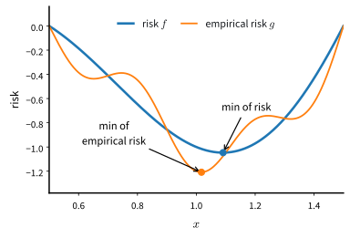
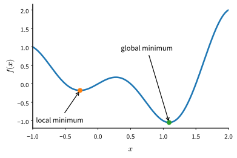
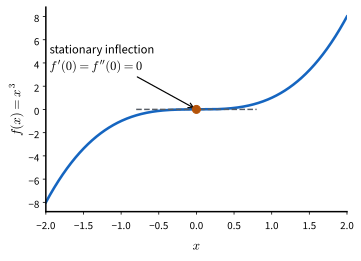
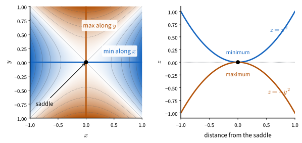
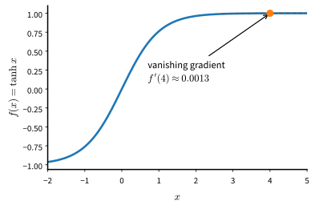

# Landscapes
:label:`sec_optimization-intro`

For a deep learning problem, an optimization algorithm minimizes a specified
loss function. In optimization the loss is called the *objective function*. By convention
we minimize; maximizing a quantity is equivalent to minimizing its negative.
The optimization literature also writes the parameters as a single vector
$\mathbf{x}$. For the next few sections, $\mathbf{x}$ therefore contains all
the parameters that earlier chapters wrote as $(\mathbf{w}, b)$. The main
difficulty is the objective itself: a deep network's loss is a surface over a
parameter space with millions of dimensions, and its geometry determines
which algorithms work. This section explains what minimizing the objective
does and does not accomplish, where gradients vanish, and how curvature and
noise control the progress of the methods that follow.

We describe an optimizer through three decisions.
First, a *descent direction* specifies which way to move. The choice depends
on the norm used to measure the size of a step: the negative gradient is the steepest
descent direction under the Euclidean norm, and changing the norm changes the
algorithm, as :numref:`sec_muon` develops. Second, a *step size over time*
specifies how far to move along the local slope and how this distance changes
during training (:numref:`sec_scheduler`). Third, a *method for controlling
noise* accounts for the fact that, at practical scales, the gradient is a
minibatch estimate. The batch size and any averaging over time determine the
variance of the update
(:numref:`sec_minibatch_sgd`, :numref:`sec_batch_size`). Each method in
this chapter, from gradient descent to Muon, is a particular way of making
these three decisions.

## The Goal of Optimization

Optimization supplies deep learning with a means, but the two have
different ends. Optimization cares about the objective it was handed;
learning cares about performance on data the model has never seen. As
discussed in :numref:`sec_generalization_basics`, training error and
generalization error generally differ, and driving the first toward zero
can even hurt the second. In the vocabulary of
:numref:`subsec_empirical-risk-and-risk`, the *empirical risk* is the
average loss over the training set, while the *risk* is the expected loss
over the whole population. The optimizer only ever sees the former.

```{.python .input #optimization-intro-goal-of-optimization-1}
%%tab pytorch
%matplotlib inline
from d2l import torch as d2l
import numpy as np
import torch
```

```{.python .input #optimization-intro-goal-of-optimization-1}
%%tab jax
%matplotlib inline
from d2l import jax as d2l
import jax
from jax import numpy as jnp
import numpy as np
```

For a concrete example, consider a smooth risk function $f$ and an
empirical risk function $g$ that fluctuates around it because a finite-sample
average differs from the population expectation. The minimum
of the empirical risk need not sit at the minimum of the risk, and here it
does not:


:label:`fig_mdl-opt-risk-gap`

No optimizer can close this gap by itself: it arises from sampling the data,
not from the optimization algorithm. Regularization and model selection
address the resulting generalization problem. For the
rest of the chapter we therefore set generalization aside and take the
objective at face value. Even so restricted, the problem is hard. Deep
learning objectives admit no analytical solution of the kind we found for
linear regression in :numref:`sec_linear_regression`, so every algorithm
in this chapter is iterative — and the surface it iterates over is nothing
like a convex bowl.

## Where Gradients Vanish

An iterative method needs a signal to follow, and the gradient is that
signal. The classical hazards of nonconvex optimization are the places
where the signal gives out: local minima, saddle points, and flat regions
of saturated activations. We look at each in turn.

### Local Minima

For an objective function $f(x)$, if the value of $f$ at $x$ is smaller
than at any nearby point, then $x$ is a *local minimum*. If it is smallest
over the entire domain, $x$ is the *global minimum*. For example, the
function

$$f(x) = x \cdot \textrm{cos}(\pi x) \textrm{ for } -1.0 \leq x \leq 2.0$$

has a local minimum that is not global:


:label:`fig_mdl-opt-local-minima`

Deep learning objectives have many local minima, and an iterate that lands
near one sees its gradient approach zero: from the signal alone, a local
minimum is indistinguishable from the global one. Noise can dislodge the
parameters, at least from a shallow basin — one reason, as we will see
below, that the noise in minibatch gradients is not purely a nuisance.

### Saddle Points

Besides local minima, *saddle points* make gradients vanish: locations
where every gradient component is zero but which are neither a minimum nor
a maximum of the function. Take $f(x) = x^3$: its first and second
derivatives both vanish at $x=0$, and optimization can stall there even
though it is no minimum at all. Strictly, this one-dimensional point is a
*stationary inflection*; the true saddle geometry — down along one direction,
up along another — needs at least two dimensions. Both are critical points
that are not extrema, and we use "saddle" broadly for either:


:label:`fig_mdl-opt-inflection`

Saddle points become more prevalent in higher dimensions. Consider
$f(x, y) = x^2 - y^2$: its saddle point at $(0, 0)$ is a minimum with
respect to $x$ and a maximum with respect to $y$, and the surface looks
like the saddle that gives the phenomenon its name:


:label:`fig_mdl-opt-saddle`

Why saddle points dominate in high dimension is a counting argument.
Suppose the input of a function is a $k$-dimensional vector and its output
a scalar, so its Hessian matrix has $k$ eigenvalues. At a point where the
gradient is zero:

* if all $k$ eigenvalues are strictly positive — the Hessian is *positive
  definite* — we have a strict local minimum;
* if all are strictly negative, a strict local maximum;
* if some are strictly positive and some strictly negative — the Hessian is
  *indefinite* — a saddle point;
* if the nonzero eigenvalues share a sign but at least one eigenvalue is
  zero — the Hessian is only semidefinite, hence singular — the test is
  inconclusive: the flat directions are settled by higher-order terms, and
  the point may be a minimum, a maximum, or a saddle.

For a zero-gradient point of a high-dimensional function to be a local
minimum, all of its thousands or millions of Hessian eigenvalues must be
positive. If the signs were roughly balanced independent coin flips, nearly
every critical point would instead be a saddle. This coin-flip argument is
only a heuristic. Hessian eigenvalues at a critical point form a structured
spectrum rather than independent balanced signs, as the second exercise below
helps illustrate. Conditioning on criticality also relates the fraction of
negative eigenvalues to the loss value. Even with these qualifications,
saddles greatly outnumber exact local minima in high dimensions. Convex
functions, whose Hessian eigenvalues are nowhere negative, have neither
saddle points nor spurious minima. Deep learning objectives are not convex,
but convex theory still supplies useful local analyses and baselines, as the
final section explains.

### Vanishing Gradients

The gradient can also become too small to guide an update without vanishing
at a critical point. :numref:`sec_numerical_stability` explained vanishing
and exploding gradients through depth and the role of initialization, while
:numref:`sec_bptt` analyzed the same problem through time. A one-dimensional
example isolates the effect. Recall the
activation functions of
:numref:`subsec_activation-functions` and suppose we want to minimize
$f(x) = \tanh(x)$ starting from $x = 4$. The derivative is
$f'(x) = 1 - \tanh^2(x)$, so $f'(4) = 0.0013$: the surface is very flat at
the initial point, and gradient descent barely moves for a
long time before making progress.


:label:`fig_mdl-opt-tanh-flat`

Vanishing gradients made deep networks genuinely hard to train before the
ReLU activation and careful initialization; those fixes belong to model
design (:numref:`subsec_activation-functions`) rather than to the
optimizer. The hazards of this section, then, are real, but two facts
soften them. Deep learning does not need *the* global minimum — a good
approximate local one serves — and, as the next section shows, what
actually limits training speed day to day is usually something else.

## Curvature and Noise

Zero-gradient points are a standard explanation for the difficulty of
nonconvex optimization, but they seldom dominate routine training. Two other
problems more often make training slow or unstable: curvature differs across
directions, and the computed gradient is only a minibatch estimate. Most
methods in this chapter address one or both of these problems.

### An Ill-Conditioned Valley

Take the simplest curved objective, a quadratic valley

$$f(\mathbf{x}) = 0.1 x_1^2 + 2 x_2^2,$$

which curves gently along $x_1$ (second derivative $0.2$) and steeply
along $x_2$ (second derivative $4$). Gradient descent updates both
coordinates with the same learning rate $\eta$, and each step multiplies
$x_1$ by $1 - 0.2\,\eta$ and $x_2$ by $1 - 4\eta$. The steep direction
sets a ceiling: for $x_2$ to shrink rather than explode we need
$|1 - 4\eta| < 1$, that is $\eta < 0.5$. The flat direction sets the pace:
for any stable $\eta$, each step keeps more than $90\%$ of $x_1$. To observe the resulting constraint, we use two helpers built in
:numref:`sec_gd`:
`d2l.train_2d` iterates an update rule from a fixed starting point, and
`d2l.show_trace_2d` draws the resulting trace over the objective's
contours. With those we run 30 steps at $\eta = 0.45$, just under the ceiling:

```{.python .input #optimization-intro-an-ill-conditioned-valley}
def f_valley(x1, x2):  # Second derivatives 0.2 and 4
    return 0.1 * x1 ** 2 + 2 * x2 ** 2

def gd_valley(x1, x2, s1, s2):
    eta = 0.45  # Just under the stability ceiling of 0.5
    return (x1 - eta * 0.2 * x1, x2 - eta * 4 * x2, 0, 0)

d2l.show_trace_2d(f_valley, d2l.train_2d(gd_valley, steps=30))
```

The trace shows the characteristic behavior of an ill-conditioned problem:
the iterate oscillates across the valley and advances slowly along it. The steep coordinate overshoots the valley floor
on every step, its sign flipping each iteration, while the flat coordinate
sheds only nine percent of its remaining distance per step — at that rate,
every factor of ten along $x_1$ costs about 24 steps. The number that controls this
behavior is the ratio of the largest to the smallest curvature, the
*condition number*

$$\kappa = \frac{\lambda_{\max}}{\lambda_{\min}},$$

here $4/0.2 = 20$. In general the steep curvature caps the learning rate
at $2/\lambda_{\max}$, the flat curvature then contracts by only
$1 - 2/\kappa$ per step, and the iteration count grows *linearly* with
$\kappa$ — the arithmetic is worked out in
:numref:`subsec_mdl-quadratic-model`. For deep networks $\kappa$ is not
$20$; measured values run to the thousands and beyond, so the same mechanism
can make plain gradient descent much slower on a deep network. The methods
that follow address this anisotropy in different ways: momentum cuts the effective cost
from $\kappa$ to $\sqrt{\kappa}$ (:numref:`sec_momentum`), adaptive
methods rescale each coordinate by its own history (:numref:`sec_adam`),
and Muon rescales whole matrices at once (:numref:`sec_muon`).

### The Edge of Stability

The valley analysis treats curvature as a fixed property of the surface,
and the classical advice follows from it: measure the sharpness
$\lambda_{\max}$, then choose $\eta < 2/\lambda_{\max}$. On real networks the direction of
dependence can reverse. Under full-batch gradient descent, the network's
sharpness often *rises* through "progressive sharpening" until it reaches
roughly $2/\eta$. The sharpness then remains near this value while the loss
continues to fall nonmonotonically in a regime that the quadratic analysis
predicts to be unstable :cite:`Cohen.Kaur.Li.ea.2021`. Thus the chosen
learning rate can determine the sharpness reached during training. This
behavior falls outside the monotone-descent regime that
most of this chapter's stated results (and the appendix's proofs) analyze;
the results remain the right guide to the mechanisms, but this is a gap
worth knowing about, and it is one reason the learning-rate schedules of
:numref:`sec_scheduler` — warmup especially — matter as much as they do.
A 25-parameter network demonstrates the phenomenon, and
:numref:`subsec_mdl-quadratic-model` does exactly that.

### Noisy Gradients

The second difficulty is that the gradient we use is an estimate. The loss
is an average over the training set, so computing its exact gradient costs
a full pass over the data; every practical method instead uses a minibatch
of $b$ examples. The estimate is unbiased, and its variance falls like
$1/b$. :numref:`sec_sgd` measures this relation on a real network across
nearly three orders of magnitude in batch size. With a constant learning
rate, the parameters fluctuate around the optimum in a *noise ball* whose
squared radius scales with $\eta$. Learning rates must therefore decay for
the iterates to converge (:numref:`sec_sgd`, :numref:`sec_scheduler`). Batch
size provides a second means of controlling variance, with hardware
consequences (:numref:`sec_minibatch_sgd`) and a measurable point of
diminishing returns at scale (:numref:`sec_batch_size`). Momentum also
reduces variance by averaging gradients over time (:numref:`sec_momentum`).
Gradient noise can help the iterate leave shallow local minima and saddle
points, although gradient descent from a random start escapes strict saddles
even without noise, and noise may not overcome a deep basin. Controlling
gradient noise is the third of the chapter's three optimization decisions.

## The Role of Convexity

Every surface in this section was nonconvex, deliberately so. Yet the
vocabulary we used to describe them comes from *convex* analysis, where
condition numbers, convergence rates, and noise balls can be characterized
by theorems. Convexity therefore supplies precise terminology and controlled
baselines. A convex function has no bad local
minima and no saddle points to hide in, so any weakness an optimizer shows
on a convex problem is intrinsic to the optimizer. If a method misbehaves
on a quadratic, it is unlikely to succeed on a transformer. Throughout this
chapter, new methods are therefore tested on quadratics first.

Convex analysis is also useful locally. Near a good minimum, a smooth loss is
approximately a quadratic bowl — the bottom of the surface looks locally
convex even when the whole is anything but. This is why the valley
analysis above predicts the late-training behavior of real networks, and
it underwrites practical tricks: averaging iterates near the bottom of the
bowl, as in stochastic weight averaging
:cite:`Izmailov.Podoprikhin.Garipov.ea.2018`, is a convex-analysis idea
that transfers to deep networks essentially intact
(:numref:`sec_practice`).

This local argument does not make the full objective convex. A deep network's loss cannot be convex
globally: permuting the hidden units of a layer leaves the function
computed unchanged, so every minimum comes with a combinatorial family of
separated copies of itself, while a convex function's minima form a single
connected set; the first exercise below makes this precise. Convexity
for deep learning is therefore a local approximation and a source of
tools, never a global fact. The full treatment lives in
:numref:`sec_mdl-convexity` of the mathematical appendix: convex sets and
functions, Jensen's inequality, why local minima of convex functions are
global, duality, projections. Its optimization chapter
(:numref:`chap_mdl-optimization`) carries the proofs this chapter owes.

## Summary

Optimization and learning share a loss function but not a goal: the
optimizer minimizes empirical risk, while learning wants low risk, and no
optimizer can close that gap by itself. On the training objective, the
classical hazards are the places where gradients vanish — local minima,
saddle points (overwhelmingly more common in high dimension), and
saturated activations. The hazards that dominate practice are different:
curvature, summarized by the condition number $\kappa$, which forces a
single learning rate to serve directions of very different steepness; and
noise, since minibatch gradients are estimates whose variance depends on
the batch size. Real training also differs from the classical stability
analysis: sharpness rises until it approaches the limit tolerated by the
step size. Convex analysis still provides vocabulary, baselines, and local
approximations. The rest of the chapter develops descent directions,
learning-rate schedules, and methods for controlling gradient noise.

## Exercises

1. Consider a simple MLP with a single hidden layer of, say, $d$
   dimensions in the hidden layer and a single output. Show that for any
   local minimum there are at least $d!$ equivalent solutions that behave
   identically.
1. Assume that we have a symmetric random matrix $\mathbf{M}$ where the
   entries $M_{ij} = M_{ji}$ are each drawn from some probability
   distribution $p_{ij}$. Furthermore assume that $p_{ij}(x) = p_{ij}(-x)$,
   i.e., that the distribution is symmetric (see e.g.,
   :citet:`Wigner.1958` for details).
    1. Prove that the distribution over eigenvalues is also symmetric.
       That is, for any eigenvector $\mathbf{v}$ the probability that the
       associated eigenvalue $\lambda$ satisfies
       $P(\lambda > 0) = P(\lambda < 0)$.
    1. Why does the above *not* imply $P(\lambda > 0) = 0.5$?
1. Assume that you want to balance a (real) ball on a (real) saddle.
    1. Why is this hard?
    1. Can you exploit this effect also for optimization algorithms?
1. Consider the valley $f(\mathbf{x}) = 0.1 x_1^2 + 2 x_2^2$ from this
   section.
    1. What is the largest learning rate for which gradient descent still
       converges? Verify your answer with `d2l.train_2d`.
    1. At $\eta = 0.45$, by what factor per step do $|x_1|$ and $|x_2|$
       shrink? Roughly how many steps does it take to reduce $|x_1|$ by a
       factor of $100$? Check your prediction numerically.
    1. For $f(\mathbf{x}) = \frac{\lambda_{\min}}{2} x_1^2 +
       \frac{\lambda_{\max}}{2} x_2^2$ with the best stable learning rate,
       show that the number of steps needed grows linearly with the
       condition number $\kappa = \lambda_{\max}/\lambda_{\min}$.
    1. Suppose you were allowed to rescale the coordinate
       $\tilde{x}_1 = \alpha x_1$ before optimizing. Which $\alpha$ makes
       the valley perfectly conditioned? Which sections of this chapter
       estimate such rescalings automatically, from gradients alone?
1. What other challenges involved in deep learning optimization can you
   think of?

:begin_tab:`pytorch`
[Discussions](https://d2l.discourse.group/t/487)
:end_tab:

:begin_tab:`jax`
[Discussions](https://d2l.discourse.group/t/489)
:end_tab:

<!-- slides -->

::: {.slide}
::: {.cover}
[Dive into Deep Learning · §9.1]{.kicker}

What makes deep-net optimization hard<br>
**risk vs. empirical risk · where gradients vanish · curvature and noise · the edge of stability**
:::
:::

::: {.slide title="An optimizer is three decisions"}
[The chapter's frame]{.kicker}

1. A **descent direction** — which way is "down"? Depends on which *norm*
   measures the step. Euclidean → the negative gradient. Other norms → other
   algorithms (as developed for Muon).
2. A **step size over time** — how far to trust the local slope, and how
   that trust changes over a run (schedules, warmup).
3. A **way of living with noise** — every gradient is a minibatch
   estimate; batch size and averaging set the noise level.

Every method in this chapter, GD through Muon, is one way of making these
three decisions.
:::

::: {.slide title="Optimization vs. learning"}
Optimization minimizes the *empirical risk* (training loss). Learning
wants low *risk* (expected loss on the population). The optimizer only
ever sees the former — and the two minima sit in different places, which
no optimizer can fix:

{width=62%}
:::

::: {.slide title="Local minima"}
$f(x) = x \cos(\pi x)$ has a local minimum that is not global. Near it,
the gradient goes to zero — the signal cannot tell the two apart:

{width=58%}

*Noise* can knock the iterate out of a shallow basin — minibatch variance
supplies exactly that.
:::

::: {.slide title="Saddle points"}
1D: $f(x) = x^3$ has $f'(0) = 0$, yet no minimum:

{width=52%}


High-dim: a zero-gradient point is a minimum only if **all** Hessian
eigenvalues are positive — with mixed signs it is a saddle. At $10^6$
parameters, nearly every critical point is a saddle under the balanced-sign
heuristic:

{width=72%}
:::

::: {.slide title="Vanishing gradients"}
No critical point needed: $f(x) = \tanh(x)$ at $x = 4$ has
$f'(4) \approx 0.0013$. The surface is *flat* near the initial point:

{width=58%}

ReLU and good initialization fixed this at the *model* level — not the
optimizer's job.
:::

::: {.slide title="Effect of curvature"}
$f(\mathbf{x}) = 0.1 x_1^2 + 2 x_2^2$: curvatures $0.2$ and $4$, one
learning rate. Steep direction caps $\eta < 0.5$; flat direction then
keeps $> 90\%$ of its value per step:

@optimization-intro-an-ill-conditioned-valley


The iterate oscillates across the valley and advances slowly along it. Condition number $\kappa =
\lambda_{\max}/\lambda_{\min} = 20$; iterations scale **linearly with
$\kappa$**. Real networks: $\kappa$ in the thousands.

::: {.d2l-note}
On strongly convex quadratics, momentum improves the condition-number
dependence to $\sqrt{\kappa}$. Adam uses per-coordinate rescaling, and Muon
uses per-matrix rescaling. Each method reduces the effect of anisotropic curvature.
:::
:::

::: {.slide title="The edge of stability"}
Classical advice: measure sharpness $\lambda_{\max}$, pick
$\eta < 2/\lambda_{\max}$.

Measured reality (Cohen et al., 2021): causality runs **backwards** —
training *raises* sharpness ("progressive sharpening") until it reaches
$\approx 2/\eta$, then hovers there. Loss keeps falling, non-monotonically,
in the "forbidden" regime.

- The ceiling is an *attractor*, not a fence: pick $\eta$, the network
  adapts its curvature to it.
- Training often lies outside the monotone-descent regime analyzed by the proofs.
- One reason warmup and schedules matter (§ Schedules); measured on a
  25-parameter net in the math appendix.
:::

::: {.slide title="Effect of gradient noise"}
The gradient is a minibatch estimate: unbiased, variance $\propto 1/b$
(measured on a real network in the SGD section).

- Constant $\eta$ → no convergence: a **noise ball** of squared radius
  $\propto \eta$. Hence decaying learning rates and schedules.
- Batch size = a second dial, with hardware consequences (Minibatches)
  and diminishing returns at scale (Batch Size).
- Momentum's second job: averaging noise over *time*.
- Noise can move the iterate away from saddles and shallow
  minima; deep barriers stay expensive.
:::

::: {.slide title="The role of convexity"}
Deep losses are *not* convex — permutation symmetry alone gives every
minimum $d!$ separated copies; convex minima form one connected set.

Useful consequences include:

- **Language and baselines**: condition number, rates, noise ball — all
  theorems for convex objectives. A method that fails on a quadratic is
  unlikely to succeed on a transformer.
- **Local approximation**: near a good minimum the loss is approximately a
  quadratic bowl — which is why the valley cartoon predicts late-training
  behavior (and why weight averaging works).

Full treatment: the convexity chapter of the math appendix.
:::

::: {.slide title="Recap"}
- Minimizing training loss ≠ minimizing test loss; that gap belongs to
  regularization, not the optimizer.
- Classical hazards: local minima, saddles (dominant in high dim),
  vanishing gradients.
- Practical hazards: **curvature** (condition number $\kappa$) and
  **noise** (minibatch variance).
- In modern networks, training often equilibrates at the edge of stability.
- The toolkit ahead = three decisions: direction, step size over time,
  living with noise.
:::
