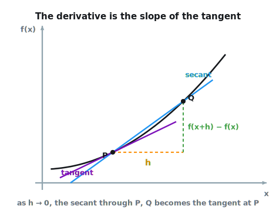
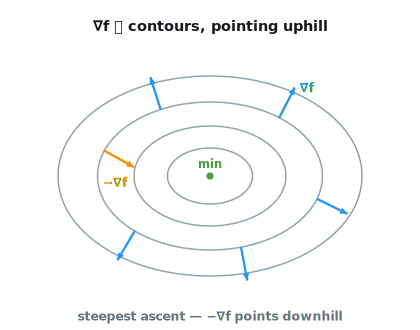

```{.python .input}
%load_ext d2lbook.tab
tab.interact_select('mxnet', 'pytorch', 'tensorflow', 'jax')
```

# Calculus
:label:`sec_calculus`

For a long time, how to calculate 
the area of a circle remained a mystery.
Then, in Ancient Greece, the mathematician Archimedes
came up with the clever idea 
to inscribe a series of polygons 
with increasing numbers of vertices
on the inside of a circle
(:numref:`fig_circle_area`). 
For a polygon with $n$ vertices,
we obtain $n$ triangles.
The height of each triangle approaches the radius $r$ 
as we partition the circle more finely. 
At the same time, its base approaches $2 \pi r/n$, 
since the ratio between arc and secant approaches 1 
for a large number of vertices. 
Thus, the area of the polygon approaches
$n \cdot r \cdot \frac{1}{2} (2 \pi r/n) = \pi r^2$.


:label:`fig_circle_area`

This limiting procedure is at the root of both 
*differential calculus* and *integral calculus*. 
The former can tell us how to increase
or decrease a function's value by
manipulating its arguments. 
This comes in handy for the *optimization problems*
that we face in deep learning,
where we repeatedly update our parameters 
in order to decrease the loss function.
Optimization addresses how to fit our models to training data,
and calculus is its key prerequisite.
However, do not forget that our ultimate goal
is to perform well on *previously unseen* data.
That problem is called *generalization*
and will be a key focus of other chapters.

```{.python .input #calculus}
%%tab mxnet
%matplotlib inline
from d2l import mxnet as d2l
from matplotlib_inline import backend_inline
from mxnet import np, npx
npx.set_np()
```

```{.python .input #calculus}
%%tab pytorch
%matplotlib inline
from d2l import torch as d2l
from matplotlib_inline import backend_inline
import numpy as np
```

```{.python .input #calculus}
%%tab tensorflow
%matplotlib inline
from d2l import tensorflow as d2l
from matplotlib_inline import backend_inline
import numpy as np
```

```{.python .input #calculus}
%%tab jax
%matplotlib inline
from d2l import jax as d2l
from matplotlib_inline import backend_inline
import numpy as np
```

## Derivatives and Differentiation

Put simply, a *derivative* is the rate of change
in a function with respect to changes in its arguments.
Derivatives can tell us how rapidly a loss function
would increase or decrease were we 
to *increase* or *decrease* each parameter
by an infinitesimally small amount.
Formally, for functions $f: \mathbb{R} \rightarrow \mathbb{R}$,
that map from scalars to scalars,
the *derivative* of $f$ at a point $x$ is defined as

$$f'(x) = \lim_{h \rightarrow 0} \frac{f(x+h) - f(x)}{h}.$$
:eqlabel:`eq_derivative`

This term on the right hand side is called a *limit* 
and it tells us what happens 
to the value of an expression
as a specified variable 
approaches a particular value.
This limit tells us what 
the ratio between a perturbation $h$
and the change in the function value 
$f(x + h) - f(x)$ converges to 
as we shrink its size to zero.
Geometrically, the difference quotient is the slope of the *secant* line
through the points $(x, f(x))$ and $(x+h, f(x+h))$;
as $h \rightarrow 0$, the secant pivots into the *tangent* line at $x$,
whose slope is the derivative (:numref:`fig_calc_secant_tangent`).


:label:`fig_calc_secant_tangent`

When $f'(x)$ exists, $f$ is said 
to be *differentiable* at $x$;
and when $f'(x)$ exists for all $x$
on a set, e.g., the interval $[a,b]$, 
we say that $f$ is differentiable on this set.
Not all functions are differentiable,
including many that we wish to optimize,
such as accuracy and the area under the
receiver operating characteristic (AUC).
However, because computing the derivative of the loss 
is a crucial step in nearly all 
algorithms for training deep neural networks,
we often optimize a differentiable *surrogate* instead.


We can interpret the derivative 
$f'(x)$
as the *instantaneous* rate of change 
of $f(x)$ with respect to $x$.
Let's develop some intuition with an example.
Define $u = f(x) = 3x^2-4x$.

```{.python .input #calculus-derivatives-and-differentiation-1}
%%tab mxnet
def f(x):
    return 3 * x ** 2 - 4 * x
```

```{.python .input #calculus-derivatives-and-differentiation-1}
%%tab pytorch
def f(x):
    return 3 * x ** 2 - 4 * x
```

```{.python .input #calculus-derivatives-and-differentiation-1}
%%tab tensorflow
def f(x):
    return 3 * x ** 2 - 4 * x
```

```{.python .input #calculus-derivatives-and-differentiation-1}
%%tab jax
def f(x):
    return 3 * x ** 2 - 4 * x
```

Setting $x=1$, we see that $\frac{f(x+h) - f(x)}{h}$ approaches $2$
as $h$ approaches $0$.
While this experiment lacks 
the rigor of a mathematical proof,
we can quickly see that indeed $f'(1) = 2$.

```{.python .input #calculus-derivatives-and-differentiation-2}
for h in 10.0**np.arange(-1, -6, -1):
    print(f'h={h:.5f}, numerical limit={(f(1+h)-f(1))/h:.5f}')
```

It is tempting to conclude that smaller $h$ is always better.
Not so: in floating-point arithmetic,
$f(x+h)$ and $f(x)$ become *nearly equal* numbers as $h$ shrinks,
so their difference loses most of its significant digits
to *cancellation*---and dividing by the tiny $h$
amplifies whatever rounding noise remains.
Continuing the sweep to much smaller $h$
shows the approximation degrading and then failing outright:
the error creeps into ever-higher digits, and once $h$ is so small
that $1 + h$ rounds to exactly $1$,
the quotient collapses to zero.

```{.python .input #calculus-derivatives-and-differentiation-3}
for exp in range(-6, -17, -1):
    h = 10.0 ** exp
    print(f'h={h:.0e}, numerical limit={(f(1+h)-f(1))/h:.5f}')
```

The numerical limit is thus caught between two error sources:
truncation error (from $h$ being too large)
and cancellation (from $h$ being too small).
This is one important reason why the automatic differentiation
introduced in the next section computes derivatives
*analytically*, by applying differentiation rules,
rather than by finite differences.

There are several equivalent notational conventions for derivatives.
Given $y = f(x)$, the following expressions are equivalent:

$$f'(x) = y' = \frac{dy}{dx} = \frac{df}{dx} = \frac{d}{dx} f(x) = Df(x) = D_x f(x),$$

where the symbols $\frac{d}{dx}$ and $D$ are *differentiation operators*.
Below, we present the derivatives of some common functions:

$$\begin{aligned} \frac{d}{dx} C & = 0 && \textrm{for any constant $C$} \\ \frac{d}{dx} x^n & = n x^{n-1} && \textrm{for } x > 0 \textrm{ if } n \textrm{ is not an integer} \\ \frac{d}{dx} e^x & = e^x \\ \frac{d}{dx} \ln x & = x^{-1}. \end{aligned}$$

Functions composed from differentiable functions 
are often themselves differentiable.
The following rules come in handy 
for working with compositions 
of any differentiable functions 
$f$ and $g$, and constant $C$.

$$\begin{aligned} \frac{d}{dx} [C f(x)] & = C \frac{d}{dx} f(x) && \textrm{Constant multiple rule} \\ \frac{d}{dx} [f(x) + g(x)] & = \frac{d}{dx} f(x) + \frac{d}{dx} g(x) && \textrm{Sum rule} \\ \frac{d}{dx} [f(x) g(x)] & = f(x) \frac{d}{dx} g(x) + g(x) \frac{d}{dx} f(x) && \textrm{Product rule} \\ \frac{d}{dx} \frac{f(x)}{g(x)} & = \frac{g(x) \frac{d}{dx} f(x) - f(x) \frac{d}{dx} g(x)}{g^2(x)} && \textrm{Quotient rule} \end{aligned}$$

Using this, we can apply the rules 
to find the derivative of $3 x^2 - 4x$ via

$$\frac{d}{dx} [3 x^2 - 4x] = 3 \frac{d}{dx} x^2 - 4 \frac{d}{dx} x = 6x - 4.$$

Plugging in $x = 1$ shows that, indeed, 
the derivative equals $2$ at this location. 
We state these derivatives and rules without proof for now;
each follows from the limit definition,
as shown in :numref:`sec_mdl-single_variable_calculus`,
which also collects a longer table of common derivatives.
Note that derivatives tell us 
the *slope* of a function 
at a particular location.

We can make that slope visible by plotting the function
$u = f(x)$ together with its tangent line $y = 2x - 3$ at $x=1$,
where the coefficient $2$ is the slope of the tangent line.
We use `d2l.plot`, one of a handful of matplotlib helpers
that we define at the end of this section
and reuse throughout the book.

```{.python .input #calculus-visualization-utilities-5}
x = np.arange(0, 3, 0.1)
d2l.plot(x, [f(x), 2 * x - 3], 'x', 'f(x)', legend=['f(x)', 'Tangent line (x=1)'])
```

## Partial Derivatives and Gradients
:label:`subsec_calculus-grad`

Thus far, we have been differentiating
functions of just one variable.
In deep learning, we also need to work
with functions of *many* variables---typically functions that take
the vectors and matrices from :numref:`sec_linear-algebra`
as their inputs.
We briefly introduce notions of the derivative
that apply to such *multivariate* functions.


Let $y = f(x_1, x_2, \ldots, x_n)$ be a function with $n$ variables. 
The *partial derivative* of $y$ 
with respect to its $i^\textrm{th}$ parameter $x_i$ is

$$ \frac{\partial y}{\partial x_i} = \lim_{h \rightarrow 0} \frac{f(x_1, \ldots, x_{i-1}, x_i+h, x_{i+1}, \ldots, x_n) - f(x_1, \ldots, x_i, \ldots, x_n)}{h}.$$


To calculate $\frac{\partial y}{\partial x_i}$, 
we can treat $x_1, \ldots, x_{i-1}, x_{i+1}, \ldots, x_n$ as constants 
and calculate the derivative of $y$ with respect to $x_i$.
The following notational conventions for partial derivatives 
are all common and all mean the same thing:

$$\frac{\partial y}{\partial x_i} = \frac{\partial f}{\partial x_i} = \partial_{x_i} f = \partial_i f = f_{x_i} = f_i = D_i f = D_{x_i} f.$$

We can concatenate partial derivatives 
of a multivariate function 
with respect to all its variables 
to obtain a vector that is called
the *gradient* of the function.
Suppose that the input of function 
$f: \mathbb{R}^n \rightarrow \mathbb{R}$ 
is an $n$-dimensional vector 
$\mathbf{x} = [x_1, x_2, \ldots, x_n]^\top$ 
and the output is a scalar. 
The gradient of the function $f$ 
with respect to $\mathbf{x}$ 
is a vector of $n$ partial derivatives:

$$\nabla_{\mathbf{x}} f(\mathbf{x}) = \left[\partial_{x_1} f(\mathbf{x}), \partial_{x_2} f(\mathbf{x}), \ldots,
\partial_{x_n} f(\mathbf{x})\right]^\top.$$ 

When there is no ambiguity,
$\nabla_{\mathbf{x}} f(\mathbf{x})$ 
is typically replaced 
by $\nabla f(\mathbf{x})$.

What if we move away from $\mathbf{x}$
in an arbitrary unit direction $\mathbf{u}$,
rather than along a coordinate axis?
The rate of change of $f$ along $\mathbf{u}$,
called the *directional derivative*,
is the dot product $\nabla f(\mathbf{x})^\top \mathbf{u}$.
By the cosine formula for dot products
from :numref:`sec_linear-algebra`,
this is largest when $\mathbf{u}$ aligns with the gradient.

Hence the gradient has a crucial geometric interpretation:
it points in the direction of *steepest ascent* of $f$,
i.e., the direction in which the function grows fastest
(a claim proved via the Cauchy--Schwarz inequality
in :numref:`sec_mdl-multivariable_calculus`).
To *decrease* $f$ as quickly as possible
we therefore take a small step in the opposite direction,
along the *negative* gradient $-\nabla f(\mathbf{x})$.
This is the entire idea behind *gradient descent*:
every optimizer in this book repeatedly nudges the parameters
a little way along $-\nabla f$ in order to reduce the loss.
:numref:`fig_calc_gradient_field` shows the picture to keep in mind:
gradients are perpendicular to the level sets of $f$
and point uphill, so $-\nabla f$ points downhill.


:label:`fig_calc_gradient_field`

The following rules come in handy 
for differentiating multivariate functions.
The first involves a *vector-valued* function
$\mathbf{u} = \mathbf{A}\mathbf{x}$:
here we collect the partial derivatives
$\partial u_j / \partial x_i$ into a matrix,
and by convention we write
$\nabla_{\mathbf{x}} \mathbf{A} \mathbf{x} = \mathbf{A}^\top$
(the transpose of the *Jacobian*,
developed in :numref:`sec_mdl-matrix-calculus-autodiff`).

* For all $\mathbf{A} \in \mathbb{R}^{m \times n}$ we have $\nabla_{\mathbf{x}} \mathbf{A} \mathbf{x} = \mathbf{A}^\top$ and $\nabla_{\mathbf{x}} \mathbf{x}^\top \mathbf{A}  = \mathbf{A}$.
* For square matrices $\mathbf{A} \in \mathbb{R}^{n \times n}$ we have that $\nabla_{\mathbf{x}} \mathbf{x}^\top \mathbf{A} \mathbf{x}  = (\mathbf{A} + \mathbf{A}^\top)\mathbf{x}$ and in particular
$\nabla_{\mathbf{x}} \|\mathbf{x} \|^2 = \nabla_{\mathbf{x}} \mathbf{x}^\top \mathbf{x} = 2\mathbf{x}$.

Similarly, for any matrix $\mathbf{X}$, 
we have $\nabla_{\mathbf{X}} \|\mathbf{X} \|_\textrm{F}^2 = 2\mathbf{X}$. 
These identities (and many more) are derived, not merely stated,
in :numref:`sec_mdl-matrix-calculus-autodiff`.


## Chain Rule

In deep learning, the gradients of concern
are often difficult to calculate
because we are working with 
deeply nested functions 
(of functions (of functions...)).
Fortunately, the *chain rule* takes care of this. 
Returning to functions of a single variable,
suppose that $y = f(g(x))$
and that the underlying functions 
$y=f(u)$ and $u=g(x)$ 
are both differentiable.
The chain rule states that 


$$\frac{dy}{dx} = \frac{dy}{du} \frac{du}{dx}.$$


Turning back to multivariate functions,
suppose that $y = f(\mathbf{u})$ has variables
$u_1, u_2, \ldots, u_m$, 
where each $u_i = g_i(\mathbf{x})$ 
has variables $x_1, x_2, \ldots, x_n$,
i.e.,  $\mathbf{u} = g(\mathbf{x})$.
Then the chain rule states that

$$\frac{\partial y}{\partial x_{i}} = \frac{\partial y}{\partial u_{1}} \frac{\partial u_{1}}{\partial x_{i}} + \frac{\partial y}{\partial u_{2}} \frac{\partial u_{2}}{\partial x_{i}} + \ldots + \frac{\partial y}{\partial u_{m}} \frac{\partial u_{m}}{\partial x_{i}} \ \textrm{ and so } \ \nabla_{\mathbf{x}} y =  \mathbf{A} \nabla_{\mathbf{u}} y,$$

where $\mathbf{A} \in \mathbb{R}^{n \times m}$ is the *matrix*
whose entry $A_{ij} = \partial u_j / \partial x_i$ collects
the derivatives of the components of $\mathbf{u}$
with respect to those of $\mathbf{x}$.
Reading off the sum on the left,
$(\nabla_{\mathbf{x}} y)_i = \sum_{j} A_{ij} (\nabla_{\mathbf{u}} y)_j$,
which is exactly the matrix--vector product on the right.
Thus, evaluating the gradient requires 
computing a matrix--vector product. 
This is one of the key reasons why linear algebra 
is such an integral building block 
in building deep learning systems. 

### Plotting Utilities for This Book

Earlier we plotted a function and its tangent line with `d2l.plot`.
Here is the small set of matplotlib helpers behind it,
which the book reuses whenever it draws a curve.
The `#@save` comment is a special modifier that stores a function,
class, or code block in the `d2l` package,
so that later sections can invoke it
(e.g., as `d2l.plot`) without repeating the code.
`use_svg_display` requests crisp SVG output,
`set_figsize` sets the figure size,
and `set_axes` configures labels, ranges, and scales.
You do not need to study these---skim and move on.

```{.python .input #calculus-visualization-utilities-1}
def use_svg_display():  #@save
    """Use the svg format to display a plot in Jupyter."""
    backend_inline.set_matplotlib_formats('svg')
```

```{.python .input #calculus-visualization-utilities-2}
def set_figsize(figsize=(3.5, 2.5)):  #@save
    """Set the figure size for matplotlib."""
    use_svg_display()
    d2l.plt.rcParams['figure.figsize'] = figsize
```

```{.python .input #calculus-visualization-utilities-3}
#@save
def set_axes(axes, xlabel, ylabel, xlim, ylim, xscale, yscale, legend):
    """Set the axes for matplotlib."""
    axes.set_xlabel(xlabel), axes.set_ylabel(ylabel)
    axes.set_xscale(xscale), axes.set_yscale(yscale)
    axes.set_xlim(xlim),     axes.set_ylim(ylim)
    if legend:
        axes.legend(legend)
    axes.grid()
```

Finally, `plot` overlays multiple curves;
most of its body just aligns the shapes of its inputs.

```{.python .input #calculus-visualization-utilities-4}
#@save
def plot(X, Y=None, xlabel=None, ylabel=None, legend=[], xlim=None,
         ylim=None, xscale='linear', yscale='linear',
         fmts=('-', 'm--', 'g-.', 'r:'), figsize=(3.5, 2.5), axes=None):
    """Plot data points."""

    def has_one_axis(X):  # True if X (tensor or list) has 1 axis
        return (hasattr(X, "ndim") and X.ndim == 1 or isinstance(X, list)
                and not hasattr(X[0], "__len__"))
    
    if has_one_axis(X): X = [X]
    if Y is None:
        X, Y = [[]] * len(X), X
    elif has_one_axis(Y):
        Y = [Y]
    if len(X) != len(Y):
        X = X * len(Y)
        
    set_figsize(figsize)
    if axes is None:
        axes = d2l.plt.gca()
    axes.cla()
    for x, y, fmt in zip(X, Y, fmts):
        axes.plot(x,y,fmt) if len(x) else axes.plot(y,fmt)
    set_axes(axes, xlabel, ylabel, xlim, ylim, xscale, yscale, legend)
```

## Discussion

While we have just scratched the surface of a deep topic,
a number of concepts already come into focus.
First, and most important for what follows:
from the viewpoint of optimization,
the gradient tells us how to move the parameters of a model
in order to lower the loss.
Because $-\nabla f$ points in the direction of steepest *descent*,
each step of the optimization algorithms used throughout this book
amounts to evaluating the gradient
and nudging the parameters a little way along it.
Second, the composition rules for differentiation
can be applied routinely, enabling
us to compute gradients *automatically*;
this task requires no creativity, so
we can focus our cognitive powers elsewhere.
Third, computing the derivatives of vector-valued functions 
requires us to multiply matrices as we trace 
the dependency graph of variables from output to input. 
This graph is traversed in a *forward* direction 
when we evaluate a function 
and in a *backward* direction
when we compute gradients. 
Later chapters will formally introduce backpropagation,
a computational procedure for applying the chain rule.

This section deliberately previews only the calculus we need
to train models.
For a thorough development---single- and multivariable calculus,
the integral, and the matrix calculus behind automatic
differentiation---see :numref:`chap_mdl-calculus`;
:citet:`Deisenroth.Faisal.Ong.2020` give a complementary treatment
aimed at machine learning.

## Exercises

1. So far we took the rules for derivatives for granted. 
   Using the definition and limits prove the properties 
   for (i) $f(x) = c$, (ii) $f(x) = x^n$, (iii) $f(x) = e^x$ and (iv) $f(x) = \log x$.
1. In the same vein, prove the product, sum, and quotient rule from first principles. 
1. Prove that the constant multiple rule follows as a special case of the product rule. 
1. Calculate the derivative of $f(x) = x^x$. 
1. What does it mean that $f'(x) = 0$ for some $x$? 
   Give an example of a function $f$ 
   and a location $x$ for which this might hold. 
1. Plot the function $y = f(x) = x^3 - \frac{1}{x}$ 
   and plot its tangent line at $x = 1$.
1. Find the gradient of the function 
   $f(\mathbf{x}) = 3x_1^2 + 5e^{x_2}$.
1. What is the gradient of the function 
   $f(\mathbf{x}) = \|\mathbf{x}\|_2$? What happens for $\mathbf{x} = \mathbf{0}$?
1. Can you write out the chain rule for the case 
   where $u = f(x, y, z)$ and $x = x(a, b)$, $y = y(a, b)$, and $z = z(a, b)$?
1. Given a function $f(x)$ that is invertible, 
   compute the derivative of its inverse $f^{-1}(x)$. 
   Here we have that $f^{-1}(f(x)) = x$ and conversely $f(f^{-1}(y)) = y$. 
   Hint: use these properties in your derivation. 
1. Consider the function $f(\mathbf{x}) = \|\mathbf{x}\|_2^2$. 
   Starting from $\mathbf{x} = [1, 1]^\top$, take a single gradient-descent step 
   $\mathbf{x} \leftarrow \mathbf{x} - \eta \nabla f(\mathbf{x})$ 
   with learning rate $\eta = 0.1$ and verify that $f$ decreases. 
   What happens if you instead pick $\eta = 1$? And $\eta = 2$? 
   What does this tell you about the role of the learning rate?

:begin_tab:`mxnet`
[Discussions](https://d2l.discourse.group/t/32)
:end_tab:

:begin_tab:`pytorch`
[Discussions](https://d2l.discourse.group/t/33)
:end_tab:

:begin_tab:`tensorflow`
[Discussions](https://d2l.discourse.group/t/197)
:end_tab:

:begin_tab:`jax`
[Discussions](https://d2l.discourse.group/t/17969)
:end_tab:

<!-- slides -->

::: {.slide}
::: {.cover}
[Dive into Deep Learning · §2.4]{.kicker}

How a loss changes when we nudge a parameter<br>**limits · derivatives · gradients · the chain rule**.
:::
:::

::: {.slide title="Optimization asks one question: which way is downhill?"}
[Motivation]{.kicker}

::: {.cols .vc}
::: {.col}
Training a model = **minimizing a loss**. Calculus answers the only
question an optimizer ever asks:

- The **derivative**: how fast the loss moves when one parameter is
  nudged.
- The **gradient** $\nabla_\theta L$: one slope per parameter, stacked.
- Optimizers step along $-\nabla_\theta L$ — downhill.
- The **chain rule** differentiates nested functions — the engine of
  backprop.
:::

::: {.col .fig}
@fig:calculus-gradient-descent
:::
:::
:::

::: {.slide}
::: {.divider}
[01]{.dnum}

[Derivatives]{.dtitle}

[limits, slopes, and where floating point gives out]{.dsub}
:::
:::

::: {.slide title="It begins with a limit"}
[Derivatives]{.kicker}

::: {.cols .vc}
::: {.col}
Archimedes found a circle's area with inscribed polygons. With $n$ sides
the polygon splits into $n$ triangles whose areas sum to

$$n \cdot \tfrac{1}{2}\bigl(\tfrac{2\pi r}{n}\bigr)\, r = \pi r^2.$$

Taking $n \to \infty$ is a **limit** — the idea at the root of all
calculus.
:::

::: {.col .fig .big}
@fig:calculus-circle-limit
:::
:::
:::

::: {.slide title="As h → 0, the secant pivots into the tangent"}
[Derivatives]{.kicker}

::: {.cols .vc}
::: {.col}
The **derivative** of $f$ at $x$ is the limit of the difference
quotient:

$$f'(x) = \lim_{h \to 0} \frac{f(x+h) - f(x)}{h}.$$

$\tfrac{f(x+h)-f(x)}{h}$ is the slope of the **secant** through two
points; as $h \to 0$ it pivots into the **tangent** — whose slope *is*
$f'(x)$.
:::

::: {.col .fig}
@fig:calculus-secant-tangent
:::
:::
:::

::: {.slide title="One function by hand: f′(1) = 2"}
[Derivatives]{.kicker}

Let $u = f(x) = 3x^2 - 4x$. The rules (two slides ahead) give
$f'(x) = 6x - 4$, so $f'(1) = 2$ — the number the next two experiments
must reproduce:

@-calculus-derivatives-and-differentiation-1
:::

::: {.slide title="The quotient marches to 2 — one digit per decade"}
[Derivatives]{.kicker}

At $x = 1$, shrink $h$ tenfold per row and watch the difference quotient
close in on $f'(1) = 2$:

@calculus-derivatives-and-differentiation-2

Each decade of $h$ buys one more correct digit: $2.3$, $2.03$,
$2.003$, …
:::

::: {.slide title="Push h too far and the arithmetic collapses"}
[Derivatives · a warning]{.kicker}

Smaller is *not* always better: $f(1+h)$ and $f(1)$ become nearly equal
floats, and their difference dies by **cancellation**:

@!calculus-derivatives-and-differentiation-3

Error creeps back in at $h=10^{-12}$; at $10^{-16}$, when $1+h$ rounds
to exactly $1$, the quotient collapses to $0$ — a key reason
**autograd** (§2.5) differentiates *analytically*.
:::

::: {.slide title="The picture: tangent of slope 2 at x = 1"}
[Derivatives]{.kicker}

::: {.cols .vc}
::: {.col}
Plotting $u = f(x)$ with the line $y = 2x - 3$ makes the number
geometric: the tangent touches at $(1, -1)$ and its slope **is**
$f'(1) = 2$.

::: {.d2l-note}
The d2l package wraps a few matplotlib helpers — `set_figsize`, `plot`,
`set_axes` — reused throughout the book.
:::
:::

::: {.col .fig .big}
@!calculus-visualization-utilities-5
:::
:::
:::

::: {.slide title="A handful of rules replaces the limit"}
[Derivatives]{.kicker}

::: {.cols}
::: {.col}
**Common derivatives**

::: {.d2l-note .rule}
$\dfrac{d}{dx} C = 0, \quad \dfrac{d}{dx} x^n = n\,x^{n-1},$

$\dfrac{d}{dx} e^x = e^x, \quad \dfrac{d}{dx}\ln x = \dfrac{1}{x}.$
:::
:::

::: {.col}
**Combining functions**

::: {.d2l-note .rule}
Sum: $(f+g)' = f' + g'$

Product: $(fg)' = f g' + g f'$

Quotient: $\left(\dfrac{f}{g}\right)' = \dfrac{g f' - f g'}{g^2}$
:::
:::
:::

Apply them to $3x^2 - 4x$: the derivative is $6x - 4$ — exactly what the
limit experiment measured.
:::

::: {.slide}
::: {.divider}
[02]{.dnum}

[Partial derivatives & gradients]{.dtitle}

[many inputs, one slope each]{.dsub}
:::
:::

::: {.slide title="A partial derivative slices the surface"}
[Gradients]{.kicker}

::: {.cols .vc}
::: {.col}
For $y = f(x_1, \ldots, x_n)$, the **partial derivative**
$\dfrac{\partial y}{\partial x_i}$ freezes every other variable and
differentiates along one axis:

$$\frac{\partial y}{\partial x_i} = \lim_{h \to 0}
\frac{f(\ldots, x_i + h, \ldots) - f(\ldots, x_i, \ldots)}{h}.$$

It is the slope of a **1-D slice** through the surface.
:::

::: {.col .fig}
@fig:calculus-partial-slices
:::
:::
:::

::: {.slide title="The gradient points uphill — fastest"}
[Gradients]{.kicker}

::: {.cols .vc}
::: {.col}
Stack all $n$ partials into the **gradient**
$\nabla f = [\partial_{x_1} f, \ldots, \partial_{x_n} f]^\top$.

Along a unit direction $\mathbf{u}$, the rate of change is the dot
product $\nabla f^\top \mathbf{u}$ — by §2.3's cosine formula, largest
when $\mathbf{u}$ aligns with $\nabla f$. So the gradient is the
direction of **steepest ascent** (proof via Cauchy–Schwarz, §23.2).

::: {.d2l-note}
$-\nabla f$ points downhill — the direction every optimizer in this
book follows.
:::
:::

::: {.col .fig}
@fig:calculus-gradient-field
:::
:::
:::

::: {.slide title="Gradient identities: calculus done by linear algebra"}
[Gradients]{.kicker}

A few vector rules recur constantly — each is a §2.3 operation
($\nabla_{\mathbf{x}}\,\mathbf{A}\mathbf{x} = \mathbf{A}^\top$ is the
transpose of the Jacobian; derivations in §23.3):

::: {.cols}
::: {.col}
::: {.d2l-note .rule}
$\nabla_{\mathbf{x}}\, \mathbf{A}\mathbf{x} = \mathbf{A}^\top$

$\nabla_{\mathbf{x}}\, \mathbf{x}^\top\mathbf{A} = \mathbf{A}$

$\nabla_{\mathbf{x}}\, \mathbf{x}^\top\mathbf{A}\mathbf{x} = (\mathbf{A} + \mathbf{A}^\top)\,\mathbf{x}$
:::
:::

::: {.col}
::: {.d2l-note .rule}
$\nabla_{\mathbf{x}}\, \|\mathbf{x}\|^2 = 2\mathbf{x}$

$\nabla_{\mathbf{X}}\, \|\mathbf{X}\|_\textrm{F}^2 = 2\mathbf{X}$
:::
:::
:::
:::

::: {.slide}
::: {.divider}
[03]{.dnum}

[The chain rule]{.dtitle}

[differentiating compositions — and meeting backprop]{.dsub}
:::
:::

::: {.slide title="The chain rule multiplies along the path"}
[Chain rule]{.kicker}

::: {.cols .vc}
::: {.col}
Deep networks are functions of functions of functions. For
$y = f(g(x))$ with $u = g(x)$:

$$\frac{dy}{dx} = \frac{dy}{du}\,\frac{du}{dx}.$$

Evaluate **forward** ($x \to u \to y$); accumulate derivatives
**backward**.
:::

::: {.col .fig .big}
@fig:calculus-chain-graph
:::
:::
:::

::: {.slide title="The multivariate chain rule is a matrix–vector product"}
[Chain rule · payoff]{.kicker}

With $m$ intermediates $u_j$, each depending on $n$ inputs $x_i$, the
sums $\partial y/\partial x_i = \sum_j A_{ij}\, \partial y/\partial u_j$
assemble into

$$\nabla_{\mathbf{x}} y = \mathbf{A}\, \nabla_{\mathbf{u}} y,
\qquad A_{ij} = \frac{\partial u_j}{\partial x_i}\
\text{(the transpose of the Jacobian, §23.3).}$$

::: {.d2l-note}
A network's gradient is a **chain of such products** — traversed
forward it evaluates the function, traversed backward it computes every
gradient. That backward pass is **backpropagation** (§5.3).
:::

This is why linear algebra is the backbone of deep learning.
:::

::: {.slide title="Recap"}
[Wrap-up]{.kicker}

::: {.cols}
::: {.col}
- **Derivative** = limit of the difference quotient = tangent slope;
  the quotient earns a digit per decade of $h$ — then cancellation
  destroys it.
- **Partials** slice; the **gradient** stacks them and points uphill
  ($-\nabla f$ downhill).
:::

::: {.col}
- **Identities:** $\nabla \mathbf{A}\mathbf{x} = \mathbf{A}^\top$,
  $\nabla \|\mathbf{x}\|^2 = 2\mathbf{x}$, … — all matvecs.
- The **chain rule** multiplies along the path; multivariate, it *is* a
  matrix–vector product — the heart of backprop.
- Next: **autograd** (§2.5) runs all of this for us, analytically.
:::
:::

::: {.d2l-note}
Every optimization step in this book reduces to evaluating a gradient.
:::
:::
