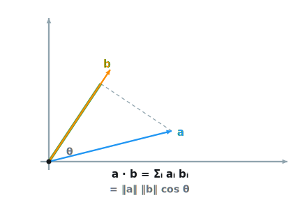
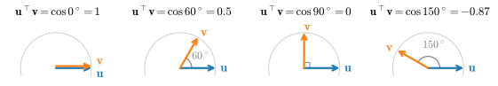
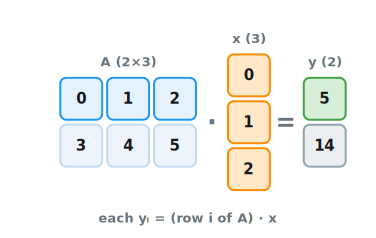
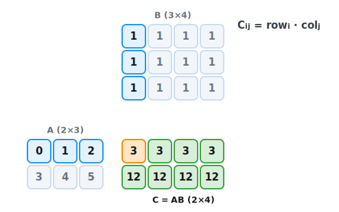
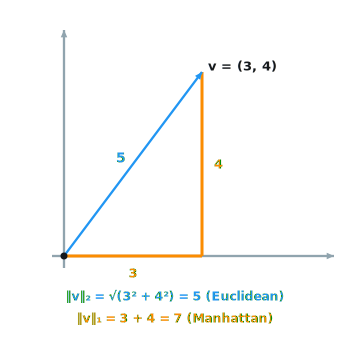

```{.python .input}
%load_ext d2lbook.tab
tab.interact_select('mxnet', 'pytorch', 'tensorflow', 'jax')
```

# Linear Algebra
:label:`sec_linear-algebra`

By now, we can load datasets into tensors
and manipulate these tensors
with basic mathematical operations.
To start building sophisticated models,
we will also need a few tools from linear algebra.
This section offers a gentle introduction
to the most essential concepts,
starting from scalar arithmetic
and ramping up to matrix multiplication.
The notation introduced here is collected,
together with the rest of the book's notation,
in :numref:`chap_notation`.

```{.python .input #linear-algebra}
%%tab mxnet
from mxnet import np, npx
npx.set_np()
```

```{.python .input #linear-algebra}
%%tab pytorch
import torch
```

```{.python .input #linear-algebra}
%%tab tensorflow
import tensorflow as tf
```

```{.python .input #linear-algebra}
%%tab jax
import jax
from jax import numpy as jnp
```

## The Objects

Linear algebra deals in a small cast of objects: scalars, vectors,
matrices, and higher-order tensors. We introduce each in turn, together
with its notation and its realization in code.

### Scalars

Most everyday mathematics
consists of manipulating
numbers one at a time.
Formally, we call these values *scalars*.
For example, the temperature in Palo Alto
is a balmy $72$ degrees Fahrenheit.
If you wanted to convert the temperature to Celsius
you would evaluate the expression
$c = \frac{5}{9}(f - 32)$, setting $f$ to $72$.
In this equation, the values
$5$, $9$, and $32$ are constant scalars.
The variables $c$ and $f$
in general represent unknown scalars.

We denote scalars
by ordinary lower-cased letters
(e.g., $x$, $y$, and $z$)
and the space of all (continuous)
*real-valued* scalars by $\mathbb{R}$.
For expedience, we will skip past
rigorous definitions of *spaces*:
just remember that the expression $x \in \mathbb{R}$
is a formal way to say that $x$ is a real-valued scalar.
The symbol $\in$ (pronounced "in")
denotes membership in a set.
For example, $x, y \in \{0, 1\}$
indicates that $x$ and $y$ are variables
that can only take values $0$ or $1$.

Scalars are implemented as tensors
that contain only one element.
Below, we assign two scalars
and perform the familiar addition, multiplication,
division, and exponentiation operations.

```{.python .input #linear-algebra-scalars}
%%tab mxnet
x = np.array(3.0)
y = np.array(2.0)

x + y, x * y, x / y, x ** y
```

```{.python .input #linear-algebra-scalars}
%%tab pytorch
x = torch.tensor(3.0)
y = torch.tensor(2.0)

x + y, x * y, x / y, x**y
```

```{.python .input #linear-algebra-scalars}
%%tab tensorflow
x = tf.constant(3.0)
y = tf.constant(2.0)

x + y, x * y, x / y, x**y
```

```{.python .input #linear-algebra-scalars}
%%tab jax
x = jnp.array(3.0)
y = jnp.array(2.0)

x + y, x * y, x / y, x**y
```

### Vectors

For current purposes, you can think of a vector as a fixed-length array of scalars.
As with their code counterparts,
we call these scalars the *elements* of the vector
(synonyms include *entries* and *components*).
When vectors represent examples from real-world datasets,
their values hold some real-world significance.
For example, if we were training a model to predict
the risk of a loan defaulting,
we might associate each applicant with a vector
whose components correspond to quantities
like their income, length of employment,
or number of previous defaults.
If we were studying the risk of heart attack,
each vector might represent a patient
and its components might correspond to
their most recent vital signs, cholesterol levels,
minutes of exercise per day, etc.
We denote vectors by bold lowercase letters,
(e.g., $\mathbf{x}$, $\mathbf{y}$, and $\mathbf{z}$).

Vectors are implemented as $1^{\textrm{st}}$-order tensors.
In general, such tensors can have arbitrary lengths,
subject to memory limitations.

Caution: in Python, as in most programming languages,
vector indices start at $0$, also known as *zero-based indexing*,
whereas in linear algebra subscripts begin at $1$ (one-based indexing).

```{.python .input #linear-algebra-vectors-1}
%%tab mxnet
x = np.arange(3)
x
```

```{.python .input #linear-algebra-vectors-1}
%%tab pytorch
x = torch.arange(3)
x
```

```{.python .input #linear-algebra-vectors-1}
%%tab tensorflow
x = tf.range(3)
x
```

```{.python .input #linear-algebra-vectors-1}
%%tab jax
x = jnp.arange(3)
x
```

We can refer to an element of a vector by using a subscript.
For example, $x_2$ denotes the second element of $\mathbf{x}$.
Since $x_2$ is a scalar, we do not bold it.
By default, we visualize vectors
by stacking their elements vertically:

$$\mathbf{x} =\begin{bmatrix}x_{1}  \\ \vdots  \\x_{n}\end{bmatrix}.$$
:eqlabel:`eq_vec_def`

Here $x_1, \ldots, x_n$ are elements of the vector.
Later on, we will distinguish between such *column vectors*
and *row vectors* whose elements are stacked horizontally.
Recall that we access a tensor's elements via indexing.

```{.python .input #linear-algebra-vectors-2}
x[2]
```

To indicate that a vector contains $n$ elements,
we write $\mathbf{x} \in \mathbb{R}^n$.
Formally, we call $n$ the *dimensionality* of the vector.
In code, this corresponds to the tensor's length,
accessible via Python's built-in `len` function.

```{.python .input #linear-algebra-vectors-3}
len(x)
```

We can also access the length via the `shape` attribute.
The shape is a tuple that indicates a tensor's length along each axis.
Tensors with just one axis have shapes with just one element.

```{.python .input #linear-algebra-vectors-4}
x.shape
```

Oftentimes, the word "dimension" gets overloaded
to mean both the number of axes
and the length along a particular axis.
To avoid this confusion,
we use *order* to refer to the number of axes
and *dimensionality* exclusively to refer
to the number of components.
(NumPy and the deep learning frameworks instead call the number of axes
the array's *rank* or `ndim`; take care not to confuse this with the
*rank* of a matrix in linear algebra, which is the number of linearly
independent rows or columns; see :numref:`sec_mdl-geometry-linear-algebraic-ops`.)


### Matrices

Just as scalars are $0^{\textrm{th}}$-order tensors
and vectors are $1^{\textrm{st}}$-order tensors,
matrices are $2^{\textrm{nd}}$-order tensors.
We denote matrices by bold capital letters
(e.g., $\mathbf{X}$, $\mathbf{Y}$, and $\mathbf{Z}$),
and represent them in code by tensors with two axes.
The expression $\mathbf{A} \in \mathbb{R}^{m \times n}$
indicates that a matrix $\mathbf{A}$
contains $m \times n$ real-valued scalars,
arranged as $m$ rows and $n$ columns.
When $m = n$, we say that a matrix is *square*.
Visually, we can illustrate any matrix as a table.
To refer to an individual element,
we subscript both the row and column indices, e.g.,
$a_{ij}$ is the value that belongs to $\mathbf{A}$'s
$i^{\textrm{th}}$ row and $j^{\textrm{th}}$ column:

$$\mathbf{A}=\begin{bmatrix} a_{11} & a_{12} & \cdots & a_{1n} \\ a_{21} & a_{22} & \cdots & a_{2n} \\ \vdots & \vdots & \ddots & \vdots \\ a_{m1} & a_{m2} & \cdots & a_{mn} \\ \end{bmatrix}.$$
:eqlabel:`eq_matrix_def`


In code, we represent a matrix $\mathbf{A} \in \mathbb{R}^{m \times n}$
by a $2^{\textrm{nd}}$-order tensor with shape ($m$, $n$).
We can convert any appropriately sized $m \times n$ tensor
into an $m \times n$ matrix
by passing the desired shape to `reshape`:

```{.python .input #linear-algebra-matrices-1}
%%tab mxnet
A = np.arange(6).reshape(3, 2)
A
```

```{.python .input #linear-algebra-matrices-1}
%%tab pytorch
A = torch.arange(6).reshape(3, 2)
A
```

```{.python .input #linear-algebra-matrices-1}
%%tab tensorflow
A = tf.reshape(tf.range(6), (3, 2))
A
```

```{.python .input #linear-algebra-matrices-1}
%%tab jax
A = jnp.arange(6).reshape(3, 2)
A
```

Sometimes we want to flip the axes.
When we exchange a matrix's rows and columns,
the result is called its *transpose*.
Formally, we signify a matrix $\mathbf{A}$'s transpose
by $\mathbf{A}^\top$ and if $\mathbf{B} = \mathbf{A}^\top$,
then $b_{ij} = a_{ji}$ for all $i$ and $j$.
Thus, the transpose of an $m \times n$ matrix
is an $n \times m$ matrix:

$$
\mathbf{A}^\top =
\begin{bmatrix}
    a_{11} & a_{21} & \dots  & a_{m1} \\
    a_{12} & a_{22} & \dots  & a_{m2} \\
    \vdots & \vdots & \ddots  & \vdots \\
    a_{1n} & a_{2n} & \dots  & a_{mn}
\end{bmatrix}.
$$

In code, we can access any matrix's transpose as follows:

```{.python .input #linear-algebra-matrices-2}
%%tab mxnet, pytorch, jax
A.T
```

```{.python .input #linear-algebra-matrices-2}
%%tab tensorflow
tf.transpose(A)
```

Symmetric matrices are the subset of square matrices
that are equal to their own transposes:
$\mathbf{A} = \mathbf{A}^\top$.
The following matrix is symmetric:

```{.python .input #linear-algebra-matrices-3}
%%tab mxnet
A = np.array([[1, 2, 3], [2, 0, 4], [3, 4, 5]])
(A == A.T).all()
```

```{.python .input #linear-algebra-matrices-3}
%%tab pytorch
A = torch.tensor([[1, 2, 3], [2, 0, 4], [3, 4, 5]])
(A == A.T).all()
```

```{.python .input #linear-algebra-matrices-3}
%%tab tensorflow
A = tf.constant([[1, 2, 3], [2, 0, 4], [3, 4, 5]])
tf.reduce_all(A == tf.transpose(A))
```

```{.python .input #linear-algebra-matrices-3}
%%tab jax
A = jnp.array([[1, 2, 3], [2, 0, 4], [3, 4, 5]])
(A == A.T).all()
```

Matrices are useful for representing datasets.
Typically, rows correspond to individual records
and columns correspond to distinct attributes.


### Tensors

While you can go far in machine learning
with only scalars, vectors, and matrices,
eventually you may need to work with
higher-order tensors.
Tensors give us a generic way of describing
extensions to $n^{\textrm{th}}$-order arrays.
We call software objects of the *tensor class* "tensors"
precisely because they too can have arbitrary numbers of axes.
While it may be confusing to use the word
*tensor* for both the mathematical object
and its realization in code,
our meaning should usually be clear from context.
We denote general tensors by capital letters
with a special font face
(e.g., $\mathsf{X}$, $\mathsf{Y}$, and $\mathsf{Z}$)
and their indexing mechanism
(e.g., $x_{ijk}$ and $[\mathsf{X}]_{1, 2i-1, 3}$)
follows naturally from that of matrices.

Tensors will become more important
when we start working with images.
Each image arrives as a $3^{\textrm{rd}}$-order tensor
with axes corresponding to the height, width, and *channel*.
At each spatial location, the intensities
of each color (red, green, and blue)
are stacked along the channel.
Furthermore, a collection of images is represented
in code by a $4^{\textrm{th}}$-order tensor,
where distinct images are indexed
along the first axis.
Higher-order tensors are constructed, as were vectors and matrices,
by growing the number of shape components.

```{.python .input #linear-algebra-tensors}
%%tab mxnet
np.arange(24).reshape(2, 3, 4)
```

```{.python .input #linear-algebra-tensors}
%%tab pytorch
torch.arange(24).reshape(2, 3, 4)
```

```{.python .input #linear-algebra-tensors}
%%tab tensorflow
tf.reshape(tf.range(24), (2, 3, 4))
```

```{.python .input #linear-algebra-tensors}
%%tab jax
jnp.arange(24).reshape(2, 3, 4)
```

## Arithmetic and Reductions

With the objects in hand, we turn to what we can do with them:
elementwise arithmetic, and *reductions* that summarize a tensor
along one or more of its axes.

### Basic Properties of Tensor Arithmetic

Scalars, vectors, matrices,
and higher-order tensors
all have some handy properties.
For example, elementwise operations
produce outputs that have the
same shape as their operands.

```{.python .input #linear-algebra-basic-properties-of-tensor-arithmetic-1}
%%tab mxnet
A = np.arange(6).reshape(2, 3)
B = A.copy()  # Assign a copy of A to B by allocating new memory
A, A + B
```

```{.python .input #linear-algebra-basic-properties-of-tensor-arithmetic-1}
%%tab pytorch
A = torch.arange(6, dtype=torch.float32).reshape(2, 3)
B = A.clone()  # Assign a copy of A to B by allocating new memory
A, A + B
```

```{.python .input #linear-algebra-basic-properties-of-tensor-arithmetic-1}
%%tab tensorflow
A = tf.reshape(tf.range(6, dtype=tf.float32), (2, 3))
B = A  # No cloning of A to B by allocating new memory
A, A + B
```

```{.python .input #linear-algebra-basic-properties-of-tensor-arithmetic-1}
%%tab jax
A = jnp.arange(6, dtype=jnp.float32).reshape(2, 3)
B = A
A, A + B
```

The elementwise product of two matrices
is called their *Hadamard product* (denoted $\odot$).
We can spell out the entries
of the Hadamard product of two matrices
$\mathbf{A}, \mathbf{B} \in \mathbb{R}^{m \times n}$:


$$
\mathbf{A} \odot \mathbf{B} =
\begin{bmatrix}
    a_{11}  b_{11} & a_{12}  b_{12} & \dots  & a_{1n}  b_{1n} \\
    a_{21}  b_{21} & a_{22}  b_{22} & \dots  & a_{2n}  b_{2n} \\
    \vdots & \vdots & \ddots & \vdots \\
    a_{m1}  b_{m1} & a_{m2}  b_{m2} & \dots  & a_{mn}  b_{mn}
\end{bmatrix}.
$$

```{.python .input #linear-algebra-basic-properties-of-tensor-arithmetic-2}
A * B
```

Adding or multiplying a scalar and a tensor produces a result
with the same shape as the original tensor.
Here, each element of the tensor is added to (or multiplied by) the scalar.

```{.python .input #linear-algebra-basic-properties-of-tensor-arithmetic-3}
%%tab mxnet
a = 2
X = np.arange(24).reshape(2, 3, 4)
a + X, (a * X).shape
```

```{.python .input #linear-algebra-basic-properties-of-tensor-arithmetic-3}
%%tab pytorch
a = 2
X = torch.arange(24).reshape(2, 3, 4)
a + X, (a * X).shape
```

```{.python .input #linear-algebra-basic-properties-of-tensor-arithmetic-3}
%%tab tensorflow
a = 2
X = tf.reshape(tf.range(24), (2, 3, 4))
a + X, (a * X).shape
```

```{.python .input #linear-algebra-basic-properties-of-tensor-arithmetic-3}
%%tab jax
a = 2
X = jnp.arange(24).reshape(2, 3, 4)
a + X, (a * X).shape
```

### Reduction
:label:`subsec_lin-alg-reduction`

Often, we wish to calculate the sum of a tensor's elements.
To express the sum of the elements in a vector $\mathbf{x}$ of length $n$,
we write $\sum_{i=1}^n x_i$. There is a simple function for it:

```{.python .input #linear-algebra-reduction-1}
%%tab mxnet
x = np.arange(3)
x, x.sum()
```

```{.python .input #linear-algebra-reduction-1}
%%tab pytorch
x = torch.arange(3, dtype=torch.float32)
x, x.sum()
```

```{.python .input #linear-algebra-reduction-1}
%%tab tensorflow
x = tf.range(3, dtype=tf.float32)
x, tf.reduce_sum(x)
```

```{.python .input #linear-algebra-reduction-1}
%%tab jax
x = jnp.arange(3, dtype=jnp.float32)
x, x.sum()
```

To express sums over the elements of tensors of arbitrary shape,
we simply sum over all its axes.
For example, the sum of the elements
of an $m \times n$ matrix $\mathbf{A}$
could be written $\sum_{i=1}^{m} \sum_{j=1}^{n} a_{ij}$.

```{.python .input #linear-algebra-reduction-2}
%%tab mxnet, pytorch, jax
A.shape, A.sum()
```

```{.python .input #linear-algebra-reduction-2}
%%tab tensorflow
A.shape, tf.reduce_sum(A)
```

By default, invoking the sum function
*reduces* a tensor along all of its axes,
eventually producing a scalar.
Our libraries also allow us to specify the axes
along which the tensor should be reduced.
To sum over all elements along the rows (axis 0),
we specify `axis=0` in `sum`.
Since the input matrix reduces along axis 0
to generate the output vector,
this axis is missing from the shape of the output.

```{.python .input #linear-algebra-reduction-3}
%%tab mxnet, pytorch, jax
A.shape, A.sum(axis=0).shape
```

```{.python .input #linear-algebra-reduction-3}
%%tab tensorflow
A.shape, tf.reduce_sum(A, axis=0).shape
```

Specifying `axis=1` will reduce the column dimension (axis 1) by summing up elements of all the columns.

```{.python .input #linear-algebra-reduction-4}
%%tab mxnet, pytorch, jax
A.shape, A.sum(axis=1).shape
```

```{.python .input #linear-algebra-reduction-4}
%%tab tensorflow
A.shape, tf.reduce_sum(A, axis=1).shape
```

Reducing a matrix along both rows and columns via summation
is equivalent to summing up all the elements of the matrix.

```{.python .input #linear-algebra-reduction-5}
%%tab mxnet, pytorch, jax
A.sum(axis=[0, 1]) == A.sum()  # Same as A.sum()
```

```{.python .input #linear-algebra-reduction-5}
%%tab tensorflow
tf.reduce_sum(A, axis=[0, 1]), tf.reduce_sum(A)  # Same as tf.reduce_sum(A)
```

A related quantity is the *mean*, also called the *average*.
We calculate the mean by dividing the sum
by the total number of elements.
Because computing the mean is so common,
it gets a dedicated library function
that works analogously to `sum`.

```{.python .input #linear-algebra-reduction-6}
%%tab mxnet, jax
A.mean(), A.sum() / A.size
```

```{.python .input #linear-algebra-reduction-6}
%%tab pytorch
A.mean(), A.sum() / A.numel()
```

```{.python .input #linear-algebra-reduction-6}
%%tab tensorflow
tf.reduce_mean(A), tf.reduce_sum(A) / tf.size(A).numpy()
```

Likewise, the function for calculating the mean
can also reduce a tensor along specific axes.

```{.python .input #linear-algebra-reduction-7}
%%tab mxnet, pytorch, jax
A.mean(axis=0), A.sum(axis=0) / A.shape[0]
```

```{.python .input #linear-algebra-reduction-7}
%%tab tensorflow
tf.reduce_mean(A, axis=0), tf.reduce_sum(A, axis=0) / A.shape[0]
```

### Non-Reduction Sum
:label:`subsec_lin-alg-non-reduction`

Sometimes it can be useful to keep the number of axes unchanged
when invoking the function for calculating the sum or mean.
This matters when we want to use the broadcast mechanism
(:numref:`subsec_broadcasting`).

```{.python .input #linear-algebra-non-reduction-sum-1}
%%tab mxnet, pytorch, jax
sum_A = A.sum(axis=1, keepdims=True)
sum_A, sum_A.shape
```

```{.python .input #linear-algebra-non-reduction-sum-1}
%%tab tensorflow
sum_A = tf.reduce_sum(A, axis=1, keepdims=True)
sum_A, sum_A.shape
```

For instance, since `sum_A` keeps its two axes after summing each row,
we can divide `A` by `sum_A` with broadcasting
to create a matrix where each row sums up to $1$.

```{.python .input #linear-algebra-non-reduction-sum-2}
A / sum_A
```

If we want to calculate the cumulative sum of elements of `A` along some axis,
say `axis=0` (row by row), we can call the `cumsum` function.
By design, this function does not reduce the input tensor along any axis.

```{.python .input #linear-algebra-non-reduction-sum-3}
%%tab mxnet, pytorch, jax
A.cumsum(axis=0)
```

```{.python .input #linear-algebra-non-reduction-sum-3}
%%tab tensorflow
tf.cumsum(A, axis=0)
```

## Products

So far, we have only performed elementwise operations, sums, and averages.
Products mix elements across positions:
the dot product, the matrix--vector product,
and matrix--matrix multiplication.

### Dot Products

One of the most fundamental operations is the dot product.
Given two vectors $\mathbf{x}, \mathbf{y} \in \mathbb{R}^d$,
their *dot product* $\mathbf{x}^\top \mathbf{y}$ (also known as *inner product*, $\langle \mathbf{x}, \mathbf{y}  \rangle$)
is a sum over the products of the elements at the same position:
$\mathbf{x}^\top \mathbf{y} = \sum_{i=1}^{d} x_i y_i$.
As :numref:`fig_la_dot` shows, this one number admits two readings:
algebraically it is elementwise-multiply-then-sum,
and geometrically it measures how much the two vectors point
in the same direction.


:label:`fig_la_dot`

```{.python .input #linear-algebra-dot-products-1}
%%tab mxnet
y = np.ones(3)
x, y, np.dot(x, y)
```

```{.python .input #linear-algebra-dot-products-1}
%%tab pytorch
y = torch.ones(3, dtype = torch.float32)
x, y, torch.dot(x, y)
```

```{.python .input #linear-algebra-dot-products-1}
%%tab tensorflow
y = tf.ones(3, dtype=tf.float32)
x, y, tf.tensordot(x, y, axes=1)
```

```{.python .input #linear-algebra-dot-products-1}
%%tab jax
y = jnp.ones(3, dtype = jnp.float32)
x, y, jnp.dot(x, y)
```

Equivalently, we can calculate the dot product of two vectors
by performing an elementwise multiplication followed by a sum:

```{.python .input #linear-algebra-dot-products-2}
%%tab mxnet
np.sum(x * y)
```

```{.python .input #linear-algebra-dot-products-2}
%%tab pytorch
torch.sum(x * y)
```

```{.python .input #linear-algebra-dot-products-2}
%%tab tensorflow
tf.reduce_sum(x * y)
```

```{.python .input #linear-algebra-dot-products-2}
%%tab jax
jnp.sum(x * y)
```

Dot products are useful in a wide range of contexts.
For example, given some set of values,
denoted by a vector $\mathbf{x}  \in \mathbb{R}^n$,
and a set of weights, denoted by $\mathbf{w} \in \mathbb{R}^n$,
the weighted sum of the values in $\mathbf{x}$
according to the weights $\mathbf{w}$
could be expressed as the dot product $\mathbf{x}^\top \mathbf{w}$.
When the weights are nonnegative
and sum to $1$, i.e., $\sum_{i=1}^{n} w_i = 1$,
the dot product expresses a *weighted average*.

To make the geometric reading precise:
for any two nonzero vectors, the angle $\theta$ between them satisfies

$$
\cos\theta = \frac{\mathbf{x}^\top \mathbf{y}}{\|\mathbf{x}\| \|\mathbf{y}\|},
$$

where $\|\mathbf{x}\|$ denotes the *length* (norm) of $\mathbf{x}$,
formally introduced later in this section.
In particular, after normalizing two vectors to have unit length,
their dot product *is* the cosine of the angle between them:
it equals $1$ when they point the same way, $0$ when they are
perpendicular, and $-1$ when they point in opposite directions
(:numref:`fig_la_cosine`).
Why is this ratio always in $[-1, 1]$?
That is the *Cauchy--Schwarz inequality*
$|\mathbf{x}^\top \mathbf{y}| \leq \|\mathbf{x}\| \|\mathbf{y}\|$,
proved in :numref:`sec_mdl-geometry-linear-algebraic-ops`.
We can verify both facts numerically on one random pair
(any draw will do):


:label:`fig_la_cosine`

```{.python .input #linear-algebra-dot-products-3}
%%tab mxnet
u, v = np.random.normal(size=8), np.random.normal(size=8)
cos_theta = np.dot(u, v) / (np.linalg.norm(u) * np.linalg.norm(v))
np.arccos(cos_theta), np.abs(np.dot(u, v)) <= np.linalg.norm(u) * np.linalg.norm(v)
```

```{.python .input #linear-algebra-dot-products-3}
%%tab pytorch
u, v = torch.randn(8), torch.randn(8)
cos_theta = torch.dot(u, v) / (torch.norm(u) * torch.norm(v))
torch.acos(cos_theta), torch.abs(torch.dot(u, v)) <= torch.norm(u) * torch.norm(v)
```

```{.python .input #linear-algebra-dot-products-3}
%%tab tensorflow
u, v = tf.random.normal((8,)), tf.random.normal((8,))
cos_theta = tf.tensordot(u, v, axes=1) / (tf.norm(u) * tf.norm(v))
tf.acos(cos_theta), tf.abs(tf.tensordot(u, v, axes=1)) <= tf.norm(u) * tf.norm(v)
```

```{.python .input #linear-algebra-dot-products-3}
%%tab jax
u, v = jax.random.normal(jax.random.key(0), (2, 8))
cos_theta = jnp.dot(u, v) / (jnp.linalg.norm(u) * jnp.linalg.norm(v))
jnp.arccos(cos_theta), jnp.abs(jnp.dot(u, v)) <= jnp.linalg.norm(u) * jnp.linalg.norm(v)
```


### Matrix--Vector Products

Now that we know how to calculate dot products,
we can begin to understand the *product*
between an $m \times n$ matrix $\mathbf{A}$
and an $n$-dimensional vector $\mathbf{x}$.
To start off, we visualize our matrix
in terms of its row vectors

$$\mathbf{A}=
\begin{bmatrix}
\mathbf{a}^\top_{1} \\
\mathbf{a}^\top_{2} \\
\vdots \\
\mathbf{a}^\top_m \\
\end{bmatrix},$$

where each $\mathbf{a}^\top_{i} \in \mathbb{R}^n$
is a row vector representing the $i^\textrm{th}$ row
of the matrix $\mathbf{A}$.

The matrix--vector product $\mathbf{A}\mathbf{x}$
is simply a column vector of length $m$,
whose $i^\textrm{th}$ element is the dot product
$\mathbf{a}^\top_i \mathbf{x}$:

$$
\mathbf{A}\mathbf{x}
= \begin{bmatrix}
\mathbf{a}^\top_{1} \\
\mathbf{a}^\top_{2} \\
\vdots \\
\mathbf{a}^\top_m \\
\end{bmatrix}\mathbf{x}
= \begin{bmatrix}
 \mathbf{a}^\top_{1} \mathbf{x}  \\
 \mathbf{a}^\top_{2} \mathbf{x} \\
\vdots\\
 \mathbf{a}^\top_{m} \mathbf{x}\\
\end{bmatrix}.
$$

:numref:`fig_la_matvec` traces the computation on a small example:
each output entry is the dot product of one row of $\mathbf{A}$
with $\mathbf{x}$.


:label:`fig_la_matvec`

We can think of multiplication with a matrix
$\mathbf{A}\in \mathbb{R}^{m \times n}$
as a linear transformation that maps vectors
from $\mathbb{R}^{n}$ to $\mathbb{R}^{m}$
(a view developed in :numref:`sec_mdl-geometry-linear-algebraic-ops`).
For example, we can represent rotations
as multiplications by certain square matrices:
multiplying by
$\begin{bmatrix} \cos\theta & -\sin\theta \\ \sin\theta & \cos\theta \end{bmatrix}$
rotates any vector in the plane by the angle $\theta$.
For $\theta = 90°$ the matrix is simple,
and we can watch it turn one axis unit vector into the other:

```{.python .input #linear-algebra-matrix-vector-products-2}
%%tab mxnet
R = np.array([[0.0, -1.0], [1.0, 0.0]])  # Rotation by 90 degrees
np.dot(R, np.array([1.0, 0.0])), np.dot(R, np.array([0.0, 1.0]))
```

```{.python .input #linear-algebra-matrix-vector-products-2}
%%tab pytorch
R = torch.tensor([[0.0, -1.0], [1.0, 0.0]])  # Rotation by 90 degrees
R @ torch.tensor([1.0, 0.0]), R @ torch.tensor([0.0, 1.0])
```

```{.python .input #linear-algebra-matrix-vector-products-2}
%%tab tensorflow
R = tf.constant([[0.0, -1.0], [1.0, 0.0]])  # Rotation by 90 degrees
tf.linalg.matvec(R, tf.constant([1.0, 0.0])), tf.linalg.matvec(R, tf.constant([0.0, 1.0]))
```

```{.python .input #linear-algebra-matrix-vector-products-2}
%%tab jax
R = jnp.array([[0.0, -1.0], [1.0, 0.0]])  # Rotation by 90 degrees
jnp.matmul(R, jnp.array([1.0, 0.0])), jnp.matmul(R, jnp.array([0.0, 1.0]))
```

Matrix--vector products also describe
the key calculation involved in computing
the outputs of each layer in a neural network
given the outputs from the previous layer.

:begin_tab:`mxnet`
To express a matrix--vector product in code,
we use the same `dot` function.
The operation is inferred
based on the type of the arguments.
Note that the column dimension of `A`
(its length along axis 1)
must be the same as the dimension of `x` (its length).
:end_tab:

:begin_tab:`pytorch`
To express a matrix--vector product in code,
we use the `mv` function.
Note that the column dimension of `A`
(its length along axis 1)
must be the same as the dimension of `x` (its length).
Python has a convenience operator `@`
that can execute both matrix--vector
and matrix--matrix products
(depending on its arguments).
Thus we can write `A@x`.
:end_tab:

:begin_tab:`tensorflow`
To express a matrix--vector product in code,
we use the `matvec` function.
Note that the column dimension of `A`
(its length along axis 1)
must be the same as the dimension of `x` (its length).
:end_tab:

```{.python .input #linear-algebra-matrix-vector-products}
%%tab mxnet
A.shape, x.shape, np.dot(A, x)
```

```{.python .input #linear-algebra-matrix-vector-products}
%%tab pytorch
A.shape, x.shape, torch.mv(A, x), A@x
```

```{.python .input #linear-algebra-matrix-vector-products}
%%tab tensorflow
A.shape, x.shape, tf.linalg.matvec(A, x)
```

```{.python .input #linear-algebra-matrix-vector-products}
%%tab jax
A.shape, x.shape, jnp.matmul(A, x)
```

### Matrix--Matrix Multiplication

Once you have gotten the hang of dot products and matrix--vector products,
then *matrix--matrix multiplication* should be straightforward.

Say that we have two matrices
$\mathbf{A} \in \mathbb{R}^{n \times k}$
and $\mathbf{B} \in \mathbb{R}^{k \times m}$:

$$\mathbf{A}=\begin{bmatrix}
 a_{11} & a_{12} & \cdots & a_{1k} \\
 a_{21} & a_{22} & \cdots & a_{2k} \\
\vdots & \vdots & \ddots & \vdots \\
 a_{n1} & a_{n2} & \cdots & a_{nk} \\
\end{bmatrix},\quad
\mathbf{B}=\begin{bmatrix}
 b_{11} & b_{12} & \cdots & b_{1m} \\
 b_{21} & b_{22} & \cdots & b_{2m} \\
\vdots & \vdots & \ddots & \vdots \\
 b_{k1} & b_{k2} & \cdots & b_{km} \\
\end{bmatrix}.$$


Let $\mathbf{a}^\top_{i} \in \mathbb{R}^k$ denote
the row vector representing the $i^\textrm{th}$ row
of the matrix $\mathbf{A}$
and let $\mathbf{b}_{j} \in \mathbb{R}^k$ denote
the column vector from the $j^\textrm{th}$ column
of the matrix $\mathbf{B}$:

$$\mathbf{A}=
\begin{bmatrix}
\mathbf{a}^\top_{1} \\
\mathbf{a}^\top_{2} \\
\vdots \\
\mathbf{a}^\top_n \\
\end{bmatrix},
\quad \mathbf{B}=\begin{bmatrix}
 \mathbf{b}_{1} & \mathbf{b}_{2} & \cdots & \mathbf{b}_{m} \\
\end{bmatrix}.
$$


To form the matrix product $\mathbf{C} \in \mathbb{R}^{n \times m}$,
we simply compute each element $c_{ij}$
as the dot product between
the $i^{\textrm{th}}$ row of $\mathbf{A}$
and the $j^{\textrm{th}}$ column of $\mathbf{B}$,
i.e., $\mathbf{a}^\top_i \mathbf{b}_j$:

$$\mathbf{C} = \mathbf{AB} = \begin{bmatrix}
\mathbf{a}^\top_{1} \\
\mathbf{a}^\top_{2} \\
\vdots \\
\mathbf{a}^\top_n \\
\end{bmatrix}
\begin{bmatrix}
 \mathbf{b}_{1} & \mathbf{b}_{2} & \cdots & \mathbf{b}_{m} \\
\end{bmatrix}
= \begin{bmatrix}
\mathbf{a}^\top_{1} \mathbf{b}_1 & \mathbf{a}^\top_{1}\mathbf{b}_2& \cdots & \mathbf{a}^\top_{1} \mathbf{b}_m \\
 \mathbf{a}^\top_{2}\mathbf{b}_1 & \mathbf{a}^\top_{2} \mathbf{b}_2 & \cdots & \mathbf{a}^\top_{2} \mathbf{b}_m \\
 \vdots & \vdots & \ddots &\vdots\\
\mathbf{a}^\top_{n} \mathbf{b}_1 & \mathbf{a}^\top_{n}\mathbf{b}_2& \cdots& \mathbf{a}^\top_{n} \mathbf{b}_m
\end{bmatrix}.
$$

We can think of the matrix--matrix multiplication $\mathbf{AB}$
as performing $m$ matrix--vector products
or $m \times n$ dot products
and stitching the results together
to form an $n \times m$ matrix.
:numref:`fig_la_matmul` locates one such dot product:
entry $c_{ij}$ sits at the intersection
of row $i$ of $\mathbf{A}$ and column $j$ of $\mathbf{B}$.


:label:`fig_la_matmul`

In the following snippet,
we perform matrix multiplication on `A` and `B`.
Here, `A` is a matrix with two rows and three columns,
and `B` is a matrix with three rows and four columns.
After multiplication, we obtain a matrix with two rows and four columns.

```{.python .input #linear-algebra-matrix-matrix-multiplication}
%%tab mxnet
B = np.ones(shape=(3, 4))
np.dot(A, B)
```

```{.python .input #linear-algebra-matrix-matrix-multiplication}
%%tab pytorch
B = torch.ones(3, 4)
torch.mm(A, B), A@B
```

```{.python .input #linear-algebra-matrix-matrix-multiplication}
%%tab tensorflow
B = tf.ones((3, 4), tf.float32)
tf.matmul(A, B)
```

```{.python .input #linear-algebra-matrix-matrix-multiplication}
%%tab jax
B = jnp.ones((3, 4))
jnp.matmul(A, B)
```

The term *matrix--matrix multiplication* is
often simplified to *matrix multiplication*,
and should not be confused with the Hadamard product.


## Norms
:label:`subsec_lin-algebra-norms`

Some of the most useful operators in linear algebra are *norms*.
Informally, the norm of a vector tells us how *big* it is.
For instance, the $\ell_2$ norm measures
the (Euclidean) length of a vector.
Here, we are employing a notion of *size* that concerns the magnitude of a vector's components
(not its dimensionality).

A norm is a function $\| \cdot \|$ that maps a vector
to a scalar and satisfies the following three properties:

1. Given any vector $\mathbf{x}$, if we scale (all elements of) the vector
   by a scalar $\alpha \in \mathbb{R}$, its norm scales accordingly:
   $$\|\alpha \mathbf{x}\| = |\alpha| \|\mathbf{x}\|.$$
2. For any vectors $\mathbf{x}$ and $\mathbf{y}$:
   norms satisfy the triangle inequality:
   $$\|\mathbf{x} + \mathbf{y}\| \leq \|\mathbf{x}\| + \|\mathbf{y}\|.$$
3. The norm of a vector is nonnegative and it only vanishes if the vector is zero:
   $$\|\mathbf{x}\| > 0 \textrm{ for all } \mathbf{x} \neq 0.$$

Many functions are valid norms and different norms
encode different notions of size.
The Euclidean norm that we all learned in elementary school geometry
when calculating the hypotenuse of a right triangle
is the square root of the sum of squares of a vector's elements.
Formally, this is called the $\ell_2$ *norm* and expressed as

$$\|\mathbf{x}\|_2 = \sqrt{\sum_{i=1}^n x_i^2}.$$

The method `norm` calculates the $\ell_2$ norm.

```{.python .input #linear-algebra-norms-1}
%%tab mxnet
u = np.array([3, -4])
np.linalg.norm(u)
```

```{.python .input #linear-algebra-norms-1}
%%tab pytorch
u = torch.tensor([3.0, -4.0])
torch.norm(u)
```

```{.python .input #linear-algebra-norms-1}
%%tab tensorflow
u = tf.constant([3.0, -4.0])
tf.norm(u)
```

```{.python .input #linear-algebra-norms-1}
%%tab jax
u = jnp.array([3.0, -4.0])
jnp.linalg.norm(u)
```

The $\ell_1$ norm is also common
and the associated measure is called the Manhattan distance.
By definition, the $\ell_1$ norm sums
the absolute values of a vector's elements:

$$\|\mathbf{x}\|_1 = \sum_{i=1}^n \left|x_i \right|.$$

:numref:`fig_la_norms` contrasts the two on a single vector:
the $\ell_2$ norm is the straight-line distance to the origin,
while the $\ell_1$ norm is the distance walked along the grid.


:label:`fig_la_norms`

Compared to the $\ell_2$ norm, it is less sensitive to outliers.
To compute the $\ell_1$ norm,
we compose the absolute value
with the sum operation.

```{.python .input #linear-algebra-norms-2}
%%tab mxnet
np.abs(u).sum()
```

```{.python .input #linear-algebra-norms-2}
%%tab pytorch
torch.abs(u).sum()
```

```{.python .input #linear-algebra-norms-2}
%%tab tensorflow
tf.reduce_sum(tf.abs(u))
```

```{.python .input #linear-algebra-norms-2}
%%tab jax
jnp.linalg.norm(u, ord=1) # same as jnp.abs(u).sum()
```

Both the $\ell_2$ and $\ell_1$ norms are special cases
of the more general $\ell_p$ *norms*, defined for $p \geq 1$ by

$$\|\mathbf{x}\|_p = \left(\sum_{i=1}^n \left|x_i \right|^p \right)^{1/p}.$$

(For $p < 1$ the formula above violates the triangle inequality,
so it is not a norm.)
Each of the three axioms can be verified in code.
Here we check homogeneity and the triangle inequality
for the $\ell_2$ norm on random vectors:

```{.python .input #linear-algebra-norms-4}
%%tab mxnet
u, v, alpha = np.random.normal(size=6), np.random.normal(size=6), -2.5
print(np.linalg.norm(alpha * u), abs(alpha) * np.linalg.norm(u))
print(np.linalg.norm(u + v) <= np.linalg.norm(u) + np.linalg.norm(v))
```

```{.python .input #linear-algebra-norms-4}
%%tab pytorch
u, v, alpha = torch.randn(6), torch.randn(6), -2.5
print(torch.norm(alpha * u), abs(alpha) * torch.norm(u))
print(torch.norm(u + v) <= torch.norm(u) + torch.norm(v))
```

```{.python .input #linear-algebra-norms-4}
%%tab tensorflow
u, v, alpha = tf.random.normal((6,)), tf.random.normal((6,)), -2.5
print(tf.norm(alpha * u), abs(alpha) * tf.norm(u))
print(tf.norm(u + v) <= tf.norm(u) + tf.norm(v))
```

```{.python .input #linear-algebra-norms-4}
%%tab jax
u, v = jax.random.normal(jax.random.key(1), (2, 6))
alpha = -2.5
print(jnp.linalg.norm(alpha * u), abs(alpha) * jnp.linalg.norm(u))
print(jnp.linalg.norm(u + v) <= jnp.linalg.norm(u) + jnp.linalg.norm(v))
```

For the $\ell_2$ norm, the triangle inequality is
the Cauchy--Schwarz inequality in disguise:
expanding $\|\mathbf{u} + \mathbf{v}\|_2^2
= \|\mathbf{u}\|_2^2 + 2\mathbf{u}^\top\mathbf{v} + \|\mathbf{v}\|_2^2$
and bounding $\mathbf{u}^\top\mathbf{v}$
by $\|\mathbf{u}\|_2 \|\mathbf{v}\|_2$
yields exactly the triangle inequality
(see :numref:`sec_mdl-geometry-linear-algebraic-ops`).

In the case of matrices, matters are more complicated.
After all, matrices can be viewed both as collections of individual entries
*and* as objects that operate on vectors and transform them into other vectors.
For instance, we can ask by how much longer
the matrix--vector product $\mathbf{X} \mathbf{v}$
could be relative to $\mathbf{v}$.
This line of thought leads to what is called the *spectral* norm,
whose full development (it equals the largest *singular value*
of the matrix) appears in :numref:`sec_mdl-svd-low-rank`.
For now, we introduce the *Frobenius norm*,
which is much easier to compute and defined as
the square root of the sum of the squares
of a matrix's elements:

$$\|\mathbf{X}\|_\textrm{F} = \sqrt{\sum_{i=1}^m \sum_{j=1}^n x_{ij}^2}.$$

The Frobenius norm behaves as if it were
an $\ell_2$ norm of a matrix-shaped vector.
Invoking the following function will calculate
the Frobenius norm of a matrix.

```{.python .input #linear-algebra-norms-3}
%%tab mxnet
np.linalg.norm(np.ones((4, 9)))
```

```{.python .input #linear-algebra-norms-3}
%%tab pytorch
torch.norm(torch.ones((4, 9)))
```

```{.python .input #linear-algebra-norms-3}
%%tab tensorflow
tf.norm(tf.ones((4, 9)))
```

```{.python .input #linear-algebra-norms-3}
%%tab jax
jnp.linalg.norm(jnp.ones((4, 9)))
```

In deep learning, we are often trying to solve optimization problems:
*maximize* the probability assigned to observed data;
*maximize* the revenue associated with a recommender model;
*minimize* the distance between predictions
and the ground truth observations;
*minimize* the distance between representations
of photos of the same person
while *maximizing* the distance between representations
of photos of different people.
These distances, which constitute
the objectives of deep learning algorithms,
are often expressed as norms.

### Eigenvalues: A First Look

Norms ask how much a matrix can stretch a vector.
A complementary question is whether there are directions
that a square matrix does not turn at all.
A nonzero vector $\mathbf{v}$ is an *eigenvector*
of a square matrix $\mathbf{A}$, with associated *eigenvalue* $\lambda$, if

$$\mathbf{A}\mathbf{v} = \lambda \mathbf{v}.$$

Along such a direction, multiplying by $\mathbf{A}$
reduces to multiplying by the scalar $\lambda$:
the vector is stretched (if $|\lambda| > 1$),
shrunk (if $|\lambda| < 1$), or flipped (if $\lambda < 0$),
but never rotated.
The library computes eigenvalues directly.
Here we apply this to the symmetric matrix we met
when discussing transposes;
symmetric matrices are especially pleasant
because all of their eigenvalues are real
(shown in :numref:`sec_mdl-eigendecompositions`):

```{.python .input #linear-algebra-eigenvalues-1}
%%tab mxnet
S = np.array([[1.0, 2, 3], [2, 0, 4], [3, 4, 5]])
np.linalg.eigvalsh(S)  # Eigenvalues of a symmetric matrix are real
```

```{.python .input #linear-algebra-eigenvalues-1}
%%tab pytorch
S = torch.tensor([[1.0, 2, 3], [2, 0, 4], [3, 4, 5]])
torch.linalg.eigvalsh(S)  # Eigenvalues of a symmetric matrix are real
```

```{.python .input #linear-algebra-eigenvalues-1}
%%tab tensorflow
S = tf.constant([[1.0, 2, 3], [2, 0, 4], [3, 4, 5]])
tf.linalg.eigvalsh(S)  # Eigenvalues of a symmetric matrix are real
```

```{.python .input #linear-algebra-eigenvalues-1}
%%tab jax
S = jnp.array([[1.0, 2, 3], [2, 0, 4], [3, 4, 5]])
jnp.linalg.eigvalsh(S)  # Eigenvalues of a symmetric matrix are real
```

Eigenvalues answer the stretching question exactly
for symmetric matrices: the spectral norm of a symmetric matrix
equals the largest absolute eigenvalue $\max_i |\lambda_i|$
(we state this without proof; see :numref:`sec_mdl-eigendecompositions`).
They also govern what happens under *repeated* multiplication.
Applying $\mathbf{A}$ to an eigenvector $k$ times multiplies it
by $\lambda^k$, which explodes when $|\lambda| > 1$
and vanishes when $|\lambda| < 1$.
For a symmetric matrix such as $\mathbf{S}$,
a generic vector is a mixture of eigenvector components,
so it is soon dominated by the component
with the largest absolute eigenvalue.
We can watch this happen: the factor by which the norm grows
per multiplication approaches $\max_i |\lambda_i|$.

```{.python .input #linear-algebra-eigenvalues-2}
%%tab mxnet
v = np.random.normal(size=3)
for _ in range(10):
    prev, v = v, np.dot(S, v)
np.linalg.norm(v) / np.linalg.norm(prev)
```

```{.python .input #linear-algebra-eigenvalues-2}
%%tab pytorch
v = torch.randn(3)
for _ in range(10):
    prev, v = v, S @ v
torch.norm(v) / torch.norm(prev)
```

```{.python .input #linear-algebra-eigenvalues-2}
%%tab tensorflow
v = tf.random.normal((3,))
for _ in range(10):
    prev, v = v, tf.linalg.matvec(S, v)
tf.norm(v) / tf.norm(prev)
```

```{.python .input #linear-algebra-eigenvalues-2}
%%tab jax
v = jax.random.normal(jax.random.key(2), (3,))
for _ in range(10):
    prev, v = v, jnp.matmul(S, v)
jnp.linalg.norm(v) / jnp.linalg.norm(prev)
```

Deep networks multiply by many matrices in succession,
so whether signals (and gradients) explode or vanish
is governed by exactly this effect,
as we will see when we analyze numerical stability
in :numref:`sec_numerical_stability`.
The full story (eigendecompositions, their computation,
and their uses) is developed in :numref:`sec_mdl-eigendecompositions`.


## Discussion

In this section, we have reviewed all the linear algebra
that you will need to understand
a significant chunk of modern deep learning.
There is a lot more to it: matrix decompositions, for example,
reveal low-dimensional structure in real-world datasets
and power entire subfields of machine learning.
But the best time to learn more mathematics
is once you have gotten your hands dirty
applying machine learning to real data,
so we wrap up here.

If you are eager to learn more linear algebra,
start with :numref:`chap_mdl-linear-algebra`,
which develops eigendecompositions, the singular value decomposition,
and their use in machine learning in full.
For further reading, there are many excellent books and online resources;
consider the crash courses by
:citet:`Strang.1993`, :citet:`Kolter.2008`, and :citet:`Petersen.Pedersen.ea.2008`.

To recap:

* Scalars, vectors, matrices, and tensors are
  the basic mathematical objects used in linear algebra
  and have zero, one, two, and an arbitrary number of axes, respectively.
* Tensors can be sliced or reduced along specified axes
  via indexing, or operations such as `sum` and `mean`, respectively.
* Elementwise products are called Hadamard products.
  By contrast, dot products, matrix--vector products, and matrix--matrix products
  are not elementwise operations and in general return objects
  having shapes that are different from the operands.
* Compared with a Hadamard product of two $n \times n$ matrices, which costs
  $O(n^2)$ arithmetic operations, the standard algorithm for their matrix
  product costs $O(n^3)$. For rectangular shapes $(m,n)(n,k)$, its cost is
  $O(mnk)$.
* Norms capture various notions of the magnitude of a vector (or matrix),
  and are commonly applied to the difference of two vectors
  to measure their distance apart.
* Common vector norms include the $\ell_1$ and $\ell_2$ norms.
  For matrices, we introduced the *Frobenius* norm
  and previewed the *spectral* norm,
  which is developed in :numref:`sec_mdl-svd-low-rank`.
* A square matrix scales its eigenvectors without rotating them:
  $\mathbf{A}\mathbf{v} = \lambda \mathbf{v}$.
  The largest absolute eigenvalue governs how repeated
  multiplication amplifies or damps a vector.


## Exercises

1. Prove that the transpose of the transpose of a matrix is the matrix itself: $(\mathbf{A}^\top)^\top = \mathbf{A}$.
1. Given two matrices $\mathbf{A}$ and $\mathbf{B}$, show that sum and transposition commute: $\mathbf{A}^\top + \mathbf{B}^\top = (\mathbf{A} + \mathbf{B})^\top$.
1. Given any square matrix $\mathbf{A}$, is $\mathbf{A} + \mathbf{A}^\top$ always symmetric? Can you prove the result by using only the results of the previous two exercises?
1. We defined the tensor `X` of shape (2, 3, 4) in this section. What is the output of `len(X)`? Write your answer without implementing any code, then check your answer using code.
1. For a tensor `X` of arbitrary shape, does `len(X)` always correspond to the length of a certain axis of `X`? What is that axis?
1. Run `A / A.sum(axis=1)` and see what happens. Can you analyze the results?
1. When traveling between two points in downtown Manhattan, what is the distance that you need to cover in terms of the coordinates, i.e., in terms of avenues and streets? Can you travel diagonally?
1. Consider a tensor of shape (2, 3, 4). What are the shapes of the summation outputs along axes 0, 1, and 2?
1. Feed a tensor with three or more axes to the `linalg.norm` function and observe its output. What does this function compute for tensors of arbitrary shape?
1. Consider three large matrices, say $\mathbf{A} \in \mathbb{R}^{2^{10} \times 2^{16}}$, $\mathbf{B} \in \mathbb{R}^{2^{16} \times 2^{5}}$ and $\mathbf{C} \in \mathbb{R}^{2^{5} \times 2^{14}}$, initialized with Gaussian random variables. You want to compute the product $\mathbf{A} \mathbf{B} \mathbf{C}$. Is there any difference in memory footprint and speed, depending on whether you compute $(\mathbf{A} \mathbf{B}) \mathbf{C}$ or $\mathbf{A} (\mathbf{B} \mathbf{C})$? Why?
1. Consider three large matrices, say $\mathbf{A} \in \mathbb{R}^{2^{10} \times 2^{16}}$, $\mathbf{B} \in \mathbb{R}^{2^{16} \times 2^{5}}$ and $\mathbf{C} \in \mathbb{R}^{2^{5} \times 2^{16}}$. Is there any difference in speed depending on whether you compute $\mathbf{A} \mathbf{B}$ or $\mathbf{A} \mathbf{C}^\top$? Why? What changes if you initialize $\mathbf{C} = \mathbf{B}^\top$ without cloning memory? Why?
1. Consider three matrices, say $\mathbf{A}, \mathbf{B}, \mathbf{C} \in \mathbb{R}^{100 \times 200}$. Construct a tensor with three axes by stacking $[\mathbf{A}, \mathbf{B}, \mathbf{C}]$. What is the dimensionality? Slice out the second coordinate of the third axis to recover $\mathbf{B}$. Check that your answer is correct.

:begin_tab:`mxnet`
[Discussions](https://d2l.discourse.group/t/30)
:end_tab:

:begin_tab:`pytorch`
[Discussions](https://d2l.discourse.group/t/31)
:end_tab:

:begin_tab:`tensorflow`
[Discussions](https://d2l.discourse.group/t/196)
:end_tab:

:begin_tab:`jax`
[Discussions](https://d2l.discourse.group/t/17968)
:end_tab:

<!-- slides -->

::: {.slide}
::: {.cover}
[Dive into Deep Learning · §2.3]{.kicker}

Every model in this book compiles down to a short list of operations<br>**vectors · matrices · products · norms · eigenvalues**.
:::
:::

::: {.slide title="Five ideas carry every later chapter"}
[Motivation]{.kicker}

::: {.cols .vc}
::: {.col}
- **Objects**: scalars, vectors, matrices, tensors (ranks $0, 1, 2, n$).
- **Arithmetic**: element-wise, plus scalar broadcasting.
- **Reductions**: `sum` and `mean`, along chosen axes.
- **Products**: dot, matrix–vector, matrix–matrix.
- **Norms & eigenvalues**: how big, and which directions survive.

::: {.d2l-note}
**Rank** = number of axes; **shape** = size per axis.
:::
:::

::: {.col .fig .big}
@fig:ndarray-rank-ladder
:::
:::
:::

::: {.slide}
::: {.divider}
[01]{.dnum}

[The objects]{.dtitle}

[scalars, vectors, matrices, tensors (and one flip)]{.dsub}
:::
:::

::: {.slide title="A vector is numbers with a geometry"}
[The objects]{.kicker}

::: {.cols .vc}
::: {.col}
A **scalar** is a rank-0 tensor: one number. Stack $n$ of them and you
get a **vector**: a data record *and* an arrow in $\mathbb{R}^n$, with a
length and a direction:

@linear-algebra-vectors-1

::: {.d2l-note}
Both readings matter: a row of a dataset is a vector, and so is the
direction a training step moves the weights.
:::
:::

::: {.col .fig .big}
@fig:linear-algebra-vector
:::
:::
:::

::: {.slide title="`.shape` answers the first question about any tensor"}
[The objects]{.kicker}

`len` counts a vector's elements:

@linear-algebra-vectors-3

. . .

`.shape` works at **every** rank, one size per axis:

@linear-algebra-vectors-4
:::

::: {.slide title="The transpose flips a matrix across its diagonal"}
[The objects]{.kicker}

::: {.cols .vc}
::: {.col}
A **matrix** is a rank-2 tensor, $m$ rows $\times$ $n$ columns:

@linear-algebra-matrices-1

$\mathbf{A}^\top$ swaps the roles of rows and columns:

@linear-algebra-matrices-2
:::

::: {.col .fig}
@fig:linear-algebra-transpose
:::
:::
:::

::: {.slide title="Symmetric matrices are their own transpose"}
[The objects]{.kicker}

::: {.cols .vc}
::: {.col}
$\mathbf{A} = \mathbf{A}^\top$: the flip changes nothing, and code can
check it in one line:

@linear-algebra-matrices-3

::: {.d2l-note}
Covariance and Gram matrices are symmetric, a structure that many methods
(and this deck's finale) exploit.
:::
:::

::: {.col .fig}
@fig:linear-algebra-symmetric
:::
:::
:::

::: {.slide title="Rank *n* is just *n* axes"}
[The objects]{.kicker}

::: {.cols .vc}
::: {.col .narrow}
Stack matrices and the naming continues. A batch of images is rank-4
(`N×C×H×W` in PyTorch, `N×H×W×C` in TF):

@-linear-algebra-tensors
:::

::: {.col}
@fig:linear-algebra-tensor4d
:::
:::
:::

::: {.slide}
::: {.divider}
[02]{.dnum}

[Arithmetic & reduction]{.dtitle}

[element-wise ops · sums that drop or keep axes]{.dsub}
:::
:::

::: {.slide title="Same shapes combine element-wise"}
[Arithmetic]{.kicker}

Two tensors of one shape combine entry by entry:

@linear-algebra-basic-properties-of-tensor-arithmetic-1

. . .

The element-wise *product* is the **Hadamard product**
$\mathbf{A} \odot \mathbf{B}$:

@linear-algebra-basic-properties-of-tensor-arithmetic-2
:::

::: {.slide title="A scalar broadcasts to every element"}
[Arithmetic]{.kicker}

Adding or multiplying by a scalar touches each entry and leaves the
shape alone:

@linear-algebra-basic-properties-of-tensor-arithmetic-3
:::

::: {.slide title="A reduction folds many numbers into one"}
[Reduction]{.kicker}

`sum()` with no arguments collapses everything to a scalar:

@linear-algebra-reduction-1

. . .

`mean()` is the same fold, divided by the count:

@linear-algebra-reduction-6
:::

::: {.slide title="`axis=` chooses which dimension disappears"}
[Reduction]{.kicker}

::: {.cols .vc}
::: {.col}
The output **loses** exactly the axis you name:

@linear-algebra-reduction-3

@linear-algebra-reduction-4

::: {.d2l-note}
`axis=0` sums down the columns; `axis=1` sums across the rows.
:::
:::

::: {.col .fig .big}
@fig:linear-algebra-reduce-axes
:::
:::
:::

::: {.slide title="`keepdims`: reduce, but stay broadcastable"}
[Reduction]{.kicker}

`keepdims=True` keeps the folded axis at size 1:

@linear-algebra-non-reduction-sum-1

. . .

…so one broadcast division normalizes every row to sum to $1$:

@linear-algebra-non-reduction-sum-2
:::

::: {.slide}
::: {.divider}
[03]{.dnum}

[Products]{.dtitle}

[one idea at three sizes: dot · matrix–vector · matrix–matrix]{.dsub}
:::
:::

::: {.slide title="The dot product multiplies, then sums"}
[Products]{.kicker}

::: {.cols .vc}
::: {.col}
$\mathbf{x}^\top\mathbf{y} = \sum_i x_i y_i$: multiply matching
entries, add them up:

@linear-algebra-dot-products-1

::: {.d2l-note}
With nonnegative weights summing to $1$, the dot product is a
**weighted average**.
:::
:::

::: {.col .fig .big}
@fig:linear-algebra-dot
:::
:::
:::

::: {.slide title="Normalized, the dot product is cos θ"}
[Products · geometry]{.kicker}

$$\cos\theta = \frac{\mathbf{x}^\top\mathbf{y}}{\|\mathbf{x}\|\,\|\mathbf{y}\|}.$$


$+1$ aligned · $0$ perpendicular · $-1$ opposed: the dot product is
deep learning's favorite **similarity measure**.
:::

::: {.slide title="Cauchy–Schwarz keeps the ratio in [−1, 1]"}
[Products · geometry]{.kicker}

Why can $\cos\theta$ never escape $[-1, 1]$? That is the
**Cauchy–Schwarz inequality**
$|\mathbf{x}^\top\mathbf{y}| \le \|\mathbf{x}\|\,\|\mathbf{y}\|$
(proved in the geometry-and-linear-algebraic-operations section). One
random pair checks both facts at once:

@linear-algebra-dot-products-3

An angle in $[0, \pi]$, and the inequality holds on every draw.
:::

::: {.slide title="Ax takes one dot product per row"}
[Products]{.kicker}

::: {.cols .vc}
::: {.col}
$(\mathbf{A}\mathbf{x})_i = \mathbf{a}^\top_i \mathbf{x}$, so a
$2\times3$ matrix maps a length-3 vector to a length-2 vector:

@linear-algebra-matrix-vector-products

::: {.d2l-note}
Every fully-connected layer computes exactly this (plus a
nonlinearity); much more on that later.
:::
:::

::: {.col .fig}
@fig:linear-algebra-matvec
:::
:::
:::

::: {.slide title="Matrices move vectors: here, a 90° turn"}
[Products]{.kicker}

Multiplication by $\mathbf{A} \in \mathbb{R}^{m\times n}$ is a **linear
map** $\mathbb{R}^n \to \mathbb{R}^m$. The rotation matrix
$\begin{bmatrix} \cos\theta & -\sin\theta \\ \sin\theta & \cos\theta \end{bmatrix}$
turns the plane by $\theta$; at $\theta = 90°$ it sends
$\mathbf{e}_1 \mapsto \mathbf{e}_2$ and $\mathbf{e}_2 \mapsto -\mathbf{e}_1$:

@linear-algebra-matrix-vector-products-2
:::

::: {.slide title="AB stitches m×n dot products into a matrix"}
[Products]{.kicker}

::: {.cols .vc}
::: {.col}
Entry $c_{ij}$ is row $i$ of $\mathbf{A}$ dotted with column $j$ of
$\mathbf{B}$:

@linear-algebra-matrix-matrix-multiplication
:::

::: {.col .fig .big}
@fig:linear-algebra-matmul
:::
:::
:::

::: {.slide}
::: {.divider}
[04]{.dnum}

[Norms & eigenvalues]{.dtitle}

[how long is a vector, and which directions a matrix keeps]{.dsub}
:::
:::

::: {.slide title="Two rulers: ℓ₂ walks straight, ℓ₁ walks the grid"}
[Norms]{.kicker}

::: {.cols .vc}
::: {.col}
For $\mathbf{u} = [3, -4]$ the Euclidean ruler reads $5$; the taxicab
ruler reads $7$:

@linear-algebra-norms-1

@linear-algebra-norms-2

::: {.d2l-note .rule}
$\|\mathbf{x}\|_2 = \sqrt{\textstyle\sum_i x_i^2}, \qquad
\|\mathbf{x}\|_1 = \textstyle\sum_i |x_i|.$
:::
:::

::: {.col .fig .big}
@fig:linear-algebra-norms
:::
:::
:::

::: {.slide title="The three norm axioms are checkable facts"}
[Norms]{.kicker}

Homogeneity $\|\alpha\mathbf{x}\| = |\alpha|\,\|\mathbf{x}\|$ and the
triangle inequality
$\|\mathbf{x}+\mathbf{y}\| \le \|\mathbf{x}\|+\|\mathbf{y}\|$, holding on
random vectors:

@linear-algebra-norms-4

. . .

::: {.d2l-note}
For $\ell_2$, the triangle inequality **is** Cauchy–Schwarz in disguise:
expand $\|\mathbf{u}+\mathbf{v}\|^2$ and bound the cross term (the
geometry-and-linear-algebraic-operations section).
:::
:::

::: {.slide title="Frobenius measures a matrix as one long vector"}
[Norms]{.kicker}

$\|\mathbf{X}\|_\textrm{F} = \sqrt{\sum_{i,j} x_{ij}^2}$ is the $\ell_2$
norm of the flattened matrix. For the all-ones $4\times9$:
$\sqrt{36} = 6$:

@linear-algebra-norms-3

::: {.d2l-note}
The *spectral* norm (how much $\mathbf{X}$ can stretch a vector) needs
the singular value decomposition; it arrives in the SVD-and-low-rank-
approximation section.
:::
:::

::: {.slide title="Eigenvectors: the directions a matrix does not turn"}
[Eigenvalues]{.kicker}

::: {.cols .vc}
::: {.col}
$$\mathbf{A}\mathbf{v} = \lambda\mathbf{v}.$$

Along an eigenvector, the matrix acts like a **scalar**: stretch
($|\lambda|>1$), shrink ($|\lambda|<1$), flip ($\lambda<0$), but never
turn.
:::

::: {.col}
The symmetric matrix from the transpose slide has three real
eigenvalues:

@linear-algebra-eigenvalues-1

Keep $8.8612$ in mind.
:::
:::
:::

::: {.slide title="Ten multiplications of a random vector find 8.8612"}
[Eigenvalues · payoff]{.kicker}

Multiply a random vector by $\mathbf{S}$ ten times and measure how much
the norm grows per step:

@linear-algebra-eigenvalues-2

The growth factor converges to $\max_i |\lambda_i| = 8.8612$: whatever
vector you start from, the largest eigenvalue soon dominates.

. . .

::: {.d2l-note .rule}
Deep networks multiply by dozens of matrices in a row. Whether signals
and gradients **explode or vanish** is this experiment at scale; the
analysis returns in the numerical-stability section.
:::
:::

::: {.slide title="Recap"}
[Wrap-up]{.kicker}

::: {.cols}
::: {.col}
- **Objects:** ranks $0$–$n$; the transpose; symmetry.
- **Element-wise** ops + scalar broadcasting; Hadamard $\odot$.
- **Reductions:** `sum`/`mean` with `axis=`; `keepdims=` stays
  broadcastable.
- **Dot product** $\sum_i x_i y_i$; normalized it is $\cos\theta$
  (Cauchy–Schwarz).
:::

::: {.col}
- $\mathbf{A}\mathbf{x}$: one dot product per row (the layer
  primitive); $\mathbf{A}\mathbf{B}$: $m \times n$ of them.
- **Norms:** $\ell_2 = 5$ and $\ell_1 = 7$ for $[3,-4]$; Frobenius for
  matrices; three axioms, all checkable.
- **Eigenvectors** are scaled, never turned, and $\max|\lambda| =
  8.8612$ dominated repeated multiplication.
:::
:::

::: {.d2l-note}
Next, calculus (the calculus section): every gradient there is built
from these products. The full linear-algebra story continues in the
linear algebra part of the math appendix.
:::
:::
