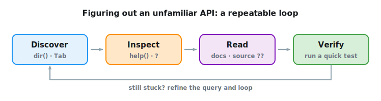

```{.python .input}
%load_ext d2lbook.tab
tab.interact_select('mxnet', 'pytorch', 'tensorflow', 'jax')
```

# Documentation

No matter how much of a framework's API we cover here,
there will always be functions, classes, and arguments
we never reach---and the libraries keep changing under us.
So rather than try to memorize the API,
the durable skill is getting good at *looking things up*:
finding what exists, reading how it works,
and confirming that it does what you think.
This short section lays out a small, repeatable loop for exactly that,
using tools built into Python and your notebook.

The official documentation is always the source of truth,
and it is worth bookmarking the reference and tutorial pages
for the framework you use:

| Framework | API reference | Tutorials |
|:--|:--|:--|
| PyTorch | [pytorch.org/docs](https://pytorch.org/docs/stable/index.html) | [pytorch.org/tutorials](https://pytorch.org/tutorials/beginner/basics/intro.html) |
| JAX | [jax.readthedocs.io](https://jax.readthedocs.io/en/latest/) | [JAX tutorials](https://jax.readthedocs.io/en/latest/tutorials.html) |
| TensorFlow | [tensorflow.org/api_docs](https://www.tensorflow.org/api_docs) | [tensorflow.org/tutorials](https://www.tensorflow.org/tutorials) |
| MXNet | [API reference](https://mxnet.apache.org/versions/1.9.1/api) | [tutorials](https://mxnet.apache.org/versions/1.9.1/api/python/docs/tutorials/) |

For most day-to-day questions, though, you do not need to leave your
notebook. Four moves, repeated until the call behaves, cover almost
everything.


:label:`fig_lookup_loop`

The examples below use each framework's standard import:

```{.python .input #lookup-api-documentation}
%%tab mxnet
from mxnet import np
```

```{.python .input #lookup-api-documentation}
%%tab pytorch
import torch
```

```{.python .input #lookup-api-documentation}
%%tab tensorflow
import tensorflow as tf
```

```{.python .input #lookup-api-documentation}
%%tab jax
import jax
```

## Discovering What Exists: `dir`

When you know roughly *where* a tool should live but not what it is called,
the `dir` function lists everything defined in a module.
For instance, to see what is on offer for generating random numbers:

```{.python .input #lookup-api-functions-and-classes-in-a-module  n=1}
%%tab mxnet
print([name for name in dir(np.random) if not name.startswith('_')][:20])
```

```{.python .input #lookup-api-functions-and-classes-in-a-module  n=1}
%%tab pytorch
print([name for name in dir(torch.distributions)
       if not name.startswith('_')][:20])
```

```{.python .input #lookup-api-functions-and-classes-in-a-module  n=1}
%%tab tensorflow
print([name for name in dir(tf.random) if not name.startswith('_')][:20])
```

```{.python .input #lookup-api-functions-and-classes-in-a-module}
%%tab jax
print([name for name in dir(jax.random) if not name.startswith('_')][:20])
```

We can usually ignore names that begin and end with `__`
(Python's special objects) or that start with a single `_`
(internal helpers). The remaining names already hint at what the module
offers---here, routines for sampling from the uniform distribution
(`uniform`), the normal distribution (`normal`),
and the multinomial distribution (`multinomial`).
In a notebook you can get the same list interactively, filtered as you
type, by writing the module name followed by a dot and pressing `Tab`---
usually the fastest way to turn up a name.

## Reading the Signature: `help`, `?`, and `??`

Once you have a name, `help` prints its docstring:
the arguments it takes, their defaults, what it returns,
and often a short example. Let us look up the `ones` function,
which we have used to build tensors:

```{.python .input #lookup-api-specific-functions-and-classes-1}
%%tab mxnet
help(np.ones)
```

```{.python .input #lookup-api-specific-functions-and-classes-1}
%%tab pytorch
help(torch.ones)
```

```{.python .input #lookup-api-specific-functions-and-classes-1}
%%tab tensorflow
help(tf.ones)
```

```{.python .input #lookup-api-specific-functions-and-classes-1}
%%tab jax
help(jax.numpy.ones)
```

The docstring tells us that `ones` creates a new tensor of the requested
shape with every element set to 1.
In a Jupyter notebook, two shortcuts make this quicker still:
`ones?` opens the same docstring in a side pane,
and `ones??` additionally displays the function's *source code*.
The source is the final word when a docstring is terse or ambiguous,
and reading it is one of the better ways to pick up idioms
from high-quality libraries.

## Verifying With a Quick Run

Docstrings can be terse, and they occasionally drift out of date.
The fastest way to be certain is to run a tiny example
and look at the result:

```{.python .input #lookup-api-specific-functions-and-classes-2}
%%tab mxnet
np.ones(4)
```

```{.python .input #lookup-api-specific-functions-and-classes-2}
%%tab pytorch
torch.ones(4)
```

```{.python .input #lookup-api-specific-functions-and-classes-2}
%%tab tensorflow
tf.ones(4)
```

```{.python .input #lookup-api-specific-functions-and-classes-2}
%%tab jax
jax.numpy.ones(4)
```

The shape and values are exactly what the docstring promised.
Making this `discover → inspect → read → verify` loop a habit
will carry you through the unfamiliar corners of any library,
long after the specific functions in this book have changed.

Coding assistants are often the quickest route to a first answer:
ask "how do I sample from a normal distribution in this framework?"
and you will usually get a function and a working call in seconds---and
they keep getting better at it.
Treat a suggestion the way you would a knowledgeable colleague's:
an excellent starting point, well worth a quick check before you build on it.
The same two habits do the checking and cost almost nothing---glance at the
signature with `help` or `?`, and run a small example.
A suggestion that survives both is one you can rely on,
and the loop above is how you run that check.

## Exercises

1. Use `dir` on your framework's random-number module to find the routine
   that samples from a *uniform* distribution. Read its signature with `help`
   (or `?`), then call it to draw a $3 \times 3$ tensor and confirm the values
   lie in $[0, 1)$.
1. You want to reduce a tensor along a single axis but cannot remember the
   keyword. Look up your framework's `sum` (or `reduce_sum`) with `help`,
   identify the argument that selects the axis, and verify on a $2 \times 3$
   tensor that summing over each axis gives the shape you predicted.
1. Ask a coding assistant "how do I concatenate two tensors along a new axis
   in my framework?" Then run its answer through the
   discover&nbsp;&rarr;&nbsp;inspect&nbsp;&rarr;&nbsp;read&nbsp;&rarr;&nbsp;verify
   loop: does the suggested function exist (`dir`), does its signature match
   the claim (`help`/`?`), and does a tiny example do what you expect?

:begin_tab:`mxnet`
[Discussions](https://d2l.discourse.group/t/38)
:end_tab:

:begin_tab:`pytorch`
[Discussions](https://d2l.discourse.group/t/39)
:end_tab:

:begin_tab:`tensorflow`
[Discussions](https://d2l.discourse.group/t/199)
:end_tab:

:begin_tab:`jax`
[Discussions](https://d2l.discourse.group/t/17972)
:end_tab:
