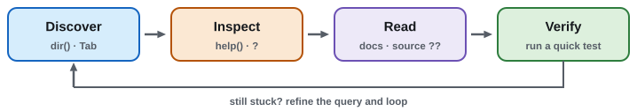

```{.python .input}
%load_ext d2lbook.tab
tab.interact_select('mxnet', 'pytorch', 'tensorflow', 'jax')
```

# Documentation
:label:`sec_lookup_api`

A framework API contains more functions, classes, and arguments than any
single text can cover, and it changes across releases. Effective use therefore
depends on being able to find an operation, inspect its interface, read its
documentation, and verify its behavior with a small example. This section
demonstrates that procedure using Python and notebook tools.

The official reference and tutorial pages document the supported interface for
each framework.

:begin_tab:`mxnet`
For MXNet these are the
[API reference](https://mxnet.apache.org/versions/1.9.1/api) and the
[tutorials](https://mxnet.apache.org/versions/1.9.1/api/python/docs/tutorials/).
One caveat: these pages document version 1.9.1
(the last release with hosted documentation),
which foregrounds the legacy `mx.nd` interface,
whereas this book uses the NumPy-style `np`/`npx` API of MXNet 2.
For MXNet specifics, the in-notebook loop below
is often the more reliable reference.
:end_tab:

:begin_tab:`pytorch`
For PyTorch these are the
[API reference](https://pytorch.org/docs/stable/index.html) and the
[tutorials](https://pytorch.org/tutorials/beginner/basics/intro.html).
:end_tab:

:begin_tab:`tensorflow`
For TensorFlow these are the
[API reference](https://www.tensorflow.org/api_docs) and the
[tutorials](https://www.tensorflow.org/tutorials).
:end_tab:

:begin_tab:`jax`
For JAX these are the
[API reference](https://jax.readthedocs.io/en/latest/) and the
[tutorials](https://jax.readthedocs.io/en/latest/tutorials.html).
:end_tab:

Many routine questions can be answered without leaving the notebook. The
procedure has four steps: discover, inspect, read, and verify.


:label:`fig_lookup_loop`

The examples below start from the standard import:

```{.python .input #lookup-api-documentation}
%%tab mxnet
from mxnet import np
from pprint import pprint
```

```{.python .input #lookup-api-documentation}
%%tab pytorch
import torch
from pprint import pprint
```

```{.python .input #lookup-api-documentation}
%%tab tensorflow
import tensorflow as tf
from pprint import pprint
```

```{.python .input #lookup-api-documentation}
%%tab jax
import jax
from pprint import pprint
```

## Discovering What Exists: `dir`

When you know roughly *where* a tool should live but not what it is called,
the `dir` function lists the names defined in a module.
For instance, to inspect the available random-sampling tools
(we print the first twenty names):

```{.python .input #lookup-api-functions-and-classes-in-a-module  n=1}
%%tab mxnet
pprint([name for name in dir(np.random)
        if not name.startswith('_')][:20], compact=True)
```

```{.python .input #lookup-api-functions-and-classes-in-a-module  n=1}
%%tab pytorch
pprint([name for name in dir(torch.distributions)
        if not name.startswith('_')][:20], compact=True)
```

```{.python .input #lookup-api-functions-and-classes-in-a-module  n=1}
%%tab tensorflow
pprint([name for name in dir(tf.random)
        if not name.startswith('_')][:20], compact=True)
```

```{.python .input #lookup-api-functions-and-classes-in-a-module}
%%tab jax
pprint([name for name in dir(jax.random)
        if not name.startswith('_')][:20], compact=True)
```

We can usually ignore names that begin and end with `__`
(Python's special objects) or that start with a single `_`
(internal helpers). The remaining names already hint
at what the module offers.

:begin_tab:`mxnet`
Here almost every name is a sampler: draws from classical distributions
(`beta`, `gamma`, `multinomial`, `normal`, ...) alongside NumPy-style
conveniences such as `rand`, `randint`, and `randn`.
:end_tab:

:begin_tab:`pytorch`
Here the names are distribution *classes* such as `Bernoulli`,
`Categorical`, and `Gamma`; each can be instantiated and then sampled
from. The `Transform` entries build new distributions by transforming
existing ones.
:end_tab:

:begin_tab:`tensorflow`
Here we can spot samplers such as `gamma`, `normal`, and `poisson`,
next to utilities like `Generator` and `set_seed` that manage the
random state.
:end_tab:

:begin_tab:`jax`
Here the names are samplers (`bernoulli`, `beta`, `cauchy`,
`exponential`, `gamma`, ...) plus `PRNGKey`, which creates the explicit
random key that every JAX sampler takes.
:end_tab:

In a notebook you can get the same list interactively, filtered as you
type, by writing the module name followed by a dot and pressing `Tab`;
this often locates a name quickly.

## Reading the Signature: `help`, `?`, and `??`

Once you have a name, `help` prints its docstring:
the arguments it takes, their defaults, what it returns,
and often a short example. Let us look up the `ones` function,
which we have used to build tensors:

```{.python .input #lookup-api-specific-functions-and-classes-1}
%%tab mxnet
help(np.ones)
```

```{.python .input #lookup-api-specific-functions-and-classes-1}
%%tab pytorch
help(torch.ones)
```

```{.python .input #lookup-api-specific-functions-and-classes-1}
%%tab tensorflow
help(tf.ones)
```

```{.python .input #lookup-api-specific-functions-and-classes-1}
%%tab jax
help(jax.numpy.ones)
```

The docstring tells us that `ones` creates a new tensor of the requested
shape with every element set to 1.
In a Jupyter notebook, two shortcuts make this quicker still:
`ones?` opens the same docstring in a side pane,
and `ones??` additionally displays the function's *source code*.
When a docstring is terse or ambiguous, the source can clarify the
implementation. Reading library source also reveals established usage idioms.

## Verifying With a Quick Run

Docstrings can be terse, and they occasionally drift out of date.
A small example can verify the behavior directly:

```{.python .input #lookup-api-specific-functions-and-classes-2}
%%tab mxnet
np.ones(4)
```

```{.python .input #lookup-api-specific-functions-and-classes-2}
%%tab pytorch
torch.ones(4)
```

```{.python .input #lookup-api-specific-functions-and-classes-2}
%%tab tensorflow
tf.ones(4)
```

```{.python .input #lookup-api-specific-functions-and-classes-2}
%%tab jax
jax.numpy.ones(4)
```

The result has the documented shape and values.
Making this `discover → inspect → read → verify` loop a habit
will carry you through the unfamiliar corners of any library,
long after the specific functions in this book have changed.

Coding assistants can propose an API call for a question such as “how do I
sample from a normal distribution in this framework?” Treat the result as an
unverified candidate that still goes through the loop above.
Glance at the signature with `help` or `?`, run a small example,
and accept the suggestion only once it survives both.

## Summary

For an unfamiliar operation, discover candidate names, inspect the signature,
read the relevant documentation, and verify the behavior with the smallest run
that exposes shapes, dtypes, and values. This procedure remains valid as library
APIs change and applies equally to suggestions from search or coding assistants.

## Exercises

:begin_tab:`mxnet`
1. [code] **Discovering uniform sampling.** Use `dir` on `np.random`
   to find the routine that samples from a *uniform*
   distribution. Read its signature with `help` (or `?`), then call it to
   draw a $3 \times 3$ tensor and confirm the values lie in $[0, 1)$.
1. [code] **Reducing along an axis.** You want to reduce a tensor along a
   single axis but cannot remember the keyword. Look up `np.sum`
   with `help`, identify the argument that selects
   the axis, and verify on a $2 \times 3$ tensor that summing over each
   axis gives the shape you predicted.
1. [code] **Checking a coding assistant's answer.** Ask a coding assistant
   how to concatenate two MXNet tensors along a new axis. Then
   run its answer through the discover → inspect → read → verify loop:
   does the suggested function exist (`dir`), does its signature match the
   claim (`help`/`?`), and does a tiny example do what you expect?
:end_tab:

:begin_tab:`pytorch`
1. [code] **Discovering uniform sampling.** Use `dir` on
   `torch.distributions` to find the class that samples from a *uniform*
   distribution. Read its signature with `help` (or `?`), then use it to
   draw a $3 \times 3$ tensor and confirm the values lie in $[0, 1)$.
1. [code] **Reducing along an axis.** You want to reduce a tensor along a
   single axis but cannot remember the keyword. Look up `torch.sum`
   with `help`, identify the argument that selects
   the axis, and verify on a $2 \times 3$ tensor that summing over each
   axis gives the shape you predicted.
1. [code] **Checking a coding assistant's answer.** Ask a coding assistant
   how to concatenate two PyTorch tensors along a new axis. Then
   run its answer through the discover → inspect → read → verify loop:
   does the suggested function exist (`dir`), does its signature match the
   claim (`help`/`?`), and does a tiny example do what you expect?
:end_tab:

:begin_tab:`tensorflow`
1. [code] **Discovering uniform sampling.** Use `dir` on `tf.random`
   to find the routine that samples from a *uniform*
   distribution. Read its signature with `help` (or `?`), then call it to
   draw a $3 \times 3$ tensor and confirm the values lie in $[0, 1)$.
1. [code] **Reducing along an axis.** You want to reduce a tensor along a
   single axis but cannot remember the keyword. Look up `tf.reduce_sum`
   with `help`, identify the argument that selects
   the axis, and verify on a $2 \times 3$ tensor that summing over each
   axis gives the shape you predicted.
1. [code] **Checking a coding assistant's answer.** Ask a coding assistant
   how to concatenate two TensorFlow tensors along a new axis. Then
   run its answer through the discover → inspect → read → verify loop:
   does the suggested function exist (`dir`), does its signature match the
   claim (`help`/`?`), and does a tiny example do what you expect?
:end_tab:

:begin_tab:`jax`
1. [code] **Discovering uniform sampling.** Use `dir` on `jax.random`
   to find the routine that samples from a *uniform* distribution. Read its
   signature with `help` (or `?`), then call it, remembering that every JAX
   sampler takes an explicit key, to draw a $3 \times 3$ array and confirm
   the values lie in $[0, 1)$.
1. [code] **Reducing along an axis.** You want to reduce an array along a
   single axis but cannot remember the keyword. Look up `jnp.sum`
   with `help`, identify the argument that selects
   the axis, and verify on a $2 \times 3$ array that summing over each
   axis gives the shape you predicted.
1. [code] **Checking a coding assistant's answer.** Ask a coding assistant
   how to concatenate two JAX arrays along a new axis. Then
   run its answer through the discover → inspect → read → verify loop:
   does the suggested function exist (`dir`), does its signature match the
   claim (`help`/`?`), and does a tiny example do what you expect?
:end_tab:

4. [code] **Reading the source.** Pick a function you have used in this
   chapter whose docstring does not fully explain its behavior on an edge
   case you care about, for example what `reshape` does when a dimension
   does not evenly divide the requested shape. Use `??` or your editor's
   go-to-definition to read its source, find the line that decides the edge
   case, and confirm your reading with a small example.
1. [code] **A confidently wrong assistant.** Ask a coding assistant for a
   function that performs an operation that no single library function
   provides, for example sorting a tensor's axes by size. If it
   names a function, check with `dir` or `hasattr` whether that function
   exists. Describe in one or two sentences what about the answer would
   have fooled you had you skipped the discover step.

:begin_tab:`mxnet`
[Discussions](https://d2l.discourse.group/t/38)
:end_tab:

:begin_tab:`pytorch`
[Discussions](https://d2l.discourse.group/t/39)
:end_tab:

:begin_tab:`tensorflow`
[Discussions](https://d2l.discourse.group/t/199)
:end_tab:

:begin_tab:`jax`
[Discussions](https://d2l.discourse.group/t/17972)
:end_tab:

<!-- slides -->

::: {.slide}
::: {.cover}
[Dive into Deep Learning · §2.7]{.kicker}

Using an unfamiliar API<br>**discover · inspect · read · verify**.
:::
:::

::: {.slide title="A procedure for consulting an API"}
[Motivation]{.kicker}

::: {.cols .vc}
::: {.col}
No book covers an entire framework, and libraries change across releases.
Four steps answer most routine questions from within a notebook: discover
available names, inspect the interface, read the documentation, and verify the
behavior with a small example.

::: {.d2l-note}
Use the official reference and tutorial pages for the supported interface.
:::
:::

::: {.col .fig .big}
@fig:lookup-api-discovery-loop
:::
:::
:::

::: {.slide title="dir discovers what exists"}
[Discover]{.kicker}

Know roughly *where* a tool should live, but not its name? `dir` lists a
module's contents; the names alone sketch what is on offer:

@lookup-api-functions-and-classes-in-a-module

Skip the `_`-prefixed internals. In a notebook, `module.` + `Tab` gives
the same list, filtered as you type, usually the fastest way to turn up
a name.
:::

::: {.slide title="help reads the signature; ?? reads the source"}
[Inspect · read]{.kicker}

`help(...)` prints the docstring: arguments, defaults, return value,
often an example.

@-lookup-api-specific-functions-and-classes-1

. . .

::: {.d2l-note}
In Jupyter, `ones?` opens the docstring in a side pane, and `ones??`
shows the **source code**, which can clarify a terse or ambiguous docstring.
:::
:::

::: {.slide title="A tiny run settles it"}
[Verify]{.kicker}

Docstrings can drift out of date; verify the current behavior with a small call:

@lookup-api-specific-functions-and-classes-2

The result has the documented shape and values. The
**discover → inspect → read → verify** loop remains useful as APIs change.
:::

::: {.slide title="Coding assistants enter the same loop"}
[Assistants]{.kicker}

An assistant may produce a plausible function and call. Treat the suggestion
as a candidate to check before building on it.

::: {.d2l-note .rule}
Glance at the signature (`help` / `?`), then run a small example. A
suggestion that survives both is one you can rely on.
:::
:::

::: {.slide title="Recap"}
[Wrap-up]{.kicker}

- **Discover** with `dir` (or `Tab`-completion).
- **Inspect** with `help` / `?`; **read** the source with `??`.
- **Verify** with a tiny run.
- Assistant answers enter the same loop before you rely on them.
:::
