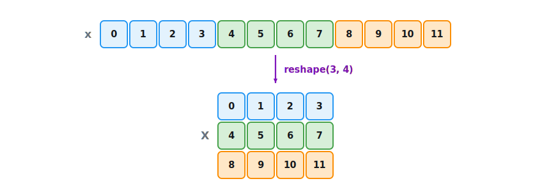
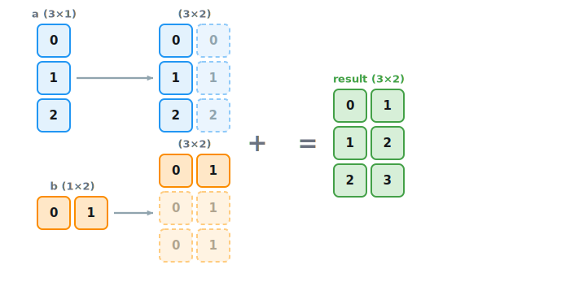

```{.python .input}
%load_ext d2lbook.tab
tab.interact_select('mxnet', 'pytorch', 'tensorflow', 'jax')
```

# Data Manipulation
:label:`sec_ndarray`

In order to get anything done, 
we need some way to store and manipulate data.
Generally, there are two important things 
we need to do with data: 
(i) acquire them; 
and (ii) process them once they are inside the computer. 
There is no point in acquiring data 
without some way to store it, 
so to start, let's get our hands dirty
with $n$-dimensional arrays, 
which we also call *tensors*.
If you already know the NumPy 
scientific computing package :cite:`Harris.Millman.Walt.ea.2020`, 
much of this will look familiar.
For all modern deep learning frameworks,
the *tensor class* (`ndarray` in MXNet, 
`Tensor` in PyTorch and TensorFlow,
`jax.Array` in JAX) 
resembles NumPy's `ndarray`,
with two additions.
First, the tensor class
supports automatic differentiation
(:numref:`sec_autograd`).
Second, it uses GPUs
to accelerate numerical computation,
whereas NumPy only runs on CPUs.
These properties make neural networks
both easy to code and fast to run.
(We cover how to place tensors on a GPU and move them between devices
in :numref:`sec_use_gpu`; until then, every tensor we create lives in
CPU memory.)


## Getting Started

:begin_tab:`mxnet`
To start, we import the `np` (`numpy`) and
`npx` (`numpy_extension`) modules from MXNet.
Here, the `np` module includes 
functions supported by NumPy,
while the `npx` module contains a set of extensions
that support deep learning 
within a NumPy-like environment.
When using tensors, we almost always 
invoke the `set_np` function:
this is for compatibility of tensor processing 
by other components of MXNet.
:end_tab:

:begin_tab:`pytorch`
To start, we import the PyTorch library.
Note that the package name is `torch`.
:end_tab:

:begin_tab:`tensorflow`
To start, we import `tensorflow`. 
For brevity, practitioners 
often assign the alias `tf`.
:end_tab:

:begin_tab:`jax`
To start, we import `jax` and its
NumPy-like numerical interface `jax.numpy`,
conventionally aliased as `jnp`.
:end_tab:

```{.python .input #ndarray-getting-started-1}
%%tab mxnet
from mxnet import np, npx
npx.set_np()
```

```{.python .input #ndarray-getting-started-1}
%%tab pytorch
import torch
```

```{.python .input #ndarray-getting-started-1}
%%tab tensorflow
import tensorflow as tf
```

```{.python .input #ndarray-getting-started-1}
%%tab jax
import jax
from jax import numpy as jnp
```

A tensor represents a (possibly multidimensional) array of numerical values.
In the one-dimensional case, i.e., when only one axis is needed for the data,
a tensor is called a *vector*.
With two axes, a tensor is called a *matrix*.
With $k > 2$ axes, we drop the specialized names
and just refer to the object as a $k^\textrm{th}$-*order tensor*.

Several functions create new tensors
prepopulated with values.
For example, by invoking `arange(n)`,
we can create a vector of evenly spaced values,
starting at 0 (included)
and ending at `n` (not included).
By default, the interval size is $1$.
Unless otherwise specified,
new tensors are stored in main memory
and designated for CPU-based computation.

:begin_tab:`tensorflow`
In TensorFlow, this function is named `range` rather than `arange`.
:end_tab:

```{.python .input #ndarray-getting-started-2}
%%tab mxnet
x = np.arange(12)
x
```

```{.python .input #ndarray-getting-started-2}
%%tab pytorch
x = torch.arange(12, dtype=torch.float32)
x
```

```{.python .input #ndarray-getting-started-2}
%%tab tensorflow
x = tf.range(12, dtype=tf.float32)
x
```

```{.python .input #ndarray-getting-started-2}
%%tab jax
x = jnp.arange(12, dtype=jnp.float32)
x
```

The `dtype` (data type) of a tensor determines how its elements are stored.
We use **32-bit** floating point (`float32`) as the default throughout these
chapters. Training systems also use lower-precision floating-point formats,
often together with higher-precision accumulation. Chapter 6 develops those
formats and their numerical tradeoffs. You can inspect a tensor's type via its
`dtype` attribute. In finite precision, naive
computations can overflow or underflow, which is why later sections compute
quantities such as the softmax and cross-entropy with stabilized formulas
(:numref:`sec_softmax`).

:begin_tab:`mxnet`
MXNet's `np.arange` already defaults to `float32`,
so the cell above needs no explicit `dtype`.
To cast between types, use `astype`.
:end_tab:

:begin_tab:`pytorch`
Integer ranges like `arange` default to an integer type,
which is why the cell above requests `dtype=torch.float32` explicitly.
To cast between types, use `.to` (or shortcuts such as `.float()`).
:end_tab:

:begin_tab:`tensorflow`
Integer ranges like `range` default to an integer type,
which is why the cell above requests `dtype=tf.float32` explicitly.
To cast between types, use `tf.cast`.
:end_tab:

:begin_tab:`jax`
Integer ranges like `arange` default to an integer type,
which is why the cell above requests `dtype=jnp.float32` explicitly.
To cast between types, use `astype`.
:end_tab:

:begin_tab:`mxnet`
Each of these values is called
an *element* of the tensor.
The tensor `x` contains 12 elements.
We can inspect the total number of elements 
in a tensor via its `size` attribute.
:end_tab:

:begin_tab:`pytorch`
Each of these values is called
an *element* of the tensor.
The tensor `x` contains 12 elements.
We can inspect the total number of elements 
in a tensor via its `numel` method.
:end_tab:

:begin_tab:`tensorflow`
Each of these values is called
an *element* of the tensor.
The tensor `x` contains 12 elements.
We can inspect the total number of elements 
in a tensor via the `size` function.
:end_tab:

:begin_tab:`jax`
Each of these values is called
an *element* of the tensor.
The tensor `x` contains 12 elements.
We can inspect the total number of elements 
in a tensor via its `size` attribute.
:end_tab:

```{.python .input #ndarray-getting-started-3}
%%tab mxnet, jax
x.size
```

```{.python .input #ndarray-getting-started-3}
%%tab pytorch
x.numel()
```

```{.python .input #ndarray-getting-started-3}
%%tab tensorflow
tf.size(x)
```

We can access a tensor's *shape* 
(the length along each axis)
by inspecting its `shape` attribute.
Because we are dealing with a vector here,
the `shape` contains just a single element
and is identical to the size.

```{.python .input #ndarray-getting-started-4}
x.shape
```

We can change the shape of a tensor
without altering its size or values,
by invoking `reshape`.
For example, we can transform 
our vector `x` whose shape is (12,) 
to a matrix `X` with shape (3, 4).
This new tensor retains all elements
but reconfigures them into a matrix.
Notice that the elements of our vector
are laid out one row at a time and thus
`x[3] == X[0, 3]`, as :numref:`fig_ndarray_reshape` illustrates.


:label:`fig_ndarray_reshape`

```{.python .input #ndarray-getting-started-5}
%%tab mxnet, pytorch, jax
X = x.reshape(3, 4)
X
```

```{.python .input #ndarray-getting-started-5}
%%tab tensorflow
X = tf.reshape(x, (3, 4))
X
```

Note that specifying every shape component
to `reshape` is redundant.
Because we already know our tensor's size,
we can work out one component of the shape given the rest.
For example, given a tensor of size $n$
and target shape ($h$, $w$),
we know that $w = n/h$.
To automatically infer one component of the shape,
we can place a `-1` for the shape component
that should be inferred automatically.
In our case, instead of calling `x.reshape(3, 4)`,
we could have equivalently called `x.reshape(-1, 4)` or `x.reshape(3, -1)`.

For a contiguous tensor such as `x`, a framework can implement `reshape` by
changing only shape metadata. More generally, `reshape` may return either a
view that shares storage or a copy, depending on the layout and framework.
Code should therefore not rely on storage sharing unless it explicitly asks
for a view and satisfies that operation's layout requirements.

Practitioners often need to work with tensors
initialized to contain all 0s or 1s.
We can construct a tensor with all elements set to 0 
and a shape of (2, 3, 4) via the `zeros` function.

```{.python .input #ndarray-getting-started-6}
%%tab mxnet
np.zeros((2, 3, 4))
```

```{.python .input #ndarray-getting-started-6}
%%tab pytorch
torch.zeros((2, 3, 4))
```

```{.python .input #ndarray-getting-started-6}
%%tab tensorflow
tf.zeros((2, 3, 4))
```

```{.python .input #ndarray-getting-started-6}
%%tab jax
jnp.zeros((2, 3, 4))
```

Similarly, we can create a tensor 
with all 1s by invoking `ones`.

```{.python .input #ndarray-getting-started-7}
%%tab mxnet
np.ones((2, 3, 4))
```

```{.python .input #ndarray-getting-started-7}
%%tab pytorch
torch.ones((2, 3, 4))
```

```{.python .input #ndarray-getting-started-7}
%%tab tensorflow
tf.ones((2, 3, 4))
```

```{.python .input #ndarray-getting-started-7}
%%tab jax
jnp.ones((2, 3, 4))
```

We often wish to 
sample each element randomly (and independently) 
from a given probability distribution.
For example, the parameters of neural networks
are often initialized randomly, in part to *break symmetry* between units:
if every weight in a layer started at the same value (say, zero),
the units would all compute the same thing and could never specialize.
The following snippet creates a tensor 
with elements drawn from 
a standard Gaussian (normal) distribution
with mean 0 and standard deviation 1.

```{.python .input #ndarray-getting-started-8}
%%tab mxnet
np.random.normal(0, 1, size=(3, 4))
```

```{.python .input #ndarray-getting-started-8}
%%tab pytorch
torch.randn(3, 4)
```

```{.python .input #ndarray-getting-started-8}
%%tab tensorflow
tf.random.normal(shape=[3, 4])
```

```{.python .input #ndarray-getting-started-8}
%%tab jax
# Any call of a random function in JAX requires a key to be
# specified, feeding the same key to a random function will
# always result in the same sample being generated
jax.random.normal(jax.random.key(0), (3, 4))
```

Random sampling raises the question of *reproducibility*. Calling a sampler
repeatedly gives different draws, which is usually what we want, but for
debugging or for figures that should not change between runs we fix a *seed*.

:begin_tab:`mxnet`
MXNet keeps a global generator that `np.random.seed` resets:
after seeding, the sequence of draws is repeatable.
:end_tab:

:begin_tab:`pytorch`
PyTorch keeps a global generator that `torch.manual_seed` resets:
after seeding, the sequence of draws is repeatable.
:end_tab:

:begin_tab:`tensorflow`
TensorFlow keeps a global generator that `tf.random.set_seed` resets:
after seeding, the sequence of draws is repeatable.
:end_tab:

:begin_tab:`jax`
JAX takes a more explicit stance: instead of a hidden global generator,
every draw threads a *key* through the sampler, and the same key always
yields the same sample, as the cell above shows.
:end_tab:

Finally, we can construct tensors by
supplying the exact values for each element
via (possibly nested) Python list(s)
containing numerical literals.
Here, we construct a matrix with a list of lists,
where the outermost list corresponds to axis 0,
and the inner list corresponds to axis 1.

```{.python .input #ndarray-getting-started-9}
%%tab mxnet
np.array([[2, 1, 4, 3], [1, 2, 3, 4], [4, 3, 2, 1]])
```

```{.python .input #ndarray-getting-started-9}
%%tab pytorch
torch.tensor([[2, 1, 4, 3], [1, 2, 3, 4], [4, 3, 2, 1]])
```

```{.python .input #ndarray-getting-started-9}
%%tab tensorflow
tf.constant([[2, 1, 4, 3], [1, 2, 3, 4], [4, 3, 2, 1]])
```

```{.python .input #ndarray-getting-started-9}
%%tab jax
jnp.array([[2, 1, 4, 3], [1, 2, 3, 4], [4, 3, 2, 1]])
```

## Indexing and Slicing

As with Python lists,
we can access tensor elements 
by indexing (starting with 0).
To access an element based on its position
relative to the end of the list,
we can use negative indexing.
We can also access whole ranges of indices 
via slicing (e.g., `X[start:stop]`), 
where the returned value includes 
the first index (`start`) *but not the last* (`stop`).
Finally, when only one index (or slice)
is specified for a $k^\textrm{th}$-order tensor,
it is applied along axis 0.
Thus, in the following code,
`[-1]` selects the last row and `[1:3]`
selects the second and third rows.

```{.python .input #ndarray-indexing-and-slicing-1}
X[-1], X[1:3]
```

:begin_tab:`mxnet, pytorch`
Beyond reading them, we can also *write* elements of a matrix by specifying indices.
:end_tab:

:begin_tab:`tensorflow`
`Tensors` in TensorFlow are immutable, and cannot be assigned to.
`Variables` in TensorFlow are mutable containers of state that support
assignments. Keep in mind that gradients in TensorFlow do not flow backwards
through `Variable` assignments.

Beyond assigning a value to the entire `Variable`, we can write elements of a
`Variable` by specifying indices.
:end_tab:

```{.python .input #ndarray-indexing-and-slicing-2}
%%tab mxnet, pytorch
X[1, 2] = 17
X
```

```{.python .input #ndarray-indexing-and-slicing-2}
%%tab tensorflow
X_var = tf.Variable(X)
X_var[1, 2].assign(17)
X_var
```

```{.python .input #ndarray-indexing-and-slicing-2}
%%tab jax
# JAX arrays are immutable. jax.numpy.ndarray.at index
# update operators create a new array with the corresponding
# modifications made
X_new_1 = X.at[1, 2].set(17)
X_new_1
```

If we want to assign multiple elements the same value,
we apply the indexing on the left-hand side 
of the assignment operation.
For instance, `[:2, :]` accesses 
the first and second rows,
where `:` takes all the elements along axis 1 (column).
While we discussed indexing for matrices,
this also works for vectors
and for tensors of more than two dimensions.

```{.python .input #ndarray-indexing-and-slicing-3}
%%tab mxnet, pytorch
X[:2, :] = 12
X
```

```{.python .input #ndarray-indexing-and-slicing-3}
%%tab tensorflow
X_var = tf.Variable(X)
X_var[:2, :].assign(tf.ones(X_var[:2,:].shape, dtype=tf.float32) * 12)
X_var
```

```{.python .input #ndarray-indexing-and-slicing-3}
%%tab jax
X_new_2 = X_new_1.at[:2, :].set(12)
X_new_2
```

## Operations

Now that we know how to construct tensors
and how to read from and write to their elements,
we can begin to manipulate them
with various mathematical operations.
Among the most useful of these 
are the *elementwise* operations.
These apply a standard scalar operation
to each element of a tensor.
For functions that take two tensors as inputs,
elementwise operations apply some standard binary operator
on each pair of corresponding elements.
We can create an elementwise function 
from any function that maps 
from a scalar to a scalar.

In mathematical notation, we denote such
*unary* scalar operators (taking one input)
by the signature 
$f: \mathbb{R} \rightarrow \mathbb{R}$.
This just means that the function maps
from any real number onto some other real number.
Most standard operators, including unary ones like $e^x$, can be applied elementwise.

```{.python .input #ndarray-operations-1}
%%tab mxnet
np.exp(x)
```

```{.python .input #ndarray-operations-1}
%%tab pytorch
torch.exp(x)
```

```{.python .input #ndarray-operations-1}
%%tab tensorflow
tf.exp(x)
```

```{.python .input #ndarray-operations-1}
%%tab jax
jnp.exp(x)
```

Likewise, we denote *binary* scalar operators,
which map pairs of real numbers
to a (single) real number
via the signature 
$f: \mathbb{R}, \mathbb{R} \rightarrow \mathbb{R}$.
Given any two vectors $\mathbf{u}$ 
and $\mathbf{v}$ *of the same shape*,
and a binary operator $f$, we can produce a vector
$\mathbf{c} = F(\mathbf{u},\mathbf{v})$
by setting $c_i \gets f(u_i, v_i)$ for all $i$,
where $c_i, u_i$, and $v_i$ are the $i^\textrm{th}$ elements
of vectors $\mathbf{c}, \mathbf{u}$, and $\mathbf{v}$.
Here, we produced the vector-valued
$F: \mathbb{R}^d, \mathbb{R}^d \rightarrow \mathbb{R}^d$
by *lifting* the scalar function
to an elementwise vector operation.
The common standard arithmetic operators
for addition (`+`), subtraction (`-`), 
multiplication (`*`), division (`/`), 
and exponentiation (`**`)
have all been *lifted* to elementwise operations
for identically-shaped tensors of arbitrary shape.

```{.python .input #ndarray-operations-2}
%%tab mxnet
x = np.array([1, 2, 4, 8])
y = np.array([2, 2, 2, 2])
x + y, x - y, x * y, x / y, x ** y
```

```{.python .input #ndarray-operations-2}
%%tab pytorch
x = torch.tensor([1.0, 2, 4, 8])
y = torch.tensor([2, 2, 2, 2])
x + y, x - y, x * y, x / y, x ** y
```

```{.python .input #ndarray-operations-2}
%%tab tensorflow
x = tf.constant([1.0, 2, 4, 8])
y = tf.constant([2.0, 2, 2, 2])
x + y, x - y, x * y, x / y, x ** y
```

```{.python .input #ndarray-operations-2}
%%tab jax
x = jnp.array([1.0, 2, 4, 8])
y = jnp.array([2, 2, 2, 2])
x + y, x - y, x * y, x / y, x ** y
```

In addition to elementwise computations,
we can also perform linear algebraic operations,
such as dot products and matrix multiplications.
We will elaborate on these
in :numref:`sec_linear-algebra`.

We can also *concatenate* multiple tensors,
stacking them end-to-end to form a larger one.
We just need to provide a list of tensors
and tell the system along which axis to concatenate.
The example below shows what happens when we concatenate
two matrices along rows (axis 0)
instead of columns (axis 1).
We can see that the first output's axis-0 length ($6$)
is the sum of the two input tensors' axis-0 lengths ($3 + 3$);
while the second output's axis-1 length ($8$)
is the sum of the two input tensors' axis-1 lengths ($4 + 4$).

```{.python .input #ndarray-operations-3}
%%tab mxnet
X = np.arange(12).reshape(3, 4)
Y = np.array([[2, 1, 4, 3], [1, 2, 3, 4], [4, 3, 2, 1]])
np.concatenate([X, Y], axis=0), np.concatenate([X, Y], axis=1)
```

```{.python .input #ndarray-operations-3}
%%tab pytorch
X = torch.arange(12, dtype=torch.float32).reshape((3,4))
Y = torch.tensor([[2.0, 1, 4, 3], [1, 2, 3, 4], [4, 3, 2, 1]])
torch.cat((X, Y), dim=0), torch.cat((X, Y), dim=1)
```

```{.python .input #ndarray-operations-3}
%%tab tensorflow
X = tf.reshape(tf.range(12, dtype=tf.float32), (3, 4))
Y = tf.constant([[2.0, 1, 4, 3], [1, 2, 3, 4], [4, 3, 2, 1]])
tf.concat([X, Y], axis=0), tf.concat([X, Y], axis=1)
```

```{.python .input #ndarray-operations-3}
%%tab jax
X = jnp.arange(12, dtype=jnp.float32).reshape((3, 4))
Y = jnp.array([[2.0, 1, 4, 3], [1, 2, 3, 4], [4, 3, 2, 1]])
jnp.concatenate((X, Y), axis=0), jnp.concatenate((X, Y), axis=1)
```

Sometimes, we want to 
construct a boolean tensor via *logical statements*.
Take `X == Y` as an example.
For each position `i, j`, if `X[i, j]` and `Y[i, j]` are equal, 
then the corresponding entry in the result is `True`,
otherwise it is `False`.
(Booleans behave as 1 and 0 in arithmetic, so summing
such a mask counts the positions where the two tensors agree.)

```{.python .input #ndarray-operations-4}
X == Y
```

Summing all the elements in the tensor yields a tensor with only one element.

```{.python .input #ndarray-operations-5}
%%tab mxnet, pytorch, jax
X.sum()
```

```{.python .input #ndarray-operations-5}
%%tab tensorflow
tf.reduce_sum(X)
```

## Broadcasting
:label:`subsec_broadcasting`

By now, you know how to perform 
elementwise binary operations
on two tensors of the same shape. 
Under certain conditions,
even when shapes differ, 
we can still perform elementwise binary operations
by invoking the *broadcasting mechanism*
(a convention inherited from NumPy).

Broadcasting follows a simple rule. Line the two shapes up
from the *right* and compare them axis by axis: two axes are compatible when
they are equal or when one of them is $1$ (a missing leading axis counts as
$1$). The size-$1$ axis is then *stretched* to match the other, by virtually
copying its entries, and the elementwise operation is applied to the
resulting arrays. If any pair
of axes is incompatible, the operation raises an error rather than guessing.
:numref:`fig_ndarray_broadcasting` shows the mechanism at work on the example
that follows: each size-$1$ axis is stretched until both operands share the
shape $3\times2$.


:label:`fig_ndarray_broadcasting`

```{.python .input #ndarray-broadcasting-1}
%%tab mxnet
a = np.arange(3).reshape(3, 1)
b = np.arange(2).reshape(1, 2)
a, b
```

```{.python .input #ndarray-broadcasting-1}
%%tab pytorch
a = torch.arange(3).reshape((3, 1))
b = torch.arange(2).reshape((1, 2))
a, b
```

```{.python .input #ndarray-broadcasting-1}
%%tab tensorflow
a = tf.reshape(tf.range(3), (3, 1))
b = tf.reshape(tf.range(2), (1, 2))
a, b
```

```{.python .input #ndarray-broadcasting-1}
%%tab jax
a = jnp.arange(3).reshape((3, 1))
b = jnp.arange(2).reshape((1, 2))
a, b
```

Since `a` and `b` are $3\times1$ 
and $1\times2$ matrices, respectively,
their shapes do not match up.
Broadcasting produces a larger $3\times2$ matrix 
by replicating matrix `a` along the columns
and matrix `b` along the rows
before adding them elementwise.

```{.python .input #ndarray-broadcasting-2}
a + b
```

What happens when the shapes are *not* compatible? Lining up $(3, 2)$ and
$(2, 3)$ from the right pairs $2$ with $3$ and $3$ with $2$: neither axis pair
matches and neither member is $1$, so the framework refuses rather than
guessing.

```{.python .input #ndarray-broadcasting-3}
%%tab mxnet
try:
    np.ones((3, 2)) + np.ones((2, 3))
except Exception as e:
    print(e)
```

```{.python .input #ndarray-broadcasting-3}
%%tab pytorch
try:
    torch.ones((3, 2)) + torch.ones((2, 3))
except Exception as e:
    print(e)
```

```{.python .input #ndarray-broadcasting-3}
%%tab tensorflow
try:
    tf.ones((3, 2)) + tf.ones((2, 3))
except Exception as e:
    print(e)
```

```{.python .input #ndarray-broadcasting-3}
%%tab jax
try:
    jnp.ones((3, 2)) + jnp.ones((2, 3))
except Exception as e:
    print(e)
```

## Saving Memory

Running operations can cause new memory to be
allocated to host results.
For example, if we write `Y = Y + X`,
we dereference the tensor that `Y` used to point to
and instead point `Y` at the newly allocated memory.
We can demonstrate the rebinding with Python's `id()` function,
which identifies a Python object for the duration of its lifetime.
Note that after we run `Y = Y + X`,
`id(Y)` changes.
That is because Python first evaluates `Y + X`,
allocating new memory for the result 
and then binds `Y` to the new tensor object. This test says nothing about the
address of the tensor's underlying storage.

```{.python .input #ndarray-saving-memory-1}
before = id(Y)
Y = Y + X
id(Y) == before
```

This might be undesirable for two reasons.
First, we do not want to run around
allocating memory unnecessarily all the time.
In machine learning, we often have
gigabytes of parameters
and update all of them multiple times per second.
In frameworks that support mutation, in-place updates can avoid these
allocations. They must be used with care because automatic differentiation
may need an earlier value to compute a gradient; functional and compiled
systems may instead reuse buffers internally without exposing mutation.
Second, we might point at the 
same parameters from multiple variables.
If we do not update in place, 
we must be careful to update all of these references,
lest we spring a memory leak 
or inadvertently refer to stale parameters.

:begin_tab:`mxnet, pytorch`
Fortunately, performing in-place operations is easy.
We can assign the result of an operation
to a previously allocated array `Y`
by using slice notation: `Y[:] = <expression>`.
To illustrate this concept, 
we overwrite the values of tensor `Z`,
after initializing it, using `zeros_like`,
to have the same shape as `Y`.
Slice assignment writes through to `Z`'s existing buffer,
the same storage sharing we saw with `reshape`,
now working in our favor.
:end_tab:

:begin_tab:`tensorflow`
`Variables` are mutable containers of state in TensorFlow. They provide
a way to store your model parameters.
We can assign the result of an operation
to a `Variable` with `assign`.
To illustrate this concept, 
we overwrite the values of `Variable` `Z`
after initializing it, using `zeros_like`,
to have the same shape as `Y`.
:end_tab:

```{.python .input #ndarray-saving-memory-2}
%%tab mxnet
Z = np.zeros_like(Y)
print('id(Z):', id(Z))
Z[:] = X + Y
print('id(Z):', id(Z))
```

```{.python .input #ndarray-saving-memory-2}
%%tab pytorch
Z = torch.zeros_like(Y)
print('id(Z):', id(Z))
Z[:] = X + Y
print('id(Z):', id(Z))
```

```{.python .input #ndarray-saving-memory-2}
%%tab tensorflow
Z = tf.Variable(tf.zeros_like(Y))
print('id(Z):', id(Z))
Z.assign(X + Y)
print('id(Z):', id(Z))
```

```{.python .input #ndarray-saving-memory-2}
%%tab jax
# JAX arrays do not allow in-place operations
```

:begin_tab:`mxnet, pytorch`
If the value of `X` is not reused in subsequent computations,
we can also use `X[:] = X + Y` or `X += Y`
to reduce the memory overhead of the operation.
:end_tab:

:begin_tab:`tensorflow`
Because TensorFlow `Tensors` are immutable, there is no in-place assignment
for ordinary tensors; reuse a `Variable` (as above) when you need mutable
state. Compiling a computation with `tf.function` additionally lets
TensorFlow prune and reuse allocations for you; we return to graph
compilation and its performance benefits in :numref:`sec_hybridize`.
:end_tab:

```{.python .input #ndarray-saving-memory-3}
%%tab mxnet, pytorch
before = id(X)
X += Y
id(X) == before
```

```{.python .input #ndarray-saving-memory-3}
%%tab jax
# JAX arrays are immutable, so functional updates return new arrays.
# Use the `.at[...].set(...)` syntax; under JIT, XLA can fuse these
# updates and reuse buffers, recovering most of the in-place benefit.
X_new = X.at[:].set(X + Y)
id(X_new) == id(X)
```

## Conversion to Other Python Objects

:begin_tab:`mxnet, tensorflow`
Converting to a NumPy tensor (`ndarray`), or vice versa, is easy.
The converted result does not share memory.
This minor inconvenience is actually quite important:
the framework may execute operations asynchronously,
possibly on a GPU, while NumPy works on a buffer in host memory.
If the two shared that buffer, each side would have to
synchronize with the other before reading or writing it;
copying removes the coordination.
:end_tab:

:begin_tab:`pytorch`
Converting to a NumPy tensor (`ndarray`), or vice versa, is easy.
The torch tensor and NumPy array 
will share their underlying memory, 
and changing one through an in-place operation 
will also change the other.
:end_tab:

:begin_tab:`jax`
Converting to a NumPy tensor (`ndarray`), or vice versa, is easy:
`jax.device_get` copies a JAX array to the host as a NumPy array,
and `jax.device_put` transfers it back.
The converted result does not share memory,
since a JAX array may live on an accelerator.
:end_tab:

```{.python .input #ndarray-conversion-to-other-python-objects-1}
%%tab mxnet
A = X.asnumpy()
B = np.array(A)
type(A), type(B)
```

```{.python .input #ndarray-conversion-to-other-python-objects-1}
%%tab pytorch
A = X.numpy()
B = torch.from_numpy(A)
type(A), type(B)
```

```{.python .input #ndarray-conversion-to-other-python-objects-1}
%%tab tensorflow
A = X.numpy()
B = tf.constant(A)
type(A), type(B)
```

```{.python .input #ndarray-conversion-to-other-python-objects-1}
%%tab jax
A = jax.device_get(X)
B = jax.device_put(A)
type(A), type(B)
```

To convert a size-1 tensor to a Python scalar,
we can invoke the `item` method or Python's built-in `float` and `int`.

```{.python .input #ndarray-conversion-to-other-python-objects-2}
%%tab mxnet
a = np.array([3.5])
a, a.item(), float(a), int(a)
```

```{.python .input #ndarray-conversion-to-other-python-objects-2}
%%tab pytorch
a = torch.tensor([3.5])
a, a.item(), float(a), int(a)
```

```{.python .input #ndarray-conversion-to-other-python-objects-2}
%%tab tensorflow
a = tf.constant([3.5]).numpy()
a, a.item(), float(a.item()), int(a.item())
```

```{.python .input #ndarray-conversion-to-other-python-objects-2}
%%tab jax
a = jnp.array(3.5)
a, a.item(), float(a), int(a)
```

## Discussion

The tensor class is the main interface for storing and manipulating data in deep learning libraries.
Tensors provide a variety of functionalities including construction routines; indexing and slicing; basic mathematics operations; broadcasting; memory-efficient assignment; and conversion to and from other Python objects.


## Exercises

1. Run the code in this section. Change the conditional statement `X == Y` to `X < Y` or `X > Y`, and then see what kind of tensor you can get.
1. Replace the two tensors that operate by element in the broadcasting mechanism with other shapes, e.g., 3-dimensional tensors. Is the result the same as expected?
1. Create the vector `x = arange(24)` and reshape it into a $(2, 3, 4)$ tensor using `-1` for one of the components. Which component does the framework infer, and why is at most one `-1` allowed?
1. Build a $(3, 4)$ tensor and predict, *before running*, the shape of its sum along `axis=0`, along `axis=1`, and with `keepdims=True`. Then check each prediction against the code.
1. Try to add two tensors whose shapes are *not* broadcast-compatible, for example shapes $(3, 2)$ and $(2, 3)$. What error do you get? Use the alignment rule from the broadcasting section to explain it, then find a reshape of one operand that makes the addition valid.
1. Recall the saving-memory discussion. Use `id()` to verify that `X[:] = X + Y` (or `X += Y`) keeps the same Python tensor object while `X = X + Y` binds `X` to a new object. Why does object identity alone not prove that the underlying storage was reused? Consult your framework's storage or buffer API and test storage identity where such an API exists.

:begin_tab:`mxnet`
[Discussions](https://d2l.discourse.group/t/26)
:end_tab:

:begin_tab:`pytorch`
[Discussions](https://d2l.discourse.group/t/27)
:end_tab:

:begin_tab:`tensorflow`
[Discussions](https://d2l.discourse.group/t/187)
:end_tab:

:begin_tab:`jax`
[Discussions](https://d2l.discourse.group/t/17966)
:end_tab:

<!-- slides -->

::: {.slide}
::: {.cover}
[Dive into Deep Learning · §2.1]{.kicker}

Storing & transforming data with **tensors**<br>The *n*-dimensional arrays that every model in this book is built on.
:::
:::

::: {.slide title="The tensor: our basic data structure"}
[Motivation]{.kicker}

::: {.cols .vc}
::: {.col}
- An ***n*-dimensional array** of numbers<br>generalizes the NumPy `ndarray`.
- Runs on **GPUs** and other accelerators.
- Records operations for **automatic differentiation**.

::: {.d2l-note}
**Rank** = number of axes; **shape** = size per axis.
:::
:::

::: {.col .fig .big}
@fig:ndarray-rank-ladder
:::
:::
:::

::: {.slide}
::: {.divider}
[01]{.dnum}

[Getting Started]{.dtitle}

[creating & inspecting tensors]{.dsub}
:::
:::

::: {.slide title="Create a vector, then inspect it"}
[Getting Started]{.kicker}

::: {.cols}
::: {.col}
`arange(n)` builds a 1-D tensor of evenly spaced values:

@ndarray-getting-started-2

@ndarray-getting-started-4
:::

::: {.col .narrow}
::: {.d2l-note}
`numel()` → total elements. `shape` → size along each axis. We ask for
**float32** because nearly all neural-net math is in floating point.
:::
:::
:::
:::

::: {.slide title="randn breaks symmetry; lists pin exact values"}
[Getting Started]{.kicker}

::: {.cols}
::: {.col}
For weight init, `randn` draws from $\mathcal{N}(0, 1)$:

@ndarray-getting-started-8
:::

::: {.col .narrow}
Or type exact values as a list:

@ndarray-getting-started-9
:::
:::

::: {.d2l-note}
Also `zeros`, `ones`, `full(shape, value)`, `eye(n)`. **Random** values
break symmetry when initializing network weights; **lists** let you type
a tensor by hand.
:::
:::

::: {.slide title="Reshape: same data, new layout"}
[Getting Started]{.kicker}

::: {.cols .vc}
::: {.col}
Same elements in a new shape; `numel` is preserved:

@ndarray-getting-started-5

::: {.d2l-note}
Usually no copy: only the **shape metadata** changes. Use `-1` to infer an
axis: `x.reshape(3, -1)`.
:::
:::

::: {.col .fig .big}
@fig:ndarray-reshape
:::
:::
:::

::: {.slide}
::: {.divider}
[02]{.dnum}

[Indexing & Slicing]{.dtitle}

[reading & writing elements, rows, ranges]{.dsub}
:::
:::

::: {.slide title="Reading: elements, rows, ranges"}
[Indexing & Slicing]{.kicker}

::: {.cols .vc}
::: {.col}
`X[-1]` is the last row;<br>`X[1:3]` is rows 1–2:

@ndarray-indexing-and-slicing-1

::: {.d2l-note}
**0-based**; negatives count from the end; a range `a:b` is **half-open**
(`b` excluded).
:::
:::

::: {.col .fig .big}
@fig:ndarray-index-read
:::
:::
:::

::: {.slide title="Writing: one cell or a whole region" except="jax,tensorflow"}
[Indexing & Slicing]{.kicker}

::: {.cols .vc}
::: {.col}
Assignment writes **in place**.<br>One element, or a whole slice:

@ndarray-indexing-and-slicing-2

@ndarray-indexing-and-slicing-3
:::

::: {.col .fig .big}
@fig:ndarray-index-write
:::
:::
:::

::: {.slide title="Writing: arrays are immutable" only="jax"}
[Indexing & Slicing]{.kicker}

::: {.cols .vc}
::: {.col}
JAX arrays **can't** be mutated.<br>`.at[i].set(v)` returns a **new** array:

@ndarray-indexing-and-slicing-2
:::

::: {.col .fig}
@fig:ndarray-index-write
:::
:::
:::

::: {.slide title="Writing: updates chain" only="jax"}
[Indexing & Slicing]{.kicker}

::: {.cols .vc}
::: {.col}
Each `.at[...].set(...)` returns a new array, so updates **chain**:

@ndarray-indexing-and-slicing-3
:::

::: {.col .fig}
@fig:ndarray-index-write
:::
:::
:::

::: {.slide title="Writing: assign through a Variable" only="tensorflow"}
[Indexing & Slicing]{.kicker}

::: {.cols .vc}
::: {.col}
A `Tensor` is immutable; wrap it in a **`tf.Variable`**, then assign one
element:

@ndarray-indexing-and-slicing-2
:::

::: {.col .fig}
@fig:ndarray-index-write
:::
:::
:::

::: {.slide title="Writing: a whole region" only="tensorflow"}
[Indexing & Slicing]{.kicker}

::: {.cols .vc}
::: {.col}
A slice on the left assigns to a **whole region** at once:

@ndarray-indexing-and-slicing-3
:::

::: {.col .fig}
@fig:ndarray-index-write
:::
:::
:::

::: {.slide}
::: {.divider}
[03]{.dnum}

[Operations]{.dtitle}

[elementwise math, joins, comparisons, broadcasting]{.dsub}
:::
:::

::: {.slide title="Elementwise ops: matching shapes, entry by entry"}
[Operations]{.kicker}

::: {.cols}
::: {.col}
The operators `+ - * / **` act **elementwise** on matching shapes:

@ndarray-operations-2
:::

::: {.col .narrow}
Unary functions like `exp` map each element:

@ndarray-operations-1
:::
:::

::: {.d2l-note}
Any scalar→scalar map (`exp`, `sin`, `log`) extends to a whole tensor.
:::
:::

::: {.slide title="Concatenate along an axis"}
[Operations]{.kicker}

::: {.cols .vc}
::: {.col}
`cat` joins along an **existing** axis<br>`dim=0` adds rows, `dim=1`
widens:

@-ndarray-operations-3

::: {.d2l-note}
Every *other* axis must already match.
:::
:::

::: {.col .fig}
@fig:ndarray-concat
:::
:::
:::

::: {.slide title="Comparisons build masks; reductions collapse"}
[Operations]{.kicker}

::: {.cols}
::: {.col}
Comparisons return a **boolean tensor**.<br>A ready-made mask:

@ndarray-operations-4
:::

::: {.col .narrow}
Reductions collapse axes<br>no `dim=` gives a scalar:

@ndarray-operations-5
:::
:::

::: {.d2l-note}
`==, <, >` build masks; `sum, mean, max` collapse axes; add `dim=` to
reduce just one.
:::
:::

::: {.slide title="Broadcasting stretches size-1 axes for free"}
[Operations · the exception]{.kicker}

::: {.cols .vc}
::: {.col}
Size-1 axes are **virtually stretched**<br>a $3\times1$ plus a $1\times2$
gives a $3\times2$:

@-ndarray-broadcasting-1

@ndarray-broadcasting-2

::: {.d2l-note .rule}
Any axis of size **1** stretches to match the other tensor, without a copy.
:::

::: {.d2l-note .warn}
Compatible only if each axis is **equal** or **1**.
:::
:::

::: {.col .narrow}
@fig:ndarray-broadcasting
:::
:::
:::

::: {.slide title="…or it refuses: no size-1 axis, no guess"}
[Operations · the exception]{.kicker}

Line up $(3, 2)$ and $(2, 3)$ from the right, pairing $2$ with $3$ and
$3$ with $2$: no pair matches, neither member is $1$, so the framework
raises rather than guessing:

@ndarray-broadcasting-3

::: {.d2l-note .rule}
Broadcasting aligns shapes **from the right**; each axis pair must be
**equal or 1**.
:::
:::

::: {.slide}
::: {.divider}
[04]{.dnum}

[Memory & Interop]{.dtitle}

[in-place updates and leaving the tensor world]{.dsub}
:::
:::

::: {.slide title="The hidden cost of `Y = Y + X`"}
[Performance]{.kicker}

Every arithmetic expression **allocates a new tensor**<br>costly when `Y`
is gigabytes and updated many times per second:

@ndarray-saving-memory-1

::: {.d2l-note}
`id(Y)` changed: `Y` is now bound to a new tensor object.
:::
:::

::: {.slide title="Saving memory with in-place ops" except="jax,tensorflow"}
[Performance]{.kicker}

::: {.cols .vc}
::: {.col}
Write into pre-allocated storage with<br>`Z[:] = ...`; the address holds:

@ndarray-saving-memory-2

If `X` isn't needed afterward, `X += Y` is cheapest:

@ndarray-saving-memory-3
:::

::: {.col .fig}
@fig:ndarray-saving-memory
:::
:::
:::

::: {.slide title="Saving memory through a Variable" only="tensorflow"}
[Performance]{.kicker}

::: {.cols .vc}
::: {.col}
A `Variable.assign` writes in place; its `id` is unchanged:

@ndarray-saving-memory-2
:::

::: {.col .fig}
@fig:ndarray-saving-memory
:::
:::
:::

::: {.slide title="Memory under immutability" only="jax"}
[Performance]{.kicker}

::: {.cols .vc}
::: {.col}
JAX has **no in-place write**; a functional update returns a *new*
array, so `id` changes:

@ndarray-saving-memory-3

::: {.d2l-note .rule}
Under `jit`, XLA fuses such updates and **reuses** buffers, recovering
the in-place benefit.
:::
:::

::: {.col .fig}
@fig:ndarray-saving-memory-jax
:::
:::
:::

::: {.slide title="NumPy round-trip: shared storage" only="pytorch"}
[Interop]{.kicker}

::: {.cols .vc}
::: {.col}
`numpy()` / `from_numpy()` convert cheaply and **share memory**:

@ndarray-conversion-to-other-python-objects-1

A size-1 tensor unwraps to a Python scalar:

@ndarray-conversion-to-other-python-objects-2
:::

::: {.col .fig .big}
@fig:ndarray-numpy-share
:::
:::
:::

::: {.slide title="Converting to other Python objects" except="pytorch"}
[Interop]{.kicker}

::: {.cols}
::: {.col}
Convert to / from a NumPy `ndarray`:

@ndarray-conversion-to-other-python-objects-1

::: {.d2l-note .warn}
The result is a **copy**; host/device arrays don't share storage here.
:::
:::

::: {.col .narrow}
A size-1 tensor unwraps to a Python scalar with `.item()`:

@ndarray-conversion-to-other-python-objects-2
:::
:::
:::

::: {.slide title="Summary"}
[Wrap-up]{.kicker}

::: {.cols}
::: {.col}
- **Tensor** = *n*-d array; the core data structure (GPU + autodiff).
- **Create:** `arange, zeros, ones, randn, tensor([…])`.
- **Inspect / restructure:** `.shape`, `.numel()`, `reshape`.
- **Index / slice** to read *and* write: negatives, ranges, regions.
:::

::: {.col}
- **Elementwise** math, **comparisons** (masks), **reductions**, `cat`.
- **Broadcasting** stretches size-1 axes and refuses anything else.
- **Save memory** with in-place ops (`X[:] = …`, `+=`), or in JAX via
  `jit` buffer reuse.
- **Interop:** tensor ↔ NumPy, `.item()` for scalars.
:::
:::
:::
