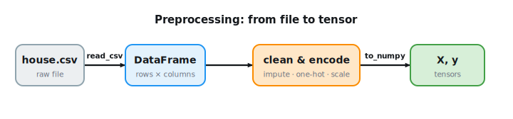

```{.python .input}
%load_ext d2lbook.tab
tab.interact_select('mxnet', 'pytorch', 'tensorflow', 'jax')
```

# Data Preprocessing
:label:`sec_pandas`

So far we have worked with synthetic data
that arrived in ready-made tensors.
In the wild, data shows up as messy files
in arbitrary formats, and the path from a raw file
to a model-ready tensor is paved with decisions:
which values are missing and how to fill them,
how to turn categories into numbers,
whether features need rescaling.
Get these wrong and even a perfect model learns nothing useful.
The *pandas* [library](https://pandas.pydata.org/) :cite:`McKinney.2010`
does the heavy lifting; this section is a crash course
on the routines you will reach for most:
enough to load, clean, and encode a tabular dataset,
and to understand *why* each step matters.
For the full story, see the official
[tutorial](https://pandas.pydata.org/pandas-docs/stable/user_guide/10min.html).
:numref:`fig_pandas_pipeline` previews the steps in this section.


:label:`fig_pandas_pipeline`

## Load and Inspect

### Reading the Dataset

Comma-separated values (CSV) files are ubiquitous
for storing tabular (spreadsheet-like) data.
Each line is one record of several comma-separated fields, e.g.,
"Albert Einstein,March 14 1879,Ulm,Federal polytechnic school".
To demonstrate, we write a small dataset of homes to
`../data/house_tiny.csv`. Each row is a home;
the columns are the number of rooms (`NumRooms`),
the roof type (`RoofType`), the floor area in square feet (`Area`),
and the sale price (`Price`). An empty field denotes a missing entry.

```{.python .input #pandas-reading-the-dataset-1}
import os

os.makedirs(os.path.join('..', 'data'), exist_ok=True)
data_file = os.path.join('..', 'data', 'house_tiny.csv')
with open(data_file, 'w') as f:
    f.write('''NumRooms,RoofType,Area,Price
3,Slate,1500,210000
,Tile,2100,290000
2,,850,127500
4,Slate,1940,258000
,,1200,168000
3,Tile,1650,225000
5,Slate,2600,375000
2,,900,142000
,Tile,1750,240000
4,,2050,295000''')
```

Now we import `pandas` and load the dataset with `read_csv`.

```{.python .input #pandas-reading-the-dataset-2}
import pandas as pd

data = pd.read_csv(data_file)
data
```

Notice that `pandas` has replaced the empty fields
with a special `NaN` (*not a number*) marker.
These are *missing values*, and dealing with them
is one of the central chores of data preprocessing.

### Knowing Your Data

Before transforming anything, look at it.
A few one-liners save hours of debugging downstream.
The **shape** tells you how much data you have;
the **dtypes** tell you how `pandas` interpreted each column:
numeric (`int64`/`float64`) versus non-numeric strings (`str`/`object`,
i.e. categorical or text); and **`describe`** summarizes the numeric columns,
surfacing ranges and obvious outliers at a glance.

```{.python .input #pandas-knowing-your-data-1}
data.dtypes
```

`NumRooms` came in as `float64` (not `int`) precisely because it
contains a `NaN`; `RoofType` is a string column, our cue that it is
categorical and will need encoding. The numeric summary:

```{.python .input #pandas-knowing-your-data-2}
data.describe()
```

The three numeric columns live on very different scales:
rooms in the single digits, area in the thousands,
price in the hundred-thousands. Keep that in mind; it returns below.

### Separating Inputs and Targets

In supervised learning we predict a *target* from a set of *inputs*.
The first step is to split the columns accordingly so that we only
ever preprocess the inputs, never peeking at or transforming the target
as if it were a feature. Here the last column, `Price`, is the target;
the rest are inputs. We select by integer position with `iloc`
(selecting by column *name* works too, and is often clearer):

```{.python .input #pandas-separating-inputs-and-targets-1}
inputs, targets = data.iloc[:, :3], data.iloc[:, 3]
inputs
```

## Clean and Encode

### Handling Missing Values

Missing values are unavoidable in real datasets, and how we handle them
can change what a model learns.
First, *measure* the problem: how many values are missing, and where?

```{.python .input #pandas-handling-missing-values-1}
inputs.isna().sum()
```

There are three broad ways to respond, each with a cost:

* **Deletion:** drop rows (or columns) that contain a `NaN`. Simple,
  but it throws data away and can bias the result if values are not
  missing at random.
* **Imputation:** fill each `NaN` with an estimate (a column statistic,
  or a model's prediction). Keeps every row, but injects assumptions and
  shrinks the data's variance.
* **Indicator:** add a boolean "was-missing" column so the model can
  learn from the *fact* that a value was absent.

Deletion is tempting but expensive on small data. Dropping every row
with any missing entry here leaves only a fraction of the dataset:

```{.python .input #pandas-handling-missing-values-2}
len(inputs.dropna()), len(inputs)
```

Only four of ten rows survive: too wasteful. So we **impute** instead.
For a numerical column the simplest estimate is the column **mean** (use
the median when the column is skewed). `fillna` applies it. We impute the
numerical columns now and leave the categorical `RoofType` for the next
section, where treating "missing" as its own category is the natural fix.

```{.python .input #pandas-handling-missing-values-3}
inputs = inputs.fillna(inputs.mean(numeric_only=True))
inputs
```

`NumRooms` and `Area` are now filled with their column means;
`RoofType`'s missing entries remain, to be handled by encoding.

### Encoding Categorical Features

Models consume numbers, so the `RoofType` strings must be encoded.
The standard choice for a *nominal* category (one with no inherent
order) is **one-hot encoding**: one new 0/1 column per category. We
avoid mapping categories to integers like `Slate=0, Tile=1`, because
that invents a false ordering and magnitude the model would wrongly
exploit. `pd.get_dummies` does the conversion; `dummy_na=True` adds a
column for the missing category, which is exactly the *indicator*
strategy from the previous section, applied to a categorical column:

```{.python .input #pandas-encoding-categorical-features-1}
inputs = pd.get_dummies(inputs, dummy_na=True, dtype=float)
inputs
```

`RoofType` has become three columns (`RoofType_Slate`, `RoofType_Tile`,
and `RoofType_nan`); the
already-imputed numerical columns pass through untouched. Every column is
now numeric.

One caveat: one-hot encoding a *high-cardinality* column (thousands of
distinct values, or an identifier unique to each row) explodes the
feature count and is rarely useful. Such columns call for embeddings,
which we meet in :numref:`sec_word2vec_pretraining`.

## Scale and Convert

### Numerical Features

Every entry is now numeric and complete. As promised when `describe`
first surfaced it, though, the continuous columns
still span very different scales (`NumRooms` ≈ 3, `Area` ≈ 1700). Left
as-is, the large-magnitude feature dominates distances and gradients,
making optimization *ill-conditioned*: gradient descent zig-zags along
the large-scale direction instead of heading straight for the minimum
(:numref:`sec_mdl-numerical-stability-conditioning` treats conditioning
in depth). The standard fix is
**standardization**: subtract the mean and divide by the standard
deviation, so each continuous feature has roughly zero mean and unit
variance. (We leave the one-hot columns alone; they are already 0/1.)

```{.python .input #pandas-numerical-features-1}
continuous = ['NumRooms', 'Area']
inputs[continuous] = (inputs[continuous] - inputs[continuous].mean()) \
                     / inputs[continuous].std()
inputs
```

A subtlety to flag now and revisit later: the statistics used to impute
(the column means earlier) and to standardize (mean and standard
deviation) must be computed on the **training** data only, then reused
for validation and test data. Computing them over the whole dataset
leaks information about the test set into training and inflates your
reported performance. We return to training/validation/test splits in
:numref:`sec_generalization_basics` and practice leak-free preprocessing
on a real dataset in :numref:`sec_kaggle_house`.

### Conversion to Tensor Format

Now that `inputs` and `targets` are entirely numeric, we can load them
into tensors (recall :numref:`sec_ndarray`). Pandas hands off to NumPy
via `to_numpy`, and the tensor constructor wraps that array. Deep learning
typically uses 32-bit floats; `to_numpy(dtype=float)` gives 64-bit, so
in real pipelines you would cast down to `float32` to save memory and
match the framework defaults.

```{.python .input #pandas-conversion-to-tensor-format}
%%tab mxnet
from mxnet import np

X = np.array(inputs.to_numpy(dtype=float))
y = np.array(targets.to_numpy(dtype=float))
X, y
```

```{.python .input #pandas-conversion-to-tensor-format}
%%tab pytorch
import torch

X = torch.tensor(inputs.to_numpy(dtype=float))
y = torch.tensor(targets.to_numpy(dtype=float))
X, y
```

```{.python .input #pandas-conversion-to-tensor-format}
%%tab tensorflow
import tensorflow as tf

X = tf.constant(inputs.to_numpy(dtype=float))
y = tf.constant(targets.to_numpy(dtype=float))
X, y
```

```{.python .input #pandas-conversion-to-tensor-format}
%%tab jax
from jax import numpy as jnp

X = jnp.array(inputs.to_numpy(dtype=float))
y = jnp.array(targets.to_numpy(dtype=float))
X, y
```

From here on we work with tensors, ready for gradients and GPUs.

## Discussion

You now know the core steps: inspect a dataset, separate inputs from
targets, handle missing values, encode categoricals, scale numerics, and
hand the result to a framework. You will pick up more data-processing
skills in :numref:`sec_kaggle_house`. This crash course kept things
deliberately simple; real preprocessing is messier.

Rather than a single CSV, a dataset may be spread across many files
pulled from a relational database (customer addresses in one table,
purchases in another) that must be joined first. Beyond categorical and
numeric fields, practitioners face text, images, audio, and point
clouds, each needing its own pipeline (we meet these in the computer
vision and natural language processing chapters). For data that does
not fit in memory, pandas is the wrong tool; columnar formats like
Parquet and out-of-core engines take over. And throughout, watch data
*quality*: outliers and recording errors must be caught before
training, and plotting a column with a library such as
[matplotlib](https://matplotlib.org/) is often the fastest way to
spot them. For the transforms in this section (imputation, encoding,
scaling) and for chaining them into reproducible pipelines, see
`sklearn.impute` and `sklearn.preprocessing`.

## Exercises

1. Load a real dataset, e.g., Abalone from the [UCI Machine Learning Repository](https://archive.ics.uci.edu/ml/datasets), and inspect its properties. What fraction of values are missing? What fraction of the columns are numerical, categorical, or text?
1. Select data columns by *name* rather than by integer position. The pandas docs on [indexing](https://pandas.pydata.org/pandas-docs/stable/user_guide/indexing.html) describe the options.
1. Compare imputation strategies on `NumRooms`: mean, median, and adding a "was-missing" indicator column. Which assumptions does each make? When would you prefer one over another?
1. We standardized using statistics from the whole dataset. Why is that a form of information leakage, and how should you compute the mean and standard deviation instead? What goes wrong if a feature has zero variance?
1. How large a dataset could you load this way? Consider read time, in-memory representation, and processing. Try it on your laptop, then on a larger machine. What breaks first?
1. How would you handle a categorical column with a very large number of categories? What if every label is unique: should you include the column at all?
1. What alternatives to pandas can you think of? Consider [loading NumPy arrays from a file](https://numpy.org/doc/stable/reference/generated/numpy.load.html) and the image library [Pillow](https://python-pillow.org/).

:begin_tab:`mxnet`
[Discussions](https://d2l.discourse.group/t/28)
:end_tab:

:begin_tab:`pytorch`
[Discussions](https://d2l.discourse.group/t/29)
:end_tab:

:begin_tab:`tensorflow`
[Discussions](https://d2l.discourse.group/t/195)
:end_tab:

:begin_tab:`jax`
[Discussions](https://d2l.discourse.group/t/17967)
:end_tab:

<!-- slides -->

::: {.slide}
::: {.cover}
[Dive into Deep Learning · §2.2]{.kicker}

From a messy file to a model-ready tensor<br>**load · inspect · clean · encode · scale**.
:::
:::

::: {.slide title="Raw data never arrives model-ready"}
[Motivation]{.kicker}

::: {.cols .vc}
::: {.col}
Real data arrives as messy files, not tensors. Turning a raw file into
model input takes a sequence of **decisions**: which values are missing
and how to fill them, how to turn categories into numbers, whether to
rescale.

::: {.d2l-note}
Get these wrong and even a perfect model learns nothing useful.
:::
:::

::: {.col .fig .big}
@fig:pandas-pipeline
:::
:::
:::

::: {.slide}
::: {.divider}
[01]{.dnum}

[Load & look]{.dtitle}

[read a CSV, then understand it]{.dsub}
:::
:::

::: {.slide title="read_csv: named columns, NaN where data is missing"}
[Load &amp; look]{.kicker}

`read_csv` loads a comma-separated file into a **DataFrame**: rows ×
named columns. Empty fields become `NaN`, pandas's marker for a missing
value:

@pandas-reading-the-dataset-2
:::

::: {.slide title="Look before you transform"}
[Load &amp; look]{.kicker}

`dtypes` shows how each column was read, numeric vs. string (a
categorical cue); `describe` surfaces the ranges:

::: {.cols .vc}
::: {.col}
@pandas-knowing-your-data-1
:::

::: {.col}
@pandas-knowing-your-data-2
:::
:::

The three numeric columns live on very different scales.
:::

::: {.slide}
::: {.divider}
[02]{.dnum}

[Clean & encode]{.dtitle}

[missing values · categoricals]{.dsub}
:::
:::

::: {.slide title="Measure the gaps before choosing a remedy"}
[Clean &amp; encode]{.kicker}

::: {.cols .vc}
::: {.col}
First **measure** the problem (how many, and where):

@pandas-handling-missing-values-1

Three responses, each with a cost: **delete** the rows, **impute** an
estimate, or add an **indicator** flag.
:::

::: {.col .fig .big}
@fig:pandas-missing
:::
:::
:::

::: {.slide title="Deletion keeps only 4 rows of 10"}
[Clean &amp; encode]{.kicker}

The simplest response is deletion, but dropping every row with a gap
throws away most of this dataset:

@pandas-handling-missing-values-2

Too wasteful on small data. So we impute instead.
:::

::: {.slide title="Imputation fills gaps without discarding rows"}
[Clean &amp; encode]{.kicker}

*Imputation* fills each gap with an estimate. For a numerical column the
simplest is the column **mean** (the median when it is skewed). The
categorical `RoofType` we leave for encoding next:

@pandas-handling-missing-values-3
:::

::: {.slide title="One-hot encoding: numbers without a false order"}
[Clean &amp; encode]{.kicker}

::: {.cols .vc}
::: {.col}
Models consume numbers, so the `RoofType` strings get **one-hot
encoded**: one 0/1 column per category. `dummy_na=True` makes
"missing" its own category (the indicator strategy again):

@-pandas-encoding-categorical-features-1

Integer codes (`Slate=0, Tile=1`) would invent an ordering the model
would wrongly exploit.
:::

::: {.col .fig .big}
@fig:pandas-onehot
:::
:::
:::

::: {.slide}
::: {.divider}
[03]{.dnum}

[Scale & convert]{.dtitle}

[standardize, then hand off to tensors]{.dsub}
:::
:::

::: {.slide title="NumRooms ≈ 3, Area ≈ 1700: standardize"}
[Scale &amp; convert]{.kicker}

::: {.cols .vc}
::: {.col}
The continuous columns span very different scales, which
makes optimization ill-conditioned. **Standardize** each to ~zero mean,
unit variance:

@-pandas-numerical-features-1

::: {.d2l-note .warn}
Compute these statistics on the **training** split only; using the
whole dataset leaks the test set into training.
:::
:::

::: {.col .fig}
@fig:pandas-scale
:::
:::
:::

::: {.slide title="The payoff: a (10, 5) tensor, ready for a model"}
[Scale &amp; convert]{.kicker}

Every column is numeric, so `.to_numpy()` hands the frame to the
tensor constructor:

@-pandas-conversion-to-tensor-format

::: {.d2l-note}
`X` is a `(10, 5)` float tensor, `y` a `(10,)` target: five decisions
turned a holey CSV into model input. (Real pipelines cast to
`float32`.)
:::
:::

::: {.slide title="Recap"}
[Wrap-up]{.kicker}

::: {.cols .vc}
::: {.col}
- **Inspect** before you transform (`dtypes`, `describe`).
- **Missing:** delete (here: 4 rows of 10 survive), impute, or flag;
  each is a tradeoff, not a default.
- **Categoricals:** one-hot, not integer codes.
- **Numericals:** standardize; fit stats on training data only.
- **Convert:** `to_numpy` → tensor, and on to the model.
:::

::: {.col .fig}
@fig:pandas-pipeline
:::
:::
:::
