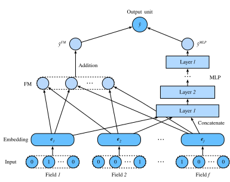

# Deep Factorization Machines

A second-order factorization machine assigns a structured coefficient to each feature pair, but its score contains no interaction involving three or more feature values at once. An MLP applied to all field embeddings can represent such joint dependence, although it does not preserve the FM's explicit pairwise term. DeepFM :cite:`Guo.Tang.Ye.ea.2017` combines these two inductive biases and shares the embedding table between them.

The distinction is architectural, not a guarantee that one branch learns only “low-order” effects and the other only “high-order” effects. Their learned roles depend on the data, regularization, and optimization.


## Model Architectures

Suppose an example contains one categorical value from each of $f$ fields. A shared lookup table maps those values to embeddings $\mathbf{e}_1,\ldots,\mathbf{e}_f\in\mathbb{R}^k$. The FM branch uses the embeddings in its pairwise inner products. In parallel, the deep branch concatenates them:

$$\mathbf{z}^{(0)}=[\mathbf{e}_1;\mathbf{e}_2;\cdots;\mathbf{e}_f]\in\mathbb{R}^{fk}.$$

$$
\mathbf{z}^{(\ell)}=\alpha_\ell\!\left(\mathbf{W}^{(\ell)}\mathbf{z}^{(\ell-1)}+\mathbf{b}^{(\ell)}\right), \qquad \ell=1,\ldots,L.
$$

Let $s_{\mathrm{FM}}$ be the FM logit and $s_{\mathrm{DNN}}=\mathbf{a}^\top\mathbf{z}^{(L)}+b$ the deep-branch logit. Their sum determines the click probability:

$$
\hat p(y=1\mid\mathbf{x})=\sigma(s_{\mathrm{FM}}+s_{\mathrm{DNN}}).
$$



DeepFM is one of several ways to combine explicit interaction terms with learned nonlinear features; another applies nonlinear layers directly to interaction features :cite:`He.Chua.2017`.

```{.python .input #deepfm-model-architectures  n=2}
#@tab mxnet
from d2l import mxnet as d2l
from mxnet import init, gluon, np, npx
from mxnet.gluon import nn
import os

npx.set_np()
```

```{.python .input #deepfm-model-architectures  n=2}
#@tab pytorch
from d2l import torch as d2l
import torch
from torch import nn
import os
```

## Implementation of DeepFM
The implementation of DeepFM is similar to that of FM. We keep the FM part unchanged and use an MLP block with `relu` as the activation function. Dropout is also used to regularize the model. The number of neurons of the MLP can be adjusted with the `mlp_dims` hyperparameter.

```{.python .input #deepfm-implementation-of-deepfm  n=2}
#@tab mxnet
class DeepFM(nn.Block):
    def __init__(self, field_dims, num_factors, mlp_dims, drop_rate=0.1):
        super(DeepFM, self).__init__()
        num_inputs = int(sum(field_dims))
        self.embedding = nn.Embedding(num_inputs, num_factors)
        self.fc = nn.Embedding(num_inputs, 1)
        self.linear_layer = nn.Dense(1, use_bias=True)
        input_dim = self.embed_output_dim = len(field_dims) * num_factors
        self.mlp = nn.Sequential()
        for dim in mlp_dims:
            self.mlp.add(nn.Dense(dim, 'relu', True, in_units=input_dim))
            self.mlp.add(nn.Dropout(rate=drop_rate))
            input_dim = dim
        self.mlp.add(nn.Dense(in_units=input_dim, units=1))

    def forward(self, x):
        embed_x = self.embedding(x)
        square_of_sum = np.sum(embed_x, axis=1) ** 2
        sum_of_square = np.sum(embed_x ** 2, axis=1)
        inputs = np.reshape(embed_x, (-1, self.embed_output_dim))
        x = self.linear_layer(self.fc(x).sum(1)) \
            + 0.5 * (square_of_sum - sum_of_square).sum(1, keepdims=True) \
            + self.mlp(inputs)
        return x
```

```{.python .input #deepfm-implementation-of-deepfm  n=2}
#@tab pytorch
class DeepFM(nn.Module):
    def __init__(self, field_dims, num_factors, mlp_dims, drop_rate=0.1):
        super().__init__()
        num_inputs = int(sum(field_dims))
        self.embedding = nn.Embedding(num_inputs, num_factors)
        self.fc = nn.Embedding(num_inputs, 1)
        self.linear_layer = nn.Linear(1, 1)
        input_dim = self.embed_output_dim = len(field_dims) * num_factors
        mlp_layers = []
        for dim in mlp_dims:
            mlp_layers.append(nn.Linear(input_dim, dim))
            mlp_layers.append(nn.ReLU())
            mlp_layers.append(nn.Dropout(p=drop_rate))
            input_dim = dim
        mlp_layers.append(nn.Linear(input_dim, 1))
        self.mlp = nn.Sequential(*mlp_layers)

    def forward(self, x):
        embed_x = self.embedding(x)
        square_of_sum = embed_x.sum(dim=1) ** 2
        sum_of_square = (embed_x ** 2).sum(dim=1)
        inputs = embed_x.reshape(-1, self.embed_output_dim)
        x = self.linear_layer(self.fc(x).sum(dim=1)) \
            + 0.5 * (square_of_sum - sum_of_square).sum(dim=1, keepdim=True) \
            + self.mlp(inputs)
        return x
```

## Training and Evaluating the Model
The data loading process is the same as that of FM. We set the MLP component of DeepFM to a three-layered dense network with a pyramid structure (30-20-10). All other hyperparameters remain the same as FM.

```{.python .input #deepfm-training-and-evaluating-the-model  n=4}
#@tab mxnet
batch_size = 2048
data_dir = d2l.download_extract('ctr')
train_data = d2l.CTRDataset(os.path.join(data_dir, 'train.csv'))
test_data = d2l.CTRDataset(os.path.join(data_dir, 'test.csv'),
                           feat_mapper=train_data.feat_mapper,
                           defaults=train_data.defaults)
field_dims = train_data.field_dims
train_iter = gluon.data.DataLoader(
    train_data, shuffle=True, last_batch='rollover', batch_size=batch_size,
    num_workers=d2l.get_dataloader_workers())
test_iter = gluon.data.DataLoader(
    test_data, shuffle=False, last_batch='rollover', batch_size=batch_size,
    num_workers=d2l.get_dataloader_workers())
devices = d2l.try_all_gpus()
net = DeepFM(field_dims, num_factors=10, mlp_dims=[30, 20, 10])
net.initialize(init.Xavier(), ctx=devices)
lr, num_epochs, optimizer = 0.01, 30, 'adam'
trainer = gluon.Trainer(net.collect_params(), optimizer,
                        {'learning_rate': lr})
loss = gluon.loss.SigmoidBinaryCrossEntropyLoss()
d2l.train_ch13(net, train_iter, test_iter, loss, trainer, num_epochs, devices)
```

```{.python .input #deepfm-training-and-evaluating-the-model  n=4}
#@tab pytorch
batch_size = 2048
data_dir = d2l.download_extract('ctr')
train_data = d2l.CTRDataset(os.path.join(data_dir, 'train.csv'))
test_data = d2l.CTRDataset(os.path.join(data_dir, 'test.csv'),
                           feat_mapper=train_data.feat_mapper,
                           defaults=train_data.defaults)
field_dims = train_data.field_dims
train_iter = torch.utils.data.DataLoader(
    train_data, shuffle=True, drop_last=True, batch_size=batch_size,
    num_workers=d2l.get_dataloader_workers())
test_iter = torch.utils.data.DataLoader(
    test_data, shuffle=False, drop_last=True, batch_size=batch_size,
    num_workers=d2l.get_dataloader_workers())
devices = d2l.try_all_gpus()
net = DeepFM(field_dims, num_factors=10, mlp_dims=[30, 20, 10])

def init_weights(m):
    if type(m) == nn.Linear:
        nn.init.xavier_uniform_(m.weight)
    if type(m) == nn.Embedding:
        nn.init.xavier_uniform_(m.weight)

net.apply(init_weights)
lr, num_epochs = 0.01, 30
optimizer = torch.optim.Adam(net.parameters(), lr=lr)
loss = nn.BCEWithLogitsLoss(reduction='none')
d2l.train_ch13(net, train_iter, test_iter, loss, optimizer, num_epochs, devices)
```

On this particular split and optimization setting, the plotted DeepFM run reaches a lower loss sooner than the FM run. This is an illustrative comparison, not evidence that DeepFM dominates FM across datasets or matched hyperparameter searches.

## Summary

* DeepFM adds the logits of an FM branch and an MLP branch that share field embeddings.
* The FM supplies explicit pairwise terms; the MLP permits joint nonlinear dependence among all embedded fields.

## Exercises

* Vary the structure of the MLP to check its impact on model performance.
* Change the dataset to Criteo and compare it with the original FM model.

:begin_tab:`mxnet`
[Discussions](https://d2l.discourse.group/t/407)
:end_tab:

:begin_tab:`pytorch`
[Discussions](https://d2l.discourse.group/t/407)
:end_tab:

<!-- slides -->

::: {.slide title="DeepFM"}
**DeepFM** (Guo et al., 2017) — combine a factorization
machine and a deep MLP, sharing the embedding table.

- **FM branch** — linear + pairwise bilinear interactions
  (same as the previous deck).
- **Deep branch** — concat all field embeddings, feed to
  an MLP. Captures *high-order* nonlinear interactions
  that the bilinear FM misses.

Final prediction: $\sigma(\hat y_{FM} + \hat y_{Deep})$.
End-to-end training. This became a widely used template
for CTR models after 2017: explicit interaction terms plus
learned nonlinear feature mixing.
:::

::: {.slide title="Shared embeddings feed two distinct score branches"}
Shared embeddings feed both the FM head and the deep MLP
head:


$$\hat y = \sigma(\hat y^{(FM)} + \hat y^{(DNN)})$$
:::

::: {.slide title="The implementation adds logits before the sigmoid"}
@deepfm-implementation-of-deepfm
:::

::: {.slide title="A controlled comparison must hold the protocol fixed"}
Same CTR pipeline as the FM deck — only the model
changes:

@deepfm-training-and-evaluating-the-model
:::

::: {.slide title="Explicit pair terms and an MLP encode different biases"}
- DeepFM = FM (low-order) + deep MLP (high-order),
  sharing the same embedding table.
- Same input format as FM; one extra branch.
- A member of the wide/deep interaction-model family:
  explicit low-order terms plus a nonlinear feature mixer
  and a sigmoid head.
- Unlike retrieval architectures that score independently
  encoded users and items, DeepFM fuses all impression
  features before scoring one candidate.
:::
