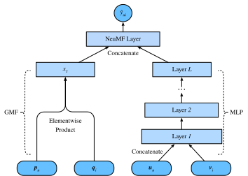

# Neural Collaborative Filtering for Personalized Ranking

Clicks, purchases, and viewing events are easier to record than explicit ratings, but they pose a different statistical problem. An observed event is evidence of interest; an unobserved event may instead reflect a lack of exposure. We therefore seek a score that ranks plausible items for each user, and train it against sampled unobserved items. Neural matrix factorization (NeuMF) :cite:`He.Liao.Zhang.ea.2017` constructs this score from two complementary feature maps: an elementwise interaction, closely related to matrix factorization, and a multilayer network applied to the user and item embeddings.

## The NeuMF model

The generalized matrix factorization (GMF) branch associates user $u$ and item $i$ with vectors $\mathbf{p}_u,\mathbf{q}_i\in\mathbb{R}^k$ and forms

$$
\begin{aligned}
\mathbf{x}_{\mathrm{GMF}} = \mathbf{p}_u \odot \mathbf{q}_i,
\end{aligned}
$$

where $\odot$ denotes elementwise multiplication. Unlike the dot product $\mathbf{p}_u^\top\mathbf{q}_i$, this operation retains all $k$ coordinatewise products for the final prediction layer.

The multilayer perceptron (MLP) branch uses separate embeddings $\mathbf{U}_u$ and $\mathbf{V}_i$. Starting from their concatenation, it computes

$$
\begin{aligned}
\mathbf{z}^{(1)} &= [\mathbf{U}_u;\mathbf{V}_i], \\
\mathbf{z}^{(\ell)} &= \alpha_\ell\!\left(\mathbf{W}^{(\ell)}\mathbf{z}^{(\ell-1)}+\mathbf{b}^{(\ell)}\right), \qquad \ell=2,\ldots,L,
\end{aligned}
$$

where $[\cdot;\cdot]$ denotes concatenation and $\alpha_\ell$ is the activation at layer $\ell$. Separate embeddings allow the two branches to represent users and items in coordinate systems suited to their respective computations.

NeuMF concatenates the two feature vectors and applies a learned linear
readout. Because BPR depends only on score differences, the implementation
returns the raw score
$$
s_{ui} = \mathbf{h}^\top[\mathbf{x}_{\mathrm{GMF}};\mathbf{z}^{(L)}].
$$
A sigmoid may convert this logit to a pointwise probability in a separately
calibrated model, but it should not be inserted before the BPR score
difference.



```{.python .input #neumf-the-neumf-model  n=1}
#@tab mxnet
from d2l import mxnet as d2l
from mxnet import autograd, gluon, np, npx
from mxnet.gluon import nn
import mxnet as mx
import random

npx.set_np()
```

```{.python .input #neumf-the-neumf-model  n=1}
#@tab pytorch
from d2l import torch as d2l
import torch
from torch import nn
import random
```

## Model Implementation
The following code implements the NeuMF model. It consists of a generalized matrix factorization model and an MLP with different user and item embedding vectors. The structure of the MLP is controlled with the parameter `nums_hiddens`. ReLU is used as the default activation function.

```{.python .input #neumf-model-implementation  n=2}
#@tab mxnet
class NeuMF(nn.Block):
    def __init__(self, num_factors, num_users, num_items, nums_hiddens):
        super().__init__()
        self.P = nn.Embedding(num_users, num_factors)
        self.Q = nn.Embedding(num_items, num_factors)
        self.U = nn.Embedding(num_users, num_factors)
        self.V = nn.Embedding(num_items, num_factors)
        self.mlp = nn.Sequential()
        for num_hiddens in nums_hiddens:
            self.mlp.add(nn.Dense(num_hiddens, activation='relu',
                                  use_bias=True))
        # Output raw logits; BPRLoss applies sigmoid internally, so adding
        # a sigmoid here would compose with it and squash gradients.
        self.prediction_layer = nn.Dense(1, use_bias=False)

    def forward(self, user_id, item_id):
        p_mf = self.P(user_id)
        q_mf = self.Q(item_id)
        gmf = p_mf * q_mf
        p_mlp = self.U(user_id)
        q_mlp = self.V(item_id)
        mlp = self.mlp(np.concatenate([p_mlp, q_mlp], axis=1))
        con_res = np.concatenate([gmf, mlp], axis=1)
        return self.prediction_layer(con_res)
```

```{.python .input #neumf-model-implementation  n=2}
#@tab pytorch
class NeuMF(nn.Module):
    def __init__(self, num_factors, num_users, num_items, nums_hiddens):
        super().__init__()
        self.P = nn.Embedding(num_users, num_factors)
        self.Q = nn.Embedding(num_items, num_factors)
        self.U = nn.Embedding(num_users, num_factors)
        self.V = nn.Embedding(num_items, num_factors)
        mlp_layers = []
        input_size = num_factors * 2
        for num_hiddens in nums_hiddens:
            mlp_layers.append(nn.Linear(input_size, num_hiddens))
            mlp_layers.append(nn.ReLU())
            input_size = num_hiddens
        self.mlp = nn.Sequential(*mlp_layers)
        # Output raw logits; BPRLoss applies sigmoid internally, so adding
        # a sigmoid here would compose with it and squash gradients.
        self.prediction_layer = nn.Linear(num_factors + nums_hiddens[-1], 1,
                                          bias=False)

    def forward(self, user_id, item_id):
        p_mf = self.P(user_id)
        q_mf = self.Q(item_id)
        gmf = p_mf * q_mf
        p_mlp = self.U(user_id)
        q_mlp = self.V(item_id)
        mlp = self.mlp(torch.cat([p_mlp, q_mlp], dim=1))
        con_res = torch.cat([gmf, mlp], dim=1)
        return self.prediction_layer(con_res)
```

## Customized Dataset with Negative Sampling

For pairwise ranking, the sampling distribution is part of the objective. The
following dataset samples uniformly from the complement of each user's observed
training items. Samples are redrawn on every access, so repeated epochs compare
an observed item with different unobserved items.

This compact experiment also removes the held-out positive from the sampling
pool. That avoids assigning opposite labels to the same item, but it consults
the identity of the evaluation event during training. A strict final test would
instead tune this choice on validation users or define a proposal without using
test labels, then reserve test identities until evaluation.

```{.python .input #neumf-customized-dataset-with-negative-sampling  n=3}
#@tab mxnet
class PRDataset(gluon.data.Dataset):
    def __init__(self, users, items, candidates, num_items, test_items=None):
        self.users = users
        self.items = items
        # Precompute each user's negative pool once: items the user has not
        # interacted with in train, excluding the known held-out positive.
        # This avoids a contradictory sampled label but uses evaluation identity;
        # see the protocol limitation in the surrounding text.
        all_items = set(range(num_items))
        test_items = test_items or {}
        self.neg_pool = {
            u: list(all_items - set(candidates.get(u, [])) - set(test_items.get(u, [])))
            for u in candidates}

    def __len__(self):
        return len(self.users)

    def __getitem__(self, idx):
        neg_items = self.neg_pool[int(self.users[idx])]
        indices = random.randint(0, len(neg_items) - 1)
        return self.users[idx], self.items[idx], neg_items[indices]
```

```{.python .input #neumf-customized-dataset-with-negative-sampling  n=3}
#@tab pytorch
class PRDataset(torch.utils.data.Dataset):
    def __init__(self, users, items, candidates, num_items, test_items=None):
        self.users = users
        self.items = items
        # Precompute each user's negative pool once: items the user has not
        # interacted with in train, excluding the known held-out positive.
        # This avoids a contradictory sampled label but uses evaluation identity;
        # see the protocol limitation in the surrounding text.
        all_items = set(range(num_items))
        test_items = test_items or {}
        self.neg_pool = {
            u: list(all_items - set(candidates.get(u, [])) - set(test_items.get(u, [])))
            for u in candidates}

    def __len__(self):
        return len(self.users)

    def __getitem__(self, idx):
        neg_items = self.neg_pool[int(self.users[idx])]
        indices = random.randint(0, len(neg_items) - 1)
        return self.users[idx], self.items[idx], neg_items[indices]
```

## Evaluation on a Chronological Holdout

For each user $u$, the final observed item $g_u$ is held out and ranked within an evaluation candidate set $C_u$ that contains $g_u$ and items not observed in the training history. The candidate set is part of the protocol: ranking against every item and ranking against a sampled subset generally produce different values. The hit rate at cutoff $\ell$ is

$$
\operatorname{Hit}@\ell = \frac{1}{|\mathcal{U}|}\sum_{u\in\mathcal{U}}\mathbf{1}\{\operatorname{rank}_u(g_u)\leq\ell\}.
$$

It records whether the held-out item appears among the first $\ell$ candidates, then averages over users. The corresponding per-user AUC is the fraction of other candidates scored below the held-out item:

$$
\operatorname{AUC}=\frac{1}{|\mathcal{U}|}\sum_{u\in\mathcal{U}}\frac{1}{|C_u|-1}\sum_{j\in C_u\setminus\{g_u\}}\mathbf{1}\{\hat y_{u g_u}>\hat y_{uj}\}.
$$

The formula assigns no credit to ties; a protocol that awards half credit must say so explicitly. Hit rate and AUC answer different questions, and neither corrects for the fact that a held-out click reflects both exposure and preference.

The following function calculates the hit counts and AUC for each user.

```{.python .input #neumf-evaluator-1  n=4}
#@tab mxnet
#@save
def hit_and_auc(rankedlist, test_matrix, k):
    hits_k = [(idx, val) for idx, val in enumerate(rankedlist[:k])
              if val in set(test_matrix)]
    hits_all = [(idx, val) for idx, val in enumerate(rankedlist)
                if val in set(test_matrix)]
    max = len(rankedlist) - 1
    auc = 1.0 * (max - hits_all[0][0]) / max if len(hits_all) > 0 else 0
    return len(hits_k), auc
```

```{.python .input #neumf-evaluator-1  n=4}
#@tab pytorch
#@save
def hit_and_auc(rankedlist, test_matrix, k):
    hits_k = [(idx, val) for idx, val in enumerate(rankedlist[:k])
              if val in set(test_matrix)]
    hits_all = [(idx, val) for idx, val in enumerate(rankedlist)
                if val in set(test_matrix)]
    max = len(rankedlist) - 1
    auc = 1.0 * (max - hits_all[0][0]) / max if len(hits_all) > 0 else 0
    return len(hits_k), auc
```

Then, the overall Hit rate and AUC are calculated as follows. Note that `evaluate_ranking` rebuilds and `sorted`-ranks each user's candidate scores in a per-user Python loop for clarity; the efficient form would score all users in a batch and select the top items with a single top-k call (PyTorch's `torch.topk`).

```{.python .input #neumf-evaluator-2  n=5}
#@tab mxnet
#@save
def evaluate_ranking(net, test_input, seq, candidates, num_users, num_items,
                     devices):
    ranked_list, ranked_items, hit_rate, auc = {}, {}, [], []
    all_items = set([i for i in range(num_items)])
    for u in range(num_users):
        neg_items = list(all_items - set(candidates[int(u)]))
        user_ids, item_ids, x, scores = [], [], [], []
        [item_ids.append(i) for i in neg_items]
        [user_ids.append(u) for _ in neg_items]
        x.extend([np.array(user_ids)])
        if seq is not None:
            x.append(seq[user_ids, :])
        x.extend([np.array(item_ids)])
        test_data_iter = gluon.data.DataLoader(
            gluon.data.ArrayDataset(*x), shuffle=False, last_batch="keep",
            batch_size=1024)
        for index, values in enumerate(test_data_iter):
            x = [gluon.utils.split_and_load(v, devices, even_split=False)
                 for v in values]
            scores.extend([list(net(*t).asnumpy()) for t in zip(*x)])
        scores = [item for sublist in scores for item in sublist]
        item_scores = list(zip(item_ids, scores))
        ranked_list[u] = sorted(item_scores, key=lambda t: t[1], reverse=True)
        ranked_items[u] = [r[0] for r in ranked_list[u]]
        temp = hit_and_auc(ranked_items[u], test_input[u], 50)
        hit_rate.append(temp[0])
        auc.append(temp[1])
    return np.mean(np.array(hit_rate)), np.mean(np.array(auc))
```

```{.python .input #neumf-evaluator-2  n=5}
#@tab pytorch
#@save
def evaluate_ranking(net, test_input, seq, candidates, num_users, num_items,
                     devices):
    ranked_list, ranked_items, hit_rate, auc = {}, {}, [], []
    all_items = set([i for i in range(num_items)])
    for u in range(num_users):
        neg_items = list(all_items - set(candidates[int(u)]))
        user_ids, item_ids, scores = [], [], []
        [item_ids.append(i) for i in neg_items]
        [user_ids.append(u) for _ in neg_items]
        x = [torch.tensor(user_ids)]
        if seq is not None:
            x.append(seq[user_ids, :])
        x.extend([torch.tensor(item_ids)])
        test_data_iter = torch.utils.data.DataLoader(
            torch.utils.data.TensorDataset(*x), shuffle=False,
            batch_size=1024)
        for values in test_data_iter:
            values = [v.to(devices[0]) for v in values]
            # `net` returns a 1-D tensor of logits per batch; ravel
            # ensures we always extend with scalars regardless of whether
            # the model emits shape (B,) or (B, 1).
            scores.extend(net(*values).detach().cpu().numpy().ravel().tolist())
        item_scores = list(zip(item_ids, scores))
        ranked_list[u] = sorted(item_scores, key=lambda t: t[1], reverse=True)
        ranked_items[u] = [r[0] for r in ranked_list[u]]
        temp = hit_and_auc(ranked_items[u], test_input[u], 50)
        hit_rate.append(temp[0])
        auc.append(temp[1])
    return sum(hit_rate) / len(hit_rate), sum(auc) / len(auc)
```

## Training and Evaluating the Model

The training function is defined below. We train the model in the pairwise manner.

```{.python .input #neumf-training-and-evaluating-the-model-1  n=6}
#@tab mxnet
#@save
def train_ranking(net, train_iter, test_iter, loss, trainer, test_seq_iter,
                  num_users, num_items, num_epochs, devices, evaluator,
                  candidates, eval_step=1):
    timer, hit_rate, auc = d2l.Timer(), 0, 0
    animator = d2l.Animator(xlabel='epoch', xlim=[1, num_epochs], ylim=[0, 1],
                            legend=['test hit rate', 'test AUC'])
    for epoch in range(num_epochs):
        metric = d2l.Accumulator(3)
        for i, values in enumerate(train_iter):
            input_data = []
            for v in values:
                input_data.append(gluon.utils.split_and_load(v, devices))
            with autograd.record():
                p_pos = [net(*t) for t in zip(*input_data[:-1])]
                p_neg = [net(*t) for t in zip(*input_data[:-2],
                                              input_data[-1])]
                ls = [loss(p, n) for p, n in zip(p_pos, p_neg)]
            [l.backward(retain_graph=False) for l in ls]
            # Per-batch loss only; accumulating across batches inside `l`
            # turned the printed train-loss into a quadratic sum.
            batch_loss = sum([l.asnumpy() for l in ls]).mean()
            trainer.step(values[0].shape[0])
            metric.add(batch_loss, values[0].shape[0], values[0].size)
            timer.stop()
        with autograd.predict_mode():
            if (epoch + 1) % eval_step == 0:
                hit_rate, auc = evaluator(net, test_iter, test_seq_iter,
                                          candidates, num_users, num_items,
                                          devices)
                animator.add(epoch + 1, (hit_rate, auc))
    print(f'train loss {metric[0] / metric[1]:.3f}, '
          f'test hit rate {float(hit_rate):.3f}, test AUC {float(auc):.3f}')
    print(f'{metric[2] * num_epochs / timer.sum():.1f} examples/sec '
          f'on {str(devices)}')
```

```{.python .input #neumf-training-and-evaluating-the-model-1  n=6}
#@tab pytorch
#@save
def train_ranking(net, train_iter, test_iter, loss, optimizer, test_seq_iter,
                  num_users, num_items, num_epochs, devices, evaluator,
                  candidates, eval_step=1):
    timer, hit_rate, auc = d2l.Timer(), 0, 0
    animator = d2l.Animator(xlabel='epoch', xlim=[1, num_epochs], ylim=[0, 1],
                            legend=['test hit rate', 'test AUC'])
    for epoch in range(num_epochs):
        metric = d2l.Accumulator(3)
        for i, values in enumerate(train_iter):
            input_data = [v.to(devices[0]) for v in values]
            p_pos = net(*input_data[:-1])
            p_neg = net(*input_data[:-2], input_data[-1])
            ls = loss(p_pos, p_neg)
            optimizer.zero_grad()
            ls.backward()
            optimizer.step()
            # Per-batch loss only; accumulating across batches inside `l`
            # turned the printed train-loss into a quadratic sum.
            metric.add(ls.item(), values[0].shape[0], values[0].numel())
            timer.stop()
        with torch.no_grad():
            if (epoch + 1) % eval_step == 0:
                hit_rate, auc = evaluator(net, test_iter, test_seq_iter,
                                          candidates, num_users, num_items,
                                          devices)
                animator.add(epoch + 1, (hit_rate, auc))
    print(f'train loss {metric[0] / metric[1]:.3f}, '
          f'test hit rate {float(hit_rate):.3f}, test AUC {float(auc):.3f}')
    print(f'{metric[2] * num_epochs / timer.sum():.1f} examples/sec '
          f'on {str(devices)}')
```

Now, we can load the MovieLens 100k dataset and train the model. Since there are only ratings in the MovieLens dataset, with some losses of accuracy, we binarize these ratings to zeros and ones. If a user rated an item, we consider the implicit feedback as one, otherwise as zero. The action of rating an item can be treated as a form of providing implicit feedback.  Here, we split the dataset in the `seq-aware` mode where users' latest interacted items are left out for test.

```{.python .input #neumf-training-and-evaluating-the-model-2  n=11}
#@tab mxnet
batch_size = 1024
df, num_users, num_items = d2l.read_data_ml100k()
train_data, test_data = d2l.split_data_ml100k(df, num_users, num_items,
                                              'seq-aware')
users_train, items_train, ratings_train, candidates = d2l.load_data_ml100k(
    train_data, num_users, num_items, feedback="implicit")
users_test, items_test, ratings_test, test_iter = d2l.load_data_ml100k(
    test_data, num_users, num_items, feedback="implicit")
train_iter = gluon.data.DataLoader(
    PRDataset(users_train, items_train, candidates, num_items,
              test_items=test_iter), batch_size,
    True, last_batch="rollover", num_workers=d2l.get_dataloader_workers())
```

```{.python .input #neumf-training-and-evaluating-the-model-2  n=11}
#@tab pytorch
batch_size = 1024
df, num_users, num_items = d2l.read_data_ml100k()
train_data, test_data = d2l.split_data_ml100k(df, num_users, num_items,
                                              'seq-aware')
users_train, items_train, ratings_train, candidates = d2l.load_data_ml100k(
    train_data, num_users, num_items, feedback="implicit")
users_test, items_test, ratings_test, test_iter = d2l.load_data_ml100k(
    test_data, num_users, num_items, feedback="implicit")
train_iter = torch.utils.data.DataLoader(
    PRDataset(users_train, items_train, candidates, num_items,
              test_items=test_iter), batch_size,
    True, num_workers=d2l.get_dataloader_workers())
```

We then create and initialize the model. We use a three-layer MLP with constant hidden size 10.

```{.python .input #neumf-training-and-evaluating-the-model-3  n=8}
#@tab mxnet
devices = d2l.try_all_gpus()
net = NeuMF(10, num_users, num_items, nums_hiddens=[10, 10, 10])
# Xavier gives the GMF and MLP branches comparable initial activation scales.
# The model returns raw scores; BPR applies a sigmoid to their difference.
net.initialize(ctx=devices, force_reinit=True, init=mx.init.Xavier())
```

```{.python .input #neumf-training-and-evaluating-the-model-3  n=8}
#@tab pytorch
devices = d2l.try_all_gpus()
net = NeuMF(10, num_users, num_items, nums_hiddens=[10, 10, 10])
def init_weights(m):
    if type(m) == nn.Linear or type(m) == nn.Embedding:
        nn.init.normal_(m.weight, std=0.01)
net.apply(init_weights)
net = net.to(devices[0])
```

The following code trains the model.

```{.python .input #neumf-training-and-evaluating-the-model-4  n=12}
#@tab mxnet
lr, num_epochs, wd, optimizer = 0.01, 10, 1e-5, 'adam'
loss = d2l.BPRLoss()
trainer = gluon.Trainer(net.collect_params(), optimizer,
                        {"learning_rate": lr, 'wd': wd})
train_ranking(net, train_iter, test_iter, loss, trainer, None, num_users,
              num_items, num_epochs, devices, evaluate_ranking, candidates,
              eval_step=5)
```

```{.python .input #neumf-training-and-evaluating-the-model-4  n=12}
#@tab pytorch
lr, num_epochs, wd = 0.01, 10, 1e-5
loss = d2l.BPRLoss()
optimizer = torch.optim.Adam(net.parameters(), lr=lr, weight_decay=wd)
train_ranking(net, train_iter, test_iter, loss, optimizer, None, num_users,
              num_items, num_epochs, devices, evaluate_ranking, candidates)
```

## Summary

* NeuMF combines coordinatewise latent-factor interactions with nonlinear features computed from concatenated user and item embeddings.
* The two branches use separate embeddings and are joined only at the prediction layer.

## Exercises

* Vary the size of latent factors. How does the size of latent factors impact the model performance?
* Vary the architectures (e.g., number of layers, number of neurons of each layer) of the MLP to check its impact on the performance.
* Try different optimizers, learning rate and weight decay rate.
* Try to use hinge loss defined in the last section to optimize this model.

:begin_tab:`mxnet`
[Discussions](https://d2l.discourse.group/t/403)
:end_tab:

:begin_tab:`pytorch`
[Discussions](https://d2l.discourse.group/t/403)
:end_tab:

<!-- slides -->

::: {.slide title="Neural Matrix Factorization"}
**NeuMF** (He et al., 2017) — neural collaborative
filtering with implicit feedback. Two parallel pathways
fed into one prediction:

- **GMF** (Generalized Matrix Factorization) — element-wise
  product of user and item embeddings. The "linear" pathway.
- **MLP** — concat of user and item embeddings, fed through
  a fully connected MLP. The "nonlinear" pathway.

Concatenate the two pathway outputs and project to a
scalar score. Train with BPR loss + sampled negatives.

$$\mathcal{L}_{BPR} = -\sum_{(u,i,j)}
\log \sigma(\hat y_{ui} - \hat y_{uj}), \quad j \notin I_u^+.$$

This deck pulls together: NeuMF model + a custom dataset
with negative sampling + leave-one-out ranking evaluator
(Hit@50, AUC) — the recommender-systems evaluation classic.
:::

::: {.slide title="GMF and MLP provide complementary feature maps"}
Two embedding tables per side (one for GMF, one for MLP);
elementwise product on one side, concat→MLP on the other;
final concat → linear raw score:


. . .

@neumf-model-implementation
:::

::: {.slide title="Unobserved items are sampled comparisons, not dislikes"}
Each training instance: a (user, positive item) plus
sampled negatives. The dataset class handles negative
sampling on the fly:

@neumf-customized-dataset-with-negative-sampling
:::

::: {.slide title="Hit@50 and AUC"}
Standard ranking metrics:

- **Hit@50** — does the held-out positive land in the top
  50 recommendations?
- **AUC** — is the held-out positive ranked above the
  unobserved items? This is a pairwise ranking view, not
  a calibrated-rating metric.

$$\textrm{Hit@}K = \mathbf{1}\{\textrm{rank}(i^+) \le K\}.$$

@neumf-evaluator-1

. . .

@neumf-evaluator-2
:::

::: {.slide title="Training and evaluation use different candidate roles"}
BPR loss + Adam. Each minibatch contains a user, one positive
item, and one sampled negative item; the update increases the
positive score relative to the negative score:

@neumf-training-and-evaluating-the-model-1
:::

::: {.slide title="Chronological holdout asks a prospective question"}
Binarize MovieLens ratings into implicit feedback, then hold out
each user's latest interaction for leave-one-out ranking:

@neumf-training-and-evaluating-the-model-2
:::

::: {.slide title="Separate branch embeddings specialize independently"}
The model uses separate GMF and MLP embeddings. Xavier initialization keeps
the two branches at comparable initial scales:

@neumf-training-and-evaluating-the-model-3
:::

::: {.slide title="Metrics depend on the evaluation candidate set"}
The final printout should be read as ranking quality: higher
Hit@50 and AUC mean the held-out item is placed above more
unobserved candidates. They are not rating-prediction metrics:

@neumf-training-and-evaluating-the-model-4
:::

::: {.slide title="NeuMF learns a score from two interaction maps"}
- NeuMF = GMF (elementwise product) + MLP (concat) →
  fused score.
- Implicit-feedback training with BPR + negative sampling.
- Hit@50 / AUC match ranking behavior; RMSE is a poor target
  when zeros mostly mean "unobserved", not explicit dislike.
- A standard reference for "how to combine MF and an MLP";
  keep it conceptually separate from CTR architectures such
  as DeepFM and AutoInt, which score feature-rich impressions.
:::
