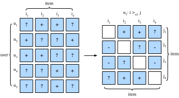

# Personalized Ranking for Recommender Systems

Explicit-rating models learn only from user--item pairs with recorded scores.
Implicit-feedback data pose a different problem. An observed click or purchase
is evidence of interaction, but an unobserved pair may represent dislike, lack
of exposure, or a future interaction. It is therefore safer to call such pairs
*unobserved items*, not negative examples. A training procedure that samples
them as negatives is making an explicit modeling assumption.

Ranking objectives differ in the unit they compare. A **pointwise** objective
fits one user--item score or label at a time. A **pairwise** objective asks that,
for a given user, an observed item receive a higher score than a sampled
unobserved item. A **listwise** objective operates on a candidate list and may
approximate a ranking metric such as normalized discounted cumulative gain
(NDCG). Pairwise objectives align directly with local ordering constraints and
are cheaper than most listwise alternatives, but they do not by themselves
identify which unobserved items are genuine negatives. This section develops
the Bayesian personalized ranking (BPR) and hinge objectives.

## Bayesian Personalized Ranking Loss and its Implementation

Bayesian personalized ranking (BPR)
:cite:`Rendle.Freudenthaler.Gantner.ea.2009` derives a pairwise objective from a
maximum-a-posteriori model. A training triple $(u,i,j)$ asserts that user $u$
prefers observed item $i$ to sampled unobserved item $j$.

Let $D$ denote the collection of such triples. The posterior factorizes into a
pairwise likelihood and a parameter prior,

$$
p(\Theta \mid >_u )  \propto  p(>_u \mid \Theta) p(\Theta)
$$

Here $\Theta$ contains the recommender parameters and $>_u$ denotes the latent
ordering for user $u$. With a logistic likelihood for each observed ordering
constraint, the log posterior is

$$
\begin{aligned}
\textrm{BPR-OPT} : &= \ln p(\Theta \mid >_u) \\
         & \propto \ln p(>_u \mid \Theta) p(\Theta) \\
         &= \ln \prod_{(u, i, j) \in D} \sigma(\hat{y}_{ui} - \hat{y}_{uj}) p(\Theta) \\
         &= \sum_{(u, i, j) \in D} \ln \sigma(\hat{y}_{ui} - \hat{y}_{uj}) + \ln p(\Theta) \\
         &= \sum_{(u, i, j) \in D} \ln \sigma(\hat{y}_{ui} - \hat{y}_{uj}) - \lambda_\Theta \|\Theta \|^2
\end{aligned}
$$


Here $I_u^+$ is the set of observed positive items, $I$ is the item catalog,
and $j$ is sampled from $I\setminus I_u^+$. The scores $\hat y_{ui}$ and
$\hat y_{uj}$ come from any differentiable recommender. We use a zero-mean
isotropic Gaussian prior with precision $2\lambda_\Theta$, equivalently
$p(\Theta)\propto\exp(-\lambda_\Theta\|\Theta\|^2)$. If
$\lambda_\Theta$ instead denoted the prior variance, the regularization
coefficient would be its inverse, up to a factor of $1/2$.



:begin_tab:`mxnet`
We will implement the base class `mxnet.gluon.loss.Loss` and override the `forward` method to construct the Bayesian personalized ranking loss. We begin by importing the Loss class and the np module.
:end_tab:

:begin_tab:`pytorch`
We will subclass `nn.Module` and implement the BPR loss in its `forward` method.
:end_tab:

```{.python .input #ranking-bayesian-personalized-ranking-loss-and-its-implementation-1  n=5}
#@tab mxnet
from mxnet import gluon, np, npx
npx.set_np()
```

```{.python .input #ranking-bayesian-personalized-ranking-loss-and-its-implementation-1  n=5}
#@tab pytorch
import torch
from torch import nn
```

The implementation of BPR loss is as follows.

```{.python .input #ranking-bayesian-personalized-ranking-loss-and-its-implementation-2  n=2}
#@tab mxnet
#@save
class BPRLoss(gluon.loss.Loss):
    def __init__(self, weight=None, batch_axis=0, **kwargs):
        super(BPRLoss, self).__init__(weight=None, batch_axis=0, **kwargs)

    def forward(self, positive, negative):
        distances = positive - negative
        loss = - np.sum(np.log(npx.sigmoid(distances)), 0, keepdims=True)
        return loss
```

```{.python .input #ranking-bayesian-personalized-ranking-loss-and-its-implementation-2  n=2}
#@tab pytorch
#@save
class BPRLoss(nn.Module):
    def __init__(self):
        super(BPRLoss, self).__init__()

    def forward(self, positive, negative):
        distances = positive - negative
        loss = -torch.sum(torch.log(torch.sigmoid(distances)), dim=0,
                          keepdim=True)
        return loss
```

## Hinge Loss and its Implementation

The Hinge loss for ranking has a different form from the standard hinge loss that is often used in classifiers such as SVMs.  The loss used for ranking in recommender systems has the following form.

$$
 \sum_{(u, i, j) \in D} \max( m - \hat{y}_{ui} + \hat{y}_{uj}, 0)
$$

where $m>0$ is the required score margin. For each sampled triple, the loss is
zero once the observed item's score exceeds the sampled unobserved item's score
by at least $m$. As with BPR, this is a constraint induced by the sampling
procedure, not evidence that the unobserved item is disliked.

```{.python .input #ranking-hinge-loss-and-its-implementation  n=3}
#@tab mxnet
#@save
class HingeLossbRec(gluon.loss.Loss):
    def __init__(self, weight=None, batch_axis=0, **kwargs):
        super(HingeLossbRec, self).__init__(weight=None, batch_axis=0,
                                            **kwargs)

    def forward(self, positive, negative, margin=1):
        distances = positive - negative
        loss = np.sum(np.maximum(- distances + margin, 0))
        return loss
```

```{.python .input #ranking-hinge-loss-and-its-implementation  n=3}
#@tab pytorch
#@save
class HingeLossbRec(nn.Module):
    def __init__(self):
        super(HingeLossbRec, self).__init__()

    def forward(self, positive, negative, margin=1):
        distances = positive - negative
        loss = torch.sum(torch.clamp(-distances + margin, min=0))
        return loss
```

Both losses express the same ordering goal, but they have different gradients.
BPR is smooth and continues to reward larger score gaps; the hinge loss has a
fixed margin and zero gradient once that margin is satisfied.

## Summary

- Pointwise, pairwise, and listwise objectives compare different units: one
  item, an ordered pair, or a candidate list.
- BPR and hinge losses encode pairwise order constraints with different gradient
  behavior. Neither turns an unobserved item into a verified negative.

## Exercises

1. Differentiate the BPR and hinge losses with respect to the score difference
   $d=\hat y_{ui}-\hat y_{uj}$. Compare their gradients as $d\to-\infty$, at
   $d=0$, and after the hinge margin is satisfied.
2. Suppose unobserved items are sampled uniformly or in proportion to item
   popularity. Write the expectation optimized by each proposal. Which proposal
   is more likely to sample an exposed but skipped item, and which requires
   importance weights to estimate the uniform-item objective?
3. Construct a user history in which a held-out positive is sampled as a
   training negative. Explain how this label contradiction affects BPR and how
   a strict train/validation/test protocol can avoid consulting test identities
   during model fitting.

:begin_tab:`mxnet`
[Discussions](https://d2l.discourse.group/t/402)
:end_tab:

:begin_tab:`pytorch`
[Discussions](https://d2l.discourse.group/t/402)
:end_tab:

<!-- slides -->

::: {.slide title="Personalized Ranking"}
Most real-world recommender data is **implicit** —
clicks, watches, purchases. There are no explicit ratings,
and the unobserved (user, item) pairs are a *mix* of
"didn't like it" and "haven't seen it yet". MSE on a 0/1
target is wrong.

Better framing: **personalized ranking** — given an
observed positive (user, $i$), the model should rank $i$
*above* sampled unobserved items. Treating every unobserved
pair as a literal negative target is usually misaligned with
ranking because exposure is missing-not-at-random.

Two pairwise losses for this:

- **BPR** (Bayesian Personalized Ranking, Rendle et al.
  2009) — log-sigmoid of score margin:
  $-\log \sigma(\hat r_{ui} - \hat r_{uj})$ for sampled
  negatives $j$.
- **Hinge** — max-margin variant:
  $\max(0, m - (\hat r_{ui} - \hat r_{uj}))$.

Both turn implicit feedback into pairwise comparisons; the
model learns to put positives above negatives.
:::

::: {.slide title="Training triples"}
For each user $u$, let $I_u^+$ be observed positives
(clicked, watched, bought) and sample negatives
$j \notin I_u^+$ from the item catalog. Training examples are
triples:

$$D = \{(u,i,j): i\in I_u^+,\, j\notin I_u^+\}.$$

The model never needs an absolute rating target. It only needs
the score gap

$$\Delta_{uij} = \hat r_{ui} - \hat r_{uj}.$$

Large positive gaps mean the positive item outranks the sampled
negative. The sampled negative is a training contrast, not proof
that the user would dislike the item.
:::

::: {.slide title="BPR loss"}
Sampled negatives $j$ per positive $(u, i)$; loss is
log-sigmoid of the score margin:

@ranking-bayesian-personalized-ranking-loss-and-its-implementation-1

. . .

@ranking-bayesian-personalized-ranking-loss-and-its-implementation-2
:::

::: {.slide title="Hinge loss"}
Hard-margin alternative — equivalent to a max-margin
classifier over score differences:

@ranking-hinge-loss-and-its-implementation
:::

::: {.slide title="BPR vs hinge"}
Both losses reward positive margins, but their gradients behave
differently:

$$\ell_\textrm{BPR}(\Delta) = -\log \sigma(\Delta), \qquad
  \ell_\textrm{hinge}(\Delta) = \max(0, m-\Delta).$$

- BPR keeps a smooth, nonzero gradient for every sampled pair.
- Hinge stops updating once the margin is satisfied.
- The most important implementation choice is often the negative
  sampler, not the algebraic form of the loss.
:::

::: {.slide title="Pairwise objectives encode different margin behavior"}
- Personalized ranking turns implicit feedback into a
  pairwise comparison task.
- BPR: log-sigmoid of the (positive - negative) score
  margin. Soft, differentiable, the most-used choice.
- Hinge: hard margin; sometimes better with very
  imbalanced data.
- Negative sampling is the implementation hammer that
  makes either loss tractable on large item catalogs.
:::
