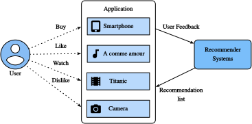

# Overview of Recommender Systems

A recommender observes a sparse set of interactions between users and items and
uses them to rank items that have not yet been observed. Here an *item* may be a
movie, article, song, product, or advertisement. The system does not observe a
user's preferences directly; it sees only actions produced jointly by
preference, exposure, interface design, and circumstance.

User, item, and optional context information enter a scoring model. The scores
order a candidate set, and subsequent interactions become later observations.
This feedback loop distinguishes recommendation from an ordinary supervised
dataset whose examples are sampled independently of the model.

## Collaborative Filtering

Collaborative filtering (CF) predicts from the pattern of interactions across users and items. The name arose in the Tapestry system :cite:`Goldberg.Nichols.Oki.ea.1992`, where people helped one another filter messages. In its modern statistical sense, no direct collaboration is required: two users inform one another's predictions because their observed interactions have a related pattern.

Memory-based methods compare users or items through their overlapping interactions :cite:`Sarwar.Karypis.Konstan.ea.2001`. Their estimates are easy to inspect, but sparse overlap makes the similarities noisy. Model-based methods instead fit a parameterized score, such as the latent-factor model developed later in this chapter :cite:`Su.Khoshgoftaar.2009`. These categories describe how a method uses interaction data; they do not by themselves determine the training objective or evaluation protocol.

The available variables define a second, independent distinction:

| Input to the score | Common name | Information available for a new item |
|:--|:--|:--|
| User--item interactions only | Collaborative filtering | None until the item receives interactions |
| Item or user attributes | Content-based recommendation | Attributes may support a cold-start score |
| Interaction-time variables such as device, location, or time | Context-aware recommendation | A score can vary with the current setting |

## Explicit Feedback and Implicit Feedback

*Explicit feedback* records a value that a user deliberately supplies, such as
a star rating or a like/dislike response. It provides a direct label for the
displayed item, but only for users and items that receive a response.

*Implicit feedback* records behavior such as an impression, click, purchase,
or completed view :cite:`Hu.Koren.Volinsky.2008`. Such events are plentiful,
but their interpretation depends on exposure and context. A view may reflect
interest, accidental playback, or limited alternatives; absence of a view may
mean that the item was never displayed. Consequently, implicit-feedback models
must state how they sample or weight unobserved pairs.

## Recommendation Tasks

The target determines the task. *Rating prediction* estimates a recorded
explicit score. *Top-$n$ recommendation* ranks a candidate set from implicit
events. *Next-item recommendation* conditions that ranking on an ordered
history :cite:`Quadrana.Cremonesi.Jannach.2018`. *Click-through-rate
prediction* estimates the click probability of a displayed impression from
user, item, and contextual fields.

These tasks also differ in what identifiers are available at evaluation time.
Warm-start evaluation includes users and items seen during training. A
*cold-start* protocol withholds users, items, or both and therefore requires
attributes or another mechanism that can score unseen identifiers
:cite:`Schein.Popescul.Ungar.ea.2002`.

## Summary

* Recommendation ranks a candidate set from selectively observed interactions;
  search instead begins with an explicit query.
* Explicit ratings, implicit events, item attributes, and context provide
  different evidence and require different observation assumptions.
* Rating prediction, candidate ranking, next-item prediction, CTR prediction,
  and cold-start evaluation are distinct tasks rather than interchangeable
  measures of one model.

## Exercises

1. Construct two histories with the same interacted items but different order.
   Which chapter models assign them identical scores, and which can distinguish
   them?
2. Give an example in which an unobserved item is a false negative. How would
   uniform negative sampling change the expected training objective?
3. Design separate warm-start and item-cold-start splits. Which input fields
   are required to produce a score in each split?

[Discussions](https://d2l.discourse.group/t/398)
