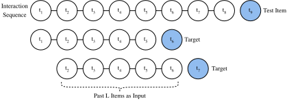

# Sequence-Aware Recommender Systems

In previous sections, we abstract the recommendation task as a matrix completion problem without considering users' short-term behaviors. In this section, we will introduce a recommendation model that takes  the sequentially-ordered user interaction logs into account.  It is a sequence-aware recommender :cite:`Quadrana.Cremonesi.Jannach.2018` where the input is an ordered and often timestamped list of past user actions.  A number of recent literatures have demonstrated the usefulness of incorporating such information in modeling users' temporal behavioral patterns and discovering their interest drift.

The model we will introduce, Caser :cite:`Tang.Wang.2018`, short for convolutional sequence embedding recommendation model, adopts convolutional neural networks capture the dynamic pattern influences of users' recent activities. The main component of Caser consists of a horizontal convolutional network and a vertical convolutional network, aiming to uncover the union-level and point-level sequence patterns, respectively.  Point-level pattern indicates the impact of single item in the historical sequence on the target item, while union level pattern implies the influences of several previous actions on the subsequent target. For example, buying both milk and butter together leads to higher probability of buying flour than just buying one of them. Moreover, users' general interests, or long term preferences are also modeled in the last fully connected layers, resulting in a more comprehensive modeling of user interests. Details of the model are described as follows.

## Model Architectures

In sequence-aware recommendation system, each user is associated with a sequence of some items from the item set. Let $S^u = (S_1^u, ... S_{|S_u|}^u)$ denotes the ordered sequence. The goal of Caser is to recommend item by considering user general tastes as well as short-term intention. Suppose we take the previous $L$ items into consideration, an embedding matrix that represents the former interactions for time step $t$ can be constructed:

$$
\mathbf{E}^{(u, t)} = \begin{bmatrix} \mathbf{q}_{S_{t-L}^u} \\ \vdots \\ \mathbf{q}_{S_{t-2}^u} \\ \mathbf{q}_{S_{t-1}^u} \end{bmatrix},
$$

where $\mathbf{Q} \in \mathbb{R}^{n \times k}$ represents item embeddings and $\mathbf{q}_i$ denotes the $i^\textrm{th}$ row. $\mathbf{E}^{(u, t)} \in \mathbb{R}^{L \times k}$ can be used to infer the transient interest of user $u$ at time-step $t$. We can view the input matrix $\mathbf{E}^{(u, t)}$ as an image which is the input of the subsequent two convolutional components.

The horizontal convolutional layer has $d$ horizontal filters $\mathbf{F}^j \in \mathbb{R}^{h \times k}, 1 \leq j \leq d, h = \{1, ..., L\}$, and the vertical convolutional layer has $d'$ vertical filters $\mathbf{G}^j \in \mathbb{R}^{ L \times 1}, 1 \leq j \leq d'$. After a series of convolutional and pool operations, we get the two outputs:

$$
\mathbf{o} = \textrm{HConv}(\mathbf{E}^{(u, t)}, \mathbf{F}) \\
\mathbf{o}'= \textrm{VConv}(\mathbf{E}^{(u, t)}, \mathbf{G}) ,
$$

where $\mathbf{o} \in \mathbb{R}^d$ is the output of horizontal convolutional network and $\mathbf{o}' \in \mathbb{R}^{kd'}$ is the output of vertical convolutional network. For simplicity, we omit the details of convolution and pool operations. They are concatenated and fed into a fully connected neural network layer to get more high-level representations.

$$
\mathbf{z} = \phi(\mathbf{W}[\mathbf{o}, \mathbf{o}']^\top + \mathbf{b}),
$$

where $\mathbf{W} \in \mathbb{R}^{k \times (d + kd')}$ is the weight matrix and $\mathbf{b} \in \mathbb{R}^k$ is the bias. The learned vector $\mathbf{z} \in \mathbb{R}^k$ is the representation of user's short-term intent.

At last, the prediction function combines users' short-term and general taste together, which is defined as:

$$
\hat{y}_{uit} = \mathbf{v}_i \cdot [\mathbf{z}, \mathbf{p}_u]^\top + \mathbf{b}'_i,
$$

where $\mathbf{V} \in \mathbb{R}^{n \times 2k}$ is another item embedding matrix. $\mathbf{b}' \in \mathbb{R}^n$ is the item specific bias.  $\mathbf{P} \in \mathbb{R}^{m \times k}$ is the user embedding matrix for users' general tastes. $\mathbf{p}_u \in \mathbb{R}^{ k}$ is the $u^\textrm{th}$ row of $P$ and $\mathbf{v}_i \in \mathbb{R}^{2k}$ is the $i^\textrm{th}$ row of $\mathbf{V}$.

The model can be learned with BPR or Hinge loss. The architecture of Caser is shown below:


We first import the required libraries.

```{.python .input #seqrec-model-architectures  n=3}
#@tab mxnet
from d2l import mxnet as d2l
from mxnet import gluon, np, npx
from mxnet.gluon import nn
import mxnet as mx
import random

npx.set_np()
```

```{.python .input #seqrec-model-architectures  n=3}
#@tab pytorch
from d2l import torch as d2l
import torch
from torch import nn
import random
```

## Model Implementation
The following code implements the Caser model. It consists of a vertical convolutional layer, a horizontal convolutional layer, and a full-connected layer.

```{.python .input #seqrec-model-implementation  n=4}
#@tab mxnet
class Caser(nn.Block):
    def __init__(self, num_factors, num_users, num_items, L=5, d=16,
                 d_prime=4, drop_ratio=0.05, **kwargs):
        super(Caser, self).__init__(**kwargs)
        self.P = nn.Embedding(num_users, num_factors)
        self.Q = nn.Embedding(num_items, num_factors)
        self.d_prime, self.d = d_prime, d
        # Vertical convolution layer
        self.conv_v = nn.Conv2D(d_prime, (L, 1), in_channels=1)
        # Horizontal convolution layer
        h = [i + 1 for i in range(L)]
        self.conv_h, self.max_pool = nn.Sequential(), nn.Sequential()
        for i in h:
            self.conv_h.add(nn.Conv2D(d, (i, num_factors), in_channels=1))
            self.max_pool.add(nn.MaxPool1D(L - i + 1))
        # Fully connected layer
        self.fc1_dim_v, self.fc1_dim_h = d_prime * num_factors, d * len(h)
        self.fc = nn.Dense(in_units=d_prime * num_factors + d * L,
                           activation='relu', units=num_factors)
        self.Q_prime = nn.Embedding(num_items, num_factors * 2)
        self.b = nn.Embedding(num_items, 1)
        self.dropout = nn.Dropout(drop_ratio)

    def forward(self, user_id, seq, item_id):
        item_embs = np.expand_dims(self.Q(seq), 1)
        user_emb = self.P(user_id)
        out, out_h, out_v, out_hs = None, None, None, []
        if self.d_prime:
            out_v = self.conv_v(item_embs)
            out_v = out_v.reshape(out_v.shape[0], self.fc1_dim_v)
        if self.d:
            for conv, maxp in zip(self.conv_h, self.max_pool):
                conv_out = np.squeeze(npx.relu(conv(item_embs)), axis=3)
                t = maxp(conv_out)
                pool_out = np.squeeze(t, axis=2)
                out_hs.append(pool_out)
            out_h = np.concatenate(out_hs, axis=1)
        out = np.concatenate([out_v, out_h], axis=1)
        z = self.fc(self.dropout(out))
        x = np.concatenate([z, user_emb], axis=1)
        q_prime_i = np.squeeze(self.Q_prime(item_id))
        b = np.squeeze(self.b(item_id))
        res = (x * q_prime_i).sum(1) + b
        return res
```

```{.python .input #seqrec-model-implementation  n=4}
#@tab pytorch
class Caser(nn.Module):
    def __init__(self, num_factors, num_users, num_items, L=5, d=16,
                 d_prime=4, drop_ratio=0.05):
        super().__init__()
        self.P = nn.Embedding(num_users, num_factors)
        self.Q = nn.Embedding(num_items, num_factors)
        self.d_prime, self.d = d_prime, d
        # Vertical convolution layer
        self.conv_v = nn.Conv2d(1, d_prime, (L, 1))
        # Horizontal convolution layer
        h = [i + 1 for i in range(L)]
        self.conv_h = nn.ModuleList(
            [nn.Conv2d(1, d, (i, num_factors)) for i in h])
        self.max_pool = nn.ModuleList(
            [nn.MaxPool1d(L - i + 1) for i in h])
        # Fully connected layer
        self.fc1_dim_v, self.fc1_dim_h = d_prime * num_factors, d * len(h)
        self.fc = nn.Sequential(
            nn.Linear(d_prime * num_factors + d * L, num_factors),
            nn.ReLU())
        self.Q_prime = nn.Embedding(num_items, num_factors * 2)
        self.b = nn.Embedding(num_items, 1)
        self.dropout = nn.Dropout(drop_ratio)

    def forward(self, user_id, seq, item_id):
        item_embs = self.Q(seq).unsqueeze(1)
        user_emb = self.P(user_id)
        out, out_h, out_v, out_hs = None, None, None, []
        if self.d_prime:
            out_v = self.conv_v(item_embs)
            out_v = out_v.reshape(out_v.shape[0], self.fc1_dim_v)
        if self.d:
            for conv, maxp in zip(self.conv_h, self.max_pool):
                conv_out = torch.relu(conv(item_embs)).squeeze(3)
                t = maxp(conv_out)
                pool_out = t.squeeze(2)
                out_hs.append(pool_out)
            out_h = torch.cat(out_hs, dim=1)
        out = torch.cat([out_v, out_h], dim=1)
        z = self.fc(self.dropout(out))
        x = torch.cat([z, user_emb], dim=1)
        q_prime_i = self.Q_prime(item_id).squeeze()
        b = self.b(item_id).squeeze()
        res = (x * q_prime_i).sum(1) + b
        return res
```

## Sequential Dataset with Negative Sampling
To process the sequential interaction data, we need to reimplement the `Dataset` class. The following code creates a new dataset class named `SeqDataset`. In each sample, it outputs the user identity, his previous $L$ interacted items as a sequence and the next item he interacts as the target. The following figure demonstrates the data loading process for one user. Suppose that this user liked 9 movies, we organize these nine movies in chronological order. The latest movie is left out as the test item. For the remaining eight movies, we can get three training samples, with each sample containing a sequence of five ($L=5$) movies and its subsequent item as the target item. Negative samples are also included in the customized dataset.



```{.python .input #seqrec-sequential-dataset-with-negative-sampling  n=5}
#@tab mxnet
class SeqDataset(gluon.data.Dataset):
    def __init__(self, user_ids, item_ids, L, num_users, num_items,
                 candidates):
        user_ids, item_ids = np.array(user_ids), np.array(item_ids)
        sort_idx = np.array(sorted(range(len(user_ids)),
                                   key=lambda k: user_ids[k]))
        u_ids, i_ids = user_ids[sort_idx], item_ids[sort_idx]
        temp, u_ids, self.cand = {}, u_ids.asnumpy(), candidates
        self.all_items = set([i for i in range(num_items)])
        [temp.setdefault(u_ids[i], []).append(i) for i, _ in enumerate(u_ids)]
        temp = sorted(temp.items(), key=lambda x: x[0])
        u_ids = np.array([i[0] for i in temp])
        idx = np.array([i[1][0] for i in temp])
        self.ns = ns = int(sum([c - L if c >= L + 1 else 1 for c
                                in np.array([len(i[1]) for i in temp])]))
        self.seq_items = np.zeros((ns, L))
        self.seq_users = np.zeros(ns, dtype='int32')
        self.seq_tgt = np.zeros((ns, 1))
        self.test_seq = np.zeros((num_users, L))
        test_users, _uid = np.empty(num_users), None
        for i, (uid, i_seq) in enumerate(self._seq(u_ids, i_ids, idx, L + 1)):
            if uid != _uid:
                self.test_seq[uid][:] = i_seq[-L:]
                test_users[uid], _uid = uid, uid
            self.seq_tgt[i][:] = i_seq[-1:]
            self.seq_items[i][:], self.seq_users[i] = i_seq[:L], uid

    def _win(self, tensor, window_size, step_size=1):
        if len(tensor) - window_size >= 0:
            for i in range(len(tensor), 0, - step_size):
                if i - window_size >= 0:
                    yield tensor[i - window_size:i]
                else:
                    break
        else:
            yield tensor

    def _seq(self, u_ids, i_ids, idx, max_len):
        for i in range(len(idx)):
            stop_idx = None if i >= len(idx) - 1 else int(idx[i + 1])
            for s in self._win(i_ids[int(idx[i]):stop_idx], max_len):
                yield (int(u_ids[i]), s)

    def __len__(self):
        return self.ns

    def __getitem__(self, idx):
        neg = list(self.all_items - set(self.cand[int(self.seq_users[idx])]))
        i = random.randint(0, len(neg) - 1)
        return (self.seq_users[idx], self.seq_items[idx], self.seq_tgt[idx],
                neg[i])
```

```{.python .input #seqrec-sequential-dataset-with-negative-sampling  n=5}
#@tab pytorch
class SeqDataset(torch.utils.data.Dataset):
    def __init__(self, user_ids, item_ids, L, num_users, num_items,
                 candidates):
        user_ids = torch.tensor(user_ids, dtype=torch.long)
        item_ids = torch.tensor(item_ids, dtype=torch.long)
        sort_idx = sorted(range(len(user_ids)),
                          key=lambda k: user_ids[k].item())
        sort_idx = torch.tensor(sort_idx, dtype=torch.long)
        u_ids, i_ids = user_ids[sort_idx], item_ids[sort_idx]
        temp, u_ids_np, self.cand = {}, u_ids.numpy(), candidates
        self.all_items = set([i for i in range(num_items)])
        [temp.setdefault(u_ids_np[i], []).append(i)
         for i, _ in enumerate(u_ids_np)]
        temp = sorted(temp.items(), key=lambda x: x[0])
        u_ids = torch.tensor([i[0] for i in temp], dtype=torch.long)
        idx = torch.tensor([i[1][0] for i in temp], dtype=torch.long)
        self.ns = ns = int(sum([c - L if c >= L + 1 else 1 for c
                                in [len(i[1]) for i in temp]]))
        self.seq_items = torch.zeros(ns, L, dtype=torch.long)
        self.seq_users = torch.zeros(ns, dtype=torch.long)
        self.seq_tgt = torch.zeros(ns, 1, dtype=torch.long)
        self.test_seq = torch.zeros(num_users, L, dtype=torch.long)
        test_users, _uid = torch.empty(num_users), None
        for i, (uid, i_seq) in enumerate(self._seq(u_ids, i_ids, idx, L + 1)):
            if uid != _uid:
                self.test_seq[uid][:] = i_seq[-L:]
                test_users[uid], _uid = uid, uid
            self.seq_tgt[i][:] = i_seq[-1:]
            self.seq_items[i][:], self.seq_users[i] = i_seq[:L], uid

    def _win(self, tensor, window_size, step_size=1):
        if len(tensor) - window_size >= 0:
            for i in range(len(tensor), 0, - step_size):
                if i - window_size >= 0:
                    yield tensor[i - window_size:i]
                else:
                    break
        else:
            yield tensor

    def _seq(self, u_ids, i_ids, idx, max_len):
        for i in range(len(idx)):
            stop_idx = None if i >= len(idx) - 1 else int(idx[i + 1])
            for s in self._win(i_ids[int(idx[i]):stop_idx], max_len):
                yield (int(u_ids[i]), s)

    def __len__(self):
        return self.ns

    def __getitem__(self, idx):
        neg = list(self.all_items - set(self.cand[int(self.seq_users[idx])]))
        i = random.randint(0, len(neg) - 1)
        return (self.seq_users[idx], self.seq_items[idx], self.seq_tgt[idx],
                neg[i])
```

## Load the MovieLens 100K dataset

Afterwards, we read and split the MovieLens 100K dataset in sequence-aware mode and load the training data with sequential dataloader implemented above.

```{.python .input #seqrec-load-the-movielens-100k-dataset  n=6}
#@tab mxnet
TARGET_NUM, L, batch_size = 1, 5, 4096
df, num_users, num_items = d2l.read_data_ml100k()
train_data, test_data = d2l.split_data_ml100k(df, num_users, num_items,
                                              'seq-aware')
users_train, items_train, ratings_train, candidates = d2l.load_data_ml100k(
    train_data, num_users, num_items, feedback="implicit")
users_test, items_test, ratings_test, test_iter = d2l.load_data_ml100k(
    test_data, num_users, num_items, feedback="implicit")
train_seq_data = SeqDataset(users_train, items_train, L, num_users,
                            num_items, candidates)
train_iter = gluon.data.DataLoader(train_seq_data, batch_size, True,
                                   last_batch="rollover",
                                   num_workers=d2l.get_dataloader_workers())
test_seq_iter = train_seq_data.test_seq
train_seq_data[0]
```

```{.python .input #seqrec-load-the-movielens-100k-dataset  n=6}
#@tab pytorch
TARGET_NUM, L, batch_size = 1, 5, 4096
df, num_users, num_items = d2l.read_data_ml100k()
train_data, test_data = d2l.split_data_ml100k(df, num_users, num_items,
                                              'seq-aware')
users_train, items_train, ratings_train, candidates = d2l.load_data_ml100k(
    train_data, num_users, num_items, feedback="implicit")
users_test, items_test, ratings_test, test_iter = d2l.load_data_ml100k(
    test_data, num_users, num_items, feedback="implicit")
train_seq_data = SeqDataset(users_train, items_train, L, num_users,
                            num_items, candidates)
train_iter = torch.utils.data.DataLoader(train_seq_data, batch_size,
                                         shuffle=True, drop_last=True,
                                         num_workers=d2l.get_dataloader_workers())
test_seq_iter = train_seq_data.test_seq
train_seq_data[0]
```

The training data structure is shown above. The first element is the user identity, the second is the list of the last five items this user liked, the third is the target item this user liked after those five, and the fourth is a randomly sampled negative item.

## Train the Model
Now, let's train the model. We use the same setting as NeuMF, including learning rate, optimizer, and $k$, in the last section so that the results are comparable.

```{.python .input #seqrec-train-the-model  n=7}
#@tab mxnet
devices = d2l.try_all_gpus()
net = Caser(10, num_users, num_items, L)
net.initialize(ctx=devices, force_reinit=True, init=mx.init.Normal(0.01))
lr, num_epochs, wd, optimizer = 0.04, 8, 1e-5, 'adam'
loss = d2l.BPRLoss()
trainer = gluon.Trainer(net.collect_params(), optimizer,
                        {"learning_rate": lr, 'wd': wd})

# `evaluate_ranking` (which scores every (user, item) pair) is the
# bottleneck. Run it once at the end of training, rather than every
# epoch, so the cell completes in well under an hour.
d2l.train_ranking(net, train_iter, test_iter, loss, trainer,
                  test_seq_iter, num_users, num_items, num_epochs,
                  devices, d2l.evaluate_ranking, candidates,
                  eval_step=num_epochs)
```

```{.python .input #seqrec-train-the-model  n=7}
#@tab pytorch
devices = d2l.try_all_gpus()
net = Caser(10, num_users, num_items, L)
net.apply(lambda m: (nn.init.normal_(m.weight, 0, 0.01)
                     if hasattr(m, 'weight') else None))
net = net.to(devices[0])
lr, num_epochs, wd, optimizer = 0.04, 8, 1e-5, 'adam'
loss = d2l.BPRLoss()
trainer = torch.optim.Adam(net.parameters(), lr=lr, weight_decay=wd)

# `evaluate_ranking` is the bottleneck — it scores every (user, item)
# pair that the user has not interacted with, so per-epoch evaluation
# dominates total runtime. Setting `eval_step=num_epochs` defers
# evaluation to the final epoch only, which keeps the cell well under
# an hour while still reporting hit-rate / AUC for the trained model.
d2l.train_ranking(net, train_iter, test_iter, loss, trainer,
                  test_seq_iter, num_users, num_items, num_epochs,
                  devices, d2l.evaluate_ranking, candidates,
                  eval_step=num_epochs)
```

## Summary
* Inferring a user's short-term and long-term interests can make prediction of the next item that he preferred more effectively.
* Convolutional neural networks can be utilized to capture users' short-term interests from sequential interactions.

## Exercises

* Conduct an ablation study by removing one of the horizontal and vertical convolutional networks, which component is the more important ?
* Vary the hyperparameter $L$. Does longer historical interactions bring higher accuracy?
* Apart from the sequence-aware recommendation task we introduced above, there is another type of sequence-aware recommendation task called session-based recommendation :cite:`Hidasi.Karatzoglou.Baltrunas.ea.2015`. Can you explain the differences between these two tasks?


:begin_tab:`mxnet`
[Discussions](https://discuss.d2l.ai/t/404)
:end_tab:

:begin_tab:`pytorch`
[Discussions](https://discuss.d2l.ai/t/404)
:end_tab:

:begin_tab:`tensorflow,jax`
This chapter is currently implemented for MXNet and PyTorch only. The
Caser model relies on a custom `BPRLoss`, a `SeqDataset` that materializes
sequence windows on demand, and a `train_ranking` / `evaluate_ranking`
loop, none of which are exposed in `d2l.tensorflow` or `d2l.jax` yet. If
you would like to follow along, the PyTorch tab uses standard
operations (`nn.Embedding`, `nn.Conv2d`, BPR / margin loss) that port
straightforwardly to either framework — see the PyTorch sources as a
reference implementation.
:end_tab:

<!-- slides -->

::: {.slide}
Matrix factorization treats user history as a *bag* —
order doesn't matter. But sessions reveal short-term
intent that bags miss: someone who just watched two
sci-fi movies probably wants a third, regardless of their
all-time average preferences.

**Caser** (Tang & Wang, 2018) — convolutional sequence
recommender. Build a user's recent interactions into a
$L \times d$ matrix (last $L$ items × embedding dim);
apply *horizontal* convolutions (capture sequential
patterns) and *vertical* convolutions (capture pointwise
patterns); combine with a per-user latent vector to
predict the next item.

A bridge between session-based RNN models and
collaborative filtering. Combines a "what you've been
doing recently" signal with a "who you are" signal.
:::

::: {.slide title="Architecture"}
Two parallel CNN branches over the recent-items matrix —
horizontal filters scan multi-item sequences, vertical
filters mix item embeddings:

@seqrec-model-architectures
:::

::: {.slide title="Implementation"}
Embedding tables + parallel conv branches + per-user MF
component → final score:

@seqrec-model-implementation
:::

::: {.slide title="Sequential dataset"}
Each example: (user, last-L items, target item, negative
target). Per-user sliding windows over their interaction
sequence:

@seqrec-sequential-dataset-with-negative-sampling
:::

::: {.slide title="Loading + training"}
@seqrec-load-the-movielens-100k-dataset

. . .

@seqrec-train-the-model
:::

::: {.slide title="Recap"}
- Sequence-aware recommenders use *order* of recent
  interactions, not just frequencies.
- Caser: CNN over last-L items + per-user MF component +
  BPR loss.
- Modern descendants: SASRec (self-attention), BERT4Rec
  (BERT-style masked-item prediction). Same idea, more
  expressive sequence modeling.
:::
