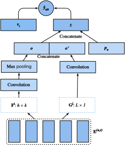
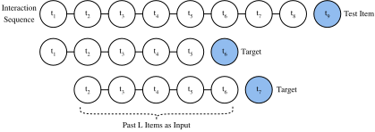

# Sequence-Aware Recommender Systems

The interaction matrix records which events occurred but discards their order. That omission matters when recent actions reveal a short-lived intent: a reader comparing cameras may want a memory card next, even if their long-run history concerns books. A sequence-aware recommender instead conditions on an ordered, often timestamped, interaction history :cite:`Quadrana.Cremonesi.Jannach.2018`.

Caser :cite:`Tang.Wang.2018` represents the last $L$ items as a matrix and applies two kinds of convolution. Horizontal filters detect local patterns spanning several consecutive items; vertical filters combine the same embedding coordinate across the entire window. The resulting short-term representation is joined with a user embedding that represents longer-term preference.

## Model Architectures

Let $S^u=(S_1^u,\ldots,S_{|S^u|}^u)$ be user $u$'s interactions in chronological order. To score the item at time $t$, Caser embeds the preceding $L$ items as the rows of

$$
\mathbf{E}^{(u, t)} = \begin{bmatrix} \mathbf{q}_{S_{t-L}^u} \\ \vdots \\ \mathbf{q}_{S_{t-2}^u} \\ \mathbf{q}_{S_{t-1}^u} \end{bmatrix},
$$

where $\mathbf{Q}\in\mathbb{R}^{n\times k}$ is the item-embedding matrix and $\mathbf{q}_i$ is its $i$th row. Thus $\mathbf{E}^{(u,t)}\in\mathbb{R}^{L\times k}$ has time along its rows and embedding coordinates along its columns. The image analogy is useful only for specifying the filter shapes; neither axis is spatial.

For horizontal filter $j$, choose a height $h_j\in\{1,\ldots,L\}$ and weights $\mathbf{F}^j\in\mathbb{R}^{h_j\times k}$. The filter scores each consecutive block of $h_j$ items, and max pooling retains its strongest response:

$$
\begin{aligned}
c_{j,s} &= \rho\!\left(\langle\mathbf{F}^j,\mathbf{E}^{(u,t)}_{s:s+h_j-1,:}\rangle+a_j\right),\\
o_j &= \max_s c_{j,s}, \qquad j=1,\ldots,d,
\end{aligned}
$$

Here $\rho$ is an activation function and $\langle\cdot,\cdot\rangle$ is the Frobenius inner product. The $d$ pooled responses form $\mathbf{o}\in\mathbb{R}^d$. A vertical filter $\mathbf{G}^j\in\mathbb{R}^{L\times1}$ instead combines all $L$ time steps separately for each embedding coordinate. Concatenating the outputs of $d'$ such filters gives

$$
\mathbf{o}'=[\rho((\mathbf{E}^{(u,t)})^\top\mathbf{G}^1+a'_1);\ldots;\rho((\mathbf{E}^{(u,t)})^\top\mathbf{G}^{d'}+a'_{d'})]\in\mathbb{R}^{kd'}.
$$

The two branches are concatenated and mapped to a $k$-dimensional representation:

$$
\mathbf{z} = \phi(\mathbf{W}[\mathbf{o};\mathbf{o}'] + \mathbf{b}),
$$

where $\mathbf{W}\in\mathbb{R}^{k\times(d+kd')}$ and $\mathbf{b}\in\mathbb{R}^k$. The vector $\mathbf{z}\in\mathbb{R}^k$ summarizes the recent window.

To retain information beyond the recent window, the final score also includes a user embedding $\mathbf{p}_u\in\mathbb{R}^k$:

$$
\hat{y}_{uit} = \mathbf{v}_i^\top[\mathbf{z};\mathbf{p}_u] + b'_i.
$$

Here $\mathbf{v}_i\in\mathbb{R}^{2k}$ and $b'_i$ are item-specific output parameters. The score can be trained with the BPR loss or a pairwise hinge loss; in either case, the negative items are sampled training comparisons rather than observed dislikes.




We first import the required libraries.

```{.python .input #seqrec-model-architectures  n=3}
#@tab mxnet
from d2l import mxnet as d2l
from mxnet import gluon, np, npx
from mxnet.gluon import nn
import mxnet as mx
import random

npx.set_np()
```

```{.python .input #seqrec-model-architectures  n=3}
#@tab pytorch
from d2l import torch as d2l
import torch
from torch import nn
import random
```

## Model Implementation
The following code implements the Caser model. It consists of a vertical convolutional layer, a horizontal convolutional layer, and a full-connected layer.

```{.python .input #seqrec-model-implementation  n=4}
#@tab mxnet
class Caser(nn.Block):
    def __init__(self, num_factors, num_users, num_items, L=5, d=16,
                 d_prime=4, drop_ratio=0.05):
        super().__init__()
        self.P = nn.Embedding(num_users, num_factors)
        self.Q = nn.Embedding(num_items, num_factors)
        self.d_prime, self.d = d_prime, d
        # Vertical convolution layer
        self.conv_v = nn.Conv2D(d_prime, (L, 1), in_channels=1)
        # Horizontal convolution layer
        h = [i + 1 for i in range(L)]
        self.conv_h, self.max_pool = nn.Sequential(), nn.Sequential()
        for i in h:
            self.conv_h.add(nn.Conv2D(d, (i, num_factors), in_channels=1))
            self.max_pool.add(nn.MaxPool1D(L - i + 1))
        # Fully connected layer
        self.fc1_dim_v, self.fc1_dim_h = d_prime * num_factors, d * len(h)
        self.fc = nn.Dense(in_units=d_prime * num_factors + d * L,
                           activation='relu', units=num_factors)
        self.Q_prime = nn.Embedding(num_items, num_factors * 2)
        self.b = nn.Embedding(num_items, 1)
        self.dropout = nn.Dropout(drop_ratio)

    def forward(self, user_id, seq, item_id):
        item_embs = np.expand_dims(self.Q(seq), 1)
        user_emb = self.P(user_id)
        out, out_h, out_v, out_hs = None, None, None, []
        if self.d_prime:
            out_v = self.conv_v(item_embs)
            out_v = out_v.reshape(out_v.shape[0], self.fc1_dim_v)
        if self.d:
            for conv, maxp in zip(self.conv_h, self.max_pool):
                conv_out = np.squeeze(npx.relu(conv(item_embs)), axis=3)
                t = maxp(conv_out)
                pool_out = np.squeeze(t, axis=2)
                out_hs.append(pool_out)
            out_h = np.concatenate(out_hs, axis=1)
        out = np.concatenate([out_v, out_h], axis=1)
        z = self.fc(self.dropout(out))
        x = np.concatenate([z, user_emb], axis=1)
        # batch_size is 4096 here, so bare squeeze (collapsing all singleton
        # axes) is safe and produces matched shapes for the positive
        # (item_id shape (B,1)) and negative (item_id shape (B,)) paths.
        q_prime_i = np.squeeze(self.Q_prime(item_id))
        b = np.squeeze(self.b(item_id))
        res = (x * q_prime_i).sum(1) + b
        return res
```

```{.python .input #seqrec-model-implementation  n=4}
#@tab pytorch
class Caser(nn.Module):
    def __init__(self, num_factors, num_users, num_items, L=5, d=16,
                 d_prime=4, drop_ratio=0.05):
        super().__init__()
        self.P = nn.Embedding(num_users, num_factors)
        self.Q = nn.Embedding(num_items, num_factors)
        self.d_prime, self.d = d_prime, d
        # Vertical convolution layer
        self.conv_v = nn.Conv2d(1, d_prime, (L, 1))
        # Horizontal convolution layer
        h = [i + 1 for i in range(L)]
        self.conv_h = nn.ModuleList(
            [nn.Conv2d(1, d, (i, num_factors)) for i in h])
        self.max_pool = nn.ModuleList(
            [nn.MaxPool1d(L - i + 1) for i in h])
        # Fully connected layer
        self.fc1_dim_v, self.fc1_dim_h = d_prime * num_factors, d * len(h)
        self.fc = nn.Sequential(
            nn.Linear(d_prime * num_factors + d * L, num_factors),
            nn.ReLU())
        self.Q_prime = nn.Embedding(num_items, num_factors * 2)
        self.b = nn.Embedding(num_items, 1)
        self.dropout = nn.Dropout(drop_ratio)

    def forward(self, user_id, seq, item_id):
        item_embs = self.Q(seq).unsqueeze(1)
        user_emb = self.P(user_id)
        out, out_h, out_v, out_hs = None, None, None, []
        if self.d_prime:
            out_v = self.conv_v(item_embs)
            out_v = out_v.reshape(out_v.shape[0], self.fc1_dim_v)
        if self.d:
            for conv, maxp in zip(self.conv_h, self.max_pool):
                conv_out = torch.relu(conv(item_embs)).squeeze(3)
                t = maxp(conv_out)
                pool_out = t.squeeze(2)
                out_hs.append(pool_out)
            out_h = torch.cat(out_hs, dim=1)
        out = torch.cat([out_v, out_h], dim=1)
        z = self.fc(self.dropout(out))
        x = torch.cat([z, user_emb], dim=1)
        # batch_size is 4096 here, so bare squeeze (collapsing all singleton
        # axes) is safe and produces matched shapes for the positive
        # (item_id shape (B,1)) and negative (item_id shape (B,)) paths.
        q_prime_i = self.Q_prime(item_id).squeeze()
        b = self.b(item_id).squeeze()
        res = (x * q_prime_i).sum(1) + b
        return res
```

## Sequential Dataset with Negative Sampling
`SeqDataset` converts each user's chronological history into next-item examples. With a window length $L$, an example contains the user identifier, $L$ consecutive items, and the item that followed them. The implementation reserves the final interaction for testing and forms training windows only from earlier events, preventing a future item from entering a training input. It also samples an unobserved item for each positive target to construct the pairwise loss.

As in the NeuMF experiment, the negative pool excludes the known held-out
positive. This avoids a contradictory sampled label but uses the evaluation
event's identity during training; the resulting numbers illustrate the model
and metric rather than a strict untouched-test protocol.



```{.python .input #seqrec-sequential-dataset-with-negative-sampling  n=5}
#@tab mxnet
class SeqDataset(gluon.data.Dataset):
    def __init__(self, user_ids, item_ids, L, num_users, num_items,
                 candidates, test_items=None):
        user_ids, item_ids = np.array(user_ids), np.array(item_ids)
        sort_idx = np.array(sorted(range(len(user_ids)),
                                   key=lambda k: user_ids[k]))
        u_ids, i_ids = user_ids[sort_idx], item_ids[sort_idx]
        temp, u_ids = {}, u_ids.asnumpy()
        # Precompute each user's negative pool once: items the user has not
        # interacted with in train, excluding the known held-out positive.
        # This is a disclosed protocol shortcut; see the surrounding text.
        all_items = set(range(num_items))
        test_items = test_items or {}
        self.neg_pool = {
            u: list(all_items - set(candidates.get(u, [])) - set(test_items.get(u, [])))
            for u in candidates}
        [temp.setdefault(u_ids[i], []).append(i) for i, _ in enumerate(u_ids)]
        temp = sorted(temp.items(), key=lambda x: x[0])
        u_ids = np.array([i[0] for i in temp])
        idx = np.array([i[1][0] for i in temp])
        self.ns = ns = int(sum([c - L if c >= L + 1 else 1 for c
                                in np.array([len(i[1]) for i in temp])]))
        self.seq_items = np.zeros((ns, L))
        self.seq_users = np.zeros(ns, dtype='int32')
        self.seq_tgt = np.zeros((ns, 1))
        self.test_seq = np.zeros((num_users, L))
        test_users, _uid = np.empty(num_users), None
        for i, (uid, i_seq) in enumerate(self._seq(u_ids, i_ids, idx, L + 1)):
            if uid != _uid:
                self.test_seq[uid][:] = i_seq[-L:]
                test_users[uid], _uid = uid, uid
            self.seq_tgt[i][:] = i_seq[-1:]
            self.seq_items[i][:], self.seq_users[i] = i_seq[:L], uid

    def _win(self, tensor, window_size, step_size=1):
        if len(tensor) - window_size >= 0:
            for i in range(len(tensor), 0, - step_size):
                if i - window_size >= 0:
                    yield tensor[i - window_size:i]
                else:
                    break
        else:
            yield tensor

    def _seq(self, u_ids, i_ids, idx, max_len):
        for i in range(len(idx)):
            stop_idx = None if i >= len(idx) - 1 else int(idx[i + 1])
            for s in self._win(i_ids[int(idx[i]):stop_idx], max_len):
                yield (int(u_ids[i]), s)

    def __len__(self):
        return self.ns

    def __getitem__(self, idx):
        neg = self.neg_pool[int(self.seq_users[idx])]
        i = random.randint(0, len(neg) - 1)
        return (self.seq_users[idx], self.seq_items[idx], self.seq_tgt[idx],
                neg[i])
```

```{.python .input #seqrec-sequential-dataset-with-negative-sampling  n=5}
#@tab pytorch
class SeqDataset(torch.utils.data.Dataset):
    def __init__(self, user_ids, item_ids, L, num_users, num_items,
                 candidates, test_items=None):
        user_ids = torch.tensor(user_ids, dtype=torch.long)
        item_ids = torch.tensor(item_ids, dtype=torch.long)
        sort_idx = sorted(range(len(user_ids)),
                          key=lambda k: user_ids[k].item())
        sort_idx = torch.tensor(sort_idx, dtype=torch.long)
        u_ids, i_ids = user_ids[sort_idx], item_ids[sort_idx]
        temp, u_ids_np = {}, u_ids.numpy()
        # Precompute each user's negative pool once: items the user has not
        # interacted with in train, excluding the known held-out positive.
        # This is a disclosed protocol shortcut; see the surrounding text.
        all_items = set(range(num_items))
        test_items = test_items or {}
        self.neg_pool = {
            u: list(all_items - set(candidates.get(u, [])) - set(test_items.get(u, [])))
            for u in candidates}
        [temp.setdefault(u_ids_np[i], []).append(i)
         for i, _ in enumerate(u_ids_np)]
        temp = sorted(temp.items(), key=lambda x: x[0])
        u_ids = torch.tensor([i[0] for i in temp], dtype=torch.long)
        idx = torch.tensor([i[1][0] for i in temp], dtype=torch.long)
        self.ns = ns = int(sum([c - L if c >= L + 1 else 1 for c
                                in [len(i[1]) for i in temp]]))
        self.seq_items = torch.zeros(ns, L, dtype=torch.long)
        self.seq_users = torch.zeros(ns, dtype=torch.long)
        self.seq_tgt = torch.zeros(ns, 1, dtype=torch.long)
        self.test_seq = torch.zeros(num_users, L, dtype=torch.long)
        test_users, _uid = torch.empty(num_users), None
        for i, (uid, i_seq) in enumerate(self._seq(u_ids, i_ids, idx, L + 1)):
            if uid != _uid:
                self.test_seq[uid][:] = i_seq[-L:]
                test_users[uid], _uid = uid, uid
            self.seq_tgt[i][:] = i_seq[-1:]
            self.seq_items[i][:], self.seq_users[i] = i_seq[:L], uid

    def _win(self, tensor, window_size, step_size=1):
        if len(tensor) - window_size >= 0:
            for i in range(len(tensor), 0, - step_size):
                if i - window_size >= 0:
                    yield tensor[i - window_size:i]
                else:
                    break
        else:
            yield tensor

    def _seq(self, u_ids, i_ids, idx, max_len):
        for i in range(len(idx)):
            stop_idx = None if i >= len(idx) - 1 else int(idx[i + 1])
            for s in self._win(i_ids[int(idx[i]):stop_idx], max_len):
                yield (int(u_ids[i]), s)

    def __len__(self):
        return self.ns

    def __getitem__(self, idx):
        neg = self.neg_pool[int(self.seq_users[idx])]
        i = random.randint(0, len(neg) - 1)
        return (self.seq_users[idx], self.seq_items[idx], self.seq_tgt[idx],
                neg[i])
```

## Load the MovieLens 100K dataset

Afterwards, we read and split the MovieLens 100K dataset in sequence-aware mode and load the training data with sequential dataloader implemented above.

```{.python .input #seqrec-load-the-movielens-100k-dataset  n=6}
#@tab mxnet
TARGET_NUM, L, batch_size = 1, 5, 4096
df, num_users, num_items = d2l.read_data_ml100k()
train_data, test_data = d2l.split_data_ml100k(df, num_users, num_items,
                                              'seq-aware')
users_train, items_train, ratings_train, candidates = d2l.load_data_ml100k(
    train_data, num_users, num_items, feedback="implicit")
users_test, items_test, ratings_test, test_iter = d2l.load_data_ml100k(
    test_data, num_users, num_items, feedback="implicit")
train_seq_data = SeqDataset(users_train, items_train, L, num_users,
                            num_items, candidates, test_items=test_iter)
train_iter = gluon.data.DataLoader(train_seq_data, batch_size, True,
                                   last_batch="rollover",
                                   num_workers=d2l.get_dataloader_workers())
test_seq_iter = train_seq_data.test_seq
train_seq_data[0]
```

```{.python .input #seqrec-load-the-movielens-100k-dataset  n=6}
#@tab pytorch
TARGET_NUM, L, batch_size = 1, 5, 4096
df, num_users, num_items = d2l.read_data_ml100k()
train_data, test_data = d2l.split_data_ml100k(df, num_users, num_items,
                                              'seq-aware')
users_train, items_train, ratings_train, candidates = d2l.load_data_ml100k(
    train_data, num_users, num_items, feedback="implicit")
users_test, items_test, ratings_test, test_iter = d2l.load_data_ml100k(
    test_data, num_users, num_items, feedback="implicit")
train_seq_data = SeqDataset(users_train, items_train, L, num_users,
                            num_items, candidates, test_items=test_iter)
train_iter = torch.utils.data.DataLoader(train_seq_data, batch_size,
                                         shuffle=True, drop_last=True,
                                         num_workers=d2l.get_dataloader_workers())
test_seq_iter = train_seq_data.test_seq
train_seq_data[0]
```

The training data structure is shown above. The first element is the user identity, the second is the list of the last five items this user liked, the third is the target item this user liked after those five, and the fourth is a randomly sampled negative item.

## Train the Model
Now, let's train the model. We use the same setting as NeuMF, including learning rate, optimizer, and $k$, in the last section so that the results are comparable.

```{.python .input #seqrec-train-the-model  n=7}
#@tab mxnet
devices = d2l.try_all_gpus()
net = Caser(10, num_users, num_items, L)
net.initialize(ctx=devices, force_reinit=True, init=mx.init.Normal(0.01))
lr, num_epochs, wd, optimizer = 0.04, 8, 1e-5, 'adam'
loss = d2l.BPRLoss()
trainer = gluon.Trainer(net.collect_params(), optimizer,
                        {"learning_rate": lr, 'wd': wd})

# `evaluate_ranking` (which scores every (user, item) pair) is the
# bottleneck. Run it once at the end of training, rather than every
# epoch, so the cell completes in well under an hour.
d2l.train_ranking(net, train_iter, test_iter, loss, trainer,
                  test_seq_iter, num_users, num_items, num_epochs,
                  devices, d2l.evaluate_ranking, candidates,
                  eval_step=num_epochs)
```

```{.python .input #seqrec-train-the-model  n=7}
#@tab pytorch
devices = d2l.try_all_gpus()
net = Caser(10, num_users, num_items, L)
def _init(m):
    # Match MX's `init.Normal(0.01)` semantics: initialize weights *and*
    # biases, so biases don't keep their default uniform fan-in init.
    if hasattr(m, 'weight') and m.weight is not None:
        nn.init.normal_(m.weight, 0, 0.01)
    if hasattr(m, 'bias') and m.bias is not None:
        nn.init.zeros_(m.bias)
net.apply(_init)
net = net.to(devices[0])
lr, num_epochs, wd, optimizer = 0.04, 8, 1e-5, 'adam'
loss = d2l.BPRLoss()
trainer = torch.optim.Adam(net.parameters(), lr=lr, weight_decay=wd)

# `evaluate_ranking` is the bottleneck — it scores every (user, item)
# pair that the user has not interacted with, so per-epoch evaluation
# dominates total runtime. Setting `eval_step=num_epochs` defers
# evaluation to the final epoch only, which keeps the cell well under
# an hour while still reporting hit-rate / AUC for the trained model.
d2l.train_ranking(net, train_iter, test_iter, loss, trainer,
                  test_seq_iter, num_users, num_items, num_epochs,
                  devices, d2l.evaluate_ranking, candidates,
                  eval_step=num_epochs)
```

## Summary
* Sequence-aware recommendation predicts the next item from an ordered interaction history rather than an unordered user--item matrix.
* Caser combines convolutional features of the recent window with a user embedding for longer-term preference.

## Exercises

* Conduct an ablation study by removing one of the horizontal and vertical convolutional networks, which component is the more important ?
* Vary the hyperparameter $L$. Does longer historical interactions bring higher accuracy?
* Apart from the sequence-aware recommendation task we introduced above, there is another type of sequence-aware recommendation task called session-based recommendation :cite:`Hidasi.Karatzoglou.Baltrunas.ea.2015`. Can you explain the differences between these two tasks?


:begin_tab:`mxnet`
[Discussions](https://d2l.discourse.group/t/404)
:end_tab:

:begin_tab:`pytorch`
[Discussions](https://d2l.discourse.group/t/404)
:end_tab:

:begin_tab:`tensorflow,jax`
This chapter is currently implemented for MXNet and PyTorch only. The
Caser model relies on a custom `BPRLoss`, a `SeqDataset` that materializes
sequence windows on demand, and a `train_ranking` / `evaluate_ranking`
loop, none of which are exposed in `d2l.tensorflow` or `d2l.jax` yet. If
you would like to follow along, the PyTorch tab uses standard
operations (`nn.Embedding`, `nn.Conv2d`, BPR / margin loss) that port
straightforwardly to either framework — see the PyTorch sources as a
reference implementation.
:end_tab:

<!-- slides -->

::: {.slide title="Sequential Recommendation with Caser"}
Matrix factorization treats user history as a *bag* —
order doesn't matter. But sessions reveal short-term
intent that bags miss: someone who just watched two
sci-fi movies probably wants a third, regardless of their
all-time average preferences.

**Caser** (Tang & Wang, 2018) — convolutional sequence
recommender. Build a user's recent interactions into a
$L \times d$ matrix (last $L$ items × embedding dim);
apply *horizontal* convolutions (capture sequential
patterns) and *vertical* convolutions (capture pointwise
patterns); combine with a per-user latent vector to
predict the next item.

A bridge between session-based RNN models and
collaborative filtering. Combines a "what you've been
doing recently" signal with a "who you are" signal.

Training uses the same pairwise ranking objective as NeuMF:

$$\mathcal{L}_{BPR} = -\sum_{(u,i,j)}
\log \sigma(\hat y_{uit} - \hat y_{ujt}).$$
:::

::: {.slide title="Two filter shapes summarize complementary patterns"}
Two parallel CNN branches over the recent-items matrix —
horizontal filters scan multi-item sequences, vertical
filters mix item embeddings:

@seqrec-model-architectures
:::

::: {.slide title="Caser joins recent and long-term representations"}
Embedding tables + parallel conv branches + per-user MF
component → final score:

@seqrec-model-implementation
:::

::: {.slide title="Chronological windows define the next-item task"}
Each example: (user, last-L items, target item, negative
target). Per-user sliding windows over their interaction
sequence:

@seqrec-sequential-dataset-with-negative-sampling
:::

::: {.slide title="Each training window excludes future events"}
The sequence-aware split holds out each user's most recent
interaction. A training row is `(user, history, positive,
negative)`, so the model sees both long-term identity and
short-term context:

@seqrec-load-the-movielens-100k-dataset
:::

::: {.slide title="Pairwise loss trains next-item scores"}
Use the same optimizer and BPR loss as NeuMF for a fair comparison.
The expensive part is ranking evaluation, which scores many
candidate items per user:

@seqrec-train-the-model
:::

::: {.slide title="Order supplies evidence absent from an interaction matrix"}
- Sequence-aware recommenders use *order* of recent
  interactions, not just frequencies.
- Caser: CNN over last-L items + per-user MF component +
  BPR loss.
- Modern descendants: SASRec (self-attention), BERT4Rec
  (BERT-style masked-item prediction). Same idea, more
  expressive sequence modeling.
:::
