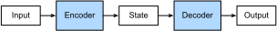

```{.python .input  n=1}
%load_ext d2lbook.tab
tab.interact_select('mxnet', 'pytorch', 'tensorflow', 'jax')
```

# The Encoder--Decoder Architecture
:label:`sec_encoder-decoder`

In general sequence-to-sequence problems
like machine translation
(:numref:`sec_machine_translation`),
inputs and outputs are of varying lengths
that are unaligned.
The standard approach to handling this sort of data
is to design an *encoder--decoder* architecture (:numref:`fig_encoder_decoder`)
consisting of two major components:
an *encoder* that takes a variable-length sequence as input,
and a *decoder* that acts as a conditional language model,
taking in the encoded input
and the leftwards context of the target sequence
and predicting the subsequent token in the target sequence.



:label:`fig_encoder_decoder`

Let's take machine translation from English to French as an example.
Given an input sequence in English:
"They", "are", "watching", ".",
this encoder--decoder architecture
first encodes the variable-length input into a state,
then decodes the state
to generate the translated sequence,
token by token, as output:
"Ils", "regardent", ".".
Since the encoder--decoder architecture
forms the basis of different sequence-to-sequence models
in subsequent sections,
this section will convert this architecture
into an interface that will be implemented later.

```{.python .input #encoder-decoder-the-encoder-decoder-architecture}
%%tab mxnet
from d2l import mxnet as d2l
from mxnet.gluon import nn
```

```{.python .input #encoder-decoder-the-encoder-decoder-architecture}
%%tab pytorch
from d2l import torch as d2l
from torch import nn
```

```{.python .input #encoder-decoder-the-encoder-decoder-architecture}
%%tab tensorflow
from d2l import tensorflow as d2l
import tensorflow as tf
```

```{.python .input #encoder-decoder-the-encoder-decoder-architecture}
%%tab jax
from d2l import jax as d2l
from flax import linen as nn
```

## Encoder

In the encoder interface,
we just specify that
the encoder takes variable-length sequences as input `X`.
The implementation will be provided
by any model that inherits this base `Encoder` class.

```{.python .input #encoder-decoder-encoder}
%%tab mxnet
class Encoder(nn.Block):  #@save
    """The base encoder interface for the encoder--decoder architecture."""
    def __init__(self):
        super().__init__()

    # Later there can be additional arguments (e.g., length excluding padding)
    def forward(self, X, *args):
        raise NotImplementedError
```

```{.python .input #encoder-decoder-encoder}
%%tab pytorch
class Encoder(nn.Module):  #@save
    """The base encoder interface for the encoder--decoder architecture."""
    def __init__(self):
        super().__init__()

    # Later there can be additional arguments (e.g., length excluding padding)
    def forward(self, X, *args):
        raise NotImplementedError
```

```{.python .input #encoder-decoder-encoder}
%%tab tensorflow
class Encoder(tf.keras.layers.Layer):  #@save
    """The base encoder interface for the encoder--decoder architecture."""
    def __init__(self):
        super().__init__()

    # Later there can be additional arguments (e.g., length excluding padding)
    def call(self, X, *args):
        raise NotImplementedError
```

```{.python .input #encoder-decoder-encoder}
%%tab jax
class Encoder(nn.Module):  #@save
    """The base encoder interface for the encoder--decoder architecture."""
    def setup(self):
        raise NotImplementedError

    # Later there can be additional arguments (e.g., length excluding padding)
    def __call__(self, X, *args):
        raise NotImplementedError
```

## Decoder

In the following decoder interface,
we add an additional `init_state` method
to convert the encoder output (`enc_all_outputs`)
into the encoded state.
Note that this step
may require extra inputs,
such as the valid length of the input,
which was explained
in :numref:`sec_machine_translation`.
To generate a variable-length sequence token by token,
every time the decoder may map an input
(e.g., the generated token at the previous time step)
and the encoded state
into an output token at the current time step.

```{.python .input #encoder-decoder-decoder}
%%tab mxnet
class Decoder(nn.Block):  #@save
    """The base decoder interface for the encoder--decoder architecture."""
    def __init__(self):
        super().__init__()

    # Later there can be additional arguments (e.g., length excluding padding)
    def init_state(self, enc_all_outputs, *args):
        raise NotImplementedError

    def forward(self, X, state):
        raise NotImplementedError
```

```{.python .input #encoder-decoder-decoder}
%%tab pytorch
class Decoder(nn.Module):  #@save
    """The base decoder interface for the encoder--decoder architecture."""
    def __init__(self):
        super().__init__()

    # Later there can be additional arguments (e.g., length excluding padding)
    def init_state(self, enc_all_outputs, *args):
        raise NotImplementedError

    def forward(self, X, state):
        raise NotImplementedError
```

```{.python .input #encoder-decoder-decoder}
%%tab tensorflow
class Decoder(tf.keras.layers.Layer):  #@save
    """The base decoder interface for the encoder--decoder architecture."""
    def __init__(self):
        super().__init__()

    # Later there can be additional arguments (e.g., length excluding padding)
    def init_state(self, enc_all_outputs, *args):
        raise NotImplementedError

    def call(self, X, state):
        raise NotImplementedError
```

```{.python .input #encoder-decoder-decoder}
%%tab jax
class Decoder(nn.Module):  #@save
    """The base decoder interface for the encoder--decoder architecture."""
    def setup(self):
        raise NotImplementedError

    # Later there can be additional arguments (e.g., length excluding padding)
    def init_state(self, enc_all_outputs, *args):
        raise NotImplementedError

    def __call__(self, X, state):
        raise NotImplementedError
```

## Putting the Encoder and Decoder Together

In the forward propagation,
the output of the encoder
is used to produce the encoded state,
and this state will be further used
by the decoder as one of its inputs.

```{.python .input #encoder-decoder-putting-the-encoder-and-decoder-together}
%%tab mxnet, pytorch
class EncoderDecoder(d2l.Classifier):  #@save
    """The base class for the encoder--decoder architecture."""
    def __init__(self, encoder, decoder):
        super().__init__()
        self.encoder = encoder
        self.decoder = decoder

    def forward(self, enc_X, dec_X, *args):
        enc_all_outputs = self.encoder(enc_X, *args)
        dec_state = self.decoder.init_state(enc_all_outputs, *args)
        # Return decoder output only
        return self.decoder(dec_X, dec_state)[0]
```

```{.python .input #encoder-decoder-putting-the-encoder-and-decoder-together}
%%tab tensorflow
class EncoderDecoder(d2l.Classifier):  #@save
    """The base class for the encoder--decoder architecture."""
    def __init__(self, encoder, decoder):
        super().__init__()
        self.encoder = encoder
        self.decoder = decoder

    def call(self, enc_X, dec_X, *args, training=None):
        enc_all_outputs = self.encoder(enc_X, *args, training=training)
        dec_state = self.decoder.init_state(enc_all_outputs, *args)
        # Return decoder output only
        return self.decoder(dec_X, dec_state, training=training)[0]
```

```{.python .input #encoder-decoder-putting-the-encoder-and-decoder-together}
%%tab jax
class EncoderDecoder(d2l.Classifier):  #@save
    """The base class for the encoder--decoder architecture."""
    encoder: nn.Module
    decoder: nn.Module

    def __call__(self, enc_X, dec_X, *args, training=False):
        enc_all_outputs = self.encoder(enc_X, *args, training=training)
        dec_state = self.decoder.init_state(enc_all_outputs, *args)
        # Return decoder output only
        return self.decoder(dec_X, dec_state, training=training)[0]
```

In the next section,
we will see how to apply RNNs to design
sequence-to-sequence models based on
this encoder--decoder architecture.


## Summary

Encoder-decoder architectures
can handle inputs and outputs
that both consist of variable-length sequences
and thus are suitable for sequence-to-sequence problems
such as machine translation.
The encoder takes a variable-length sequence as input
and transforms it into a state with a fixed shape.
The decoder maps the encoded state of a fixed shape
to a variable-length sequence.


## Exercises

1. Suppose that we use neural networks to implement the encoder--decoder architecture. Do the encoder and the decoder have to be the same type of neural network?
1. Besides machine translation, can you think of another application where the encoder--decoder architecture can be applied?

:begin_tab:`mxnet`
[Discussions](https://d2l.discourse.group/t/341)
:end_tab:

:begin_tab:`pytorch`
[Discussions](https://d2l.discourse.group/t/1061)
:end_tab:

:begin_tab:`tensorflow`
[Discussions](https://d2l.discourse.group/t/3864)
:end_tab:

:begin_tab:`jax`
[Discussions](https://d2l.discourse.group/t/18021)
:end_tab:

<!-- slides -->

::: {.slide title="Encoder-Decoder"}
Translation, summarization, dialogue — variable-length
input mapped to variable-length output, no positional
alignment between the two.

- **Encoder** reads the source sequence, compresses it
  into a state.
- **Decoder** reads that state plus target tokens so far,
  predicts the next target token.

The decoder is a *conditional* language model:
$P(y_t \mid y_{<t}, \text{enc}(x))$.
:::

::: {.slide title="The architecture"}
{width=78%}
:::

::: {.slide title="Setup"}
@encoder-decoder-the-encoder-decoder-architecture
:::

::: {.slide title="Encoder interface"}
One method: read a variable-length input. The downstream
implementation chooses the architecture (RNN now, Transformer
later):

@encoder-decoder-encoder
:::

::: {.slide title="Decoder interface"}
Two methods. `init_state` packs the encoder output into a
state object the decoder consumes; `forward` takes the next
input token plus the state and returns logits + updated state:

@encoder-decoder-decoder
:::

::: {.slide title="Wiring them together"}
`EncoderDecoder` runs the encoder once on the source, hands
its output to `init_state`, then drives the decoder with the
target tokens (teacher forcing during training):

@encoder-decoder-putting-the-encoder-and-decoder-together
:::

::: {.slide title="Recap"}
- Encoder–decoder splits seq2seq into two pieces with a
  state in between — fixed shape inside, variable lengths
  outside.
- The decoder is just a conditional language model: same
  $P(y_t \mid y_{<t}, \cdot)$ factorization, with the encoder
  output as extra context.
- Concrete implementations only override the encoder, the
  decoder, and how the encoder output becomes a state.
- Same scaffold will host RNN seq2seq, attention, and
  Transformers in the chapters ahead.
:::
