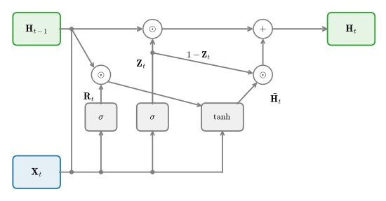
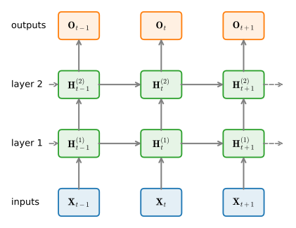
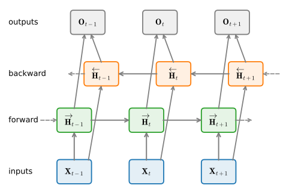
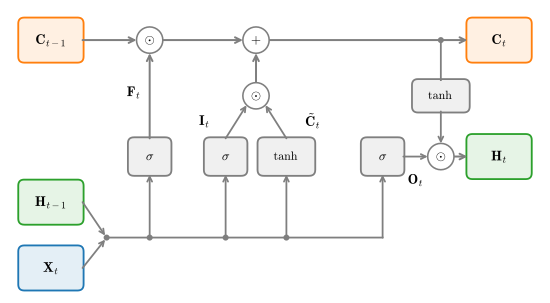

# Gated Recurrent Networks
:label:`sec_lstm`

:numref:`subsec_bptt-gradient-pathologies` ended with a diagnosis. The
gradient that travels $k$ steps back through a vanilla RNN is multiplied by
the $k$-th power of the recurrent Jacobian, so it shrinks or grows
geometrically; clipping tames the growth, but no amount of arithmetic can
restore a signal that has decayed into noise. The cure has to change the
dynamics of the recurrence itself. This section builds that cure:
*multiplicative gating*, a mechanism that lets the network learn what to
write into its memory, what to erase, and what to reveal. The analysis
behind it goes back to Hochreiter's 1991 diploma thesis and to
:citet:`bengio1994learning` (see also
:cite:`Hochreiter.Bengio.Frasconi.ea.2001`), and its most famous product is
the *long short-term memory* (LSTM) cell of
:citet:`Hochreiter.Schmidhuber.1997`, which powered speech recognition,
translation, and language modeling for most of the 2010s.

Gates are worth understanding in 2026 for a reason beyond history. The
architectures that displaced the LSTM kept its central trick: transformer
MLP blocks multiply one branch of activations by another, and the modern
linear recurrences we meet later in this chapter are, at heart, a forget
gate wrapped around a linear state. We develop the idea once, carefully,
here: first the gate itself, then the LSTM from scratch and with framework
layers, then the gated recurrent unit (GRU) as its streamlined descendant,
then two structural axes (depth and bidirectionality), and finally a look
at where gating lives today.

```{.python .input}
%load_ext d2lbook.tab
tab.interact_select('mxnet', 'pytorch', 'tensorflow', 'jax')
```

```{.python .input #lstm-gated-recurrent-networks}
%%tab mxnet
%matplotlib inline
from d2l import mxnet as d2l
import math
from mxnet import np, npx
from mxnet.gluon import rnn
npx.set_np()
```

```{.python .input #lstm-gated-recurrent-networks}
%%tab pytorch
%matplotlib inline
from d2l import torch as d2l
import math
import torch
from torch import nn
```

```{.python .input #lstm-gated-recurrent-networks}
%%tab tensorflow
%matplotlib inline
from d2l import tensorflow as d2l
import math
import tensorflow as tf
```

```{.python .input #lstm-gated-recurrent-networks}
%%tab jax
%matplotlib inline
from d2l import jax as d2l
from flax import nnx
import jax
from jax import numpy as jnp
import math
```

## Memory Needs a Controller

Start from what the gradient analysis demands. The contribution of a
dependency $k$ steps back scales as $\rho^k$, where $\rho$ is the spectral
radius of the state-to-state Jacobian, and the only value of $\rho$ that
neither buries nor explodes distant information is $1$. The simplest
recurrence with that property is an *accumulator*,

$$
\mathbf{S}_t = \mathbf{S}_{t-1} + (\textrm{new content}),
$$

whose Jacobian $\partial \mathbf{S}_t / \partial \mathbf{S}_{t-1}$ is
exactly the identity: gradients pass backwards through it unattenuated, no
matter how many steps they travel. Additive updates, not repeated matrix
multiplication, are the memory-friendly primitive.

But a pure accumulator is a terrible memory. It adds *everything*, forever:
irrelevant tokens pile onto relevant ones, the state grows without bound,
and there is no way to discard a fact once it has stopped mattering. A
useful memory must make decisions. Should this input be written down?
Should this stored value be kept or cleared? Should the memory influence
the output right now, or stay silent? What turns these discrete-sounding
decisions into something a network can learn is the *gate*: a small
sigmoid-activated layer of the current input and the previous state,

$$
\mathbf{G}_t = \sigma(\mathbf{X}_t \mathbf{W}_{\textrm{xg}} + \mathbf{H}_{t-1} \mathbf{W}_{\textrm{hg}} + \mathbf{b}_\textrm{g}),
$$
:eqlabel:`eq_gate`

whose entries lie in $(0, 1)$ and multiply a signal *elementwise*. A gate
value near $1$ lets its coordinate pass; a value near $0$ blocks it; values
in between attenuate. Because the gate is computed from context, the
decision is different at every time step and for every unit, and because
$\sigma$ is smooth, the decision is differentiable and trainable by the
same backpropagation as everything else. Every architecture in this section
is a particular arrangement of a few such gates around an additive state.

The gate also resolves the stability question of
:numref:`subsec_bptt-gradient-pathologies` in a satisfying way. A vanilla
RNN has one shared matrix $\mathbf{W}_{\textrm{hh}}$ whose spectrum decides
the fate of every perturbation in every direction at every step, and
training must keep that global object near the knife-edge $\rho = 1$ by
luck. In a gated cell, the state coordinate $i$ is scaled by the gate value
$g_{t,i} \in (0, 1)$ at step $t$, so a perturbation from $k$ steps ago is
scaled by the product $\prod_{j} g_{j,i} \leq 1$: growth is impossible
along the memory path, while holding the gate near $1$ makes the product,
and hence the preserved memory, as close to lossless as the task requires.
In dynamical-systems terms, each unit gets its own learned, input-dependent
rate of decay in place of one hard-wired global one. Some units learn to
forget in three steps; others hold a value across an entire sequence.

## Long Short-Term Memory

### The Memory Cell and Its Gates

The LSTM replaces the vanilla RNN's hidden node with a *memory cell*. The
name "long short-term memory" describes its role: a network's weights are
its long-term memory, changing slowly across training, while its
activations are short-term memory, overwritten at every step; the cell is
an intermediate store, an activation engineered to persist. Concretely,
the cell keeps an *internal state* $\mathbf{C}_t$, the additive accumulator
of the previous section, and controls it with three gates computed exactly
in the form of :eqref:`eq_gate`. With a minibatch of $n$ examples,
$d$-dimensional inputs $\mathbf{X}_t \in \mathbb{R}^{n \times d}$, and $h$
hidden units carrying the previous state
$\mathbf{H}_{t-1} \in \mathbb{R}^{n \times h}$, the *input gate*
$\mathbf{I}_t$, *forget gate* $\mathbf{F}_t$, and *output gate*
$\mathbf{O}_t$, each in $\mathbb{R}^{n \times h}$, are

$$
\begin{aligned}
\mathbf{I}_t &= \sigma(\mathbf{X}_t \mathbf{W}_{\textrm{xi}} + \mathbf{H}_{t-1} \mathbf{W}_{\textrm{hi}} + \mathbf{b}_\textrm{i}),\\
\mathbf{F}_t &= \sigma(\mathbf{X}_t \mathbf{W}_{\textrm{xf}} + \mathbf{H}_{t-1} \mathbf{W}_{\textrm{hf}} + \mathbf{b}_\textrm{f}),\\
\mathbf{O}_t &= \sigma(\mathbf{X}_t \mathbf{W}_{\textrm{xo}} + \mathbf{H}_{t-1} \mathbf{W}_{\textrm{ho}} + \mathbf{b}_\textrm{o}),
\end{aligned}
$$
:eqlabel:`lstm_gates`

where the $\mathbf{W}_{\textrm{x}\cdot} \in \mathbb{R}^{d \times h}$ and
$\mathbf{W}_{\textrm{h}\cdot} \in \mathbb{R}^{h \times h}$ are weights and
the $\mathbf{b}_\cdot \in \mathbb{R}^{1 \times h}$ are biases (broadcast
over the batch as in :numref:`subsec_broadcasting`). A fourth head, the
*input node*, proposes the content that might be written. It uses $\tanh$
rather than $\sigma$, since content should be able to be negative:

$$
\tilde{\mathbf{C}}_t = \tanh(\mathbf{X}_t \mathbf{W}_{\textrm{xc}} + \mathbf{H}_{t-1} \mathbf{W}_{\textrm{hc}} + \mathbf{b}_\textrm{c}).
$$
:eqlabel:`lstm_c_tilde`

The four heads are the same computation with different nonlinearities and
different jobs. What distinguishes the LSTM is how they combine. The forget
gate scales the old cell state, the input gate scales the proposed content,
and the two are *added*; the output gate then decides how much of the
(squashed) cell is exposed as the hidden state:

$$
\mathbf{C}_t = \mathbf{F}_t \odot \mathbf{C}_{t-1} + \mathbf{I}_t \odot \tilde{\mathbf{C}}_t,
\qquad
\mathbf{H}_t = \mathbf{O}_t \odot \tanh(\mathbf{C}_t),
$$
:eqlabel:`lstm_update`

where $\odot$ is the elementwise (Hadamard) product.
:numref:`fig_lstm_cell` traces the full data flow.


:label:`fig_lstm_cell`

Follow the top path of :numref:`fig_lstm_cell` from left to right. The cell
state is touched only by an elementwise product and an elementwise sum; no
matrix multiplication and no saturating nonlinearity stands between
$\mathbf{C}_{t-1}$ and $\mathbf{C}_t$. Its Jacobian is
$\partial \mathbf{C}_t / \partial \mathbf{C}_{t-1} =
\textrm{diag}(\mathbf{F}_t)$, so with the forget gate near $1$ and the
input gate near $0$ the cell holds its value, and the gradient holds with
it, across arbitrarily many steps. This protected additive path is the
*constant error carousel* that gives the LSTM its resistance to vanishing
gradients: it is precisely the controlled accumulator we asked for. The
output gate adds a subtler ability: a cell can accumulate evidence silently
for many steps ($\mathbf{O}_t \approx 0$), invisible to the layers above,
and release it at the moment it becomes relevant. Only $\mathbf{H}_t$ is
passed to output layers and to the next stacked layer; the cell state stays
internal to the cell.

### Implementation from Scratch

We now implement the cell, following the template of
:numref:`sec_rnn-scratch`: the cell class holds parameters and steps the
recurrence, and `d2l.RNNLMScratch` wraps it with an embedding and an output
head to form a language model. As there, `num_inputs` is the width of the
vectors the cell consumes at each step, which will be the embedding
dimension. Each of the four heads needs the same triple of parameters, so
we build them with a small factory.

```{.python .input #lstm-implementation-from-scratch-1}
%%tab pytorch
class LSTMScratch(d2l.Module):  #@save
    """The long short-term memory (LSTM) cell implemented from scratch."""
    def __init__(self, num_inputs, num_hiddens, sigma=0.01):
        super().__init__()
        self.save_hyperparameters()

        init_weight = lambda *shape: nn.Parameter(d2l.randn(*shape) * sigma)
        triple = lambda: (init_weight(num_inputs, num_hiddens),
                          init_weight(num_hiddens, num_hiddens),
                          nn.Parameter(d2l.zeros(num_hiddens)))
        self.W_xi, self.W_hi, self.b_i = triple()  # Input gate
        self.W_xf, self.W_hf, self.b_f = triple()  # Forget gate
        self.W_xo, self.W_ho, self.b_o = triple()  # Output gate
        self.W_xc, self.W_hc, self.b_c = triple()  # Input node
```

```{.python .input #lstm-implementation-from-scratch-1}
%%tab mxnet
class LSTMScratch(d2l.Module):  #@save
    """The long short-term memory (LSTM) cell implemented from scratch."""
    def __init__(self, num_inputs, num_hiddens, sigma=0.01):
        super().__init__()
        self.save_hyperparameters()

        init_weight = lambda *shape: d2l.randn(*shape) * sigma
        triple = lambda: (init_weight(num_inputs, num_hiddens),
                          init_weight(num_hiddens, num_hiddens),
                          d2l.zeros(num_hiddens))
        self.W_xi, self.W_hi, self.b_i = triple()  # Input gate
        self.W_xf, self.W_hf, self.b_f = triple()  # Forget gate
        self.W_xo, self.W_ho, self.b_o = triple()  # Output gate
        self.W_xc, self.W_hc, self.b_c = triple()  # Input node
```

```{.python .input #lstm-implementation-from-scratch-1}
%%tab tensorflow
class LSTMScratch(d2l.Module):  #@save
    """The long short-term memory (LSTM) cell implemented from scratch."""
    def __init__(self, num_inputs, num_hiddens, sigma=0.01):
        super().__init__()
        self.save_hyperparameters()

        init_weight = lambda *shape: tf.Variable(d2l.normal(shape) * sigma)
        triple = lambda: (init_weight(num_inputs, num_hiddens),
                          init_weight(num_hiddens, num_hiddens),
                          tf.Variable(d2l.zeros(num_hiddens)))
        self.W_xi, self.W_hi, self.b_i = triple()  # Input gate
        self.W_xf, self.W_hf, self.b_f = triple()  # Forget gate
        self.W_xo, self.W_ho, self.b_o = triple()  # Output gate
        self.W_xc, self.W_hc, self.b_c = triple()  # Input node
```

```{.python .input #lstm-implementation-from-scratch-1}
%%tab jax
class LSTMScratch(nnx.Module):  #@save
    """The long short-term memory (LSTM) cell implemented from scratch."""
    def __init__(self, num_inputs, num_hiddens, sigma=0.01, rngs=None):
        rngs = nnx.Rngs(0) if rngs is None else rngs
        self.num_inputs, self.num_hiddens = num_inputs, num_hiddens
        self.sigma = sigma
        init_weight = lambda shape: nnx.Param(
            rngs.params.normal(shape) * sigma)
        triple = lambda: (
            init_weight((num_inputs, num_hiddens)),
            init_weight((num_hiddens, num_hiddens)),
            nnx.Param(jnp.zeros(num_hiddens)))
        self.W_xi, self.W_hi, self.b_i = triple()  # Input gate
        self.W_xf, self.W_hf, self.b_f = triple()  # Forget gate
        self.W_xo, self.W_ho, self.b_o = triple()  # Output gate
        self.W_xc, self.W_hc, self.b_c = triple()  # Input node
```

The forward computation walks the time axis just as the vanilla cell did,
except that each step evaluates :eqref:`lstm_gates`, :eqref:`lstm_c_tilde`,
and :eqref:`lstm_update`, and the carried state is now the pair
$(\mathbf{H}, \mathbf{C})$.

:begin_tab:`jax`
The explicit Python loop of the other tabs is the readable teaching form,
but under JIT compilation it is unrolled into a graph that grows with the
sequence length, which for the LSTM's eight matrix products per step makes
compilation painfully slow. As promised in :numref:`sec_rnn-scratch`, we
switch to `jax.lax.scan`: it takes a step function, an initial carry, and
an array whose leading axis is scanned, and returns the final carry with
the stacked per-step outputs.
:end_tab:

```{.python .input #lstm-implementation-from-scratch-2}
%%tab pytorch
@d2l.add_to_class(LSTMScratch)  #@save
def forward(self, inputs, H_C=None):
    if H_C is None:
        # Initial state with shape: (batch_size, num_hiddens)
        H = d2l.zeros((inputs.shape[1], self.num_hiddens),
                      device=inputs.device)
        C = d2l.zeros((inputs.shape[1], self.num_hiddens),
                      device=inputs.device)
    else:
        H, C = H_C
    outputs = []
    for X in inputs:
        I = d2l.sigmoid(d2l.matmul(X, self.W_xi) +
                        d2l.matmul(H, self.W_hi) + self.b_i)
        F = d2l.sigmoid(d2l.matmul(X, self.W_xf) +
                        d2l.matmul(H, self.W_hf) + self.b_f)
        O = d2l.sigmoid(d2l.matmul(X, self.W_xo) +
                        d2l.matmul(H, self.W_ho) + self.b_o)
        C_tilde = d2l.tanh(d2l.matmul(X, self.W_xc) +
                           d2l.matmul(H, self.W_hc) + self.b_c)
        C = F * C + I * C_tilde
        H = O * d2l.tanh(C)
        outputs.append(H)
    return outputs, (H, C)
```

```{.python .input #lstm-implementation-from-scratch-2}
%%tab mxnet
@d2l.add_to_class(LSTMScratch)  #@save
def forward(self, inputs, H_C=None):
    if H_C is None:
        # Initial state with shape: (batch_size, num_hiddens)
        H = d2l.zeros((inputs.shape[1], self.num_hiddens),
                      ctx=inputs.ctx)
        C = d2l.zeros((inputs.shape[1], self.num_hiddens),
                      ctx=inputs.ctx)
    else:
        H, C = H_C
    outputs = []
    for X in inputs:
        I = d2l.sigmoid(d2l.matmul(X, self.W_xi) +
                        d2l.matmul(H, self.W_hi) + self.b_i)
        F = d2l.sigmoid(d2l.matmul(X, self.W_xf) +
                        d2l.matmul(H, self.W_hf) + self.b_f)
        O = d2l.sigmoid(d2l.matmul(X, self.W_xo) +
                        d2l.matmul(H, self.W_ho) + self.b_o)
        C_tilde = d2l.tanh(d2l.matmul(X, self.W_xc) +
                           d2l.matmul(H, self.W_hc) + self.b_c)
        C = F * C + I * C_tilde
        H = O * d2l.tanh(C)
        outputs.append(H)
    return outputs, (H, C)
```

```{.python .input #lstm-implementation-from-scratch-2}
%%tab tensorflow
@d2l.add_to_class(LSTMScratch)  #@save
def forward(self, inputs, H_C=None):
    if H_C is None:
        # Initial state with shape: (batch_size, num_hiddens)
        H = tf.zeros((tf.shape(inputs)[1], self.num_hiddens))
        C = tf.zeros((tf.shape(inputs)[1], self.num_hiddens))
    else:
        H, C = H_C
    outputs = []
    for X in tf.unstack(inputs):
        I = d2l.sigmoid(d2l.matmul(X, self.W_xi) +
                        d2l.matmul(H, self.W_hi) + self.b_i)
        F = d2l.sigmoid(d2l.matmul(X, self.W_xf) +
                        d2l.matmul(H, self.W_hf) + self.b_f)
        O = d2l.sigmoid(d2l.matmul(X, self.W_xo) +
                        d2l.matmul(H, self.W_ho) + self.b_o)
        C_tilde = d2l.tanh(d2l.matmul(X, self.W_xc) +
                           d2l.matmul(H, self.W_hc) + self.b_c)
        C = F * C + I * C_tilde
        H = O * d2l.tanh(C)
        outputs.append(H)
    return outputs, (H, C)
```

```{.python .input #lstm-implementation-from-scratch-2}
%%tab jax
@d2l.add_to_class(LSTMScratch)  #@save
def __call__(self, inputs, H_C=None):
    def scan_fn(H_C, X):
        H, C = H_C
        I = d2l.sigmoid(d2l.matmul(X, self.W_xi) +
                        d2l.matmul(H, self.W_hi) + self.b_i)
        F = d2l.sigmoid(d2l.matmul(X, self.W_xf) +
                        d2l.matmul(H, self.W_hf) + self.b_f)
        O = d2l.sigmoid(d2l.matmul(X, self.W_xo) +
                        d2l.matmul(H, self.W_ho) + self.b_o)
        C_tilde = d2l.tanh(d2l.matmul(X, self.W_xc) +
                           d2l.matmul(H, self.W_hc) + self.b_c)
        C = F * C + I * C_tilde
        H = O * d2l.tanh(C)
        return (H, C), H  # Return (carry, per-step output)

    if H_C is None:
        batch_size = inputs.shape[1]
        H_C = (jnp.zeros((batch_size, self.num_hiddens)),
               jnp.zeros((batch_size, self.num_hiddens)))
    H_C, outputs = jax.lax.scan(scan_fn, H_C, inputs)
    return outputs, H_C
```

A quick shape check confirms that the cell consumes a
(`num_steps`, `batch_size`, `num_inputs`) tensor and that both pieces of
state keep the (`batch_size`, `num_hiddens`) shape from step to step.

```{.python .input #lstm-implementation-from-scratch-3}
lstm = LSTMScratch(num_inputs=16, num_hiddens=32)
X = d2l.ones((9, 4, 16))  # (num_steps, batch_size, num_inputs)
outputs, (H, C) = lstm(X)
d2l.check_shape(outputs[-1], (4, 32))
d2l.check_shape(H, (4, 32))
d2l.check_shape(C, (4, 32))
```

### Training

Does the gated cell actually beat the vanilla RNN? To make the comparison
mean something we reuse the recipe of :numref:`sec_rnn-scratch` unchanged:
*The Time Machine* under the 1,024-token BPE tokenizer, 50,000 training
windows of 32 tokens, embedding dimension 64, 128 hidden units, ten epochs
with gradients clipped to norm 1.

```{.python .input #lstm-training-1}
data = d2l.TimeMachine(batch_size=1024, num_steps=32,
                       num_train=50000, num_val=5000)
```

The language-model scaffold from :numref:`sec_rnn-scratch` accepts the new
cell without modification, because the cell keeps the same interface:
embeddings in, per-step hidden states out. Only the recurrence changed.

```{.python .input #lstm-training-2}
%%tab pytorch, mxnet, jax
lstm = LSTMScratch(num_inputs=64, num_hiddens=128)
model = d2l.RNNLMScratch(lstm, vocab_size=len(data.vocab), lr=4)
```

```{.python .input #lstm-training-2}
%%tab tensorflow
with d2l.try_gpu():
    lstm = LSTMScratch(num_inputs=64, num_hiddens=128)
    model = d2l.RNNLMScratch(lstm, vocab_size=len(data.vocab), lr=4)
```

```{.python .input #lstm-training-3}
trainer = d2l.Trainer(max_epochs=10, gradient_clip_val=1, num_gpus=1)
model.board.yscale = 'log'
trainer.fit(model, data)
```

We will train several models in this section, so we wrap the perplexity
readout in a helper and start a small scoreboard.

```{.python .input #lstm-training-4}
%%tab pytorch, mxnet, tensorflow
def val_ppl(model):
    return float(model.board.data['val_ppl'][-1].y)

ppls = {'LSTM (scratch)': val_ppl(model)}
print(f"validation perplexity {ppls['LSTM (scratch)']:.1f}")
```

```{.python .input #lstm-training-4}
%%tab jax
def val_ppl(model):
    total_loss = num_tokens = 0
    for X_val, y_val in data.val_dataloader():
        losses = model.loss(model(X_val), y_val, averaged=False)
        total_loss += float(losses.sum())
        num_tokens += losses.size
    return math.exp(total_loss / num_tokens)

ppls = {'LSTM (scratch)': val_ppl(model)}
print(f"validation perplexity {ppls['LSTM (scratch)']:.1f}")
```

Under the identical recipe, the vanilla RNN of :numref:`sec_rnn-scratch`
reached a validation perplexity in the neighborhood of 90 to 110, and our
from-scratch LSTM lands in the same range. That may disappoint: where is
the payoff? Two things hold this run back, and both are worth
understanding. First, ten epochs is a short budget for a cell whose
recurrent core has four heads and $4h(d + h + 1)$ weights instead of
$h(d + h + 1)$: the curves are still moving when the budget ends, so the
model is undertrained rather than out of capacity. Second, our naive
initialization starts every gate half-open: with weights near zero,
$\sigma(0) = 0.5$, so the untrained forget gate halves the cell state at
every step, and the carousel only starts carrying once training pushes the
forget-gate biases up. Practitioners initialize
$\mathbf{b}_\textrm{f}$ to 1 for exactly this reason, and an exercise asks
you to try both remedies. Within this section's fixed budget, the payoff
of gating will show most clearly in the streamlined GRU below.

### Concise Implementation

Every framework ships an LSTM layer that fuses the cell and the time loop
into one optimized call; as :numref:`sec_rnn-scratch` measured for the
vanilla cell, the fused kernel is what you use for any model you train at
length, and for the LSTM the gap is larger because each hand-rolled step
launches eight matrix products. The `LSTM` class below keeps the interface
of `LSTMScratch` and adds a `num_layers` argument, which stacks recurrent
layers on top of one another; we use it later in this section and when we
build encoder-decoder models. As before, `num_inputs` is the width of the
per-step input vectors.

```{.python .input #lstm-concise-implementation-1}
%%tab pytorch
class LSTM(d2l.RNN):  #@save
    """The multilayer LSTM model implemented with high-level APIs."""
    def __init__(self, num_inputs, num_hiddens, num_layers=1, dropout=0):
        d2l.Module.__init__(self)
        self.save_hyperparameters()
        self.rnn = nn.LSTM(num_inputs, num_hiddens, num_layers,
                           dropout=dropout)

    def forward(self, inputs, H_C=None):
        return self.rnn(inputs, H_C)
```

```{.python .input #lstm-concise-implementation-1}
%%tab mxnet
class LSTM(d2l.RNN):  #@save
    """The multilayer LSTM model implemented with high-level APIs."""
    def __init__(self, num_inputs, num_hiddens, num_layers=1, dropout=0):
        d2l.Module.__init__(self)
        self.save_hyperparameters()
        self.rnn = rnn.LSTM(num_hiddens, num_layers, dropout=dropout)

    def forward(self, inputs, H_C=None):
        if H_C is None:
            H_C = self.rnn.begin_state(inputs.shape[1], ctx=inputs.ctx)
        return self.rnn(inputs, H_C)
```

```{.python .input #lstm-concise-implementation-1}
%%tab tensorflow
class LSTM(d2l.RNN):  #@save
    """The multilayer LSTM model implemented with high-level APIs."""
    def __init__(self, num_inputs, num_hiddens, num_layers=1, dropout=0):
        d2l.Module.__init__(self)
        self.save_hyperparameters()
        self.lstms = [tf.keras.layers.LSTM(
            num_hiddens, return_sequences=True, return_state=True,
            dropout=dropout) for _ in range(num_layers)]

    def forward(self, inputs, H_C=None):
        X = tf.transpose(inputs, perm=[1, 0, 2])  # To batch-major layout
        if H_C is None:
            H_C = [None] * self.num_layers
        new_H_C = []
        for lstm, state in zip(self.lstms, H_C):
            X, *state = lstm(X, initial_state=state)
            new_H_C.append(state)
        return tf.transpose(X, perm=[1, 0, 2]), new_H_C
```

```{.python .input #lstm-concise-implementation-1}
%%tab jax
class LSTM(d2l.RNN):  #@save
    """The multilayer LSTM model implemented with high-level APIs."""
    def __init__(self, num_inputs, num_hiddens, num_layers=1, dropout=0,
                 rngs=None):
        rngs = nnx.Rngs(params=0, dropout=1, carry=2) if rngs is None \
            else rngs
        self.num_inputs, self.num_hiddens = num_inputs, num_hiddens
        self.num_layers = num_layers
        self.rnns = nnx.List([
            nnx.RNN(nnx.LSTMCell(num_inputs if i == 0 else num_hiddens,
                                 num_hiddens, rngs=rngs),
                    time_major=True, return_carry=True, rngs=rngs)
            for i in range(num_layers)])
        self.dropouts = nnx.List([
            nnx.Dropout(dropout, rngs=rngs) for _ in range(num_layers - 1)])

    def __call__(self, inputs, H_C=None):
        outputs = inputs
        H_C = [None] * self.num_layers if H_C is None else H_C
        new_H_C = []
        for i, rnn in enumerate(self.rnns):
            carry, outputs = rnn(outputs, initial_carry=H_C[i])
            new_H_C.append(carry)
            if i < self.num_layers - 1:
                outputs = self.dropouts[i](outputs)
        return outputs, new_H_C
```

The concise language model `d2l.RNNLM` wraps it exactly as its scratch
counterpart did, and training is the same call with the same
hyperparameters.

```{.python .input #lstm-concise-implementation-2}
%%tab pytorch, mxnet, jax
lstm = LSTM(num_inputs=64, num_hiddens=128)
model = d2l.RNNLM(lstm, vocab_size=len(data.vocab), lr=4)
```

```{.python .input #lstm-concise-implementation-2}
%%tab tensorflow
with d2l.try_gpu():
    lstm = LSTM(num_inputs=64, num_hiddens=128)
    model = d2l.RNNLM(lstm, vocab_size=len(data.vocab), lr=4)
```

```{.python .input #lstm-concise-implementation-3}
trainer = d2l.Trainer(max_epochs=10, gradient_clip_val=1, num_gpus=1)
model.board.yscale = 'log'
trainer.fit(model, data)
```

The trained model reaches a somewhat better perplexity than our
from-scratch cell. The difference is not the arithmetic, which is
identical, but the starting point: framework cells ship initialization
schemes tuned over many years (orthogonal recurrent matrices; in Keras,
forget-gate biases set to 1) where our teaching code drew every weight
from the same small Gaussian. At a fixed training budget, how you start
matters.

```{.python .input #lstm-concise-implementation-4}
%%tab pytorch, mxnet
ppls['LSTM'] = val_ppl(model)
pred = model.predict('the time traveller', 30, data.tokenizer, d2l.try_gpu())
print(f"perplexity {ppls['LSTM']:.1f}, {pred!r}")
```

```{.python .input #lstm-concise-implementation-4}
%%tab tensorflow, jax
ppls['LSTM'] = val_ppl(model)
pred = model.predict('the time traveller', 30, data.tokenizer)
print(f"perplexity {ppls['LSTM']:.1f}, {pred!r}")
```

## Gated Recurrent Units
:label:`sec_gru`

As LSTMs spread through the 2010s, researchers looked for cheaper cells
that kept the two essential ingredients, an additive state path and
multiplicative gates. The most successful answer is the *gated recurrent
unit* (GRU) of :citet:`Cho.Van-Merrienboer.Bahdanau.ea.2014`: it drops the
separate cell state, letting the hidden state itself be the memory, and
merges four heads into three, often at no cost in quality
:cite:`Chung.Gulcehre.Cho.ea.2014`.

### Reset and Update Gates

The GRU computes two gates in the by-now-familiar form of
:eqref:`eq_gate`, a *reset gate* $\mathbf{R}_t$ and an *update gate*
$\mathbf{Z}_t$:

$$
\mathbf{R}_t = \sigma(\mathbf{X}_t \mathbf{W}_{\textrm{xr}} + \mathbf{H}_{t-1} \mathbf{W}_{\textrm{hr}} + \mathbf{b}_\textrm{r}),
\qquad
\mathbf{Z}_t = \sigma(\mathbf{X}_t \mathbf{W}_{\textrm{xz}} + \mathbf{H}_{t-1} \mathbf{W}_{\textrm{hz}} + \mathbf{b}_\textrm{z}).
$$
:eqlabel:`gru_gates`

The reset gate acts *inside* the candidate state: it filters how much of
the previous state may enter the vanilla-RNN-style proposal,

$$
\tilde{\mathbf{H}}_t = \tanh(\mathbf{X}_t \mathbf{W}_{\textrm{xh}} + \left(\mathbf{R}_t \odot \mathbf{H}_{t-1}\right) \mathbf{W}_{\textrm{hh}} + \mathbf{b}_\textrm{h}),
$$
:eqlabel:`gru_tilde_H`

so $\mathbf{R}_t \approx 1$ recovers the vanilla recurrence while
$\mathbf{R}_t \approx 0$ makes the proposal a function of the current input
alone, as if the sequence restarted. The update gate then blends old state
and proposal as a convex combination,

$$
\mathbf{H}_t = \mathbf{Z}_t \odot \mathbf{H}_{t-1} + (1 - \mathbf{Z}_t) \odot \tilde{\mathbf{H}}_t.
$$
:eqlabel:`gru_H`

Here the additive memory path is plain to see: wherever
$\mathbf{Z}_t \approx 1$ the new state is a copy of the old one and the
step is effectively skipped, giving the same near-identity Jacobian as the
LSTM's carousel; wherever $\mathbf{Z}_t \approx 0$ the state is overwritten
by the proposal. Because :eqref:`gru_H` is a convex combination of two
bounded quantities, the state stays bounded by construction, and the GRU
needs neither a separate protected accumulator nor an output squashing: one
vector serves as memory and output at once. The division of labor is that
reset gates capture short-range decisions (what to drop from the proposal)
and update gates capture long-range ones (how long to hold state).
:numref:`fig_gru_cell` shows the flow.


:label:`fig_gru_cell`

### Implementation and Comparison

After the LSTM, a from-scratch GRU offers no new idea, only one fewer
head, so we skip straight to the framework layer (an exercise asks you to
write the scratch version by editing `LSTMScratch`). The class mirrors
`LSTM`, including the `num_layers` argument; we will lean on it heavily
when the GRU becomes our encoder workhorse in the next section.

```{.python .input #lstm-implementation-and-comparison-1}
%%tab pytorch
class GRU(d2l.RNN):  #@save
    """The multilayer GRU model implemented with high-level APIs."""
    def __init__(self, num_inputs, num_hiddens, num_layers=1, dropout=0):
        d2l.Module.__init__(self)
        self.save_hyperparameters()
        self.rnn = nn.GRU(num_inputs, num_hiddens, num_layers,
                          dropout=dropout)
```

```{.python .input #lstm-implementation-and-comparison-1}
%%tab mxnet
class GRU(d2l.RNN):  #@save
    """The multilayer GRU model implemented with high-level APIs."""
    def __init__(self, num_inputs, num_hiddens, num_layers=1, dropout=0):
        d2l.Module.__init__(self)
        self.save_hyperparameters()
        self.rnn = rnn.GRU(num_hiddens, num_layers, dropout=dropout)
```

```{.python .input #lstm-implementation-and-comparison-1}
%%tab tensorflow
class GRU(d2l.RNN):  #@save
    """The multilayer GRU model implemented with high-level APIs."""
    def __init__(self, num_inputs, num_hiddens, num_layers=1, dropout=0):
        d2l.Module.__init__(self)
        self.save_hyperparameters()
        gru_cells = [tf.keras.layers.GRUCell(num_hiddens, dropout=dropout)
                     for _ in range(num_layers)]
        self.rnn = tf.keras.layers.RNN(gru_cells, return_sequences=True,
                                       return_state=True)

    def forward(self, X, state=None):
        outputs, *state = self.rnn(tf.transpose(X, perm=[1, 0, 2]), state)
        state = [s[0] if isinstance(s, list) else s for s in state]
        return tf.transpose(outputs, perm=[1, 0, 2]), state
```

```{.python .input #lstm-implementation-and-comparison-1}
%%tab jax
class GRU(d2l.RNN):  #@save
    """The multilayer GRU model implemented with high-level APIs."""
    def __init__(self, num_inputs, num_hiddens, num_layers=1, dropout=0,
                 rngs=None):
        rngs = nnx.Rngs(params=0, dropout=1, carry=2) if rngs is None \
            else rngs
        self.num_inputs, self.num_hiddens = num_inputs, num_hiddens
        self.num_layers = num_layers
        self.rnns = nnx.List([
            nnx.RNN(nnx.GRUCell(num_inputs if i == 0 else num_hiddens,
                                num_hiddens, rngs=rngs),
                    time_major=True, return_carry=True, rngs=rngs)
            for i in range(num_layers)])
        self.dropouts = nnx.List([
            nnx.Dropout(dropout, rngs=rngs) for _ in range(num_layers - 1)])

    def __call__(self, X, state=None):
        outputs = X
        state = [None] * self.num_layers if state is None else state
        new_state = []
        for i, rnn in enumerate(self.rnns):
            carry, outputs = rnn(outputs, initial_carry=state[i])
            new_state.append(carry)
            if i < self.num_layers - 1:
                outputs = self.dropouts[i](outputs)
        return outputs, new_state
```

One training run under the same recipe puts the GRU on our scoreboard.

```{.python .input #lstm-implementation-and-comparison-2}
%%tab pytorch, mxnet, jax
gru = GRU(num_inputs=64, num_hiddens=128)
model = d2l.RNNLM(gru, vocab_size=len(data.vocab), lr=4)
```

```{.python .input #lstm-implementation-and-comparison-2}
%%tab tensorflow
with d2l.try_gpu():
    gru = GRU(num_inputs=64, num_hiddens=128)
    model = d2l.RNNLM(gru, vocab_size=len(data.vocab), lr=4)
```

```{.python .input #lstm-implementation-and-comparison-3}
trainer = d2l.Trainer(max_epochs=10, gradient_clip_val=1, num_gpus=1)
model.board.yscale = 'log'
trainer.fit(model, data)
```

```{.python .input #lstm-implementation-and-comparison-4}
ppls['GRU'] = val_ppl(model)
print(f"validation perplexity {ppls['GRU']:.1f}")
```

At the same width the GRU's recurrent core has $3h(d + h + 1)$ weights to
the LSTM's $4h(d + h + 1)$ and computes three matmul heads per step
instead of four, yet in our runs it posts the best perplexity of the
section, clearly ahead of the vanilla RNN and ahead of the LSTM at this
budget. The advantage is convergence speed, not capacity: with fewer gates
to coordinate and a state that the convex blend keeps well scaled from the
first epoch, the GRU makes good use of a short schedule. This mirrors the
early empirical comparisons :cite:`Chung.Gulcehre.Cho.ea.2014`, which
found the GRU at least the LSTM's equal on small and mid-sized tasks; with
longer training and careful initialization the LSTM closes the gap (see
the exercises).

The GRU also earns a place in this book for where it led. Look again at
:eqref:`gru_H`: the *only* nonlinearity standing between
$\mathbf{H}_{t-1}$ and $\mathbf{H}_t$ enters through
$\tilde{\mathbf{H}}_t$ and the gates. If one makes the gates functions of
the input alone and lets the candidate ignore the previous state, the
update becomes *linear* in $\mathbf{H}_{t-1}$, and a linear recurrence can
be trained in parallel across the whole sequence rather than step by step.
That observation, worked out later in this chapter, is the seed of minimal
gated cells such as minGRU :cite:`Feng.Tung.Ahmed.ea.2024`, of linear
recurrent units :cite:`Orvieto.Smith.Gu.ea.2023`, and of the state space
models that now appear inside production language models. The GRU is not
just a smaller LSTM; it is the halfway point to the linear recurrences that
follow.

## Depth and Direction

Gating changes what happens *inside* a cell. Two further design axes leave
the cell alone and change how cells are wired together: stacking them in
layers, and running them in both temporal directions.

### Deep Recurrent Networks
:label:`sec_deep_rnn`

A single recurrent layer is already deep in time: an input can influence an
output hundreds of steps later. Within one time step, though, input and
output are separated by just one nonlinearity, and some structure (say,
composing "characters into words" with "words into syntax") is more
naturally expressed by composing *functions* than by widening one layer. A
deep RNN stacks recurrent layers so that the sequence of hidden states
produced by layer $l-1$ is the input sequence of layer $l$. Writing
$\mathbf{H}_t^{(0)} = \mathbf{X}_t$ for the input, the hidden state of
layer $l$ with cell function $\phi_l$ is

$$
\mathbf{H}_t^{(l)} = \phi_l(\mathbf{H}_t^{(l-1)}, \mathbf{H}_{t-1}^{(l)}),
$$
:eqlabel:`eq_deep_rnn_H`

so each cell sees two contexts: the layer below at the same time step and
its own layer at the previous step, as :numref:`fig_deep_rnn` shows. The
output layer reads only the top layer's state, and $\phi_l$ can be a
vanilla, LSTM, or GRU cell; only the wiring is new.


:label:`fig_deep_rnn`

Depth compounds the optimization difficulties of recurrence: gradients now
traverse a product of Jacobians in the layer direction on top of the one in
the time direction. Gated cells handle time; for the layer direction,
practitioners reach for the same remedy as in deep feedforward networks,
namely residual connections between layers (:numref:`sec_resnet`), plus
dropout between layers as the standard regularizer. Stacks beyond four to
eight layers rarely paid off for recurrent models. Since our `LSTM` class
already accepts `num_layers`, trying a two-layer model is a one-argument
change.

```{.python .input #lstm-deep-recurrent-networks-1}
%%tab pytorch, mxnet, jax
lstm2 = LSTM(num_inputs=64, num_hiddens=128, num_layers=2)
model = d2l.RNNLM(lstm2, vocab_size=len(data.vocab), lr=4)
```

```{.python .input #lstm-deep-recurrent-networks-1}
%%tab tensorflow
with d2l.try_gpu():
    lstm2 = LSTM(num_inputs=64, num_hiddens=128, num_layers=2)
    model = d2l.RNNLM(lstm2, vocab_size=len(data.vocab), lr=4)
```

```{.python .input #lstm-deep-recurrent-networks-2}
trainer = d2l.Trainer(max_epochs=10, gradient_clip_val=1, num_gpus=1)
model.board.yscale = 'log'
trainer.fit(model, data)
```

```{.python .input #lstm-deep-recurrent-networks-3}
ppls['LSTM (2 layers)'] = val_ppl(model)
print(f'{"model":>16} {"val ppl":>8}')
for name, p in ppls.items():
    print(f'{name:>16} {p:>8.1f}')
```

The scoreboard is honest rather than triumphant. The GRU beats the vanilla
RNN of :numref:`sec_rnn-scratch` decisively at the same recipe; the
single-layer LSTM roughly matches the vanilla model within this short
budget, for the initialization and budget reasons discussed above; and the
second layer does not pay at all, adding optimization difficulty and
capacity that a corpus this small cannot fill. Depth pays on large
corpora; knowing when it will not is part of the craft.

### Bidirectional Recurrent Networks
:label:`sec_bi_rnn`

Everything so far reads the sequence left to right, which is forced for
language modeling: a model that predicts the next token may only condition
on the past. But many sequence tasks *analyze* a complete, given sequence
rather than extend it, and for those the future context is both available
and informative. Consider filling in a blank:

* I am `___`.
* I am `___` hungry.
* I am `___` hungry, and I can eat half a pig.

"Happy" fits the first blank, "not" or "very" the second, but only "very"
the third: the right context decides. A part-of-speech tagger faces the
same situation at every token.

A *bidirectional RNN* :cite:`Schuster.Paliwal.1997` exploits this with two
independent recurrent layers over the same input, one running forward, one
backward:

$$
\begin{aligned}
\overrightarrow{\mathbf{H}}_t &= \phi(\mathbf{X}_t \mathbf{W}_{\textrm{xh}}^{(f)} + \overrightarrow{\mathbf{H}}_{t-1} \mathbf{W}_{\textrm{hh}}^{(f)} + \mathbf{b}_\textrm{h}^{(f)}),\\
\overleftarrow{\mathbf{H}}_t &= \phi(\mathbf{X}_t \mathbf{W}_{\textrm{xh}}^{(b)} + \overleftarrow{\mathbf{H}}_{t+1} \mathbf{W}_{\textrm{hh}}^{(b)} + \mathbf{b}_\textrm{h}^{(b)}),
\end{aligned}
$$

and the per-step output is the concatenation
$\mathbf{H}_t = [\overrightarrow{\mathbf{H}}_t, \overleftarrow{\mathbf{H}}_t]
\in \mathbb{R}^{n \times 2h}$, which conditions on the entire sequence in
both directions (:numref:`fig_birnn`). The two directions double compute
and parameters, and the layer is only defined once the whole input is in
hand.


:label:`fig_birnn`

In frameworks this is a flag or a wrapper on the recurrent layer, and a
shape check shows exactly what changed: the per-step output width doubles
to $2h$.

```{.python .input #lstm-bidirectional-recurrent-networks}
%%tab pytorch
birnn = nn.LSTM(64, 128, bidirectional=True)
X = d2l.randn(32, 8, 64)  # (num_steps, batch_size, num_inputs)
outputs, (H, C) = birnn(X)
outputs.shape, H.shape
```

```{.python .input #lstm-bidirectional-recurrent-networks}
%%tab mxnet
birnn = rnn.LSTM(128, bidirectional=True)
birnn.initialize()
X = d2l.randn(32, 8, 64)  # (num_steps, batch_size, num_inputs)
outputs = birnn(X)
outputs.shape
```

```{.python .input #lstm-bidirectional-recurrent-networks}
%%tab tensorflow
birnn = tf.keras.layers.Bidirectional(
    tf.keras.layers.LSTM(128, return_sequences=True))
X = d2l.normal((8, 32, 64))  # Keras is batch-major: (batch, steps, inputs)
outputs = birnn(X)
outputs.shape
```

```{.python .input #lstm-bidirectional-recurrent-networks}
%%tab jax
birnn = nnx.Bidirectional(
    nnx.RNN(nnx.LSTMCell(64, 128, rngs=nnx.Rngs(0)),
            time_major=True, rngs=nnx.Rngs(0)),
    nnx.RNN(nnx.LSTMCell(64, 128, rngs=nnx.Rngs(1)), time_major=True,
            reverse=True, keep_order=True, rngs=nnx.Rngs(1)),
    time_major=True)
X = jax.random.normal(d2l.get_key(), (32, 8, 64))
outputs = birnn(X)
outputs.shape
```

One warning matters more than the mechanics: **a bidirectional network is
an encoder, not a generator**. Because every $\mathbf{H}_t$ already
conditions on tokens after $t$, the model cannot be run autoregressively;
at generation time the future it expects does not exist yet. Worse,
training one to "predict the next token" is an exercise in self-deception:
the backward pass hands the network the very token it is being asked to
predict, training loss becomes spectacularly low, and the model is useless
at inference. This misuse was a common and expensive mistake in the RNN
era. Use bidirectional layers where the full input is given up front and
per-position representations are wanted: tagging, span labeling, and
encoding. Their most consequential success was ELMo
:cite:`Peters.Neumann.Iyyer.ea.2018`, which trained deep bidirectional
LSTMs (see also :cite:`Graves.Schmidhuber.2005`) to produce contextual word
embeddings; its role, and the entire encode-both-directions idea, passed to
the bidirectional attention of BERT :cite:`Devlin.Chang.Lee.ea.2018`, which
we study in the pretraining chapters.

## Gates beyond Recurrent Networks

The cells above are, by the standards of this book's later chapters, old
technology. The gate is not. Once you know its shape, a sigmoid (or other
bounded) branch elementwise-multiplying a signal branch, you will find it
across modern deep learning, doing the same job of content-dependent
routing that it does inside the LSTM.

Highway networks :cite:`srivastava2015highway` applied the LSTM's gating
to *depth*: a transform gate blends each layer's output with its
unmodified input, letting very deep feedforward networks train years
before normalization made it routine, and prefiguring the residual
connections of :numref:`sec_resnet`. Transformer blocks carry gates in
their MLPs: the gated linear unit family, whose SwiGLU variant
:cite:`Shazeer.2020` computes
$\textrm{Swish}(\mathbf{x}\mathbf{W}_1) \odot \mathbf{x}\mathbf{W}_2$ and
is the standard MLP in most contemporary open language models. And the
recurrence story of this chapter continues the pattern most directly: the
selective state space model Mamba :cite:`Gu.Dao.2023` modulates a linear
state with an input-dependent step size $\Delta_t$ that plays precisely
the role of a forget gate; Griffin :cite:`De.Smith.Fernando.ea.2024` builds
production-scale hybrids from gated linear recurrences; and xLSTM
:cite:`Beck.Poppel.Spanring.ea.2024` revisits the LSTM itself with
exponential gates and a matrix cell. One idea, many wardrobes:

| Where | The gate | What it controls |
| :-- | :-- | :-- |
| LSTM (1997) | forget gate $\mathbf{F}_t$ | decay of the cell state $\mathbf{C}_t$ |
| GRU (2014) | update gate $\mathbf{Z}_t$ | copy-vs-overwrite blend of $\mathbf{H}_t$ |
| Highway nets (2015) | transform gate | skip-vs-transform blend across depth |
| GLU, SwiGLU MLPs | activation branch | which channels pass through the MLP |
| Mamba (2023) | step size $\Delta_t$ | decay of a linear state, from input only |
| Griffin, xLSTM (2024) | recurrence gates | decay and input scaling of linear cells |

The last three rows share a further twist that the next sections develop:
their gates depend on the *input only*, not on the state. Give up
state-dependent gating and the recurrence becomes linear, which unlocks
parallel training across the sequence while keeping the learned-forgetting
behavior that made the LSTM work. Before we take that step, the next
section puts the gated cells we just built to work on their signature
application, sequence-to-sequence learning, whose fixed-size-state
bottleneck will sharpen the questions the rest of the chapter answers.

## Summary

Vanishing gradients are an architectural problem, and gating is the
architectural answer: keep an additive state path whose Jacobian stays
near the identity, and control reads, writes, and erasures with learned
sigmoid gates that multiply elementwise. The LSTM realizes this with a
protected cell state and three gates; its cell update
$\mathbf{C}_t = \mathbf{F}_t \odot \mathbf{C}_{t-1} + \mathbf{I}_t \odot
\tilde{\mathbf{C}}_t$ is the constant error carousel that lets both
information and gradients cross long horizons. The GRU reaches nearly the
same behavior with two gates and no separate cell, at three quarters of
the recurrent parameters. On an identical short training recipe the GRU
clearly outperforms the vanilla RNN from :numref:`sec_rnn-scratch`, while
the LSTM needs a longer budget or a friendlier initialization before its
extra machinery pays: architecture and optimization cannot be judged
separately. Depth
(stacked layers) and bidirectionality (a backward pass concatenated to the
forward one) are orthogonal wiring choices; the latter yields encoders,
never generators. The gate itself outlived these architectures: it routes
channels in transformer MLPs and, made input-dependent only, powers the
linear recurrences and state space models that the rest of this chapter
builds toward.

## Exercises

1. Adjust the hyperparameters (width, embedding dimension, learning rate,
   number of epochs) and study their effect on training time and
   perplexity. How far below the section's result can you push the LSTM at
   this data budget?
1. Ablate the forget gate: modify `LSTMScratch` so that
   $\mathbf{F}_t = 1$ always (the original 1997 design, which lacked a
   forget gate). Retrain with the section's recipe and report the
   perplexity. Explain the result using :eqref:`lstm_update`: what happens
   to the cell state over a 32-step window when nothing is ever erased?
1. Initialize the forget-gate bias $\mathbf{b}_\textrm{f}$ to 1 instead of
   0 in `LSTMScratch` and retrain. Why does starting from
   $\mathbf{F}_t \approx 0.73$ rather than $0.5$ help at short training
   budgets? Then double the number of epochs: does the LSTM now match or
   beat the section's GRU?
1. Parameter-matched comparison: compute the number of recurrent-core
   parameters of the LSTM at $h = 128$ and find the GRU width $h'$ with
   approximately the same count. Train that GRU and compare perplexities.
   Does the GRU's advantage survive the handicap being removed?
1. Compare the per-step computational cost of vanilla RNN, GRU, and LSTM
   cells for a given $d$ and $h$, counting matrix products. How do
   training cost and single-token inference cost differ?
1. The cell state is already squashed once in :eqref:`lstm_c_tilde`. Why
   does :eqref:`lstm_update` apply $\tanh$ to $\mathbf{C}_t$ again before
   the output gate, rather than using $\mathbf{O}_t \odot \mathbf{C}_t$?
   What could go wrong after many steps of accumulation without it?
1. Implement a GRU variant with only a reset gate, and one with only an
   update gate. Which one still trains well on this section's task, and
   why would you expect that from :eqref:`gru_H`?
1. Suppose the input at step $t'$ must determine the output at a much
   later step $t$. For each gate of the GRU (and of the LSTM), state the
   ideal values in the interval from $t'$ to $t$.
1. Sweep `num_layers` from 1 to 4 for the concise LSTM. Report perplexity
   and wall-clock time per configuration. At what depth does this corpus
   stop rewarding extra layers, and what would you change to make depth
   pay?
1. Why can a bidirectional RNN not be used for language modeling or any
   other autoregressive generation? Argue from the factorization
   $P(x_1, \ldots, x_T) = \prod_t P(x_t \mid x_{<t})$, then describe what
   concretely goes wrong at sampling time if you try.

:begin_tab:`mxnet`
[Discussions](https://d2l.discourse.group/t/343)
:end_tab:

:begin_tab:`pytorch`
[Discussions](https://d2l.discourse.group/t/1057)
:end_tab:

:begin_tab:`tensorflow`
[Discussions](https://d2l.discourse.group/t/3861)
:end_tab:

:begin_tab:`jax`
[Discussions](https://d2l.discourse.group/t/18016)
:end_tab:

<!-- slides -->

::: {.slide title="Gated Recurrent Networks"}
BPTT's verdict: the gradient $k$ steps back scales as $\rho^k$:
vanishing or exploding. Clipping fixes explosion; **vanishing needs
architecture**.

The fix that stuck: *multiplicative gating* (Hochreiter &
Schmidhuber, 1997).

- **LSTM**: a protected memory cell + three learned gates.
- **GRU**: the streamlined two-gate version.
- Depth and bidirectionality as orthogonal wiring axes.
- The same gate primitive lives on in SwiGLU MLPs, Mamba, Griffin,
  xLSTM.
:::

::: {.slide title="The gate"}
The only recurrence whose Jacobian is exactly the identity is an
**accumulator**: $\mathbf{S}_t = \mathbf{S}_{t-1} + (\textrm{new})$.
But it never forgets. Memory needs *decisions*: write? clear? reveal?

Make the decision differentiable:

$$\mathbf{G}_t = \sigma(\mathbf{X}_t \mathbf{W}_{xg} + \mathbf{H}_{t-1} \mathbf{W}_{hg} + \mathbf{b}_g) \in (0,1)^h,$$

used as an **elementwise multiplier**: 1 = pass, 0 = block.

- Learned, context-dependent, per unit and per step.
- Along the gated path a perturbation scales by $\prod_j g_{j}\leq 1$:
  no explosion, and $g \approx 1$ preserves memory losslessly.
:::

::: {.slide title="The LSTM memory cell"}
{width=92%}
:::

::: {.slide title="LSTM equations"}
Three sigmoid gates plus a $\tanh$ input node, same algebra four
times:

$$\mathbf{I}_t, \mathbf{F}_t, \mathbf{O}_t = \sigma(\mathbf{X}_t \mathbf{W}_{x\cdot} + \mathbf{H}_{t-1} \mathbf{W}_{h\cdot} + \mathbf{b}),\quad \tilde{\mathbf{C}}_t = \tanh(\cdots).$$

The update that matters:

$$\mathbf{C}_t = \mathbf{F}_t \odot \mathbf{C}_{t-1} + \mathbf{I}_t \odot \tilde{\mathbf{C}}_t,\qquad \mathbf{H}_t = \mathbf{O}_t \odot \tanh(\mathbf{C}_t).$$

- $\partial \mathbf{C}_t/\partial \mathbf{C}_{t-1} = \textrm{diag}(\mathbf{F}_t)$:
  hold $\mathbf{F} \approx 1$, $\mathbf{I} \approx 0$ and the cell (and its
  gradient) survives: the **constant error carousel**.
- $\mathbf{O}_t$ lets a cell accumulate silently, then reveal.
:::

::: {.slide title="From scratch: parameters"}
Four heads, one `triple()` factory each; `num_inputs` is the
embedding dimension:

@lstm-implementation-from-scratch-1
:::

::: {.slide title="Forward pass"}
Walk the sequence, carry $(\mathbf{H}, \mathbf{C})$:

@lstm-implementation-from-scratch-2

. . .

@lstm-implementation-from-scratch-3
:::

::: {.slide title="Training on The Time Machine"}
Same recipe as the vanilla RNN (50k windows of 32 BPE tokens,
batch 1024, emb 64, hidden 128, 10 epochs, clip 1), so the numbers
are directly comparable:

@lstm-training-1

. . .

@lstm-training-2

. . .

@lstm-training-3
:::

::: {.slide title="Reading the result"}
@lstm-training-4

. . .

Vanilla RNN under the identical recipe: val ppl ~90–110. The
scratch LSTM only *matches* it. Why:

- 10 epochs is short for $4h(d{+}h{+}1)$ recurrent weights
  (vs. $h(d{+}h{+}1)$); the curves are still moving.
- Naive init leaves every gate half-open: $\sigma(0)=0.5$ halves
  the cell each step until the biases move. Fix: $\mathbf{b}_f = 1$
  (exercise).
:::

::: {.slide title="Concise: the fused layer"}
Eight matmuls per step make the fused kernel matter even more than
for the vanilla RNN. Same interface, plus `num_layers`:

@lstm-concise-implementation-1
:::

::: {.slide title="Train and generate"}
@lstm-concise-implementation-2

@lstm-concise-implementation-3

. . .

@lstm-concise-implementation-4
:::

::: {.slide title="GRU: two gates, no cell"}
Cho et al. (2014): drop the separate cell state, merge to two gates.

$$\tilde{\mathbf{H}}_t = \tanh(\mathbf{X}_t \mathbf{W}_{xh} + (\mathbf{R}_t \odot \mathbf{H}_{t-1}) \mathbf{W}_{hh} + \mathbf{b}_h),$$
$$\mathbf{H}_t = \mathbf{Z}_t \odot \mathbf{H}_{t-1} + (1 - \mathbf{Z}_t) \odot \tilde{\mathbf{H}}_t.$$

{width=76%}
:::

::: {.slide title="GRU in code"}
@lstm-implementation-and-comparison-1

. . .

@lstm-implementation-and-comparison-2

@lstm-implementation-and-comparison-3

@lstm-implementation-and-comparison-4

Three quarters of the LSTM's recurrent parameters and the best
perplexity in this section's runs: fewer gates converge faster on a
short budget. Its 2020s legacy: strip the gates to input-only
functions and the recurrence turns **linear** → minGRU, LRU, SSMs.
:::

::: {.slide title="Deep RNNs"}
Layer $l$ reads layer $l{-}1$ at the same step and itself at the
previous step; a one-argument change with `num_layers`:

{width=62%}

. . .

@lstm-deep-recurrent-networks-1

@lstm-deep-recurrent-networks-3
:::

::: {.slide title="Bidirectional RNNs"}
Two chains, one forward and one backward, concatenated per step,
so every output conditions on the *whole* sequence:

{width=68%}

. . .

@lstm-bidirectional-recurrent-networks

**Encoder, not generator**: at sampling time the future does not
exist; "next-token training" hands the model the answer. Use for
tagging/encoding (ELMo → BERT), never for LM.
:::

::: {.slide title="Gates everywhere"}
| Where | The gate | Controls |
| :-- | :-- | :-- |
| LSTM | forget $\mathbf{F}_t$ | cell-state decay |
| GRU | update $\mathbf{Z}_t$ | copy vs. overwrite |
| Highway nets | transform gate | depth routing |
| GLU/SwiGLU MLPs | $\sigma$/Swish branch | channel selection |
| Mamba | step size $\Delta_t$ | linear-state decay |
| Griffin / xLSTM | recurrence gates | linear-cell decay |

Bottom three: gates from the **input only** → linear recurrence →
parallel training. That is where this chapter goes next.
:::

::: {.slide title="Recap"}
- Vanishing gradients are architectural; the cure is an **additive
  state path** plus learned multiplicative gates.
- LSTM: $\mathbf{C}_t = \mathbf{F}_t \odot \mathbf{C}_{t-1} + \mathbf{I}_t \odot \tilde{\mathbf{C}}_t$
  is the constant error carousel.
- GRU: two gates, convex blend, cheaper, and the section's best
  perplexity: it beats the vanilla RNN decisively.
- The LSTM needs budget and init care before its machinery pays:
  architecture and optimization are judged together.
- Depth = stacked cells; bidirectional = encoder-only.
- The gate outlived the RNN: SwiGLU, Mamba's $\Delta_t$, Griffin,
  xLSTM.
:::
