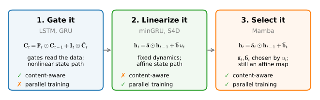
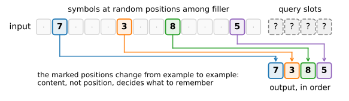
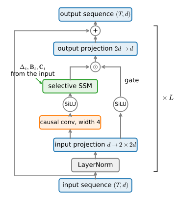

# Selective State Space Models
:label:`sec_mamba`

The previous section ended on a confession. Everything we gained by
linearizing the recurrence, parallel training by scan, stability by
construction, provably good memory, came at the price of *time invariance*:
the S4D applies the same dynamics at every step, so what it remembers is
decided before it ever sees the input. Its convolution kernel weights the
past by *position*, never by *content*. The gated cells of
:numref:`sec_lstm` had the opposite profile: their forget gates read the
data as it streamed past and decided, token by token, what deserved space
in the state, but their nonlinear recurrence trained sequentially. This
section closes the loop. We make the step size, and with it the dynamics,
a *function of the input*, following :citet:`Gu.Dao.2023`, and discover
that this one change re-derives the forget gate a third time while keeping
the parallel scan. The result, packaged into a residual block called
*Mamba*, brought selective recurrence into competitive language-model
scaling in 2023: S4 had already beaten every transformer of its day on
long-range classification benchmarks (:numref:`subsec_hippo`), but
language modeling itself had remained attention's territory since the
transformer displaced the LSTM. Mamba also sharpens a question that the
rest of this chapter pursues: a selective state space model decides,
token by token, what to keep, and attention (:numref:`chap_attention`)
decides, query by query, what to retrieve. How deep does that
resemblance run? Deeper than it has any right to, as the next section
shows.

*Prerequisites: the associative scan and the S4D layer of
:numref:`sec_ssm` (:numref:`subsec_parallel-scans`,
:numref:`subsec_s4d`); the LSTM of :numref:`sec_lstm`; the
language-model harness and decoding utilities of
:numref:`sec_rnn-scratch` and :numref:`sec_decoding`.*

```{.python .input #mamba-selective-state-space-models-1}
%%tab pytorch
%matplotlib inline
from d2l import torch as d2l
import math
import numpy as np
import time
import torch
from torch import nn
from torch.nn import functional as F
```

```{.python .input #mamba-selective-state-space-models-1}
%%tab jax
%matplotlib inline
from d2l import jax as d2l
from flax import nnx
import jax
from jax import numpy as jnp
import math
import numpy as np
import optax
import time
```

Everything in this section is built on the associative scan of
:numref:`subsec_parallel-scans`, which evaluates the affine recurrence
$\mathbf{h}_t = \mathbf{a}_t \odot \mathbf{h}_{t-1} + \mathbf{b}_t$ in
logarithmic depth.

That section saved the scan in the `d2l` library, so we simply pick it
back up.

```{.python .input #mamba-selective-state-space-models-2}
%%tab pytorch, jax
associative_scan = d2l.associative_scan  # Saved in the previous section
```

## The Selectivity Problem
:label:`subsec_selectivity`

What does it mean, concretely, for a model to be content-blind? The LTI
convolution view :eqref:`eq_ssm_kernel` makes it precise: an S4D's output
is $y_t = \sum_k \bar{K}_k u_{t-k}$, and the kernel $\bar{\mathbf{K}}$ is
computed from the model's parameters alone. Whether the token ten steps
ago was the key fact of the paragraph or a comma, its influence on the
present is the same fixed number $\bar{K}_{10}$. A gated RNN would consult
its input before deciding; the LTI system cannot, because *deciding based
on the input* is exactly the time-variance it gave up.

### A Task That Defeats Time Invariance

To turn this from an observation into a measurement we borrow the
*selective copying* task that :citet:`Gu.Dao.2023` used to motivate
selectivity (:numref:`fig_selective_copy`). Each input is a long stretch
of filler tokens in which a few *marked* symbols are scattered at random
positions; after the sequence, the model is prompted with query slots and
must reproduce the marked symbols, in order, ignoring everything else. A
solution has to do two content-dependent things: store a token *because
it is a symbol rather than filler*, and keep count of how many symbols it
has seen so far. Neither is expressible with position-based weights: the
same positions hold noise in one example and payload in the next.


:label:`fig_selective_copy`

This toy is not idle. Its language-scale counterpart is *associative
recall*: retrieving a value mentioned pages ago the next time its key
appears ("Mrs. Watchett ... later: Mrs. ___"). We have met the circuit
that does this: it is the induction head of
:numref:`sec_what-attention-computes`, which we built and watched form
during training, and :citet:`Arora.Eyuboglu.Timalsina.ea.2024` showed
that a small synthetic recall benchmark of this kind predicts most of
the language-modeling gap between attention and efficient recurrent
models. A sequence model that cannot selectively copy has no business
writing prose.

We generate the task synthetically: token $0$ is filler, token $1$ marks
the query slots, and the symbols occupy ids $2$ through $9$. The targets
are the eight-way symbol classes at the query positions.

```{.python .input #mamba-a-task-that-defeats-time-invariance}
%%tab pytorch, jax
def selective_copy(num_seqs, num_steps, num_marked, num_symbols, seed=42):
    """Sequences of filler (0) with num_marked symbols at random positions,
    followed by num_marked query slots (1); targets are the symbols."""
    rng = np.random.default_rng(seed)
    X = np.zeros((num_seqs, num_steps + num_marked), dtype=np.int64)
    X[:, num_steps:] = 1                          # Query slots
    Y = rng.integers(2, 2 + num_symbols, (num_seqs, num_marked))
    pos = np.argsort(rng.random((num_seqs, num_steps)), axis=1)
    pos = np.sort(pos[:, :num_marked], axis=1)    # Marked positions, in order
    np.put_along_axis(X, pos, Y, axis=1)
    return X, Y - 2                               # Classes 0..num_symbols-1

class SelectiveCopy(d2l.DataModule):
    def __init__(self, num_train=8192, num_val=1024, batch_size=128,
                 num_steps=256, num_marked=4, num_symbols=8):
        super().__init__()
        self.save_hyperparameters()
        X, Y = selective_copy(num_train + num_val, num_steps, num_marked,
                              num_symbols)
        self.X, self.Y = d2l.tensor(X), d2l.tensor(Y)

    def get_dataloader(self, train):
        idx = slice(0, self.num_train) if train else slice(self.num_train, None)
        return self.get_tensorloader([self.X, self.Y], train, idx)

copy_data = SelectiveCopy()
```

### An LTI Baseline and a Gated One

The prosecution calls two witnesses from earlier sections. The LTI
witness is the S4D stack exactly as we assembled it in
:numref:`subsec_s4d`: since that section saved both the layer and its
residual block in the `d2l` library, two aliases suffice.

```{.python .input #mamba-an-lti-baseline-and-a-gated-one-1}
%%tab pytorch, jax
S4D, S4DBlock = d2l.S4D, d2l.S4DBlock
```

The gated witness is the LSTM of :numref:`sec_lstm`, via the concise
`d2l.LSTM` layer. Both plug into the same harness: embed the tokens, run
the encoder, and classify each of the final query positions. As in
:numref:`subsec_s4d` we train with Adam, the default of the training
recipes in :numref:`sec_training_recipes` and the right tool for
parameters as differently scaled as log-decays and linear weights (the
reasoning of :numref:`chap_optimization`); we clip gradients to norm 1,
without which the LSTM destabilizes on these sequence lengths.

:begin_tab:`jax`
One implementation note: we embed tokens with a one-hot matrix product
rather than an embedding lookup. A lookup's gradient is a scatter-add,
and on this task every batch pushes 33,000 colliding updates into a
ten-row table, which XLA executes so slowly that it dominates the entire
training step; as a dense product, both passes are ordinary matrix
multiplications. Hold this thought: this section later argues that how a
computation maps onto hardware can matter as much as what it computes.
:end_tab:

```{.python .input #mamba-an-lti-baseline-and-a-gated-one-2}
%%tab pytorch
class CopyModel(d2l.Classifier):
    """Read a token sequence; predict the symbols at the query slots."""
    def __init__(self, encoder, num_hiddens, vocab_size=10, num_marked=4,
                 num_symbols=8, lr=3e-3):
        super().__init__()
        self.save_hyperparameters()
        self.emb = nn.Embedding(vocab_size, num_hiddens)
        self.head = nn.LazyLinear(num_symbols)

    def forward(self, X):
        Y = self.encoder(self.emb(X.T))                 # (T, batch, hiddens)
        Y = Y[0] if isinstance(Y, tuple) else Y         # RNNs return a state
        return self.head(Y[-self.num_marked:]).movedim(0, 1)

    def configure_optimizers(self):
        return torch.optim.Adam(self.parameters(), lr=self.lr)
```

```{.python .input #mamba-an-lti-baseline-and-a-gated-one-2}
%%tab jax
class CopyModel(d2l.Classifier):
    """Read a token sequence; predict the symbols at the query slots."""
    def __init__(self, encoder, num_hiddens, vocab_size=10, num_marked=4,
                 num_symbols=8, num_features=None, lr=3e-3, rngs=None):
        super().__init__()
        self.save_hyperparameters(ignore=['encoder', 'rngs'])
        rngs = nnx.Rngs(1) if rngs is None else rngs
        num_features = num_hiddens if num_features is None else num_features
        self.encoder = encoder
        # Embed by one-hot matmul: on a table this tiny (ten rows), the
        # scatter-add in an embedding lookup's gradient makes 33,000 colliding
        # updates to ten rows and serializes the whole training step on GPU;
        # as a dense product, forward and backward are ordinary matmuls
        self.emb = nnx.Linear(vocab_size, num_hiddens, use_bias=False,
                              rngs=rngs)
        self.head = nnx.Linear(num_features, num_symbols, rngs=rngs)

    def forward(self, X):
        E = self.emb(jax.nn.one_hot(X.T, self.vocab_size))
        Y = self.encoder(E)                             # (T, batch, hiddens)
        Y = Y[0] if isinstance(Y, tuple) else Y         # RNNs return a state
        return self.head(Y[-self.num_marked:]).swapaxes(0, 1)

    def configure_optimizers(self):
        return optax.adam(self.lr)
```

We give each model the same budget and record its validation accuracy
curve; `copy_curves` collects them, and a third contender will join in
:numref:`subsec_mamba-block`. The two encoders are sized to roughly 30,000
parameters each, the same pairing that :numref:`subsec_s4d` used for
sequential image classification, where the S4D *won*.

```{.python .input #mamba-an-lti-baseline-and-a-gated-one-3}
%%tab pytorch
copy_curves = {}

def train_copy(name, model, data, epochs=32):
    trainer = d2l.Trainer(max_epochs=epochs, gradient_clip_val=1, num_gpus=1)
    trainer.fit(model, data)
    pts = model.board.data['val_acc']
    copy_curves[name] = ([p.x for p in pts], [float(p.y) for p in pts])
    print(f'{name}: final validation accuracy {copy_curves[name][1][-1]:.3f}')

s4d = CopyModel(nn.Sequential(*[S4DBlock(48, 4) for _ in range(2)]),
                num_hiddens=48)
train_copy('S4D', s4d, copy_data)
```

```{.python .input #mamba-an-lti-baseline-and-a-gated-one-3}
%%tab jax
copy_curves = {}

def train_copy(name, model, data, epochs=32):
    trainer = d2l.Trainer(max_epochs=epochs, gradient_clip_val=1, num_gpus=1)
    trainer.fit(model, data)
    pts = model.board.data['val_acc']
    copy_curves[name] = ([p.x for p in pts], [float(p.y) for p in pts])
    print(f'{name}: final validation accuracy {copy_curves[name][1][-1]:.3f}')

s4d = CopyModel(nnx.Sequential(*[S4DBlock(48, 4) for _ in range(2)]),
                num_hiddens=48)
train_copy('S4D', s4d, copy_data)
```

```{.python .input #mamba-an-lti-baseline-and-a-gated-one-4}
%%tab pytorch, jax
if tab.selected('pytorch'):
    lstm = CopyModel(d2l.LSTM(num_inputs=48, num_hiddens=64), num_hiddens=48)
if tab.selected('jax'):
    lstm = CopyModel(d2l.LSTM(num_inputs=48, num_hiddens=64), num_hiddens=48,
                     num_features=64)
train_copy('LSTM', lstm, copy_data)
```

```{.python .input #mamba-an-lti-baseline-and-a-gated-one-5}
%%tab pytorch, jax
names = list(copy_curves)
d2l.plot([copy_curves[n][0] for n in names],
         [copy_curves[n][1] for n in names], 'epoch',
         'validation accuracy', legend=names, figsize=(5, 3))
```

The curves separate the way the content-blindness argument predicts. Both models
start at chance (one symbol in eight). The LSTM climbs toward a complete
solution, and in our runs ends the budget at or near perfect accuracy
(how fast depends on each framework's initialization defaults, the same
effect :numref:`subsec_s4d` dissected): its input and forget gates are
functions of the data, so "store this, it is a symbol" is a computation
it can learn, given enough epochs. The S4D crawls. Its pointwise
nonlinear blocks can learn to suppress filler locally, which earns it
partial credit well above chance, but the time-invariant state cannot
cleanly align "the third symbol I saw" with "the third query slot" when
the spacing between symbols changes from example to example, and it ends
the same budget far from a solution. This is the first task in the book
where the *older* architecture is simply the right tool. That should
feel like a cliffhanger: the LSTM's advantage is precisely the
input-dependence that :numref:`sec_ssm` deleted for the sake of the
scan. Can we put it back without giving up parallel training?

## Selective State Space Models
:label:`subsec_selective-ssm`

### Making the Dynamics Look at the Data

Recall from :numref:`subsec_zoh` where the S4D's dynamics come from: a
continuous system $(\mathbf{A}, \mathbf{B}, \mathbf{C})$ and a step size
$\Delta$, discretized by the zero-order hold into per-step coefficients.
Everything downstream of that box stays fixed; the *selective* state
space model of :citet:`Gu.Dao.2023` changes one design principle: the
SSM's parameters become functions of the input. The principle is
realized through three coupled projections. The step size, the input
matrix, and the read-out are no longer constants but functions of the
current input $\mathbf{u}_t \in \mathbb{R}^H$:

$$
\boldsymbol{\Delta}_t = \textrm{softplus}(\mathbf{u}_t \mathbf{W}_{\Delta} + \mathbf{b}_{\Delta}),
\qquad
\mathbf{B}_t = \mathbf{u}_t \mathbf{W}_{\textrm{B}},
\qquad
\mathbf{C}_t = \mathbf{u}_t \mathbf{W}_{\textrm{C}},
$$
:eqlabel:`eq_selective_heads`

with $\boldsymbol{\Delta}_t \in \mathbb{R}^H$ holding one step size per
channel (softplus keeps it positive) and
$\mathbf{B}_t, \mathbf{C}_t \in \mathbb{R}^N$ shared across channels. The
state matrix $\mathbf{A} = \textrm{diag}(a_1, \ldots, a_N)$ keeps its
fixed S4D parameterization; it sets the *menu* of decay rates, while
$\boldsymbol{\Delta}_t$ decides, per token, how far along that menu to
step. Discretizing exactly as before, channel $h$ of the layer now obeys

$$
\mathbf{x}_t = e^{\Delta_{t,h} \mathbf{a}} \odot \mathbf{x}_{t-1}
+ \Delta_{t,h}\, u_{t,h}\, \mathbf{B}_t,
\qquad
y_{t,h} = \mathbf{C}_t^\top \mathbf{x}_t + d_h\, u_{t,h},
$$
:eqlabel:`eq_selective_ssm`

where $\mathbf{x}_t \in \mathbb{R}^N$ is that channel's state. (Mamba
simplifies the zero-order hold on the input path to the first-order rule
$\bar{\mathbf{B}}_t = \Delta_{t,h} \mathbf{B}_t$; the exponential on the
state path, which controls stability, is kept exact.)

Now watch what the boxed correspondence of :numref:`subsec_zoh` does with
an input-dependent $\Delta$. There, a small $\Delta$ froze the state and
ignored the input; a large $\Delta$ flushed the state and admitted the
input. Make $\Delta$ a function of $\mathbf{u}_t$ and the model can
*choose per token*: filler should produce
$\Delta_t \approx 0$ (state glides through untouched, input contributes
nothing), while a marked symbol should produce a large $\Delta_t$ (reset
toward the new content). That is a forget gate and an input gate, fused
into one scalar, acting on a linear state. We have now derived the gate
three times, once by engineering (:numref:`sec_lstm`), once from
numerical integration (:numref:`subsec_zoh`), and now from the demand
that a linear recurrence be able to ignore what does not matter.
$\mathbf{B}_t$ and $\mathbf{C}_t$ extend the same courtesy to *where*
input enters the state and *which* state coordinates are read out; an
exercise asks how much they add over selectivity in $\Delta$ alone.

### What Selectivity Costs, and What Survives

There is no free lunch: with time-varying coefficients the model is no
longer LTI, and the convolutional view of :numref:`subsec_ssm-conv` dies
on the spot. There is no fixed kernel $\bar{\mathbf{K}}$ to materialize
and no FFT shortcut; of the three views in :numref:`fig_ssm_views`, only
the recurrence survives. This is why we built the scan rather than the
FFT in :numref:`sec_ssm`. The recurrence
:eqref:`eq_selective_ssm` is still an *affine* map of the state, just
with per-step coefficients, and the associative combine
:eqref:`eq_scan_combine` never assumed those coefficients were constant.
The same `associative_scan`, called with tensors whose leading axis now
varies per step, evaluates the selective recurrence in the same
logarithmic depth. Seeing is believing, one more time: a sequential loop
with time-varying decays against the scan.

```{.python .input #mamba-what-selectivity-costs-and-what-survives-1}
%%tab pytorch
num_steps, num_states = 100, 4
a_t = torch.rand(num_steps, num_states)      # Per-step decays in (0, 1)
b_t = torch.randn(num_steps, num_states)     # Per-step inputs
h, ys = torch.zeros(num_states), []
for t in range(num_steps):
    h = a_t[t] * h + b_t[t]
    ys.append(h)
err = (associative_scan(a_t, b_t) - torch.stack(ys)).abs().max()
print(f'time-varying scan vs loop: {float(err):.2e}')
```


```{.python .input #mamba-what-selectivity-costs-and-what-survives-1}
%%tab jax
num_steps, num_states = 100, 4
key1, key2 = jax.random.split(d2l.get_key())
a_t = jax.random.uniform(key1, (num_steps, num_states))  # Decays in (0, 1)
b_t = jax.random.normal(key2, (num_steps, num_states))   # Per-step inputs
h, ys = jnp.zeros(num_states), []
for t in range(num_steps):
    h = a_t[t] * h + b_t[t]
    ys.append(h)
err = jnp.abs(associative_scan(a_t, b_t) - jnp.stack(ys)).max()
print(f'time-varying scan vs loop: {float(err):.2e}')
```

The layer below packages :eqref:`eq_selective_heads` and
:eqref:`eq_selective_ssm`. Next to the `S4D` class it differs in three
places: $\Delta$, $\mathbf{B}$, $\mathbf{C}$ are computed from `u` by
small linear heads rather than stored as parameters; the $\Delta$ head is
factored through rank $H/16$ (Mamba's `dt_rank`), which keeps its
parameter count negligible; and its bias is initialized so that
$\textrm{softplus}$ of it reproduces the log-uniform step sizes of
:numref:`subsec_s4d`. Only the initial decay timescales carry over from
the S4D, though: $\mathbf{B}_t$ and $\mathbf{C}_t$ come out of randomly
initialized heads, so the layer is input-dependent from its first
forward pass rather than starting as an LTI system. The scan call is
unchanged, except that the decay tensor now genuinely spans
`(num_steps, batch, H, N)` instead of broadcasting one value.

```{.python .input #mamba-what-selectivity-costs-and-what-survives-2}
%%tab pytorch
class SelectiveSSM(nn.Module):  #@save
    """A diagonal SSM whose step size, input matrix, and read-out are
    functions of the input (Gu & Dao, 2023)."""
    def __init__(self, num_hiddens, num_states=4, dt_min=0.001, dt_max=0.1):
        super().__init__()
        H, N, R = num_hiddens, num_states, max(2, num_hiddens // 16)
        self.log_a = nn.Parameter(
            torch.log(torch.arange(1., N + 1)).repeat(H, 1))
        self.W_dt = nn.Sequential(nn.Linear(H, R), nn.Linear(R, H, bias=False))
        dt = torch.exp(torch.rand(H) * math.log(dt_max / dt_min)
                       + math.log(dt_min))
        self.b_dt = nn.Parameter(dt + torch.log(-torch.expm1(-dt)))
        self.W_B = nn.Linear(H, N, bias=False)
        self.W_C = nn.Linear(H, N, bias=False)
        self.D = nn.Parameter(torch.ones(H))

    def forward(self, u):                    # (num_steps, batch, num_hiddens)
        a = -torch.exp(self.log_a)                    # (H, N), Re(a) < 0
        dt = F.softplus(self.W_dt(u) + self.b_dt)     # (T, batch, H)
        B, C = self.W_B(u), self.W_C(u)               # (T, batch, N)
        a_bar = torch.exp(dt.unsqueeze(-1) * a)       # (T, batch, H, N)
        b_bar = (dt * u).unsqueeze(-1) * B.unsqueeze(-2)
        x = associative_scan(a_bar, b_bar)
        return (x * C.unsqueeze(-2)).sum(-1) + self.D * u
```


```{.python .input #mamba-what-selectivity-costs-and-what-survives-2}
%%tab jax
class SelectiveSSM(nnx.Module):  #@save
    """A diagonal SSM whose step size, input matrix, and read-out are
    functions of the input (Gu & Dao, 2023)."""
    def __init__(self, num_hiddens, num_states=4, dt_min=0.001, dt_max=0.1,
                 rngs=None):
        rngs = nnx.Rngs(0) if rngs is None else rngs
        H, N, R = num_hiddens, num_states, max(2, num_hiddens // 16)
        self.log_a = nnx.Param(jnp.tile(jnp.log(jnp.arange(1., N + 1)),
                                        (H, 1)))
        self.W_dt = nnx.Sequential(
            nnx.Linear(H, R, rngs=rngs),
            nnx.Linear(R, H, use_bias=False, rngs=rngs))
        dt = jnp.exp(rngs.params.uniform((H,)) * math.log(dt_max / dt_min)
                     + math.log(dt_min))
        self.b_dt = nnx.Param(dt + jnp.log(-jnp.expm1(-dt)))
        self.W_B = nnx.Linear(H, N, use_bias=False, rngs=rngs)
        self.W_C = nnx.Linear(H, N, use_bias=False, rngs=rngs)
        self.D = nnx.Param(jnp.ones(H))

    def __call__(self, u):                   # (num_steps, batch, num_hiddens)
        a = -jnp.exp(self.log_a[...])                 # (H, N), Re(a) < 0
        dt = jax.nn.softplus(self.W_dt(u) + self.b_dt)    # (T, batch, H)
        B, C = self.W_B(u), self.W_C(u)               # (T, batch, N)
        a_bar = jnp.exp(dt[..., None] * a)            # (T, batch, H, N)
        b_bar = (dt * u)[..., None] * B[..., None, :]
        x = associative_scan(a_bar, b_bar)
        return (x * C[..., None, :]).sum(-1) + self.D * u
```

One prose remark on engineering, because it explains why this
architecture arrived in 2023 rather than 2020. Our implementation
materializes the `(num_steps, batch, H, N)` coefficient tensors in GPU
memory, which is fine at textbook scale and ruinous at model scale: the
computation is trivially cheap per element, so its speed is set entirely
by memory traffic. The Mamba authors' kernel never materializes those
tensors. It fuses discretization, scan, and read-out into a single pass
that keeps intermediates in fast on-chip memory, and during
backpropagation *recomputes* them from the small inputs instead of
storing them, trading a little arithmetic for a lot of bandwidth, the
same store-versus-recompute trade we met in :numref:`sec_bptt`. None of
this changes what is computed. It changed whether the architecture was
*worth* computing, and it is half the reason the paper's title contains
the word "hardware-aware".

## The Mamba Block
:label:`subsec_mamba-block`

The selective SSM mixes information across time. Like the S4D it needs a
scaffold around it that mixes channels and supplies nonlinearity, and
Mamba's block, :numref:`fig_mamba_block`, differs instructively from the
S4D block of :numref:`fig_ssm_block`. Instead of alternating a sequence
layer with a separate gated MLP, Mamba fuses the two: one linear
projection widens the input from $d$ to an expanded $2d$ and forks it
into two branches. The main branch is convolved with a short *causal*
convolution (width 4; a cheap way to let each token see a few immediate
predecessors before deciding its dynamics), passed through a SiLU
activation, and fed to the selective SSM. The other branch, after its own
SiLU, multiplies the SSM's output elementwise, one final gate, echoing
:numref:`sec_lstm` yet again, so that even the read-out is
content-controlled. A linear projection maps the expanded width back to
$d$, and the whole thing sits inside the usual pre-norm residual.

The comparison with the transformer block of
:numref:`sec_transformer-block` is worth making precisely. That block
divides its labor: an attention sub-block mixes information across
positions, then an MLP sub-block (with its own residual and
normalization) mixes across channels, and the two alternate through the
stack. Mamba fuses the same two jobs into one unit: the selective SSM is
the sequence mixer, the expanded gated projections around it are the
channel mixer, and a Mamba language model is this single homogeneous
block stacked $L$ times where a transformer alternates two. The deeper
question, whether the *mixers themselves* are secretly the same
operation, is exactly where this chapter is headed.


:label:`fig_mamba_block`

With `SelectiveSSM` in hand the block is a dozen lines, and a language
model is the block stacked plus the embedding and head that
`d2l.RNNLM` of :numref:`sec_rnn-scratch` already provides. The stack
exposes the `(inputs, state)` calling convention of our recurrent cells,
so it drops into the same scaffold as every other model in this chapter;
like the S4D, it trains with Adam. All three classes go into the `d2l`
library: the chapter's closing section builds its hybrid stacks out of
them.

```{.python .input #mamba-the-mamba-block}
%%tab pytorch
class MambaBlock(nn.Module):  #@save
    """Conv + SiLU + selective SSM, gated, inside a pre-norm residual."""
    def __init__(self, num_hiddens, num_states=4, expand=2, conv_width=4,
                 dropout=0):
        super().__init__()
        d = expand * num_hiddens
        self.ln = nn.LayerNorm(num_hiddens)
        self.W_in = nn.Linear(num_hiddens, 2 * d)
        self.conv = nn.Conv1d(d, d, conv_width, groups=d,
                              padding=conv_width - 1)
        self.ssm = SelectiveSSM(d, num_states)
        self.W_out = nn.Linear(d, num_hiddens)
        self.drop = nn.Dropout(dropout)

    def forward(self, X):                    # (num_steps, batch, num_hiddens)
        u, gate = self.W_in(self.ln(X)).chunk(2, -1)
        u = self.conv(u.permute(1, 2, 0))[..., :X.shape[0]]  # Causal: trim
        y = self.ssm(F.silu(u.permute(2, 0, 1)))
        return X + self.drop(self.W_out(y * F.silu(gate)))

class Mamba(d2l.Module):  #@save
    """A stack of Mamba blocks with the recurrent-cell interface."""
    def __init__(self, num_inputs, num_blocks=2, num_states=4, dropout=0):
        super().__init__()
        self.save_hyperparameters()
        self.num_hiddens = num_inputs                 # Output width, for heads
        self.blocks = nn.Sequential(*[
            MambaBlock(num_inputs, num_states, dropout=dropout)
            for _ in range(num_blocks)])
        self.ln = nn.LayerNorm(num_inputs)

    def forward(self, X, state=None):
        return self.ln(self.blocks(X)), None
```


```{.python .input #mamba-the-mamba-block}
%%tab jax
class MambaBlock(nnx.Module):  #@save
    """Conv + SiLU + selective SSM, gated, inside a pre-norm residual."""
    def __init__(self, num_hiddens, num_states=4, expand=2, conv_width=4,
                 dropout=0, rngs=None):
        rngs = nnx.Rngs(0) if rngs is None else rngs
        d = expand * num_hiddens
        self.ln = nnx.LayerNorm(num_hiddens, rngs=rngs)
        self.W_in = nnx.Linear(num_hiddens, 2 * d, rngs=rngs)
        self.conv = nnx.Conv(d, d, kernel_size=(conv_width,),
                             feature_group_count=d, padding='CAUSAL',
                             rngs=rngs)
        self.ssm = SelectiveSSM(d, num_states, rngs=rngs)
        self.W_out = nnx.Linear(d, num_hiddens, rngs=rngs)
        self.drop = nnx.Dropout(dropout, rngs=rngs)

    def __call__(self, X):                   # (num_steps, batch, num_hiddens)
        u, gate = jnp.split(self.W_in(self.ln(X)), 2, axis=-1)
        u = jnp.swapaxes(self.conv(jnp.swapaxes(u, 0, 1)), 0, 1)
        y = self.ssm(jax.nn.silu(u))
        return X + self.drop(self.W_out(y * jax.nn.silu(gate)))

class Mamba(nnx.Module):  #@save
    """A stack of Mamba blocks with the recurrent-cell interface."""
    def __init__(self, num_inputs, num_blocks=2, num_states=4, dropout=0,
                 rngs=None):
        rngs = nnx.Rngs(0) if rngs is None else rngs
        self.num_inputs = self.num_hiddens = num_inputs
        self.blocks = nnx.Sequential(*[
            MambaBlock(num_inputs, num_states, dropout=dropout, rngs=rngs)
            for _ in range(num_blocks)])
        self.ln = nnx.LayerNorm(num_inputs, rngs=rngs)

    def __call__(self, X, state=None):
        return self.ln(self.blocks(X)), None
```

What we have just assembled is a *pedagogical Mamba-style block*, not a
reproduction of the paper's implementation.
:numref:`tab_mamba_simplifications` records what carries over and what
was cut down, so that the measurements below are read at the right
resolution.

:What our implementation keeps from Mamba and what it simplifies.
:label:`tab_mamba_simplifications`

| kept from Mamba | simplified here | effect |
|:--|:--|:--|
| the selective mechanism :eqref:`eq_selective_heads`--:eqref:`eq_selective_ssm`: $\Delta, \mathbf{B}, \mathbf{C}$ from the input, exact exponential state decay, S4D-style $\mathbf{A}$ and $\Delta$-bias initialization, the conv--SiLU--gate block layout | nothing | the mechanism the experiments probe is the paper's |
| the scan's mathematics: the same affine combine, the same logarithmic depth | the fused kernel becomes a generic `associative_scan` that materializes the $(T, \textrm{batch}, H, N)$ coefficient tensors | identical outputs; memory traffic sets the wall clock, the slow `s/epoch` column below |
| the block interface: width expansion, gating, pre-norm residual | textbook scale ($N = 4$ states, two blocks), LayerNorm in place of RMSNorm, added dropout | small enough to train in a notebook; the results are illustrations at this scale, not scaling claims |

### The Three Answers, Measured on One Task
:label:`subsec_capstone`

This chapter proposed three answers to its opening question of what a
hidden state should remember: *gate it* (the LSTM), *linearize it* (the
minGRU and the SSMs), *select it* (Mamba). Time to put all three on one
scoreboard. The task is the language-modeling recipe used throughout,
*The Time Machine* under the 1,024-token BPE tokenizer of
:numref:`sec_rnn-scratch`, 50,000 windows of 32 tokens, ten epochs,
gradients clipped to norm 1. Alongside perplexity we report bits per byte
(all three models share one tokenizer, but bpb keeps the scoreboard
comparable with the character-level models of :numref:`chap_rnn`), parameter
counts, and wall clock per epoch. The tokens-to-bytes conversion decodes
the full validation target stream, so bpb is normalized over exactly the
tokens that the validation perplexity averages.

```{.python .input #mamba-the-three-answers-measured-on-one-task-1}
%%tab pytorch, jax
data = d2l.TimeMachine(batch_size=1024, num_steps=32,
                       num_train=50000, num_val=5000)
ids = d2l.numpy(data.Y[data.num_train:data.num_train + data.num_val]
                ).reshape(-1).tolist()               # Full val target stream
bytes_per_token = len(data.tokenizer.decode(ids).encode('utf-8')) / len(ids)
```

```{.python .input #mamba-the-three-answers-measured-on-one-task-2}
%%tab pytorch
results = {}

def benchmark(name, model, epochs=10):
    trainer = d2l.Trainer(max_epochs=epochs, gradient_clip_val=1, num_gpus=1)
    model.board.yscale = 'log'
    start = time.time()
    trainer.fit(model, data)
    secs = (time.time() - start) / epochs
    ppl = float(model.board.data['val_ppl'][-1].y)
    params = sum(p.numel() for p in model.parameters() if p.requires_grad)
    results[name] = (ppl, math.log2(ppl) / bytes_per_token, params, secs)
```


```{.python .input #mamba-the-three-answers-measured-on-one-task-2}
%%tab jax
results = {}

def val_ppl(model):
    model = nnx.view(model, deterministic=True, use_running_average=True,
                     raise_if_not_found=False)  # Dropout off for evaluation
    total_loss = num_tokens = 0
    for X_val, y_val in data.val_dataloader():
        losses = model.loss(model(X_val), y_val, averaged=False)
        total_loss += float(losses.sum())
        num_tokens += losses.size
    return math.exp(total_loss / num_tokens)

def benchmark(name, model, epochs=10):
    trainer = d2l.Trainer(max_epochs=epochs, gradient_clip_val=1, num_gpus=1)
    model.board.yscale = 'log'
    start = time.time()
    trainer.fit(model, data)
    secs = (time.time() - start) / epochs
    params = sum(p.size for p in
                 jax.tree.leaves(nnx.state(model, nnx.Param)))
    results[name] = (val_ppl(model), math.log2(val_ppl(model))
                     / bytes_per_token, params, secs)
```

The first answer, the LSTM of :numref:`sec_lstm`, and the second, the
minGRU of :numref:`subsec_mingru` (restated below), train with the exact
recipes of their home sections.

```{.python .input #mamba-the-three-answers-measured-on-one-task-3}
%%tab pytorch, jax
lstm_lm = d2l.RNNLM(d2l.LSTM(num_inputs=64, num_hiddens=128),
                    vocab_size=len(data.vocab), lr=4)
benchmark('LSTM', lstm_lm)
```


```{.python .input #mamba-the-three-answers-measured-on-one-task-4}
%%tab pytorch
class MinGRU(d2l.Module):
    """The minimal GRU of the previous section."""
    def __init__(self, num_inputs, num_hiddens):
        super().__init__()
        self.save_hyperparameters()
        self.W_xz = nn.Linear(num_inputs, num_hiddens)
        self.W_xh = nn.Linear(num_inputs, num_hiddens)

    def forward(self, inputs, H=None):
        Z = torch.sigmoid(self.W_xz(inputs))     # (num_steps, batch, hiddens)
        H_tilde = torch.tanh(self.W_xh(inputs))
        a, b = 1 - Z, Z * H_tilde
        if H is not None:  # Fold the carried-in state into the first step
            b = torch.cat([b[:1] + a[:1] * H, b[1:]])
        outputs = associative_scan(a, b)
        return outputs, outputs[-1]

mingru_lm = d2l.RNNLM(MinGRU(num_inputs=64, num_hiddens=128),
                      vocab_size=len(data.vocab), lr=4)
benchmark('minGRU', mingru_lm)
```


```{.python .input #mamba-the-three-answers-measured-on-one-task-4}
%%tab jax
class MinGRU(nnx.Module):
    """The minimal GRU of the previous section."""
    def __init__(self, num_inputs, num_hiddens, rngs=None):
        rngs = nnx.Rngs(0) if rngs is None else rngs
        self.num_inputs, self.num_hiddens = num_inputs, num_hiddens
        self.W_xz = nnx.Linear(num_inputs, num_hiddens, rngs=rngs)
        self.W_xh = nnx.Linear(num_inputs, num_hiddens, rngs=rngs)

    def __call__(self, inputs, H=None):
        Z = jax.nn.sigmoid(self.W_xz(inputs))    # (num_steps, batch, hiddens)
        H_tilde = jnp.tanh(self.W_xh(inputs))
        a, b = 1 - Z, Z * H_tilde
        if H is not None:  # Fold the carried-in state into the first step
            b = jnp.concatenate([b[:1] + a[:1] * H, b[1:]])
        outputs = associative_scan(a, b)
        return outputs, outputs[-1]

mingru_lm = d2l.RNNLM(MinGRU(num_inputs=64, num_hiddens=128),
                      vocab_size=len(data.vocab), lr=4)
benchmark('minGRU', mingru_lm)
```

The third answer stacks two Mamba blocks at model width 128. Since
`d2l.RNNLM` supplies embedding and head around any module with the
`(inputs, state)` interface, only the optimizer needs overriding. One
adjustment is needed, and it is a compliment in disguise: trained like
the baselines, this model *overfits*. Its validation perplexity bottoms
out within a few epochs and then climbs while training perplexity keeps
falling toward single digits, which no gated model in this chapter comes
close to doing; a selective state is, among other things, an excellent
memorization device, and our corpus is one short novel. So Mamba, alone
in this chapter, gets the standard medicine of :numref:`sec_dropout`,
dropout on each block's residual branch, plus a gentler learning rate.

```{.python .input #mamba-the-three-answers-measured-on-one-task-5}
%%tab pytorch
class MambaLM(d2l.RNNLM):
    def configure_optimizers(self):
        return torch.optim.Adam(self.parameters(), lr=self.lr)

mamba_lm = MambaLM(Mamba(num_inputs=128, dropout=0.3),
                   vocab_size=len(data.vocab), lr=3e-4)
benchmark('Mamba', mamba_lm)
```


```{.python .input #mamba-the-three-answers-measured-on-one-task-5}
%%tab jax
class MambaLM(d2l.RNNLM):
    def configure_optimizers(self):
        return optax.adam(self.lr)

mamba_lm = MambaLM(Mamba(num_inputs=128, dropout=0.3),
                   vocab_size=len(data.vocab), lr=3e-4)
benchmark('Mamba', mamba_lm)
```

```{.python .input #mamba-the-three-answers-measured-on-one-task-6}
%%tab pytorch, jax
print(f'{"model":>7} {"val ppl":>8} {"bpb":>6} {"params":>9} {"s/epoch":>8}')
for name, (ppl, bpb, params, secs) in results.items():
    print(f'{name:>7} {ppl:>8.1f} {bpb:>6.2f} {params:>9,} {secs:>8.1f}')
```

Numbers first, then caveats. In every framework we run, Mamba lands
below the LSTM, by a few points of perplexity in some reruns and by
tens in others, at a parameter count larger than the LSTM's (most of the extra
sits in the block's expanded projections) and a slower epoch, our scan
being the teaching-grade version of the fused kernel discussed above. In
most runs it posts the best number of the chapter outright, though in
some the minGRU, at fewer than half the parameters, stays within a few
points or even edges it out: at this scale, framework initialization
defaults and optimizer choices move the scoreboard by amounts comparable
to the architectural gap. The caveats cut both ways: Mamba trains
with Adam and dropout while the gated baselines keep their sections'
plain SGD recipe, and at this corpus size a stronger model mostly buys
sharper memorization of Wells's prose. This scoreboard says the selective
architecture *can* be trained to better held-out prediction at comparable
scale, not that it dominates pound for pound; at research scale the
corresponding claim, matching transformers at small model sizes, is the
Mamba paper's central result.

### Stepping the Selective Model
:label:`subsec_mamba-step`

Before we sample from these models, a debt falls due.
:numref:`subsec_ssm-step` stepped the LTI model one token at a time;
does the trick survive selectivity? It does, and for a reason worth
noticing: :eqref:`eq_selective_heads` computes $\boldsymbol{\Delta}_t,
\mathbf{B}_t, \mathbf{C}_t$ from the *current* input alone, so a single
token is all the step needs to build its own coefficients before
applying the same recurrence as before. The one genuinely new piece of
state sits outside the SSM: the block's causal convolution looks at the
last `conv_width` inputs, so the step must carry a rolling buffer of
the four most recent values alongside the $(H, N)$ state. This pair,
conv buffer plus SSM state, is exactly what production Mamba
implementations cache during decoding; it is the entire inference-time
memory of a layer, a few kilobytes where a transformer layer's KV cache
grows by :eqref:`eq_kv-cache-bytes` with every token generated
(:numref:`sec_kv-cache`).

```{.python .input #mamba-stepping-the-selective-model-1}
%%tab pytorch
@d2l.add_to_class(SelectiveSSM)  #@save
def step(self, u, x=None):
    """Advance one token: u is (batch, H); x is the (batch, H, N) state."""
    a = -torch.exp(self.log_a)
    dt = F.softplus(self.W_dt(u) + self.b_dt)         # (batch, H)
    B, C = self.W_B(u), self.W_C(u)                   # (batch, N)
    a_bar = torch.exp(dt.unsqueeze(-1) * a)           # (batch, H, N)
    b_bar = (dt * u).unsqueeze(-1) * B.unsqueeze(-2)
    x = b_bar if x is None else a_bar * x + b_bar
    return (x * C.unsqueeze(-2)).sum(-1) + self.D * u, x

@d2l.add_to_class(MambaBlock)  #@save
def step(self, X, state=None):
    """Advance one token, carrying (conv buffer, SSM state)."""
    u, gate = self.W_in(self.ln(X)).chunk(2, -1)
    if state is None:
        state = (u.new_zeros(*u.shape, self.conv.kernel_size[0]), None)
    buf, x = state
    buf = torch.cat([buf[..., 1:], u.unsqueeze(-1)], -1)  # Roll the window
    u = (buf * self.conv.weight[:, 0]).sum(-1) + self.conv.bias
    y, x = self.ssm.step(F.silu(u), x)
    return X + self.drop(self.W_out(y * F.silu(gate))), (buf, x)

@d2l.add_to_class(Mamba)  #@save
def step(self, X, state=None):
    """Advance the stack one token: X is (batch, d); one state per block."""
    state = [None] * len(self.blocks) if state is None else list(state)
    for i, blk in enumerate(self.blocks):
        X, state[i] = blk.step(X, state[i])
    return self.ln(X), state
```

```{.python .input #mamba-stepping-the-selective-model-1}
%%tab jax
@d2l.add_to_class(SelectiveSSM)  #@save
def step(self, u, x=None):
    """Advance one token: u is (batch, H); x is the (batch, H, N) state."""
    a = -jnp.exp(self.log_a[...])
    dt = jax.nn.softplus(self.W_dt(u) + self.b_dt)    # (batch, H)
    B, C = self.W_B(u), self.W_C(u)                   # (batch, N)
    a_bar = jnp.exp(dt[..., None] * a)                # (batch, H, N)
    b_bar = (dt * u)[..., None] * B[..., None, :]
    x = b_bar if x is None else a_bar * x + b_bar
    return (x * C[..., None, :]).sum(-1) + self.D * u, x

@d2l.add_to_class(MambaBlock)  #@save
def step(self, X, state=None):
    """Advance one token, carrying (conv buffer, SSM state)."""
    u, gate = jnp.split(self.W_in(self.ln(X)), 2, axis=-1)
    if state is None:
        state = (jnp.zeros((u.shape[0], self.conv.kernel_size[0],
                            u.shape[-1])), None)
    buf, x = state
    buf = jnp.concatenate([buf[:, 1:], u[:, None]], 1)    # Roll the window
    u = (buf * self.conv.kernel[:, 0]).sum(1) + self.conv.bias
    y, x = self.ssm.step(jax.nn.silu(u), x)
    return X + self.drop(self.W_out(y * jax.nn.silu(gate))), (buf, x)

@d2l.add_to_class(Mamba)  #@save
def step(self, X, state=None):
    """Advance the stack one token: X is (batch, d); one state per block."""
    state = ([None] * len(self.blocks.layers) if state is None
             else list(state))
    for i, blk in enumerate(self.blocks.layers):
        X, state[i] = blk.step(X, state[i])
    return self.ln(X), state
```

As in :numref:`subsec_ssm-step`, the check that matters runs on the
*trained* model: we push a batch of validation windows through the
capstone language model with the scan, then again token by token with
`step`, and assert that the logits agree, relative to their scale, far
more tightly than float32 rounding is obliged to deliver. (Dropout must
be off, or the two passes would disagree by design.)

```{.python .input #mamba-stepping-the-selective-model-2}
%%tab pytorch
mamba_lm.eval()                                  # Dropout off
X = data.X[data.num_train:data.num_train + 8].to(d2l.try_gpu())
with torch.no_grad():
    logits_scan = mamba_lm(X)                    # (batch, T, vocab)
    state, cols = None, []
    for t in range(X.shape[1]):                  # One token at a time
        emb = mamba_lm.emb(X[:, t].unsqueeze(0)) # (1, batch, d)
        y, state = mamba_lm.rnn.step(emb[0], state)
        cols.append(mamba_lm.linear(y))
    logits_step = torch.stack(cols, 1)
err = float((logits_step - logits_scan).abs().max())
scale = float(logits_scan.abs().max())
print(f'stepped vs scanned logits: deviation {err:.2e}, '
      f'relative {err / scale:.2e}')
assert err < 1e-3 * scale
```

```{.python .input #mamba-stepping-the-selective-model-2}
%%tab jax
eval_lm = nnx.view(mamba_lm, deterministic=True, use_running_average=True,
                   raise_if_not_found=False)     # Dropout off
X = jnp.asarray(data.X[data.num_train:data.num_train + 8])
with jax.default_matmul_precision('float32'):    # TF32 off, as before
    logits_scan = eval_lm(X)                     # (batch, T, vocab)
    state, cols = None, []
    for t in range(X.shape[1]):                  # One token at a time
        emb = eval_lm.emb(X[:, t][None])         # (1, batch, d)
        y, state = eval_lm.rnn.step(emb[0], state)
        cols.append(eval_lm.linear(y))
    logits_step = jnp.stack(cols, 1)
err = float(jnp.abs(logits_step - logits_scan).max())
scale = float(jnp.abs(logits_scan).max())
print(f'stepped vs scanned logits: deviation {err:.2e}, '
      f'relative {err / scale:.2e}')
assert err < 1e-3 * scale
```

Every language model in this book must also pass the smell test of
:numref:`sec_decoding`: generate something. We sample each model with
the same prefix, temperature, and min-$p$ filter, using the
`d2l.generate` helper built there. For the gated baselines we keep that
section's harness, which re-runs the growing prefix at every token; for
Mamba we now do it properly. `d2l.generate` hands our callback the full
token list each call, so the closure below keeps `(state, seen)` and
feeds only the *unseen* suffix through `step`: the first call plays the
prompt into the state and every later call advances one token, the same
prefill/decode split that :numref:`sec_kv-cache` built for the
transformer, except that here the "cache" never grows. Generation cost
falls from quadratic in the output length to linear.

```{.python .input #mamba-the-three-answers-measured-on-one-task-7}
%%tab pytorch
def step_fn(model):
    def step(ids):  # Token ids in, numpy logits for the next token out
        with torch.no_grad():
            logits = model(d2l.tensor([ids], device=d2l.try_gpu()))
        return d2l.numpy(logits)[0, -1]
    return step

def stepped_fn(model):
    state, seen = None, 0
    def step(ids):  # Consume only the tokens the state has not absorbed
        nonlocal state, seen
        with torch.no_grad():
            for i in ids[seen:]:
                emb = model.emb(d2l.tensor([[i]], device=d2l.try_gpu()))
                y, state = model.rnn.step(emb[0], state)
            seen = len(ids)
            return d2l.numpy(model.linear(y))[0]
    return step

prefix = data.tokenizer.encode('the time traveller')
for name, model, fn in [('LSTM', lstm_lm, step_fn),
                        ('minGRU', mingru_lm, step_fn),
                        ('Mamba', mamba_lm, stepped_fn)]:
    out = d2l.generate(fn(model), prefix, 25, strategy='sample',
                       temperature=1.0, min_p=0.1,
                       rng=np.random.default_rng(0))
    print(f'{name:>7}: {data.tokenizer.decode(out)!r}')
```

```{.python .input #mamba-the-three-answers-measured-on-one-task-7}
%%tab jax
def step_fn(model):
    model = nnx.view(model, deterministic=True, use_running_average=True,
                     raise_if_not_found=False)  # Dropout off for sampling
    def step(ids):  # Token ids in, numpy logits for the next token out
        return d2l.numpy(model(d2l.tensor([ids])))[0, -1]
    return step

def stepped_fn(model):
    model = nnx.view(model, deterministic=True, use_running_average=True,
                     raise_if_not_found=False)  # Dropout off for sampling
    state, seen = None, 0
    def step(ids):  # Consume only the tokens the state has not absorbed
        nonlocal state, seen
        for i in ids[seen:]:
            emb = model.emb(jnp.array([[i]]))
            y, state = model.rnn.step(emb[0], state)
        seen = len(ids)
        return d2l.numpy(model.linear(y))[0]
    return step

prefix = data.tokenizer.encode('the time traveller')
for name, model, fn in [('LSTM', lstm_lm, step_fn),
                        ('minGRU', mingru_lm, step_fn),
                        ('Mamba', mamba_lm, stepped_fn)]:
    out = d2l.generate(fn(model), prefix, 25, strategy='sample',
                       temperature=1.0, min_p=0.1,
                       rng=np.random.default_rng(0))
    print(f'{name:>7}: {data.tokenizer.decode(out)!r}')
```

### Selective Copying, Revisited

The scoreboard above is the everyday test; the section opened with the
diagnostic one. We now run the Mamba stack on the selective copying task
that the S4D could not solve, at the same parameter budget as before, and
replot all three curves together.

```{.python .input #mamba-selective-copying-revisited-1}
%%tab pytorch
mamba_copy = CopyModel(nn.Sequential(*[MambaBlock(48, 4) for _ in range(2)]),
                       num_hiddens=48)
train_copy('Mamba', mamba_copy, copy_data)
```


```{.python .input #mamba-selective-copying-revisited-1}
%%tab jax
mamba_copy = CopyModel(
    nnx.Sequential(*[MambaBlock(48, 4) for _ in range(2)]), num_hiddens=48)
train_copy('Mamba', mamba_copy, copy_data)
```

```{.python .input #mamba-selective-copying-revisited-2}
%%tab pytorch, jax
names = list(copy_curves)
d2l.plot([copy_curves[n][0] for n in names],
         [copy_curves[n][1] for n in names], 'epoch',
         'validation accuracy', legend=names, figsize=(5, 3))
```

Mamba solves the task, and faster than the LSTM did. The mechanism we
*designed* is that filler should collapse the learned $\Delta_t$ toward
zero, so the state carries the stored symbols forward untouched, while a
marked symbol should open $\Delta_t$ and write. Whether training found
that mechanism is a measurable question, not one to assert: $\Delta_t$
is an inference-time quantity, one forward pass away. The cell below
pushes held-out sequences through the trained model and collects each
block's step sizes by token role.

```{.python .input #mamba-selective-copying-revisited-3}
%%tab pytorch
mamba_copy.eval()
X = copy_data.X[copy_data.num_train:copy_data.num_train + 512].to(
    d2l.try_gpu())
with torch.no_grad():
    h, dts = mamba_copy.emb(X.T), []
    for blk in mamba_copy.encoder:
        u, _ = blk.W_in(blk.ln(h)).chunk(2, -1)
        u = blk.conv(u.permute(1, 2, 0))[..., :h.shape[0]]
        dt = F.softplus(blk.ssm.W_dt(F.silu(u.permute(2, 0, 1)))
                        + blk.ssm.b_dt)
        dts.append(d2l.numpy(dt.mean(-1)))  # Mean step size, (T, batch)
        h = blk(h)                          # On to the next block
roles = d2l.numpy(X.T)
masks = [roles == 0, roles >= 2, roles == 1]
fig, axes = d2l.plt.subplots(1, len(dts), figsize=(8, 3), sharey=True)
for i, (ax, dt) in enumerate(zip(axes, dts)):
    ax.boxplot([dt[m] for m in masks], showfliers=False)
    ax.set_xticks([1, 2, 3], ['filler', 'symbol', 'query'])
    ax.set_yscale('log')
    ax.set_title(f'block {i + 1}')
    ax.grid(linestyle='--', alpha=0.4)
axes[0].set_ylabel(r'learned $\Delta_t$ (channel mean)');
```

```{.python .input #mamba-selective-copying-revisited-3}
%%tab jax
eval_copy = nnx.view(mamba_copy, deterministic=True,
                     use_running_average=True, raise_if_not_found=False)
X = jnp.asarray(copy_data.X[copy_data.num_train:copy_data.num_train + 512])
h, dts = eval_copy.emb(jax.nn.one_hot(X.T, eval_copy.vocab_size)), []
for blk in eval_copy.encoder.layers:
    u, _ = jnp.split(blk.W_in(blk.ln(h)), 2, axis=-1)
    u = jnp.swapaxes(blk.conv(jnp.swapaxes(u, 0, 1)), 0, 1)
    dt = jax.nn.softplus(blk.ssm.W_dt(jax.nn.silu(u)) + blk.ssm.b_dt)
    dts.append(d2l.numpy(dt.mean(-1)))      # Mean step size, (T, batch)
    h = blk(h)                              # On to the next block
roles = d2l.numpy(X.T)
masks = [roles == 0, roles >= 2, roles == 1]
fig, axes = d2l.plt.subplots(1, len(dts), figsize=(8, 3), sharey=True)
for i, (ax, dt) in enumerate(zip(axes, dts)):
    ax.boxplot([dt[m] for m in masks], showfliers=False)
    ax.set_xticks([1, 2, 3], ['filler', 'symbol', 'query'])
    ax.set_yscale('log')
    ax.set_title(f'block {i + 1}')
    ax.grid(linestyle='--', alpha=0.4)
axes[0].set_ylabel(r'learned $\Delta_t$ (channel mean)');
```

The trained step sizes separate by role: on filler tokens $\Delta_t$
sits low, on the marked symbols it opens, and the query slots read out
with their own regime. That is the narrated gate, measured rather than
asserted, on the model that solved the task. The architectural circle
closes here. The content-dependent gating that :numref:`subsec_mingru`
deleted to linearize the recurrence has been restored, not by putting
the state back inside a nonlinearity, but by letting the input choose
the coefficients of a linear map, and the scan never noticed the
difference.

We have now built selectivity from the state-space side: start from
continuous dynamics, discretize, and let the input set the step size.
The next section (:numref:`sec_matrix-state`) starts over from the
attention side, with the linear-attention recurrence of
:numref:`sec_attention-at-scale`, and arrives at the same recurrence.

## Summary


:label:`fig_three_answers`

This chapter opened by asking what a hidden state should remember, and
has now given three answers of increasing refinement
(:numref:`fig_three_answers`). *Gate it*: multiplicative gates let the
data control writing, keeping, and exposing memory, and made recurrent
networks trainable over long ranges. *Linearize it*: removing the
nonlinearity from the state path turned the recurrence into an
associative scan, restoring parallel training, and the state space view
added principled step-size gates, stability by construction, and
provably good memory. *Select it*: making the step size and projections
functions of the input restored the content-awareness that
linearization lost, at the same asymptotic scan depth though not the
same wall clock (our teaching-grade scan materializes its coefficient
tensors and pays several times the gated baselines' time per epoch).
The resulting Mamba block solved our selective-copy task, posted the
best perplexity of the chapter in our PyTorch run (the minGRU edged it
out in the JAX run), and, stepped one token at a time, generated text
at constant cost per token from a state of a few kilobytes. What no
update rule can change is that a fixed-size state at finite precision
holds a fixed number of bits; what that limit costs, and how production
systems buy it back with a few layers of attention, is where this
chapter ends. First, though, comes a reckoning: the selective
recurrence we built from ODEs and the attention we built in
:numref:`chap_attention` are about to turn out to be the same
computation (:numref:`sec_matrix-state`).

What this section's experiments do and do not show: the selective-copy
runs are a *diagnostic*, built so that content-independent dynamics
fail it. They show our S4D stack stalling and Mamba solving the same
instance, with the measured $\Delta_t$ separation as the mechanism;
they do not show that no time-invariant model of any size could
memorize a bounded version of the task. The capstone scoreboard is an
*illustration*: one small corpus, one recipe per model, single seeded
runs. It shows that the selective architecture can be trained to the
best held-out perplexity at this scale, as it was in our PyTorch run,
not a pound-for-pound ranking. The step-versus-scan agreement is an
*identity check* on the trained network and holds to float tolerance in
both frameworks.

## Exercises

1. [extended] *Selective in $\Delta$ only.* Modify `SelectiveSSM` so that only
   $\boldsymbol{\Delta}_t$ depends on the input, with
   $\mathbf{B} = \mathbf{1}$ fixed and $\mathbf{C}$ a plain parameter as
   in `S4D`, and rerun the selective copying experiment. Then try the
   converse (input-dependent $\mathbf{B}_t, \mathbf{C}_t$ with a fixed
   learned $\Delta$). Which ingredient carries the task, and why does
   that agree with the gate interpretation of :numref:`subsec_zoh`?
1. [extended] *Finding the capacity cliff.* Fix the Mamba copy model and grow the
   task: sweep the number of marked symbols (say 4, 8, 16, 32) at
   `num_states=4`, then repeat with `num_states=16`. Plot final accuracy
   against the number of symbols for both state sizes. Where does each
   model break, and how does the break point move with state size? To
   hold $k$ symbols from an alphabet of $V$, the state must carry
   $k \log_2 V$ bits: does the cliff you measured sit where this
   accounting predicts?
1. [extended] *Ablating the block.* The Mamba block multiplies the SSM output by a
   SiLU gate branch. Remove the gate (pass the SSM output straight to
   `W_out`), and separately replace both SiLU activations by ReLU or by
   the identity. Retrain the capstone language model for each variant.
   Which change hurts most, and does the gate matter more for perplexity
   or for the selective-copy task?
1. [extended] *Bytes instead of BPE.* Rerun the capstone comparison at the byte
   level by constructing the dataset with
   `d2l.TimeMachine(..., tokenization='char')` and doubling `num_steps`
   so each window spans comparable text. Compare LSTM and Mamba by bits
   per byte, not perplexity. Does Mamba's advantage grow or shrink, and
   why might a selective state suit long, low-information-density token
   streams?
1. [short-code] *Chunked prefill.* Our `stepped_fn` plays the prompt into the state
   one token at a time, but `Mamba.forward` computes the same states
   with the parallel scan and then throws them away (it returns `None`).
   Modify `forward` so it also returns the final `(conv buffer, SSM
   state)` pair of every block, prefill with one scan over the prompt,
   hand the result to `step` for decoding, and verify that the generated
   logits match pure stepping. This scan-prefill-then-step schedule is
   how production Mamba serving actually processes prompts, and the same
   division of labor as prefill versus decode in :numref:`sec_kv-cache`.

[Discussions](https://d2l.discourse.group/)

<!-- slides -->

::: {.slide title="Selective State Space Models"}
The previous section ended on a confession: the S4D is **LTI**. Its
kernel weights the past by *position*, never by *content*: the model
decides what to remember before it sees the input.

The LSTM had the opposite profile: gates that read the data, but a
nonlinear recurrence that trains sequentially.

. . .

This section: make the dynamics a **function of the input**
(Gu & Dao, 2023):

- the forget gate falls out a **third** time (engineering → calculus →
  selectivity),
- the scan survives; the kernel view does not,
- packaged as the **Mamba** block (2023): selective recurrence
  competitive at language-model scaling — ground S4's long-range wins
  had not reached.
:::

::: {.slide title="A task that defeats time invariance"}
**Selective copying**: symbols scattered among filler at *random*
positions; reproduce them, in order, at the query slots.

{width=100%}

. . .

- Store a token *because it is a symbol*, not because of where it sits.
- LM-scale counterpart: **associative recall**: the induction head we
  built in ch. 10; a synthetic recall benchmark predicts most of the
  attention-vs-SSM gap (Arora et al., 2024).
:::

::: {.slide title="Generating the task"}
Filler is token 0, queries are token 1, symbols are ids 2-9:

@mamba-a-task-that-defeats-time-invariance
:::

::: {.slide title="Two witnesses from earlier sections"}
The S4D stack of the previous section (imported from `d2l`) vs. the
LSTM, both ~30k parameters, same harness: embed, encode, classify the
query slots.

@mamba-an-lti-baseline-and-a-gated-one-2

. . .

@mamba-an-lti-baseline-and-a-gated-one-3
:::

::: {.slide title="The LTI model stalls; the gated one solves it"}
@mamba-an-lti-baseline-and-a-gated-one-5

. . .

- LSTM: climbs to solved. Gates read the data; "store this, it is a
  symbol" is learnable.
- S4D: **plateaus**. Pointwise nonlinearities can suppress filler
  locally, but a fixed kernel cannot align "third symbol seen" with
  "third query slot" under variable spacing.
- The task is built to stress content-independent dynamics — the
  mechanism the S4D lacks is content-dependent gating.
:::

::: {.slide title="Selective SSMs: let the input choose the dynamics"}
One change to the S4D recipe: step size, input matrix, read-out become
functions of the input,

$$\boldsymbol{\Delta}_t = \textrm{softplus}(\mathbf{u}_t \mathbf{W}_{\Delta} + \mathbf{b}_{\Delta}), \qquad \mathbf{B}_t = \mathbf{u}_t \mathbf{W}_B, \qquad \mathbf{C}_t = \mathbf{u}_t \mathbf{W}_C,$$

$$\mathbf{x}_t = e^{\Delta_{t,h} \mathbf{a}} \odot \mathbf{x}_{t-1} + \Delta_{t,h}\, u_{t,h}\, \mathbf{B}_t.$$

. . .

Recall the step-size box: $\Delta \to 0$ freezes the state,
$\Delta$ large overwrites it. Input-dependent $\Delta_t$ = **forget and
input gate in one scalar**, on a linear state:

- filler → $\Delta_t \approx 0$: glide through, untouched;
- symbol → $\Delta_t$ opens: write.

The gate, derived a third time.
:::

::: {.slide title="The price and the save"}
**Price**: time-varying coefficients kill the convolution view. No fixed
$\bar{\mathbf{K}}$, no FFT. Of the three views only the recurrence
survives.

**Save**: the recurrence is *still* an affine map of the state; the
combine $(\mathbf{a}_2, \mathbf{b}_2) \circ (\mathbf{a}_1, \mathbf{b}_1)$
never assumed constant coefficients. Same scan, per-step tensors:

@mamba-what-selectivity-costs-and-what-survives-1
:::

::: {.slide title="The selective SSM layer"}
Three changes vs. `S4D`: $\Delta, \mathbf{B}, \mathbf{C}$ from linear
heads; low-rank $\Delta$ head (`dt_rank`); bias init gives the
*untrained* layer S4D's multi-timescale decays ($\mathbf{B}_t,
\mathbf{C}_t$ are input-dependent from the start):

@mamba-what-selectivity-costs-and-what-survives-2
:::

::: {.slide title="Why 2023 and not 2020: hardware-awareness"}
Our implementation materializes `(T, batch, H, N)` coefficient tensors:
fine at textbook scale, ruinous at model scale (the compute is trivial;
**memory traffic** sets the speed).

. . .

The Mamba kernel:

- fuses discretization + scan + read-out in one pass, intermediates in
  on-chip SRAM,
- **recomputes** them in the backward pass instead of storing
  (store-vs-recompute, cf. 8.6),
- changes nothing about *what* is computed, only whether it was worth
  computing.
:::

::: {.slide title="The Mamba block"}
{width=52%}
:::

::: {.slide title="Block and language model"}
A dozen lines around `SelectiveSSM`; the stack keeps the
`(inputs, state)` interface, so `d2l.RNNLM` wraps it unchanged:

@mamba-the-mamba-block
:::

::: {.slide title="Capstone: the chapter's three answers on one task"}
**Gate it** (LSTM) vs. **linearize it** (minGRU) vs. **select it**
(Mamba); Time Machine BPE, 50k windows of 32, ten epochs, clip 1:

@mamba-the-three-answers-measured-on-one-task-6

. . .

- Mamba: best perplexity of the chapter in the PyTorch run; the minGRU
  edges it out in the JAX run.
- At this scale, recipe and initialization move the board by amounts
  comparable to the architectural gap.
- Caveats: Adam vs. the baselines' SGD; more parameters;
  a small corpus rewards memorization.
:::

::: {.slide title="Stepping the selective model"}
Selectivity does not break stepping: $\Delta_t, \mathbf{B}_t,
\mathbf{C}_t$ come from the *current* token, so each step builds its
own coefficients. One new piece of state: the causal conv needs its
last 4 inputs → a **rolling buffer**: (conv buffer, SSM state) is
exactly what production Mamba caches.

@mamba-stepping-the-selective-model-1
:::

::: {.slide title="Stepped == scanned, on the trained LM"}
Push validation windows through the trained capstone twice: parallel
scan vs. token-by-token `step`; the logits must agree (dropout off):

@mamba-stepping-the-selective-model-2
:::

::: {.slide title="Sampling all three (8.7's toolkit)"}
Baselines re-run the prefix per token; Mamba decodes through `step`:
prefill the prompt once, then one state update per token: O(1), like a
KV cache that never grows.

@mamba-the-three-answers-measured-on-one-task-7
:::

::: {.slide title="Selective copying, revisited"}
@mamba-selective-copying-revisited-2

. . .

Mamba solves what the S4D could not, faster than the LSTM. The
content-dependent gating we deleted to linearize is restored,
**without** giving up the scan.
:::

::: {.slide title="The mechanism, measured"}
Designed: filler collapses $\Delta_t$, symbols open it. Measured, on
the trained model (one forward pass, no retraining):

@!mamba-selective-copying-revisited-3

The narrated gate is what training actually found.
:::

::: {.slide title="Summary: one question, three answers (so far)"}
{width=100%}

. . .

Selectivity from the state-space side: continuous dynamics, discretize,
let the input set the step size. Trains as a scan, decodes as a
constant-size state.

. . .

Next section, the other road: start from the **linear-attention
recurrence** of ch. 10 and arrive at *the same recurrence*.
:::
