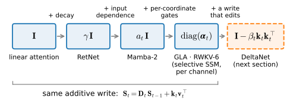
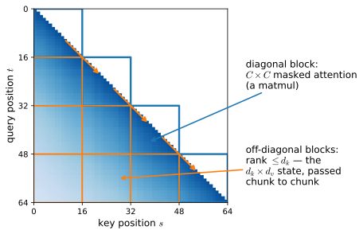

# The Matrix State: From Linear Attention to Mamba-2
:label:`sec_matrix-state`

Two roads have been leading to the same place. At the end of
:numref:`sec_attention-at-scale`, dropping the softmax turned attention into
a recurrence: a matrix-valued state updated by an outer-product write at
every token, trained in parallel, stepped in constant memory at generation
time. That section closed with a promise, that Mamba-2's *state space
duality* makes the correspondence between such recurrences and the selective
state space models of :numref:`sec_mamba` exact. The last two sections built
the other road: linear recurrences discretized from continuous time, made
selective, packaged into Mamba. This section is where the roads meet. We
first take stock of what the matrix state actually is as a memory, and
measure its capacity; a family of models then appears as one-line variations
on a single recurrence, differing only in how they *forget*. Unrolling that
recurrence proves the promised duality: a gated linear recurrence and masked
attention are the same matrix, computed in two different orders, and a third
order, chunkwise, is how every model in this family trains at scale. We
close with the family table that organizes these models, from
RetNet to Mamba-2 to xLSTM.

*Prerequisites: the linear-attention recurrence and its normalizer from
:numref:`sec_attention-at-scale`; the selective SSM of
:numref:`sec_mamba` and the parallel scan of
:numref:`subsec_parallel-scans`; the KV-cache accounting of
:numref:`sec_kv-cache`.*

```{.python .input #matrix-state-the-matrix-state-from-linear-attention-to-mamba-2}
%%tab pytorch
%matplotlib inline
from d2l import torch as d2l
import numpy as np
import time
import torch
```

```{.python .input #matrix-state-the-matrix-state-from-linear-attention-to-mamba-2}
%%tab jax
%matplotlib inline
from d2l import jax as d2l
import jax
from jax import numpy as jnp
import numpy as np
import time
```

## Two Roads to One Recurrence
:label:`subsec_ms-two-roads`

Recall the object that fell out of kernelizing attention,
:eqref:`eq_linear-attn-recurrence`: a state
$\mathbf{S}_t \in \mathbb{R}^{d_k \times d_v}$, with keys indexing rows,
written by outer products and read by the query. Every model in this
section is an instance of the template

$$
\mathbf{S}_t = \mathbf{D}_t\, \mathbf{S}_{t-1} + \mathbf{k}_t \mathbf{v}_t^\top,
\qquad
\mathbf{o}_t = \mathbf{S}_t^\top \mathbf{q}_t,
$$
:eqlabel:`eq_ms-recurrence`

where the *transition* $\mathbf{D}_t$ decides what survives of the past and
the *write* $\mathbf{k}_t \mathbf{v}_t^\top$ files the current token under
its key. Linear attention is the case $\mathbf{D}_t = \mathbf{I}$: never
forget. The minGRU and the selective SSM obeyed the same shape one level
down, as the elementwise affine recurrence :eqref:`eq_affine_recurrence`
evaluated by the parallel scan of :numref:`subsec_parallel-scans`; here the
state is a matrix rather than a vector, but the algebra, affine maps
composing into affine maps, is identical.

Before building on this template, we should record what it keeps
from :numref:`sec_attention-at-scale` and what it drops. What you verified
there was a *pair* of states: $\mathbf{S}_t$ together with a normalizer
$\mathbf{z}_t = \sum_{s \le t} \phi(\mathbf{k}_s)$, read as
$\phi(\mathbf{q}_t)^\top \mathbf{S}_t / \phi(\mathbf{q}_t)^\top \mathbf{z}_t$,
with the feature map $\phi = \mathrm{elu} + 1$ keeping everything positive
so that the denominator could not vanish. The modern family drops both.
Queries and keys come out of learned projections whose scale training can
set freely, so the feature map goes; and rather than tracking a normalizer
state, production layers normalize the *output*, passing $\mathbf{o}_t$
through an RMSNorm or GroupNorm before the residual add
:cite:`Yang.Wang.Shen.ea.2024,Dao.Gu.2024`. One member of the family, the
mLSTM at the end of this section, keeps an explicit normalizer state; when
we meet it, the pair $(\mathbf{S}, \mathbf{z})$ of :numref:`chap_attention` will be waiting.

### What the Memory Costs
:label:`subsec_ms-capacity`

A matrix as associative memory is an old idea, and its failure mode is just
as old. Suppose we store $n$ pairs with $\mathbf{D}_t = \mathbf{I}$, so
$\mathbf{S} = \sum_{i=1}^{n} \mathbf{k}_i \mathbf{v}_i^\top$, and read back
key $j$. If the keys have unit norm (an assumption we make throughout this
subsection; normalized keys are also the shipped default in this model
family), the read-out is

$$
\mathbf{S}^\top \mathbf{k}_j
= \mathbf{v}_j + \sum_{i \neq j} (\mathbf{k}_i^\top \mathbf{k}_j)\, \mathbf{v}_i .
$$
:eqlabel:`eq_ms-retrieval-error`

The stored value comes back exactly, plus a sum of every *other* value
weighted by how much its key overlaps ours. Only mutually orthogonal keys
retrieve without error, and $\mathbb{R}^{d_k}$ holds at most $d_k$ of
those: the capacity of the memory is capped by its width, not by time. As
Songlin Yang puts it, the enemy of such a memory is not time, it is other
memories :cite:`Yang.Wang.Zhang.ea.2024`.

How fast does interference bite? The answer is a proposition whose
assumptions matter as much as its formula.

**Proposition.** Let the keys $\mathbf{k}_1, \ldots, \mathbf{k}_n$ be
independent and isotropic on the unit sphere of $\mathbb{R}^{d_k}$
(normalized Gaussians, for instance), and let the stored values be any
unit-norm vectors chosen independently of the keys. Then the expected
squared read error at every stored key $j$ is

$$
\mathbb{E}\,\big\| \mathbf{S}^\top \mathbf{k}_j - \mathbf{v}_j \big\|^2
= \frac{n-1}{d_k},
$$

where the expectation is over the keys and the squared norm sums over
all $d_v$ coordinates of the read-out; coordinate $c$ alone contributes
$\sum_{i \neq j} v_{i,c}^2 / d_k$ in expectation.

**Proof.** The error is $\sum_{i \neq j} (\mathbf{k}_i^\top
\mathbf{k}_j)\, \mathbf{v}_i$. For $i \neq l$, the cross term
$\mathbb{E}[(\mathbf{k}_i^\top \mathbf{k}_j)(\mathbf{k}_l^\top
\mathbf{k}_j)]\, \mathbf{v}_i^\top \mathbf{v}_l$ vanishes: conditioned
on $\mathbf{k}_j$, the factors are independent with mean zero. What
remains is $\sum_{i \neq j} \mathbb{E}[(\mathbf{k}_i^\top
\mathbf{k}_j)^2]\, \|\mathbf{v}_i\|^2$, and by isotropy each
$\mathbb{E}[(\mathbf{k}_i^\top \mathbf{k}_j)^2] = 1/d_k$, with $n-1$
terms. $\blacksquare$

Error linear in how much you store, inverse in the width you store it
into — *for keys that are independent and spread evenly*. Both
assumptions are load-bearing: correlated keys revive the cancelled
cross terms, and learned keys are rarely isotropic. The cell below
measures the law under its own assumptions and then breaks them on
purpose. It fills a memory with $n$ random pairs whose values come from
a codebook of 256 unit vectors, reads every key back, and decodes by
nearest codebook entry, sweeping $n$ across three widths; a final curve
mixes every key with one shared direction ($\rho = 0.5$) to correlate
them.

```{.python .input #matrix-state-what-the-memory-costs}
%%tab pytorch, jax
rng = np.random.default_rng(0)

def hebbian_memory(d, nums, num_values=256, trials=20, rho=0):
    """Read error and recall of S = sum_i k_i v_i^T over random unit keys;
    rho > 0 mixes every key with one shared direction (correlated keys)."""
    codebook = rng.standard_normal((num_values, d))
    codebook /= np.linalg.norm(codebook, axis=1, keepdims=True)
    errs, accs = [], []
    for n in nums:
        err = acc = 0
        for _ in range(trials):
            K = rng.standard_normal((n, d))
            K /= np.linalg.norm(K, axis=1, keepdims=True)  # Unit-norm keys
            if rho:                    # Break independence: shared component
                c = rng.standard_normal(d)
                K = np.sqrt(1 - rho ** 2) * K + rho * c / np.linalg.norm(c)
                K /= np.linalg.norm(K, axis=1, keepdims=True)
            ids = rng.integers(0, num_values, n)
            S = K.T @ codebook[ids]                        # Write: sum k v^T
            read = K @ S                                   # Rows are S^T k_j
            err += ((read - codebook[ids]) ** 2).sum(1).mean()
            acc += ((read @ codebook.T).argmax(1) == ids).mean()
        errs.append(err / trials)
        accs.append(acc / trials)
    return errs, accs

fig, axes = d2l.plt.subplots(1, 2, figsize=(9, 3.2))
for d in [32, 64, 128]:
    nums = [d // 4, d // 2, d, 2 * d, 4 * d, 8 * d]
    errs, accs = hebbian_memory(d, nums)
    axes[0].loglog(nums, errs, marker='o', label=f'$d_k$ = {d}')
    axes[0].loglog(nums, [(n - 1) / d for n in nums], 'k--', lw=1)
    axes[1].semilogx(nums, accs, marker='o', label=f'$d_k$ = {d}')
nums = [16, 32, 64, 128, 256, 512]                 # Width 64, correlated keys
errs, accs = hebbian_memory(64, nums, rho=0.5)
axes[0].loglog(nums, errs, marker='s', ls=':', color='C1',
               label=r'$d_k$ = 64, $\rho$ = 0.5')
axes[1].semilogx(nums, accs, marker='s', ls=':', color='C1')
for ax, ylabel in zip(axes, ['squared read error', 'recall accuracy']):
    ax.set_xlabel('stored pairs n')
    ax.set_ylabel(ylabel)
    ax.grid(linestyle='--', alpha=0.4)
axes[0].legend();
```

The left panel is the capacity law (both panels: independent isotropic
unit keys, except the dotted curve): the measured error sits on the
dashed $(n-1)/d_k$ prediction so closely that the curves are hard to
tell apart, across a 256-fold range of $n$ and three widths. The dotted
curve breaks the proposition's assumptions as promised, and the
proposition's cancellation is what it loses: with a common component in
every key, the cross terms no longer vanish in expectation, the read
error at $d_k = 64$ sits about five-fold above the independent curve
already at small $n$ and grows faster than linearly, and recall
degrades well before $n$ reaches $d_k$.
Width stops helping when the keys all resemble one another; this is why
the family normalizes its keys and why key *geometry*, not just key
count, decides what a matrix memory holds. The right panel is the
law's consequence. Recall is essentially perfect while the interference
stays small against the unit-norm signal, then collapses as $n$ grows
past $d_k$; at a fixed error level, doubling the width doubles how many
pairs fit. Nothing in either panel depends on *when* a pair was stored.
This is the number that matters for everything ahead: a fixed-size
state does not lose memories to time, it loses them to crowding, and
:numref:`sec_hybrids` will price exactly this quantity when deciding
how much full attention a production model must keep.

One caution about the word "capacity", which this chapter uses for
four distinct quantities. *Algebraic rank*: $\mathbf{S}$ has rank at
most $d_k$, so no write rule stores more than $d_k$ pairs with exact
recall. *Interference capacity*: the proposition above, an expected
read error under random independent keys. *Information capacity*: at
finite precision, $d_k d_v$ numbers hold at most a fixed number of
bits, the counting behind the copying lower bound of
:numref:`sec_hybrids`. *Task-usable capacity*: what a trained model
retrieves in practice, which :numref:`sec_hybrids` measures with its
recall sweep and which none of the first three numbers guarantees.

### The Decay Ladder
:label:`subsec_ms-decay-ladder`

If crowding is the failure, forgetting is the first fix: shrink the past
before each write and the interference sum stops growing. The family did
this in three steps, each a one-line change to
:eqref:`eq_ms-recurrence`:

$$
\mathbf{S}_t = \gamma\, \mathbf{S}_{t-1} + \mathbf{k}_t \mathbf{v}_t^\top,
\qquad
\mathbf{S}_t = a_t\, \mathbf{S}_{t-1} + \mathbf{k}_t \mathbf{v}_t^\top,
\qquad
\mathbf{S}_t = \mathrm{diag}(\boldsymbol{\alpha}_t)\, \mathbf{S}_{t-1} + \mathbf{k}_t \mathbf{v}_t^\top .
$$
:eqlabel:`eq_ms-decay-ladder`

A *fixed scalar* $\gamma \in (0,1)$ is RetNet's *retention*
:cite:`Sun.Dong.Huang.ea.2023`: each head gets its own constant decay, so
different heads keep different horizons. (If you worked the closing
exercise of :numref:`sec_attention-at-scale`, you have already built this
rung and verified that its parallel form weights past values by
$\gamma^{t-s}$.) An *input-dependent scalar* $a_t$, one number per head
per token, is the transition of Mamba-2 :cite:`Dao.Gu.2024`: the model
reads the token and decides how much of the whole memory survives it, the
forget gate of :numref:`sec_lstm` acting on a matrix state. And an
input-dependent *diagonal* $\mathrm{diag}(\boldsymbol{\alpha}_t)$ decays
each key coordinate at its own rate, the design of gated linear attention
(GLA) :cite:`Yang.Wang.Shen.ea.2024` and RWKV-6
:cite:`Peng.Goldstein.Anthony.ea.2024`. :numref:`fig_ms-decay-ladder`
draws the ladder. The selective SSM of :numref:`sec_mamba` lives on the
diagonal rung too, run per channel: $e^{\Delta_t \mathbf{a}}$ in
:eqref:`eq_selective_ssm` is an input-dependent diagonal decay in
everything but notation.

Each rung also has a statistical reading, which we note here and
develop in :numref:`sec_test-time-regression`. Stack the keys and
values seen so far as rows of $\mathbf{K}$ and $\mathbf{V}$, and let
the diagonal matrix $\mathbf{W}$ hold each row's accumulated decay. The
linear read-out minimizing the decay-weighted squared error
$\sum_i w_i \|\mathbf{S}^\top \mathbf{k}_i - \mathbf{v}_i\|^2$ is the
weighted least-squares solution

$$
\mathbf{S}^\star
= \big(\mathbf{K}^\top \mathbf{W} \mathbf{K} + \lambda \mathbf{I}\big)^{-1}
  \mathbf{K}^\top \mathbf{W} \mathbf{V},
$$
:eqlabel:`eq_ms-wls`

with a small ridge $\lambda$ (or a pseudoinverse at $\lambda = 0$)
covering rank-deficient keys. The decayed state on any rung of the
ladder stores only the *weighted cross-moment*
$\mathbf{K}^\top \mathbf{W} \mathbf{V}$: the shortcut that deletes the
covariance correction
$(\mathbf{K}^\top \mathbf{W} \mathbf{K} + \lambda \mathbf{I})^{-1}$.
For orthonormal keys the deletion costs nothing beyond the decay's own
discounting of each stored value; for overlapping keys it also pays the
interference sum of :eqref:`eq_ms-retrieval-error`. The decay sets how
fast old evidence expires, and which architectures restore the deleted
correction is part of :numref:`sec_test-time-regression`'s subject.


:label:`fig_ms-decay-ladder`

## The State-Space Duality
:label:`subsec_ms-duality`

We now make good on the promise of :numref:`chap_attention`. Take the scalar-decay rung of the
ladder, the simplest one that forgets, and *unroll* it, exactly as we
unrolled the LTI recurrence into a convolution in
:numref:`subsec_ssm-conv`. Substituting the update into itself, the state
at time $t$ is a decayed sum of every write so far, and the read-out is

$$
\mathbf{o}_t
= \sum_{s \le t} \big(a_t\, a_{t-1} \cdots a_{s+1}\big)\,
  (\mathbf{q}_t^\top \mathbf{k}_s)\, \mathbf{v}_s,
\qquad \textrm{i.e.} \qquad
\mathbf{Y} = \big(\mathbf{L} \circ \mathbf{Q}\mathbf{K}^\top\big)\, \mathbf{V},
\quad
L_{ts} = \!\!\prod_{r=s+1}^{t}\!\! a_r,
$$
:eqlabel:`eq_ms-semiseparable`

where $\circ$ is the elementwise product and $\mathbf{L}$ is lower
triangular with ones on the diagonal. Now stare at $\mathbf{L}$. If every
$a_t = 1$, then $L_{ts} = 1$ for $t \ge s$ and zero otherwise: $\mathbf{L}$
*is the causal mask*, and :eqref:`eq_ms-semiseparable` is masked linear
attention, scores $\mathbf{Q}\mathbf{K}^\top$, mask, value mixing, exactly
as in :numref:`sec_attention-at-scale`. A gated linear recurrence is
attention whose 0/1 causal mask has been replaced by a *learned, decaying*
mask. One object, two readings; :citet:`Dao.Gu.2024` named the
correspondence *state space duality* (SSD), and matrices of $\mathbf{L}$'s
form, every submatrix below the diagonal having rank one, are called
1-semiseparable. Keep the equivalence's scope in view: it is an identity
for this structured family, a scalar-gated (1-semiseparable) mask on
*linear* attention, not a statement about softmax attention, whose
exponential kernel is no masked linear read.

The duality is also a statement about computation. The right-hand side of
:eqref:`eq_ms-semiseparable` is a triple product, and the two ways of
parenthesizing it are the two modes we already know. Materialize
$\mathbf{L} \circ \mathbf{Q}\mathbf{K}^\top$ first and you compute
attention: quadratic in $T$, all positions in parallel, no state in sight.
Sweep the sum over $s$ from the left instead, one $t$ at a time, and the
partial sums *are* the state $\mathbf{S}_t$: linear in $T$, constant
memory, one token at a time. Same tensor contraction, two orders. Let's
verify that on real numbers, recurrent form first:

```{.python .input #matrix-state-the-state-space-duality-1}
%%tab pytorch
torch.manual_seed(0)
d_k, d_v, T = 64, 64, 512
device = d2l.try_gpu()

def matrix_state_recurrent(Q, K, V, a):
    """S_t = a_t S_{t-1} + k_t v_t^T, read o_t = S_t^T q_t."""
    S = Q.new_zeros(Q.shape[-1], V.shape[-1])
    outputs = []
    for t in range(Q.shape[0]):
        S = a[t] * S + K[t][:, None] * V[t][None, :]    # Decay, then write
        outputs.append(Q[t] @ S)                        # Read S^T q
    return torch.stack(outputs)

Q, K, V = (torch.randn(T, d, device=device) for d in (d_k, d_k, d_v))
a = 0.65 + 0.3 * torch.rand(T, device=device)           # Decays in (0.65, 0.95)
y_rec = matrix_state_recurrent(Q, K, V, a)
```

```{.python .input #matrix-state-the-state-space-duality-1}
%%tab jax
d_k, d_v, T = 64, 64, 512

def matrix_state_recurrent(Q, K, V, a):
    """S_t = a_t S_{t-1} + k_t v_t^T, read o_t = S_t^T q_t."""
    def step(S, qkva):
        q, k, v, a_t = qkva
        S = a_t * S + k[:, None] * v[None, :]           # Decay, then write
        return S, q @ S                                 # Read S^T q
    S0 = jnp.zeros((Q.shape[-1], V.shape[-1]))
    return jax.lax.scan(step, S0, (Q, K, V, a))[1]

keys = jax.random.split(jax.random.key(0), 4)
Q, K, V = (jax.random.normal(k, (T, d))
           for k, d in zip(keys, (d_k, d_k, d_v)))
a = 0.65 + 0.3 * jax.random.uniform(keys[3], (T,))      # Decays in (0.65, 0.95)
y_rec = matrix_state_recurrent(Q, K, V, a)
```

The quadratic dual builds $\mathbf{L}$ in log space: the product of decays
from $s$ to $t$ is a difference of cumulative log-decays, and masking with
$-\infty$ *before* exponentiating keeps the entries above the diagonal
from overflowing (they would be products of *inverse* decays). We assert
agreement rather than eyeball it; this check is the duality.

```{.python .input #matrix-state-the-state-space-duality-2}
%%tab pytorch
def matrix_state_dual(Q, K, V, a):
    """Y = (L o Q K^T) V with L_ts = a_t ... a_{s+1} for t >= s, else 0."""
    cum = torch.cumsum(torch.log(a), 0)
    logL = cum[:, None] - cum[None, :]                  # Sum of logs over (s, t]
    causal = torch.tril(torch.ones(len(a), len(a), dtype=torch.bool,
                                   device=a.device))
    L = torch.exp(logL.masked_fill(~causal, -torch.inf))
    return (L * (Q @ K.T)) @ V

err = (matrix_state_dual(Q, K, V, a) - y_rec).abs().max() / y_rec.abs().max()
print(f'relative deviation, dual vs recurrence: {float(err):.2e}')
assert err < 1e-3                          # Two orders, one computation

ones = torch.ones(T, device=device)                     # All a_t = 1
err = (matrix_state_dual(Q, K, V, ones)
       - torch.tril(Q @ K.T) @ V).abs().max()
print(f'a_t = 1, deviation from masked linear attention: {float(err):.2e}')
assert err < 1e-6                          # L is literally the causal mask
```

```{.python .input #matrix-state-the-state-space-duality-2}
%%tab jax
def matrix_state_dual(Q, K, V, a):
    """Y = (L o Q K^T) V with L_ts = a_t ... a_{s+1} for t >= s, else 0."""
    cum = jnp.cumsum(jnp.log(a))
    logL = cum[:, None] - cum[None, :]                  # Sum of logs over (s, t]
    causal = jnp.tril(jnp.ones((len(a), len(a)), bool))
    L = jnp.exp(jnp.where(causal, logL, -jnp.inf))
    return (L * (Q @ K.T)) @ V

with jax.default_matmul_precision('highest'):
    err = (jnp.abs(matrix_state_dual(Q, K, V, a) - y_rec).max()
           / jnp.abs(y_rec).max())
    print(f'relative deviation, dual vs recurrence: {float(err):.2e}')
    assert err < 1e-3                      # Two orders, one computation

    ones = jnp.ones(T)                                  # All a_t = 1
    err = jnp.abs(matrix_state_dual(Q, K, V, ones)
                  - jnp.tril(Q @ K.T) @ V).max()
    print(f'a_t = 1, deviation from masked linear attention: {float(err):.2e}')
    assert err < 1e-6                      # L is literally the causal mask
```

Ten lines of quadratic code, a scan-shaped loop, and they agree to
floating-point rounding; with the decays pinned to one, the dual reduces
*exactly* to the masked linear attention of :numref:`chap_attention`. The correspondence
that :numref:`sec_attention-at-scale` promised is now a computation you
have run, not an analogy. It also locates Mamba-2 precisely: take
:numref:`sec_mamba`'s selective model, restrict its per-coordinate decay
to a single input-dependent scalar per head, and the layer *is*
:eqref:`eq_ms-semiseparable`, trainable in whichever mode is cheaper.
Which raises the practical question: if the recurrence costs
$\mathcal{O}(T)$ but crawls token by token, and the dual is one big matmul
but costs $\mathcal{O}(T^2)$, is there something in between?

## Chunked Computation: Mostly Matmul, a Little Scan
:label:`subsec_ms-chunked`

There is, and it is how GLA, Mamba-2, and the DeltaNet family of the next
section all train. Partition the sequence into chunks of $C$ tokens and
partition $\mathbf{L} \circ \mathbf{Q}\mathbf{K}^\top$ accordingly, as in
:numref:`fig_ms-semiseparable`. The blocks on the diagonal are the
interactions *within* a chunk: each is a $C \times C$ masked-attention
product, quadratic only in the chunk length, and all of them run in
parallel. Everything below the diagonal is the influence of earlier chunks
on later ones, and here the semiseparable structure pays off: those blocks
have rank at most $d_k$, because all a later chunk needs from the entire
past is the $d_k \times d_v$ state at its boundary. So the algorithm is:
compute the diagonal blocks as matmuls, pass the state chunk to chunk with
a short recurrence of $T/C$ steps, and add each chunk's read of its
incoming state. Attention inside, recurrence across; mostly matmul, a
little scan :cite:`Dao.Gu.2024`.


:label:`fig_ms-semiseparable`

The implementation needs one helper. `segsum` builds, for one chunk, the
matrix of *segment sums* of log-decays, $\sum_{s < r \le t} \log a_r$,
whose exponential is the within-chunk $\mathbf{L}$; as in the dual, the
invalid upper triangle is masked to $-\infty$ in log space, before any
exponential can overflow. The chunked form is then a dozen lines: the
decayed attention matmul inside each chunk, and a loop over chunk
boundaries that carries the state, decays each key's write to its chunk's
end, and lets each chunk read the state it inherited.

```{.python .input #matrix-state-chunked-computation-mostly-matmul-a-little-scan-1}
%%tab pytorch
def segsum(log_a):
    """Segment sums: (..., C) -> (..., C, C) with entries sum over (s, t]."""
    C = log_a.shape[-1]
    cum = torch.cumsum(log_a, -1)
    diff = cum[..., :, None] - cum[..., None, :]
    keep = torch.tril(torch.ones(C, C, dtype=torch.bool, device=log_a.device))
    return diff.masked_fill(~keep, -torch.inf)          # Mask in log space

def matrix_state_chunked(Q, K, V, a, chunk_size=64):
    """The same Y, chunk by chunk: attention inside, recurrence across."""
    T, C = Q.shape[0], chunk_size
    Qc, Kc = Q.view(-1, C, Q.shape[-1]), K.view(-1, C, K.shape[-1])
    Vc, log_a = V.view(-1, C, V.shape[-1]), torch.log(a).view(-1, C)
    L = torch.exp(segsum(log_a))                        # (T/C, C, C)
    b = torch.exp(torch.cumsum(log_a, -1))              # Decay since chunk entry
    Y = (L * (Qc @ Kc.transpose(-1, -2))) @ Vc          # Diagonal blocks
    S = Q.new_zeros(Q.shape[-1], V.shape[-1])
    for c in range(T // C):                             # T/C boundary steps
        Y[c] += (Qc[c] * b[c][:, None]) @ S             # Read the carried state
        S = b[c][-1] * S + (Kc[c] * (b[c][-1] / b[c])[:, None]).T @ Vc[c]
    return Y.reshape(T, -1)

for chunk_size in [16, 64, 256]:
    err = ((matrix_state_chunked(Q, K, V, a, chunk_size) - y_rec).abs().max()
           / y_rec.abs().max())
    print(f'chunk size {chunk_size:4d}: relative deviation {float(err):.2e}')
    assert err < 1e-3                      # Chunked == recurrence
```

```{.python .input #matrix-state-chunked-computation-mostly-matmul-a-little-scan-1}
%%tab jax
def segsum(log_a):
    """Segment sums: (..., C) -> (..., C, C) with entries sum over (s, t]."""
    C = log_a.shape[-1]
    cum = jnp.cumsum(log_a, -1)
    diff = cum[..., :, None] - cum[..., None, :]
    keep = jnp.tril(jnp.ones((C, C), bool))
    return jnp.where(keep, diff, -jnp.inf)              # Mask in log space

def matrix_state_chunked(Q, K, V, a, chunk_size=64):
    """The same Y, chunk by chunk: attention inside, recurrence across."""
    T, C = Q.shape[0], chunk_size
    Qc, Kc = Q.reshape(-1, C, Q.shape[-1]), K.reshape(-1, C, K.shape[-1])
    Vc, log_a = V.reshape(-1, C, V.shape[-1]), jnp.log(a).reshape(-1, C)
    L = jnp.exp(segsum(log_a))                          # (T/C, C, C)
    b = jnp.exp(jnp.cumsum(log_a, -1))                  # Decay since chunk entry
    Y = (L * (Qc @ Kc.transpose(0, 2, 1))) @ Vc         # Diagonal blocks
    def boundary(S, chunk):                             # T/C boundary steps
        Qb, Kb, Vb, bb, Yb = chunk
        Yb = Yb + (Qb * bb[:, None]) @ S                # Read the carried state
        S = bb[-1] * S + (Kb * (bb[-1] / bb)[:, None]).T @ Vb
        return S, Yb
    S0 = jnp.zeros((Q.shape[-1], V.shape[-1]))
    _, Y = jax.lax.scan(boundary, S0, (Qc, Kc, Vc, b, Y))
    return Y.reshape(T, -1)

with jax.default_matmul_precision('highest'):
    for chunk_size in [16, 64, 256]:
        err = (jnp.abs(matrix_state_chunked(Q, K, V, a, chunk_size)
                       - y_rec).max() / jnp.abs(y_rec).max())
        print(f'chunk size {chunk_size:4d}: relative deviation {float(err):.2e}')
        assert err < 1e-3                  # Chunked == recurrence
```

One numerical note before we time these forms. Within a chunk, `segsum`
works in log space and masks with $-\infty$ *before* exponentiating, so
the diagonal blocks cannot overflow. The boundary step is less careful:
it exponentiates the prefix products $b$ and then divides, and $b$
shrinks geometrically with position in the chunk. For our decay range
the smallest prefix product at $C = 256$ is around $10^{-28}$, still
inside float32's range; by $C = 512$ it underflows to exactly zero and
the late-chunk ratios $b_C / b_t$ degenerate to $0/0$. The $C = 1024$
row of the timing table below therefore measures the right arithmetic
shape — the work and memory traffic are unchanged — on values that have
already turned to NaN; correctness holds for the chunk sizes asserted
above. Production kernels carry the boundary decays in log space too,
or rescale chunk by chunk, for exactly this reason; we keep the plain
ratio because it leaves the algebra visible.

The chunk size interpolates between the two modes we proved dual: at
$C = 1$ each diagonal block shrinks to the $1 \times 1$ self-write
$(\mathbf{q}_t^\top \mathbf{k}_t)\,\mathbf{v}_t$ — within-chunk
interaction between *distinct* tokens is gone, and everything earlier
flows through the state recurrence; at $C = T$ there is one block and
no recurrence. Where between the endpoints should we sit? Time and
memory answer differently, so we measure both, on the same footing as
the attention measurements of :numref:`sec_attention-at-scale`.

```{.python .input #matrix-state-chunked-computation-mostly-matmul-a-little-scan-2}
%%tab pytorch
T = 4096
Q, K, V = (torch.randn(T, d, device=device) for d in (d_k, d_k, d_v))
a = 0.65 + 0.3 * torch.rand(T, device=device)

def wall_clock(f, *args, reps=5):
    f(*args)  # Warm up
    if device.type == 'cuda':
        torch.cuda.synchronize()
    start = time.time()
    for _ in range(reps):
        f(*args)
    if device.type == 'cuda':
        torch.cuda.synchronize()
    return (time.time() - start) / reps

def peak_memory(f, *args):
    """Extra peak memory allocated by f, in bytes (CUDA only)."""
    torch.cuda.synchronize()
    torch.cuda.reset_peak_memory_stats()
    base = torch.cuda.memory_allocated()
    f(*args)
    torch.cuda.synchronize()
    return torch.cuda.max_memory_allocated() - base

forms = {'recurrence': matrix_state_recurrent}
for C in [16, 64, 256, 1024]:
    forms[f'chunked ({C})'] = \
        lambda q, k, v, a, C=C: matrix_state_chunked(q, k, v, a, C)
forms['quadratic dual'] = matrix_state_dual

print(f'{"form":>15} {"time (ms)":>10} {"peak (MiB)":>11}')
for name, f in forms.items():
    t = wall_clock(f, Q, K, V, a) * 1e3
    mem = (f'{peak_memory(f, Q, K, V, a) / 2**20:11.1f}'
           if device.type == 'cuda' else f'{"n/a":>11}')
    print(f'{name:>15} {t:10.2f} {mem}')
dev = torch.cuda.get_device_name(device) if device.type == 'cuda' else 'CPU'
print(f'({dev}, float32, torch {torch.__version__}; '
      f'teaching implementations, warmed up)')
```

```{.python .input #matrix-state-chunked-computation-mostly-matmul-a-little-scan-2}
%%tab jax
T = 4096
keys = jax.random.split(jax.random.key(1), 4)
Q, K, V = (jax.random.normal(k, (T, d))
           for k, d in zip(keys, (d_k, d_k, d_v)))
a = 0.65 + 0.3 * jax.random.uniform(keys[3], (T,))

def wall_clock(f, *args, reps=5):
    f(*args).block_until_ready()  # Warm up (and compile)
    start = time.time()
    for _ in range(reps):
        f(*args).block_until_ready()
    return (time.time() - start) / reps

forms = {'recurrence': jax.jit(matrix_state_recurrent)}
for C in [16, 64, 256, 1024]:
    forms[f'chunked ({C})'] = jax.jit(
        lambda q, k, v, a, C=C: matrix_state_chunked(q, k, v, a, C))
forms['quadratic dual'] = jax.jit(matrix_state_dual)

print(f'{"form":>15} {"time (ms)":>10} {"temp (MiB)":>11}')
for name, f in forms.items():
    stats = f.lower(Q, K, V, a).compile().memory_analysis()
    print(f'{name:>15} {wall_clock(f, Q, K, V, a) * 1e3:10.2f} '
          f'{stats.temp_size_in_bytes / 2**20:11.1f}')
print(f'({jax.devices()[0].device_kind}, float32, jax {jax.__version__}; '
      f'teaching implementations, all forms compiled)')
```

Provenance first: these are our teaching implementations, timed in
float32 on the printed device after a warm-up pass, and the two
frameworks do not measure quite the same thing — the PyTorch recurrence
is an eager Python loop paying per-step dispatch, while JAX compiles
all three forms, which flatters the recurrence. Read the orders of
magnitude, not the exact ratios. The pattern in our runs is the one the
derivation predicts. The token
recurrence is by far the slowest, a couple of orders of magnitude behind
the best schedule: its $T$ steps are serialized, whether as eager kernel
launches or as a compiled scan, so the accelerator's parallelism sits
unused, though its memory footprint is trivial. The quadratic dual is the
mirror image: matmul-fast, but its $T \times T$ matrices dominate the
memory column and grow fourfold with every doubling of $T$. The chunked
schedule takes both prizes at once: with chunks of a few hundred tokens it
runs within a small factor of the dual's speed (in some runs ahead of it)
at an order of magnitude less memory, and its constituent operations are
exactly the dense matmuls the hardware wants to run. The FLOP-optimal chunk size, which an exercise asks you to derive,
sits near $C \approx d_k$; the measured optimum drifts higher because
kernel-launch overhead penalizes many small chunks.

### What the Hardware Bought
:label:`subsec_ms-hardware`

This schedule, not any change in the model class, is the main story of
Mamba-2 relative to Mamba. Recall from
:numref:`sec_attention-at-scale` that an accelerator moves bytes far more
slowly than it multiplies them; its full arithmetic rate is reserved for
dense matrix products on tensor cores. Mamba-1's parallel scan is
elementwise work, so it runs at memory bandwidth and leaves the matmul
units idle. Restricting the transition to a scalar per head buys the
chunked form above, whose inner loop is matmuls, and the practical
consequence — the Mamba-2 paper's empirical scaling observation, not a
theorem — was startling: training got several times faster *and* the
state dimension could jump from $N = 16$ to $64$--$256$ at little extra
wall clock, because a bigger state just makes the matmuls better shaped
for the hardware :cite:`Dao.Gu.2024`. The capacity law of
:numref:`subsec_ms-capacity` says what that buys: an order of magnitude
more pairs held at the same read error. The trade is not one-sided, and
it runs in both directions: Mamba-1's per-coordinate
decay is a more expressive transition per unit of state, and for pure
recurrent inference, where there are no chunks and every step is
elementwise either way, nothing forces the scalar restriction. Production
systems pick per workload. The frontier keeps moving on the same axis:
Mamba-3 upgrades the discretization itself, replacing the Euler-style
update on the input path with a trapezoidal rule (and adding complex-valued
states and multi-input, multi-output reads that feed the decode-time
matmuls) :cite:`Lahoti.Li.Chen.ea.2026`.

One accounting cell closes the systems thread that
:numref:`sec_kv-cache` opened. A transformer's per-layer cache grows
linearly with context; every matrix state in this section is a constant.
Priced per layer and per sequence, at $b$ bytes per element, the two
sides of the ledger are

$$
\underbrace{\big(d_{\textrm{inner}}\, d_{\textrm{state}}
+ d_{\textrm{inner}}\, (w - 1)\big)\, b}_{\textrm{recurrent: SSM state + conv buffer, constant}}
\qquad \textrm{vs.} \qquad
\underbrace{2\, n\, h_{\textrm{kv}}\, d_{\textrm{head}}\, b}_{\textrm{KV cache, grows with the } n \textrm{ tokens kept}},
$$
:eqlabel:`eq_ms-state-bytes`

where $w$ is the causal-convolution width whose rolling buffer decoding
must also carry (:numref:`subsec_mamba-step`) and $h_{\textrm{kv}}$ the
number of KV heads; a batch multiplies both sides by its size, and a
whole model multiplies both by its layer count. The cell prices the
$64 \times 64$ head state of our cells and one fully specified
production instance — a Mamba-2 2.7B layer: $d_{\textrm{model}} = 2560$,
expansion $2$, so $d_{\textrm{inner}} = 5120$, $d_{\textrm{state}} =
128$, $w = 4$, hence $5120 \times 128 = 655{,}360$ state elements per
layer — against the grouped-query KV settings of :numref:`sec_kv-cache`.
Headline numbers use fp16 ($b = 2$) on *both* sides, the common serving
precision; the formula re-prices any row for other dtypes.

```{.python .input #matrix-state-what-the-hardware-bought}
%%tab pytorch, jax
def mib(elements, bytes_per=2):             # fp16 headline; re-price at will
    return elements * bytes_per / 2**20

d_inner, d_state, w = 5120, 128, 4          # Mamba-2 2.7B layer
ssm, conv = d_inner * d_state, d_inner * (w - 1)
print('per layer, per sequence, fp16:')
print(f'matrix state, one 64x64 head:  {mib(64 * 64):8.2f} MiB, constant')
print(f'Mamba-2 2.7B, SSM {ssm:,} + conv {conv:,} elements: '
      f'{mib(ssm + conv):.2f} MiB, constant')
for n in [4096, 131072, 1048576]:
    kv = 2 * n * 8 * 128                    # 2 x tokens x kv-heads x head-dim
    print(f'GQA KV cache at n = {n:>9,}: {mib(kv):8.2f} MiB and growing')
```

The recurrent side of the ledger is constant in context length; the
cache side crosses it within a few thousand tokens and keeps growing
with every token kept. Both sides compose with quantization, and the
cache side with sharing and eviction schemes, so the constants move;
the shapes do not. What the flat line costs, we measured at
the start of this section: a capacity ceiling set by the state's width.
Holding both numbers in mind at once is the whole hybrid-design problem of
:numref:`sec_hybrids`, which prices whole models with exactly
:eqref:`eq_ms-state-bytes`.

## The Family, So Far
:label:`subsec_ms-family`

We can now lay out the family that this section and its two predecessors
have assembled, one row per model, every row an instance of
:eqref:`eq_ms-recurrence`. The table is worth reading column by column:
the *transition* column is the decay ladder, and the *write* column is,
for now, monotonous by design.

> **Reading the papers.** The literature does not agree on which way the
> state matrix points. :citet:`Katharopoulos.Vyas.Pappas.ea.2020` write
> $\mathbf{S} = \sum_s \phi(\mathbf{k}_s)\mathbf{v}_s^\top$ read by
> $\phi(\mathbf{q})^\top \mathbf{S}$, as we do; RetNet and GLA carry the
> same state under transposed notation; the DeltaNet line stores the
> transpose $\mathbf{S} \in \mathbb{R}^{d_v \times d_k}$, writes
> $\mathbf{v}_t \mathbf{k}_t^\top$, and applies transitions from the
> *right*. All of these are one recurrence up to transposition. This
> chapter fixes a single convention, keys index rows:
> $\mathbf{S}_t = \mathbf{D}_t \mathbf{S}_{t-1} + \mathbf{k}_t \mathbf{v}_t^\top$
> with read $\mathbf{o}_t = \mathbf{S}_t^\top \mathbf{q}_t$, and
> translates every paper into it, as in :numref:`tab_ms-family`.

:The matrix-state family. Every model is :eqref:`eq_ms-recurrence` with a choice of transition $\mathbf{D}_t$ and an additive write; the columns for state and transition vary, the write column does not.
:label:`tab_ms-family`

| model | state | transition $\mathbf{D}_t$ | write | origin, in one line |
|:--|:--|:--|:--|:--|
| linear attention (2020) | $\mathbf{S}$ and normalizer $\mathbf{z}$ | $\mathbf{I}$ | add $\phi(\mathbf{k}_t)\mathbf{v}_t^\top$ | attention minus softmax |
| RetNet (2023) | $\mathbf{S}$ per head | $\gamma\,\mathbf{I}$, fixed per head | add $\mathbf{k}_t\mathbf{v}_t^\top$ | linear attention plus decay |
| Mamba (2023) | vector $\mathbf{x}_t \in \mathbb{R}^N$ per channel | input-dep. diagonal $e^{\Delta_t \mathbf{a}}$ | add $\Delta_t u_t \mathbf{B}_t$ | selective SSM (:numref:`sec_mamba`) |
| GLA (2024) | $\mathbf{S}$ per head | input-dep. diagonal $\mathrm{diag}(\boldsymbol{\alpha}_t)$ | add $\mathbf{k}_t\mathbf{v}_t^\top$ | per-coordinate forgetting |
| Mamba-2 (2024) | $\mathbf{S}$ per head | input-dep. scalar $a_t\,\mathbf{I}$ | add $\mathbf{k}_t\mathbf{v}_t^\top$ | the duality of this section |
| RWKV-6 (2024) | $\mathbf{S}$ per head | input-dep. diagonal $\mathrm{diag}(\mathbf{w}_t)$ | add $\mathbf{k}_t\mathbf{v}_t^\top$ | the RNN lineage arrives |
| mLSTM (2024) | $\mathbf{S}$ and normalizer $\mathbf{z}$ | scalar gate $f_t\,\mathbf{I}$ | add $i_t\,\mathbf{k}_t\mathbf{v}_t^\top$ | LSTM with a matrix cell |

Three research lineages fill the rows: attention seeking linearity
(linear attention, RetNet, GLA), state space models seeking selectivity
(Mamba, Mamba-2), and recurrent networks seeking parallelism (RWKV-6,
mLSTM). That they converge on one recurrence is the strongest evidence in
this book that the recurrence, rather than any single architecture, is the
right object of study. Mamba's row is the one non-matrix entry: its
per-channel vector state is the same mathematics run single-input,
single-output, and Mamba-2's move to the matrix state is what the duality
section derived.

### The One That Kept the Normalizer
:label:`subsec_ms-mlstm`

The last row deserves its promised closer look, because it answers a
question :numref:`chap_attention` left open: whatever happened to the normalizer
$\mathbf{z}$? The mLSTM, the matrix-memory cell of xLSTM
:cite:`Beck.Poppel.Spanring.ea.2024`, is the LSTM rebuilt on
:eqref:`eq_ms-recurrence`: a forget gate $f_t$ and input gate $i_t$,
computed from the token, gating a matrix cell state and, alongside it, the
running normalizer that the rest of the family traded for output
normalization:

$$
\mathbf{S}_t = f_t\, \mathbf{S}_{t-1} + i_t\, \mathbf{k}_t \mathbf{v}_t^\top,
\qquad
\mathbf{z}_t = f_t\, \mathbf{z}_{t-1} + i_t\, \mathbf{k}_t,
\qquad
\mathbf{o}_t = \frac{\mathbf{S}_t^\top \mathbf{q}_t}
                    {\max\big(|\mathbf{z}_t^\top \mathbf{q}_t|,\, 1\big)},
$$
:eqlabel:`eq_ms-mlstm`

with $i_t = \exp(\tilde{i}_t)$ and $f_t = \sigma(\tilde{f}_t)$ or
$\exp(\tilde{f}_t)$ for learned pre-activations $\tilde{i}_t, \tilde{f}_t$
(the paper's $\mathbf{C}_t$ and $\mathbf{n}_t$ are our $\mathbf{S}_t$ and
$\mathbf{z}_t$ transposed). The exponential gates are the novelty and the
hazard: they let a single strong token outweigh the entire accumulated
past, and they overflow float32 after a few dozen steps of ordinary gate
values. The fix is one we have already met. Exactly as online softmax
:eqref:`eq_online-softmax` carries a running maximum and rescales the
past, the mLSTM carries a stabilizer state $m_t$
:cite:`Milakov.Gimelshein.2018`:

$$
m_t = \max\big(\tilde{f}_t + m_{t-1},\, \tilde{i}_t\big),
\qquad
f'_t = \exp\big(\tilde{f}_t + m_{t-1} - m_t\big),
\qquad
i'_t = \exp\big(\tilde{i}_t - m_t\big),
$$
:eqlabel:`eq_ms-mlstm-stabilizer`

for the exponential-forget case. Running the recurrence with
$(f'_t, i'_t)$ scales state and normalizer by the same factor
$e^{-m_t}$, so the read-out is unchanged provided the constant $1$ in the
denominator is scaled too, to $e^{-m_t}$. We implement the recurrence
directly from these equations (the reference xLSTM code base is under a
restrictive license, so reimplementing from the paper is also the legally
clean route) and verify both claims at once: the unstabilized float32
recurrence dies, and the stabilized one matches an unstabilized float64
reference to float precision.

```{.python .input #matrix-state-the-one-that-kept-the-normalizer}
%%tab pytorch
torch.manual_seed(0)
d_k, d_v, T = 8, 8, 64
q, k, v = (torch.randn(T, d) for d in (d_k, d_k, d_v))
i_pre, f_pre = torch.randn(T), 2.0 + torch.randn(T)  # Gate pre-activations

def mlstm_naive(q, k, v, i_pre, f_pre, dtype):
    """The unstabilized recurrence, in a given precision."""
    q, k, v = q.to(dtype), k.to(dtype), v.to(dtype)
    i_g, f_g = i_pre.to(dtype).exp(), f_pre.to(dtype).exp()
    S, z = torch.zeros(d_k, d_v, dtype=dtype), torch.zeros(d_k, dtype=dtype)
    outputs = []
    for t in range(T):
        S = f_g[t] * S + i_g[t] * (k[t][:, None] * v[t][None, :])
        z = f_g[t] * z + i_g[t] * k[t]
        outputs.append(q[t] @ S / (q[t] @ z).abs().clamp(min=1))
    return torch.stack(outputs)

def mlstm_stabilized(q, k, v, i_pre, f_pre):
    """Carry m_t and rescale the past, as in online softmax."""
    S, z = torch.zeros(d_k, d_v), torch.zeros(d_k)
    m = torch.tensor(-torch.inf)
    outputs = []
    for t in range(T):
        m_new = torch.maximum(f_pre[t] + m, i_pre[t])
        f_g, i_g = torch.exp(f_pre[t] + m - m_new), torch.exp(i_pre[t] - m_new)
        S = f_g * S + i_g * (k[t][:, None] * v[t][None, :])
        z = f_g * z + i_g * k[t]
        m = m_new
        outputs.append(q[t] @ S
                       / torch.maximum((q[t] @ z).abs(), torch.exp(-m)))
    return torch.stack(outputs)

exact = mlstm_naive(q, k, v, i_pre, f_pre, torch.float64)
naive = mlstm_naive(q, k, v, i_pre, f_pre, torch.float32)
bad = ~torch.isfinite(naive).all(-1)        # argmax(bool) would report 0
first_bad = int(bad.float().argmax()) if bool(bad.any()) else 'none'
stab = mlstm_stabilized(q, k, v, i_pre, f_pre)
err = (stab - exact.float()).abs().max() / exact.abs().max()
print(f'float32 unstabilized: first non-finite output at step {first_bad}')
print(f'float32 stabilized vs float64: relative deviation {float(err):.2e}')
assert torch.isfinite(stab).all() and err < 1e-3
```

```{.python .input #matrix-state-the-one-that-kept-the-normalizer}
%%tab jax
d_k, d_v, T = 8, 8, 64
kk = jax.random.split(jax.random.key(2), 5)
q, k, v = (jax.random.normal(key, (T, d))
           for key, d in zip(kk, (d_k, d_k, d_v)))
i_pre = jax.random.normal(kk[3], (T,))               # Gate pre-activations
f_pre = 2.0 + jax.random.normal(kk[4], (T,))

def mlstm_naive(q, k, v, i_pre, f_pre, dtype):
    """The unstabilized recurrence (NumPy), in a given precision."""
    q, k, v = (np.asarray(x, dtype) for x in (q, k, v))
    i_g, f_g = np.exp(np.asarray(i_pre, dtype)), np.exp(np.asarray(f_pre, dtype))
    S, z = np.zeros((d_k, d_v), dtype), np.zeros(d_k, dtype)
    outputs = []
    for t in range(T):
        S = f_g[t] * S + i_g[t] * np.outer(k[t], v[t])
        z = f_g[t] * z + i_g[t] * k[t]
        outputs.append(q[t] @ S / max(abs(q[t] @ z), 1.0))
    return np.stack(outputs)

def mlstm_stabilized(q, k, v, i_pre, f_pre):
    """Carry m_t and rescale the past, as in online softmax."""
    def step(carry, x):
        S, z, m = carry
        q_t, k_t, v_t, i_t, f_t = x
        m_new = jnp.maximum(f_t + m, i_t)
        f_g, i_g = jnp.exp(f_t + m - m_new), jnp.exp(i_t - m_new)
        S = f_g * S + i_g * (k_t[:, None] * v_t[None, :])
        z = f_g * z + i_g * k_t
        o = q_t @ S / jnp.maximum(jnp.abs(q_t @ z), jnp.exp(-m_new))
        return (S, z, m_new), o
    init = (jnp.zeros((d_k, d_v)), jnp.zeros(d_k), -jnp.inf)
    return jax.lax.scan(step, init, (q, k, v, i_pre, f_pre))[1]

exact = mlstm_naive(q, k, v, i_pre, f_pre, np.float64)
with np.errstate(over='ignore', invalid='ignore'):   # The overflow is the point
    naive = mlstm_naive(q, k, v, i_pre, f_pre, np.float32)
bad = ~np.isfinite(naive).all(-1)           # argmax(bool) would report 0
first_bad = int(bad.argmax()) if bad.any() else 'none'
stab = mlstm_stabilized(q, k, v, i_pre, f_pre)
err = jnp.abs(stab - exact).max() / jnp.abs(exact).max()
print(f'float32 unstabilized: first non-finite output at step {first_bad}')
print(f'float32 stabilized vs float64: relative deviation {float(err):.2e}')
assert bool(jnp.isfinite(stab).all()) and err < 1e-3
```

The mLSTM is one half of the xLSTM architecture; its scalar sibling sLSTM
keeps the LSTM's recurrent memory mixing (and therefore steps
sequentially, gaining state-tracking power the parallel family lacks), a
trade we noted in the gate table of :numref:`sec_lstm`.

### The Column Left Open
:label:`subsec_ms-open-column`

Look down the write column of :numref:`tab_ms-family` once more. Seven
models, three lineages, and every single write is an *addition*: not one
model in the table can change what it wrote about key $\mathbf{k}$ without
also decaying everything else it knows. The decay ladder manages crowding,
it does not cure it, because forgetting is indiscriminate where
interference :eqref:`eq_ms-retrieval-error` is specific. The fast weight
programmers saw this in the 1990s and proposed the repair
:cite:`Schlag.Irie.Schmidhuber.2021`: before writing to key
$\mathbf{k}_t$, first *read* what the memory already holds there, and
write only the correction. That single change to the write rule, a memory
that edits rather than accumulates, is the subject of
:numref:`sec_deltanet`.

## Summary

Linear attention's matrix state and the selective SSM's recurrence are one
template, $\mathbf{S}_t = \mathbf{D}_t \mathbf{S}_{t-1} + \mathbf{k}_t
\mathbf{v}_t^\top$ read by the query. As a memory it has a measured
capacity law: after $n$ writes with independent isotropic unit keys
into width $d_k$, the expected squared read error is $(n-1)/d_k$ — and
measurably worse once keys correlate — so capacity is set by width, not
by time. The
decay ladder, fixed scalar (RetNet), input-dependent scalar (Mamba-2),
input-dependent diagonal (GLA, RWKV-6, and per channel the selective SSM),
adds forgetting one line at a time. Unrolling the scalar-decay recurrence
gives $\mathbf{Y} = (\mathbf{L} \circ \mathbf{Q}\mathbf{K}^\top)\mathbf{V}$
with a 1-semiseparable $\mathbf{L}$; at $a_t = 1$ the mask $\mathbf{L}$ is
literally the causal mask, so masked linear attention and the gated
recurrence are the same matrix, and the quadratic and recurrent modes are
two orders of one contraction. That is Mamba-2's state space duality,
verified here by assertion, and its chunked middle order, attention within
chunks, a short state recurrence across them, is how the family trains:
matmul-heavy, linear in sequence length, and the schedule the Mamba-2
paper credits for growing state sizes an order of magnitude at little
wall-clock cost. The family table collects the
members, including the mLSTM, which keeps the normalizer state of :numref:`chap_attention` and
stabilizes its exponential gates with the online-softmax rescaling. Every
write rule in the table only adds; editing the memory is next.

What this section's evidence does and does not show: the capacity law
is a *proposition* under independent isotropic random keys, confirmed
by measurement under exactly those assumptions and shown failing under
correlated keys; it bounds nothing about trained or whitened key
geometries. The duality and chunking checks are *identities* for the
scalar-gated family, verified to float tolerance. The timing and
memory tables are *illustrations* from one device, dtype, and teaching
implementation: constants that move across hardware and kernels around
asymptotic shapes that do not.

## Exercises

1. [conceptual] Count FLOPs for the three schedules of :eqref:`eq_ms-semiseparable` at
   sequence length $T$, chunk size $C$, and $d_k = d_v = d$: the token
   recurrence, the quadratic dual, and the chunked form (diagonal blocks
   plus state passing). Show that the chunked total is minimized near
   $C \approx d$ and find the ratio of chunked to dual FLOPs at
   $T = 4096$, $d = 64$, $C = 256$. Then reconcile your formula with the
   measured table: why does the measured optimum sit at a larger $C$ than
   the FLOP-optimal one?
1. [short-code] Extend the capacity sweep to the decayed write
   $\mathbf{S}_t = \gamma \mathbf{S}_{t-1} + \mathbf{k}_t \mathbf{v}_t^\top$.
   Store $n$ pairs sequentially, then query all of them, plotting recall
   separately for the oldest and newest quarter of the pairs as $\gamma$
   varies over $\{1, 0.99, 0.95, 0.9\}$. What does decay buy the newest
   items, what does it cost the oldest, and why does no value of $\gamma$
   raise the total number of pairs recallable at once above the
   $\mathcal{O}(d_k)$ ceiling?
1. [short-code] Restore the construction of :numref:`chap_attention` inside the dual form: apply
   $\phi = \mathrm{elu} + 1$ to queries and keys, add a normalizer row to
   the computation, and verify that with $a_t = 1$ your result matches the
   `linear_attention_parallel` of :numref:`sec_attention-at-scale`
   to float tolerance. Which of the two changes (feature map, normalizer) alters the
   attention pattern, and which only rescales it?
1. [short-code] In the chunked form, replace the scalar decay $a_t$ by a per-coordinate
   vector gate $\boldsymbol{\alpha}_t \in (0,1)^{d_k}$ (the GLA rung of
   the ladder). Which of `segsum`, the diagonal-block product, and the
   boundary recurrence change, and to what shapes? Implement it and verify
   against a per-coordinate token loop.
1. [short-code] The mLSTM demonstration used forget pre-activations around $+2$.
   Compute analytically at which step the unstabilized float32 recurrence
   must overflow as a function of the mean of $\tilde{f}_t$, and check
   your prediction by varying the mean over $\{1, 2, 4\}$. What changes
   when $f_t = \sigma(\tilde{f}_t)$ instead, and why does the stabilizer
   still matter then?
1. [conceptual] RetNet fixes per-head decays $\gamma_h = 1 - 2^{-5-h}$ for heads
   $h = 0, 1, \ldots$ Using the effective-horizon definition of
   :numref:`sec_ssm`'s exercises (the lag at which influence drops below
   $0.01$), compute each head's memory horizon for eight heads. Why might
   fixed, staggered horizons be preferable to learned ones at small scale,
   and what does the model lose relative to the input-dependent rungs of
   the ladder?

[Discussions](https://d2l.discourse.group/)

<!-- slides -->

::: {.slide}
::: {.cover}
[Dive into Deep Learning · §12.4]{.kicker}

The matrix state<br>
**one recurrence, measured capacity · the decay ladder · state-space duality · chunked training · the family table**
:::
:::

::: {.slide title="Two roads to one recurrence"}
Ch. 10 ended linear attention as a recurrence; ch. 12 built selective SSMs
from continuous time. Same object:

$$\mathbf{S}_t = \mathbf{D}_t\, \mathbf{S}_{t-1} + \mathbf{k}_t \mathbf{v}_t^\top, \qquad \mathbf{o}_t = \mathbf{S}_t^\top \mathbf{q}_t$$

- Transition $\mathbf{D}_t$: what survives. Write $\mathbf{k}_t\mathbf{v}_t^\top$: what is filed.
- Linear attention: $\mathbf{D}_t = \mathbf{I}$ — never forget.

. . .

What the modern family drops from ch. 10's construction: the feature map
$\phi$ and the normalizer state $\mathbf{z}$ (output normalization instead).
One member keeps $\mathbf{z}$ — wait for the mLSTM.
:::

::: {.slide title="What the memory costs, measured"}
Store $n$ unit-norm pairs, read key $j$:
$\mathbf{S}^\top \mathbf{k}_j = \mathbf{v}_j + \sum_{i \neq j} (\mathbf{k}_i^\top \mathbf{k}_j)\,\mathbf{v}_i$

@!matrix-state-what-the-memory-costs

- Measured error **on** the $(n-1)/d_k$ prediction — for i.i.d.
  isotropic unit keys; recall collapses past $n \approx d_k$.
- Correlated keys (dotted) revive the cancelled cross terms: width
  stops helping.
- Capacity is set by **width**, not time: the enemy of memory is other
  memories.
:::

::: {.slide title="Forgetting: the decay ladder"}
Three one-line fixes for crowding, on the same recurrence:

$$\gamma\,\mathbf{S}_{t-1} \;\to\; a_t\,\mathbf{S}_{t-1} \;\to\; \mathrm{diag}(\boldsymbol{\alpha}_t)\,\mathbf{S}_{t-1}\;\; (+\;\mathbf{k}_t\mathbf{v}_t^\top)$$

{width=88%}

- RetNet: fixed $\gamma$ per head · Mamba-2: input-dependent scalar ·
  GLA / RWKV-6: input-dependent diagonal — the selective SSM per channel.
:::

::: {.slide title="Unroll it: the state-space duality"}
$$\mathbf{Y} = \big(\mathbf{L} \circ \mathbf{Q}\mathbf{K}^\top\big)\,\mathbf{V}, \qquad L_{ts} = a_t\, a_{t-1} \cdots a_{s+1}$$

. . .

**The pivot**: all $a_t = 1$ → $\mathbf{L}$ *is the causal mask*. A gated
linear recurrence is attention with a learned, decaying mask (SSD, Dao &
Gu 2024).

- Quadratic mode: materialize $\mathbf{L} \circ \mathbf{Q}\mathbf{K}^\top$ — attention.
- Linear mode: sweep the sum left to right — the recurrence, state $\mathbf{S}_t$.
- Two contraction orders, one computation — an identity for this
  scalar-gated (1-semiseparable) *linear* family, not softmax attention.
:::

::: {.slide title="The duality, asserted"}
@matrix-state-the-state-space-duality-2

- Agreement to float rounding; at $a_t = 1$ the dual reduces **exactly** to
  ch. 10's masked linear attention.
- Ch. 10's promise is now a computation you have run.
:::

::: {.slide title="Chunked: mostly matmul, a little scan"}
Partition the semiseparable matrix into chunks of $C$ tokens:

{width=70%}

- Diagonal blocks: $C \times C$ masked-attention **matmuls**, all parallel.
- Off-diagonal blocks: rank $\le d_k$ — a $d_k \times d_v$ state passed
  chunk to chunk, $T/C$ steps.
:::

::: {.slide title="A dozen lines, verified"}
`segsum` builds the within-chunk mask in log space ($-\infty$ above the
diagonal, before any exponential):

@matrix-state-chunked-computation-mostly-matmul-a-little-scan-1
:::

::: {.slide title="The trade, measured"}
$C$ interpolates recurrence ($C = 1$) → quadratic dual ($C = T$):

@!matrix-state-chunked-computation-mostly-matmul-a-little-scan-2

- Token loop: launch-bound, slowest by far. Dual: matmul-fast, $T^2$ memory.
- Chunked: matmul speed at an order of magnitude less memory.
:::

::: {.slide title="What the hardware bought"}
- Tensor cores run **matmuls**; Mamba-1's scan is elementwise
  (bandwidth-bound). Mamba-2's scalar transition buys the chunked form.
- The paper's empirical scaling observation: training several times
  faster **and** state size $N$: 16 → 64–256 at little extra wall
  clock — the capacity law says what that buys.
- Frontier: Mamba-3 upgrades the discretization itself (trapezoidal rule,
  complex states, MIMO).

. . .

@!matrix-state-what-the-hardware-bought

The flat line vs. the growing cache — the hybrid-design problem of the
chapter's last section.
:::

::: {.slide title="The family, so far"}
| model | transition $\mathbf{D}_t$ | write |
|:--|:--|:--|
| linear attention | $\mathbf{I}$ | add $\phi(\mathbf{k}_t)\mathbf{v}_t^\top$ |
| RetNet | $\gamma\,\mathbf{I}$ fixed | add $\mathbf{k}_t\mathbf{v}_t^\top$ |
| Mamba | input-dep. diagonal (per channel) | add $\Delta_t u_t \mathbf{B}_t$ |
| GLA / RWKV-6 | input-dep. diagonal | add $\mathbf{k}_t\mathbf{v}_t^\top$ |
| Mamba-2 | input-dep. scalar | add $\mathbf{k}_t\mathbf{v}_t^\top$ |
| mLSTM | scalar exp-gates + normalizer | add $i_t\,\mathbf{k}_t\mathbf{v}_t^\top$ |

. . .

Three lineages — attention, SSMs, RNNs — one recurrence. Read the write
column: **every row only adds**.
:::

::: {.slide title="mLSTM: the one that kept the normalizer"}
$$\mathbf{S}_t = f_t \mathbf{S}_{t-1} + i_t \mathbf{k}_t\mathbf{v}_t^\top, \quad \mathbf{z}_t = f_t \mathbf{z}_{t-1} + i_t \mathbf{k}_t, \quad \mathbf{o}_t = \frac{\mathbf{S}_t^\top \mathbf{q}_t}{\max(|\mathbf{z}_t^\top \mathbf{q}_t|, 1)}$$

Exponential gates $i_t = \exp(\tilde{i}_t)$ overflow float32 in a few dozen
steps; the fix is online softmax's running max, carried as a state $m_t$.

@matrix-state-the-one-that-kept-the-normalizer
:::

::: {.slide title="The column left open"}
- Decay manages crowding; it does not cure it — forgetting is
  indiscriminate, interference is specific.
- Not one model in the table can **edit** what it wrote about
  $\mathbf{k}$ without decaying everything else.

. . .

The fast weight programmers' repair (1990s → 2021): *read what the memory
holds at $\mathbf{k}_t$, write only the correction.*

A memory that edits: **DeltaNet, next section.**
:::
