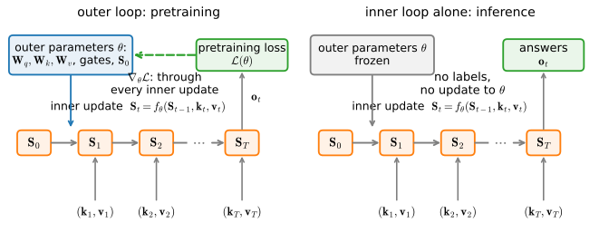

# Learning at Test Time
:label:`sec_test-time-regression`

The memories of this chapter were built as architectures: an outer-product
write, a ladder of decays, a delta-rule edit. This section rebuilds them as
statistics. The claim, made precise by :citet:`Wang.Shi.Fox.2025`, is that
every one of these layers is solving a *regression problem at test time*:
as tokens arrive, the layer fits a small regressor to the (key, value)
pairs it has seen, and it answers each query by evaluating the fit. Under
this reading an architecture is nothing but three choices, how past pairs
are weighted, which function class the regressor comes from, and how hard
the fit is pursued, and the models we have met occupy corners of that
design cube. Two corners we have not met fall out of the same view: a
state update whose gate is *derived* rather than designed (Longhorn), and
a memory that is itself a small neural network adapted inside the forward
pass (Titans). We end where a regression view must end, with data whose
distribution drifts, where forgetting becomes a statistical necessity.

*Prerequisites: attention as kernel regression
(:numref:`sec_attention-pooling`), the matrix-state family and its
capacity law (:numref:`sec_matrix-state`), the delta rule
(:numref:`sec_deltanet`), and gradient descent with momentum and weight
decay (:numref:`chap_optimization`). Every experiment in this section runs
on a CPU.*

We start small, though, with a thread left hanging in
:numref:`sec_attention-pooling`: a regression estimator with exactly one
parameter, and the question of how to learn it.

```{.python .input #test-time-regression-learning-at-test-time}
%%tab pytorch
%matplotlib inline
from d2l import torch as d2l
import numpy as np
import torch
from torch import nn
from torch.func import functional_call, grad
```

```{.python .input #test-time-regression-learning-at-test-time}
%%tab jax
%matplotlib inline
from d2l import jax as d2l
import jax
from jax import numpy as jnp
import numpy as np
```

## Learning the Bandwidth
:label:`subsec_ttr-bandwidth`

Recall where this book first met attention. In
:numref:`sec_attention-pooling` we estimated a noisy function by
Nadaraya--Watson regression :cite:`Nadaraya.1964,Watson.1964`: keys were
training inputs, values were their labels, and a Gaussian kernel turned
each query into a weighted average of nearby values,
:eqref:`eq_nadaraya-watson`. Nothing was learned. The one knob, the kernel
bandwidth $\sigma$, we swept by hand, and the section closed by asking
what would happen if we learned it by gradient descent instead, warning
that the obvious approach hides a trap. That exercise has waited long
enough; we answer it now, because the answer, scaled up, is this
section.

### A Fixed Kernel, Revisited

We regenerate the dataset of :numref:`sec_attention-pooling`, forty
observations of $y = 2\sin(x) + x$ under unit Gaussian noise, and the
four-line estimator, which returns its attention-weight matrix alongside
the fit. Sweeping the same three bandwidths and scoring against the
noise-free function confirms what the fit curves showed there: the narrow
kernel chases noise, the wide one oversmooths, and a mid-range bandwidth
does best.

```{.python .input #test-time-regression-a-fixed-kernel-revisited}
%%tab pytorch
torch.manual_seed(0)
n = 40
x_train, _ = torch.sort(torch.rand(n) * 5)
y_train = 2 * torch.sin(x_train) + x_train + torch.randn(n)
x_val = torch.arange(0, 5, 0.1)
y_val = 2 * torch.sin(x_val) + x_val

def nadaraya_watson(x_train, y_train, x_val, sigma):
    dists = x_train[:, None] - x_val[None, :]
    k = torch.exp(-dists**2 / (2 * sigma**2))
    attention_w = k / k.sum(0)          # Normalize over keys for each query
    return y_train @ attention_w, attention_w

for sigma in (0.1, 0.5, 2.0):
    est, _ = nadaraya_watson(x_train, y_train, x_val, sigma)
    print(f'sigma = {sigma}: MSE against the noise-free function '
          f'{float(((est - y_val)**2).mean()):.3f}')
```

```{.python .input #test-time-regression-a-fixed-kernel-revisited}
%%tab jax
key1, key2 = jax.random.split(jax.random.key(0))
n = 40
x_train = jnp.sort(jax.random.uniform(key1, (n,)) * 5)
y_train = 2 * jnp.sin(x_train) + x_train + jax.random.normal(key2, (n,))
x_val = jnp.arange(0, 5, 0.1)
y_val = 2 * jnp.sin(x_val) + x_val

def nadaraya_watson(x_train, y_train, x_val, sigma):
    dists = x_train[:, None] - x_val[None, :]
    k = jnp.exp(-dists**2 / (2 * sigma**2))
    attention_w = k / k.sum(0)          # Normalize over keys for each query
    return y_train @ attention_w, attention_w

for sigma in (0.1, 0.5, 2.0):
    est, _ = nadaraya_watson(x_train, y_train, x_val, sigma)
    print(f'sigma = {sigma}: MSE against the noise-free function '
          f'{float(((est - y_val)**2).mean()):.3f}')
```

### Learning It, Without Cheating

To learn the bandwidth we make it a parameter. Writing $w = 1/\sigma$ and
folding it into the Gaussian kernel of :eqref:`eq_nadaraya-watson` gives a
one-parameter regression model,

$$
f(x) = \sum_{i=1}^{n}
\frac{\exp\big(-\tfrac{1}{2}\, ((x - x_i)\, w)^2\big)}
     {\sum_{j=1}^{n} \exp\big(-\tfrac{1}{2}\, ((x - x_j)\, w)^2\big)}\; y_i,
$$
:eqlabel:`eq_ttr-parametric-nw`

and the training loss is the squared error on the training points
themselves. Here is the trap the exercise warned about: each $y_i$ enters
the computation of $f(x_i)$. Driving $w \to \infty$ shrinks the kernel
until every training point attends only to itself, the training error
drops to zero, and the estimator degenerates into a lookup table that has
learned nothing about the function between the points. The fix is
*leave-one-out* construction: when predicting at $x_i$, the model may use
every training pair except $(x_i, y_i)$. Below, each row of `keys` and
`values` holds the other $n-1$ points, built by masking the diagonal of a
tiled copy of the data. Five epochs of plain gradient descent on the one
scalar then suffice.

```{.python .input #test-time-regression-learning-it-without-cheating}
%%tab pytorch
mask = ~torch.eye(n, dtype=torch.bool)
keys = x_train.repeat(n, 1)[mask].reshape(n, n - 1)    # Row i omits x_i
values = y_train.repeat(n, 1)[mask].reshape(n, n - 1)  # Row i omits y_i

w = torch.ones(1, requires_grad=True)
for epoch in range(5):
    attn = torch.softmax(-((x_train[:, None] - keys) * w)**2 / 2, dim=1)
    loss = ((attn * values).sum(1) - y_train).pow(2).mean()
    loss.backward()
    with torch.no_grad():
        w -= 0.5 * w.grad
        w.grad = None
    print(f'epoch {epoch + 1}: leave-one-out loss {float(loss.detach()):.3f}, '
          f'w = {float(w.detach()):.3f}')
w = w.detach()
assert float(w) > 1.0                   # Learning sharpened the kernel
print(f'learned bandwidth 1/w = {1 / float(w):.3f}')
```

```{.python .input #test-time-regression-learning-it-without-cheating}
%%tab jax
mask = ~jnp.eye(n, dtype=bool)
keys = jnp.tile(x_train, (n, 1))[mask].reshape(n, n - 1)    # Row i omits x_i
values = jnp.tile(y_train, (n, 1))[mask].reshape(n, n - 1)  # Row i omits y_i

def loo_loss(w):
    attn = jax.nn.softmax(-((x_train[:, None] - keys) * w)**2 / 2, axis=1)
    return (((attn * values).sum(1) - y_train)**2).mean()

w = jnp.ones(())
for epoch in range(5):
    loss, g = jax.value_and_grad(loo_loss)(w)
    w -= 0.5 * g
    print(f'epoch {epoch + 1}: leave-one-out loss {float(loss):.3f}, '
          f'w = {float(w):.3f}')
assert float(w) > 1.0                   # Learning sharpened the kernel
print(f'learned bandwidth 1/w = {1 / float(w):.3f}')
```

The loss falls every epoch and $w$ climbs well past its initialization at
$1$: gradient descent finds, in five steps, a bandwidth in the same region
the hand sweep picked. That is the answer to the exercise, but the plots
say it better.

### What Learning Sharpened

```{.python .input #test-time-regression-what-learning-sharpened-1}
%%tab pytorch
est_fixed, attn_fixed = nadaraya_watson(x_train, y_train, x_val, 1.0)
est_learned, attn_learned = nadaraya_watson(x_train, y_train, x_val,
                                            1 / float(w))
d2l.plot(x_val, [est_fixed, est_learned, y_val], 'x', 'y',
         legend=['sigma = 1 (before)', 'learned sigma (after)', 'truth'])
d2l.plt.plot(x_train, y_train, 'o', alpha=0.4);
```

```{.python .input #test-time-regression-what-learning-sharpened-1}
%%tab jax
est_fixed, attn_fixed = nadaraya_watson(x_train, y_train, x_val, 1.0)
est_learned, attn_learned = nadaraya_watson(x_train, y_train, x_val,
                                            1 / float(w))
d2l.plot(x_val, [est_fixed, est_learned, y_val], 'x', 'y',
         legend=['sigma = 1 (before)', 'learned sigma (after)', 'truth'])
d2l.plt.plot(x_train, y_train, 'o', alpha=0.4);
```

The learned fit bends where the function bends, recovering the rise and
the crest that the $\sigma = 1$ fit smooths away, at the price of
following the noise a little more closely. The attention weights show the
mechanism:

```{.python .input #test-time-regression-what-learning-sharpened-2}
%%tab pytorch
d2l.show_heatmaps(torch.stack([attn_fixed.T, attn_learned.T])[None],
                  xlabel='Training inputs (keys)',
                  ylabel='Validation inputs (queries)',
                  titles=['before (sigma = 1)', 'after (learned)'],
                  figsize=(7, 3))
```

```{.python .input #test-time-regression-what-learning-sharpened-2}
%%tab jax
d2l.show_heatmaps(jnp.stack([attn_fixed.T, attn_learned.T])[None],
                  xlabel='Training inputs (keys)',
                  ylabel='Validation inputs (queries)',
                  titles=['before (sigma = 1)', 'after (learned)'],
                  figsize=(7, 3))
```

The region of large attention weights becomes sharper once the bandwidth
is learned: each query concentrates on fewer, closer keys. One scalar,
five epochs, and the estimator has adapted its notion of similarity to
the data it serves. Keep the shape of what just happened in view, a
*regression estimator whose fit we tuned by gradient descent on the data
it will be queried on*, because every memory in this chapter turns out to
be an instance of it.

## One Recipe
:label:`subsec_ttr-recipe`

Now the general statement. An autoregressive sequence layer receives, by
time $t$, the pairs $(\mathbf{k}_1, \mathbf{v}_1), \ldots, (\mathbf{k}_t,
\mathbf{v}_t)$ and must answer the query $\mathbf{q}_t$. Following
:citet:`Wang.Shi.Fox.2025`, treat this as two operations. *Memorize*: fit
a regressor $m_t$ from a function class $\mathcal{M}$ to the observed
pairs, weighting pair $i$ by $\gamma_i^{(t)} \ge 0$. *Retrieve*: evaluate
it at the query.

$$
m_t \;=\; \mathop{\mathrm{argmin}}_{m \in \mathcal{M}}\;
\frac{1}{2} \sum_{i \le t} \gamma_i^{(t)}
\big\| \mathbf{v}_i - m(\mathbf{k}_i) \big\|^2,
\qquad
\mathbf{o}_t \;=\; m_t(\mathbf{q}_t).
$$
:eqlabel:`eq_ttr-memorize`

The regression is solved afresh at every step, on the sequence being
processed: it is learning *at test time*. That phrase needs one
distinction kept sharp, because two learning loops are involved — an
outer loop that trains the layer and an inner loop that runs inside it —
and :numref:`subsec_ttr-two-loops` fixes the vocabulary before we lean on
it. A layer is then specified by three choices:

1. **The weights** $\gamma_i^{(t)}$: which past pairs count, and by how
   much.
2. **The function class** $\mathcal{M}$: what kinds of key-to-value
   association can be represented.
3. **The solver**: how close to the argmin the layer actually gets, given
   that it must run inside a forward pass.

What makes this more than a taxonomy is that every model of the last
three sections drops out of :eqref:`eq_ttr-memorize` as a corner of this
cube, and the derivations are one or two lines each.

**Softmax attention is the Nadaraya--Watson estimator.** Let
$\mathcal{M}$ be nonparametric: around each query, fit the best *local
constant*, with pair $i$ weighted by a kernel $s(\mathbf{k}_i,
\mathbf{q}_t)$. Setting the derivative of
$\sum_i s(\mathbf{k}_i, \mathbf{q}_t)\, \|\mathbf{v}_i - \mathbf{c}\|^2$
with respect to $\mathbf{c}$ to zero gives
$\mathbf{o}_t = \sum_i s(\mathbf{k}_i, \mathbf{q}_t)\, \mathbf{v}_i /
\sum_j s(\mathbf{k}_j, \mathbf{q}_t)$, which is
:eqref:`eq_nadaraya-watson` verbatim. Choose the kernel
$s(\mathbf{k}, \mathbf{q}) = \exp(\mathbf{k}^\top \mathbf{q} / \sqrt{d})$
and this is *exactly* the softmax-attention readout of
:numref:`chap_attention`. The loop opened there is now closed in both
directions: we introduced attention through kernel regression as an
analogy, and the analogy was an identity all along. Softmax attention
memorizes by keeping every pair and smoothing among them at query time;
its "state" is the whole history, which is why its cache grows and a
recurrence's does not.

**Linear attention is least squares with a term deleted.** Let
$\mathcal{M}$ be linear maps $m(\mathbf{k}) = \mathbf{S}^\top \mathbf{k}$
with uniform weights. Stack the keys as the rows of $\mathbf{K}_t \in
\mathbb{R}^{t \times d_k}$ and the values as the rows of $\mathbf{V}_t
\in \mathbb{R}^{t \times d_v}$. The minimizers of
:eqref:`eq_ttr-memorize` solve the normal equations
$\mathbf{K}_t^\top \mathbf{K}_t\, \mathbf{S} = \mathbf{K}_t^\top
\mathbf{V}_t$, where the $d_k \times d_k$ key covariance
$\mathbf{K}_t^\top \mathbf{K}_t$ has rank at most $\min(t, d_k)$ — early
in the sequence it is necessarily singular, so the well-posed statements
come first: the minimum-norm solution through the pseudoinverse, or a
ridge term,

$$
\mathbf{S}_t^\star
= \mathbf{K}_t^{+} \mathbf{V}_t
= \lim_{\lambda \downarrow 0}\,
\big( \mathbf{K}_t^\top \mathbf{K}_t + \lambda \mathbf{I} \big)^{-1}
\mathbf{K}_t^\top \mathbf{V}_t,
$$
:eqlabel:`eq_ttr-least-squares`

with the plain inverse
$(\mathbf{K}_t^\top \mathbf{K}_t)^{-1} \mathbf{K}_t^\top \mathbf{V}_t$
legitimate once the covariance has full rank.

Now suppose the design is *white*: $\mathbf{K}_t^\top \mathbf{K}_t
\approx \mathbf{I}$, that is, the columns of $\mathbf{K}_t$ are
approximately orthonormal — the keys, in aggregate, have identity
covariance. (This is a statement about the $d_k$ columns of the design,
not about the $t$ stored keys being mutually orthogonal; for $t > d_k$
the rows cannot all be orthonormal.) Then the inverse disappears:
$\mathbf{S}_t = \mathbf{K}_t^\top \mathbf{V}_t = \sum_{i \le t}
\mathbf{k}_i \mathbf{v}_i^\top$, the running outer-product state of
:eqref:`eq_ms-recurrence` with identity transition. Linear attention is a
memory that skips the covariance correction, and the price of the skipped
term is the interference sum of :eqref:`eq_ms-retrieval-error`. Note the
statistical character of that price: for random independent keys the
cross-talk is zero *in expectation*, so the capacity ceiling measured in
:numref:`subsec_ms-capacity` is interference *variance*, not a systematic
bias.

**Decay is a choice of weights.** Set $\gamma_i^{(t)} =
\prod_{j=i+1}^{t} \gamma_j$ with per-token discounts $\gamma_j \in (0,
1]$ and keep everything else: :eqref:`eq_ttr-memorize` becomes a
*weighted* least-squares problem whose shortcut solution accumulates
decayed outer products, which is the decay ladder of
:numref:`sec_matrix-state`, from RetNet's fixed scalar to the
input-dependent gates of Mamba-2 and GLA. This cashes the promise made
there, with the same fine print as above: writing
$\boldsymbol{\Gamma}_t = \mathrm{diag}(\gamma_1^{(t)}, \ldots,
\gamma_t^{(t)})$, the decayed state is the weighted cross-moment
$\mathbf{K}_t^\top \boldsymbol{\Gamma}_t \mathbf{V}_t$ — one half of the
sufficient pair for weighted least squares. The exact minimizer also
needs the weighted key covariance $\mathbf{K}_t^\top \boldsymbol{\Gamma}_t
\mathbf{K}_t$, and dropping it is the identical covariance-deletion
shortcut. Choosing the gate is choosing how fast evidence expires; we
will see at the end of this section *when* that choice is statistically
forced.

**The delta rule is a solver.** Keep the linear class and uniform
weights, but instead of solving, take one stochastic-gradient step on the
newest pair's loss at each token. That step *is* the DeltaNet update; the
identity, one gradient step on $\tfrac{1}{2}\|\mathbf{S}^\top \mathbf{k}_t
- \mathbf{v}_t\|^2$ versus the Hebbian write's blind accumulation, was
the substance of :numref:`sec_deltanet`, so we do not re-derive it here.
In the recipe's terms: DeltaNet differs from linear attention not in what
it remembers but in *how it fits*, an online solver with a per-token step
size $\beta_t$ in place of no solver at all. Running the same
gradient-descent solver for several passes, were the sequence to hold
still, would converge — from $\mathbf{S} = \mathbf{0}$ and with a small
enough step — to the minimum-norm least-squares memory
:eqref:`eq_ttr-least-squares`.

:numref:`tab_ttr-recipe` assembles the corners, including the two rows
this section still owes. The table is our reconstruction along the three
axes of :citet:`Wang.Shi.Fox.2025`; the delta-rule lineage traces back
through the fast weight programmers
:cite:`Schlag.Irie.Schmidhuber.2021`.

:One problem, many layers. Every row solves :eqref:`eq_ttr-memorize`; rows differ only in weights, function class, and solver. The last three rows are the remainder of this section.
:label:`tab_ttr-recipe`

| model | weights $\gamma_i^{(t)}$ | class $\mathcal{M}$ | solver |
|:--|:--|:--|:--|
| softmax attention (:numref:`chap_attention`) | kernel in the query, $s(\mathbf{k}_i, \mathbf{q}_t)$ | locally constant (nonparametric) | exact: Nadaraya--Watson |
| linear attention | uniform | linear $\mathbf{S}^\top \mathbf{k}$ | least squares minus $(\mathbf{K}^\top\mathbf{K})^{-1}$ |
| RetNet / GLA / Mamba-2 (:numref:`sec_matrix-state`) | geometric decay | linear | weighted least squares, same shortcut |
| DeltaNet (:numref:`sec_deltanet`) | uniform, write gated by $\beta_t$ | linear | one explicit SGD step per token |
| Longhorn | uniform, write gated by $\beta_t$ | linear | one *implicit* (proximal) step per token |
| Titans | weight decay $\alpha_t$ | deep MLP $\mathcal{M}_{\mathbf{W}}$ | SGD with momentum |
| batch ridge (reference) | uniform | linear in features | exact solve |

One further solver, recursive least squares, maintains the exact solution
of :eqref:`eq_ttr-least-squares` with a rank-one update per token; it
costs more state and more arithmetic than any row above, and the first
exercise places it on the table.

### Two Loops: What Learns When
:label:`subsec_ttr-two-loops`

"Learning at test time" invites a confusion this chapter cannot afford,
so we fix the vocabulary now. Two different quantities adapt, on two
different schedules (:numref:`fig_ttr-inner-outer`).

The **inner loop** is the regression of :eqref:`eq_ttr-memorize`. Its
variable is the layer's *state* — the matrix $\mathbf{S}_t$, or the
memory weights $\mathbf{W}_t$ of the Titans row — which starts fresh for
every sequence, is updated token by token by the layer's update rule, and
is discarded when the sequence ends. This loop runs during *every*
forward pass, in pretraining and at inference alike. At inference it is
the only loop running: the state adapts online with no labels, because
the regression targets are the values $\mathbf{v}_t$ that the sequence
itself supplies, and no parameter of the network changes.

The **outer loop** is ordinary pretraining. Its variables are the layer's
*learned parameters* $\theta$: the projections that produce
$\mathbf{q}_t, \mathbf{k}_t, \mathbf{v}_t$, the networks that emit gates
and step sizes ($\beta_t$, $\alpha_t$, and their kin), the state
initialization, and any coefficients of the update rule itself. These
receive gradients from the pretraining objective, and those gradients
flow *through* the inner updates: a forward pass chains $T$ state
updates, and backpropagation differentiates the loss through every one of
them. That is how a model learns to emit write strengths and decay rates
that make its inner regressor fit well — when :numref:`sec_deltanet`
trained delta-rule models end to end, the outer loop was shaping the
inner one.

So "no gradient at test time" is a statement about the outer loop only:
at inference $\theta$ is frozen and no pretraining objective exists,
while the inner state keeps adapting. The distinction applies verbatim to
every row of :numref:`tab_ttr-recipe` — DeltaNet, Longhorn, and Titans
differ in their inner update rules, and all three learn the coefficients
of those rules in the outer loop. Readers who know meta-learning will
recognize the two-level pattern: parameters optimized across sequences,
state adapted within one.


:label:`fig_ttr-inner-outer`

### The Spectrum, Measured
:label:`subsec_ttr-spectrum`

If the rows of :numref:`tab_ttr-recipe` really are one problem under
different solvers, we should be able to hold the problem fixed and watch
the solvers form a spectrum. We take one synthetic stream of eighty
$(x, y)$ pairs from a noisy nonlinear function, and lift $x$ into $128$
*random Fourier features* $\phi(x) = \sqrt{2/D}\,\cos(\mathbf{w} x +
\mathbf{b})$ with random $\mathbf{w}, \mathbf{b}$. Such features
approximate a Gaussian kernel, so a linear memory over $\phi$ is a
kernel regressor, and the delta rule in $\phi$-space is its online form;
this keeps every solver in the same function class while the problem
stays one-dimensional enough to plot. Then we answer the same queries
five ways: Nadaraya--Watson smoothing (softmax attention, no fitting at
all), online gradient descent over the stream with one, five, and thirty
passes (the delta rule, taken increasingly seriously as a solver), and
the exact batch ridge solve.

One alignment matters and is easy to get wrong: a solver spectrum is
meaningful only if every solver pursues the *same objective*. We
therefore give each online step the same $L2$ term the batch solve
carries — a small per-step shrink of the weights, the decoupled decay of
this chapter's gated cells — so that online gradient descent and the
batch solve are two solvers of one ridge problem, and "distance to the
optimum" means distance to that shared problem's minimizer.
Nadaraya--Watson stays what it has always been: a different *estimator
family*, with its own similarity and normalization, not an iteration
count of this solver. Alongside test error we record each parametric
fit's value of the shared objective and its distance to the batch
solution on the query grid, the direct measures of how far along the
spectrum a solver sits.

```{.python .input #test-time-regression-the-spectrum-measured-1}
%%tab pytorch
torch.manual_seed(1)
n_ctx, num_feats, lam = 80, 128, 1e-2
x_ctx = torch.rand(n_ctx) * 6 - 3
y_ctx = torch.sin(1.5 * x_ctx) + 0.3 * x_ctx + 0.35 * torch.randn(n_ctx)
x_q = torch.linspace(-3, 3, 400)
y_q = torch.sin(1.5 * x_q) + 0.3 * x_q
w_feat = torch.randn(num_feats)
b_feat = torch.rand(num_feats) * 2 * torch.pi

def phi(x):                                  # Random Fourier features
    return torch.cos(x[:, None] * w_feat + b_feat) * (2 / num_feats)**0.5

def nw_attention(x_q, sigma=0.12):           # Softmax attention over the pairs
    logits = -(x_q[:, None] - x_ctx[None, :])**2 / (2 * sigma**2)
    return torch.softmax(logits, dim=1) @ y_ctx

feats = phi(x_ctx)

def objective(w):                            # The one shared ridge objective
    return float(0.5 * ((feats @ w - y_ctx)**2).sum() + 0.5 * lam * (w @ w))

def online_gd(passes, beta=0.06):            # Delta rule + per-step decay
    w_hat = torch.zeros(num_feats)
    for _ in range(passes):
        for f, v in zip(feats, y_ctx):       # SGD steps on the same objective
            w_hat = w_hat + beta * ((v - w_hat @ f) * f - lam / n_ctx * w_hat)
    return w_hat

w_batch = torch.linalg.solve(                # Exact minimizer, same objective
    feats.T @ feats + lam * torch.eye(num_feats), feats.T @ y_ctx)
f_batch = phi(x_q) @ w_batch

ws = {f'online GD, {p} pass' + ('es' if p > 1 else ''): online_gd(p)
      for p in (1, 5, 30)}
fits = {'Nadaraya-Watson': nw_attention(x_q)}
fits.update({name: phi(x_q) @ w for name, w in ws.items()})
fits['batch ridge'] = f_batch
objs = {name: objective(w) for name, w in ws.items()}
objs['batch ridge'] = objective(w_batch)
dist = {name: float(((f - f_batch)**2).mean()**0.5) for name, f in fits.items()}
print(f'{"solver":>22} {"test MSE":>9} {"objective":>10} {"dist to opt":>12}')
for name, f in fits.items():
    obj = f'{objs[name]:>10.3f}' if name in objs else f'{"--":>10}'
    print(f'{name:>22} {float(((f - y_q)**2).mean()):>9.3f} {obj} '
          f'{dist[name]:>12.3f}')
gd_names = [k for k in fits if k.startswith('online')]
gd, og = [dist[k] for k in gd_names], [objs[k] for k in gd_names]
assert gd[0] > gd[1] > gd[2]         # More solving moves closer to the optimum
assert og[0] > og[1] > og[2] > objs['batch ridge']   # On the SAME objective
assert float(((f_batch - y_q)**2).mean()) < \
    float(((fits['online GD, 1 pass'] - y_q)**2).mean())
```

```{.python .input #test-time-regression-the-spectrum-measured-1}
%%tab jax
kc, kn, kw, kb = jax.random.split(jax.random.key(1), 4)
n_ctx, num_feats, lam = 80, 128, 1e-2
x_ctx = jax.random.uniform(kc, (n_ctx,)) * 6 - 3
y_ctx = (jnp.sin(1.5 * x_ctx) + 0.3 * x_ctx
         + 0.35 * jax.random.normal(kn, (n_ctx,)))
x_q = jnp.linspace(-3, 3, 400)
y_q = jnp.sin(1.5 * x_q) + 0.3 * x_q
w_feat = jax.random.normal(kw, (num_feats,))
b_feat = jax.random.uniform(kb, (num_feats,)) * 2 * jnp.pi

def phi(x):                                  # Random Fourier features
    return jnp.cos(x[:, None] * w_feat + b_feat) * (2 / num_feats)**0.5

def nw_attention(x_q, sigma=0.12):           # Softmax attention over the pairs
    logits = -(x_q[:, None] - x_ctx[None, :])**2 / (2 * sigma**2)
    return jax.nn.softmax(logits, axis=1) @ y_ctx

feats = phi(x_ctx)

def objective(w):                            # The one shared ridge objective
    return float(0.5 * ((feats @ w - y_ctx)**2).sum() + 0.5 * lam * (w @ w))

def online_gd(passes, beta=0.06):            # Delta rule + per-step decay
    def step(w_hat, fv):
        f, v = fv                            # SGD steps on the same objective
        return w_hat + beta * ((v - w_hat @ f) * f - lam / n_ctx * w_hat), None
    w_hat = jnp.zeros(num_feats)
    for _ in range(passes):
        w_hat, _ = jax.lax.scan(step, w_hat, (feats, y_ctx))
    return w_hat

w_batch = jnp.linalg.solve(                  # Exact minimizer, same objective
    feats.T @ feats + lam * jnp.eye(num_feats), feats.T @ y_ctx)
f_batch = phi(x_q) @ w_batch

ws = {f'online GD, {p} pass' + ('es' if p > 1 else ''): online_gd(p)
      for p in (1, 5, 30)}
fits = {'Nadaraya-Watson': nw_attention(x_q)}
fits.update({name: phi(x_q) @ w for name, w in ws.items()})
fits['batch ridge'] = f_batch
objs = {name: objective(w) for name, w in ws.items()}
objs['batch ridge'] = objective(w_batch)
dist = {name: float(((f - f_batch)**2).mean()**0.5) for name, f in fits.items()}
print(f'{"solver":>22} {"test MSE":>9} {"objective":>10} {"dist to opt":>12}')
for name, f in fits.items():
    obj = f'{objs[name]:>10.3f}' if name in objs else f'{"--":>10}'
    print(f'{name:>22} {float(((f - y_q)**2).mean()):>9.3f} {obj} '
          f'{dist[name]:>12.3f}')
gd_names = [k for k in fits if k.startswith('online')]
gd, og = [dist[k] for k in gd_names], [objs[k] for k in gd_names]
assert gd[0] > gd[1] > gd[2]         # More solving moves closer to the optimum
assert og[0] > og[1] > og[2] > objs['batch ridge']   # On the SAME objective
assert float(((f_batch - y_q)**2).mean()) < \
    float(((fits['online GD, 1 pass'] - y_q)**2).mean())
```

The spectrum lands as the recipe predicts, and every parametric row is
now graded on one scale. A single online pass, the budget an actual
recurrent layer gets, visibly underfits: its test error is several times
the batch solve's. More passes improve both solver columns
monotonically — the shared objective falls toward the batch value, and
the distance to the batch fit shrinks severalfold from one pass to
thirty; the asserts pin these orderings rather than the digits, which
move with the seed. One reading of the table deserves care: the
"optimum" is the minimizer of the *training* objective, and on *test*
error an unconverged iterate can land near it, in some of our runs
slightly below it — stopping a solver early acts as a regularizer, so
the objective column, not the test column, is what orders the solvers.
Nadaraya--Watson sits off the parametric axis entirely, competitive in
error yet fitting nothing, because it keeps all eighty pairs and smooths
at query time. The three characters are easiest to tell apart by their
fits:

```{.python .input #test-time-regression-the-spectrum-measured-2}
%%tab pytorch
d2l.plot(x_q, [fits['Nadaraya-Watson'], fits['online GD, 1 pass'],
               fits['batch ridge'], y_q], 'x', 'y',
         legend=['Nadaraya-Watson', 'online GD, 1 pass', 'batch ridge',
                 'truth'])
d2l.plt.plot(x_ctx, y_ctx, 'o', alpha=0.3);
```

```{.python .input #test-time-regression-the-spectrum-measured-2}
%%tab jax
d2l.plot(x_q, [fits['Nadaraya-Watson'], fits['online GD, 1 pass'],
               fits['batch ridge'], y_q], 'x', 'y',
         legend=['Nadaraya-Watson', 'online GD, 1 pass', 'batch ridge',
                 'truth'])
d2l.plt.plot(x_ctx, y_ctx, 'o', alpha=0.3);
```

The kernel smoother is locally faithful and slightly ragged, the one-pass
delta fit is smooth but shallow, still pulled toward zero where it has
not finished learning, and the batch solve threads the noise. Every
sequence layer in :numref:`tab_ttr-recipe` is a point on this picture,
chosen under a hard constraint the picture leaves out: the solver must
run once per token, forward-only, in constant memory. Which raises a
question the delta rule left open. If one *explicit* gradient step is the
best a streaming solver can afford, is the step size $\beta_t$ doomed to
be a designed, learned gate, or can the optimization view do better?

## Deriving the Gate: Longhorn
:label:`subsec_ttr-longhorn`

There is a classical answer: replace the explicit gradient step with an
*implicit* one, also called a proximal step. Rather than stepping along
the gradient at the old state, ask directly for the state that best
balances staying close to what we knew against fitting the newest pair,
and solve that subproblem exactly. Longhorn :cite:`Liu.Wang.Wu.ea.2024`
builds a state space model from precisely this update. Per output
channel, with state $\mathbf{s} \in \mathbb{R}^{d_k}$ (a column of the
matrix state) and target $v_t$,

$$
\mathbf{s}_t
= \mathop{\mathrm{argmin}}_{\mathbf{s}}\;
\big\| \mathbf{s} - \mathbf{s}_{t-1} \big\|^2
+ \beta_t \big( \mathbf{s}^\top \mathbf{k}_t - v_t \big)^2 ,
$$
:eqlabel:`eq_ttr-longhorn-objective`

where $\beta_t \ge 0$ sets how much the new evidence matters. The
subproblem looks like it needs a matrix inverse per token. It does not.

**Proposition.** The unique minimizer of
:eqref:`eq_ttr-longhorn-objective` is

$$
\mathbf{s}_t
= \big( \mathbf{I} - \Delta_t\, \mathbf{k}_t \mathbf{k}_t^\top \big)\,
\mathbf{s}_{t-1} + \Delta_t\, v_t\, \mathbf{k}_t,
\qquad
\Delta_t = \frac{\beta_t}{1 + \beta_t\, \mathbf{k}_t^\top \mathbf{k}_t}.
$$
:eqlabel:`eq_ttr-longhorn-gate`

**Proof.** The objective is strictly convex, so setting its gradient to
zero characterizes the minimizer:
$(\mathbf{I} + \beta_t \mathbf{k}_t \mathbf{k}_t^\top)\, \mathbf{s} =
\mathbf{s}_{t-1} + \beta_t v_t \mathbf{k}_t$. By the Sherman--Morrison
identity, $(\mathbf{I} + \beta_t \mathbf{k}_t \mathbf{k}_t^\top)^{-1} =
\mathbf{I} - \Delta_t \mathbf{k}_t \mathbf{k}_t^\top$ with $\Delta_t$ as
stated; multiplying out and collecting terms gives
:eqref:`eq_ttr-longhorn-gate`. $\blacksquare$

Look at what emerged. The update has exactly the delta-rule shape of
:numref:`sec_deltanet`, erase along the key, write the correction, but
the functional *form* of its step size $\Delta_t$ was not designed: it
fell out of the algebra. What remains learned is the coefficient that
drives it — the model emits $\beta_t$, and $\Delta_t = \beta_t / (1 +
\beta_t \mathbf{k}_t^\top \mathbf{k}_t)$ inherits that data dependence.
And the derived form arrives with guarantees the explicit step lacks.
Since $\Delta_t\, \mathbf{k}_t^\top \mathbf{k}_t = \beta_t
\mathbf{k}_t^\top \mathbf{k}_t / (1 + \beta_t \mathbf{k}_t^\top
\mathbf{k}_t) < 1$ for every $\beta_t \ge 0$, the transition's eigenvalue
along the key stays in $(0, 1]$: the implicit step can approach a full
overwrite as $\beta_t \to \infty$ but can never overshoot into
instability, no matter what the network emits for $\beta_t$. The explicit
delta rule buys stability by constraining its gate to a bounded range;
the implicit rule is stable by construction. For small $\beta_t$,
$\Delta_t \approx \beta_t$ and the two rules coincide. Compare the state
transition of :numref:`sec_mamba`, whose input-dependent gate is a
carefully chosen parameterization, a good *design*; here the *form* of
the gate is a theorem, and only its coefficient is left to the model to
learn. The distinction is worth having because derived
updates generalize: change the objective and the machinery re-derives the
architecture, which is exactly how the models of the next subsection
arise. Longhorn's authors report that this single change, the implicit
step, matches or improves Mamba at equal size on language modeling,
with better sample efficiency and extrapolation to contexts far past the
training length :cite:`Liu.Wang.Wu.ea.2024`.

The proposition is checkable in a few lines, and we should check it: we
compare the closed form against a linear solve of the stationarity system
over random instances, and against brute-force minimization of
:eqref:`eq_ttr-longhorn-objective` by gradient descent, which, run to
convergence, must land on the same point the closed form reaches in one
step.

```{.python .input #test-time-regression-deriving-the-gate-longhorn}
%%tab pytorch
def prox_step(s, k, v, beta):
    """Closed form for argmin ||s - s_prev||^2 + beta (s^T k - v)^2."""
    delta = beta / (1 + beta * (k @ k))
    return s - delta * (k @ s) * k + delta * v * k

torch.manual_seed(0)
dev_solve = dev_gd = 0.0
for trial in range(200):
    d = int(torch.randint(2, 16, (1,)))
    s_prev, k = torch.randn(d), torch.randn(d)
    v, beta = float(torch.randn(())), float(torch.rand(())) * 5 + 0.1
    s_cf = prox_step(s_prev, k, v, beta)
    lhs = torch.eye(d) + beta * torch.outer(k, k)   # Stationarity system
    s_exact = torch.linalg.solve(lhs, s_prev + beta * v * k)
    dev_solve = max(dev_solve, float((s_cf - s_exact).abs().max()))
    if trial < 5:                        # Gradient descent on the objective
        s = s_prev.clone().requires_grad_(True)
        lr = 0.5 / (1 + beta * float(k @ k))
        for _ in range(2000):
            obj = ((s - s_prev)**2).sum() + beta * (s @ k - v)**2
            g, = torch.autograd.grad(obj, s)
            s = (s - lr * g).detach().requires_grad_(True)
        dev_gd = max(dev_gd, float((s_cf - s.detach()).abs().max()))
print(f'closed form vs linear solve, 200 instances: {dev_solve:.2e}')
print(f'closed form vs gradient descent, 5 instances: {dev_gd:.2e}')
assert dev_solve < 1e-4 and dev_gd < 1e-4
```

```{.python .input #test-time-regression-deriving-the-gate-longhorn}
%%tab jax
def prox_step(s, k, v, beta):
    """Closed form for argmin ||s - s_prev||^2 + beta (s^T k - v)^2."""
    delta = beta / (1 + beta * (k @ k))
    return s - delta * (k @ s) * k + delta * v * k

dev_solve = dev_gd = 0.0
for trial in range(200):
    kk = jax.random.split(jax.random.key(trial), 5)
    d = int(jax.random.randint(kk[0], (), 2, 16))
    s_prev = jax.random.normal(kk[1], (d,))
    k = jax.random.normal(kk[2], (d,))
    v = float(jax.random.normal(kk[3], ()))
    beta = float(jax.random.uniform(kk[4], ())) * 5 + 0.1
    s_cf = prox_step(s_prev, k, v, beta)
    lhs = jnp.eye(d) + beta * jnp.outer(k, k)       # Stationarity system
    s_exact = jnp.linalg.solve(lhs, s_prev + beta * v * k)
    dev_solve = max(dev_solve, float(jnp.abs(s_cf - s_exact).max()))
    if trial < 5:                        # Gradient descent on the objective
        def objective(s):
            return ((s - s_prev)**2).sum() + beta * (s @ k - v)**2
        lr = 0.5 / (1 + beta * float(k @ k))
        def descend(s, _):
            return s - lr * jax.grad(objective)(s), None
        s, _ = jax.lax.scan(descend, s_prev, None, length=2000)
        dev_gd = max(dev_gd, float(jnp.abs(s_cf - s).max()))
print(f'closed form vs linear solve, 200 instances: {dev_solve:.2e}')
print(f'closed form vs gradient descent, 5 instances: {dev_gd:.2e}')
assert dev_solve < 1e-4 and dev_gd < 1e-4
```

Agreement to floating-point tolerance, across dimensions and gate
strengths: two thousand explicit gradient steps arrive where the implicit
step lands in closed form. In the full model, $\beta_t$ (one per key
channel) is emitted by a linear projection of the token exactly as
DeltaNet emits its gate, and the layer trains in the same chunked
parallel forms as the rest of the family (:numref:`subsec_ms-chunked`).

## Deeper Memories: Titans
:label:`subsec_ttr-titans`

Two axes of the recipe remain unexplored. Every solver so far took plain
gradient steps, and every memory so far was a linear map. Titans
:cite:`Behrouz.Zhong.Mirrokni.2025` pushes both at once: the memory is a
*module* $\mathcal{M}_{\mathbf{W}}$, possibly a small MLP, and its
weights are trained during the forward pass by stochastic gradient
descent with momentum and weight decay, the full optimizer toolkit of
:numref:`chap_optimization` running inside the sequence dimension. On the
per-token recall loss $\ell(\mathbf{W}; \mathbf{k}_t, \mathbf{v}_t) =
\|\mathcal{M}_{\mathbf{W}}(\mathbf{k}_t) - \mathbf{v}_t\|^2$, the update
keeps a velocity $\mathbf{U}$ alongside the weights:

$$
\mathbf{U}_t = \eta_t\, \mathbf{U}_{t-1}
- \theta_t\, \nabla_{\mathbf{W}}\,
\ell(\mathbf{W}_{t-1}; \mathbf{k}_t, \mathbf{v}_t),
\qquad
\mathbf{W}_t = (1 - \alpha_t)\, \mathbf{W}_{t-1} + \mathbf{U}_t .
$$
:eqlabel:`eq_ttr-titans`

The paper reads the pieces psychologically, and the reading is useful.
The gradient is *momentary surprise*: it is large exactly when the memory
retrieves the wrong value for the current key. The momentum term
$\eta_t \mathbf{U}_{t-1}$ is *past surprise*, letting an unexpected event
keep writing for several tokens after it occurs. And the weight decay
$\alpha_t$ is *forgetting*, the whole memory fading at a controllable,
input-dependent rate. All three coefficients are emitted per token by the
network. Two familiar corners sit inside :eqref:`eq_ttr-titans`: with a
linear memory, no momentum ($\eta = 0$), and no forgetting
($\alpha = 0$), the gradient identity of :numref:`sec_deltanet` turns the
update into exactly the delta rule with $\beta_t = 2\theta_t$; and
$\alpha_t$ alone reproduces the decay ladder acting on weights instead of
a state matrix.

### A Linear Memory, By Hand
:label:`subsec_ttr-titans-linear`

For a linear memory the gradient is analytic,
$\nabla_{\mathbf{S}} \|\mathbf{S}^\top \mathbf{k} - \mathbf{v}\|^2 = 2\,
\mathbf{k} (\mathbf{S}^\top \mathbf{k} - \mathbf{v})^\top$, so the whole
Titans update runs in a dozen lines of NumPy with no autograd anywhere.
That gives us a clean instrument for a question the recipe raises: the
delta rule of the previous section was a *perfect* overwriter, holding
recall of the latest value near $1$ no matter how often keys were
rebound; momentum and forgetting change the solver, so do they change
that? We repeat the overwrite protocol, write $R$ values per key in
shuffled order over orthonormal keys, then query every key for its
*latest* value.

```{.python .input #test-time-regression-a-linear-memory-by-hand}
%%tab pytorch, jax
rng = np.random.default_rng(0)

def titans_linear(keys_seq, vals_seq, d=64, lr=0.5, eta=0.9, alpha=0.1):
    """Stream (key id, value id) pairs; return recall of each latest value."""
    key_mat = np.linalg.qr(rng.standard_normal((d, 8)))[0].T  # Orthonormal
    val_code = rng.standard_normal((32, d))
    val_code /= np.linalg.norm(val_code, axis=1, keepdims=True)
    S, U, latest = np.zeros((d, d)), np.zeros((d, d)), {}
    for i, j in zip(keys_seq, vals_seq):
        k, v = key_mat[i], val_code[j]
        latest[i] = j
        G = 2 * np.outer(k, S.T @ k - v)    # Analytic gradient: surprise
        U = eta * U - lr * G                # Momentum: past surprise
        S = (1 - alpha) * S + U             # Weight decay: forgetting
    hits = sum((val_code @ (S.T @ key_mat[i])).argmax() == j
               for i, j in latest.items())
    return hits / len(latest)

print(f'{"overwrites per key":>19} {"recall of latest":>17}')
recalls = []
for R in (1, 2, 4, 8):
    accs = []
    for _ in range(50):
        keys_seq = np.repeat(np.arange(8), R)
        vals_seq = rng.integers(0, 32, 8 * R)
        perm = rng.permutation(8 * R)
        accs.append(titans_linear(keys_seq[perm], vals_seq[perm]))
    recalls.append(np.mean(accs))
    print(f'{R:>19} {recalls[-1]:>17.3f}')
assert recalls[0] > 0.95 and recalls[-1] < 0.5
```

At one write per key, recall is perfect; at two it is still high;
by four and eight overwrites it collapses toward chance
(chance is about $0.03$ here). Momentum has made the memory a *softer*
overwriter than the pure delta rule, and the mechanism is visible in
:eqref:`eq_ttr-titans`: the surprise from an earlier binding persists in
$\mathbf{U}$ and keeps writing the superseded value for several more
steps, while $\alpha$ erodes keys that were never touched. This is a
teaching contrast, not a defect. Momentum smooths the fit across tokens,
which is the wrong bias when the stream rebinds keys adversarially and a
useful one when successive tokens carry consistent evidence, precisely
the regime this section's closing experiment, and one of the exercises,
return to.

### A Deep Memory via Autograd
:label:`subsec_ttr-titans-deep`

Why make the memory deep? Because the function class $\mathcal{M}$ is a
choice, and the linear choice has a hard ceiling: the capacity law of
:numref:`subsec_ms-capacity` is a statement about linear maps, at most
$d_k$ associations retrievable without interference, however clever the
solver. An MLP memory is not superposition-bound in the same way, and
Titans reports that deeper memories keep improving language modeling at
scale :cite:`Behrouz.Zhong.Mirrokni.2025`. The update
:eqref:`eq_ttr-titans` does not care what $\mathcal{M}_{\mathbf{W}}$ is;
only the gradient call changes, and for that we have autograd. The
functional gradient interfaces, `torch.func.grad` and `jax.grad`, fit the
task exactly, since the memory's weights are data now, one set per
sequence, not module state.

We initialize the output layer to zero, so the memory starts *empty*
(every key retrieves $\mathbf{0}$, just as $\mathbf{S} = \mathbf{0}$
does), then stream $64$ tokens in which each of $16$ associations recurs
four times in shuffled order, as facts recur in a document. Three lines
per token: gradient, velocity, write.

```{.python .input #test-time-regression-a-deep-memory-via-autograd}
%%tab pytorch
torch.manual_seed(0)
d_mem, h_mem, num_pairs = 32, 128, 16
k_pairs = nn.functional.normalize(torch.randn(num_pairs, d_mem), dim=-1)
v_pairs = nn.functional.normalize(torch.randn(num_pairs, d_mem), dim=-1)
order = torch.randperm(num_pairs * 4) % num_pairs   # Each pair recurs 4x

memory = nn.Sequential(nn.Linear(d_mem, h_mem), nn.GELU(),
                       nn.Linear(h_mem, d_mem))
with torch.no_grad():
    memory[0].weight.normal_(0, 1.0)    # Unit-variance hidden units
    memory[0].bias.zero_()
    memory[2].weight.zero_()            # Start empty: retrieve 0 everywhere
    memory[2].bias.zero_()

def recall_loss(params, k, v):
    return ((functional_call(memory, params, (k[None],))[0] - v)**2).sum()
grad_fn = grad(recall_loss)

def retrieval_mse(params):
    with torch.no_grad():
        pred = functional_call(memory, params, (k_pairs,))
    return float(((pred - v_pairs)**2).mean())

params = {name: p.detach().clone() for name, p in memory.named_parameters()}
velocity = {name: torch.zeros_like(p) for name, p in params.items()}
before = retrieval_mse(params)
theta, eta = 0.005, 0.5
for t in order.tolist():
    g = grad_fn(params, k_pairs[t], v_pairs[t])     # Surprise
    for name in params:
        velocity[name] = eta * velocity[name] - theta * g[name]
        params[name] = params[name] + velocity[name]
after = retrieval_mse(params)
print(f'retrieval MSE: empty memory {before:.4f} -> after the stream '
      f'{after:.4f}')
assert after < before / 5
```

```{.python .input #test-time-regression-a-deep-memory-via-autograd}
%%tab jax
d_mem, h_mem, num_pairs = 32, 128, 16
ks = jax.random.split(jax.random.key(3), 4)
k_pairs = jax.random.normal(ks[0], (num_pairs, d_mem))
k_pairs /= jnp.linalg.norm(k_pairs, axis=1, keepdims=True)
v_pairs = jax.random.normal(ks[1], (num_pairs, d_mem))
v_pairs /= jnp.linalg.norm(v_pairs, axis=1, keepdims=True)
order = jax.random.permutation(ks[2], jnp.tile(jnp.arange(num_pairs), 4))

params = {'W1': jax.random.normal(ks[3], (d_mem, h_mem)),  # Unit-var hidden
          'b1': jnp.zeros(h_mem),
          'W2': jnp.zeros((h_mem, d_mem)),  # Start empty: retrieve 0
          'b2': jnp.zeros(d_mem)}

def memory(params, k):
    hidden = jax.nn.gelu(k @ params['W1'] + params['b1'])
    return hidden @ params['W2'] + params['b2']

def recall_loss(params, k, v):
    return ((memory(params, k) - v)**2).sum()
grad_fn = jax.grad(recall_loss)

def retrieval_mse(params):
    return float(((memory(params, k_pairs) - v_pairs)**2).mean())

before = retrieval_mse(params)
theta, eta = 0.005, 0.5
def write(carry, t):
    params, velocity = carry
    g = grad_fn(params, k_pairs[t], v_pairs[t])     # Surprise
    velocity = jax.tree.map(lambda u, gg: eta * u - theta * gg, velocity, g)
    params = jax.tree.map(lambda p, u: p + u, params, velocity)
    return (params, velocity), None

velocity = jax.tree.map(jnp.zeros_like, params)
(params, _), _ = jax.lax.scan(write, (params, velocity), order)
after = retrieval_mse(params)
print(f'retrieval MSE: empty memory {before:.4f} -> after the stream '
      f'{after:.4f}')
assert after < before / 5
```

Retrieval error falls by more than an order of magnitude from the
empty-memory baseline, on a CPU, in well under a second: the inner loop
of :numref:`subsec_ttr-two-loops` ran alone, a fresh neural memory
adapting online inside what is conceptually a single forward pass over
$64$ tokens. Keep the two loops straight here: in this standalone demo
every outer quantity — the coefficients $\theta, \eta$, the
initialization — was set by hand, whereas in the full Titans model those
are outer-loop parameters, learned during pretraining together with the
projections that produce keys and values, so the model learns *how* its
memory should adapt. In the full architecture this neural memory is one
branch of a layer; Titans studies three ways of wiring it to attention,
as *context* (retrieved memories are prepended to the window that
attention reads, MAC), as a *gate* (the memory branch and a
sliding-window-attention branch are fused multiplicatively, MAG), or as a
*layer* (memory feeding attention in series, MAL), with the context
wiring strongest in their long-context evaluations. Wiring memories to
attention at the layer scale is exactly the hybrid question this
chapter closes with. Beyond Titans lies an active line of work on
richer test-time objectives and solvers, from TTT's mini-batch inner loop
:cite:`Sun.Li.Dalal.ea.2024` onward; the chapter's Resources section maps
it, and this book stops at the recipe.

## Regression That Tracks: the Forecasting Connection
:label:`subsec_ttr-tracking`

One question from the recipe is still open. The weights $\gamma_i^{(t)}$
are the *statistical* knob, and everything measured so far, capacity in
:numref:`subsec_ms-capacity`, the spectrum above, treated the stream as
stationary. For a fixed target, a linear model that contains it, and
constant parameters, uniform weights are then the efficient choice:
every observation is equally informative about the same quantity. So
when is decay not merely harmless but
*necessary*? When the quantity being regressed refuses to sit still. This
is the native habitat of forecasting, and it deserves a demonstration,
because it is the cleanest statistical argument for why sequence models
gate, decay, and adapt at test time at all.

Take a streaming linear regression whose ground truth *drifts*: targets
$v_t = \mathbf{w}^{*\top}_t \mathbf{k}_t + \epsilon_t$, where
$\mathbf{w}^*_t$ takes a small random step on the unit sphere at every
time step, a slow, relentless change of regime. We track it three ways,
all rows of :numref:`tab_ttr-recipe`. First, *uniform least squares*: the
exact solver over all history, our batch-ridge optimum streamed via its
sufficient statistics. Second, *decayed least squares*: the same exact
solver, but the statistics are discounted by $\gamma = 0.95$ per step,
weighted least squares, the statistical content of the decay ladder.
Third, the *implicit step* of :eqref:`eq_ttr-longhorn-gate` with fixed
$\beta$: no matrix solve at all, one $\mathcal{O}(d)$ update per token,
the derived gate doing its work.

```{.python .input #test-time-regression-regression-that-tracks-the-forecasting-connection}
%%tab pytorch, jax
rng = np.random.default_rng(2)
d, T, gamma, beta = 8, 2000, 0.95, 1.0
w_star = rng.standard_normal(d)
w_star /= np.linalg.norm(w_star)
stats_u = [np.zeros((d, d)), np.zeros(d)]   # Uniform sufficient statistics
stats_g = [np.zeros((d, d)), np.zeros(d)]   # Decayed sufficient statistics
s = np.zeros(d)                             # Implicit-step state
errs = {'uniform LS': [], 'decayed LS': [], 'implicit step': []}
ridge = 1e-6 * np.eye(d)
for t in range(T):
    w_star = w_star + 0.03 * rng.standard_normal(d)   # The world drifts
    w_star /= np.linalg.norm(w_star)
    k = rng.standard_normal(d) / np.sqrt(d)
    v = w_star @ k + 0.1 * rng.standard_normal()
    stats_u[0] += np.outer(k, k)
    stats_u[1] += v * k
    stats_g[0] = gamma * stats_g[0] + np.outer(k, k)
    stats_g[1] = gamma * stats_g[1] + v * k
    s = s + beta / (1 + beta * k @ k) * (v - s @ k) * k   # Derived gate
    for name, w_hat in (
            ('uniform LS', np.linalg.solve(stats_u[0] + ridge, stats_u[1])),
            ('decayed LS', np.linalg.solve(stats_g[0] + ridge, stats_g[1])),
            ('implicit step', s)):
        errs[name].append(np.linalg.norm(w_hat - w_star))

def smooth(e):
    return np.convolve(np.array(e), np.ones(50) / 50, mode='valid')

curves = [smooth(e) for e in errs.values()]
d2l.plot(np.arange(len(curves[0])), curves, 'step', 'tracking error',
         legend=list(errs))
tails = {name: float(np.mean(e[-500:])) for name, e in errs.items()}
print('mean error over the last 500 steps:',
      {name: round(v, 2) for name, v in tails.items()})
assert tails['uniform LS'] > 2 * tails['decayed LS']
assert tails['uniform LS'] > 2 * tails['implicit step']
```

The curves separate as the regression view predicts. For the
first few dozen steps the three trackers are indistinguishable, since
with little drift accumulated, all evidence is good evidence. Then
uniform least squares goes *stale*: its error climbs steadily and never
comes back, ending several times the others', because the estimator
keeps averaging in a world that no longer exists. Note what failed. The solver is exact; the function class
contains the truth; only the *weights* are wrong. Decayed least squares,
the same solver with expiring evidence, tracks the drift indefinitely,
and the implicit step tracks nearly as well with no solve, no matrix,
and a step size $\Delta_t$ it derived for itself.

This is the forecasting connection, and it is the last piece of the
chapter's argument. A sequence model predicting a nonstationary stream —
a market, a conversation — is this experiment writ large: it must
regress recent structure onto the present without being anchored by a
past that has expired. Decay implements a *belief about how fast the
world changes*. In the cell above that belief was ours, not the data's:
we fixed $\gamma = 0.95$ and $\beta = 1$ by hand, and a differently
paced drift would want different values. The trained models of this
chapter emit these coefficients per token — the input-dependent gates of
:numref:`sec_matrix-state`, the write strengths of :numref:`sec_deltanet`,
the surprise-driven learning rates of Titans — which is what lets the
data set its own discount, a capability this fixed-coefficient cell
motivates rather than demonstrates. The conclusion that the experiment
does support is the scoped one: forgetting reduces tracking error under
drift, at the price of statistical efficiency on stationary stretches.

**What this section's experiments do and do not show.** The bandwidth,
spectrum, Longhorn, Titans, and drift cells are identity checks and
mechanism illustrations on synthetic streams: they verify derivations
(the closed-form implicit step), exhibit solver behavior (underfit
approaching the shared optimum; momentum softening overwrites; staleness
under drift), and settle nothing about language modeling at scale. The
production-scale claims — which update rules ship, at what quality —
rest on the cited papers.

## Summary

This section replaced a zoo of architectures with one problem statement.
A sequence-mixing layer maintains an associative memory by solving the
weighted regression :eqref:`eq_ttr-memorize` at test time and answers
queries by evaluating the fit; a layer is fixed by its weights, its
function class, and its solver. Under that reading, softmax attention is
the Nadaraya--Watson estimator, the identity closing the loop opened when
this book introduced attention through kernel regression, and our opening
experiment learned the one parameter that classical estimator has, its
bandwidth, by leave-one-out gradient descent, sharpening its attention
weights. Linear attention is least squares with the key covariance
deleted, its capacity ceiling the interference of that deletion; decay
keeps the weighted cross-moment of a weighted least-squares problem; the
delta rule is one explicit gradient step, and the measured spectrum —
every parametric solver on one shared ridge objective — confirms that
more solving lands closer to that objective's optimum. Throughout, the
two-loop distinction of :numref:`subsec_ttr-two-loops` governs what
"learning at test time" means: the inner state adapts online in every
forward pass, while the outer parameters, the projections, gate
networks, and initializations, receive gradients only during
pretraining, flowing through the chain of inner updates. The two new
models were both *derived*: the *form* of Longhorn's gate $\Delta_t$ is
the closed-form implicit step of a per-token objective, its coefficient
$\beta_t$ still learned, stable by construction where explicit steps
must be clamped, and Titans adapts a deep memory online inside the
forward pass with momentum as persisting surprise and weight decay as
forgetting, a softer overwriter than the delta rule but an expressively
deeper one. Against a drifting target, exact uniform regression goes
stale while decayed and implicit solvers track, which is the statistical
reason forgetting exists. What none of these fixed-size memories can do,
recall an arbitrary needle from an arbitrarily long haystack, sets up the
chapter's closing question, how much genuine attention a model must keep,
in :numref:`sec_hybrids`.

## Exercises

1. **[short-code]** **Recursive least squares joins the table.** The
   exact solution
   :eqref:`eq_ttr-least-squares` can be maintained online: with
   $\mathbf{P}_t = (\mathbf{K}_t^\top \mathbf{K}_t + \lambda
   \mathbf{I})^{-1}$, use the Sherman--Morrison identity to derive the
   rank-one update of $\mathbf{P}_t$ and of the memory when
   $(\mathbf{k}_t, \mathbf{v}_t)$ arrives. Implement it on the spectrum
   problem of :numref:`subsec_ttr-spectrum` and verify that after one
   pass it matches the batch ridge fit to numerical precision. What does
   it cost per token in memory and arithmetic compared with the delta
   rule, and where does it sit in :numref:`tab_ttr-recipe`?
1. **[conceptual]** Derive :eqref:`eq_ttr-longhorn-gate` yourself: write
   the stationarity
   condition of :eqref:`eq_ttr-longhorn-objective`, apply
   Sherman--Morrison, and check the two limits $\beta_t \to 0$ (explicit
   gradient step) and $\beta_t \to \infty$ (exact interpolation of the
   newest pair). For unit-norm keys, what range does $\Delta_t$ cover?
1. **[short-code]** In :numref:`subsec_ttr-bandwidth`, remove the
   leave-one-out masking
   and train $w$ on the plain training error. Report where $w$ goes and
   what the fit looks like, then explain why a *causal* memory, which can
   only regress pairs from strictly earlier steps, gets the exclusion for
   free.
1. **[conceptual]** With unit-norm keys and queries, expand $\|\mathbf{q} -
   \mathbf{k}\|^2$ to show the Gaussian kernel of
   :eqref:`eq_ttr-parametric-nw` equals $\exp(\mathbf{q}^\top
   \mathbf{k}\, w^2)$ up to query-independent factors, so the learned
   bandwidth is a learned softmax temperature. Which normalization
   schemes in modern attention stacks make this correspondence exact?
1. **[short-code]** On the drifting stream of
   :numref:`subsec_ttr-tracking`, add momentum
   to the implicit tracker as in :eqref:`eq_ttr-titans`. Sweep $\eta \in
   \{0, 0.5, 0.9\}$ under (a) the random-walk drift above and (b) a
   *consistent* drift that rotates $\mathbf{w}^*_t$ steadily in a fixed
   plane. When does past surprise help, and why?
1. **[short-code]** In the spectrum experiment, the thirty-pass fit's
   distance to the batch solution is small but not zero. Explain the two
   remaining causes, the fixed step size $\beta$ and the finite number
   of passes over one fixed ordering of the stream, and check both by
   shrinking $\beta$ while increasing the passes. Then remove the $L2$
   term from the online steps only and rerun: the distance now stalls at
   a floor that no number of passes removes, because the online and
   batch solvers no longer share an objective. Which solution does plain
   online gradient descent from $\mathbf{w} = \mathbf{0}$ approach
   instead?

[Discussions](https://d2l.discourse.group/)

<!-- slides -->

::: {.slide}
::: {.cover}
[Dive into Deep Learning · §12.6]{.kicker}

Learning at test time<br>
**one regression problem · a spectrum of solvers · the gate, derived · memories that are networks · tracking a drifting world**
:::
:::

::: {.slide title="A thread from the attention chapter"}
Nadaraya–Watson regression: attention with a hand-picked kernel; one knob,
the bandwidth $\sigma$ — swept by hand, never learned.

$$f(x) = \sum_{i=1}^{n} \frac{\exp\big(-\tfrac{1}{2} ((x - x_i) w)^2\big)}{\sum_{j} \exp\big(-\tfrac{1}{2} ((x - x_j) w)^2\big)}\, y_i$$

. . .

The trap: $y_i$ enters $f(x_i)$ — driving $w \to \infty$ zeroes the
training error and learns nothing.

**Fix:** leave-one-out — predict each point from all the *others*.
:::

::: {.slide title="Five epochs, one parameter"}
Leave-one-out keys and values, plain gradient descent on the scalar $w$:

@!test-time-regression-learning-it-without-cheating

- The loss falls every epoch; $w$ climbs past its initialization at 1 —
  the learned bandwidth lands where the hand sweep pointed.
:::

::: {.slide title="What learning sharpened"}
@!test-time-regression-what-learning-sharpened-2

- The region of large attention weights becomes **sharper** once the
  bandwidth is learned; the learned $\sigma$ lands where the hand sweep
  pointed.
- A regression estimator, tuned by gradient descent on the data it
  serves. Hold that shape.
:::

::: {.slide title="One recipe"}
Memorize by regression, retrieve by evaluation (Wang, Shi & Fox 2025):

$$m_t = \mathop{\mathrm{argmin}}_{m \in \mathcal{M}} \frac{1}{2} \sum_{i \le t} \gamma_i^{(t)} \big\| \mathbf{v}_i - m(\mathbf{k}_i) \big\|^2, \qquad \mathbf{o}_t = m_t(\mathbf{q}_t)$$

Three choices fix a layer:

- **weights** $\gamma_i^{(t)}$ — which past counts
- **class** $\mathcal{M}$ — what associations are expressible
- **solver** — how hard to fit, once per token
:::

::: {.slide title="The reveal"}
| model | weights | class | solver |
|:--|:--|:--|:--|
| softmax attention | query kernel | nonparametric | exact (Nadaraya–Watson) |
| linear attention | uniform | linear | LS minus $(\mathbf{K}^\top\mathbf{K})^{-1}$ |
| RetNet / GLA / Mamba-2 | geometric decay | linear | weighted LS shortcut |
| DeltaNet | uniform, gated | linear | one explicit SGD step |
| Longhorn | uniform, gated | linear | one **implicit** step |
| Titans | weight decay | deep MLP | SGD + momentum |

. . .

Softmax attention **is** the Nadaraya–Watson estimator — ch. 10's analogy
was an identity. Linear attention's capacity ceiling = the interference
of the deleted covariance term (zero in expectation — variance, not
bias).
:::

::: {.slide title="Two loops: what learns when"}
{width=100%}

- **Inner loop**: the state $\mathbf{S}_t$ — fresh per sequence, adapts
  token by token, runs in *every* forward pass. No labels at inference:
  the targets are the sequence's own values.
- **Outer loop**: projections, gate networks, $\mathbf{S}_0$ — get
  gradients **through** the chain of inner updates; frozen at inference.
- Applies verbatim to DeltaNet, Longhorn, Titans.
:::

::: {.slide title="The spectrum, measured"}
One dataset, one feature space, one **shared ridge objective** — five
solvers:

@!test-time-regression-the-spectrum-measured-1

- One online pass underfits; more passes fall monotonically toward the
  optimum — in objective *and* in distance to the batch fit.
- Test error is not the objective: an unconverged iterate can edge past
  the optimum there (early stopping as a regularizer).
- Nadaraya–Watson: a different estimator family — it *fits nothing*, it
  keeps every pair.
:::

::: {.slide title="Three characters"}
@!test-time-regression-the-spectrum-measured-2

Kernel smoother: faithful, ragged. One-pass delta: smooth, shallow.
Batch solve: threads the noise. Every layer in the table is a point on
this picture — computed once per token, forward-only.
:::

::: {.slide title="Longhorn: the gate, derived"}
Implicit (proximal) step — solve the per-token subproblem *exactly*:

$$\mathbf{s}_t = \mathop{\mathrm{argmin}}_{\mathbf{s}} \|\mathbf{s} - \mathbf{s}_{t-1}\|^2 + \beta_t (\mathbf{s}^\top \mathbf{k}_t - v_t)^2$$

. . .

$$\mathbf{s}_t = (\mathbf{I} - \Delta_t \mathbf{k}_t \mathbf{k}_t^\top)\, \mathbf{s}_{t-1} + \Delta_t v_t \mathbf{k}_t, \qquad \Delta_t = \frac{\beta_t}{1 + \beta_t \mathbf{k}_t^\top \mathbf{k}_t}$$

- Delta-rule shape; the **form** of $\Delta_t$ is a theorem, its
  coefficient $\beta_t$ still learned. And
  $\Delta_t \mathbf{k}_t^\top \mathbf{k}_t < 1$ — stable for *any*
  $\beta_t$.
- Mamba parameterizes its gate; Longhorn derives the form and learns
  only the coefficient.
:::

::: {.slide title="Closed form == argmin"}
200 random instances against the exact linear solve; 5 against
brute-force gradient descent on the objective:

@!test-time-regression-deriving-the-gate-longhorn

- Two thousand explicit gradient steps arrive where the implicit step
  lands in closed form.
:::

::: {.slide title="Titans: surprise, momentum, forgetting"}
The memory is a **module**, adapted online during the forward pass (the
inner loop; the full model learns its coefficients in the outer loop):

$$\mathbf{U}_t = \eta_t \mathbf{U}_{t-1} - \theta_t \nabla_{\mathbf{W}} \ell(\mathbf{W}_{t-1}; \mathbf{k}_t, \mathbf{v}_t), \qquad \mathbf{W}_t = (1 - \alpha_t) \mathbf{W}_{t-1} + \mathbf{U}_t$$

- gradient = momentary surprise · momentum = past surprise ·
  weight decay = forgetting
- Linear memory, $\eta = \alpha = 0$: exactly the delta rule.

. . .

@!test-time-regression-a-linear-memory-by-hand

Momentum ⇒ a **softer overwriter** than pure delta — old surprise keeps
writing superseded values.
:::

::: {.slide title="A deep memory via autograd"}
@test-time-regression-a-deep-memory-via-autograd
:::

::: {.slide title="Regression that tracks"}
@!test-time-regression-regression-that-tracks-the-forecasting-connection

- Drifting truth $\mathbf{w}^*_t$: uniform LS goes **stale** — exact
  solver, right class, *wrong weights*.
- Decayed LS tracks; the implicit step tracks with no solve at all.
  Decay = a belief about how fast the world changes.
- Discount fixed by hand here ($\gamma = 0.95$); trained models emit it
  per token. Forgetting buys tracking under drift, costs efficiency on
  stationary stretches.
:::

::: {.slide title="Where this leaves the chapter"}
- One problem: memorize by weighted regression, retrieve at the query.
- Softmax attention = Nadaraya–Watson; linear attention = LS with a term
  deleted; decay = the weighted cross-moment of weighted LS; delta = one
  SGD step; Longhorn = the implicit step, gate form derived; Titans = a
  deep memory, optimizer inside.
- Forgetting is statistics, not housekeeping: stationary streams want
  uniform weights, drifting streams force decay.

. . .

Still missing: exact recall from an *unbounded* past.
**Hybrids — next.**
:::
