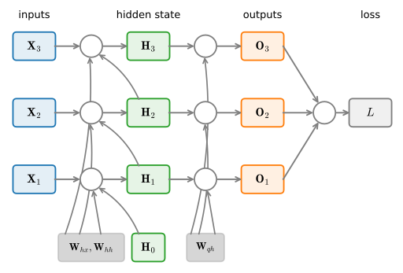
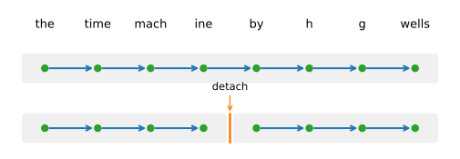

# Backpropagation Through Time
:label:`sec_bptt`

Gradient clipping, which you met in :numref:`sec_rnn-scratch`, is what keeps
the occasional enormous gradient from destabilizing RNN training, and we hinted
there that these blow-ups come from backpropagating across long sequences.
Before turning to the modern architectures of :numref:`chap_modern_rnn`, let us
look closely at how backpropagation actually works in a sequence model, so that
*vanishing* and *exploding* gradients become precise phenomena rather than
slogans.

Forward propagation in an RNN is straightforward: loop over time steps, reusing
the same parameters at each one. Backpropagation is where the length of the
sequence bites. Applying backpropagation to an RNN is called *backpropagation
through time* :cite:`Werbos.1990`: we unroll the computational graph one step at
a time into an ordinary feedforward network, then apply the chain rule,
remembering that the same parameters reappear at every step, so their gradients
are summed over all those occurrences (the weight tying is exactly as in a
convolutional network). The catch is scale. A text sequence can run to thousands
of tokens; the input at step 1 then passes through a thousand matrix products
before it reaches the output, and another thousand to compute the gradient. This
is costly in memory and, as we will see, numerically treacherous.

```{.python .input}
%load_ext d2lbook.tab
tab.interact_select('mxnet', 'pytorch', 'tensorflow', 'jax')
```

```{.python .input #bptt-backpropagation-through-time}
%%tab mxnet
%matplotlib inline
from d2l import mxnet as d2l
import numpy as np
```

```{.python .input #bptt-backpropagation-through-time}
%%tab pytorch
%matplotlib inline
from d2l import torch as d2l
import numpy as np
```

```{.python .input #bptt-backpropagation-through-time}
%%tab tensorflow
%matplotlib inline
from d2l import tensorflow as d2l
import numpy as np
```

```{.python .input #bptt-backpropagation-through-time}
%%tab jax
%matplotlib inline
from d2l import jax as d2l
import numpy as np
```

## The Unrolled Graph and the Full Gradient
:label:`subsec_bptt_analysis`

Start with a deliberately schematic RNN that hides the details of the hidden
state and its update; the notation does not distinguish scalars, vectors, and
matrices, because right now we only want the *shape* of the computation. Write
$h_t$ for the hidden state, $x_t$ for the input, and $o_t$ for the output at
step $t$, with $w_\textrm{h}$ and $w_\textrm{o}$ the hidden- and output-layer
weights (recall from :numref:`subsec_rnn_w_hidden_states` that the input and the
state can be concatenated so a single weight drives the hidden layer). Then

$$
\begin{aligned}h_t &= f(x_t, h_{t-1}, w_\textrm{h}),\\
o_t &= g(h_t, w_\textrm{o}),\end{aligned}
$$
:eqlabel:`eq_bptt_ht_ot`

and the loss over all $T$ steps is $L = \frac{1}{T}\sum_{t=1}^T l(y_t, o_t)$.

Forward propagation just walks the chain of $(x_t, h_t, o_t)$ triples. The
gradient with respect to the output weights $w_\textrm{o}$ is easy. The trouble
is $w_\textrm{h}$, because it feeds *every* hidden state. By the chain rule,

$$
\frac{\partial L}{\partial w_\textrm{h}} = \frac{1}{T}\sum_{t=1}^T
\frac{\partial l(y_t, o_t)}{\partial o_t}\,
\frac{\partial g(h_t, w_\textrm{o})}{\partial h_t}\,
\frac{\partial h_t}{\partial w_\textrm{h}}.
$$
:eqlabel:`eq_bptt_partial_L_wh`

The first two factors are local. The third, $\partial h_t/\partial w_\textrm{h}$,
is the hard one, because $h_t$ depends on $w_\textrm{h}$ both directly and
through $h_{t-1}$, which depends on $w_\textrm{h}$ in turn:

$$
\frac{\partial h_t}{\partial w_\textrm{h}} =
\frac{\partial f(x_t,h_{t-1},w_\textrm{h})}{\partial w_\textrm{h}} +
\frac{\partial f(x_t,h_{t-1},w_\textrm{h})}{\partial h_{t-1}}\,
\frac{\partial h_{t-1}}{\partial w_\textrm{h}}.
$$
:eqlabel:`eq_bptt_partial_ht_wh_recur`

To unwind this recursion, use a small lemma: if $a_t = b_t + c_t a_{t-1}$ with
$a_0 = 0$, then for $t \geq 1$

$$
a_t = b_t + \sum_{i=1}^{t-1}\Big(\prod_{j=i+1}^{t} c_j\Big) b_i.
$$
:eqlabel:`eq_bptt_at`

Substituting $a_t = \partial h_t/\partial w_\textrm{h}$,
$b_t = \partial f/\partial w_\textrm{h}$, and $c_t = \partial f/\partial h_{t-1}$
turns the recursion :eqref:`eq_bptt_partial_ht_wh_recur` into a closed form:

$$
\frac{\partial h_t}{\partial w_\textrm{h}} =
\frac{\partial f(x_t,h_{t-1},w_\textrm{h})}{\partial w_\textrm{h}} +
\sum_{i=1}^{t-1}\Big(\prod_{j=i+1}^{t}
\frac{\partial f(x_j,h_{j-1},w_\textrm{h})}{\partial h_{j-1}}\Big)
\frac{\partial f(x_i,h_{i-1},w_\textrm{h})}{\partial w_\textrm{h}}.
$$
:eqlabel:`eq_bptt_partial_ht_wh_gen`

**The gradient of a recurrence, in three equations.** Equation
:eqref:`eq_bptt_ht_ot` is the forward recurrence; :eqref:`eq_bptt_partial_ht_wh_recur`
is its gradient, one step at a time; and :eqref:`eq_bptt_partial_ht_wh_gen` is
that gradient unrolled. The last one is the object of study for the rest of this
section. Its second term is a sum over all earlier steps $i$, and each summand
carries a *product of Jacobians* $\prod_{j=i+1}^{t} \partial f/\partial h_{j-1}$
that reaches back from step $t$ to step $i$. Computing this sum in full is exact,
but the work grows with $t$, and, as the next section shows, those long products
are exactly where the numbers go wrong.

## Vanishing and Exploding Gradients

Everything now hinges on the product of Jacobians
$\prod_{j=i+1}^{t} \partial f/\partial h_{j-1}$ in
:eqref:`eq_bptt_partial_ht_wh_gen`. To see what it does, make the recurrence
concrete: drop the biases and the nonlinearity so that the hidden layer is a
plain linear map,

$$
\mathbf{h}_t = \mathbf{W}_\textrm{hx}\mathbf{x}_t +
\mathbf{W}_\textrm{hh}\mathbf{h}_{t-1}, \qquad
\mathbf{o}_t = \mathbf{W}_\textrm{qh}\mathbf{h}_t,
$$

with $\mathbf{W}_\textrm{hx}\in\mathbb{R}^{h\times d}$,
$\mathbf{W}_\textrm{hh}\in\mathbb{R}^{h\times h}$, and
$\mathbf{W}_\textrm{qh}\in\mathbb{R}^{q\times h}$. :numref:`fig_rnn_bptt` draws
the resulting dependencies: each $\mathbf{h}_t$ feeds both the output
$\mathbf{o}_t$ and the next state $\mathbf{h}_{t+1}$.


:label:`fig_rnn_bptt`

Now every Jacobian $\partial\mathbf{h}_{j}/\partial\mathbf{h}_{j-1}$ is the
*same* matrix $\mathbf{W}_\textrm{hh}$. Propagating the loss gradient backwards,
the hidden state at step $t$ collects a contribution from its own output and one
from the next step,

$$
\frac{\partial L}{\partial \mathbf{h}_t} =
\mathbf{W}_\textrm{hh}^\top \frac{\partial L}{\partial \mathbf{h}_{t+1}} +
\mathbf{W}_\textrm{qh}^\top \frac{\partial L}{\partial \mathbf{o}_t},
$$
:eqlabel:`eq_bptt_partial_L_ht_recur`

which unrolls (this is :eqref:`eq_bptt_at` again, now with matrices) to

$$
\frac{\partial L}{\partial \mathbf{h}_t} = \sum_{i=t}^T
\big(\mathbf{W}_\textrm{hh}^\top\big)^{T-i}\, \mathbf{W}_\textrm{qh}^\top\,
\frac{\partial L}{\partial \mathbf{o}_{T+t-i}}.
$$
:eqlabel:`eq_bptt_partial_L_ht`

There it is: the gradient that reaches back $k = T-i$ steps is multiplied by the
$k$-th power $(\mathbf{W}_\textrm{hh}^\top)^{k}$. A matrix power is governed by
its eigenvalues. Writing $\rho(\mathbf{W}_\textrm{hh})$ for the spectral radius,
the largest eigenvalue magnitude, the contribution from $k$ steps back scales
roughly as $\rho^{k}$: eigen-directions with $|\lambda|<1$ shrink geometrically
and *vanish*, those with $|\lambda|>1$ grow geometrically and *explode*, and only
$\rho$ exactly at $1$ sits on the knife-edge. The parameter gradients
$\partial L/\partial\mathbf{W}_\textrm{hx}$ and
$\partial L/\partial\mathbf{W}_\textrm{hh}$ are just sums of these hidden-state
gradients weighted by an input or a previous state, so they inherit the same
fate.

We can watch it happen. Take a random symmetric recurrence
$\mathbf{J}=\mathbf{W}_\textrm{hh}$ (symmetric so that its singular values equal
its eigenvalue magnitudes and $\|\mathbf{J}^k\|=\rho^k$ exactly), rescale it to a
chosen spectral radius $\rho$, and measure the operator norm $\|\mathbf{J}^k\|$
of its $k$-step Jacobian product as the lag $k$ grows.

```{.python .input #bptt-vanishing-and-exploding-gradients}
np.random.seed(1)
h = 100
M = np.random.randn(h, h)
W = M + M.T                                # a random *symmetric* recurrence

def spectral_radius(A):
    return np.abs(np.linalg.eigvals(A)).max()

lags, norms = np.arange(41), []
for rho in (0.9, 1.0, 1.1):
    J = W * (rho / spectral_radius(W))     # rescale so that rho(J) = rho
    power, seq = np.eye(h), []
    for k in lags:
        seq.append(np.linalg.norm(power, 2))   # operator norm of J^k
        power = power @ J
    norms.append(seq)
    print(f'rho={rho}: ||J^40|| = {seq[-1]:.3g}')

d2l.plot(lags, norms, xlabel='time lag $k$', ylabel=r'$\|\mathbf{J}^k\|$',
         legend=[r'$\rho=0.9$ (vanish)', r'$\rho=1.0$', r'$\rho=1.1$ (explode)'],
         yscale='log', figsize=(4.5, 3))
```

The three regimes are geometric and could not be cleaner: at $\rho=0.9$ the norm
decays toward zero, at $\rho=1.1$ it grows without bound, and only $\rho=1.0$
holds steady. Over forty steps a signal is amplified more than fortyfold or
shrunk below two percent; either way, the gradient that finally arrives says
almost nothing reliable about a dependency that far back. A general,
non-symmetric $\mathbf{W}_\textrm{hh}$ adds transient wobbles on top, but the
same $\rho^k$ trend wins in the end.

### From Arithmetic to Architecture
:label:`subsec_bptt-gradient-pathologies`

The two failure modes call for two very different remedies. *Explosion* is the
easy one: a gradient that is merely too large still points in a useful
direction, so we simply rescale it. That is gradient clipping
(:numref:`sec_rnn-scratch`), which caps the norm of the gradient before each
update and reliably tames the rare blow-ups. *Vanishing* is the hard one, and no
rescaling can fix it: once the signal from a distant step has decayed into
numerical noise the information is gone, and scaling up noise only gives you
bigger noise. The cure has to change the *dynamics* of the recurrence so that the
Jacobian product stops shrinking in the first place, and this is an
architectural question, not an arithmetic one. Two ideas answer it, and the rest
of this part is built on them. The first is *gating* (:numref:`sec_lstm`): the
cell carries a near-identity path along which the relevant Jacobian stays close
to the identity, so gradients neither vanish nor explode as they travel along it.
The second is to give up the nonlinearity in the state update altogether and use
a *linear* recurrence whose state-to-state map is reparameterized so that its
eigenvalues are pinned just inside the unit circle by construction, making
$\rho \le 1$ a guarantee rather than a hope; this is the route the linear
recurrences and state space models of :numref:`chap_modern_rnn` take. Both
replace the vanilla RNN's fragile, learned-by-accident dynamics with a memory
path that is stable by design, and both trace directly back to the product of
Jacobians we have just analyzed.

## Truncated Backpropagation Through Time

Summing :eqref:`eq_bptt_partial_ht_wh_gen` in full is exact, but its cost grows
with the sequence length and, as we just saw, it drags along the whole
vanishing/exploding pathology. The standard practical answer is to *truncate*:
stop the sum after $\tau$ steps, equivalently detaching the hidden state every
$\tau$ steps so that no gradient flows across the boundary.
:numref:`fig_truncated_bptt` contrasts the two.


:label:`fig_truncated_bptt`

Truncation introduces a real bias. The model only ever sees dependencies inside a
window of $\tau$ steps and literally cannot learn a coupling longer than that, so
its gradient is a truncated approximation of the true one :cite:`Jaeger.2002`.
Often this is harmless or even helpful: shorter windows bias the estimate toward
simpler, more stable, better-generalizing models, a mild regularizer. But it is a
genuine ceiling on the memory the model can be trained to use, and it is one of
the reasons we reach for the architectures above. In code, truncation is not a
change to the loss but the one-line *detach-state* idiom: detach the hidden state
from the graph at each chunk boundary before continuing the forward pass. We put
it to work when we train an RNN language model in :numref:`sec_rnn-scratch`. One
can instead truncate at *random* lengths chosen so the estimator stays unbiased
in expectation :cite:`Tallec.Ollivier.2017`, but the extra variance rarely pays
for itself and regular truncation remains the default.

The store-versus-recompute trade-off behind truncation reaches far beyond RNNs.
Backpropagation of any kind must keep intermediate activations around to reuse on
the backward pass, and for very deep or very long models that storage becomes the
binding constraint. *Activation checkpointing*, the technique that lets today's
largest models fit in memory, is the same idea applied to depth rather than time:
keep only a sparse set of activations on the forward pass and recompute the rest
on demand during backpropagation, spending extra compute to shrink the memory
footprint. We will meet it again in the chapters on large-scale model training.

## Summary

Backpropagation through time is nothing more than backpropagation applied to a
sequence model with a hidden state: unroll the recurrence, apply the chain rule,
and sum each shared parameter's gradient over every step at which it acts. The
gradient that reaches back $k$ steps carries a $k$-fold product of state-to-state
Jacobians, so in the linear case it scales like the $k$-th power of
$\mathbf{W}_\textrm{hh}$. Eigenvalues below one make that product vanish and
eigenvalues above one make it explode, which is precisely vanishing and exploding
gradients. Clipping controls explosion; only a change of architecture, gating or
a stably parameterized linear recurrence, controls vanishing. In practice we
truncate the backward pass to a fixed horizon, trading a little bias for a lot of
stability and memory, the same store-versus-recompute bargain that reappears as
activation checkpointing at scale.

## Exercises

1. Assume that we have a symmetric matrix $\mathbf{M} \in \mathbb{R}^{n \times n}$ with eigenvalues $\lambda_i$ whose corresponding eigenvectors are $\mathbf{v}_i$ ($i = 1, \ldots, n$). Without loss of generality, assume that they are ordered so that $|\lambda_i| \geq |\lambda_{i+1}|$.
   1. Show that $\mathbf{M}^k$ has eigenvalues $\lambda_i^k$.
   1. Prove that for a random vector $\mathbf{x} \in \mathbb{R}^n$, with high probability $\mathbf{M}^k \mathbf{x}$ will be very much aligned with the eigenvector $\mathbf{v}_1$ of $\mathbf{M}$. Formalize this statement.
   1. What does the above result mean for gradients in RNNs?
1. Rerun the numerical demo with a general (non-symmetric) $\mathbf{W}_\textrm{hh}$, and also with the true product $\partial \mathbf{h}_t/\partial \mathbf{h}_{t-1}$ of a *nonlinear* RNN whose hidden layer applies $\tanh$. How does the nonlinearity change the growth of $\|\mathbf{J}^k\|$, and why can it never make an $|\lambda|>1$ direction stable on its own?
1. Besides gradient clipping, can you think of any other methods to cope with gradient explosion in recurrent neural networks?
1. Take the RNN language model you trained in :numref:`sec_rnn-scratch` and, for a fixed input sequence, measure the norm of the gradient of the loss at the final step with respect to the hidden state $k$ steps earlier, as a function of $k$. Plot it. Read off the *effective memory horizon*, the lag beyond which the gradient norm drops below, say, one percent of its value at $k=0$. How does this horizon compare to the truncation length $\tau$ you trained with?

[Discussions](https://d2l.discourse.group/t/334)

<!-- slides -->

::: {.slide title="Backpropagation through time"}
Training an RNN is backpropagation on the **unrolled** graph: expand the
recurrence one step at a time into a feedforward net where the **same** weights
reappear at every step, then apply the chain rule and **sum** each weight's
gradient over all its occurrences (weight tying, as in a CNN).

The catch is length: a thousand-token sequence means a thousand matrix products
forward, and another thousand back.
:::

::: {.slide title="The gradient of a recurrence"}
Forward: $h_t = f(x_t, h_{t-1}, w_\textrm{h})$, $o_t = g(h_t, w_\textrm{o})$.

The hard factor is $\partial h_t/\partial w_\textrm{h}$: the weight acts at
step $t$ **and** through $h_{t-1}$. Writing $f_t = f(x_t, h_{t-1}, w_\textrm{h})$
and unrolling gives a sum over earlier steps, each a **product of Jacobians**:

$$\frac{\partial h_t}{\partial w_\textrm{h}} =
\frac{\partial f_t}{\partial w_\textrm{h}} +
\sum_{i=1}^{t-1}\Big(\prod_{j=i+1}^{t}\frac{\partial f_j}{\partial h_{j-1}}\Big)
\frac{\partial f_i}{\partial w_\textrm{h}}.$$
:::

::: {.slide title="Vanishing and exploding gradients"}
Make it linear: $\mathbf{h}_t = \mathbf{W}_\textrm{hx}\mathbf{x}_t +
\mathbf{W}_\textrm{hh}\mathbf{h}_{t-1}$. Every Jacobian is the **same** matrix,
so reaching back $k$ steps multiplies by $(\mathbf{W}_\textrm{hh}^\top)^{k}$.

. . .

A matrix power is ruled by its eigenvalues (spectral radius $\rho$):

- $|\lambda| < 1$: the term **vanishes** ($\sim\rho^k \to 0$).
- $|\lambda| > 1$: the term **explodes** ($\sim\rho^k \to \infty$).
- $\rho = 1$: the knife-edge.
:::

::: {.slide title="Watch it happen"}
Operator norm $\|\mathbf{J}^k\|$ of the $k$-step Jacobian product for a symmetric
recurrence rescaled to spectral radius $\rho$ (log scale):

@bptt-vanishing-and-exploding-gradients

Three straight lines: decay, flat, blow-up. Over 40 steps the signal is
amplified more than fortyfold or crushed below two percent.
:::

::: {.slide title="Fix: arithmetic vs. architecture"}
- **Explosion** is easy: rescale it. **Gradient clipping** caps the gradient
  norm before each update.
- **Vanishing** cannot be rescaled away (scaling up noise only gives bigger
  noise). It needs a change of **dynamics**:
  - **Gating** (LSTM/GRU): a near-identity memory path, Jacobian $\approx 1$.
  - **Linear recurrence / SSM**: eigenvalues pinned inside the unit circle
    **by construction**, so $\rho \le 1$ is guaranteed, not hoped for.
:::

::: {.slide title="Truncated BPTT"}
{width=85%}

Truncate the backward sum to $\tau$ steps: the **detach-state** idiom. Cheaper
and more stable; the bias (no dependency longer than $\tau$) is often a helpful
regularizer.
:::

::: {.slide title="Recap"}
- BPTT = backprop on the unrolled recurrence; tied weights, summed gradients.
- The $k$-step gradient carries a $k$-fold Jacobian product $\sim\rho^k$:
  **vanish** ($\rho<1$) or **explode** ($\rho>1$).
- Clipping tames explosion; **architecture** (gates, stable linear recurrence)
  tames vanishing.
- Truncation trades a little bias for stability and memory, the same
  store-vs.-recompute bargain as activation checkpointing at scale.
:::
