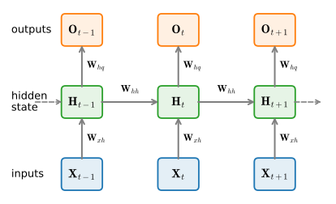
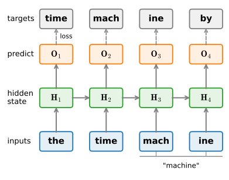

# Recurrent Neural Networks
:label:`sec_rnn`


In :numref:`sec_language-model` we introduced $n$-gram models, where the conditional probability of a token $x_t$ at time step $t$ depends only on the $n-1$ preceding tokens.
To let tokens earlier than time step $t-(n-1)$ influence $x_t$ we would have to increase $n$, but the number of parameters grows exponentially with it: we must store $|\mathcal{V}|^n$ numbers for a vocabulary $\mathcal{V}$.
Rather than model $P(x_t \mid x_{t-1}, \ldots, x_1)$ directly, then, it is preferable to use a latent variable model,

$$P(x_t \mid x_{t-1}, \ldots, x_1) \approx P(x_t \mid h_{t-1}),$$

where $h_{t-1}$ is a *hidden state* that stores the sequence information up to time step $t-1$.
In general, the hidden state at any time step $t$ can be computed from both the current input $x_{t}$ and the previous hidden state $h_{t-1}$:

$$h_t = f(x_{t}, h_{t-1}).$$
:eqlabel:`eq_ht_xt`

For a sufficiently powerful function $f$ in :eqref:`eq_ht_xt`, the latent variable model is not an approximation at all: $h_t$ might simply store everything it has observed so far.
Whether that is useful depends on how compactly $f$ can summarize the past, an issue we return to throughout this chapter and the next.

Recall the hidden layers and hidden units of :numref:`chap_perceptrons`.
It is worth stressing that hidden layers and hidden states name two very different things.
Hidden layers are layers that are hidden from view on the path from input to output.
Hidden states are, technically speaking, *inputs* to whatever we compute at a given step, and they can only be computed from data seen at earlier time steps.

*Recurrent neural networks* (RNNs) are neural networks with hidden states. Before defining the RNN, we first revisit the MLP of :numref:`sec_mlp`.

```{.python .input}
%load_ext d2lbook.tab
tab.interact_select('mxnet', 'pytorch', 'tensorflow', 'jax')
```

```{.python .input #rnn-recurrent-neural-networks}
%%tab mxnet
from d2l import mxnet as d2l
from mxnet import np, npx
npx.set_np()
```

```{.python .input #rnn-recurrent-neural-networks}
%%tab pytorch
from d2l import torch as d2l
import torch
```

```{.python .input #rnn-recurrent-neural-networks}
%%tab tensorflow
from d2l import tensorflow as d2l
import tensorflow as tf
```

```{.python .input #rnn-recurrent-neural-networks}
%%tab jax
from d2l import jax as d2l
import jax
from jax import numpy as jnp
```

## Neural Networks without Hidden States

Consider an MLP with a single hidden layer and activation function $\phi$.
Given a minibatch of examples $\mathbf{X} \in \mathbb{R}^{n \times d}$ with batch size $n$ and $d$ inputs, the hidden layer output $\mathbf{H} \in \mathbb{R}^{n \times h}$ is

$$\mathbf{H} = \phi(\mathbf{X} \mathbf{W}_{\textrm{xh}} + \mathbf{b}_\textrm{h}).$$
:eqlabel:`rnn_h_without_state`

In :eqref:`rnn_h_without_state`, $\mathbf{W}_{\textrm{xh}} \in \mathbb{R}^{d \times h}$ is a weight, $\mathbf{b}_\textrm{h} \in \mathbb{R}^{1 \times h}$ a bias (broadcast over the batch, see :numref:`subsec_broadcasting`), and $h$ the number of hidden units.
Feeding $\mathbf{H}$ into the output layer gives

$$\mathbf{O} = \mathbf{H} \mathbf{W}_{\textrm{hq}} + \mathbf{b}_\textrm{q},$$

where $\mathbf{O} \in \mathbb{R}^{n \times q}$ is the output, $\mathbf{W}_{\textrm{hq}} \in \mathbb{R}^{h \times q}$ the weight, and $\mathbf{b}_\textrm{q} \in \mathbb{R}^{1 \times q}$ the bias of the output layer.
For a classification problem $\mathrm{softmax}(\mathbf{O})$ gives a distribution over the $q$ output categories.

To turn this into a language model, feed the MLP a fixed window of the previous tokens and ask it to predict the next one.
This *neural $n$-gram*, first proposed by :citet:`Bengio.Ducharme.Vincent.ea.2003`, replaces the lookup table of counts with a learned function, so unseen contexts are no longer forced to probability zero.
Training is exactly the supervised setup of :numref:`sec_sequence`: pick window-target pairs at random and learn the parameters by automatic differentiation and stochastic gradient descent.
What it cannot escape is the fixed window itself. Just like a plain $n$-gram, a neural $n$-gram sees only $n-1$ tokens of context, and looking further back means enlarging the window and paying for more parameters. This is the limitation the hidden state removes.

## Recurrent Neural Networks with Hidden States
:label:`subsec_rnn_w_hidden_states`

Matters are entirely different once we keep a hidden state. Let us look at the structure in more detail.

Assume that at time step $t$ we have a minibatch of inputs $\mathbf{X}_t \in \mathbb{R}^{n \times d}$: each of the $n$ rows is one example of the sequence at step $t$.
Denote by $\mathbf{H}_t  \in \mathbb{R}^{n \times h}$ the hidden state at time step $t$.
Unlike the MLP, we retain the hidden state $\mathbf{H}_{t-1}$ from the previous step and introduce a new weight $\mathbf{W}_{\textrm{hh}} \in \mathbb{R}^{h \times h}$ that describes how to use it in the current step.
The current hidden state combines the current input with the previous hidden state:

$$\mathbf{H}_t = \phi(\mathbf{X}_t \mathbf{W}_{\textrm{xh}} + \mathbf{H}_{t-1} \mathbf{W}_{\textrm{hh}}  + \mathbf{b}_\textrm{h}).$$
:eqlabel:`rnn_h_with_state`

Compared with :eqref:`rnn_h_without_state`, :eqref:`rnn_h_with_state` adds the term $\mathbf{H}_{t-1} \mathbf{W}_{\textrm{hh}}$ and thus instantiates :eqref:`eq_ht_xt`.
From the relationship between hidden layer outputs $\mathbf{H}_t$ and $\mathbf{H}_{t-1}$ at adjacent time steps, we see that these variables capture and retain the sequence's historical information up to the current step, just like the state, or memory, of the network at the current step. Such a hidden layer output is therefore called a *hidden state*.
Because the computation of :eqref:`rnn_h_with_state` reuses the same definition from the previous step, it is *recurrent*. Hence networks with hidden states based on recurrent computation are named *recurrent neural networks*, and layers performing the computation of :eqref:`rnn_h_with_state` are called *recurrent layers*.

For time step $t$, the output layer is analogous to the computation in the MLP:

$$\mathbf{O}_t = \mathbf{H}_t \mathbf{W}_{\textrm{hq}} + \mathbf{b}_\textrm{q}.$$

The parameters of the RNN are the weights $\mathbf{W}_{\textrm{xh}} \in \mathbb{R}^{d \times h}$ and $\mathbf{W}_{\textrm{hh}} \in \mathbb{R}^{h \times h}$ and the bias $\mathbf{b}_\textrm{h} \in \mathbb{R}^{1 \times h}$ of the hidden layer, together with the weights $\mathbf{W}_{\textrm{hq}} \in \mathbb{R}^{h \times q}$ and the bias $\mathbf{b}_\textrm{q} \in \mathbb{R}^{1 \times q}$ of the output layer.
It is worth stressing that these same parameters are reused at every time step, so the parametrization cost of an RNN does not grow as the number of time steps increases.

:numref:`fig_rnn` unrolls the RNN across three adjacent time steps.
At each step the network reads the input $\mathbf{X}_t$, updates the hidden state to $\mathbf{H}_t$ from $\mathbf{X}_t$, $\mathbf{H}_{t-1}$, and the shared weights, and emits the output $\mathbf{O}_t$.
The horizontal arrows carry the state forward: $\mathbf{H}_t$ both feeds the output $\mathbf{O}_t$ and becomes an input to the next step's hidden state $\mathbf{H}_{t+1}$.
Reading :eqref:`rnn_h_with_state` another way, the hidden-state update is exactly a fully connected layer (with activation $\phi$) applied to the concatenation of $\mathbf{X}_t$ and $\mathbf{H}_{t-1}$, whose weight matrix is $\mathbf{W}_{\textrm{xh}}$ stacked on top of $\mathbf{W}_{\textrm{hh}}$.


:label:`fig_rnn`

We just claimed that computing $\mathbf{X}_t \mathbf{W}_{\textrm{xh}} + \mathbf{H}_{t-1} \mathbf{W}_{\textrm{hh}}$ is equivalent to a single matrix multiplication of the concatenation of $\mathbf{X}_t$ and $\mathbf{H}_{t-1}$ with the concatenation of $\mathbf{W}_{\textrm{xh}}$ and $\mathbf{W}_{\textrm{hh}}$.
This can be proven directly, but the following snippet is more convincing.
We define matrices `X`, `W_xh`, `H`, and `W_hh` whose shapes are (3, 1), (1, 4), (3, 4), and (4, 4), respectively.
Multiplying `X` by `W_xh`, and `H` by `W_hh`, and adding the two products yields a matrix of shape (3, 4).

```{.python .input #rnn-recurrent-neural-networks-with-hidden-states-1}
%%tab mxnet, pytorch
X, W_xh = d2l.randn(3, 1), d2l.randn(1, 4)
H, W_hh = d2l.randn(3, 4), d2l.randn(4, 4)
d2l.matmul(X, W_xh) + d2l.matmul(H, W_hh)
```

```{.python .input #rnn-recurrent-neural-networks-with-hidden-states-1}
%%tab tensorflow
X, W_xh = d2l.normal((3, 1)), d2l.normal((1, 4))
H, W_hh = d2l.normal((3, 4)), d2l.normal((4, 4))
d2l.matmul(X, W_xh) + d2l.matmul(H, W_hh)
```

```{.python .input #rnn-recurrent-neural-networks-with-hidden-states-1}
%%tab jax
X, W_xh = jax.random.normal(d2l.get_key(), (3, 1)), jax.random.normal(
                                                        d2l.get_key(), (1, 4))
H, W_hh = jax.random.normal(d2l.get_key(), (3, 4)), jax.random.normal(
                                                        d2l.get_key(), (4, 4))
d2l.matmul(X, W_xh) + d2l.matmul(H, W_hh)
```

Now we concatenate `X` and `H` along columns (axis 1) and `W_xh` and `W_hh` along rows (axis 0), giving matrices of shape (3, 5) and (5, 4).
Multiplying these two concatenated matrices yields the same matrix of shape (3, 4) as above.

```{.python .input #rnn-recurrent-neural-networks-with-hidden-states-2}
d2l.matmul(d2l.concat((X, H), 1), d2l.concat((W_xh, W_hh), 0))
```

This concatenate-then-multiply form is what most framework RNN implementations use in practice.

### Constant Memory per Step
:label:`subsec_rnn-constant-memory`

The recurrence :eqref:`rnn_h_with_state` has a property that will organize the rest of this part of the book: it runs in *constant memory per step*.
The hidden state $\mathbf{H}_t$ has a fixed size $n \times h$ no matter how long the sequence is, and to compute it we need only the previous state $\mathbf{H}_{t-1}$ and the current input $\mathbf{X}_t$.
Everything older can be discarded the moment $\mathbf{H}_t$ is formed.
An RNN can therefore consume a sequence of any length while its memory and its per-step computation stay flat, in sharp contrast to the neural $n$-gram, whose window (and cost) must grow to reach further back.
This is recurrence's defining trade. The state is a *lossy*, fixed-size summary of the whole past, so to record something new it must overwrite something old, and the network has to learn what is worth keeping.
The opposite design keeps every past representation around and lets the model look back over all of them on demand: this is *attention* (:numref:`chap_attention`), which buys exact recall at a memory and compute cost that instead grows with the sequence length.
Bounded, forgetful state versus unbounded, exact memory is the tension the rest of this part explores: first by making the recurrent state far better at remembering (:numref:`chap_modern_rnn`), then by turning to attention.

## RNN Language Models

Recall from :numref:`sec_language-model` that a language model predicts the next token from the current and past tokens, so we obtain training targets by shifting the input sequence forward by one token.
:citet:`Bengio.Ducharme.Vincent.ea.2003` first used a neural network for this task; an RNN does it with a hidden state in place of a fixed window.

We tokenize text with the byte-pair encoding (BPE) tokenizer of :numref:`sec_text-sequence`, which splits text into subword tokens drawn from a fixed vocabulary $\mathcal{V}$.
(Earlier presentations of RNN language models tokenized into single characters; subword tokens give shorter sequences for the same text and are what modern language models actually use.)
A token is not fed to the network as a raw id. Instead each id indexes a learned *embedding* table and returns a $d$-dimensional vector; stacking the vectors of a minibatch at step $t$ gives the input $\mathbf{X}_t \in \mathbb{R}^{n \times d}$.
This embedding lookup replaces the one-hot encoding used in older treatments. It is the same operation, selecting one row of a matrix per token, but the rows are trained rather than fixed, and the table is looked up directly instead of materializing a one-hot vector of length $|\mathcal{V}|$.

At each step the hidden state $\mathbf{H}_t$ is mapped by the output layer to a vector of $|\mathcal{V}|$ logits, one per vocabulary token, and a softmax turns these into $P(x_{t+1} \mid x_t, \ldots, x_1)$, the model's distribution over the next token.
Because $\mathbf{H}_t$ summarizes the entire prefix, the RNN expresses the full autoregressive factorization $P(x_1, \ldots, x_T) = \prod_{t} P(x_t \mid x_{t-1}, \ldots, x_1)$ with no Markov truncation.

:numref:`fig_rnn_train` shows the training setup.
Suppose the corpus contains "the time machine by", which the BPE tokenizer splits into the tokens `the`, `time`, `mach`, `ine`, `by` (the word "machine" becomes the two subword tokens `mach` and `ine`).
The input sequence is `the`, `time`, `mach`, `ine`, and the target sequence is the same stream shifted forward by one token, `time`, `mach`, `ine`, `by`.
At every step we run a softmax over the output and compute the cross-entropy against the target token, then average the losses over the sequence.
Because of the recurrence, the output $\mathbf{O}_3$ is determined by the inputs `the`, `time`, `mach`, so its loss measures how well the model predicts the next token `ine` from that prefix.
Minimizing perplexity (:numref:`sec_language-model`), the exponentiated average cross-entropy, is exactly this objective.


:label:`fig_rnn_train`

### Teacher Forcing

Notice what the model consumes during training: at each step its input is the *ground-truth* previous token, taken from the corpus, regardless of what the model itself predicted the step before.
Training a sequence model on the true prefixes in this way is called *teacher forcing*.
It makes training efficient and stable, since every step is conditioned on a correct history and the whole sequence can be scored in a single pass.

At generation time there is no ground truth to fall back on.
We feed the model a short prompt, sample (or take the argmax of) its next-token distribution, and feed that predicted token back in as the next input, repeating to extend the sequence.
The model is now conditioned on its *own* outputs rather than on gold prefixes.
This is precisely the gap between one-step and multi-step prediction from :numref:`sec_sequence`: a token the model gets slightly wrong perturbs the state it feeds itself, and small errors can compound over a long generation.
Teacher forcing trains for the easy case and deploys in the hard one, a mismatch that later chapters address both in how we train and in how we decode.

In practice each token is a $d$-dimensional embedding and we use a batch size $n > 1$, so the input $\mathbf{X}_t$ at time step $t$ is the $n \times d$ matrix of :numref:`subsec_rnn_w_hidden_states`.
In the following sections we implement RNN language models end to end.

## Summary

A recurrent neural network computes its hidden state recurrently, reusing one set of weights at every time step, so its parameter count is independent of sequence length and its state is a fixed-size summary of the entire past.
This makes the RNN a natural language model: embed each token, update the hidden state, project it to logits over the vocabulary, and train by teacher forcing to predict the next token, minimizing perplexity.

What could go wrong?
The whole past has to fit through one fixed-size state, and training the model means backpropagating through the recurrence over many time steps.
The gradient then becomes a long product of Jacobians, which tends to vanish or explode (:numref:`sec_bptt`), making it hard for a plain RNN to actually learn long-range dependencies.
Gating the state, the subject of :numref:`chap_modern_rnn`, is the standard fix.

## Exercises

1. If we use an RNN to predict the next token in a text sequence, what is the required dimension for any output?
1. Why can an RNN express the conditional probability of a token at some time step based on all the previous tokens in the sequence?
1. What happens to the gradient if you backpropagate through a long sequence?
1. Consider a context of $k$ previous tokens over a vocabulary of size $|\mathcal{V}|$. A $(k+1)$-gram stores a count for every possible context, whereas an RNN with $h$ hidden units and $d$-dimensional token embeddings stores a fixed set of weights. Write down the parameter (or table-entry) count for each, and evaluate both for $|\mathcal{V}| = 10{,}000$, $k = 20$, and $h = d = 256$. Which one grows with $k$, and by how much?
1. What are some of the problems associated with the language model described in this section, and how might the next chapters address them?


:begin_tab:`mxnet`
[Discussions](https://d2l.discourse.group/t/337)
:end_tab:

:begin_tab:`pytorch`
[Discussions](https://d2l.discourse.group/t/1050)
:end_tab:

:begin_tab:`tensorflow`
[Discussions](https://d2l.discourse.group/t/1051)
:end_tab:

:begin_tab:`jax`
[Discussions](https://d2l.discourse.group/t/18013)
:end_tab:

<!-- slides -->

::: {.slide title="Recurrent Neural Networks"}
A **recurrent neural network** carries a **hidden state**
$\mathbf{h}_t$ across time steps, a learned summary of
all input seen so far:

$$\mathbf{h}_t = \phi(\mathbf{W}_{xh}\mathbf{x}_t +
                     \mathbf{W}_{hh}\mathbf{h}_{t-1} + \mathbf{b}).$$

Same weights at every step, so the parameter count is
constant regardless of sequence length. Unbounded effective
context (in principle), with no fixed-size window like an n-gram.
:::

::: {.slide title="Unrolled in time"}
{width=75%}
:::

::: {.slide title="Setup"}
@rnn-recurrent-neural-networks
:::

::: {.slide title="The recurrence in code"}
The naive form: two matrix multiplies, summed:

@rnn-recurrent-neural-networks-with-hidden-states-1

. . .

Equivalently, concatenate input and hidden and multiply by the
concatenated weight matrix. Same result, one matmul:

@rnn-recurrent-neural-networks-with-hidden-states-2

The concatenate-then-multiply form is what most framework `RNN`
implementations actually do.
:::

::: {.slide title="Constant memory per step"}
- $\mathbf{h}_t$ has a **fixed size**, independent of $t$.
- To form $\mathbf{h}_t$ we need only $\mathbf{h}_{t-1}$ and
  $\mathbf{x}_t$; everything older can be dropped.
- Any-length input at **flat** per-step memory and compute.
- The trade: the state is a *lossy* summary, so it must learn
  what to keep. **Attention** (later) keeps everything instead,
  at a cost that grows with length.
:::

::: {.slide title="As a language model"}
- **Embedding** maps a BPE token id to a vector $\mathbf{x}_t$.
- **RNN** updates the hidden state $\mathbf{h}_t$.
- **Linear head** projects $\mathbf{h}_t$ to vocab logits;
  softmax gives $P(x_{t+1} \mid x_{\le t})$.
- Loss = **cross-entropy** with the next-token target.
:::

::: {.slide title="Teacher forcing"}
{width=80%}

Train on **gold** prefixes; generate on the model's **own**
outputs. That mismatch is the rollout-error problem again.
:::

::: {.slide title="Recap"}
- RNN: $\mathbf{h}_t = \phi(\mathbf{W}_{xh}\mathbf{x}_t +
  \mathbf{W}_{hh}\mathbf{h}_{t-1} + \mathbf{b}).$
- Same parameters at every step; the hidden state is a
  fixed-size summary of the whole past.
- Trains by backprop **through time**: gradients flow from
  $\mathbf{h}_T$ back to every earlier hidden state.
- Those long products vanish or explode on long sequences,
  fixed by **LSTM** and **GRU** in the next chapter.
:::
