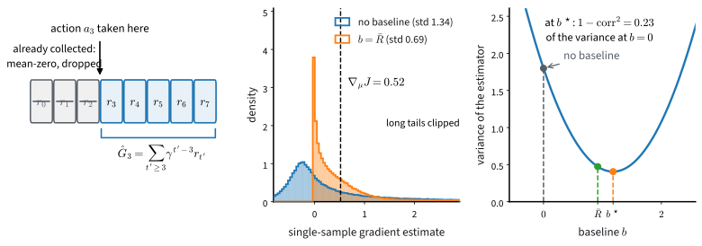

# Baselines, Advantages and Variance Reduction
:label:`sec_baselines`

The REINFORCE estimator of :numref:`sec_policygradient` is unbiased, and we measured what that word does not promise: at batch size four a single estimate misses the true gradient by more than three times its own length. It is also wasteful. On our lake a trajectory that never reaches the goal has $R(\tau) = 0$ and drops out of the estimator entirely, so early in training most of the agent's experience produces no learning signal at all, and the updates that do arrive swing the parameters around a lot. This section reduces the variance of the estimator without changing what it estimates. Everything follows from one small lemma about the score function: it licenses dropping terms whose average is zero anyway, subtracting a reference value from what remains, and learning that reference per state, and a classical theory, control variates, says exactly how much each move buys. We then practice some estimator hygiene, separating changes that reduce variance from changes that quietly rescale the learning rate, and close by racing five versions of the estimator, grading each against the exact gradient of :numref:`sec_policygradient`.

```{.python .input #baselines-baselines-advantages-and-variance-reduction-1}
%%tab pytorch
%matplotlib inline
from d2l import torch as d2l
import gymnasium as gym
import numpy as np
import torch
```

```{.python .input #baselines-baselines-advantages-and-variance-reduction-1}
%%tab jax
%matplotlib inline
from d2l import jax as d2l
from flax import nnx
import gymnasium as gym
import jax
from jax import numpy as jnp
import numpy as np
import optax
```

The laboratory is unchanged: the calm lake whose determinism :numref:`sec_policygradient` named as a bought assumption, the discount $\gamma = 0.95$, and the softmax-over-preferences policy of `ActorCritic.tabular`. Two numbers below are choices with intent: four episodes per update is deliberately small, to expose the variance this section is about, and twenty seeds is deliberately many, for reasons the end of the section turns into a lesson of its own.

```{.python .input #baselines-baselines-advantages-and-variance-reduction-2}
%%tab pytorch, jax
gamma, alpha, beta = 0.95, 16.0, 0.1   # discount; SGD step; value-table step
num_updates, batch_episodes = 150, 4   # small batches, to expose variance
num_seeds = 20                         # with 5, the medians below are noise
env = gym.make('FrozenLake-v1', is_slippery=False)
```

## A Zero-Mean Identity

Everything in this section rests on one small fact about the score function.

### The lemma

**Lemma.** For every state $s$, $\ \sum_{a \in \mathcal{A}} \pi_\theta(a \mid s)\ \nabla_\theta \log \pi_\theta(a \mid s) = 0$.

**Proof.** $\sum_a \pi_\theta(a \mid s) \nabla_\theta \log \pi_\theta(a \mid s) = \sum_a \nabla_\theta\, \pi_\theta(a \mid s) = \nabla_\theta \sum_a \pi_\theta(a \mid s) = \nabla_\theta 1 = 0.$ $\blacksquare$

In words: at any state, the score of the sampled action has zero mean. For our softmax policy the lemma can also be read directly off the verified score formula :eqref:`eq_softmax_score`, which sums to zero over actions by inspection; the proof above is the same cancellation stated for every differentiable policy at once.

### The conditional version

The useful consequence is slightly stronger. Suppose $c$ is any quantity that is already determined by the time the agent stands at state $s_t$: a reward collected earlier in the trajectory, a constant, or a function of $s_t$ itself. Conditioned on the trajectory prefix $(s_0, a_0, r_0, \ldots, s_t)$, the value $c$ is fixed while the action $a_t$ is still random, and since the policy consults only $s_t$, the inner expectation is the one the lemma covers:

$$E\big[ c\ \nabla_\theta \log \pi_\theta(a_t \mid s_t) \big] = E\Big[ c\ \underbrace{E\big[ \nabla_\theta \log \pi_\theta(a_t \mid s_t) \mid s_0, a_0, \ldots, s_t \big]}_{=\,0 \textrm{ by the lemma}} \Big] = 0.$$

We can therefore multiply any score in the REINFORCE estimator by such a quantity, or subtract such a quantity from its weight, without moving the average. Every tool in this section is an instance of this observation.

## Four Uses of One Identity

The identity has four increasingly ambitious uses: drop terms, subtract a constant, subtract the best constant, subtract a function of the state. Each keeps the estimator unbiased, and each makes the same episode budget go further.

### Reward-to-go and causality

Look at what multiplies the score at time $t$ in the REINFORCE estimator: the return $R(\tau_i)$ of the whole trajectory, including rewards that were collected *before* the agent took the action $a_t^i$. The action did not cause those rewards. By the observation above, each product of a past reward with the score at time $t$ has zero mean; it contributes nothing to the gradient on average and adds variance for free. Dropping all such terms from $\nabla_\theta J(\theta)$ leaves

$$\nabla_\theta J(\theta) = E_{\tau \sim P(\cdot;\, \theta)} \Big[ \sum_{t=0}^{T-1} \nabla_\theta \log \pi_\theta(a_t \mid s_t)\ \sum_{t'=t}^{T-1} \gamma^{t'} r_{t'} \Big].$$

The inner sum equals $\gamma^t \hat{G}_t$ where

$$\hat{G}_t = \sum_{t'=t}^{T-1} \gamma^{t'-t}\, r_{t'}$$

is called the reward-to-go from step $t$: the discounted return of the remainder of the trajectory, as if it started at $s_t$. Implementations almost always drop the leading $\gamma^t$ and weight the score at step $t$ by $\hat{G}_t$ alone, which treats every timestep equally instead of down-weighting late ones. Sutton and Barto's boxed REINFORCE keeps the factor, and their text derivation sidesteps the question by treating the undiscounted case; we follow implementation practice instead, and the price is that the simplified update is no longer an exact unbiased estimate of the gradient of the discounted objective. The estimator becomes

$$\hat{u} = \frac{1}{n} \sum_{i=1}^n \sum_{t=0}^{T-1} \hat{G}_t^i\ \nabla_\theta \log \pi_\theta(a_t^i \mid s_t^i).$$
:eqlabel:`eq_rtg`

This refinement is sometimes summarized by the word causality: the policy's choice at time $t$ can only influence rewards from time $t$ onward, so only those rewards should judge it.

In code, the reward-to-go is one backward pass over the batch, restarted at each episode boundary, and we make the pass itself the reusable object rather than the special case:

```{.python .input #baselines-reward-to-go-and-causality}
%%tab pytorch, jax
@d2l.add_to_class(d2l.Batch)  #@save
def backward_scan(self, x, factor):
    """y_t = x_t + factor * y_{t+1}, restarted at every episode boundary."""
    y = np.zeros_like(x)
    for ep in self.episodes():
        running = 0.0
        for t in reversed(range(ep.start, ep.stop)):
            running = x[t] + factor * running
            y[t] = running
    return y

@d2l.add_to_class(d2l.Batch)  #@save
def reward_to_go(self, gamma):
    """G_t: the discounted return of the rest of its episode, by one scan."""
    return self.backward_scan(self.rew, gamma)
```

The scan is written once and never again: the generalized advantage estimator of :numref:`sec_ppo` is this same scan run on the TD errors of :numref:`sec_actorcritic`, with $\gamma\lambda$ in place of $\gamma$, and at $\lambda = 1$ it telescopes back to this subsection's reward-to-go.

### Baselines

The second use of the identity is subtraction. Any quantity $b$ that does not depend on the action $a_t$, whether a constant or a function $b(s_t)$ of the current state, can be subtracted from the reward-to-go without biasing the estimator:

$$\hat{u} = \frac{1}{n} \sum_{i=1}^n \sum_{t=0}^{T-1} \big( \hat{G}_t^i - b(s_t^i) \big)\ \nabla_\theta \log \pi_\theta(a_t^i \mid s_t^i).$$
:eqlabel:`eq_pg_baseline`

Such a $b$ is called a baseline. The extra term is $b(s_t)$ times the score, and we showed above that this has zero mean, so :eqref:`eq_pg_baseline` and :eqref:`eq_rtg` estimate the same gradient.

Why subtract anything? On FrozenLake every reward is $0$ or $1$, so every $\hat{G}_t$ is non-negative and the estimator can only push probabilities up, by amounts that differ across trajectories. A baseline near the typical return changes the sign structure: steps that went better than typical get positive weight, steps that went worse get negative weight, and a failed trajectory finally says something, namely "do this less". The baseline can be a fixed number, the average return seen so far, or a learned estimate of the value function; averaging what the agent has seen is not the variance-optimal choice, but it is simple and it captures most of the benefit. The baseline that minimizes the variance exactly can be worked out in closed form, and we leave it as an exercise.

### Control variates

Subtracting a baseline is an instance of a standard trick from Monte Carlo estimation called a control variate. The idea needs no reinforcement learning at all, so let us first state it on its own.

You want to estimate the average of a noisy quantity $X$ from samples. Suppose that alongside each sample of $X$ you can also observe a second quantity $Y$, and that two things hold: $Y$ tends to move together with $X$, and you know the true average $E[Y]$ exactly. Then every sample carries a hint about its own noise. If $Y$ came out above its known average, and the two quantities move together, then this sample of $X$ is probably too high as well, and by an amount you can gauge from how far $Y$ overshot. So correct each sample: subtract the observed excess of $Y$, scaled by a factor $c$ of your choosing,

$$X_c = X - c\, \big( Y - E[Y] \big).$$
:eqlabel:`eq_control_variate`

The correction averages to zero, because $E[Y - E[Y]] = 0$. So $X_c$ has the same mean as $X$ no matter what $c$ is: we can pick $c$ freely without biasing the estimate. What changes is the noise. Expanding the variance of the difference,

$$\mathrm{Var}(X_c) = \mathrm{Var}(X) - 2c\, \mathrm{Cov}(X, Y) + c^2\, \mathrm{Var}(Y),$$

which is a parabola in $c$. Setting its derivative to zero gives the best factor,

$$c^* = \frac{\mathrm{Cov}(X, Y)}{\mathrm{Var}(Y)},$$

and substituting $c^*$ back in leaves the variance at $(1 - \mathrm{corr}^2)\, \mathrm{Var}(X)$, where $\mathrm{corr}$ is the correlation between $X$ and $Y$. The formula says exactly how much the trick buys: the more strongly the two quantities co-vary, the more noise the correction cancels. At $\mathrm{corr} = 0.9$ the variance falls by a factor of about five. At $\mathrm{corr} = 0$ the correction does nothing. The quantity $Y$ is called a control variate for $X$.

Now place the baseline in this picture. The noisy quantity we average at step $t$ is the score scaled by the reward-to-go,

$$X = \hat{G}_t\, \nabla_\theta \log \pi_\theta(a_t \mid s_t),$$

and the second quantity is the score by itself,

$$Y = \nabla_\theta \log \pi_\theta(a_t \mid s_t).$$

$Y$ moves together with $X$ almost by construction, since $X$ is $Y$ times a scalar. And we know the true average of $Y$ exactly: it is zero, by the lemma. The scale factor is the baseline itself, $c = b(s_t)$. Line up the pieces and :eqref:`eq_pg_baseline` is :eqref:`eq_control_variate`, term by term: a baseline is a control variate built from the score.

The reframing pays twice. First, unbiasedness for every $b$ stops being a lucky algebraic fact; it is the any-$c$-is-allowed property that every control variate has. Second, the question of which baseline is best now has an exact answer: the optimal scale is $c^*$, the covariance-over-variance ratio, computed state by state. Carried out for the vector-valued score, where the products become inner products, it gives the score-weighted optimal baseline of the exercises. The plain average return has the right scale but is not that exact optimum, which is why it is good without being best. :citet:`Greensmith.Bartlett.Baxter.2004` develop this view for policy gradient estimators and show that the value-function critic of :numref:`sec_actorcritic` can be read as a control variate as well.

![Variance reduction on the one-step problem of :numref:`fig_rl_score_ascent`, with reward $R(a) = 0.4 + 2 e^{-(a - 2)^2/2}$ under the policy $\mathcal{N}(0, 1)$, so that the expected reward is $0.92$ and $\nabla_\mu J = 0.52$. (a) Rewards collected before an action have mean-zero products with its score and are dropped from its weight: only the reward-to-go remains. (b) The distribution of the single-sample estimate of $\nabla_\mu J$ with no baseline, std $1.34$, and with the mean reward subtracted as a constant baseline, std $0.69$: the same mean, half the spread; the long tails are clipped at the 1st and 95th percentiles. (c) The variance of the estimator against a constant baseline $b$ is the parabola of :eqref:`eq_control_variate`: the mean reward $\bar R$ is good, and the optimum $b^\star = c^* = 1.18$ is slightly better, leaving $1 - \mathrm{corr}^2 = 0.23$ of the no-baseline variance.](../img/mdl-rl-variance-reduction.svg)
:label:`fig_rl_variance_reduction`

### The advantage, and a learned baseline

Which function of the state should the baseline be? The chapter answered before it asked. :eqref:`eq_advantage` already named the quantity that remains when a policy's own habit is subtracted from an action's worth: the advantage $A^\pi(s, a) = Q^\pi(s, a) - V^\pi(s)$, whose mean under the policy is zero. The reward-to-go $\hat{G}_t$ is a one-trajectory estimate of $Q^{\pi_\theta}(s_t, a_t)$, so choosing $b(s) = V^{\pi_\theta}(s)$ makes the weight $\hat{G}_t - b(s_t)$ a sample of exactly that advantage: positive when the trajectory did better from $s_t$ than the policy usually does, negative when it did worse.

We do not know $V^{\pi_\theta}$, but we can estimate it from the same batch of trajectories. Keep a table $\hat{V}(s)$, and after each batch move the estimate at every visited state toward the reward-to-go observed there,

$$\hat{V}(s_t) \leftarrow \hat{V}(s_t) + \beta \big( \hat{G}_t - \hat{V}(s_t) \big),$$
:eqlabel:`eq_value_baseline`

with a step size $\beta$. This algorithm is REINFORCE with a baseline :cite:`Williams.1992`. Note that $\hat{V}$ is trained here by regression on Monte Carlo returns, meaning reward-to-go values computed from complete sampled trajectories; in :numref:`sec_actorcritic` we will let it build its targets from its own predictions instead, and the pair of a parameterized policy and a learned value estimate will get a name of its own.

## Estimator Hygiene

Between the theory above and the race below sits a layer of bookkeeping that most expositions skip and many implementations get subtly wrong. Every hygiene claim is checkable, so we first re-arm the previous section's yardstick: the same policy, frozen sixteen updates into training by the same recipe, the exact $\nabla_\theta J$ from the differentiable linear solve, and, new here, the frozen policy's exact value function $V^{\pi_\theta}$, which the same solve produces anyway.

```{.python .input #baselines-estimator-hygiene}
%%tab pytorch
mdp = d2l.TabularMDP.from_gym(env, gamma)
P, r = torch.as_tensor(mdp.P).float(), torch.as_tensor(mdp.r).float()
torch.manual_seed(3)
probe = d2l.ActorCritic.tabular(16, 4)
rng = np.random.default_rng(3)
env.reset(seed=3)
for _ in range(16):
    b = d2l.rollout(env, probe.act, 16, rng)
    d2l.policy_step(probe, b, np.repeat(b.episode_returns(gamma),
                                        np.diff(b.ep_ends, prepend=0)))
theta = probe.policy.weight.detach().requires_grad_(True)
pi = torch.softmax(theta, -1)
V = torch.linalg.solve(torch.eye(16) - gamma * torch.einsum('sa,sat->st',
                                                            pi, P),
                       (pi * r).sum(-1))
g_exact = torch.autograd.grad(V[0], theta)[0].numpy().ravel()
V_pi = V.detach().numpy()
print(f'J(theta) = {V_pi[0]:.3f}, |grad J| = {np.linalg.norm(g_exact):.3f}')
```

```{.python .input #baselines-estimator-hygiene}
%%tab jax
mdp = d2l.TabularMDP.from_gym(env, gamma)
P, r = jnp.asarray(mdp.P), jnp.asarray(mdp.r)
probe = d2l.ActorCritic.tabular(16, 4, rngs=nnx.Rngs(3))
rng = np.random.default_rng(3)
env.reset(seed=3)
for _ in range(16):
    b = d2l.rollout(env, probe.act, 16, rng)
    d2l.policy_step(probe, b, np.repeat(b.episode_returns(gamma),
                                        np.diff(b.ep_ends, prepend=0)))

def V_fn(theta):
    pi = jax.nn.softmax(theta, -1)
    return jnp.linalg.solve(jnp.eye(16) - gamma * jnp.einsum('sa,sat->st',
                                                             pi, P),
                            (pi * r).sum(-1))

theta = probe.policy.embedding[...]
g_exact = np.asarray(jax.grad(lambda th: V_fn(th)[0])(theta)).ravel()
V_pi = np.asarray(V_fn(theta))
print(f'J(theta) = {V_pi[0]:.3f}, |grad J| = {np.linalg.norm(g_exact):.3f}')
```

The printed $J(\theta) = 0.313$ matches the previous section's frozen probe to the digit, because it is the same probe: mid-training, past the first lucky successes, with real work left to do. Every claim below is graded against this $\nabla_\theta J$.

### Centering is a baseline; dividing by sigma is a step-size rescaling

A practical variant standardizes the reward-to-go values within each batch. Collect every $\hat{G}_t^i$ in the current batch, compute their mean $\mu$ and standard deviation $\sigma$, and use

$$\tilde{G}_t^i = \frac{\hat{G}_t^i - \mu}{\sigma + \epsilon}$$
:eqlabel:`eq_pg_normalized`

in place of $\hat{G}_t^i$, where the small constant $\epsilon$ avoids dividing by zero. Subtracting $\mu$ acts as a baseline, with one caveat: $\mu$ is computed from the same batch, so it depends weakly on the sampled actions, and the exact zero-bias argument above holds only up to a correction that vanishes as the batch grows. Dividing by $\sigma + \epsilon$ is different in kind: it rescales the update so that its size no longer depends on the scale of the rewards, which spares us from re-tuning the learning rate every time the reward magnitudes change.

"Different in kind" deserves to be said sharply, because this is the most commonly blurred distinction in the practice of policy gradients. Subtracting $\mu$ changes which way the terms pull: failed steps acquire negative weight, and the estimate genuinely changes direction. Dividing by $\sigma + \epsilon$ multiplies the whole batch's estimate by one positive number: the direction is untouched, so the division is not a baseline and removes no noise from the direction being followed; it is a per-batch learning-rate schedule in disguise. On this lake the schedule even has a known sign: every $\hat{G}_t$ lies between $0$ and $1$, so $\sigma \le 1/2$ (a bounded variable's standard deviation is at most half its range), so $1/(\sigma + \epsilon) \ge 2$: at any fixed learning rate the normalized variant always steps at least twice as far, and below the factor measures about five. Whether the larger step helps is a question about the optimizer, not the estimator, and the comparison keeps the two ledgers separate.

Two four-line tools make the rest of the section runnable: `normalize` is :eqref:`eq_pg_normalized`, and `run_seeds` runs a seeded training generator over a set of seeds and stacks the yielded curves. The runner is deliberately visible: every multi-seed number quoted in the rest of these two chapters is computed in a cell you can read, never inside a plotting helper.

```{.python .input #baselines-centering-is-a-baseline-dividing-by-sigma-is-a-step-size-rescaling}
%%tab pytorch, jax
def normalize(x, eps=1e-8):  #@save
    """Center a batch of weights and rescale them to unit spread."""
    return (x - x.mean()) / (x.std() + eps)

def run_seeds(train, num_seeds, **kwargs):  #@save
    """Run train(seed, **kwargs), a generator of curve points, per seed."""
    return np.array([list(train(seed, **kwargs)) for seed in range(num_seeds)])
```

### Leave-one-out

The caveat attached to $\mu$ above, that it is computed from the very batch whose scores it multiplies, can be removed rather than tolerated. Give each trajectory a baseline built from the *other* trajectories in the batch,

$$b_i = \frac{1}{n-1} \sum_{j \neq i} R(\tau_j),$$

so that $b_i$ is independent of everything trajectory $i$ did. The conditional identity of the first section then applies with no correction term: the estimator is exactly unbiased at every batch size, not just asymptotically. It also costs nothing, because $R_i - b_i = \frac{n}{n-1}(R_i - \mu)$: leave-one-out is batch centering rescaled by the constant $n/(n-1)$, so the bias of plain centering with per-trajectory weights is a pure shrinkage of the mean by $(n-1)/n$, nothing more. Both statements can be verified *exactly* on a decision problem small enough to enumerate, two states visited in order, two actions at each, rewards from a table, with the scores coming straight from :eqref:`eq_softmax_score` and no autograd:

```{.python .input #baselines-leave-one-out}
%%tab pytorch, jax
def leave_one_out(R):
    """b_i = the mean of the other n - 1 returns: n/(n-1) times centering."""
    return (R - R.mean()) * len(R) / (len(R) - 1)

rng = np.random.default_rng(0)
th = rng.standard_normal((2, 2))               # a generic two-state table
pi2 = np.exp(th) / np.exp(th).sum(1, keepdims=True)
r2 = np.array([[0.3, 1.0], [0.6, 0.1]])        # r[s, a]; s0 -> s1 -> done
trajs = [(a0, a1) for a0 in range(2) for a1 in range(2)]
p = np.array([pi2[0, a0] * pi2[1, a1] for a0, a1 in trajs])
R = np.array([r2[0, a0] + r2[1, a1] for a0, a1 in trajs])
S = np.zeros((4, 2, 2))                        # the score of each trajectory
for i, (a0, a1) in enumerate(trajs):
    S[i] = -pi2
    S[i, 0, a0] += 1
    S[i, 1, a1] += 1
g = (p[:, None, None] * R[:, None, None] * S).sum(0)    # exact gradient
u_loo = u_cen = 0.0
for i in range(4):
    for j in range(4):                         # every batch of n = 2
        w, wc = leave_one_out(R[[i, j]]), R[[i, j]] - R[[i, j]].mean()
        u_loo += p[i] * p[j] * (w[0] * S[i] + w[1] * S[j]) / 2
        u_cen += p[i] * p[j] * (wc[0] * S[i] + wc[1] * S[j]) / 2
print(f'E[leave-one-out] equals the exact gradient: {np.allclose(u_loo, g)}')
print(f'E[centered] equals (n-1)/n of it:           {np.allclose(u_cen, g / 2)}')
```

Both checks pass to machine precision. Nor is the estimator a curiosity: sampling a group of $n$ responses to a prompt and weighting each by its reward minus the mean of the other $n - 1$ is exactly this leave-one-out REINFORCE, used to post-train language models under the name RLOO :cite:`Ahmadian.Cremer.Galle.ea.2024`.

### Summing over episodes of different lengths

One decision remains before anything can be compared fairly: what the summed loss is divided by. It looks like bookkeeping and is in fact a choice of estimator. The double sum in :eqref:`eq_rtg` runs over episodes and steps. Dividing by the number of episodes $n$ gives exactly :eqref:`eq_rtg`, the estimator whose unbiasedness this section has been guarding. Dividing by the total number of steps, which is what `policy_step`'s mean over steps does (:numref:`sec_policygradient` flagged it), rescales each batch by its realized mean episode length: a pure rescale on any one batch, but a random one across batches, and not an innocent one, since how long episodes run is correlated with how well the policy is doing. Dividing each episode's contribution by its own length is the only variant that changes the *direction* of the gradient rather than its size. Dividing by a fixed constant changes the effective learning rate once, and nothing else. FrozenLake episodes already vary in length severalfold, so one batch from the frozen probe shows all four:

```{.python .input #baselines-summing-over-episodes-of-different-lengths}
%%tab pytorch, jax
pi_np = np.exp(probe.log_prob_np(np.repeat(np.arange(16), 4),
                                 np.tile(np.arange(4), 16))).reshape(16, 4)
b = d2l.rollout(env, probe.act, 4, np.random.default_rng(6))
G, T = b.reward_to_go(gamma), np.diff(b.ep_ends, prepend=0)
print(f'episode lengths {T}, successes {int(b.rew.sum())}')

def agg(scale):   # sum_t scale_t * G_t * score_t, via eq_softmax_score
    u = np.zeros((16, 4))
    np.add.at(u, b.obs,
              (G * scale)[:, None] * (np.eye(4)[b.act] - pi_np[b.obs]))
    return u.ravel()

grads = {'episodes': agg(np.full(len(b), 1 / len(T))),
         'own length': agg(np.repeat(1 / T, T) / len(T)),
         'total steps': agg(np.full(len(b), 1 / len(b))),
         'a constant': agg(np.full(len(b), 1 / 32))}
for k, u in grads.items():
    cos = u @ grads['episodes'] / (np.linalg.norm(u)
                                   * np.linalg.norm(grads['episodes']))
    print(f'{k:>12}: |grad| = {np.linalg.norm(u):.3f}, '
          f'cos to episodes = {cos:.3f}')
```

Three of the four gradients are exactly parallel, at sizes an order of magnitude apart; the per-own-length variant tilts away from the rest. In order, these are the per-trajectory estimator, the per-response length normalization, the token-level loss, and the fixed-constant normalization of the LLM post-training literature, where the divisor has been a live controversy: GRPO normalizes each response by its own length, and the "Dr. GRPO" correction argues for a constant precisely because only rescalings leave the estimator's direction alone. On a four-episode toy batch the entire debate fits in two printed columns.

### Normalized returns and GRPO

The reason to dwell on this variant is what it became. Group Relative Policy Optimization (GRPO) :cite:`Shao.Wang.Zhu.ea.2024`, the method used to train recent reasoning language models, samples a *group* of $G$ responses to the same prompt, scores each response with a reward $r_j$, and weights the score function with

$$A_j = \frac{r_j - \mu}{\sigma + \epsilon},$$

where $\mu$ and $\sigma$ are the mean and standard deviation of the rewards within the group. This is :eqref:`eq_pg_normalized`, with the prompt in the role of our start state and the group of responses in the role of our batch of $n$ trajectories. Even the motivation is the one from this section, read at scale: for a model with billions of parameters, a learned baseline of the kind we built above is a value network as large as the policy and as hard to train, so GRPO drops it and lets the group mean act as a per-prompt baseline, while the group standard deviation makes advantages comparable across prompts whose reward magnitudes differ, at a price named above: dividing by $\sigma$ is a per-prompt step-size rescaling rather than a baseline, which is exactly the objection the "Dr. GRPO" line of work raises. GRPO adds machinery around the update itself, which :numref:`sec_ppo` will explain and :numref:`sec_rl_sequences` will take to scale, but its advantage estimate is this subsection's normalization, nothing more.

## The Comparison, and How To Read It

Theory in hand and hygiene declared, we can race the estimators, and, just as importantly, practice reading the result.

### Five estimators

The section has assembled a ladder, worth seeing whole. Each rung changes what multiplies the score at step $t$:

1. **Trajectory return** $R(\tau)$: unbiased :eqref:`eq_reinforce`, and the noisiest.
2. **Reward-to-go** $\hat{G}_t$: drops terms that are mean-zero by the identity; unbiased up to the dropped $\gamma^t$ factor priced in :numref:`sec_policygradient`.
3. **Constant baseline** $\hat{G}_t - b$: unbiased for every $b$; the best constant is the control-variate optimum $c^*$.
4. **State baseline** $\hat{G}_t - b(s_t)$: unbiased; the natural target for $b$ is $V^{\pi_\theta}$.
5. **Leave-one-out**: exactly unbiased, batch coupling included.
6. **A learned critic** $\hat{V}(s)$: unbiased while it only replaces $b(s_t)$; bias arrives the moment its own predictions enter the weight, and that step is :numref:`sec_actorcritic`.
7. **Generalized advantage estimation**: a dial $\lambda$ between the reward-to-go and the bootstrapped critic (:numref:`sec_actorcritic`, :numref:`sec_ppo`).

Before any training run, the static measurement: hold the probe's $\theta$ frozen, draw 200 batches of the size the training runs will use, and form each weighting's estimate through the score identity, averaged per episode, as the hygiene subsection prescribed. With the exact gradient in hand, both halves of every claim above are measurable: whether the mean moved, and how much the noise shrank. For the state baseline we can afford here what training cannot, the exact $V^{\pi_\theta}$ from the linear solve.

```{.python .input #baselines-five-estimators-1}
%%tab pytorch, jax
def estimate(b, w):
    """One draw of the estimator: weighted scores, averaged over episodes."""
    u = np.zeros((16, 4))
    np.add.at(u, b.obs, w[:, None] * (np.eye(4)[b.act] - pi_np[b.obs]))
    return u.ravel() / len(b.ep_ends)

weightings = {
    'return': lambda b, G: np.repeat(b.episode_returns(gamma),
                                     np.diff(b.ep_ends, prepend=0)),
    'reward-to-go': lambda b, G: G,
    'centered': lambda b, G: G - G.mean(),
    'normalized': lambda b, G: normalize(G),
    'exact baseline': lambda b, G: G - V_pi[b.obs]}
rng, draws = np.random.default_rng(4), {k: [] for k in weightings}
for _ in range(200):
    b = d2l.rollout(env, probe.act, 4, rng)
    G = b.reward_to_go(gamma)
    for k, fn in weightings.items():
        draws[k].append(estimate(b, fn(b, G)))
for k, u in draws.items():
    u = np.stack(u)
    m = u.mean(axis=0)
    cos = m @ g_exact / (np.linalg.norm(m) * np.linalg.norm(g_exact))
    rel = ((u - m) ** 2).sum(axis=1).mean() / (m ** 2).sum()
    print(f'{k:>14}: cos(mean, exact) = {cos:.2f}, '
          f'relative variance = {rel:6.1f}')
```

Read the two columns against the two halves of the claim. The cosine column is unbiasedness: all five means point along the exact gradient to within what 200 draws can resolve, and the residual degree or two is shared by all five weightings alike, so the baselines moved nothing, exactly as the identity promised. The variance column is the ladder, measured: centering cuts the relative variance by about a third, the exact state baseline nearly halves it, and dividing by $\sigma$ changes next to nothing beside plain centering, the first measurement behind this section's sharpest distinction. One entry is a warning about the map rather than the method: reward-to-go buys only a few percent here, because with a single terminal reward there are no earlier rewards for causality to drop; its celebrated benefit needs dense rewards to exist at all.

Now the race. One generator serves all five variants, and they differ in a single line: the weight handed to `policy_step`. Three choices are deliberate. The policy optimizer is plain SGD rather than the container's default Adam: an adaptive optimizer rescales every parameter's step by its own running statistics, a fine default for training and a blindfold here, since it would partly absorb the very scale differences the section is teaching you to see. Every run maintains the value table of :eqref:`eq_value_baseline` but only one arm consults it, so the arms share everything else, seeds included. And each update yields three numbers, the batch success rate, the size of the parameter step actually taken, and the policy's mean entropy: diagnostics are data the run returns, not lines printed from inside a helper. Two small probes read the policy from outside, through the numpy boundary:

```{.python .input #baselines-five-estimators-2}
%%tab pytorch, jax
def table(ac):
    """The policy's preference table, copied out to numpy."""
    if tab.selected('pytorch'):
        return ac.policy.weight.detach().numpy().copy()
    if tab.selected('jax'):
        return np.asarray(ac.policy.embedding[...])

def entropy(ac):
    """Mean policy entropy over the sixteen states, in nats."""
    logp = ac.log_prob_np(np.repeat(np.arange(16), 4),
                          np.tile(np.arange(4), 16))
    return float(-(np.exp(logp) * logp).sum() / 16)
```

```{.python .input #baselines-five-estimators-3}
%%tab pytorch, jax
def train(seed, variant):
    """Five REINFORCE variants; they differ in one line, the weight."""
    rng, V = np.random.default_rng(seed), np.zeros(16, np.float32)
    if tab.selected('pytorch'):
        torch.manual_seed(seed)
        ac = d2l.ActorCritic.tabular(16, 4)
        ac.opt_pi = torch.optim.SGD(ac.policy.parameters(), lr=alpha)
    if tab.selected('jax'):
        ac = d2l.ActorCritic.tabular(16, 4, rngs=nnx.Rngs(seed))
        ac.opt_pi = nnx.Optimizer(ac.policy, optax.sgd(alpha), wrt=nnx.Param)
    env.reset(seed=seed)
    for _ in range(num_updates):
        batch = d2l.rollout(env, ac.act, batch_episodes, rng)
        G = batch.reward_to_go(gamma)
        w = {'return': np.repeat(batch.episode_returns(gamma),
                                 np.diff(batch.ep_ends, prepend=0)),
             'reward-to-go': G,
             'centered': G - G.mean(),
             'normalized': normalize(G),
             'learned baseline': G - V[batch.obs]}[variant]
        before = table(ac)
        d2l.policy_step(ac, batch, w)
        for s, g in zip(batch.obs, G):     # eq_value_baseline, every arm
            V[s] += beta * (g - V[s])
        yield (float(batch.episode_returns().mean()),
               float(np.linalg.norm(table(ac) - before)), entropy(ac))
```

A hundred training runs, five variants by twenty seeds, and `runs[v]` stacks to shape (seeds, updates, 3):

```{.python .input #baselines-five-estimators-4}
%%tab pytorch, jax
variants = ['return', 'reward-to-go', 'centered', 'normalized',
            'learned baseline']
runs = {v: run_seeds(train, num_seeds, variant=v) for v in variants}
```

The success-rate column, smoothed over a ten-update window, with each band spanning the seed minimum to maximum around the seed median:

```{.python .input #baselines-five-estimators-5}
%%tab pytorch, jax
d2l.plot_curves({v: r[:, :, 0] for v, r in runs.items()}, xlabel='update',
                ylabel='batch success rate', smooth=10)
```

The ranking and the step sizes belong in one place, because neither is honest without the other:

```{.python .input #baselines-five-estimators-6}
%%tab pytorch, jax
def to90(curve):
    """First update whose trailing 10-update mean success reaches 0.9."""
    hit = np.convolve(curve, np.ones(10) / 10, 'valid') >= 0.9
    return hit.argmax() if hit.any() else len(curve)

for v, r in runs.items():
    reach = np.array([to90(c) for c in r[:, :, 0]])
    print(f'{v:>16}: updates to 90%: median {np.median(reach):5.1f}, '
          f'fastest {reach.min():3d}, slowest {reach.max():3d} | '
          f'mean |step|, first 40 updates: {r[:, :40, 1].mean():.2f}')
```

The ranking first. The plain trajectory return is the slowest: the median run spends something like fifty to seventy updates before its batch success rate holds at 90%. Reward-to-go is faster on about four seeds in five and takes the median down by a third or so. Normalization brings it to roughly half of what the plain estimator needs. The learned baseline lands next to reward-to-go; the gap between the two is smaller than the spread across seeds, and which of them comes out ahead depends on the seeds one happens to draw. The reason it does not win on this problem is plain: rewards are sparse, so $\hat{V}$ stays near zero until the agent has reached the goal a few times, and until then the learned-baseline variant *is* reward-to-go; its payoff is the per-state advantage view, which :numref:`sec_actorcritic` builds on. Meanwhile the centered arm, the one new rung that is purely a baseline, only ties the plain return at the median, despite its visibly lower variance at frozen $\theta$. The step-size column explains what the ranking alone would get wrong. Subtracting $\mu$ is a baseline; dividing by $\sigma + \epsilon$ is a per-batch step-size rescaling, not a baseline, and at the shared $\alpha$ the normalized arm's steps come out about five times larger than the centered arm's, the only thing it differs from, and about twice reward-to-go's: that, not variance, is where its lead comes from, while centering alone delivers the measured variance reduction but also shrinks the weights, and with them the steps. Even reward-to-go's win over the plain return is mostly a scale story on this map: their variances differed by a few percent at frozen $\theta$, but weighting each step by $\gamma^{T-1-t}$ instead of the whole trajectory's $\gamma^{T-1}$ roughly doubles the weights, and hence the steps. At a fixed learning rate this race is decided by effective step size at least as much as by estimator variance, which is why the two columns print side by side, and why exercise 1 reruns the race with the scales matched.

The third number the runs yielded is a preview. Every arm starts at the uniform policy's entropy of $\ln 4 \approx 1.39$ nats and drifts down toward roughly $0.8$ as the policy sharpens: probability mass is the currency these updates spend to buy return, and the faster arms simply spend it sooner. Nothing here manages that spend; watching this quantity, and eventually paying to keep it from collapsing, is a running concern of :numref:`sec_ppo`.

```{.python .input #baselines-five-estimators-7}
%%tab pytorch, jax
d2l.plot_curves({v: runs[v][:, :, 2] for v in ('return', 'normalized')},
                xlabel='update', ylabel='policy entropy (nats)',
                reference=np.log(4))
```

### What the experiments show, and what they do not

None of the numbers above deserve more digits than we gave them, and the comparison figure is the right place to see why.

> **How to read the figure, and every figure like it.** The figure also demonstrates how results in reinforcement learning should be read. Every band in the plot is wide. Within any single variant the slowest seed needs more than twice as many updates to reach the 90% mark as the fastest one, with nothing changed but the random seed. A single training curve is an anecdote; had we shown you the luckiest seed of the slowest variant next to the unluckiest seed of the fastest one, the conclusion would have flipped. The medians move too: rerun the comparison on twenty *different* seeds and each of them lands a few updates away, the plain-return one anywhere in that fifty-to-seventy band. Twenty seeds are enough to pin the ordering of the variants; they are not enough to pin the numbers to the unit, which is why we quote ranges and ratios above rather than the digits the cell happens to print. When you compare algorithms, run several seeds, plot the spread, keep the hyper-parameters matched, and report medians rather than best runs :cite:`Henderson.Islam.Bachman.ea.2018,Agarwal.Schwarzer.Castro.ea.2021,Engstrom.Ilyas.Santurkar.ea.2020`.

Two further honesty notes. The leave-one-out enumeration never touches a framework and prints identically in both tabs; everything downstream of a framework object, the frozen probe, the aggregation table, the race, agrees across tabs only to the precision the prose quotes. And the environment is load-bearing: the calm map was bought as an assumption in :numref:`sec_policygradient`, its terminal-only reward mutes reward-to-go, and a task with dense rewards or longer horizons would move every number and some of the ordering. What survives transplanting is the method: measure variance against a known gradient where one exists, print the step sizes next to the ranking, and distrust any comparison that does neither.

## Summary

One lemma carried the section: the score has zero conditional mean, so anything already determined when the agent stands at $s_t$ may multiply it, or be subtracted from its weight, without moving the average. Four uses followed: drop rewards from before the action (reward-to-go, one shared backward scan), subtract a constant, subtract the variance-optimal constant $c^* = \mathrm{Cov}/\mathrm{Var}$ that the control-variate view supplies, and subtract a per-state reference, ideally $V^{\pi_\theta}$, estimated by the value table of :eqref:`eq_value_baseline` and giving, via :eqref:`eq_advantage`, an advantage-weighted update. Estimator hygiene then separated look-alikes: batch centering is a baseline whose small-sample bias is a pure $(n-1)/n$ shrinkage, removed exactly by leave-one-out (RLOO at language-model scale); dividing by $\sigma$ is a step-size rescaling, GRPO's group-relative normalization included; and the divisor under a variable-length batch is a choice among four estimators, only one of them the gradient of the objective actually written down. The five-way comparison, graded against the exact gradient, confirmed the variance ladder at frozen parameters and then showed the training race being decided at least as much by effective step size, which is why the step norms print beside the ranking. Four shared objects joined the library: `Batch.backward_scan`, `Batch.reward_to_go`, `normalize`, and `run_seeds`.

**What the experiments show, and what they do not.** Every number comes from seeded runs whose sampling flows through one shared numpy stream per run; the purely numpy cells print identically in both framework tabs, and the framework-dependent ones agree to the precision quoted. The frozen-probe measurements, cosines near one and the relative-variance ladder falling from about eleven to about five, describe one mid-training policy probed with 200 draws at batch size four; a different freeze point moves the constants, not the ordering. The training medians, about sixty updates for the plain return, about forty for reward-to-go and the learned baseline, about thirty normalized, come with seed spreads wider than most of the gaps between them, which is why the prose quotes ranges and ratios; the step-norm ratios, about two for normalized against reward-to-go and about five against centered, are stable in sign and rough size. The environment grants no generality: terminal-only reward mutes causality, sparse success keeps the learned baseline dormant early, and the step-size effects are visible because the optimizer is plain SGD, chosen so that nothing would absorb them. The compute belongs to readers.

## Exercises

1. [short-code] *The step-size confound, quantified.* Rerun the five arms with
   the normalized arm's learning rate divided by its measured mean
   $1/(\sigma + \epsilon)$: log $\sigma$ per batch during a run of `train`,
   average $1/(\sigma + \epsilon)$ over the batches that contained any signal,
   and scale $\alpha$ down by that factor for the normalized arm only. Does the
   ordering survive, and which arm does the normalized variant now resemble?
1. [short-code] *Measure the variance you claim to reduce.* Freeze the
   parameters at a partially trained $\theta$. Draw 200 independent batches
   and, for each of the five estimators the section compares, record the
   sample covariance of $\hat{u}$ and report its trace. Does the ordering
   match the ordering of the learning curves, and is the ratio between the
   best and the worst as large as the curves suggested?
1. [conceptual] *The variance-optimal baseline.* For a single state and a
   constant baseline $b$, the variance of the estimator is minimized not by
   the average return but by the weighted average
   $b^* = E[\|\nabla_\theta \log \pi_\theta(a \mid s)\|^2 \hat{G}] /
   E[\|\nabla_\theta \log \pi_\theta(a \mid s)\|^2]$.
   Derive this by differentiating the variance with respect to $b$, and check
   that it is the optimal coefficient $c^*$ of :eqref:`eq_control_variate`
   carried over to the vector-valued score.
1. [short-code] *Baseline step size.* Vary $\beta$ in :eqref:`eq_value_baseline`
   over $\{0.01, 0.1, 0.5, 1.0\}$. How sensitive is the learned-baseline variant,
   and what exactly goes wrong at $\beta = 1$? Relate the failure to what
   $\hat{V}$ is being asked to average over.
1. [short-code] *The group-relative baseline in two lines.* Replace the weight
   in :eqref:`eq_pg_baseline` by
   $(R(\tau_i) - \mu) / (\sigma + \epsilon)$, applied to every step of
   trajectory $i$, where $\mu$ and $\sigma$ are the mean and standard deviation
   of the returns *within the batch*. This is the advantage estimate of GRPO,
   with the batch playing the role of the group. Before running it: what happens
   at batch size one, and why? Now run it at batch sizes $\{1, 2, 4, 16\}$ and
   confirm.
1. [conceptual] *What dividing by sigma costs.* The group standard deviation in
   the previous exercise makes advantages comparable across prompts. Consider
   two prompts, one on which the policy succeeds half the time and one on which
   it succeeds nine times in ten. Compute $\sigma$ for each under a binary
   reward, and say which prompt's gradient is amplified. Is that the weighting
   you want? (This is the objection that the "Dr. GRPO" line of work raises
   against dividing by $\sigma$.)

[Discussions](https://d2l.discourse.group/)

<!-- slides -->

::: {.slide}
::: {.cover}
[Dive into Deep Learning · §14.6]{.kicker}

Baselines, advantages and variance reduction<br>
**one zero-mean identity · reward-to-go, baselines, control variates · centering is a baseline, dividing by $\sigma$ is a step size · measured against the exact gradient**
:::
:::

::: {.slide title="One Zero-Mean Identity"}
$$\sum_a \pi_\theta(a \mid s)\, \nabla_\theta \log \pi_\theta(a \mid s)
= \nabla_\theta \sum_a \pi_\theta(a \mid s) = \nabla_\theta 1 = 0$$

. . .

Condition on the prefix: anything already determined at $s_t$
has a mean-zero product with the score,

$$E\big[ c\ \nabla_\theta \log \pi_\theta(a_t \mid s_t) \big] = 0.$$

Multiply a score by such a $c$, or subtract it from the weight,
and the average never moves. **Everything in this section is
this lemma.**
:::

::: {.slide title="Reward-to-Go: One Scan"}
Past rewards pair with the score at $t$ to zero mean. Drop them:

$$\hat u = \frac1n \sum_i \sum_t \hat G^i_t\,
  \nabla_\theta \log \pi_\theta(a^i_t \mid s^i_t),
\qquad
\hat G_t = \sum_{t'\ge t} \gamma^{t'-t} r_{t'}.$$

@baselines-reward-to-go-and-causality

. . .

GAE will be this same scan, run on TD errors with factor
$\gamma\lambda$.
:::

::: {.slide title="A Baseline Is a Control Variate"}
To estimate $E[X]$: subtract anything whose mean you know,

$$X_c = X - c\,(Y - E[Y]), \qquad
c^* = \frac{\mathrm{Cov}(X,Y)}{\mathrm{Var}(Y)}
\ \Rightarrow\ \mathrm{Var} = (1-\mathrm{corr}^2)\,\mathrm{Var}(X).$$

At $\mathrm{corr} = 0.9$ the variance falls by a factor of about five.

. . .

Here: $X = \hat G_t \nabla_\theta \log \pi_\theta(a_t \mid s_t)$,
$\ Y = \nabla_\theta \log \pi_\theta(a_t \mid s_t)$, $\ E[Y] = 0$
by the lemma. Choosing $b(s_t)$ **is** choosing $c$; the optimum
is $c^*$, state by state.
:::

::: {.slide title="One Picture"}
{width=98%}

. . .

Drop the past; subtract $b = E[R]$ and the std halves
($1.34 \to 0.69$); the parabola's optimum $b^\star$ leaves
$1 - \mathrm{corr}^2 = 0.23$ of the variance.
:::

::: {.slide title="The Advantage, and a Learned Baseline"}
The best $b(s)$ is the value function: then the weight is a
sampled advantage (:numref:`sec_valueiter` defined it).

$$\hat V(s_t) \leftarrow \hat V(s_t) + \beta\,(\hat G_t - \hat V(s_t)),
\qquad \textrm{weight} = \hat G_t - \hat V(s_t) \approx A^{\pi_\theta}.$$

Monte Carlo regression today; bootstrapped targets are
actor-critic (next chapter).
:::

::: {.slide title="Estimator Hygiene"}
Leave-one-out: $b_i = \frac{1}{n-1}\sum_{j \neq i} R(\tau_j)$,
independent of trajectory $i$: *exactly* unbiased. It is
$\frac{n}{n-1} \times$ centering, and it is RLOO.

. . .

What do you divide the summed loss by?

@!baselines-summing-over-episodes-of-different-lengths

Three pure rescalings, one changed *direction*: the
Dr. GRPO / token-loss debate on a four-episode batch.
:::

::: {.slide title="Normalized Returns Became GRPO"}
$$A_j = \frac{r_j - \mu}{\sigma + \epsilon}$$

- prompt $\leftrightarrow$ start state; group of $G$ responses
  $\leftrightarrow$ batch of trajectories
- group mean = a free per-prompt baseline (no value network!)
- dividing by $\sigma$: a per-prompt **step-size rescaling**,
  not a baseline (Dr. GRPO's objection)
:::

::: {.slide title="Five Estimators at a Frozen Theta"}
Same frozen policy as the last section's yardstick; the exact
gradient grades every claim.

@!baselines-five-estimators-1

. . .

Baselines move nothing (cosines agree). Centering cuts variance
by a third; the exact state baseline nearly halves it;
$\div\,\sigma$ adds nothing; reward-to-go buys a few percent,
because terminal-only reward leaves causality nothing to drop.
:::

::: {.slide title="The Race, and Both Ledgers"}
Same $\alpha$ (plain SGD, on purpose), same batches, twenty
seeds; five arms differing in one line.

@!baselines-five-estimators-6

. . .

- normalized wins the race, but its steps are about $5\times$
  centered's and $2\times$ reward-to-go's
- subtracting $\mu$: a baseline. Dividing by $\sigma + \epsilon$:
  a per-batch **step size**, not a baseline.
- at fixed $\alpha$, the race tracks step size at least as much
  as variance
:::

::: {.slide title="How To Read RL Curves"}
- every band is wide: slowest seed $> 2\times$ the fastest,
  same variant, only the seed changed
- one training curve is an anecdote; a lucky-vs-unlucky pairing
  flips the conclusion
- twenty seeds pin the *ordering*, not the digits: quote ranges
  and ratios
- several seeds, matched hyper-parameters, medians, spread
  :cite:`Henderson.Islam.Bachman.ea.2018,Agarwal.Schwarzer.Castro.ea.2021,Engstrom.Ilyas.Santurkar.ea.2020`
:::

::: {.slide title="Recap"}
- One lemma: the score has zero conditional mean; anything
  determined at $s_t$ can weight or offset it, bias-free.
- Reward-to-go, baselines, the optimal $c^*$, the learned
  $\hat V$: four uses of the identity.
- A baseline is a control variate; $(1 - \mathrm{corr}^2)$ says
  what it buys.
- Centering is a baseline; $\div\,\sigma$ is a step size;
  leave-one-out is exact; the loss divisor is a fourth estimator
  choice. GRPO is this section at scale.
- Entropy fell from $\ln 4$ to about $0.8$ nats unmanaged:
  :numref:`sec_ppo` takes over from here.
:::
