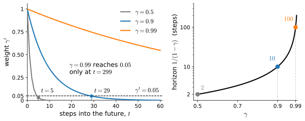

# Markov Decision Processes
:label:`sec_mdp`

A *Markov decision process* (MDP) provides a mathematical model of sequential interaction :cite:`BellmanMDP,Puterman.1994`. It consists of states, actions, transition probabilities, and rewards, together with the Markov assumption that the current state contains the information needed to predict the next state. This section develops these components using a sixteen-state FrozenLake environment.

We first inspect the simulator's transition data and then express the same model in notation. The transition dynamics describe the environment, whereas the reward specifies the objective. A final example shows how an apparently reasonable reward modification can change the optimal policy in an unintended way.

```{.python .input #mdp-markov-decision-processes}
%%tab pytorch
%matplotlib inline
from d2l import torch as d2l
import gymnasium as gym
import numpy as np
```

```{.python .input #mdp-markov-decision-processes}
%%tab jax
%matplotlib inline
from d2l import jax as d2l
import gymnasium as gym
import numpy as np
```

## The Model

:numref:`fig_rl_gridworld` shows the environment used in the next four sections: FrozenLake from the Gymnasium suite :cite:`Towers.Kwiatkowski.Terry.ea.2024`. The agent starts at the top-left cell and seeks the goal at the bottom right, which gives reward one. Four cells are holes, and reaching either a hole or the goal ends the episode. On *slippery* ice, a commanded move occurs with probability $1/3$; each of the two perpendicular moves also occurs with probability $1/3$.

![The environment for the next four sections. (a) S marks the start, G the goal, and the grey cells marked H are holes; each cell carries its state index. On non-slippery ice the shortest path takes six moves, for a discounted return of $\gamma^5$. (b) One command on slippery ice, read straight out of the transition table: from state $s = 9$ the action *down* lands in one of the three shaded cells with probability $1/3$ each; the intended move is one outcome among equals, and the probabilities sum to one.](../img/mdl-rl-gridworld.svg)
:label:`fig_rl_gridworld`

### States, Actions and the Transition Kernel

The set of *states* $\mathcal{S}$ is here the agent's cell, $\{0, 1, \ldots, 15\}$ numbered row by row; the set of *actions* $\mathcal{A}$ available in each state is the four commands *left*, *down*, *right*, *up*, encoded as 0 through 3. On slippery ice an action changes the state only in distribution; before writing that in symbols, look at it as data, because Gymnasium stores the ground truth of this environment as a table:

```{.python .input #mdp-states-actions-and-the-transition-kernel-1}
%%tab pytorch, jax
env = gym.make('FrozenLake-v1', is_slippery=True)
env.unwrapped.P[9][1]
```

Three tuples, one per outcome, each of the form (probability, next state, reward, terminated): commanded *down* from state 9, the agent reaches 13 as intended, or slides into 8 or 10, with probability $1/3$ each, as drawn in :numref:`fig_rl_gridworld`. In symbols this is the *transition kernel* $P: \mathcal{S} \times \mathcal{A} \times \mathcal{S} \to [0, 1]$, where $P(s' \mid s, a)$ is the conditional probability of reaching state $s'$ from state $s$ under action $a$; each row is a distribution, $\sum_{s' \in \mathcal{S}} P(s' \mid s, a) = 1$, because the agent must land somewhere.

The fourth object scores behavior: the *reward* $r: \mathcal{S} \times \mathcal{A} \to \mathbb{R}$, large when taking action $a$ at state $s$ helps the task and small when it does not. Together:

$$
\textrm{MDP}: \quad (\mathcal{S}, \mathcal{A}, P, r).
$$
:eqlabel:`eq_mdp`

Some treatments fold the discount factor of the next subsection into this tuple, and some let the reward be random or depend on the next state; our $r(s, a)$ then plays the role of the expected reward, and nothing in this chapter loses generality from the simpler form.

The whole model therefore fits in two dense arrays, which we wrap in a class and save to the `d2l` library; it is the object under study for the rest of this chapter:

```{.python .input #mdp-states-actions-and-the-transition-kernel-2}
%%tab pytorch, jax
class TabularMDP:  #@save
    """A finite MDP as dense arrays: P[s, a, s'] and r[s, a]."""
    def __init__(self, P, r, gamma):
        self.P, self.r, self.gamma = P, r, gamma
        self.num_states, self.num_actions = r.shape

    @classmethod
    def from_gym(cls, env, gamma):
        """Read the transition table Gymnasium exposes as env.unwrapped.P."""
        n_s, n_a = env.observation_space.n, env.action_space.n
        P, r = np.zeros((n_s, n_a, n_s)), np.zeros((n_s, n_a))
        for s, actions in env.unwrapped.P.items():
            for a, outcomes in actions.items():
                for p, s_next, reward, _ in outcomes:
                    P[s, a, s_next] += p      # several outcomes may share s'
                    r[s, a] += p * reward     # r(s,a) is the expected reward
        return cls(P, r, gamma)

    def backup(self, V):
        """Q(s, a) = r(s, a) + gamma * sum_{s'} P(s'|s, a) V(s')."""
        return self.r + self.gamma * self.P @ V
```

In `backup`, `numpy`'s matrix product contracts the last axis of $P$ against a value estimate $V$: reward plus discounted lookahead for every state-action pair, in one line. :numref:`sec_valueiter` builds this chapter's first algorithm by repeating it.

```{.python .input #mdp-states-actions-and-the-transition-kernel-3}
%%tab pytorch, jax
gamma = 0.95
LEFT, DOWN, RIGHT, UP = 0, 1, 2, 3
mdp = TabularMDP.from_gym(env, gamma)
print(mdp.P[9, DOWN])
```

The dictionary of tuples has become a dense row: probability $1/3$ in columns 8, 10 and 13, zero elsewhere. Two consistency checks, one per array:

```{.python .input #mdp-states-actions-and-the-transition-kernel-4}
%%tab pytorch, jax
print(f'largest |row sum - 1|: {np.abs(mdp.P.sum(axis=-1) - 1).max():.1e}')
for s, a in np.argwhere(mdp.r > 0):
    print(f'r(s={s}, a={"<v>^"[a]}) = {mdp.r[s, a]:.3f}')
```

Every row of $P$ sums to one. The reward array is almost entirely zero: its nonzero entries occur at state 14, the only cell from which the goal can be entered, and equal $1/3$ because the corresponding action reaches the goal with that probability. FrozenLake therefore provides reward only on transitions into the goal.

### Reward Design and Potential-Based Shaping

The reward is chosen by the designer to represent the task. In contrast, the states, actions, and transition kernel describe the environment. An optimization algorithm maximizes the specified reward, so a mismatch between the reward and the intended task can produce undesirable behavior.

One modification of a reward is provably safe. Take any *potential* $\Phi: \mathcal{S} \to \mathbb{R}$ that is zero at every state that ends an episode (the boundary condition doing quiet work below) and replace the reward on each transition by

$$\tilde r(s, a, s') = r(s, a) + \gamma \Phi(s') - \Phi(s).$$

Along a trajectory, the shaping terms telescope to $\gamma^T \Phi(s_T)-\Phi(s_0)$. The first term vanishes for an infinite discounted trajectory or for an episode ending at a state with $\Phi(s_T)=0$. Every policy's return then changes by the same constant $-\Phi(s_0)$, so the optimal policy is unchanged :cite:`Ng.Harada.Russell.1999`. This construction is called *potential-based shaping*.

The terminal-state condition is essential. If returns stop at the terminal transition and $\Phi(s_T)$ is unconstrained, the remaining term $\gamma^T\Phi(s_T)$ can depend on the terminal state and duration, thereby changing the optimum. Equivalently, one may retain an unconstrained terminal potential if the return includes an absorbing continuation that cancels the residual. General bonuses need not preserve the optimal policy; the example at the end of the section demonstrates such a failure. :numref:`sec_regularized` discusses explicit constraints, and :numref:`sec_rl_sequences` returns to reward misspecification at larger scale.

## Return, Discount and Horizon

A model is not yet a problem statement. The agent starts at a state $s_0$ drawn from a *start-state distribution* $\mu_0$ (a point mass on state 0 here; the distribution over prompts in :numref:`sec_rl_sequences`) and produces a *trajectory*

$$\tau = (s_0, a_0, r_0, s_1, a_1, r_1, s_2, a_2, r_2, \ldots),$$

where at each step $t$ it is at state $s_t$, takes action $a_t$, receives reward $r_t = r(s_t, a_t)$, and moves to $s_{t+1} \sim P(\cdot \mid s_t, a_t)$. The *return* of a trajectory is the total reward collected along it,

$$R(\tau) = r_0 + r_1 + r_2 + \cdots.$$

The goal of reinforcement learning is to act so that the return is as large as possible, on average over the randomness of the kernel, the start state and the agent's own choices. For finite discounted MDPs the problem is well posed: an optimal way of acting exists and can be taken deterministic and time-independent :cite:`Puterman.1994`. We make this precise with policies and value functions in :numref:`sec_valueiter`; the same objects anchor imitation from demonstrations (:numref:`sec_imitation`) and direct improvement from sampled returns (:numref:`sec_policygradient`). First we make $\tau$ concrete, with an agent that picks every command uniformly at random:

```{.python .input #mdp-return-discount-and-horizon}
%%tab pytorch, jax
rng = np.random.default_rng(8)
s, _ = env.reset(seed=8)
terminated = truncated = False
ret, t = 0.0, 0
while not (terminated or truncated):
    a = int(rng.integers(4))
    s_next, r, terminated, truncated, _ = env.step(a)
    print(f't={t:>2}  s={s:>2}  a={"<v>^"[a]}  r={r:.0f}')
    ret, s, t = ret + r, s_next, t + 1
print(f'terminated={terminated}, truncated={truncated}, return={ret:.0f}')
```

In the transcript, the agent commands *right* at $t=0$ but remains in place. At $t=2$, it commands *left* and instead moves *down* to state 4. At $t=8$, it commands *right* from state 10 and enters the hole at state 11. These outcomes illustrate the stochastic transition kernel in :numref:`fig_rl_gridworld`. Because the agent never reaches the goal, every reward and the total return are zero.

### The Geometric Bound and the Effective Horizon

An agent that wanders forever without reaching a hole or the goal has an infinitely long trajectory, and with positive rewards along the way the sum $R(\tau)$ could grow without bound. To keep the objective meaningful we introduce a *discount factor* $0 \leq \gamma < 1$ and use the discounted return

$$R(\tau) = r_0 + \gamma r_1 + \gamma^2 r_2 + \cdots = \sum_{t=0}^\infty \gamma^t r_t.$$

If rewards are bounded by $|r_t|\leq r_{\max}$, discounting makes the infinite return finite and gives a geometric bound on its tail:

$$|R(\tau)| \leq \frac{r_{\max}}{1 - \gamma}, \qquad \Big| \sum_{t \geq k} \gamma^t r_t \Big| \leq \frac{\gamma^k \, r_{\max}}{1 - \gamma}.$$

The first bound makes the objective finite. The second motivates the *effective horizon* $1/(1-\gamma)$. For a constant reward stream, the fraction of discounted mass after step $k$ is $\gamma^k$; hence 95 percent lies within $\log(0.05)/\log(\gamma)$ steps, approximately three effective horizons. For example, the effective horizons for $\gamma=0.5$ and $\gamma=0.99$ are two and one hundred steps, respectively.

```{.python .input #mdp-the-geometric-bound-and-the-effective-horizon}
%%tab pytorch, jax
print(f'{"gamma":>6} {"horizon 1/(1-gamma)":>20} {"t: gamma^t < 0.05":>18}')
for g in [0.5, 0.9, 0.95, 0.99]:
    t5 = int(np.ceil(np.log(0.05) / np.log(g)))
    print(f'{g:>6} {1 / (1 - g):>20.0f} {t5:>18}')
```

:numref:`fig_rl_return_discount` shows these quantities. The shortest path in FrozenLake takes six moves, so the terminal reward receives weight $\gamma^5$: approximately $0.03$ for $\gamma=0.5$ and $0.77$ for $\gamma=0.95$. The discount factor therefore determines the relative importance of delayed rewards.


:label:`fig_rl_return_discount`

### Episodes, Termination and Truncation

A state that ends the process is *terminal*. For analysis it may be represented as an absorbing state whose actions return to itself with zero reward. FrozenLake stores holes and the goal in this form, although the simulator ends the episode and requires a reset. A trajectory from the start to a terminal state is an *episode*. In an episodic task with at most $T$ steps, bounded rewards have a finite undiscounted sum and $\gamma=1$ is permitted. Continuing tasks instead rely on discounting or another average-reward formulation.

Gymnasium distinguishes termination from truncation. `terminated=True` means that the process reached a terminal state and has zero continuation value. `truncated=True` means that observation stopped, usually because of a time limit, although the state can have nonzero continuation value. Either flag may stop an interaction loop, but only termination should set a bootstrapped target's continuation to zero. The learning algorithms beginning in :numref:`sec_qlearning` therefore mask targets with `terminated` alone.

## The Choice of State

The kernel $P(s' \mid s,a)$ conditions only on the current state and action. This is the *Markov assumption*: once the present state is known, the history provides no additional information for predicting the next state. Whether the assumption holds depends on how the state is defined.

### The Markov Assumption and State Augmentation

Suppose the recorded state $s_t$ is a vehicle's location and the action $a_t$ is its acceleration. The next location also depends on the current velocity, which cannot generally be recovered from the current location alone. If velocity is inferred from successive locations, the dynamics have the form

$$s_{t+1} = f(s_t, a_t, s_{t-1});$$

and the location by itself is not Markov.

The problem is resolved by defining the state as $(\textrm{location},\textrm{velocity})$. Newtonian dynamics then determine the distribution of the next location and velocity from the current pair and the applied acceleration. Thus the Markov property is a condition on the representation of state, not only on the physical system.

This construction is called *state augmentation*: the state is enlarged until it contains the information needed to predict the future. Augmentation increases the state-space dimension, and the required sufficient statistic may be unknown, too large to store, or unobservable. The unobservable case leads to partial observability and belief states.

### Partial Observability

State augmentation requires the added variables to be observable. A poker player, for example, cannot observe the opponents' cards. When an agent receives an observation $o_t$ that reveals only part of the state, the problem is a *partially observable* MDP. Exact methods then maintain beliefs over the hidden state. A common approximation augments the observation with a short history. In Atari, a single frame gives position but not velocity, whereas several consecutive frames reveal motion. The remainder of this chapter assumes that the observation is a Markov state.

## Bandits, Degenerate MDPs and the Model-Based Axis

Two degenerate corners of the MDP, and one axis, organize much of what follows.

### The Bandit as a One-State MDP

When $|\mathcal{S}|=1$, each round consists of selecting an action and observing a reward. This is a *multi-armed bandit*. There are no state transitions or delayed rewards, so the problem isolates the exploration required to identify the action with the largest expected reward. :numref:`sec_qlearning` uses this setting to compare exploration strategies.

### The Degenerate MDP: Deterministic Transitions, Terminal Reward

Another special case has deterministic transitions and reward only at termination. FrozenLake has terminal-only reward, and disabling its slippery dynamics makes the transitions deterministic as well. Text generation has this structure when appending a token deterministically updates the context and a verifier or reward model assigns a score to the completed sequence. :numref:`sec_rl_sequences` develops this formulation.

### Model-Based versus Model-Free Methods

The computations above use the transition and reward model directly. Algorithms that plan with a known or learned model are *model-based*; value iteration in :numref:`sec_valueiter` is an example. *Model-free* algorithms instead use sampled transitions $(s,a,r,s')$, as in :numref:`sec_qlearning`. A model can be evaluated at any state-action pair, whereas samples are available only for pairs visited by the data-collection policy.

Because the original reward is sparse, one might add a bonus of $0.3$ whenever a transition moves closer to the goal. In expectation this gives $\tilde r(s,a)=r(s,a)+0.3\sum_{s'}P(s'\mid s,a)\mathbf{1}(d(s')<d(s))$, where $d$ is Manhattan distance. This modification is not potential based: movement toward the goal receives a bonus, whereas movement away incurs no corresponding penalty. We compute its optimal policy by repeated backups and evaluate both policies under the original reward using exact policy evaluation:

```{.python .input #mdp-model-based-versus-model-free}
%%tab pytorch, jax
dist = abs(np.arange(16) // 4 - 3) + abs(np.arange(16) % 4 - 3)
closer = dist < dist[:, None, None]    # closer[s, :, s'] = 1 iff d(s') < d(s)
shaped = TabularMDP(mdp.P, mdp.r + 0.3 * (mdp.P * closer).sum(-1), gamma)

def greedy_sweeps(m):                  # repeated backups; named in next section
    V = np.zeros(m.num_states)
    for _ in range(500):
        V = m.backup(V).max(axis=1)
    return m.backup(V).argmax(axis=1), V

def exact_value(pi, s=0):              # V(s) under the true reward, exactly
    i = np.arange(mdp.num_states)
    return np.linalg.solve(np.eye(16) - gamma * mdp.P[i, pi], mdp.r[i, pi])[s]

pi_shaped, V_shaped = greedy_sweeps(shaped)
pi_true, V_true = greedy_sweeps(mdp)
print(f'shaped-optimal: at s=14 goes {"<v>^"[pi_shaped[14]]}, shaped value '
      f'{V_shaped[0]:.2f}, true value {exact_value(pi_shaped):.3f}')
print(f'true-optimal:   at s=14 goes {"<v>^"[pi_true[14]]}, true value '
      f'{exact_value(pi_true):.3f}')
```

State 14 is the only cell from which the goal can be entered. The optimal policy for the original reward commands *down*, which reaches the goal with probability $1/3$. The policy optimized for the shaped reward instead commands *left*, whose possible successors are states 10, 13, and 14. It therefore never reaches the goal. Its value under the original reward is zero, although its value under the shaped reward is $2.15$, compared with $0.180$ for the original optimum. The per-step bonus favors continuing to collect approach rewards instead of terminating. With a smaller bonus of $0.1$, the policy still reaches the goal but remains altered. Exercise 4 replaces the bonus with a potential-based reward.

## Summary

A Markov decision process consists of states $\mathcal{S}$, actions $\mathcal{A}$, a transition kernel $P$, and a reward $r$. The Markov assumption requires the state to contain the information from the past needed to predict the future; state augmentation can restore this property when the necessary information is observable. The objective is expected discounted return, and $1/(1-\gamma)$ provides a useful effective-horizon scale. Terminal states end the process, whereas truncation ends only the observation of it, so bootstrapped value estimates must distinguish the two. A one-state MDP is a bandit, and a deterministic MDP with terminal reward describes settings such as text generation. Potential-based shaping preserves the optimal policy when its terminal conditions are handled correctly; arbitrary reward modifications do not.

**Experimental scope.** Except for the illustrative sampled trajectory, the results in this section are exact computations on a known sixteen-state model. The reward-shaping example establishes that one plausible bonus can change the optimal policy; it does not imply that all reward shaping fails. Estimation, exploration, and function approximation are introduced in later sections.

## Exercises

1. [conceptual] *What the state must contain.* A single frame of
   [Pong](https://gymnasium.farama.org/environments/atari/pong/) shows where the
   ball is but not where it is going, so the frame alone is not a state in the
   sense of :numref:`sec_mdp`. Say precisely which property of
   :eqref:`eq_mdp` fails, give the smallest augmentation of the frame that
   restores it, and explain why the standard practice of stacking four frames
   is more than the minimum. Then do the same for
   [MountainCar](https://gymnasium.farama.org/environments/classic_control/mountain_car/):
   name its state and action sets, and say what the environment would have to
   report instead for the position alone to be Markov.
1. [short-code] *Look at a transition function.* Build the slippery
   FrozenLake MDP with
   `mdp = d2l.TabularMDP.from_gym(gym.make('FrozenLake-v1', is_slippery=True), gamma)`.
   Verify that every row of `mdp.P` sums to one,
   and count how many state-action pairs have more than one possible successor.
   Repeat with `is_slippery=False`. How many numbers does the deterministic MDP
   need, and how many does the slippery one need?
1. [short-code] *The effective horizon.* Rewards in this book are bounded by
   some $r_{\max}$. Show that the tail of the discounted return past step $k$ is
   at most $\gamma^k r_{\max} / (1 - \gamma)$, and find, for
   $\gamma \in \{0.9, 0.95, 0.99, 0.999\}$, the smallest $k$ at which that tail
   is below one percent of the maximum possible return. Plot $k$ against
   $1/(1-\gamma)$. Our gridworld's optimal path is six steps long: which of these
   discount factors can even see the goal?
1. [conceptual] *Reward design and its failure.* The gridworld gives reward $1$ at the
   goal and nothing elsewhere, which makes learning slow. The section's shaped
   reward gives a bonus for moving closer to the goal, and the policy it makes
   optimal never reached the goal at all. Consider the closely related two-sided
   form $r(s, a) = d(s) - d(s')$ with $d$ the Manhattan distance. Show that on a
   map with a wall this too can make a policy that never reaches the goal earn
   more than one that does. Then show that the *potential-based* form
   $r(s,a) + \gamma \Phi(s') - \Phi(s)$ leaves the optimal policy unchanged for
   any function $\Phi$ with $\Phi = 0$ at terminal states: write out the
   telescoping sum for an episode of length $T$, exhibit the residual
   $\gamma^T \Phi(s_T)$ that survives at the endpoint, and give the two ways to
   kill it (the zero boundary condition, or continuing the shaped reward
   through the absorbing state). Finally, identify what goes wrong with the
   naive fixes in that language.
1. [conceptual] *Random rewards.* :numref:`sec_mdp` notes that a random reward
   can be folded into $r(s,a)$ by taking its mean. Make this precise: let the
   reward at $(s,a)$ be a random variable $R$ with $E[R] = r(s,a)$, drawn
   independently at each visit. Show that the value function of every policy is
   unchanged. Where, then, does the randomness of $R$ show up at all?
1. [conceptual] *Which problems are not MDPs.* For each of the following, say
   whether it is an MDP under the obvious choice of state, and if not, what to
   add: a poker hand; a robot whose battery drains; a recommender that a user
   grows tired of; a chess position with the fifty-move rule.

[Discussions](https://d2l.discourse.group/)

<!-- slides -->

::: {.slide}
::: {.cover}
[Dive into Deep Learning · §14.1]{.kicker}

Markov decision processes<br>
**four objects, one assumption · the kernel as data · the discount as a horizon · the reward will be attacked**
:::
:::

::: {.slide title="Four Objects and One Assumption"}
Acting changes the data the agent will see next. The model of acting over time:

$$\textrm{MDP}: \quad (\mathcal{S}, \mathcal{A}, P, r)$$

- $\mathcal{S}$: states. $\mathcal{A}$: actions.
- $P(s' \mid s, a)$: transition kernel, a **distribution** over next states.
- $r(s, a)$: expected immediate reward. **Written by you.**

. . .

The assumption: given the present state, the past is irrelevant
for predicting the future.
:::

::: {.slide title="The Kernel Is Data"}
Slippery FrozenLake: a command goes as intended with probability $1/3$,
and slides perpendicular with probability $1/3$ each.

@mdp-states-actions-and-the-transition-kernel-1

. . .

@mdp-states-actions-and-the-transition-kernel-3

The commanded move is one outcome among equals.
:::

::: {.slide title="One Object for the Whole Chapter"}
@mdp-states-actions-and-the-transition-kernel-2

`backup` is one application of $r + \gamma P V$: the chapter's
algorithms are built out of this line.
:::

::: {.slide title="Trajectory and Return"}
$$\tau = (s_0, a_0, r_0, s_1, a_1, r_1, \ldots), \qquad
R(\tau) = \sum_{t=0}^{\infty} \gamma^t r_t$$

@mdp-return-discount-and-horizon

FrozenLake gives reward only on reaching the goal; this episode has return zero.
:::

::: {.slide title="The Discount Is a Horizon"}
{width=88%}

. . .

@!mdp-the-geometric-bound-and-the-effective-horizon

$\gamma = 0.99$ is not "close to one"; it is a hundred steps.
:::

::: {.slide title="Terminated Is Not Truncated"}
- **terminated**: the process entered a terminal state.
  The future is empty, worth exactly zero.
- **truncated**: we stopped watching (a time limit).
  The state still has a future; the recording does not.

. . .

Control flow may merge them. Value estimation never may:
bootstrapped targets are masked by `terminated` alone.
:::

::: {.slide title="Reward Misspecification"}
A plausible modification of a sparse reward: add $0.3$ for a step that moves
the agent closer to the goal.

@mdp-model-based-versus-model-free

. . .

At $s = 14$, the only cell bordering the goal, the shaped optimum
turns **away**: it never finishes. Shaped value $2.15$; true value
exactly $0$. Only potential-based shaping,
$r + \gamma \Phi(s') - \Phi(s)$ with $\Phi = 0$ at terminal states,
is guaranteed safe.
:::

::: {.slide title="Recap"}
- An MDP is $(\mathcal{S}, \mathcal{A}, P, r)$ with discount $\gamma$.
- The kernel is a distribution: on slippery ice, commands are proposals.
- Effective horizon $1/(1-\gamma)$: rewards past it are geometrically negligible.
- Terminal states end the future; truncation only ends the recording.
- Not Markov? Augment the state (location *and* velocity; stacked frames).
- Bandit = one-state MDP; text generation = deterministic, terminal-reward MDP.
- The reward is authored, and the optimizer exploits what you wrote.
:::
