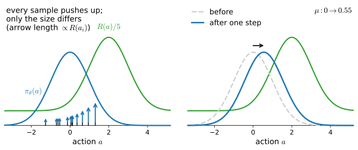

# Policy Gradient
:label:`sec_policygradient`

:numref:`sec_valueiter` planned with the model, :numref:`sec_imitation` copied an expert, and :numref:`sec_qlearning` learned action values from samples, always extracting the policy indirectly, through an argmax over a table. This section learns the policy *directly*: write $\pi_\theta(a \mid s)$ as a differentiable function of parameters $\theta$ and ascend the expected return $J(\theta)$ by gradient steps :cite:`Williams.1992`. One identity, the log-derivative trick, turns that gradient into an average over trajectories; inside the average the transition probabilities cancel; and what remains is a quantity the agent can compute from its own rollouts, no model and no value function required. The derivation is short, and the honest work comes after it: we run the estimator, then hold it against the *exact* gradient, which our sixteen-state lake lets us compute, and measure what unbiased does and does not buy. The price, fresh trajectories for every update and noise that shrinks only as $1/\sqrt{n}$, sets up :numref:`sec_baselines`.

```{.python .input #policy-gradient-policy-gradient}
%%tab pytorch
%matplotlib inline
from d2l import torch as d2l
import gymnasium as gym
import numpy as np
import torch
```

```{.python .input #policy-gradient-policy-gradient}
%%tab jax
%matplotlib inline
from d2l import jax as d2l
from flax import nnx
import gymnasium as gym
import jax
from jax import numpy as jnp
import numpy as np
```

## Parameterizing the Policy

Our laboratory is the FrozenLake of :numref:`fig_rl_gridworld`, with one deliberate change: the slip is off.

```{.python .input #policy-gradient-parameterizing-the-policy}
%%tab pytorch, jax
gamma = 0.95
env = gym.make('FrozenLake-v1', is_slippery=False)
```

The determinism is an assumption, and it buys this section its subject: on ice a policy that is still mostly random reaches the goal so rarely that whole-trajectory credit assignment collects no signal at any budget a textbook would spend, and the estimator is the subject here, the environment scenery. :numref:`sec_qlearning` measured what the stochasticity costs the value-based side; :numref:`sec_baselines` stays on this same calm map.

### Softmax preferences

To learn a policy by gradient ascent we must first write it as a differentiable function of parameters. We already own the object that does: `ActorCritic.tabular` from :numref:`sec_imitation` keeps one free parameter $\theta_{s,a}$ per state-action pair, a *preference*, in an embedding table, and turns the preferences at state $s$ into a distribution with a softmax,

$$\pi_\theta(a \mid s) = \frac{e^{\theta_{s,a}}}{\sum_{a'} e^{\theta_{s,a'}}}.$$
:eqlabel:`eq_softmax_policy`

This is the model of :numref:`sec_softmax` with an image replaced by a state index, and it is deliberately the class that behavior cloning trained: this section builds no new policy machinery, and `policy_step` will reappear below with only its weights reinterpreted. Zero initialization starts the policy exactly uniform. Note what the preferences are not: nothing constrains $\theta_{s,a}$ to approximate a value such as $Q(s, a)$, and nothing will; they are free parameters whose only job is to place probability well.

### The score function

The softmax is easy to differentiate. Since $\log \pi_\theta(a \mid s) = \theta_{s,a} - \log \sum_{a'} e^{\theta_{s,a'}}$, the derivative with respect to the preference $\theta_{s,b}$ of any action $b$ at the same state is

$$\frac{\partial \log \pi_\theta(a \mid s)}{\partial \theta_{s,b}} = \mathbf{1}(b = a) - \pi_\theta(b \mid s),$$
:eqlabel:`eq_softmax_score`

and the derivative with respect to the preferences of every other state is zero. The quantity $\nabla_\theta \log \pi_\theta(a \mid s)$ is called the *score function*, and it is the central object of this section. Read :eqref:`eq_softmax_score` twice: it raises the preference of the action actually taken and lowers the others in proportion to their current probability, and it sums to zero over $b$, so an update can only *redistribute* probability at a state, never inflate all of it (exercise 1). We do not hand-code the equation anywhere; autograd differentiates `log_prob` for us, so the useful thing a short check can do is *verify* it, at a generic table rather than at the too-symmetric uniform start:

```{.python .input #policy-gradient-the-score-function}
%%tab pytorch
rng = np.random.default_rng(0)
check = d2l.ActorCritic.tabular(16, 4)
with torch.no_grad():   # move to a generic table, off the uniform start
    check.policy.weight.copy_(torch.as_tensor(rng.standard_normal((16, 4))))
check.log_prob(torch.tensor([6]), torch.tensor([2])).backward()
probs = np.exp(check.log_prob_np(np.repeat(6, 4), np.arange(4)))
hand = np.zeros((16, 4), dtype=np.float32)
hand[6], hand[6, 2] = -probs, 1 - probs[2]
print(bool(torch.allclose(check.policy.weight.grad, torch.as_tensor(hand),
                          atol=1e-6)))
```

```{.python .input #policy-gradient-the-score-function}
%%tab jax
rng = np.random.default_rng(0)
theta = jnp.asarray(rng.standard_normal((16, 4)))   # a generic table
score = jax.grad(lambda th: jax.nn.log_softmax(th[6])[2])(theta)
hand = jnp.zeros_like(theta).at[6].set(-jax.nn.softmax(theta[6]))
hand = hand.at[6, 2].add(1.0)
print(bool(jnp.allclose(score, hand, atol=1e-6)))
```

Both tabs confirm the identity from the same random table, each by its own mechanism: the `pytorch` tab backpropagates through the model's `log_prob` and reads the gradient off the embedding table, while the `jax` tab differentiates the log-softmax as a pure function of the table. From here on, every qualitative claim about what REINFORCE does to the preferences reads directly off :eqref:`eq_softmax_score`.

### Why this parameterization survives

:numref:`sec_valueiter` proved that a deterministic optimal policy always exists, so why parameterize a stochastic one? Three reasons, in increasing order of importance. A stochastic policy explores as a side effect of acting: the softmax keeps every action's probability positive, so the agent's own rollouts keep auditing every action with no separate $\epsilon$-greedy mechanism bolted on. A deterministic policy is not usefully differentiable: as a function of $\theta$, an argmax is piecewise constant, its gradient zero almost everywhere, while the softmax makes $\pi_\theta$, and through it the objective, smooth. And it is the parameterization that scales: put a network under the same softmax and :eqref:`eq_softmax_policy` is unchanged (:numref:`sec_deeprl`); let the state be a context and the actions a vocabulary and it is a language model's next-token distribution, trained at scale by the very updates this section derives (:numref:`sec_rl_sequences`).

## The Policy Gradient

With a differentiable policy in hand, acting well becomes an optimization problem, and this section is one derivation run to its end.

### An optimization problem over trajectories

Imagine, as in :numref:`sec_valueiter`, that the agent starts at a state $s_0$ and takes actions from the policy $\pi_\theta$ for $T$ timesteps, producing a trajectory $\tau = (s_0, a_0, r_0, s_1, a_1, r_1, \ldots, s_T)$ with return $R(\tau) = \sum_{t=0}^{T-1} \gamma^t r(s_t, a_t)$. The probability of observing a particular trajectory $\tau$ is the product of the probabilities of each action taken by the agent and each transition made by the environment,

$$P(\tau; \theta) = \prod_{t=0}^{T-1} \pi_\theta(a_t \mid s_t)\ P(s_{t+1} \mid s_t, a_t).$$
:eqlabel:`eq_traj_prob`

If the start state were drawn from the distribution $\mu_0$ of :numref:`sec_mdp`, a factor $\mu_0(s_0)$ would multiply this product; it does not depend on $\theta$ and drops out of every gradient below, so we keep the start state fixed as in our gridworld. Hold on to $\mu_0$ anyway: when the Language Models part treats text generation as a decision process, the distribution over prompts is exactly this factor (:numref:`sec_rl_sequences`). Our objective is the average return over trajectories, viewed as a function of the policy parameters,

$$J(\theta) = E_{\tau \sim P(\cdot;\, \theta)} \Big[ R(\tau) \Big] = \sum_{\tau} R(\tau)\ P(\tau; \theta),$$
:eqlabel:`eq_pg_objective`

where the summation runs over all possible trajectories of length $T$. Note that $J(\theta) = V^{\pi_\theta}(s_0)$ in the notation of :numref:`sec_valueiter` (our gridworld is episodic: every trajectory reaches a terminal state, after which all rewards are zero, so the finite sum agrees with the infinite-horizon return); the new point of view is that we can search for good parameters directly,

$$\max_\theta J(\theta) = \max_\theta \sum_{\tau} R(\tau)\ P(\tau; \theta).$$

The trajectory is about to become the unit of data for everything ahead, so we give it a data structure before differentiating anything. A `Batch` stores the transitions of many episodes as flat arrays plus the boundaries between episodes, and it records the `terminated` flag, never `truncated`: :numref:`sec_mdp` drew that line once, and this container is where the whole chapter keeps it.

```{.python .input #policy-gradient-an-optimization-problem-over-trajectories-1}
%%tab pytorch, jax
class Batch:  #@save
    """A flat batch of transitions, plus the episode boundaries."""
    def __init__(self, obs, act, rew, next_obs, term, ep_ends):
        self.obs, self.act, self.rew = obs, act, rew
        self.next_obs, self.term = next_obs, term
        self.ep_ends = ep_ends    # one past the last step of each episode

    def __len__(self):
        return len(self.rew)

    def episodes(self):
        """Yield one slice per episode."""
        start = 0
        for end in self.ep_ends:
            yield slice(start, end)
            start = end

    def episode_returns(self, gamma=1.0):
        """R(tau), the discounted return, one number per episode."""
        return np.array([(gamma ** np.arange(ep.stop - ep.start)
                          * self.rew[ep]).sum() for ep in self.episodes()])
```

Filling it is a loop over the `evaluate` protocol of :numref:`sec_valueiter`, a policy being any function `policy(obs, rng) -> action`:

```{.python .input #policy-gradient-an-optimization-problem-over-trajectories-2}
%%tab pytorch, jax
def rollout(env, policy, num_episodes, rng):  #@save
    """Collect complete episodes from `policy(obs, rng) -> action` as a
    Batch; `term` records `terminated`, never `truncated` (:numref:`sec_mdp`).

    All sampling runs through the one numpy generator `rng`."""
    cols, ep_ends = [[] for _ in range(5)], []
    for _ in range(num_episodes):
        obs, done = env.reset()[0], False
        while not done:
            act = policy(obs, rng)
            next_obs, reward, terminated, truncated, _ = env.step(act)
            done = terminated or truncated
            for col, val in zip(cols, (obs, act, reward, next_obs,
                                       float(terminated))):
                col.append(val)
            obs = next_obs
        ep_ends.append(len(cols[0]))
    obs, act, rew, next_obs, term = (np.asarray(c) for c in cols)
    return Batch(obs, act, rew.astype(np.float32), next_obs,
                 term.astype(np.float32), np.asarray(ep_ends))
```

Both objects are plain numpy and shared verbatim between the framework tabs; framework arrays appear only inside update functions, converted at their first line, so everything a batch carries is data by construction. Nothing here is specific to this section: `rollout` feeds every learning algorithm in the rest of these two chapters.

### The log-derivative trick

To maximize $J(\theta)$ by gradient ascent we need its gradient. The return $R(\tau)$ of a fixed trajectory does not depend on $\theta$, only the probability of the trajectory does, so (the summation is finite, so we can exchange it with the gradient)

$$
\begin{aligned}
\nabla_\theta J(\theta) &= \nabla_\theta \sum_\tau R(\tau)\ P(\tau; \theta) = \sum_\tau R(\tau)\ \nabla_\theta P(\tau; \theta) \\
&= \sum_\tau R(\tau)\ P(\tau; \theta)\ \frac{\nabla_\theta P(\tau; \theta)}{P(\tau; \theta)} \\
&= \sum_\tau P(\tau; \theta)\ R(\tau)\ \nabla_\theta \log P(\tau; \theta),
\end{aligned}
$$

where we multiplied and divided by $P(\tau; \theta)$ and used the identity $\nabla \log P = \nabla P / P$. This step, known as the log-derivative trick, is important because it turns the gradient back into an average over trajectories,

$$\nabla_\theta J(\theta) = E_{\tau \sim P(\cdot;\, \theta)} \Big[ R(\tau)\ \nabla_\theta \log P(\tau; \theta) \Big],$$
:eqlabel:`eq_pg_gradient`

and averages over trajectories are exactly what the agent can estimate by sampling: it simply runs its current policy.

### The transition probabilities drop out

At first sight :eqref:`eq_pg_gradient` still seems to require the MDP, because $P(\tau; \theta)$ in :eqref:`eq_traj_prob` contains the transition function. But watch what happens when we take the logarithm of the product and differentiate:

$$
\begin{aligned}
\nabla_\theta \log P(\tau; \theta) &= \nabla_\theta \Big[ \sum_{t=0}^{T-1} \log \pi_\theta(a_t \mid s_t) + \sum_{t=0}^{T-1} \log P(s_{t+1} \mid s_t, a_t) \Big] \\
&= \sum_{t=0}^{T-1} \nabla_\theta \log \pi_\theta(a_t \mid s_t).
\end{aligned}
$$

The transition probabilities do not depend on the policy parameters $\theta$, so their gradient is zero and they vanish from the expression. Just as in Q-Learning, we have not cheated: the transition function still determines *which* trajectories the agent is likely to experience, but we never need to evaluate it; it enters only implicitly, through the sampled data.

### The REINFORCE estimator

We now approximate the expectation in :eqref:`eq_pg_gradient` with an empirical average. The agent runs its current policy $\pi_\theta$ to collect $n$ trajectories $\tau_1, \ldots, \tau_n$ and computes

$$\hat{u} = \frac{1}{n} \sum_{i=1}^n R(\tau_i)\ \sum_{t=0}^{T-1} \nabla_\theta \log \pi_\theta(a_t^i \mid s_t^i),$$
:eqlabel:`eq_reinforce`

which is an unbiased estimate of $\nabla_\theta J(\theta)$, and then takes a gradient ascent step $\theta \leftarrow \theta + \alpha \hat{u}$ with learning rate $\alpha$. This algorithm is known as REINFORCE :cite:`Williams.1992`. It has a simple interpretation: each term pushes up the log-probability of the actions taken in trajectory $\tau_i$, scaled by the return of that trajectory. Trajectories with high *return* have the probability of their actions increased; trajectories with low *return* have them decreased. Note that after every parameter update the policy changes, so the agent must collect fresh trajectories from the new policy before the next update. :numref:`fig_rl_score_ascent` draws one such step on the smallest possible instance, and one detail of the picture deserves to be remembered: where rewards are all positive, every sampled action's probability is pushed *up*, and the estimator relies entirely on the relative sizes of the pushes, plus the fact that probabilities sum to one, to sort good actions from bad. Giving the pushes a zero point is the business of :numref:`sec_baselines`.

![One REINFORCE step on a one-step problem: a Gaussian policy $\pi_\theta(a) = \mathcal{N}(a; \mu, 1)$ with $\mu = 0$, and the reward $R(a) = 0.4 + 2 e^{-(a - 2)^2/2}$, so that the expected reward is $J = 0.92$ and the exact gradient is $\mathrm{d}J/\mathrm{d}\mu = 0.52$. (a) Twelve sampled actions, each pushing its own log-probability up in proportion to the reward it earned: every arrow points up, because every reward here is positive, and only the sizes differ. (b) The policy after the one resulting update, its mean moved from $0$ to $0.55$, toward the actions that paid most.](../img/mdl-rl-score-ascent.svg)
:label:`fig_rl_score_ascent`

In code, the estimator is the `policy_step` of :numref:`sec_imitation` with the weights finally carrying information: there every weight was $1$, a teacher's uniform endorsement; here the weight on every step of trajectory $i$ is the return $R(\tau_i)$ that whole trajectory earned. As with `q_learning` in :numref:`sec_qlearning`, whatever the caller wants to keep is passed in, here the agent itself and a ledger of environment steps that the last part of this section will audit:

```{.python .input #policy-gradient-the-reinforce-estimator-1}
%%tab pytorch, jax
def train_reinforce(ac, seed, steps, num_updates=256, batch_episodes=16):
    """REINFORCE: a fresh batch from the current policy, every step of a
    trajectory weighted by that trajectory's return, one ascent step."""
    rng = np.random.default_rng(seed)      # one stream for all sampling
    env.reset(seed=seed)
    for _ in range(num_updates):
        batch = rollout(env, ac.act, batch_episodes, rng)
        R = batch.episode_returns(gamma)
        d2l.policy_step(ac, batch,
                        np.repeat(R, np.diff(batch.ep_ends, prepend=0)))
        steps.append(len(batch))
        yield float(R.mean())
```

One note on fidelity: `policy_step` averages the weighted log-probabilities over *steps* where :eqref:`eq_reinforce` averages over *trajectories*, a rescaling by the batch's mean episode length that the optimizer's step size absorbs. Three seeds, and the curve each run yields is the estimate of $J(\theta)$ itself, computed from the very trajectories that drove the updates, so it costs nothing extra:

```{.python .input #policy-gradient-the-reinforce-estimator-2}
%%tab pytorch, jax
agents, steps, curves = [], [], []
for seed in range(3):
    if tab.selected('pytorch'):
        torch.manual_seed(seed)            # init stream; the table is zeros
        agents.append(d2l.ActorCritic.tabular(16, 4))
    if tab.selected('jax'):
        agents.append(d2l.ActorCritic.tabular(16, 4, rngs=nnx.Rngs(seed)))
    steps.append([])
    curves.append(list(train_reinforce(agents[-1], seed, steps[-1])))
curves, steps = np.array(curves), np.array(steps)
d2l.plot_curves({'REINFORCE': curves}, xlabel='update',
                ylabel='mean return of the batch', reference=gamma ** 5)
```

The curve has two phases. It hugs zero while success is an accident: a batch without a single successful trajectory has every $R(\tau_i) = 0$, so :eqref:`eq_reinforce` is exactly zero and the policy does not move at all. Then improvement compounds, because every success sharpens the policy along its own path, which makes the next success likelier: within about thirty updates the batch mean crosses $0.7$ and settles just below the dashed line at $\gamma^5 \approx 0.774$, the return of a six-step path. It hovers below that ceiling because the policy stays stochastic: any sampled deviation from the path either lengthens the trajectory or ends it in a hole. What did it learn?

```{.python .input #policy-gradient-the-reinforce-estimator-3}
%%tab pytorch, jax
probs = np.exp(agents[0].log_prob_np(np.repeat(np.arange(16), 4),
                                     np.tile(np.arange(4), 16))).reshape(16, 4)
d2l.show_grid(env.unwrapped.desc, probs.max(axis=1), probs.argmax(axis=1))
```

The arrows show each state's most probable action and the shading its probability, from near-uniform ($0.25$ with four actions) to near-certain. The policy has sharpened along a shortest path to the goal, though not necessarily the one value iteration produced for this calm map in :numref:`sec_valueiter`: the grid admits three distinct six-step routes that avoid the holes, all of them optimal, and REINFORCE locks onto whichever one its first lucky trajectories happened to take, so a different seed can lock onto a different one. The cells that stay at exactly $0.25$ are the holes and the goal: the agent never takes an action *from* a terminal state, so their preferences are never touched. The remaining cells are sharp in proportion to how often trajectories still visit them; states the converged policy no longer passes through stopped learning wherever they were.

### The policy gradient theorem

REINFORCE weights a whole trajectory's score by the whole trajectory's return. The same gradient has a second form, organized by states rather than by trajectories, which is how the literature most often writes it and how this book will use it from the next section on.

**Proposition (policy gradient theorem).** *For the objective $J(\theta) = E_{s_0 \sim \mu_0} [V^{\pi_\theta}(s_0)]$,*

$$\nabla_\theta J(\theta) = E_{\tau \sim P(\cdot;\, \theta)} \Big[ \sum_{t \geq 0} \gamma^t\, \nabla_\theta \log \pi_\theta(a_t \mid s_t)\ Q^{\pi_\theta}(s_t, a_t) \Big] = \frac{1}{1 - \gamma}\, E_{s \sim d^{\pi_\theta}_\gamma,\ a \sim \pi_\theta(\cdot \mid s)} \Big[ \nabla_\theta \log \pi_\theta(a \mid s)\ Q^{\pi_\theta}(s, a) \Big],$$
:eqlabel:`eq_pg_theorem`

*where $d^{\pi_\theta}_\gamma(s) = (1 - \gamma) \sum_{t \geq 0} \gamma^t \Pr(s_t = s)$ is the discounted state-occupancy distribution* :cite:`Sutton.McAllester.Singh.ea.2000`.

Three readings. First, what multiplies the score at step $t$ is no longer the whole trajectory's return but the action value $Q^{\pi_\theta}(s_t, a_t)$ of :numref:`sec_valueiter`: rewards collected *before* step $t$ cannot have been caused by the action taken there, and dropping them is the first variance reduction of :numref:`sec_baselines`. Second, the right-hand form averages over where the policy spends its discounted time rather than over trajectories; this is the form in which policy gradients meet theory, and the occupancy is where the start distribution $\mu_0$ enters everything downstream. Third, a caveat that rarely gets a name: practical implementations sample states as visits accumulate, without the $\gamma^t$ weights, so what they estimate is the gradient of a slightly different objective than $J$; nearly everyone drops the factor, and exercise 6 prices the choice.

## What It Costs

### On-policy: fresh data after every update

The estimator :eqref:`eq_reinforce` is an average over trajectories drawn from the *current* policy: it approximates :eqref:`eq_pg_gradient`, an expectation under $P(\tau; \theta)$. The moment the parameters move, trajectories collected earlier come from the wrong distribution, and the derivation licenses nothing about them. Methods with this property are called *on-policy*: the agent learns only about the policy it is executing, and every update bills for a fresh batch. Q-learning is the opposite kind, *off-policy*: the $\max$ in its target lets it learn about the greedy policy from data collected by any policy (:numref:`sec_qlearning`), so old experience keeps its value. The difference is not elegance but cost, and the ledger we kept prices it in the same currency as :numref:`sec_qlearning`, environment steps:

```{.python .input #policy-gradient-on-policy-fresh-data-after-every-update}
%%tab pytorch, jax
hit = (curves >= 0.7).argmax(axis=1)
to_hit = np.array([s[:k + 1].sum() for s, k in zip(steps, hit)])
print(f'update at which the batch mean first reaches 0.7: {np.sort(hit)}')
print(f'environment steps spent by that update:  {np.sort(to_hit)}')
print(f'environment steps spent by the full run: {np.sort(steps.sum(axis=1))}')
```

The learning cost between three and four and a half thousand environment steps; the run cost about twenty-seven thousand, because an on-policy method keeps buying fresh data at the same rate after the policy has converged, and nothing it bought earlier can be reused. For scale, the median Q-learning run of :numref:`sec_qlearning` consumed $95{,}569$ environment steps, though on the slippery map, where the task itself is harder; its deterministic contrast cell solved this same calm map from 256 episodes. The honest habit is the bookkeeping itself: measure in environment steps, and remember that an on-policy bill scales with updates whether or not the updates still teach anything. Reusing a batch for several updates without correction is the obvious economy, and exercise 5 has you try it while watching the quantity that decides when it breaks, the probability ratio between the new policy and the one that collected the data; making that reuse safe is the subject of :numref:`sec_ppo`.

### Unbiased, and how noisy

The word *unbiased* has been doing quiet work since :eqref:`eq_reinforce`. It is a strong claim: the noisy vector computed from a handful of trajectories points, on average, exactly along $\nabla_\theta J(\theta)$. Almost nobody ever checks it, because almost nobody has the true gradient; on sixteen states we do. For the softmax policy, writing $P^\pi$ for its transition matrix and $r^\pi$ for its expected one-step reward, the objective of :eqref:`eq_pg_objective` has the closed form

$$J(\theta) = V^{\pi_\theta}(s_0) = \Big[ \big(I - \gamma P^{\pi_\theta}\big)^{-1} r^{\pi_\theta} \Big]_{s_0},$$

a linear solve, every step of it differentiable, so autograd delivers the *exact* $\nabla_\theta J$ in milliseconds of CPU, the same trick of grading against locked-away truth as in :numref:`sec_qlearning`. The interesting regime is mid-training, where the estimator still has work to do, so we freeze a fresh run after 16 updates:

```{.python .input #policy-gradient-unbiased-and-how-noisy-1}
%%tab pytorch
mdp = d2l.TabularMDP.from_gym(env, gamma)
P, r = torch.as_tensor(mdp.P).float(), torch.as_tensor(mdp.r).float()
torch.manual_seed(3)
probe = d2l.ActorCritic.tabular(16, 4)
for _ in train_reinforce(probe, 3, [], num_updates=16):
    pass
theta = probe.policy.weight.detach().requires_grad_(True)
pi = torch.softmax(theta, -1)
J = torch.linalg.solve(torch.eye(16) - gamma * torch.einsum('sa,sat->st',
                                                            pi, P),
                       (pi * r).sum(-1))[0]
g_exact = torch.autograd.grad(J, theta)[0].numpy()
print(f'J(theta) after 16 updates = {J.item():.3f}, '
      f'against the ceiling gamma^5 = {gamma ** 5:.3f}')
```

```{.python .input #policy-gradient-unbiased-and-how-noisy-1}
%%tab jax
mdp = d2l.TabularMDP.from_gym(env, gamma)
P, r = jnp.asarray(mdp.P), jnp.asarray(mdp.r)
probe = d2l.ActorCritic.tabular(16, 4, rngs=nnx.Rngs(3))
for _ in train_reinforce(probe, 3, [], num_updates=16):
    pass

def J_fn(theta):
    pi = jax.nn.softmax(theta, -1)
    return jnp.linalg.solve(jnp.eye(16) - gamma * jnp.einsum('sa,sat->st',
                                                             pi, P),
                            (pi * r).sum(-1))[0]

theta = probe.policy.embedding[...]
g_exact = np.asarray(jax.grad(J_fn)(theta))
print(f'J(theta) after 16 updates = {float(J_fn(theta)):.3f}, '
      f'against the ceiling gamma^5 = {gamma ** 5:.3f}')
```

Now hold $\theta$ fixed and draw the estimator :eqref:`eq_reinforce` fifty times at each batch size:

```{.python .input #policy-gradient-unbiased-and-how-noisy-2}
%%tab pytorch
def reinforce_estimate(n, rng):
    """One draw of eq_reinforce: n fresh trajectories at the frozen theta."""
    batch = rollout(env, probe.act, n, rng)
    w = np.repeat(batch.episode_returns(gamma),
                  np.diff(batch.ep_ends, prepend=0)).astype(np.float32)
    th = probe.policy.weight.detach().requires_grad_(True)
    logp = torch.log_softmax(th, -1)[torch.as_tensor(batch.obs),
                                     torch.as_tensor(batch.act)]
    return torch.autograd.grad((torch.as_tensor(w) * logp).sum() / n,
                               th)[0].numpy().ravel()

rng, g = np.random.default_rng(4), g_exact.ravel()
for n in [4, 16, 64]:
    U = np.stack([reinforce_estimate(n, rng) for _ in range(50)])
    zero = int((np.linalg.norm(U, axis=1) == 0).sum())
    cos = U.mean(axis=0) @ g / (np.linalg.norm(U.mean(axis=0))
                                * np.linalg.norm(g))
    err = np.linalg.norm(U - g, axis=1).mean() / np.linalg.norm(g)
    print(f'n={n:>3}: zero estimates {zero:>2}/50, cos(mean, exact) = '
          f'{cos:.2f}, single-estimate relative error = {err:.2f}')
```

```{.python .input #policy-gradient-unbiased-and-how-noisy-2}
%%tab jax
def reinforce_estimate(n, rng):
    """One draw of eq_reinforce: n fresh trajectories at the frozen theta."""
    batch = rollout(env, probe.act, n, rng)
    w = jnp.asarray(np.repeat(batch.episode_returns(gamma),
                              np.diff(batch.ep_ends, prepend=0)))
    def surrogate(th):
        logp = jax.nn.log_softmax(th, -1)[batch.obs, batch.act]
        return (w * logp).sum() / n
    return np.asarray(jax.grad(surrogate)(theta)).ravel()

rng, g = np.random.default_rng(4), g_exact.ravel()
for n in [4, 16, 64]:
    U = np.stack([reinforce_estimate(n, rng) for _ in range(50)])
    zero = int((np.linalg.norm(U, axis=1) == 0).sum())
    cos = U.mean(axis=0) @ g / (np.linalg.norm(U.mean(axis=0))
                                * np.linalg.norm(g))
    err = np.linalg.norm(U - g, axis=1).mean() / np.linalg.norm(g)
    print(f'n={n:>3}: zero estimates {zero:>2}/50, cos(mean, exact) = '
          f'{cos:.2f}, single-estimate relative error = {err:.2f}')
```

Read the columns against the claim. The *mean* of the fifty estimates points essentially along the truth, its cosine with the exact gradient climbing from about $0.93$ to $1.00$ as $n$ grows: that is unbiasedness, measured rather than asserted. A *single* estimate is another matter. At $n = 4$ its typical error is more than three and a half times the size of the gradient it estimates, and a few of the fifty batches contain no success at all, making their estimate exactly zero, a vector with no direction; the sparse reward is not just slow, it is degenerate (exercise 4). The error shrinks like $1/\sqrt{n}$, roughly halving each time the batch quadruples, about $3.6$ to $1.7$ to $0.9$ here, so brute force buys accuracy at quadratic cost in trajectories. These two cells are the chapter's yardstick: :numref:`sec_baselines` will change what multiplies the score, claim each change lowers the variance without moving the mean, and measure every such claim against this same exact gradient.

### J is not concave

One more honesty before summing up. Gradient ascent converged here, but nothing guarantees it in general, because $J(\theta)$ is not a concave function of $\theta$. The softmax makes $J$ smooth, not concave: a policy that is nearly deterministic and wrong sits on a plateau where every probability in :eqref:`eq_softmax_score` is close to $0$ or $1$, the scores and with them the whole gradient are vanishingly small, and ascent can spend arbitrarily long escaping. What the theory promises is a stationary point; that REINFORCE found an optimal policy every time here is a fact about a sixteen-state lake started from the maximum-entropy table, not about the method, and it is why the uniform start is the sensible default.

## Summary

Policy gradient methods learn the policy directly: :eqref:`eq_softmax_policy` puts a softmax over free per-state preferences, reusing the `ActorCritic` container of :numref:`sec_imitation`, and the parameters ascend the expected return $J(\theta)$. The log-derivative trick turns $\nabla_\theta J$ into an expectation over trajectories :eqref:`eq_pg_gradient`, the transition probabilities drop out of the score, so the method needs no model, and the empirical average is REINFORCE :eqref:`eq_reinforce`: push up the log-probability of every action on a trajectory in proportion to that trajectory's return. The policy gradient theorem restates the same gradient state by state, $Q^{\pi_\theta}$ against the score under the discounted occupancy, the form the rest of the book builds on. The estimator is unbiased, which we measured against the exact $\nabla_\theta J$ that a differentiable linear solve provides; it is noisy, its single-draw error shrinking only as $1/\sqrt{n}$; and it is on-policy, so every update consumed a fresh batch whether or not it still had anything to learn. Two shared objects joined the library, `Batch` and `rollout`, the data path for every algorithm ahead.

**What the experiments show, and what they do not.** Every run is seeded, and all sampling in both framework tabs flows through the same shared numpy stream, so any divergence between the tabs can come only from the policies' float32 probabilities, never from the data path; on this small table the two frameworks' arithmetic stayed close enough that the printed numbers coincide at capture time, a coincidence the design does not promise, which is why the prose quotes rounded values. The training result, three seeds reaching the $\gamma^5$ ceiling within about thirty updates for three to four and a half thousand environment steps, is specific to the calm map, named at the top of this section as a bought assumption: on ice this estimator at this budget learns nothing, and the fix is the next section's subject. The yardstick numbers are one frozen mid-training policy probed with fifty draws per batch size; they demonstrate unbiasedness and the $1/\sqrt{n}$ law, not the constants, which depend on where training was frozen. The cost comparison against :numref:`sec_qlearning` quotes that section's printed number and flags the map mismatch rather than pretending it away. Single runs per configuration throughout: the compute belongs to readers.

## Exercises

1. [conceptual] *The score sums to zero.* Show that the derivative
   :eqref:`eq_softmax_score` sums to zero over $b \in \mathcal{A}$. Conclude
   that one REINFORCE update at a visited state can only *redistribute*
   probability among the actions at that state, never raise all of them.
   Which line of the section's gradient-check cell encodes this identity,
   and what would break if the $-\pi_\theta(b \mid s)$ term were dropped?
1. [short-code] *Unbiased, where enumeration is exact.* Build a two-state,
   two-action MDP with horizon $T = 2$, small enough to enumerate every
   trajectory. Repeat the yardstick measurement there: compute
   $\nabla_\theta J(\theta)$ exactly from the sum in :eqref:`eq_pg_objective`,
   then compute the REINFORCE estimate :eqref:`eq_reinforce` from
   $n \in \{10, 100, 10000\}$ sampled trajectories, ten times each, and plot
   the mean error and the standard deviation of the estimate against $n$.
   Confirm the $1/\sqrt{n}$ rate. Which of the two numbers does not shrink
   with $n$ at all, and why is that the point?
1. [short-code] *Batch size and learning rate.* Sweep `batch_episodes` over
   $\{1, 4, 16, 64\}$ and the learning rate of `ActorCritic.tabular` over
   $\{0.03, 0.1, 0.3\}$, three seeds each, and report for every cell of the
   grid the total number of *episodes* (not updates) consumed before the
   batch mean return first exceeds $0.5$. Which direction of the grid is a
   real improvement, and which merely trades updates for episodes?
1. [conceptual] *Sparse reward, seen from the estimator.* A trajectory that
   never reaches the goal has $R(\tau) = 0$ and drops out of
   :eqref:`eq_reinforce` entirely. Now change the reward to $-1$ per step
   with $0$ at the goal, which encodes the same preference for short
   successful paths. Does the drop-out problem disappear? Describe the new
   pathology, and say which of the two reward conventions the baseline of
   :numref:`sec_baselines` repairs.
1. [short-code] *Breaking the on-policy rule on purpose.* Modify
   `train_reinforce` to reuse each batch for $k$ gradient steps without any
   correction, for $k \in \{1, 2, 5, 20\}$. Alongside the return, log the
   mean and the maximum over the batch of
   $\pi_\theta(a_t \mid s_t) / \pi_{\theta_{\textrm{old}}}(a_t \mid s_t)$ at
   the last of the $k$ steps (`log_prob_np` makes this two lines). At which
   $k$ does the return start to suffer, and what is the ratio doing at that
   point? Keep the diagnostic in mind: it is the central object of
   :numref:`sec_ppo`.
1. [conceptual] *The discount that implementations drop.* The trajectory
   form of the policy gradient theorem places a factor $\gamma^t$ in front
   of the score at step $t$. Weighting each step's score by the reward-to-go
   *without* that factor, as the next section will, therefore estimates the
   gradient of a different objective. Write that objective down, say how it
   differs from $J(\theta)$, and give a practical reason why nearly every
   implementation makes this choice anyway.

[Discussions](https://d2l.discourse.group/)

<!-- slides -->

::: {.slide}
::: {.cover}
[Dive into Deep Learning · §14.5]{.kicker}

Policy gradient<br>
**differentiate the return itself · the log-derivative trick · the transitions cancel · unbiased, measured against the exact gradient**
:::
:::

::: {.slide title="Differentiate the Return Itself"}
No model (:numref:`sec_valueiter` had one), no expert
(:numref:`sec_imitation`), and no value function either: write the policy
as a differentiable function of $\theta$ and ascend $J(\theta)$.

$$\pi_\theta(a \mid s) = \frac{e^{\theta_{s,a}}}{\sum_{a'} e^{\theta_{s,a'}}},
\qquad J(\theta) = E_{\tau \sim P(\cdot;\, \theta)} \big[ R(\tau) \big]$$

- one free *preference* $\theta_{s,a}$ per pair: `ActorCritic.tabular`,
  reused from :numref:`sec_imitation`
- softmax keeps every probability positive: exploration is built in
- calm ice, named as an assumption: the estimator is the subject,
  the environment is scenery
:::

::: {.slide title="The Score Function, Verified"}
$$\frac{\partial \log \pi_\theta(a \mid s)}{\partial \theta_{s,b}}
= \mathbf{1}(b = a) - \pi_\theta(b \mid s)$$

@policy-gradient-the-score-function

. . .

Autograd *verifies* the equation instead of re-implementing it;
two tabs, two mechanisms, one identity.
:::

::: {.slide title="The Log-Derivative Trick"}
$R(\tau)$ does not depend on $\theta$; only the trajectory's
probability does:

$$\nabla_\theta J(\theta)
  = \sum_\tau R(\tau)\, \nabla_\theta P(\tau; \theta)
  = \sum_\tau P(\tau; \theta)\, R(\tau)\, \nabla_\theta \log P(\tau; \theta)$$

. . .

$$\nabla_\theta \log P(\tau; \theta)
= \sum_t \nabla_\theta \log \pi_\theta(a_t \mid s_t)$$

The transition terms have zero gradient: **the kernel cancels**.
Sampling $n$ trajectories gives **REINFORCE**:

$$\hat u = \frac{1}{n} \sum_i R(\tau_i)
\sum_t \nabla_\theta \log \pi_\theta(a_t^i \mid s_t^i)$$
:::

::: {.slide title="One Step, Drawn"}
{width=98%}

. . .

Every arrow points up; only the sizes differ. An estimator that can
only push up is precisely what :numref:`sec_baselines` repairs.
:::

::: {.slide title="Trajectories Become Data"}
@policy-gradient-an-optimization-problem-over-trajectories-2

`term` records `terminated`, never `truncated`: written once, used by
every algorithm ahead.
:::

::: {.slide title="REINFORCE on the Calm Lake"}
@policy-gradient-the-reinforce-estimator-1

. . .

@!policy-gradient-the-reinforce-estimator-2

Zero until the first lucky success, then compounding, then hovering
just under $\gamma^5 = 0.774$.
:::

::: {.slide title="What It Costs"}
On-policy: the derivation licenses only fresh trajectories.

@!policy-gradient-on-policy-fresh-data-after-every-update

. . .

Learning cost 3 to 4.5 thousand steps; the run cost 27 thousand,
still buying data after convergence. :numref:`sec_qlearning`'s
slippery-map run: 95,569 steps.
:::

::: {.slide title="Unbiased, Measured"}
On 16 states $J(\theta) = [(I - \gamma P^\pi)^{-1} r^\pi]_{s_0}$ is a
differentiable linear solve: autograd gives the **exact** gradient.

@!policy-gradient-unbiased-and-how-noisy-2

. . .

The mean estimate points along the truth; a single batch is mostly
noise, shrinking as $1/\sqrt{n}$. Every variance claim in
:numref:`sec_baselines` is measured against this yardstick.
:::

::: {.slide title="Recap"}
- Log-derivative trick: $\nabla_\theta J$ becomes an average over
  trajectories; the kernel cancels out of it.
- REINFORCE: weight each trajectory's score by its return. Unbiased,
  and we measured it against the exact $\nabla_\theta J$.
- Policy gradient theorem: the same gradient over the discounted
  occupancy, $Q^\pi$ against the score.
- On-policy: fresh data after every update; the ledger printed the bill.
- $J(\theta)$ is not concave: ascent promises a stationary point,
  not $\pi^*$.
- Noise falls only as $1/\sqrt{n}$: variance reduction is
  :numref:`sec_baselines`.
:::
