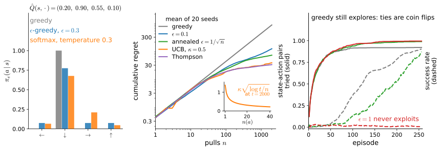

# Temporal Differences, Q-Learning and Exploration
:label:`sec_qlearning`

:numref:`sec_valueiter` planned with the full model and :numref:`sec_imitation` copied an expert; this section has neither. The agent can only act, observe, and improve, and the whole algorithm falls out of one substitution: replace the expectation over next states, the term of the Bellman backup that needs the kernel $P$, by the single next state the environment just produced. The backup becomes a one-line update driven by one number, the temporal-difference error; running it while acting is Q-learning :cite:`Watkins.1989,Watkins.Dayan.1992`. The substitution costs us twice. In estimation, squared errors against sampled targets grow a variance term, and we must be precise about what actually converges. In data, samples exist only where the agent goes, so how much wandering is enough becomes a subject of its own, with its own minimal model, the bandit, and its own currency, regret.

```{.python .input #qlearning-temporal-differences-q-learning-and-exploration}
%%tab pytorch
%matplotlib inline
from d2l import torch as d2l
import gymnasium as gym
import numpy as np
```

```{.python .input #qlearning-temporal-differences-q-learning-and-exploration}
%%tab jax
%matplotlib inline
from d2l import jax as d2l
import gymnasium as gym
import numpy as np
```

## The Sampled Backup

### From the operator to the update

Value iteration, written for the action-value function, sweeps

$$Q_{k+1}(s, a) = r(s, a) + \gamma \sum_{s' \in \mathcal{S}} P(s' \mid s, a) \max_{a' \in \mathcal{A}} Q_k (s', a'); \ \textrm{for all } s \in \mathcal{S} \textrm{ and } a \in \mathcal{A},$$

whose fixed point is $Q^*$; call the right-hand side $(TQ)(s, a)$, the optimality operator of :numref:`sec_valueiter` on action-value tables. We work with $Q$ rather than $V$ for the reason flagged there: extracting the optimal policy from $Q^*$ is an argmax over a table row, no model required. The kernel enters the sweep through one expectation, $E_{s' \sim P(\cdot \mid s, a)} [\max_{a'} Q_k(s', a')]$, and an expectation can be estimated from samples. That is the entire idea, and :numref:`fig_rl_backups` has already drawn it: Q-learning is panel (d), one sampled branch where the exact backup sums over all of them, the maximum at the next state kept.

Let the agent act with some data-collection policy $\pi_e(a \mid s)$, its *behavior policy*, and record $n$ trajectories of $T$ timesteps each, $\{ (s_t^i, a_t^i)_{t=0,\ldots,T-1}\}_{i=1,\ldots, n}$. Value iteration is really a set of constraints tying the action-values of all state-action pairs together; an approximate version enforces those constraints on the pairs the data contains:

$$\hat{Q} = \mathrm{argmin}_Q \underbrace{\frac{1}{nT} \sum_{i=1}^n \sum_{t=0}^{T-1} (Q(s_t^i, a_t^i) - r(s_t^i, a_t^i) - \gamma \max_{a'} Q(s_{t+1}^i, a'))^2}_{\stackrel{\textrm{def}}{=} \ell(Q)}.$$
:eqlabel:`q_learning_optimization_problem`

The term that required the kernel is gone. We have not cheated: as the agent uses the policy $\pi_e$ to take an action $a_t^i$ at state $s_t^i$, the next state $s_{t+1}^i$ is a sample drawn from the transition function. So the optimization objective also has access to the transition function, but implicitly in terms of the data collected by the agent. For every constraint to be represented, $\pi_e$ must keep visiting every state-action pair. Note that an optimal deterministic policy would *not* qualify: it never takes the actions it considers suboptimal, so $\ell(Q)$ would contain no term for those state-action pairs and their values would be left unconstrained. The third part of this section takes that requirement seriously.

Rather than solve the problem outright we make cheap incremental progress on its variables, the table entries. For each observed transition $(s, a, r, s')$, nudge the one entry it constrains toward the *bootstrapped target* $r + \gamma \max_{a'} Q(s', a')$, treating the target as a constant even though it contains $Q$:

$$Q(s, a) \leftarrow (1 - \alpha)\, Q(s, a) + \alpha \big( r + \gamma \max_{a'} Q(s', a') \big),$$
:eqlabel:`q_learning`

where $\alpha$ is the step size. Because the target itself depends on $Q$ and we deliberately hold it fixed, this is called a semi-gradient step: Q-Learning is not gradient descent on $\ell(Q)$ in the strict sense, but the update is simple, cheap, and works well in practice. Rearranged, the update is a correction proportional to a single scalar,

$$\delta = r + \gamma \max_{a'} Q(s', a') - Q(s, a), \qquad Q(s, a) \leftarrow Q(s, a) + \alpha\, \delta.$$
:eqlabel:`eq_td_error`

The scalar $\delta$ is the *temporal-difference error* :cite:`Sutton.1988`: what one step of reality reported (a reward plus the discounted best continuation) minus what the table claims. It is the most reused quantity in these two chapters, weighting the actor's updates in :numref:`sec_actorcritic` and driving the deep Q-network of :numref:`sec_dqn`.

There is exactly one alternative target, with a different estimand. *Monte Carlo* prediction waits for the episode to end and regresses $Q(s_t, a_t)$ toward the realized return: an unbiased estimate of $Q^{\pi_e}(s_t, a_t)$, the value of the behavior policy that produced the episode, not of $Q^*$, and each target folds in the noise of every step to come while nothing is learned mid-episode. *Temporal-difference* prediction bootstraps after one step: biased while the table is wrong, far lower variance, learning as it goes :cite:`Sutton.1988,Sutton.Barto.2018`. Q-learning is the TD member of the family, with a max in the target because it aims at $Q^*$ rather than at the behavior's value; :numref:`sec_actorcritic` turns the dial between the extremes, taking $n$ steps of reality before bootstrapping.

### What actually converges

It is tempting to justify the update by the objective: if $\pi_e$ visited every state-action pair and collected infinite data, would minimizing $\ell(Q)$ pin down the same solution as value iteration? Yes *provided the transitions are deterministic*; in general, no, and the reason deserves one display. As the data grows, $\ell(Q)$ converges to its population version, and conditioning on $(s, a)$ splits each squared term into a squared mean plus a variance:

$$L(Q) = E_{(s, a) \sim \mu} \Big[ \big( Q(s, a) - (TQ)(s, a) \big)^2 \Big] + \gamma^2\, E_{(s, a) \sim \mu} \Big[ \mathrm{Var}_{s' \sim P(\cdot \mid s, a)} \big( \max_{a'} Q(s', a') \big) \Big],$$
:eqlabel:`eq_double_sampling`

where $\mu$ is the visitation distribution of $\pi_e$. The first term is the squared Bellman residual, and $Q^*$ zeroes it. But $Q^*$ is generically not a stationary point of the second: the minimizer of $L$ can profit by shrinking the successor values toward one another, trading Bellman residual for variance, so $\mathrm{argmin}_Q L \neq Q^*$ whenever transitions are stochastic; exercise 4 builds a three-state counterexample, full coverage and infinite data included. The defect is the *double-sampling problem*: one sampled successor per visit cannot tell the noise of the ice from the error of the table, and an unbiased estimate of the Bellman residual alone would need two independent successors from the same $(s, a)$, which a physical environment does not offer. Only under deterministic transitions does the variance term vanish identically and the claim hold.

So the objective motivated the update, but the update is what deserves the trust, and the semi-gradient disclaimer above is where correctness actually hangs. Average :eqref:`eq_td_error` over the next state: $E_{s'}[\delta \mid s, a] = (TQ)(s, a) - Q(s, a)$, zero exactly when $Q = TQ$, whose unique solution is $Q^*$ by the contraction of :numref:`sec_valueiter`. Q-learning is not gradient descent on anything; it is *stochastic approximation* of the fixed-point iteration we already trust, moving the table on average the way value iteration would, and under the step-size conditions below, with every pair visited indefinitely, it converges to $Q^*$ with probability one :cite:`Watkins.Dayan.1992,Jaakkola.Jordan.Singh.1994`. The variance that poisons the argmin only slows the path; it does not move the destination. The visitation condition, though, is a condition on the behavior, not a gift of the algorithm: an $\epsilon$ floor delivers it only where the induced chain keeps returning; a pair sitting behind states the behavior stops reaching is simply never constrained, and the experiments below therefore check coverage rather than assume it.

### Step sizes and Robbins-Monro

How fast may $\alpha$ shrink? Stochastic approximation gives the classical answer :cite:`Robbins.Monro.1951`, two conditions on the steps used at an entry: $\sum_k \alpha_k = \infty$, enough total motion to reach the target from any start, and $\sum_k \alpha_k^2 < \infty$, finite total noise energy. A constant step fails the second, and on ice the failure is visible: the bootstrapped target is random, so the table never settles, hovering in a noise ball around $Q^*$ whose radius grows with $\alpha$. On a *deterministic* environment the target is not noisy at all: each visited entry moves by the damped noiseless backup $Q(s, a) \leftarrow (1 - \alpha)\, Q(s, a) + \alpha\, (TQ)(s, a)$. One scoping note is owed here. Applied to *all* entries at once, this map is a damped Bellman sweep contracting with modulus $(1 - \alpha) + \alpha \gamma < 1$; the algorithm updates one sampled entry at a time, and a single asynchronous update is not a sup-norm contraction of the whole table, so the argument covers the sampled algorithm only when the behavior keeps visiting every pair, sweeping in expectation what the operator sweeps in one stroke. Panel (c) of :numref:`fig_rl_exploration` verifies that coverage for this deterministic setting rather than assuming it. Granted that coverage, a large constant step is exactly right; early editions of this section ran on the calm lake with $\alpha = 0.9$ and were done in 256 episodes, a run we preserve below as a labeled special case.

The conditions are necessary for the guarantee, not sufficient for a budget. The textbook sample-average rule $\alpha = 1/(1 + n(s, a))$, with $n(s, a)$ counting visits to the entry, passes Robbins-Monro yet weights the useless early targets (computed when the table was all zeros) as heavily as the informed late ones, and at a realistic budget it strands the estimate. Our default $\alpha = 1/(1 + 0.1\, n(s, a))$ also passes but stays ten times larger at the same visit count. We measure all three schedules below on the same seeds; the difference is not a constant factor but success against failure.

### Terminal masking

One term must be repaired before the update meets an episodic environment. When $s'$ is terminal, the goal or a hole, there is no continuation to bootstrap: the future is empty and worth exactly zero, so the target is the reward alone,

$$Q(s, a) \leftarrow Q(s, a) + \alpha \Big( r + \gamma\, \big(1 - \mathbf{1}(s' \textrm{ terminal})\big) \max_{a' \in \mathcal{A}} Q(s', a') - Q(s, a) \Big).$$

The flag that gates the mask is `terminated`, never `truncated`: :numref:`sec_mdp` drew the line between a state with no future and a recording that stopped, and this update is where confusing them corrupts values, teaching the table that standing on frozen ice at the time limit is worthless. In code the whole repair is one factor, `gamma * (1 - terminated) * Q[s_next].max()`.

## Q-Learning on the Lake

### The implementation

Back to the slippery lake of :numref:`sec_mdp`, same discount. We compute the exact solution one last time and lock it away: the learner touches the environment only through `reset` and `step`; `mdp`, `V_star` and `pi_star` exist so that, for once in reinforcement learning, the learned table can be graded against the truth.

```{.python .input #qlearning-the-implementation-1}
%%tab pytorch, jax
gamma, num_episodes = 0.95, 4000
env = gym.make('FrozenLake-v1', is_slippery=True)
mdp = d2l.TabularMDP.from_gym(env, gamma)
V_star = d2l.value_iteration(mdp, num_iters=1000)[-1]
pi_star = mdp.backup(V_star).argmax(axis=1)
```

Two helpers, both plain numpy and both saved: the deep Q-network of :numref:`sec_dqn` and the PPO of :numref:`sec_ppo` will call them unchanged. The first turns a start value, an end value and a horizon into a schedule:

```{.python .input #qlearning-the-implementation-2}
%%tab pytorch, jax
def linear_schedule(start, end, num_steps):  #@save
    """step -> value, interpolated from start to end, then held at end."""
    return lambda step: end + (start - end) * max(0.0, 1.0 - step / num_steps)
```

The second is the behavior policy. With probability $\epsilon$ it takes a uniformly random action; otherwise it exploits the current table:

$$\pi_e(a \mid s) = \begin{cases} 1 - \epsilon + \epsilon/|\mathcal{A}| & a = \mathrm{argmax}_{a'} \hat{Q}(s, a') \\ \epsilon/|\mathcal{A}| & \textrm{otherwise}, \end{cases}$$
:eqlabel:`epsilon_greedy`

the *$\epsilon$-greedy* policy, with ties in the argmax broken uniformly at random. The tie-breaking is not a nicety: a zero-initialized table makes *every* state a four-way tie, and `np.argmax` always returns the first index:

```{.python .input #qlearning-the-implementation-3}
%%tab pytorch, jax
def epsilon_greedy(q, epsilon, rng):  #@save
    """Explore with probability epsilon, else act greedily on the values q."""
    if rng.random() < epsilon:
        return int(rng.integers(len(q)))
    # Random tie-breaking is load-bearing: np.argmax would always return
    # action 0 on a zero-initialized table, and an agent that only ever
    # proposes *left* on this lake never finds the goal.
    return int(rng.choice(np.flatnonzero(q == q.max())))
```

The algorithm is now a dozen lines: act, observe one transition, correct one entry by $\alpha\, \delta$, and yield each episode's return, keeping all bookkeeping outside the loop. The caller passes in the two arrays the loop mutates, the table and the visit counts, and it wants both: the counter drives the step-size schedule and doubles as the experiment's ledger. The exploration rate anneals from $1$ to a floor of $0.05$ over the first half of the budget, leaving the second half mostly exploitation:

```{.python .input #qlearning-the-implementation-4}
%%tab pytorch, jax
def q_learning(seed, Q, visits, env, num_episodes,
               alpha=lambda n: 1 / (1 + 0.1 * n)):
    """Tabular Q-learning; updates Q in place, yields each episode's return."""
    rng = np.random.default_rng(seed)
    epsilon = linear_schedule(1.0, 0.05, num_episodes // 2)
    env.reset(seed=seed)
    for episode in range(num_episodes):
        s, done, ret = env.reset()[0], False, 0.0
        while not done:
            a = epsilon_greedy(Q[s], epsilon(episode), rng)
            s_next, r, terminated, truncated, _ = env.step(a)
            visits[s, a] += 1
            delta = r + gamma * (1 - terminated) * Q[s_next].max() - Q[s, a]
            Q[s, a] += alpha(visits[s, a]) * delta
            s, done, ret = s_next, terminated or truncated, ret + r
        yield ret
```

Every cell here is numpy and shared between the frameworks: tabular reinforcement learning is index arithmetic, and the frameworks enter when the table becomes a network in :numref:`sec_deeprl`. Five seeds, one plain loop:

```{.python .input #qlearning-the-implementation-5}
%%tab pytorch, jax
Q = np.zeros((5, mdp.num_states, mdp.num_actions))
visits = np.zeros_like(Q)
returns = np.array([list(q_learning(k, Q[k], visits[k], env, num_episodes))
                    for k in range(5)])
d2l.plot_curves({'Q-learning': returns}, xlabel='episode',
                ylabel='return per episode', smooth=200)
```

The curve is a trailing 200-episode average with the band spanning the seeds. It sits at zero while success is a rare accident, climbs as the first successes propagate value backward through the table, and flattens once the schedule reaches its floor.

### Reading the curve against the truth

Taken at face value the curve disappoints: it plateaus near $0.55$, while :numref:`sec_valueiter` measured the optimal policy at $73.6$ percent. But the curve mixes the quality of the learned table with the tax of the exploration still running. Separate them, starting with the table, graded against the locked-away truth; this is the check :numref:`sec_valueiter` makes possible and no agent in the wild could run, because no one hands out $V^*$:

```{.python .input #qlearning-reading-the-curve-honestly-1}
%%tab pytorch, jax
print(f'max_s |V_Qhat(s) - V*(s)| per seed: '
      f'{np.round(np.abs(Q.max(axis=-1) - V_star).max(axis=-1), 3)}')
env.reset(seed=0)
opt = d2l.evaluate(env, lambda s, rng: int(pi_star[s]), num_episodes=2000)
rates = np.array([d2l.evaluate(env, lambda s, rng: int(Q[k, s].argmax()),
                               num_episodes=2000) for k in range(5)])
taxed = d2l.evaluate(env, lambda s, rng: int(pi_star[s])
                     if rng.random() > 0.05 else int(rng.integers(4)),
                     num_episodes=2000, rng=np.random.default_rng(1))
print(f'success rate: learned greedy {rates.min():.1%} to {rates.max():.1%} '
      f'over 5 seeds; pi* {opt:.1%}')
print(f'pi* forced to explore at epsilon = 0.05: {taxed:.1%}')
print(f'median environment steps: {int(np.median(visits.sum(axis=(1, 2))))}')
```

Three readings. The learned value function is within $0.006$ to $0.021$ of $V^*$ in the sup norm, on a value scale running from $0.18$ to $0.72$, the residual concentrated at states the greedy path rarely uses. The greedy policies read off the five tables succeed $71$ to $74$ percent of the time against the optimum's $73.6$; one seed lands above it, which is measurement noise, not a better-than-optimal policy. And the plateau is the third line's doing: the *optimal* policy, forced to take a random action five percent of the time, succeeds only $54$ percent of the time here, because on ice beside a hole one random step can be fatal. The training curve's ceiling is the behavior's ceiling, not the policy's; separating the two measurements is what `d2l.evaluate` is for, and the gap between them is the first sighting of a quantity this section will shortly name regret.

The cost deserves the same separation. The median run consumed $95{,}569$ environment steps; :numref:`sec_valueiter` certified $V^*$ after $164$ sweeps of $64$ backups each, about ten and a half thousand. But the units are different goods: a Bellman backup consumes the kernel, read out of `env.unwrapped.P` and averaged exactly, while an environment step consumes one interaction with a world that merely has to exist. The accurate statement is not "value iteration needs fewer iterations" but: ten thousand model backups were exchanged for a hundred thousand samples, and the exchange rate is the price of not knowing the physics. Exercise 5 charges each algorithm in its own currency.

What did the agent actually learn? Place the two solutions side by side:

```{.python .input #qlearning-reading-the-curve-honestly-2}
%%tab pytorch, jax
d2l.show_grid(env.unwrapped.desc, np.stack([Q[0].max(-1), V_star]),
              np.stack([Q[0].argmax(-1), pi_star]),
              titles=['Q-learning, seed 0', 'value iteration'])
```

The learned arrows reproduce the slip-aware strategy of :numref:`sec_valueiter`, wall tricks included, with a single disagreement on the frozen cells: at state $6$ the learned policy commands *right* where $\pi^*$ commands *left*. It costs nothing: state $6$ sits between the holes at $5$ and $7$, the two commands risk the two holes symmetrically, and their values under $Q^*$ are exactly equal; the agent broke an exact tie the other way. The value shading tells the coverage story: accurate where visits were plentiful, coarse in the rarely visited top-right corner.

Now the labeled special case. Switch the slip off and the problem collapses to what early editions of this book ran: deterministic transitions, noiseless targets, and the constant $\alpha = 0.9$ that the damped-contraction argument licenses. A sixteenth of the budget suffices:

```{.python .input #qlearning-reading-the-curve-honestly-3}
%%tab pytorch, jax
calm = gym.make('FrozenLake-v1', is_slippery=False)
table = np.zeros((mdp.num_states, mdp.num_actions))
for _ in q_learning(0, table, np.zeros_like(table), calm, 256,
                    alpha=lambda n: 0.9):
    pass
print(f'calm ice, 256 episodes, alpha = 0.9: greedy policy succeeds '
      f'{d2l.evaluate(calm, lambda s, rng: int(table[s].argmax()), 100):.0%}')
```

Determinism buys a perfect policy from a sixteenth of the episodes at a step size that would be reckless on ice. Keep the cell as a unit of account: when a reinforcement learning result looks cheap, ask how much of the price the environment quietly waived. Finally, the step-size claims, measured. Under all three schedules, on the same five seeds, we track the estimate of one load-bearing entry, $Q(s_0, \textrm{left})$, whose truth we can print (the optimal first command is *left*, into the wall: the slip logic of :numref:`sec_valueiter`):

```{.python .input #qlearning-reading-the-curve-honestly-4}
%%tab pytorch, jax
Q_star = mdp.backup(V_star)
a0 = int(pi_star[0])
print(f'Q*(s0, {"<v>^"[a0]}) = {Q_star[0, a0]:.3f}')
trace = {}
for name, alpha in [('0.9 (constant)', lambda n: 0.9),
                    ('1/(1 + 0.1 n)', lambda n: 1 / (1 + 0.1 * n)),
                    ('1/(1 + n)', lambda n: 1 / (1 + n))]:
    runs = []
    for seed in range(5):
        Qa = np.zeros_like(Q[0])
        runs.append([Qa[0, a0] for _ in q_learning(
            seed, Qa, np.zeros_like(Qa), env, num_episodes, alpha)])
    trace[f'alpha = {name}'] = np.array(runs)
    print(f'alpha = {name:>14}: final estimates {np.round(runs, 3)[:, -1]}')
d2l.plot_curves(trace, xlabel='episode', ylabel='estimate of Q(s0, left)',
                reference=Q_star[0, a0])
```

Each claim gets its picture. The constant step never settles: after four thousand episodes its five estimates of a value whose truth is $0.180$ range from $0.06$ to $0.27$, a noise ball no further data will shrink. The default schedule lands all five seeds between $0.180$ and $0.195$: converged, leaning slightly high, a detail the last part of this section returns to. And the sample-average rule $1/(1 + n)$ strands all five seeds below $0.025$, under a seventh of the truth, still averaging in the worthless targets of its first hundred episodes; it is the only schedule of the three a textbook would print beside the convergence theorem. Robbins-Monro is the entry ticket, not the race: the schedule that violates no theorem is the one that failed.

### The self-correcting property

Why does bootstrapping from a wrong table not entrench the wrongness? Because the behavior is coupled to the table, errors trigger their own correction. Suppose $\hat{Q}(s, a)$ is too optimistic: $\epsilon$-greedy then picks $a$ at $s$ more often, generating precisely the transitions whose TD errors are negative on average, and the estimate is driven back down. An overvalued action summons the data that convicts it; an *undervalued* action is corrected only at the slow drumbeat of the $\epsilon$ floor, an asymmetry between the error directions to hold on to. Stated as a property of the fixed point: the only tables that survive their own data collection are those whose expected correction vanishes at every pair the behavior keeps visiting, and by :eqref:`eq_td_error` those are exactly the tables satisfying Bellman optimality on the visited set. This ability to not only collect new data but also collect the right kind of data is the central feature of reinforcement learning algorithms, and this is what distinguishes them from supervised learning. The converse defines a problem class: with a fixed logged dataset and no acting, optimism is never audited and the safe direction of error flips; that severed loop is offline reinforcement learning, :numref:`sec_offline`.

The argument leaned twice on the $\epsilon$ floor. How much exploration is enough, and what does it cost? The question deserves the cleanest environment that can ask it.

## How Much Exploration Is Enough

### A bandit is an MDP with one state

:numref:`sec_mdp` promised that when exploration needed isolating, the instrument would be the one-state MDP. Delete the states, the kernel and the discount; what remains is the *multi-armed bandit*: pull one of the arms, observe a reward, and earn as much as possible while still learning which arm is best. No planning, no credit assignment, no generalization; nothing but the tension between estimating values and earning with them. Ten Bernoulli arms, one clearly best:

```{.python .input #qlearning-a-bandit-is-an-mdp-with-one-state}
%%tab pytorch, jax
arms = np.array([0.50, 0.42, 0.90, 0.25, 0.55, 0.38, 0.60, 0.32, 0.50, 0.45])

def bandit_run(rule, num_pulls, seed):
    """One state, one step: pull an arm, log the shortfall, update tallies."""
    rng = np.random.default_rng(seed)
    wins, count = np.zeros(len(arms)), np.zeros(len(arms))
    gap = np.empty(num_pulls)
    for t in range(num_pulls):
        a = rule(wins, count, t, rng)
        count[a] += 1
        wins[a] += float(rng.random() < arms[a])
        gap[t] = arms.max() - arms[a]
    return np.cumsum(gap)
```

A bandit policy is any rule from the running tallies to an arm, so `epsilon_greedy` applies unchanged, acting on the empirical means. One rung up sits the *contextual bandit*: a fresh state arrives each round, independent of anything the agent did, one action is scored, and the episode ends; generalization across states, still no dynamics. Remember the name: recommendation systems largely live there, and :numref:`sec_rl_sequences` will need the distinction when asking whether tuning a language model on single-turn preferences is reinforcement learning or a contextual bandit wearing its clothes.

### Regret, and the linear tax

The bandit also fixes the right score. Success rate flattered our training curve; regret charges each pull the gap between the best arm's mean $\mu^* = \max_a \mu_a$ and the pulled arm's,

$$\textrm{regret after } t \textrm{ pulls} = \sum_{u=1}^{t} \big( \mu^* - \mu_{a_u} \big),$$

which is what `bandit_run` accumulates; its expectation is $\sum_a (\mu^* - \mu_a)\, E[n(a)]$, gap times pull count. *Sublinear* regret means the strategy eventually stops paying for information it already has. Three members of the $\epsilon$-greedy family, twenty independent runs each:

```{.python .input #qlearning-regret-and-the-linear-tax}
%%tab pytorch, jax
def eps_rule(schedule):
    """Epsilon-greedy on the empirical means, with epsilon = schedule(t)."""
    return lambda wins, count, t, rng: epsilon_greedy(
        wins / np.maximum(count, 1), schedule(t), rng)

rules = {'greedy': eps_rule(lambda t: 0.0),
         'epsilon = 0.1': eps_rule(lambda t: 0.1),
         'annealed': eps_rule(lambda t: max(0.02, 1 / np.sqrt(t + 1)))}
regret = {name: np.array([bandit_run(rule, 2000, [2026, i, s])
                          for s in range(20)])
          for i, (name, rule) in enumerate(rules.items())}
for name, r in regret.items():
    print(f'{name:>13}: mean regret after 2000 pulls {r[:, -1].mean():6.1f}')
```

Greedy is a lottery with a terrible mean: a run that happens to see the best arm pay early locks onto it and pays nothing ever after, and a run that does not locks onto a mediocre arm with the same permanence; its $824$ is nearly half of what the best arm would have paid. A fixed $\epsilon = 0.1$ learns the best arm quickly, then keeps paying for the lesson: every tenth pull is uniform regardless of what is known, a *linear tax* of about $0.04$ per pull with these arms, the bulk of its $117$. Annealing $\epsilon$ shrinks the tax as knowledge accumulates and roughly halves the bill. The pattern: an exploration rule that ignores what it has learned pays rent on the full action set forever.

![Exploration, measured three ways. (a) One row of action values, $\hat Q(s, \cdot) = (0.20, 0.90, 0.55, 0.10)$, turned into three behavior policies: greedy, $\epsilon$-greedy at $\epsilon = 0.3$, and a softmax at temperature $0.3$. (b) Cumulative regret on this section's ten-armed Bernoulli bandit, mean of 20 runs, on logarithmic axes, a finite-budget illustration rather than a measurement of any asymptotic rate: after $2000$ pulls greedy pays $824$, fixed $\epsilon = 0.1$ pays $117$, annealed $69$, UCB at the tuned $\kappa = 0.5$ pays $37$, and Thompson sampling $32$; the inset is the UCB confidence radius $\kappa \sqrt{\log t / n}$ at the run's horizon $t = 2000$, shrinking in the count $n$ and, through the $\log t$, creeping up while an arm idles, the count-shrinking shape :numref:`sec_offline` will subtract instead of add. (c) Coverage of the 44 live state-action pairs (solid) and success rate (dashed) under three schedules, tabular Q-learning on the deterministic lake at the settings of this section's deterministic-contrast cell, $\alpha = 0.9$ over 256 episodes: pure greedy still covers 92 percent of the pairs because ties are broken uniformly at random, while $\epsilon = 1$ covers everything and earns nothing.](../img/mdl-rl-exploration.svg)
:label:`fig_rl_exploration`

### Optimism: UCB and Thompson sampling

Panel (a) of :numref:`fig_rl_exploration` shows the choices so far as distributions over one row of action values, alongside a third the reader will meet properly in :numref:`sec_policygradient`, a softmax over the same values whose temperature plays the role the exploration rate plays here. The two remaining rules in :numref:`fig_rl_exploration` share one principle: *when unsure, err on the side of optimism*, because acting on optimism generates exactly the data that tests it. The crudest version is optimistic initialization, every estimate started above any reward the world can pay and disappointment left to run the tour :cite:`Sutton.Barto.2018`. The *upper confidence bound* (UCB) rule prices the optimism by the uncertainty instead, pulling the arm whose plausibly-best value is highest:

$$a_t = \underset{a}{\mathrm{argmax}} \Big[ \hat{\mu}(a) + \kappa \sqrt{\log t \,/\, n(a)} \Big],$$
:eqlabel:`eq_ucb`

an empirical mean plus a bonus that shrinks as the arm's count $n(a)$ grows and, through the $\log t$ in the numerator, creeps back up while an arm sits idle, so that no arm is ever written off for good :cite:`Auer.CesaBianchi.Fischer.2002`. Here is what UCB tunes that $\epsilon$-greedy structurally cannot: its exploration is *per arm* and *self-extinguishing*, an arm retiring when its own uncertainty no longer justifies it rather than when a global schedule says so, and the theory rewards this with regret logarithmic in $t$ where any fixed $\epsilon$ is linear, a guarantee proved at $\kappa = \sqrt{2}$; smaller $\kappa$ often pays less regret in practice, and forfeits the theorem. Two conventions make :eqref:`eq_ucb` runnable. An unpulled arm has an undefined index, so each arm is played once before the rule takes over; and from then on the rule is deterministic, an index argmaxed with no coin flipped, which separates it in kind from $\epsilon$-greedy and the softmax of panel (a), genuine behavior *distributions*. Thompson sampling :cite:`Thompson.1933` is the oldest algorithm in this book. It replaces the bonus with a posterior: a Beta distribution per arm, updated by wins and losses, one plausible mean drawn for each arm, play the argmax of the draws. An arm is chosen exactly as often as the posterior believes it is best, and the sharpening belief extinguishes exploration the same way:

```{.python .input #qlearning-optimism-ucb-and-thompson-sampling}
%%tab pytorch, jax
kappa = 0.5

def ucb(wins, count, t, rng):
    if (count == 0).any():          # play each arm once before pricing any
        return int(np.argmax(count == 0))
    return int(np.argmax(wins / count + kappa * np.sqrt(np.log(t) / count)))

def thompson(wins, count, t, rng):
    return int(rng.beta(1 + wins, 1 + count - wins).argmax())

for i, (name, rule) in enumerate([('UCB', ucb), ('Thompson', thompson)], 3):
    regret[name] = np.array([bandit_run(rule, 2000, [2026, i, s])
                             for s in range(20)])
    print(f'{name:>13}: mean regret after 2000 pulls '
          f'{regret[name][:, -1].mean():6.1f}')
d2l.plot_curves(regret, xlabel='pulls', ylabel='cumulative regret')
```

Both land far below the $\epsilon$ family, and on the logarithmic axes of :numref:`fig_rl_exploration` their curves bend away from the fixed-$\epsilon$ line's steady slope. Read the bend as an illustration, not a verification: two thousand pulls cannot exhibit an asymptotic rate, and what the plot shows is the finite-budget behavior that the logarithmic-regret theorem :cite:`Auer.CesaBianchi.Fischer.2002` predicts. Two caveats. The bonus scale is a real knob: $\kappa = 0.5$ is tuned for these arms, and moving it either way costs, in opposite currencies. Upward lies over-exploration, the theorem's own $\sqrt{2}$ paying about $200$ here, worse than fixed $\epsilon$; downward lies greed, where the heavy tail returns, at $\kappa = 0.15$ one run in twenty paying over $900$ for locking onto a middling arm (exercise 6 maps this out). And a mean over twenty runs still hides spread: the per-seed totals at $\kappa = 0.5$ span $21$ to $53$. The UCB-Thompson ordering here is a fact about these arms, seeds and tunings, not a theorem.

**Remember the sign.** The confidence radius this subsection *adds* and the pessimism penalty :numref:`sec_offline` *subtracts* are the same idea with two signs: a count-shrinking measure of uncertainty, priced into the values. The sign is set by whether the loop is open: online, an optimistic error gets acted on, tested, and corrected by the data it provokes; offline, it is never tested, so the only safe direction to be wrong is down. The two radii are cousins, not one statistical quantity: ours carries the bandit's $\log t$ and a scale tuned online; the offline penalty is calibrated against a fixed dataset.

### Why an MDP is harder: you have to commit

A fence around what the bandit just taught. In a bandit every action is one pull away, so uncertainty can be visited the moment it is priced. In an MDP the uncertain pair may sit behind a corridor of individually unpromising actions, and per-step dithering explores like a random walk: the probability of stringing together the $k$ specific moves a detour needs shrinks geometrically in $k$. No schedule fixes this: exploration in an MDP requires *committing* to sequences of actions that look bad individually, which is why $\epsilon$-greedy on hard-exploration tasks is not merely slower but qualitatively wrong. What carries over is optimism propagated by the values: award unvisited pairs a bonus, let the backup :eqref:`eq_td_error` flow it backward, and the greedy policy will commit to multi-step detours toward uncertainty on its own. In deep reinforcement learning the counts $n(s, a)$ have no table to live in, and their stand-ins form a small industry: pseudo-counts from density models, curiosity as the prediction error of a learned dynamics model, prediction error against a frozen random network (random network distillation), Go-Explore's archive of states to return to, and posterior sampling by an ensemble of value functions (bootstrapped DQN) :cite:`Burda.Edwards.Storkey.ea.2019`. Our lake needed none of this: with four actions from each of eleven frozen cells, the $\epsilon$ floor covered all 44 live pairs within budget, which made it a fair first laboratory and would make it a misleading last one.

## Which Policy Is Being Learned

### Off-policy, at its mechanism

One property of the update has been hiding in plain sight, inside the $\max_{a'}$ of :eqref:`eq_td_error`: whatever action the behavior policy actually took next at $s'$, the target ignores it and evaluates the greedy continuation instead. The policy being learned about is the greedy policy with respect to $\hat{Q}$, not the policy generating the data, $\pi_e$; algorithms with this split are called *off-policy*. One symbol away sits the on-policy sibling: bootstrap on the action the behavior actually took at $s'$ and the algorithm, called SARSA, learns the value of the behavior itself, $\epsilon$ floor and all :cite:`Sutton.Barto.2018`. Off-policyness is why our agent behaved with a permanent exploration floor yet printed a table whose greedy policy matched $\pi^*$: the tax was paid by the behavior, and the $\max$ kept it out of the targets. The same license cuts the other way. Because the target never asks where the data came from, the data can come from anywhere: old experience, another agent, a fixed log. How far that freedom stretches before it breaks is the organizing question of the next chapter: one leg of the instability triad of :numref:`sec_dqn` and, at the limit of a fixed log, the defining constraint of :numref:`sec_offline`.

### A first sight of maximization bias

The $\max$ has a second, quieter consequence: the maximum of noisy estimates overestimates the maximum of their means, since whichever entry the noise happens to inflate is the one selected, so bootstrapped targets lean optimistic wherever estimates are uncertain. The fingerprint is already in this section's numbers: four of the five converged estimates of $Q(s_0, \textrm{left})$ finished above the true $0.180$, the fifth on it to the printed precision, none below. At tabular scale the lean fades with the noise; with function approximation it feeds back through the targets and becomes a first-order design problem, which :numref:`sec_dqn` measures and repairs with a second estimator that decouples selecting an action from evaluating it, a repair that removes the upward selection bias on average but can undershoot, not an unbiased oracle :cite:`vanHasselt.2010`. For now, one clause: when a $\max$ sits inside your target, expect your values to lean high.

## Summary

Q-learning replaces the expectation in the Bellman backup with the one transition the environment produced; the residual is the temporal-difference error :eqref:`eq_td_error`, and the algorithm is $Q \leftarrow Q + \alpha \delta$ under $\epsilon$-greedy behavior with random tie-breaking. Its correctness hangs on the fixed point of the update, not on the sampled objective that motivates it: with stochastic transitions the population objective carries a variance term (double sampling, :eqref:`eq_double_sampling`) whose minimizer is not $Q^*$, while the semi-gradient update converges to $Q^*$ under Robbins-Monro step sizes with sustained visitation, and schedules remain a budget decision besides. Exploration is a subject, not a knob: on the one-state MDP, regret separates greedy (a lottery), fixed $\epsilon$ (a linear tax) and annealed $\epsilon$ (a shrinking one) from the self-extinguishing optimism of UCB's confidence radius $\kappa \sqrt{\log t / n}$ and Thompson's posterior draws, and a count-shrinking penalty of the same shape returns with its sign flipped when the data goes offline. The $\max$ in the target makes the algorithm off-policy and plants a persistent upward lean, the maximization bias. Q-learning with the table replaced by a deep network is the algorithm whose Atari results re-ignited the field :cite:`mnih2013playing`; :numref:`sec_dqn` rebuilds it around the failure modes exhibited here in miniature.

**What the experiments show, and what they do not.** Every run is seeded, so reruns reproduce the printed digits exactly, and the shared cells print identically in both frameworks. The lake results are five seeds of one schedule on one small map: they show tabular Q-learning recovering $V^*$ to a few hundredths and the optimal success rate to within a couple of points, at roughly ten times the environment steps that value iteration's certificate charged in model backups, and they show one blameless-looking schedule failing at this budget; they do not show that these schedules are optimal, nor how the picture scales with the state space (exercise 7 probes that). The bandit numbers are means over twenty runs, greedy's with a visibly heavy tail, and UCB's $\kappa$ was tuned for these arms rather than set to the theorem's $\sqrt{2}$: read the ordering as "both optimism rules far below the $\epsilon$ family, consistent with their sublinear guarantees" and nothing finer, since a 2000-pull run exhibits no asymptotic rate. The exploration-tax measurement ($54$ percent for the taxed optimum) is specific to this map's geometry of holes. Single runs per configuration throughout: the compute belongs to readers.

## Exercises

1. [conceptual] *Why greedy from the start cannot work.* On a zero table
   every state is a four-way tie. Suppose `epsilon_greedy` always returned
   action $0$ (*left*) instead of breaking ties at random: describe the
   resulting trajectory and what the algorithm would report after any number
   of episodes. With random tie-breaking but $\epsilon = 0$ throughout, what
   does panel (c) of :numref:`fig_rl_exploration` show about coverage, and
   why does coverage alone not guarantee a good table?
1. [short-code] *The exploration schedule.* Predict, then measure. Modify
   `q_learning` to accept the $\epsilon$ schedule as an argument, and run
   with $\epsilon$ held at $0$, $0.1$, $0.5$ and $1$, and with the annealed
   schedule. For each, report the episode of the first success and
   `d2l.evaluate` of the final greedy policy over $1000$ episodes. Which
   setting wins on each number, and why is the training return alone a
   misleading basis for choosing?
1. [conceptual] *Step sizes, charged at a finite budget.* Which of the three
   schedules of the section's step-size cell satisfy the Robbins-Monro
   conditions $\sum_k \alpha_k = \infty$ and $\sum_k \alpha_k^2 < \infty$?
   Explain why the constant step is nevertheless sound on the calm map
   (write the noiseless update as $Q \leftarrow (1 - \alpha) Q + \alpha\, TQ$
   and compute its contraction modulus) and why it cannot settle on ice.
   Explain the stranding of $1/(1 + n)$ in one sentence about how a sample
   average weights early targets, then find by experiment a $c$ for which
   $\alpha = 1/(1 + c\, n)$ beats both decaying schedules at the same budget.
1. [short-code] *The double-sampling counterexample.* Build the three-state
   MDP: from state $s$ a single action pays $0$ and moves to $u_1$ or $u_2$
   with probability $1/2$ each; from $u_1$ a single action pays $1$ and
   terminates; from $u_2$, $0$ and terminates. (i) Write down $Q^*$ for all
   three pairs. (ii) With $\mu$ uniform over the pairs, write the population
   objective :eqref:`eq_double_sampling` explicitly and minimize it, in
   closed form or over a grid: at $\gamma = 0.95$ the minimizer assigns
   roughly $0.845$ and $0.155$ to the two successor pairs whose true values
   are $1$ and $0$. (iii) Verify that the semi-gradient update
   :eqref:`eq_td_error`, with each pair visited equally often and a decaying
   step, converges to $Q^*$ instead. What extra data access would make the
   argmin of :eqref:`q_learning_optimization_problem` unbiased, and why does
   the name *double sampling* fit?
1. [short-code] *A like-for-like comparison with value iteration.* Take $Q^*$ as
   ground truth. Plot $\|\hat{Q} - Q^*\|_\infty$ for Q-learning against
   environment steps (the `visits` ledger counts them), and for value
   iteration, $Q_k = $ `mdp.backup` of $V_k$, against Bellman backups at
   $64$ per sweep. Which comparison is fair under which assumption, and what
   does each algorithm buy with the resource it spends?
1. [short-code] *Regret, measured properly.* Means over $20$ runs can hide
   tails: re-plot the five rules' cumulative regret on doubly logarithmic
   axes, per seed rather than averaged. Which rules are sublinear, and which
   show heavy tails? Then rerun UCB at
   $\kappa \in \{0.15, 0.3, 0.5, 1.2, 2.4\}$ and at the theorem's $\sqrt{2}$:
   how sensitive is the mean regret, which failure lives at each end (too
   small turns the rule greedy and revives the heavy tail; too large pays
   $\epsilon$-like rent), and where does UCB fall behind the annealed
   schedule? Summarize in one sentence what UCB tunes that $\epsilon$-greedy
   does not.
1. [extended] *A harder map.* Move to the $8 \times 8$ map,
   `gym.make('FrozenLake-v1', map_name='8x8', is_slippery=True)`, with the
   section's code unchanged. With the section's budget the agent may never
   see the goal at all: report, over ten seeds, how many episodes of uniform
   random behavior pass before the first success, and reconcile the number
   with a random-walk hitting-time estimate. Then find a schedule and budget
   that reliably solve the map, and report the cost in environment steps
   next to the section's $4 \times 4$ figure. (Budget about five minutes.)

[Discussions](https://d2l.discourse.group/)

<!-- slides -->

::: {.slide}
::: {.cover}
[Dive into Deep Learning · §14.4]{.kicker}

Temporal differences, Q-learning and exploration<br>
**one sampled branch instead of the sum · the TD error · what actually converges · the price of exploration**
:::
:::

::: {.slide title="The Sampled Backup"}
Value iteration needs $P$ inside one expectation. Replace it with the
transition you just observed:

$$\delta = r + \gamma \max_{a'} Q(s', a') - Q(s, a), \qquad
Q(s, a) \leftarrow Q(s, a) + \alpha\, \delta$$

- $\delta$ is the **temporal-difference error**: reality's one-step report
  minus the table's claim.
- Bootstrap masked by `terminated`, never `truncated`.

. . .

:numref:`fig_rl_backups`, panel (d): one blue branch instead of the sum,
the max at the next state kept.
:::

::: {.slide title="What Actually Converges"}
The sampled least-squares objective is *not* the right justification:

$$L(Q) = E_\mu \big[ (Q - TQ)^2 \big] + \gamma^2\, E_\mu \big[ \mathrm{Var}_{s'} ( \max_{a'} Q(s', a') ) \big]$$

$Q^*$ zeroes the first term; the variance term moves the argmin
(**double sampling**). Deterministic transitions kill it; ice does not.

. . .

The update is what deserves trust: $E[\delta \mid s, a] = (TQ)(s, a) - Q(s, a)$,
zero exactly at $Q^*$. A stochastic approximation of value iteration,
convergent under Robbins-Monro steps.
:::

::: {.slide title="The Update in Code"}
@qlearning-the-implementation-3

. . .

@qlearning-the-implementation-4
:::

::: {.slide title="Graded Against Dynamic Programming"}
The check no agent in the wild can run: we kept the solved MDP.

@!qlearning-reading-the-curve-honestly-1

. . .

The table is within hundredths of $V^*$; the greedy policy within noise
of $\pi^*$. The training curve plateaus at the **behavior's** ceiling:
$\pi^*$ itself, taxed at $\epsilon = 0.05$, scores $54\%$.
:::

::: {.slide title="Step Sizes: the Ticket Is Not the Race"}
@!qlearning-reading-the-curve-honestly-4

. . .

- constant $0.9$: a noise ball that never shrinks ($0.06$ to $0.27$)
- $1/(1 + 0.1 n)$: converged, leaning slightly high
- $1/(1 + n)$: passes Robbins-Monro, strands **all five seeds** below $0.025$
:::

::: {.slide title="Exploration, Priced: Regret"}
A bandit is an MDP with one state. Regret charges each pull the gap to the
best arm.

{width=98%}

. . .

Greedy $824$ · fixed $\epsilon$ $117$ (a linear tax) · annealed $69$ ·
UCB $37$ · Thompson $32$.
:::

::: {.slide title="Optimism Pays, and Remember the Sign"}
$$a_t = \mathrm{argmax}_a \big[ \hat{\mu}(a) + \kappa \sqrt{\log t / n(a)} \big]$$

Per-arm, self-extinguishing exploration: logarithmic regret where any fixed
$\epsilon$ is linear (proved at $\kappa = \sqrt 2$; play each arm once
first). Thompson: sample a Beta posterior, play the argmax.

. . .

**The sign.** Online exploration *adds* a count-shrinking confidence
radius; offline pessimism (:numref:`sec_offline`) *subtracts* one. Optimism
is safe only where it gets tested.
:::

::: {.slide title="Which Policy Is Being Learned"}
- The $\max_{a'}$ ignores the action the behavior took: **off-policy**.
  Learn about the greedy policy from data collected by any policy.
- One symbol away: SARSA bootstraps on the action taken, learning the
  behavior's value, $\epsilon$ floor and all.
- The $\max$ also **leans high**: four of five final estimates sat above
  the true $0.180$, none below. Maximization bias, repaired in
  :numref:`sec_dqn`.
:::

::: {.slide title="Recap"}
- TD error :eqref:`eq_td_error`: the one-step residual; reused by every
  algorithm ahead.
- Correctness lives at the fixed point of the update, not the argmin of
  the sampled objective (double sampling).
- Robbins-Monro is necessary for the guarantee; budgets decide between
  schedules that both pass.
- Self-correction: overvalued actions summon the data that convicts them;
  severed offline.
- Regret: greedy is a lottery, fixed $\epsilon$ a linear tax, optimism
  self-extinguishing. The confidence radius flips sign in
  :numref:`sec_offline`.
- Off-policy by one $\max$; maximization bias by the same $\max$.
:::
