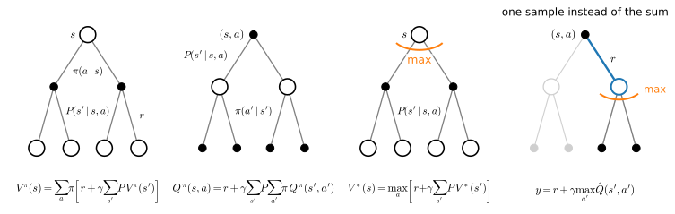
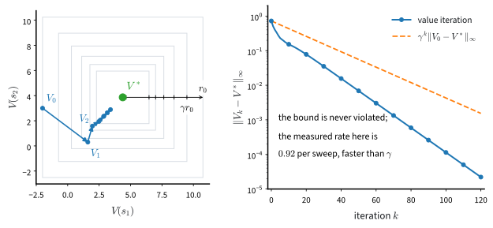
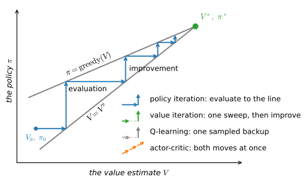

# Dynamic Programming
:label:`sec_valueiter`

Hand the agent the four objects $(\mathcal{S}, \mathcal{A}, P, r)$ and "act well" becomes a computation: the value of a state decomposes into now plus later, the decomposition ties all states into one system of equations, and the system is solved by iterating a map that *contracts*, shrinking its error geometrically at rate $\gamma$ from any starting guess. This is *dynamic programming* :cite:`BellmanDPBook`, the exact, model-based corner of reinforcement learning and the yardstick for every learning algorithm in these two chapters. On our slippery lake its answer earns the machinery: the optimal policy is not the shortest path, and we will measure what the difference is worth.

```{.python .input #value-iter-dynamic-programming}
%%tab pytorch
%matplotlib inline
from d2l import torch as d2l
import gymnasium as gym
import numpy as np
```

```{.python .input #value-iter-dynamic-programming}
%%tab jax
%matplotlib inline
from d2l import jax as d2l
import gymnasium as gym
import numpy as np
```

## Policies and Value Functions

### V and Q

A *stochastic policy* $\pi(a \mid s)$ (policy for short) is a conditional distribution over the actions $a \in \mathcal{A}$ given the state $s \in \mathcal{S}$: at some state of the lake the probabilities of *left*, *down*, *right*, *up* might be $(0.4, 0.2, 0.1, 0.3)$. A *deterministic* policy puts all its probability on a single action, which we then call $\pi(s)$; more generally we abbreviate the distribution $\pi(\cdot \mid s)$ as $\pi(s)$.

Fix a policy and release the agent: from $s_0$ it samples $a_t \sim \pi(s_t)$, moves to $s_{t+1} \sim P(\cdot \mid s_t, a_t)$, and traces out the trajectory $\tau$ of :numref:`sec_mdp`. Different runs give different trajectories, so the natural score is the average,

$$V^\pi(s_0) = E_{a_t \sim \pi(s_t),\ s_{t+1} \sim P(\cdot \mid s_t, a_t)} \Big[ \sum_{t=0}^\infty \gamma^t r(s_t, a_t) \Big],$$

the *value function* of $\pi$. The start state is arbitrary, so $V^\pi$ assigns a number to every state, and it is this whole table the algorithms below manipulate.

In implementations, it is often useful to maintain a quantity called the "action value" function which is a closely related quantity to the value function. This is defined to be the average *return* of a trajectory that begins at $s_0$ but when the action of the first stage is fixed to be $a_0$

$$Q^\pi(s_0, a_0) = r(s_0, a_0) + E_{a_t \sim \pi(s_t),\ s_{t+1} \sim P(\cdot \mid s_t, a_t)} \Big[ \sum_{t=1}^\infty \gamma^t r(s_t, a_t) \Big],$$

note that the summation inside the expectation is from $t=1,\ldots, \infty$ because the reward of the first stage is fixed in this case: act as you must for one step, then follow the policy forever.

### The identity that links them

The two functions are one step apart. Average the pinned first action of $Q^\pi$ under the policy and the pin disappears:

$$V^\pi(s) = \sum_{a \in \mathcal{A}} \pi(a \mid s)\, Q^\pi(s, a);\ \textrm{for all } s \in \mathcal{S}.$$

Conversely, the first stage of $Q^\pi$ is explicit: $Q^\pi(s, a) = r(s, a) + \gamma \sum_{s'} P(s' \mid s, a) V^\pi(s')$. The identity looks innocent and is not: it makes $V^\pi(s)$ a convex combination of the $Q^\pi(s, a)$, so $\max_a Q^\pi(s, a) \geq V^\pi(s)$, with a strict gap exactly when the policy wastes probability on worse actions. Every improvement step in these two chapters lives in that gap.

### The advantage

The gap deserves a name: the *advantage* of an action is its value in excess of the policy's own habit at that state,

$$
A^\pi(s, a) = Q^\pi(s, a) - V^\pi(s), \qquad E_{a \sim \pi(s)} \big[ A^\pi(s, a) \big] = 0,
$$
:eqlabel:`eq_advantage`

the zero mean being the averaging identity read backwards. The advantage is the currency of improvement: $A^\pi(s, a) > 0$ says "do $a$ more often", and a policy with no positive advantages has nothing left to fix. It is also what every policy-gradient estimator from :numref:`sec_policygradient` onward tries to approximate; we define it once, here, so later sections can use the symbol without ceremony.

## The Bellman Equations

The definitions above are infinite sums over trajectories; the Markov assumption collapses them into local equations.

### The expectation form

We next break down the trajectory into two stages (i) the first stage which corresponds to $s_0 \to s_1$ upon taking the action $a_0$, and (ii) a second stage which is the trajectory $\tau' = (s_1, a_1, r_1, \ldots)$ thereafter. The key idea behind all algorithms in reinforcement learning is that the value of state $s_0$ can be written as the average reward obtained in the first stage and the value function averaged over all possible next states $s_1$. This is quite intuitive and arises from our Markov assumption: the average return from the current state is the sum of the average return from the next state and the average reward of going to the next state. Mathematically, we write the two stages as

$$V^\pi(s_0) = E_{a_0 \sim \pi(s_0)} \Big[ r(s_0, a_0) + \gamma\ E_{s_1 \sim P(s_1 \mid s_0, a_0)} \Big[ V^\pi(s_1) \Big] \Big].$$
:eqlabel:`eq_dynamic_programming`

This decomposition is very powerful: it is the foundation of the principle of dynamic programming upon which all reinforcement learning algorithms are based. Notice that the second stage gets two expectations, one over the choices of the action $a_0$ taken in the first stage using the stochastic policy and another over the possible states $s_1$ obtained from the chosen action. We can write :eqref:`eq_dynamic_programming` using the transition probabilities in the Markov decision process (MDP) as

$$V^\pi(s) = \sum_{a \in \mathcal{A}} \pi(a \mid s) \Big[ r(s,  a) + \gamma\  \sum_{s' \in \mathcal{S}} P(s' \mid s, a) V^\pi(s') \Big];\ \textrm{for all } s \in \mathcal{S}.$$
:eqlabel:`eq_dynamic_programming_val`

An important thing to notice here is that the above identity holds for all states $s \in \mathcal{S}$ because we can think of any trajectory that begins at that state and break down the trajectory into two stages. We can again break down the trajectory into two parts and write

$$Q^\pi(s, a) = r(s, a) + \gamma \sum_{s' \in \mathcal{S}} P(s' \mid s, a) \sum_{a' \in \mathcal{A}} \pi(a' \mid s')\ Q^\pi(s', a');\ \textrm{ for all } s \in \mathcal{S}, a \in \mathcal{A}.$$
:eqlabel:`eq_dynamic_programming_q`

This version is the analog of :eqref:`eq_dynamic_programming_val` for the action value function. These are the *Bellman expectation equations*: for a fixed policy, :eqref:`eq_dynamic_programming_val` is a system of $|\mathcal{S}|$ linear equations in $|\mathcal{S}|$ unknowns. The infinite horizon has disappeared into the recursion.

### The optimality equation

Value functions rank policies: we want the top of the ranking, $\pi^* = \mathrm{argmax}_\pi\, V^\pi(s_0)$. As written, the winner could depend on the start state; for discounted MDPs it does not.

**Proposition (a uniformly optimal policy exists).** *In a finite MDP with discount $0 \leq \gamma < 1$ there is a deterministic, stationary policy $\pi^*$ that is optimal at every state simultaneously: $V^{\pi^*}(s) \geq V^\pi(s)$ for all $s \in \mathcal{S}$ and all policies $\pi$, including stochastic and history-dependent ones* :cite:`Puterman.1994`.

The intuition is the two-stage decomposition itself: what is best at a state does not depend on how the agent arrived there, so the best behaviors from different starts never conflict; and randomizing cannot help, since a convex combination of action values never exceeds their maximum. Write $V^* \equiv V^{\pi^*}$ and $Q^* \equiv Q^{\pi^*}$, and insert $\pi^*$ into :eqref:`eq_dynamic_programming_val`: probability sits only on maximizing actions, so the average becomes a maximum,

$$V^*(s) = \max_{a \in \mathcal{A}} \Big[ r(s, a) + \gamma\ \sum_{s' \in \mathcal{S}} P(s' \mid s, a)\ V^*(s') \Big];\ \textrm{for all } s \in \mathcal{S}.$$
:eqlabel:`eq_bellman_optimality`

This is the *Bellman optimality equation* :cite:`BellmanDPPaper,BellmanDPBook`, formulated by Richard Bellman in the 1950s, and we can remember it as "the remainder of an optimal trajectory is also optimal": the tail must be worth the most that can be earned from wherever the first step landed, or splicing in a better tail would improve the whole. Unlike the expectation form it mentions no policy: one equation in the single unknown table $V^*$, nonlinear because of the max. From its solution, a best action is one lookahead away,

$$\pi^*(s) = \underset{a \in \mathcal{A}}{\mathrm{argmax}} \Big[ r(s, a) + \gamma \sum_{s' \in \mathcal{S}} P(s' \mid s, a)\ V^*(s') \Big].$$
:eqlabel:`eq_optimal_policy`

A good mnemonic to remember this is that the optimal action at state $s$ (for a deterministic policy) is the one that maximizes the sum of reward $r(s, a)$ from the first stage and the average *return* of the trajectories starting from the next state $s'$, averaged over all possible next states $s'$ from the second stage. The action-value version of :eqref:`eq_bellman_optimality` is

$$Q^*(s, a) = r(s, a) + \gamma \sum_{s' \in \mathcal{S}} P(s' \mid s, a) \max_{a' \in \mathcal{A}} Q^*(s', a'),$$

and it hides a fact :numref:`sec_qlearning` will build a whole algorithm on: extracting $\pi^*(s) = \mathrm{argmax}_a Q^*(s, a)$ from $Q^*$ needs no model, whereas extraction from $V^*$ via :eqref:`eq_optimal_policy` needs $P$ and $r$ for the lookahead.

### Backup diagrams

The four equations of this section share one shape: the value at a root is assembled from values one step below it. Updates of this kind are called *backups*, because they carry value backwards, from futures to presents; :numref:`fig_rl_backups` draws the vocabulary. Every algorithm in these two chapters walks one step down such a tree, and when :numref:`sec_qlearning` replaces the environment's average by a single observed transition, the change is the one blue path through the rightmost diagram.

![Backup diagrams. Open circles are states, filled dots are state-action pairs, and each diagram shows how the value at the root is assembled from the values one step below it. Left to right: (a) the value function averages over the policy's actions and the environment's next states; (b) the action-value function fixes the first action and averages afterwards; (c) the optimality operator replaces the average over actions by a maximum, drawn as the arc; (d) a sampled backup cannot take the environment's average, so it uses the single observed transition, in blue, and keeps the maximum at the next state.](../img/mdl-rl-backups.svg)
:label:`fig_rl_backups`

## Why It Converges

The Bellman optimality equation defines $V^*$ implicitly. To compute it, read :eqref:`eq_bellman_optimality` as a map: the *Bellman optimality operator* $T$ acts on any table $V: \mathcal{S} \to \mathbb{R}$ by

$$(TV)(s) = \max_{a \in \mathcal{A}} \Big[ r(s, a) + \gamma \sum_{s' \in \mathcal{S}} P(s' \mid s, a)\ V(s') \Big],$$

so that :eqref:`eq_bellman_optimality` says exactly $V^* = TV^*$: the optimal value function is a *fixed point* of $T$, and $T$ turns out to shrink distances.

### The contraction

Distance between value functions is measured in the sup norm $\|V\|_\infty = \max_{s} |V(s)|$, the largest disagreement at any state.

**Proposition (the Bellman operator is a $\gamma$-contraction).** *For any two tables $V, V': \mathcal{S} \to \mathbb{R}$,*

$$\|TV - TV'\|_\infty \leq \gamma\, \|V - V'\|_\infty.$$

**Proof.** Fix $s$ and write $f(a)$ and $g(a)$ for the bracketed terms in $(TV)(s)$ and $(TV')(s)$. For every $a$, $|f(a) - g(a)| = \gamma\, |\sum_{s'} P(s' \mid s, a)(V(s') - V'(s'))| \leq \gamma \|V - V'\|_\infty$, because the probabilities are non-negative and sum to one. A maximum moves less than its inputs, $|\max_a f(a) - \max_a g(a)| \leq \max_a |f(a) - g(a)|$, so $|(TV)(s) - (TV')(s)| \leq \gamma \|V - V'\|_\infty$ for every $s$. $\blacksquare$

The discount that made the return finite in :numref:`sec_mdp` here makes planning converge. This is precisely the situation of Banach's fixed-point theorem, the tool that gave differential equations existence and uniqueness in :numref:`sec_mdl-ode-existence-uniqueness`, and the picture (:numref:`fig_rl_contraction`) is the same: nested balls closing in on a point the map cannot escape.


:label:`fig_rl_contraction`

### Four consequences: uniqueness, rate, stopping rule, and what breaks at $\gamma = 1$

Everything this chapter needs falls out in four steps. First, **uniqueness**: two fixed points would satisfy $\|V - V'\|_\infty \leq \gamma \|V - V'\|_\infty$, which for $\gamma < 1$ forces $\|V - V'\|_\infty = 0$: the optimality equation pins $V^*$ down completely. Second, **convergence from anywhere, at rate $\gamma$**: iterating $V_{k+1} = TV_k$ from any $V_0$ gives

$$\|V_k - V^*\|_\infty = \|TV_{k-1} - TV^*\|_\infty \leq \gamma\, \|V_{k-1} - V^*\|_\infty \leq \cdots \leq \gamma^k\, \|V_0 - V^*\|_\infty,$$

so reaching accuracy $\varepsilon$ takes at most $\log(\|V_0 - V^*\|_\infty / \varepsilon) / \log(1/\gamma)$ sweeps; since $\log(1/\gamma) \approx 1 - \gamma$ near one, that is the *effective horizon* $1/(1-\gamma)$ of :numref:`sec_mdp` times $\ln(1/\varepsilon)$: far-sighted objectives are solvable, just proportionally slower. Third, a **stopping rule**: the bound above mentions the unknown $V^*$, but telescoping $\|V_k - V^*\|_\infty \leq \sum_{j \geq k} \|V_{j+1} - V_j\|_\infty$ and shrinking each summand by $\gamma$ per step gives

$$\|V_k - V^*\|_\infty \leq \frac{\gamma}{1 - \gamma}\, \|V_k - V_{k-1}\|_\infty,$$

a certificate built from the observable sweep-to-sweep change, what an implementation should actually test; we will, below. Fourth, **the boundary**: at $\gamma = 1$ the contraction modulus is $1$, the argument collapses, and the undiscounted operator can have no fixed point or a continuum of them; episodic problems at $\gamma = 1$ can still behave, ours does, but the *guarantee* is gone (exercise 5 makes both halves precise). Finally, the max entered the proof only through the "maximum of differences" step, so replacing it by an average under a fixed policy $\pi$ yields an operator $T^\pi$ that contracts by the same argument, with unique fixed point $V^\pi$. One proof, two algorithms; the full theory is in :cite:`Puterman.1994,Bertsekas.2025`.

## Three Algorithms

A theorem this constructive is rare: its proof *is* an algorithm, and this section runs it on the slippery lake of :numref:`sec_mdp`, rebuilt as a dense model in two lines:

```{.python .input #value-iter-three-algorithms}
%%tab pytorch, jax
gamma = 0.95
LEFT, DOWN, RIGHT, UP = 0, 1, 2, 3
env = gym.make('FrozenLake-v1', is_slippery=True)
mdp = d2l.TabularMDP.from_gym(env, gamma)
```

### Value iteration

Iterate the operator: initialize $V_0$ arbitrarily (we use zeros) and sweep

$$V_{k+1}(s) = \max_{a \in \mathcal{A}} \Big[ r(s, a) + \gamma\ \sum_{s' \in \mathcal{S}} P(s' \mid s, a)\ V_k(s') \Big];\ \textrm{for all } s \in \mathcal{S},$$
:eqlabel:`eq_value_iteration`

that is, $V_{k+1} = TV_k$. This is *value iteration*, and the contraction has already done the analysis: $V_k \to V^*$ from any initialization, at rate $\gamma$. In code the sweep is one line, because `mdp.backup` from :numref:`sec_mdp` computes the bracket for every state-action pair at once:

```{.python .input #value-iter-value-iteration-1}
%%tab pytorch, jax
def value_iteration(mdp, num_iters):  #@save
    """Sweep V <- max_a backup(V); return the whole history of iterates."""
    V, history = np.zeros(mdp.num_states), []
    for _ in range(num_iters):
        V = mdp.backup(V).max(axis=1)
        history.append(V)
    return np.array(history)
```

Value iteration is the only algorithm in this book that plans with the model itself: everything from :numref:`sec_qlearning` onward touches only sampled transitions, because outside a simulator nobody hands you `env.unwrapped.P`. Keep this section in mind as the model-based corner of the map. We run it far past convergence, keep the final iterate as $V^*$, and extract the policy by the greedy lookahead :eqref:`eq_optimal_policy`:

```{.python .input #value-iter-value-iteration-2}
%%tab pytorch, jax
history = value_iteration(mdp, num_iters=1000)
V_star = history[-1]
pi_star = mdp.backup(V_star).argmax(axis=1)
print(f'V*(s0) = {V_star[0]:.4f}')
d2l.show_grid(env.unwrapped.desc, V_star, pi_star)
```

The values climb from about $0.18$ at the start toward $0.72$ beside the goal, and notice how modest they are: on calm ice the start would be worth $\gamma^5 \approx 0.774$, so the slips destroy three quarters of its value even under optimal play. Several arrows point away from the goal; we defer reading them to the last subsection and first check the theory against the run:

```{.python .input #value-iter-value-iteration-3}
%%tab pytorch, jax
err = np.concatenate([[np.abs(V_star).max()],
                      np.abs(history - V_star).max(axis=1)])
k = np.arange(131)
assert (err[k] <= err[0] * gamma ** k + 1e-12).all()
d2l.plot_curves({'value iteration': np.log10(err[k]),
                 'gamma^k guarantee': np.log10(err[0] * gamma ** k)},
                xlabel='sweep k', ylabel='log10 of sup-norm distance to V*')
```

On this logarithmic scale geometric decay is a straight line, and the measured error hugs a line slightly *steeper* than the guaranteed one: the bound contracts by $\gamma = 0.95$ per sweep, the run by about $0.92$; the guarantee promises $10^{-6}$ by sweep $263$, the run gets there at $158$. This is the correct mental model of the cost: the sweep count is set by the discount through the effective horizon, not by the size of the map, and not, on a stochastic problem, by the distance to the goal. An implementation, which cannot see the error curve, tests the stopping rule instead:

```{.python .input #value-iter-value-iteration-4}
%%tab pytorch, jax
gap = np.abs(np.diff(history, axis=0)).max(axis=1)
true_err = np.abs(history[1:] - V_star).max(axis=1)
certified = gamma / (1 - gamma) * gap
assert (true_err <= certified + 1e-12).all()
for name, e in [('sweep-to-sweep change', gap),
                ('certified error bound', certified),
                ('distance to V*', true_err)]:
    print(f'{name} first below 1e-6 at sweep {np.argmax(e <= 1e-6) + 2}')
k_cert = np.argmax(certified <= 1e-6) + 2
```

The naive test, "stop when a sweep changes nothing beyond $10^{-6}$", fires at sweep $128$ and promises nothing by itself. Multiplied by $\gamma / (1 - \gamma) = 19$ it becomes a certificate, firing at sweep $164$; the truth it certifies crossed $10^{-6}$ at sweep $158$. A guaranteed answer costs a handful of extra sweeps, and the assert confirms the certificate never lies.

### Policy evaluation

Replace the max in :eqref:`eq_value_iteration` by the policy's own average and the same iteration computes the value of any fixed policy $\pi$:

$$V^\pi_{k+1}(s) = \sum_{a \in \mathcal{A}} \pi(a \mid s) \Big[ r(s, a) + \gamma\ \sum_{s' \in \mathcal{S}} P(s' \mid s, a)\ V^\pi_k(s') \Big];\ \textrm{for all } s \in \mathcal{S}.$$
:eqlabel:`eq_policy_eval`

This is *policy evaluation*, the fixed-point iteration for $T^\pi$, convergent from any initialization because $T^\pi$ contracts too. With the max gone the equations are linear, so they can also be solved directly, as :numref:`sec_mdp` did with `np.linalg.solve`; the sweep does the same work one contraction at a time, and is the form that generalizes beyond tables.

```{.python .input #value-iter-policy-evaluation}
%%tab pytorch, jax
def policy_evaluation(mdp, pi, num_iters):  #@save
    """Same sweep with the max replaced by an average under pi(a|s)."""
    V, history = np.zeros(mdp.num_states), []
    for _ in range(num_iters):
        V = (pi * mdp.backup(V)).sum(axis=1)
        history.append(V)
    return np.array(history)

uniform = np.ones((mdp.num_states, mdp.num_actions)) / mdp.num_actions
print(f'V(s0) for the uniformly random policy: '
      f'{policy_evaluation(mdp, uniform, 400)[-1][0]:.4f}')
```

The uniformly random walker of :numref:`sec_mdp`, which finished almost none of its episodes, is worth $0.0078$ at the start: about four percent of the optimum. Evaluation is measurement without improvement, and the critics of :numref:`sec_actorcritic` will spend most of their capacity doing approximately what these seven lines do exactly.

### Policy iteration and generalized policy iteration

Evaluation plus the greedy step :eqref:`eq_optimal_policy` suggests a different algorithm: evaluate the current policy fully, act greedily on its value function, repeat. For this to work, greedy improvement must actually improve, the chapter's third short theorem.

**Proposition (policy improvement).** *Let $\pi$ be any policy and let $\pi'$ be greedy with respect to $V^\pi$, that is $\pi'(s) = \mathrm{argmax}_a \big[ r(s, a) + \gamma \sum_{s'} P(s' \mid s, a) V^\pi(s') \big]$. Then $V^{\pi'}(s) \geq V^\pi(s)$ at every state, and if equality holds everywhere then both policies are optimal.*

**Proof.** Greediness says one step of $\pi'$ is at least as good as one step of $\pi$: $T^{\pi'} V^\pi = T V^\pi \geq T^\pi V^\pi = V^\pi$. The operator $T^{\pi'}$ is monotone (its coefficients are probabilities), so $V^\pi \leq T^{\pi'} V^\pi \leq (T^{\pi'})^2 V^\pi \leq \cdots \to V^{\pi'}$, the limit being $T^{\pi'}$'s unique fixed point. If $V^{\pi'} = V^\pi$, the first line reads $TV^\pi = V^\pi$, so $V^\pi$ solves the optimality equation and uniqueness finishes the job. $\blacksquare$

Each round of *policy iteration* therefore strictly improves the policy until it is optimal, and a finite MDP has finitely many deterministic policies, so termination is guaranteed :cite:`Puterman.1994`. Four lines, plus a stopping check:

```{.python .input #value-iter-policy-iteration-and-generalized-policy-iteration-1}
%%tab pytorch, jax
pi, num_outer = uniform, 0
while True:
    V = policy_evaluation(mdp, pi, 800)[-1]                # evaluate pi
    new = np.eye(mdp.num_actions)[mdp.backup(V).argmax(axis=1)]  # improve
    num_outer += 1
    if (new == pi).all():                                  # nothing changed
        break
    pi = new
assert np.abs(V - V_star).max() < 1e-12
```

The assert is the point: two different algorithms agree on $V^*$ to twelve decimals, which is what "the fixed point is unique" looks like in a terminal. The bookkeeping is lopsided, though:

```{.python .input #value-iter-policy-iteration-and-generalized-policy-iteration-2}
%%tab pytorch, jax
ok = [(mdp.backup(V).argmax(axis=1) == pi_star).all() for V in history]
print(f'policy iteration: {num_outer} rounds of evaluate-then-improve')
print(f'value iteration: certified at sweep {k_cert}, and its greedy policy '
      f'already equals pi* from sweep {np.argmax(ok) + 1} on')
```

Policy iteration needed two rounds: greedy on the random walker's values is already optimal on this small lake, and the second round merely confirms it. But each round hid $800$ evaluation sweeps, so the honest comparison is in Bellman backups, not rounds; exercise 6 does that accounting. The more interesting number is value iteration's: its greedy policy stops changing at sweep $14$, some $150$ sweeps before the values are certified. Policies converge long before values do, because the argmax needs only the ranking of the actions, not the digits.

That observation licenses a whole design space: evaluation need not run to convergence before improvement acts, and improvement need not wait. Any interleaving that keeps nudging $V$ toward $V^\pi$ and $\pi$ toward greedy($V$) ends at the same corner, where both conditions hold and :eqref:`eq_bellman_optimality` is satisfied. Sutton and Barto call this schema *generalized policy iteration* (GPI) :cite:`Sutton.Barto.2018`, and :numref:`fig_rl_gpi` draws it: policy iteration completes each move, value iteration improves after a single sweep, and the algorithms ahead take smaller, noisier steps still, Q-learning improving on one sampled backup (:numref:`sec_qlearning`), actor-critic moving along both axes at once (:numref:`sec_actorcritic`). Whenever you wonder why acting greedily on a learned value estimate is sensible at all, the answer is the policy improvement theorem, applied with more or less patience.


:label:`fig_rl_gpi`

### What the optimal policy looks like on ice

The theory certifies that $\pi^*$ maximizes expected return; it does not say the result will look reasonable. Before reading the strange arrows, we need an instrument that scores a policy by the only standard that counts, average return over real episodes, with no access to the model:

```{.python .input #value-iter-what-the-optimal-policy-looks-like-on-ice-1}
%%tab pytorch, jax
def evaluate(env, policy, num_episodes, gamma=1.0, rng=None):  #@save
    """Mean discounted return of an acting policy over Monte Carlo episodes.

    `policy(obs, rng) -> action` is the protocol every agent in these two
    chapters speaks; a deterministic policy simply ignores `rng`."""
    total = 0.0
    for _ in range(num_episodes):
        obs, done, discount = env.reset()[0], False, 1.0
        while not done:
            obs, reward, terminated, truncated, _ = env.step(policy(obs, rng))
            done = terminated or truncated
            total, discount = total + discount * reward, discount * gamma
    return total / num_episodes
```

The protocol matters: a policy is a function from observation to action, possibly consuming randomness from an explicit generator, and everything that acts in these two chapters will speak it. With the default $\gamma = 1$ and terminal-only reward, the mean return *is* the success rate. Now pit $\pi^*$ against the policy any of us would write first, the shortest path, as if the ice were calm:

```{.python .input #value-iter-what-the-optimal-policy-looks-like-on-ice-2}
%%tab pytorch, jax
shortest = np.array([DOWN, RIGHT, DOWN, LEFT,
                     DOWN, LEFT, DOWN, LEFT,
                     RIGHT, DOWN, DOWN, LEFT,
                     LEFT, RIGHT, RIGHT, LEFT])   # optimal on calm ice, by hand
env.reset(seed=0)
for name, p in [('slip-aware optimum', pi_star),
                ('shortest-path policy', shortest)]:
    success = evaluate(env, lambda s, _: int(p[s]), num_episodes=2000)
    print(f'{name}: reaches the goal in {success:.1%} of 2000 episodes')
```

About $0.74$ against about $0.05$: the dynamic-programming policy reaches the goal roughly sixteen times as often. (The rates count episodes finishing within the environment's $100$-step limit; a slip-aware walk is unhurried, and with the limit lifted its success probability is about $0.78$.) The shortest path fails because five of its six moves are taken beside holes, and every command has two perpendicular slips; the optimum buys distance from the holes with time. Where it pays for safety is visible state by state:

```{.python .input #value-iter-what-the-optimal-policy-looks-like-on-ice-3}
%%tab pytorch, jax
row, col = np.arange(16) // 4, np.arange(16) % 4
to_row = np.clip(row + np.array([0, 1, 0, -1])[pi_star], 0, 3)
to_col = np.clip(col + np.array([-1, 0, 1, 0])[pi_star], 0, 3)
frozen = np.isin(env.unwrapped.desc.flatten(), [b'S', b'F'])
away = np.flatnonzero(frozen & ((3 - to_row) + (3 - to_col)
                                > (3 - row) + (3 - col)))
for s in away:
    print(f's={s:>2}: pi* commands {"<v>^"[pi_star[s]]}, '
          f'the shortest path takes {"<v>^"[shortest[s]]}')
```

At four of the eleven frozen cells the optimal command moves the agent *away* from the goal, on the grid of :numref:`fig_rl_gridworld`. One reads like a proof in miniature: at $s = 8$, commanding *up* is the only action whose three outcomes, slide left into the wall, slide right to $9$, move up to $4$, all avoid the hole at $12$. The policy has also learned the wall trick: at $s = 1$ and $s = 3$ it commands *up*, straight into the wall, wasting the intended move so that only the harmless sideways slips remain. None of this is cleverness we put in; it is :eqref:`eq_optimal_policy` evaluating three-outcome averages nobody would compute by hand.

**Aside: calm ice, in closed form.** Switch the slip off and the subtlety vanishes so cleanly that the computation can be done in your head. With deterministic moves the optimality equation says $V^*(s) = \gamma\, V^*(s')$ along the best move, so the value is $\gamma^{d(s) - 1}$ with $d(s)$ the number of moves to the goal, and sweep $k$ reaches exactly the cells within $k$ moves of it: convergence in six sweeps because the map is six moves deep (:numref:`fig_rl_value_wavefront`). That "wavefront" reading, sweeps counting steps to the goal, holds only in this deterministic special case; on ice the sweep count is set by $\gamma$, as we measured. The closed form also explains our hand-written opponent: greedy on the calm-ice solution *is* the shortest-path policy, which the assert below checks, so the $0.05$ above is no strawman but the exact optimum of the wrong model.


:label:`fig_rl_value_wavefront`

```{.python .input #value-iter-what-the-optimal-policy-looks-like-on-ice-4}
%%tab pytorch, jax
calm = d2l.TabularMDP.from_gym(
    gym.make('FrozenLake-v1', is_slippery=False), gamma)
V_calm = value_iteration(calm, num_iters=10)[-1]
assert (calm.backup(V_calm).argmax(axis=1) == shortest).all()
print(f'V*(s0) on calm ice: {V_calm[0]:.4f};  gamma^5 = {gamma ** 5:.4f}')
```

The two start-state values, $0.774$ calm and $0.180$ on ice under optimal play, bracket what the stochasticity costs: no policy can buy it back, only pay less of it than the shortest path does.

## Summary

Given the model, acting well is computable. A policy is scored by $V^\pi$ and $Q^\pi$, linked by averaging, $V^\pi(s) = \sum_a \pi(a \mid s) Q^\pi(s, a)$, with the advantage :eqref:`eq_advantage` naming the gap improvement exploits. The Markov assumption folds infinite-horizon expectations into one-step recursions, the Bellman expectation equations for a fixed policy and the optimality equation :eqref:`eq_bellman_optimality` for the best one. The optimality operator is a $\gamma$-contraction in the sup norm: its fixed point $V^*$ is unique, value iteration converges geometrically from any start, and the sweep-to-sweep change certifies the error via the factor $\gamma / (1 - \gamma)$. Policy evaluation is the same sweep without the max; policy iteration alternates it with greedy improvement, which provably never hurts; interleaving the two at any granularity, generalized policy iteration, is the skeleton the coming learning algorithms hang on. All of it consumed `env.unwrapped.P`: this was the book's one purely model-based section, and the measurement primitive `evaluate` is what survives when the model is taken away.

**What the experiments show, and what they do not.** Every number here except two is an exact computation on the known model, reproducible to the printed digit: the sweep counts ($128$, $158$, $164$), the start-state values ($0.1805$ on ice, $0.7738 = \gamma^5$ calm), the round count, and the away-pointing states are deterministic facts about one MDP at $\gamma = 0.95$. The exceptions are the two Monte Carlo success rates, $2{,}000$ seeded episodes each: rerunning with these seeds reproduces $73.6\%$ and $4.7\%$ exactly; a different seed moves each by a percentage point or so. The comparison shows that planning against the true stochastic model beats planning against a simplified one on *this* lake; it does not show how to act when the model is not given, which is the entire remaining problem of these two chapters.

## Exercises

1. [short-code] *Cost of a sweep.* Give the cost of one value iteration sweep
   :eqref:`eq_value_iteration` in terms of the number of states, the number of
   actions, and the number of successors per state-action pair, and say which
   of the three the dense `mdp.backup` of :numref:`sec_mdp` actually pays for.
   Then use $\|V_k - V^*\|_\infty \leq \gamma^k \|V_0 - V^*\|_\infty$ to show
   that reaching accuracy $\varepsilon$ needs
   $O(\log(1/\varepsilon) / \log(1/\gamma))$ sweeps. Confirm the per-sweep cost
   empirically (a few seconds) by timing the $4 \times 4$ map against the
   $8 \times 8$ map,
   `d2l.TabularMDP.from_gym(gym.make('FrozenLake-v1', map_name='8x8', is_slippery=True), gamma)`.
1. [conceptual] *The contraction, verified.* The section's proposition proved
   $\|TV - TV'\|_\infty \leq \gamma \|V - V'\|_\infty$ using only that a
   maximum of differences bounds the difference of maxima. Re-derive the
   stopping rule
   $\|V_k - V^*\|_\infty \leq \frac{\gamma}{1-\gamma} \|V_k - V_{k-1}\|_\infty$
   from it by telescoping the tail $\sum_{j \geq k} \|V_{j+1} - V_j\|_\infty$,
   and turn it into an $\varepsilon$-optimal stopping rule: how small must the
   sweep-to-sweep change be to guarantee an error below $\varepsilon$? Then walk
   through the proposition's proof with $\gamma = 1$ and point to the exact
   step that fails.
1. [short-code] *Predict, then run.* Before running anything, predict
   $V^*(s_0)$ on the calm map (`is_slippery=False`) for
   $\gamma \in \{0, 0.5, 0.9, 0.99\}$, and predict which of the four optimal
   *policies* differ. Now run value iteration for each and check. Explain in
   one sentence why the value depends on $\gamma$ and the policy does not, and
   what is special about $\gamma = 0$.
1. [short-code] *Let the ice be calm.* The section ran on slippery ice
   throughout. Switch the slip off, rerun value iteration, and compare the two
   optimal policies cell by cell. Which arrows change, and why does
   :eqref:`eq_dynamic_programming_val` stop caring about the holes' neighbors
   once $P(s' \mid s, a)$ puts all its mass on the intended cell? The section
   printed $V^*(s_0) = 0.180$ on ice and $0.774$ calm, a ratio of about
   $4.3$: is that larger or smaller than the naive reading "each commanded
   move now succeeds with probability $1/3$" suggests, and what does the
   difference say about what the optimal policy salvages from the slips?
1. [conceptual] *When $\gamma$ equals one.* The contraction proposition needs
   $\gamma < 1$, yet running the section's code with $\gamma = 1$ on FrozenLake
   converges. Explain why, using that the goal and the holes are absorbing and
   all rewards are non-negative, and say what the limit $V_k(s)$ means in that
   case. Then construct a two-state MDP with a single action on which $V_k$
   grows without bound at $\gamma = 1$, and verify it in three lines of code.
1. [extended] *Policy iteration, charged honestly.* Policy iteration
   converged in $2$ rounds against value iteration's $164$ certified sweeps,
   which looks like a rout, but each round contained $800$ evaluation sweeps
   of :eqref:`eq_policy_eval` before the greedy step :eqref:`eq_optimal_policy`.
   Charge both algorithms in the same currency, Bellman backups, and plot the
   sup-norm error against backups on the $4 \times 4$ and $8 \times 8$ maps
   (a few seconds each). Which converges in fewer outer iterations, which in
   fewer backups, and how does the answer move as $\gamma \to 1$? Does
   truncating the inner evaluation to ten sweeps change your accounting?

[Discussions](https://d2l.discourse.group/)

<!-- slides -->

::: {.slide}
::: {.cover}
[Dive into Deep Learning · §14.2]{.kicker}

Dynamic programming<br>
**value functions · the Bellman equations · a contraction · why the optimal path is not the shortest**
:::
:::

::: {.slide title="Two Value Functions and Their Gap"}
- $V^\pi(s)$: expected discounted return, following $\pi$ from $s$.
- $Q^\pi(s, a)$: same, but the first action is pinned to $a$.
- Linked by averaging: $V^\pi(s) = \sum_a \pi(a \mid s)\, Q^\pi(s, a)$.

. . .

The gap is the *advantage* (:eqref:`eq_advantage`):

$$A^\pi(s, a) = Q^\pi(s, a) - V^\pi(s), \qquad E_{a \sim \pi(s)}[A^\pi] = 0$$

$A^\pi(s,a) > 0$ means "do $a$ more often". Improvement lives here.
:::

::: {.slide title="The Bellman Equations"}
One step now, value thereafter (the Markov assumption at work):

$$V^\pi(s) = \sum_{a} \pi(a \mid s) \Big[ r(s, a) + \gamma \sum_{s'} P(s' \mid s, a)\, V^\pi(s') \Big]$$

. . .

For the *optimal* policy the average over actions becomes a max
(:eqref:`eq_bellman_optimality`):

$$V^*(s) = \max_{a} \Big[ r(s, a) + \gamma \sum_{s'} P(s' \mid s, a)\, V^*(s') \Big]$$

"The remainder of an optimal trajectory is also optimal."
:::

::: {.slide title="Backup Diagrams"}
{width=98%}

. . .

Every algorithm in these two chapters walks one step down this tree;
the sampled backup (right) is :numref:`sec_qlearning` in one picture.
:::

::: {.slide title="Why It Converges"}
**Proposition.** $\|TV - TV'\|_\infty \leq \gamma\, \|V - V'\|_\infty$:
the Bellman operator is a $\gamma$-contraction.

. . .

- unique fixed point $V^*$
- $\|V_k - V^*\|_\infty \leq \gamma^k \|V_0 - V^*\|_\infty$ from **any** start
- stopping certificate:
  $\|V_k - V^*\|_\infty \leq \frac{\gamma}{1-\gamma} \|V_k - V_{k-1}\|_\infty$
- at $\gamma = 1$, all guarantees void

{width=72%}
:::

::: {.slide title="Value Iteration"}
@value-iter-value-iteration-1

. . .

@value-iter-value-iteration-4

Naive test at 128, certificate at 164, truth at 158:
a guarantee costs a handful of sweeps.
:::

::: {.slide title="Policy Iteration and GPI"}
Evaluate the policy, act greedily on its values, repeat.
Improvement provably never hurts.

@value-iter-policy-iteration-and-generalized-policy-iteration-2

. . .

{width=62%}
:::

::: {.slide title="Not the Shortest Path"}
The payoff experiment: $\pi^*$ against the calm-ice shortest path,
2000 episodes each, on slippery ice.

@value-iter-what-the-optimal-policy-looks-like-on-ice-2

. . .

Sixteen times the success rate. The optimum points *away* from the
goal at four cells and commands *into walls* so that only harmless
slips remain: not cleverness, just :eqref:`eq_optimal_policy`.
:::

::: {.slide title="Recap"}
- $V^\pi$, $Q^\pi$, advantage $A^\pi = Q^\pi - V^\pi$: defined once, used for two chapters.
- Bellman: expectation form for a policy, optimality form :eqref:`eq_bellman_optimality` for the best one.
- The operator contracts at rate $\gamma$: unique $V^*$, geometric convergence, checkable certificate.
- Value iteration, policy evaluation, policy iteration: one proof, three algorithms.
- Generalized policy iteration is the skeleton of everything ahead.
- On ice, the optimal policy is not the shortest path, and we measured the difference: 0.74 vs 0.05.
- This was the book's model-based corner; from :numref:`sec_qlearning` on, only samples.
:::
