```{=html}
<style>
/* ── Landing page styles (scoped to .d2l-landing) ─────────── */
.d2l-landing {
  --d2l-blue: #2196F3;
  --d2l-blue-dark: #1976D2;
  --d2l-blue-darker: #0D47A1;
  --d2l-blue-light: #BBDEFB;
  --d2l-blue-50: #E8F3FD;
  --d2l-deep-orange: #FF5722;
  --d2l-ink: #15181C;
  --d2l-ink-2: #3A4049;
  --d2l-ink-3: #6A717B;
  --d2l-ink-4: #9CA3AD;
  --d2l-line: #E7E9EC;
  --d2l-line-soft: #F0F2F5;
  --d2l-bg: #FFFFFF;
  --d2l-bg-soft: #F8F9FB;

  font-family: 'Source Sans 3', -apple-system, BlinkMacSystemFont, 'Segoe UI', sans-serif;
  color: var(--d2l-ink-2);
  line-height: 1.65;
}

/* Hide Quarto's auto-generated title block (h1, "Authors" meta box,
   "Published" date) — the hero below supplies all of that. */
.d2l-landing-suppress-title #title-block-header { display: none; }

.d2l-landing h2 {
  font-size: 1.625rem;
  font-weight: 600;
  color: var(--d2l-ink);
  border-bottom: none;
  padding-bottom: 0;
  margin: 0 0 1.25rem;
  letter-spacing: -0.01em;
}

.d2l-landing section { margin: 4rem 0; }
.d2l-landing section:first-of-type { margin-top: 1.5rem; }

/* ── Hero ─────────────────────────────────────────────────── */
.d2l-hero {
  display: grid;
  grid-template-columns: minmax(0, 1.4fr) minmax(0, 1fr);
  gap: 3rem;
  align-items: center;
  padding: 3rem 0 3.5rem;
  border-bottom: 1px solid var(--d2l-line);
}
.d2l-hero h1 {
  font-size: clamp(2.25rem, 4.2vw, 3.25rem);
  line-height: 1.1;
  font-weight: 700;
  color: var(--d2l-ink);
  margin: 0 0 1rem;
  letter-spacing: -0.02em;
  border: none;
  padding: 0;
}
.d2l-hero .lede {
  font-size: 1.1875rem;
  color: var(--d2l-ink-2);
  margin: 0 0 1rem;
  max-width: 38rem;
}
.d2l-hero .meta {
  font-size: 0.9375rem;
  color: var(--d2l-ink-3);
  margin: 0 0 1.75rem;
}
.d2l-hero .meta strong { color: var(--d2l-ink); font-weight: 600; }
.d2l-hero .ctas { display: flex; flex-wrap: wrap; gap: 0.625rem; }

.d2l-btn {
  display: inline-flex;
  align-items: center;
  gap: 0.4rem;
  padding: 0.625rem 1.1rem;
  font-size: 0.9375rem;
  font-weight: 600;
  border-radius: 6px;
  text-decoration: none !important;
  border: 1px solid transparent;
  transition: background 120ms ease, border-color 120ms ease, color 120ms ease;
}
.d2l-btn-primary {
  background: var(--d2l-blue);
  color: #fff !important;
}
.d2l-btn-primary:hover { background: var(--d2l-blue-dark); color: #fff !important; }
.d2l-btn-secondary {
  background: #fff;
  color: var(--d2l-blue-dark) !important;
  border-color: var(--d2l-line);
}
.d2l-btn-secondary:hover {
  border-color: var(--d2l-blue);
  color: var(--d2l-blue) !important;
}

.d2l-hero-cover {
  display: flex;
  justify-content: center;
}
.d2l-hero-cover img {
  max-width: 100%;
  width: 320px;
  height: auto;
  border-radius: 4px;
  box-shadow:
    0 1px 2px rgba(15, 23, 42, 0.08),
    0 12px 32px -8px rgba(15, 23, 42, 0.18);
}

@media (max-width: 820px) {
  .d2l-hero { grid-template-columns: 1fr; gap: 2rem; padding: 2rem 0; }
  .d2l-hero-cover { order: -1; }
  .d2l-hero-cover img { width: 220px; }
}

/* ── Frameworks strip ─────────────────────────────────────── */
.d2l-frameworks {
  background: var(--d2l-blue-50);
  border: 1px solid var(--d2l-blue-light);
  border-radius: 10px;
  padding: 1.75rem 2rem;
  display: flex;
  flex-wrap: wrap;
  align-items: center;
  gap: 1.25rem 2rem;
}
.d2l-frameworks .copy {
  flex: 1 1 320px;
  min-width: 0;
}
.d2l-frameworks .copy h2 {
  font-size: 1.1875rem;
  margin: 0 0 0.25rem;
}
.d2l-frameworks .copy p {
  margin: 0;
  font-size: 0.9375rem;
  color: var(--d2l-ink-2);
}
.d2l-fw-list {
  display: flex;
  flex-wrap: wrap;
  gap: 0.5rem;
  list-style: none;
  margin: 0;
  padding: 0;
}
.d2l-fw-list li {
  background: #fff;
  border: 1px solid var(--d2l-blue-light);
  color: var(--d2l-blue-darker);
  font-weight: 600;
  font-size: 0.875rem;
  padding: 0.4rem 0.85rem;
  border-radius: 999px;
  font-family: 'JetBrains Mono', ui-monospace, monospace;
  letter-spacing: -0.01em;
}

/* ── Feature grid ─────────────────────────────────────────── */
.d2l-feature-grid {
  display: grid;
  grid-template-columns: repeat(auto-fit, minmax(240px, 1fr));
  gap: 1.25rem;
}
.d2l-feature {
  background: #fff;
  border: 1px solid var(--d2l-line);
  border-radius: 8px;
  padding: 1.4rem 1.4rem 1.5rem;
  transition: border-color 150ms ease, box-shadow 150ms ease;
}
.d2l-feature:hover {
  border-color: var(--d2l-blue-light);
  box-shadow: 0 4px 14px -8px rgba(33, 150, 243, 0.35);
}
.d2l-feature .icon {
  width: 36px; height: 36px;
  display: inline-flex;
  align-items: center; justify-content: center;
  background: var(--d2l-blue-50);
  color: var(--d2l-blue-dark);
  border-radius: 6px;
  margin-bottom: 0.85rem;
  font-size: 1.1rem;
  font-weight: 700;
}
.d2l-feature h3 {
  font-size: 1rem;
  font-weight: 600;
  color: var(--d2l-ink);
  margin: 0 0 0.4rem;
}
.d2l-feature p {
  font-size: 0.9375rem;
  color: var(--d2l-ink-2);
  margin: 0;
}

/* ── Authors ──────────────────────────────────────────────── */
.d2l-authors {
  display: grid;
  grid-template-columns: repeat(auto-fit, minmax(190px, 1fr));
  gap: 1.5rem;
}
.d2l-author {
  text-align: center;
}
.d2l-author img {
  width: 128px; height: 128px;
  border-radius: 50%;
  object-fit: cover;
  border: 3px solid #fff;
  box-shadow: 0 0 0 1px var(--d2l-line), 0 6px 18px -10px rgba(15, 23, 42, 0.25);
}
.d2l-author .name {
  display: block;
  font-weight: 600;
  color: var(--d2l-ink);
  margin-top: 0.85rem;
  font-size: 1rem;
}
.d2l-author .affil {
  display: block;
  color: var(--d2l-ink-3);
  font-size: 0.875rem;
  margin-top: 0.15rem;
}

/* ── Contributors (smaller grid for chapter & framework leads) ─ */
.d2l-contrib-group {
  margin-top: 1.75rem;
}
.d2l-contrib-group:first-child { margin-top: 0; }
.d2l-contrib-group h3 {
  font-size: 1rem;
  font-weight: 600;
  color: var(--d2l-ink);
  margin: 0 0 1rem;
  letter-spacing: -0.005em;
}
.d2l-contrib-group h3 .chapter-name {
  color: var(--d2l-ink-3);
  font-weight: 500;
}
.d2l-contributors {
  display: grid;
  grid-template-columns: repeat(auto-fit, minmax(140px, 1fr));
  gap: 1.25rem;
}
.d2l-contributor {
  text-align: center;
  margin: 0;
}
.d2l-contributor a {
  text-decoration: none !important;
  color: inherit !important;
  display: block;
}
.d2l-contributor img {
  width: 88px; height: 88px;
  border-radius: 50%;
  object-fit: cover;
  border: 2px solid #fff;
  box-shadow: 0 0 0 1px var(--d2l-line), 0 4px 12px -8px rgba(15, 23, 42, 0.2);
  transition: box-shadow 150ms ease, transform 150ms ease;
}
.d2l-contributor a:hover img {
  box-shadow: 0 0 0 1px var(--d2l-blue-light), 0 6px 18px -6px rgba(33, 150, 243, 0.35);
  transform: translateY(-1px);
}
.d2l-contributor .name {
  display: block;
  font-weight: 600;
  color: var(--d2l-ink);
  margin-top: 0.6rem;
  font-size: 0.9375rem;
}
.d2l-contributor .affil {
  display: block;
  color: var(--d2l-ink-3);
  font-size: 0.8125rem;
  margin-top: 0.1rem;
}

/* ── Universities ─────────────────────────────────────────── */
.d2l-universities {
  background: var(--d2l-bg-soft);
  border: 1px solid var(--d2l-line);
  border-radius: 10px;
  padding: 1.75rem 2rem;
}
.d2l-universities .stat {
  display: flex;
  align-items: baseline;
  gap: 0.6rem;
  margin: 0 0 1.5rem;
  flex-wrap: wrap;
}
.d2l-universities .stat .num {
  font-size: 2.25rem;
  font-weight: 700;
  color: var(--d2l-blue-dark);
  letter-spacing: -0.02em;
  line-height: 1;
}
.d2l-universities .stat .desc {
  color: var(--d2l-ink-2);
  font-size: 1rem;
}

/* Logo grid: equal-height cells, logos centered, soft hover. */
.d2l-uni-logos {
  display: grid;
  grid-template-columns: repeat(auto-fill, minmax(96px, 1fr));
  gap: 0.6rem 0.75rem;
  align-items: center;
}
.d2l-uni-logos img,
.d2l-uni-logos a img {
  width: 100%;
  height: 44px;
  object-fit: contain;
  display: block;
  filter: grayscale(0.4);
  opacity: 0.85;
  transition: filter 150ms ease, opacity 150ms ease, transform 150ms ease;
}
.d2l-uni-logos a {
  display: block;
  text-decoration: none;
}
.d2l-uni-logos img:hover,
.d2l-uni-logos a:hover img {
  filter: grayscale(0);
  opacity: 1;
  transform: translateY(-1px);
}
.d2l-uni-note {
  margin: 1.25rem 0 0;
  font-size: 0.8125rem;
  color: var(--d2l-ink-3);
  font-style: italic;
}

/* ── Testimonials ─────────────────────────────────────────── */
.d2l-quotes {
  display: grid;
  grid-template-columns: repeat(auto-fit, minmax(280px, 1fr));
  gap: 1.25rem;
}
.d2l-quote {
  background: #fff;
  border: 1px solid var(--d2l-line);
  border-left: 3px solid var(--d2l-blue);
  border-radius: 6px;
  padding: 1.25rem 1.4rem;
}
.d2l-quote blockquote {
  margin: 0 0 0.75rem;
  font-size: 0.9375rem;
  color: var(--d2l-ink-2);
  font-style: italic;
}
.d2l-quote blockquote::before { content: "\201C"; color: var(--d2l-blue); margin-right: 0.1rem; }
.d2l-quote blockquote::after  { content: "\201D"; color: var(--d2l-blue); margin-left: 0.1rem; }
.d2l-quote .attrib {
  font-size: 0.8125rem;
  color: var(--d2l-ink-3);
}
.d2l-quote .attrib strong { color: var(--d2l-ink); font-weight: 600; }

/* ── Citation ─────────────────────────────────────────────── */
.d2l-cite pre {
  background: #F5F7FA;
  border: 1px solid var(--d2l-line);
  border-left: 3px solid var(--d2l-blue-light);
  border-radius: 0 6px 6px 0;
  padding: 1rem 1.2rem;
  font-family: 'JetBrains Mono', ui-monospace, monospace;
  font-size: 0.8125rem;
  color: var(--d2l-ink);
  overflow-x: auto;
  margin: 0;
}

/* ── Footer (resources) ───────────────────────────────────── */
.d2l-resources {
  display: grid;
  grid-template-columns: repeat(auto-fit, minmax(200px, 1fr));
  gap: 1rem;
  border-top: 1px solid var(--d2l-line);
  padding-top: 2rem;
}
.d2l-resources a {
  display: block;
  padding: 0.85rem 1rem;
  border: 1px solid var(--d2l-line);
  border-radius: 6px;
  background: #fff;
  font-weight: 600;
  color: var(--d2l-blue-dark) !important;
  text-decoration: none !important;
  transition: border-color 150ms ease, color 150ms ease;
}
.d2l-resources a:hover {
  border-color: var(--d2l-blue);
  color: var(--d2l-blue) !important;
}
.d2l-resources a small {
  display: block;
  font-weight: 400;
  color: var(--d2l-ink-3);
  font-size: 0.8125rem;
  margin-top: 0.2rem;
}
</style>

<div class="d2l-landing d2l-landing-suppress-title">

<section class="d2l-hero">
  <div>
    <h1>Dive into Deep Learning</h1>
    <p class="lede">Interactive deep learning, with code, math, and discussions — implemented in PyTorch, JAX, TensorFlow, and MXNet.</p>
    <p class="meta">By <strong>Aston Zhang</strong>, <strong>Zachary&nbsp;C.&nbsp;Lipton</strong>, <strong>Mu&nbsp;Li</strong>, and <strong>Alexander&nbsp;J.&nbsp;Smola</strong> &middot; Adopted at <strong>500+ universities</strong> in 70+ countries &middot; Published by Cambridge University Press.</p>
    <div class="ctas">
      <a class="d2l-btn d2l-btn-primary" href="chapter_preface/index.html">Get started</a>
      <a class="d2l-btn d2l-btn-secondary" href="https://d2l.ai/d2l-en.pdf">Free PDF</a>
      <a class="d2l-btn d2l-btn-secondary" href="https://github.com/d2l-ai/d2l-en">GitHub</a>
      <a class="d2l-btn d2l-btn-secondary" href="https://discuss.d2l.ai">Discuss</a>
    </div>
  </div>
  <div class="d2l-hero-cover">
    <a href="https://d2l.ai/d2l-en.pdf" aria-label="Download free PDF">
      
    </a>
  </div>
</section>

<section>
  <div class="d2l-frameworks">
    <div class="copy">
      <h2>One book, four frameworks</h2>
      <p>Every example runs end-to-end in your framework of choice. Switch tabs to see the same idea in idiomatic code for each.</p>
    </div>
    <ul class="d2l-fw-list">
      <li>PyTorch</li>
      <li>JAX</li>
      <li>TensorFlow</li>
      <li>MXNet</li>
    </ul>
  </div>
</section>

<section>
  <h2>What you get</h2>
  <div class="d2l-feature-grid">
    <div class="d2l-feature">
      <div class="icon">{ }</div>
      <h3>Code you can run</h3>
      <p>Every concept ships with executable Jupyter notebooks. Tweak hyperparameters and see the effect immediately.</p>
    </div>
    <div class="d2l-feature">
      <div class="icon">∑</div>
      <h3>Math grounded in intuition</h3>
      <p>Derivations stay close to the code. Equations, figures, and prose are interwoven, not relegated to appendices.</p>
    </div>
    <div class="d2l-feature">
      <div class="icon">↔</div>
      <h3>Truly multi-framework</h3>
      <p>The same chapter, the same explanations, in PyTorch, JAX, TensorFlow, and MXNet. Pick your framework, keep the book.</p>
    </div>
    <div class="d2l-feature">
      <div class="icon">☁</div>
      <h3>Runs anywhere</h3>
      <p>Local Jupyter, Google Colab, Amazon SageMaker Studio Lab, or your own GPU box. No paywalls, no setup hurdles.</p>
    </div>
    <div class="d2l-feature">
      <div class="icon">🎓</div>
      <h3>Classroom-tested</h3>
      <p>Used as a primary or supplementary text at 500+ universities. Slide decks, exercises, and a discussion forum included.</p>
    </div>
    <div class="d2l-feature">
      <div class="icon">∞</div>
      <h3>Always free, always evolving</h3>
      <p>The book is fully open-source. New chapters and corrections land continuously, in step with the field.</p>
    </div>
  </div>
</section>

<section>
  <h2>Authors</h2>
  <div class="d2l-authors">
    <figure class="d2l-author">
      
      <span class="name">Aston Zhang</span>
      <span class="affil">AWS</span>
    </figure>
    <figure class="d2l-author">
      
      <span class="name">Zachary C. Lipton</span>
      <span class="affil">Carnegie Mellon University</span>
    </figure>
    <figure class="d2l-author">
      
      <span class="name">Mu Li</span>
      <span class="affil">Boson AI &middot; AWS</span>
    </figure>
    <figure class="d2l-author">
      
      <span class="name">Alexander J. Smola</span>
      <span class="affil">Boson AI &middot; CMU</span>
    </figure>
  </div>
</section>

<section>
  <h2>Chapter contributors</h2>
  <p style="color: var(--d2l-ink-3); margin: -0.5rem 0 1.75rem; max-width: 50rem;">Specialist authors who led the writing of individual chapters in the second volume.</p>

  <div class="d2l-contrib-group">
    <h3>Reinforcement Learning</h3>
    <div class="d2l-contributors">
      <figure class="d2l-contributor">
        <a href="https://pratikac.github.io/">
          
          <span class="name">Pratik Chaudhari</span>
          <span class="affil">UPenn &middot; Amazon</span>
        </a>
      </figure>
      <figure class="d2l-contributor">
        <a href="https://sites.google.com/site/rfakoor">
          
          <span class="name">Rasool Fakoor</span>
          <span class="affil">Amazon</span>
        </a>
      </figure>
      <figure class="d2l-contributor">
        <a href="https://cs.brown.edu/~kasadiat/">
          
          <span class="name">Kavosh Asadi</span>
          <span class="affil">Amazon</span>
        </a>
      </figure>
    </div>
  </div>

  <div class="d2l-contrib-group">
    <h3>Gaussian Processes</h3>
    <div class="d2l-contributors">
      <figure class="d2l-contributor">
        <a href="https://cims.nyu.edu/~andrewgw/">
          
          <span class="name">Andrew Gordon Wilson</span>
          <span class="affil">NYU &middot; Amazon</span>
        </a>
      </figure>
    </div>
  </div>

  <div class="d2l-contrib-group">
    <h3>Hyperparameter Optimization</h3>
    <div class="d2l-contributors">
      <figure class="d2l-contributor">
        <a href="https://aaronkl.github.io/">
          
          <span class="name">Aaron Klein</span>
          <span class="affil">Amazon</span>
        </a>
      </figure>
      <figure class="d2l-contributor">
        <a href="https://mseeger.github.io/">
          
          <span class="name">Matthias Seeger</span>
          <span class="affil">Amazon</span>
        </a>
      </figure>
      <figure class="d2l-contributor">
        <a href="http://www0.cs.ucl.ac.uk/staff/c.archambeau/">
          
          <span class="name">Cedric Archambeau</span>
          <span class="affil">Amazon</span>
        </a>
      </figure>
    </div>
  </div>

  <div class="d2l-contrib-group">
    <h3>Recommender Systems</h3>
    <div class="d2l-contributors">
      <figure class="d2l-contributor">
        <a href="https://shuaizhang.tech/">
          
          <span class="name">Shuai Zhang</span>
          <span class="affil">Amazon</span>
        </a>
      </figure>
      <figure class="d2l-contributor">
        <a href="https://vanzytay.github.io/">
          
          <span class="name">Yi Tay</span>
          <span class="affil">Google</span>
        </a>
      </figure>
    </div>
  </div>

  <div class="d2l-contrib-group">
    <h3>Mathematics for Deep Learning</h3>
    <div class="d2l-contributors">
      <figure class="d2l-contributor">
        <a href="https://www.linkedin.com/in/brent-werness-1506471b7/">
          
          <span class="name">Brent Werness</span>
          <span class="affil">Amazon</span>
        </a>
      </figure>
      <figure class="d2l-contributor">
        <a href="https://www.linkedin.com/in/rachelsonghu/">
          
          <span class="name">Rachel Hu</span>
          <span class="affil">Amazon</span>
        </a>
      </figure>
    </div>
  </div>
</section>

<section>
  <h2>Framework adaptation leads</h2>
  <p style="color: var(--d2l-ink-3); margin: -0.5rem 0 1.75rem; max-width: 50rem;">Driving the per-framework code: porting every example to PyTorch, JAX, and TensorFlow.</p>
  <div class="d2l-contributors">
    <figure class="d2l-contributor">
      <a href="https://github.com/AnirudhDagar">
        
        <span class="name">Anirudh Dagar</span>
        <span class="affil">PyTorch &amp; JAX &middot; Amazon</span>
      </a>
    </figure>
    <figure class="d2l-contributor">
      <a href="https://terrytangyuan.github.io/about/">
        
        <span class="name">Yuan Tang</span>
        <span class="affil">TensorFlow &middot; Akuity</span>
      </a>
    </figure>
  </div>
</section>

<section>
  <h2>Adopted at universities worldwide</h2>
  <div class="d2l-universities">
    <p class="stat"><span class="num">500+</span><span class="desc">universities in 70+ countries teach with <em>Dive into Deep Learning</em>.</span></p>
    <div class="d2l-uni-logos">
<!-- @universities-begin (auto-generated by tools/render_logo_grid.py from tools/universities.json) -->
      <a href="https://www.abasynisb.edu.pk/program/bs-artificial-intelligence-bsai/curriculum" title="Abasyn University Islamabad Campus" target="_blank" rel="noopener">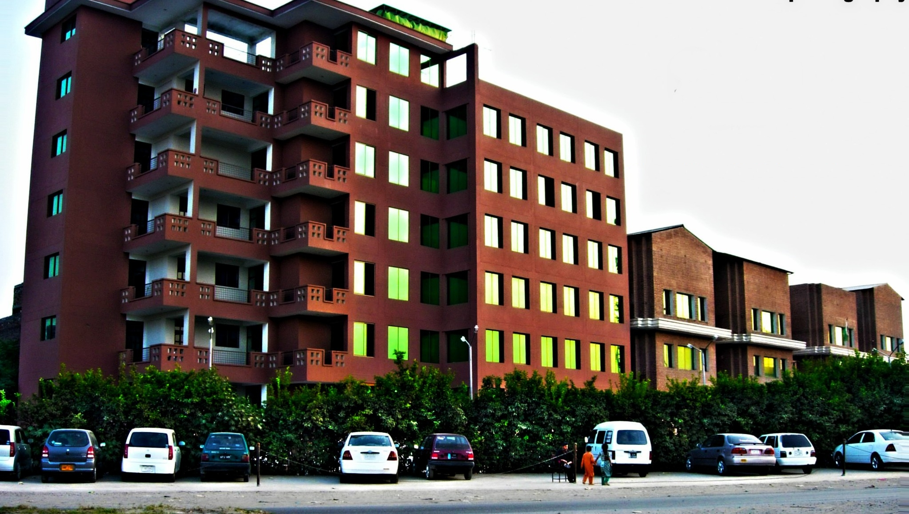</a>
      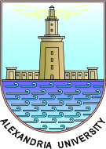
      
      
      <a href="https://programsandcourses.anu.edu.au/2024/course/comp8536/second%20semester/9203" title="Australian National University — COMP8536 — Advanced Topics in Deep Learning for Computer Vision (2024 S2)" target="_blank" rel="noopener">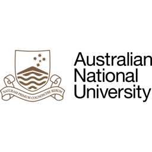</a>
      <a href="https://dsai.biu.ac.il/data-science-related-courses-at-bar-ilan-university/" title="Bar Ilan University" target="_blank" rel="noopener"></a>
      
      <a href="https://www.bimsa.cn/research_detail/DeeLea.html" title="Beijing Institute of Mathematical Sciences and Applications — Deep Learning — Guoqing Hu (胡国庆)" target="_blank" rel="noopener">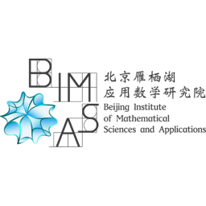</a>
      
      <a href="https://github.com/tirtharajdash/CS-F425_Deep-Learning" title="Birla Institute of Technology and Science Pilani" target="_blank" rel="noopener"></a>
      <a href="https://github.com/tirtharajdash/CS-F425_Deep-Learning" title="BITS Pilani — CS F425 — Deep Learning — Tirtharaj Dash" target="_blank" rel="noopener"></a>
      <a href="https://www.bmu.edu.in/social/b-tech-computer-science-engineering-where-logics-meets-creativity/" title="BML Munjal University" target="_blank" rel="noopener"></a>
      
      <a href="https://www.bracu.ac.bd/research-area/data-analysis-and-machine-learning" title="Brac University" target="_blank" rel="noopener"></a>
      <a href="https://chuxuzhang.github.io/course/COSI165B.html" title="Brandeis University — COSI 165B — Deep Learning — Chuxu Zhang (Assistant Professor of Computer Science)" target="_blank" rel="noopener"></a>
      
      <a href="https://eng.cu.edu.eg/en/" title="Cairo University" target="_blank" rel="noopener"></a>
      <a href="https://deeplearning.cs.cmu.edu/S25/" title="Carnegie Mellon University — 11-785 — Introduction to Deep Learning (Spring 2025 / Fall 2024) — Bhiksha Raj and Rita Singh" target="_blank" rel="noopener"></a>
      <a href="https://www.cmi.ac.in/~pranabendu/aml22/ and https://www.cmi.ac.in/~pranabendu/aml23/" title="Chennai Mathematical Institute — Advanced Machine Learning (Autumn 2022 and Autumn 2023) — Pranabendu Misra" target="_blank" rel="noopener">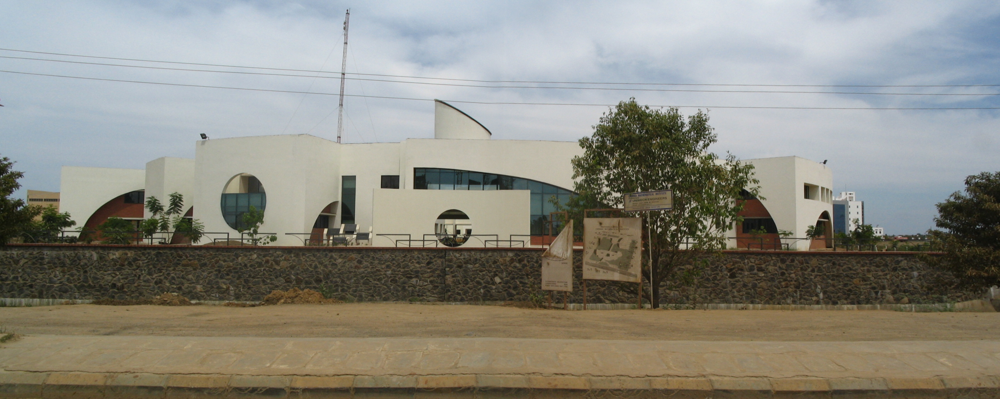</a>
      <a href="https://ouc.ai/zhenghaiyong/courses/dl/2024fall/index.html" title="China Ocean University — 深度学习 (Deep Learning), Fall 2024 — DL2024Fall — 郑海永 (Haiyong Zheng)" target="_blank" rel="noopener"></a>
      <a href="https://github.com/rphilipzhang/AI-PhD-S25" title="Chinese University of Hong Kong — AI for Business Research (DOTE 6635 / DSME 6635), Spring 2025 — Renyu (Philip) Zhang, Associate Professor, CUHK Business School" target="_blank" rel="noopener"></a>
      <a href="https://library.cuhk.edu.cn/zh-hans/books-recommendation" title="Chinese University of Hong Kong Shenzhen — (recommended textbook, School of Science and Engineering) — (unknown)" target="_blank" rel="noopener">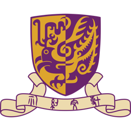</a>
      <a href="https://znxy.cqust.edu.cn/__local/D/8D/EF/8D4B1DAADB3BBAA399816448951_B63B31C4_16C213.pdf?e=.pdf" title="Chongqing University of Science and Technology — 深度学习 (Deep Learning), 智能科学与技术专业 — (unknown)" target="_blank" rel="noopener"></a>
      <a href="https://christuniversity.in/uploads/course/MSc_AI_23-24_20230907104038.pdf" title="Christ University Bengaluru — MSc AI (Artificial Intelligence and Machine Learning) — 2023-24" target="_blank" rel="noopener"></a>
      
      <a href="https://www.ee.cityu.edu.hk/~lmpo/ee4016/pdf/2026_AI_L01A_Course.pdf" title="City University of Hong Kong — EE4016 — AI with Deep Learning — (unknown — lmpo)" target="_blank" rel="noopener"></a>
      
      
      
      <a href="https://www.cs.cornell.edu/courses/cs4782/2024sp/" title="Cornell University — CS 4782 — Intro to Deep Learning (Spring 2024, Spring 2025) — Varsha Kishore and Justin Lovelace (Sp24); Kilian Q. Weinberger and Jennifer J. Sun (Sp25)" target="_blank" rel="noopener"></a>
      <a href="https://www.cyi.ac.cy/index.php/education/masters-programs/simulation-and-data-sciences/sds-418-deep-learning-approaches.html" title="Cyprus Institute" target="_blank" rel="noopener"></a>
      
      
      
      
      <a href="https://lanyunshi.github.io/resources/html/deep-learning2024-2025.html" title="East China Normal University — 深度学习 (Deep Learning), 2024-2025 academic year — 兰韵诗 (Lanyunshi), 数据科学与工程学院" target="_blank" rel="noopener"></a>
      <a href="https://www.emu.edu.tr/en/programs/artificial-intelligence-engineering-undergraduate-program/1760?tab=curriculum" title="Eastern Mediterranean University" target="_blank" rel="noopener"></a>
      
      
      
      
      
      <a href="https://www.fiec.espol.edu.ec/en/undergraduate-programs/data-science-and-artificial-intelligence-online" title="Escuela Superior Politecnica del Litoral" target="_blank" rel="noopener"></a>
      <a href="https://fulokoja.edu.ng/academic-programme.php?i=bachelor-of-science-degree-in-computer-science&amp;section=structure-and-content" title="Federal University Lokoja" target="_blank" rel="noopener"></a>
      <a href="http://service005.sds.fcu.edu.tw/" title="Feng Chia University" target="_blank" rel="noopener"></a>
      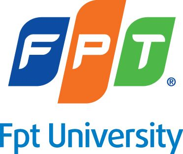
      
      
      
      
      
      
      
      <a href="https://www.greatlakes.edu.in/e-learning-programs/" title="Great Lakes Institute of Management" target="_blank" rel="noopener">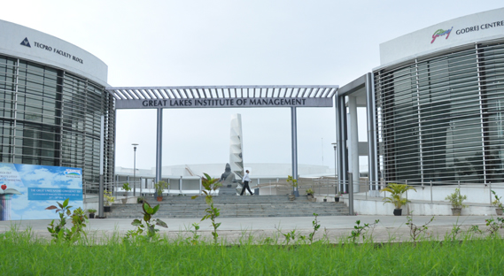</a>
      <a href="https://courses.gdut.edu.cn/course/view.php?id=1381" title="Guangdong University of Technology — 机器学习（2024年春） (Machine Learning, Spring 2024) — and a second ML course (id=1967) — (unknown — course on courses.gdut.edu.cn / 自动化学院)" target="_blank" rel="noopener"></a>
      
      
      <a href="https://catalog.hbku.edu.qa/course-descriptions/" title="Hamad Bin Khalifa University" target="_blank" rel="noopener"></a>
      
      
      <a href="https://www.icourse163.org/spoc/course/HIT-1469674174" title="Harbin Institute of Technology — 深度学习理论及实践 (Deep Learning Theory and Practice) — MOOC on icourse163.org — 刘远超 (Liu Yuanchao)" target="_blank" rel="noopener"></a>
      <a href="https://harvard-iacs.github.io/CS287/supplemental" title="Harvard University — AC295/CS287 — Deep Learning for NLP — Chris Tanner" target="_blank" rel="noopener"></a>
      <a href="https://hpi.de/en/studies/during-your-studies/courses/it-systems-engineering-ma/course/sose-20-3033-introduction-to-deep-learning.html" title="Hasso Plattner Institut — SOSE-20-3033 — Introduction to Deep Learning — Not named on public page (HPI Digital Health / IT-Systems Engineering MA)" target="_blank" rel="noopener"></a>
      <a href="https://shnaton.huji.ac.il/index.php/NewSyl/67822/2/2022/" title="Hebrew University of Jerusalem" target="_blank" rel="noopener">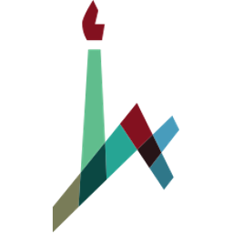</a>
      
      
      
      
      
      
      <a href="https://www.polyu.edu.hk/dsai/-/media/department/dsai/programme/sdfs/dsai5206.pdf" title="Hong Kong Polytechnic University — DSAI5206 — (Deep Learning / AI course, School of Data Science and AI) — (unknown)" target="_blank" rel="noopener"></a>
      <a href="https://seng.hkust.edu.hk/sites/default/files/IMCE/UG/Course%20Syllabus/Fall_2023-2024/COMP4471_Fall%2023-24.pdf" title="Hong Kong University of Science and Technology — COMP4471 — Deep Learning in Computer Vision (multiple terms including Fall 2023-24) — (unknown)" target="_blank" rel="noopener"></a>
      
      <a href="https://www.cse.iitb.ac.in/~cs772/" title="IIT Bombay — CS772 — Deep Learning for Natural Language Processing (Autumn 2025-26; also 2023) — Prof. Pushpak Bhattacharyya" target="_blank" rel="noopener"></a>
      <a href="https://www.csccm.in/courses/deep-learning-for-mechanics-23-24" title="IIT Delhi — Deep Learning for Mechanics — 4 credits (3-0-2); offered 2022-23 and 2023-24 — Dr. Souvik Chakraborty; Dr. Rajdip Nayek" target="_blank" rel="noopener"></a>
      <a href="https://sites.google.com/iitgn.ac.in/es413/home" title="IIT Gandhinagar — ES 413 — Deep Learning (January–April 2025) — Anirban Dasgupta (2025); Mayank Singh (2022-23)" target="_blank" rel="noopener">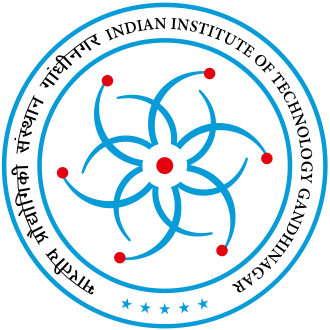</a>
      <a href="https://iitg.ac.in/dsai/dsai_bsc_syllabus.html" title="IIT Guwahati — DA302 — Deep Learning Essentials; DA326 — Deep Learning for Computer Vision (BSc DSAI Program)" target="_blank" rel="noopener"></a>
      <a href="https://iitj.ac.in/PageImages/Gallery/07-2025/CSE-Courses-Details.pdf" title="IIT Jodhpur — CSE Department courses (multiple courses referencing d2l)" target="_blank" rel="noopener"></a>
      <a href="https://www.cse.iitk.ac.in/users/piyush/courses/ml-autumn23/index.html" title="IIT Kanpur — CS771A — Introduction to Machine Learning (Autumn 2018, 2020, 2023) — Piyush Rai" target="_blank" rel="noopener"></a>
      <a href="https://www.cse.iitm.ac.in/~miteshk/CS6910.html" title="IIT Madras — CS6910 / CS7015 — Deep Learning (January–May 2024) — Mitesh M. Khapra" target="_blank" rel="noopener"></a>
      <a href="https://wp.doc.ic.ac.uk/bkainz/teaching/70010-deep-learning-from-2023/" title="Imperial College London — 60034/70010/97111 — Deep Learning (from 2024) — Bernhard Kainz" target="_blank" rel="noopener"></a>
      
      <a href="https://onlinecourses.nptel.ac.in/noc26_cs01/preview" title="Indian Institute of Science IISc Bangalore — Foundations of Deep Learning: Concepts and Applications (NPTEL NOC26-CS01) — Prof. Sriram Ganapathy (IISc); Prof. Ashwini Kodipalli and Prof. Baishali Garai (RV University, Bengaluru)" target="_blank" rel="noopener"></a>
      <a href="https://www.cse.iitb.ac.in/~cs772/2023/" title="Indian Institute of Technology Bombay — CS772 — Deep Learning for Natural Language Processing — Prof. Pushpak Bhattacharyya" target="_blank" rel="noopener"></a>
      
      <a href="https://iitj.ac.in/PageImages/Gallery/07-2025/CSE-Courses-Details.pdf" title="Indian Institute of Technology Jodhpur — CSE (multiple courses) — Deep Learning referenced in CSE course catalog — (department-level document; multiple instructors)" target="_blank" rel="noopener">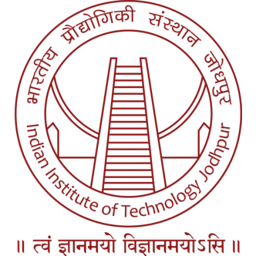</a>
      <a href="https://www.cse.iitk.ac.in/users/piyush/courses/ml-autumn23/index.html" title="Indian Institute of Technology Kanpur — CS771A — Introduction to Machine Learning — Prof. Piyush Rai" target="_blank" rel="noopener"></a>
      
      
      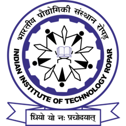
      
      
      
      
      
      
      
      <a href="https://mcdatos.itam.mx/es/aprendizaje-de-maquina-avanzado" title="Instituto Tecnologico Autonomo de Mexico" target="_blank" rel="noopener"></a>
      <a href="https://d2l.ai/ (adopters list) and https://innovacion.itba.edu.ar/educacion-ejecutiva/tic/deep-learning" title="Instituto Tecnologico de Buenos Aires — Deep Learning" target="_blank" rel="noopener"></a>
      
      
      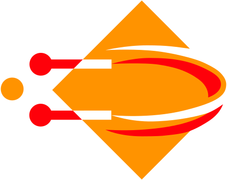
      
      <a href="https://apps.ep.jhu.edu/syllabus/spring-2024/605.742.82" title="Johns Hopkins University — 605.742 — Deep Neural Networks — Oleg Melnikov" target="_blank" rel="noopener"></a>
      
      <a href="https://ml.kaust.edu.sa/courses.html" title="King Abdullah University of Science and Technology" target="_blank" rel="noopener"></a>
      <a href="https://faculty.kfupm.edu.sa/ICS/hluqman/courses/221-ICS471.html" title="King Fahd University of Petroleum and Minerals" target="_blank" rel="noopener"></a>
      
      
      
      <a href="https://onderwijsaanbod.kuleuven.be/syllabi/e/H0Q42AE.htm" title="KU Leuven — H0Q42A — Artificial Neural Networks and Deep Learning — Verbeke Mathias" target="_blank" rel="noopener"></a>
      
      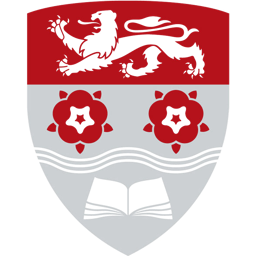
      
      
      <a href="http://d2l.ai/&quot;" title="Leuphana University of Luneburg" target="_blank" rel="noopener"></a>
      <a href="https://www.lse.ac.uk/resources/calendar2025-2026/courseGuides/ST/2025_ST449.htm" title="London School of Economics &amp; Political Science — ST449 Artificial Intelligence (Half Unit) — (LSE Statistics Department)" target="_blank" rel="noopener"></a>
      <a href="https://www.lse.ac.uk/resources/calendar2025-2026/courseGuides/ST/2025_ST456.htm" title="London School of Economics and Political Science — ST456 — Deep Learning (2023-24, 2025-26) / ST449 — Artificial Intelligence (2024-25, 2025-26) / ST510 — Foundations of Machine Learning (2024-25) — Alessandro De Palma (ST456 2025-26), Dr Tengyao Wang (ST449)" target="_blank" rel="noopener">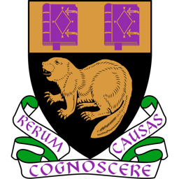</a>
      
      
      <a href="https://dcai.csail.mit.edu/" title="Massachusetts Institute of Technology — Introduction to Data-Centric AI (MIT IAP 2024) — MIT CSAIL" target="_blank" rel="noopener"></a>
      <a href="https://www.cs.mcgill.ca/~isabeau/COMP551/F23/" title="McGill University — COMP 551 — Applied Machine Learning — Isabeau Prémont-Schwarz" target="_blank" rel="noopener"></a>
      <a href="https://mu.menofia.edu.eg/fci/Home/en" title="Menoufia University" target="_blank" rel="noopener"></a>
      <a href="https://hal.cse.msu.edu/teaching/2024-spring-deep-learning/" title="Michigan State University — Deep Learning (Spring 2024)" target="_blank" rel="noopener"></a>
      
      
      
      <a href="https://github.com/SimonTheFool/deep-learning-notebook" title="Monash University — FIT5215 — Deep Learning (postgraduate)" target="_blank" rel="noopener"></a>
      
      
      <a href="https://www.nchu.edu.cn/en" title="Nanchang Hangkong University" target="_blank" rel="noopener"></a>
      <a href="http://jwc.nnudy.edu.cn/c211/20240731/i35828.html" title="Nanjing Normal University Zhongbei College — 深度学习与智能应用 (AI micro-specialty, Autumn 2024) — (unknown)" target="_blank" rel="noopener"></a>
      
      <a href="https://www.icourse163.org/course/NJUE-1469604166" title="Nanjing University of Finance and Economics — 机器学习 (Machine Learning), MOOC on icourse163.org — (unknown — 课程团队)" target="_blank" rel="noopener"></a>
      <a href="https://newdoc.nccu.edu.tw/teaschm/1122/schmPrv.jsp-yy=112&amp;smt=2&amp;num=352769&amp;gop=00&amp;s=1.html" title="National Chengchi University — 金融科技概論 (Introduction to Financial Technology), code 352769001 — LIAO SZU-LANG (廖四郎)" target="_blank" rel="noopener"></a>
      <a href="https://guides.lib.nchu.edu.tw/c.php?g=939671" title="National Chung Hsing University — Master&#x27;s Program in Artificial Intelligence and Data Science (library guide) — (unknown)" target="_blank" rel="noopener"></a>
      
      
      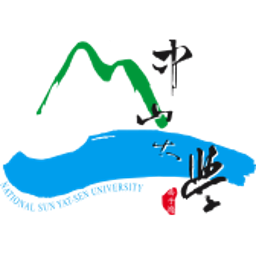
      
      <a href="https://courses.ntua.gr/course/view.php?id=953" title="National Technical University of Athens — Neural Networks and Intelligent Systems — (ECE Department, NTUA)" target="_blank" rel="noopener">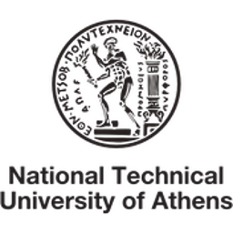</a>
      
      
      
      
      <a href="https://web.njit.edu/~ikoutis/courses/ds677-s23.htm" title="New Jersey Institute of Technology — DS677 — Deep Learning (Spring 2023) — Ioannis Koutis" target="_blank" rel="noopener"></a>
      <a href="https://engineering.nyu.edu/sites/default/files/2020-11/CS-GY%209223%20Deep%20Learning.pdf" title="New York University — CS-GY 9223 — Deep Learning — (Fall 2020 section)" target="_blank" rel="noopener"></a>
      
      
      <a href="https://course.ccs.neu.edu/ds4440f24/" title="Northeastern University — DS4440 — Practical Neural Networks — Byron Wallace" target="_blank" rel="noopener"></a>
      <a href="https://interactiveaudiolab.github.io/course-deep-learning/" title="Northwestern University — COMP_SCI 449 — Deep Learning (Spring 2024, Spring 2025, Spring 2026) — Bryan Pardo" target="_blank" rel="noopener"></a>
      
      
      
      <a href="https://sites.psu.edu/gvwc/course/ai-570-deep-learning/" title="Pennsylvania State University — AI-570 — Deep Learning (Penn State Great Valley / World Campus) — Not named on public syllabus page" target="_blank" rel="noopener"></a>
      <a href="https://plms.postech.ac.kr/local/ubion/course/syllabusV.php?id=7827" title="Pohang University of Science and Technology" target="_blank" rel="noopener"></a>
      <a href="http://chrome.ws.dei.polimi.it/index.php?title=Artificial_Neural_Networks_and_Deep_Learning" title="Politecnico di Milano" target="_blank" rel="noopener"></a>
      <a href="https://cs.pomona.edu/classes/cs152/archive/21-22Spring/" title="Pomona College — CS 152 — Neural Networks (Spring 2022) — Anthony Clark" target="_blank" rel="noopener"></a>
      <a href="https://catalogo.uc.cl/index.php?tmpl=component&amp;option=com_catalogo&amp;view=programa&amp;sigla=INF3812):" title="Pontificia Universidad Catolica de Chile" target="_blank" rel="noopener"></a>
      <a href="https://neptuno.pucp.edu.pe/homepucp/curso/deep-learning/" title="Pontificia Universidad Catolica del Peru" target="_blank" rel="noopener"></a>
      <a href="https://web.cecs.pdx.edu/~lipor/courses/519/" title="Portland State University — EE 5191 Deep Learning Theory &amp; Fundamentals (also listed as EE 519) — John Lipor (Associate Professor, Electrical &amp; Computer Engineering)" target="_blank" rel="noopener"></a>
      <a href="https://www.davidinouye.com/course/ece47300-spring-2024/" title="Purdue University — ECE 47300 — Introduction to Artificial Intelligence (Spring 2024) — David I. Inouye" target="_blank" rel="noopener"></a>
      
      
      
      
      
      <a href="https://datascience.sas.rutgers.edu/images/data-science/sample_syllabi/CS462__Introduction_to_Deep_Learning.pdf" title="Rutgers, The State University of New Jersey — CS 462 — Introduction to Deep Learning (Spring 2022) — Hao Wang" target="_blank" rel="noopener"></a>
      <a href="https://onlinecourses.nptel.ac.in/noc26_cs01/preview" title="RV University Bengaluru — Foundations of Deep Learning: Concepts and Applications (NPTEL NOC26-CS01, jointly with IISc) — Prof. Ashwini Kodipalli and Prof. Baishali Garai" target="_blank" rel="noopener"></a>
      
      
      <a href="https://gsds.snu.ac.kr/course/m3239-002300003/" title="Seoul National University" target="_blank" rel="noopener"></a>
      
      <a href="https://hhaji.github.io/Deep-Learning/" title="Shahid Beheshti University — Deep Learning Using PyTorch (2020) — Hossein Hajiabolhassan (Data Science Center)" target="_blank" rel="noopener"></a>
      <a href="https://splab.sdu.edu.cn/zryycl1.htm" title="Shandong University — 自然语言处理 (Natural Language Processing) — 孙宇清 (Prof. Sun Yuqing), 语义计算实验室" target="_blank" rel="noopener"></a>
      <a href="https://github.com/rphilipzhang/AI-PhD-Antai-Su2024" title="Shanghai Jiao Tong University — Artificial Intelligence for Business Research, Antai College of Economics and Management, Summer 2024 — Renyu (Philip) Zhang (visiting, CUHK Business School)" target="_blank" rel="noopener"></a>
      <a href="https://www.shiep.edu.cn/" title="Shanghai University of Electric Power" target="_blank" rel="noopener"></a>
      
      
      
      <a href="https://www.unishivaji.ac.in/syllabusnew/" title="Shivaji University Kolhapur" target="_blank" rel="noopener"></a>
      
      <a href="https://www.sutd.edu.sg/course/60-001-applied-deep-learning/" title="Singapore University of Technology and Design" target="_blank" rel="noopener"></a>
      
      
      
      
      
      
      
      <a href="https://github.com/sergulaydore/EE-628-Spring-2020" title="Stevens Institute of Technology — EE-628 — Deep Learning (Electrical and Computer Engineering, Spring 2020) — Serkan Gülaydın" target="_blank" rel="noopener"></a>
      <a href="https://bmi.skku.edu/?page_id=2531" title="Sungkyunkwan University" target="_blank" rel="noopener"></a>
      <a href="https://vistalab-technion.github.io/cs236781/info/" title="Technion   Israel Institute of Technology" target="_blank" rel="noopener"></a>
      
      
      
      
      <a href="https://people.tamu.edu/~sji/classes/syllabus-CSCE636-DL-F2020.pdf" title="Texas A&amp;M University — CSCE 636 — Deep Learning (Fall 2020) — Shuiwang Ji" target="_blank" rel="noopener"></a>
      <a href="https://cse.tcu.edu/computer-science/files/syllabi/COSC40523.pdf" title="Texas Christian University" target="_blank" rel="noopener"></a>
      <a href="https://csed.thapar.edu/upload/files/AI_ML24.pdf`" title="Thapar Institute of Engineering and Technology" target="_blank" rel="noopener"></a>
      
      
      <a href="https://course.thu.edu.tw/view/112/1/1046" title="Tunghai University — 深度學習應用 (Deep Learning Applications), code 1046, Term 1121 — 陳隆彬 (Chen Long-bin)" target="_blank" rel="noopener"></a>
      
      <a href="https://aplicaciones.uc3m.es/cpa/generaFicha?est=378&amp;asig=19203&amp;idioma=2" title="Universidad Carlos III de Madrid — 19203 — Neural Networks (Master in Applied Artificial Intelligence, 2025/26) — Lancho Serrano, Alejandro" target="_blank" rel="noopener"></a>
      <a href="https://github.com/dccuchile/CC6204" title="Universidad de Chile — CC6204 — Deep Learning — Jorge Pérez (with TAs Gabriel Chaperon, Ho Jin Kang, Juan-Pablo Silva, Mauricio Romero, Jesús Pérez-Martín)" target="_blank" rel="noopener"></a>
      
      
      <a href="https://bisite.usal.es/es/formacion/cursos/rna" title="Universidad de Salamanca" target="_blank" rel="noopener"></a>
      <a href="https://estudios.unizar.es/estudio/asignatura?anyo_academico=2021&amp;asignatura_id=60979&amp;estudio_id=20210682&amp;centro_id=110&amp;plan_id_nk=623" title="Universidad de Zaragoza" target="_blank" rel="noopener"></a>
      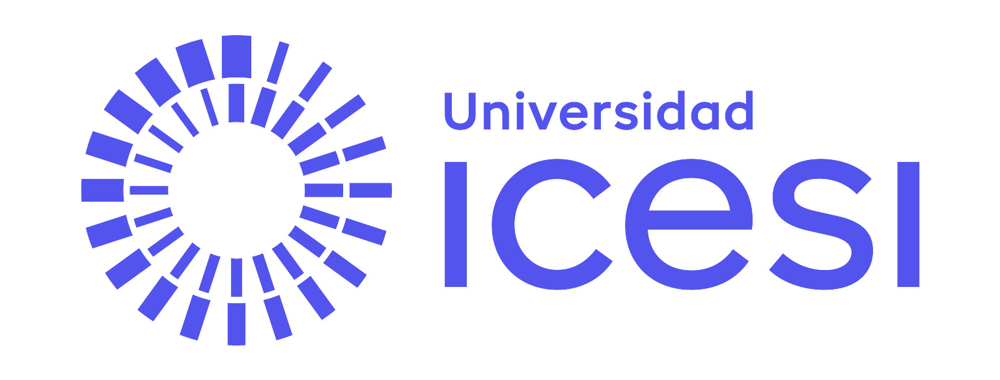
      <a href="https://catalogo.umng.edu.co/cgi-bin/koha/opac-detail.pl?biblionumber=37154" title="Universidad Militar Nueva Granada" target="_blank" rel="noopener">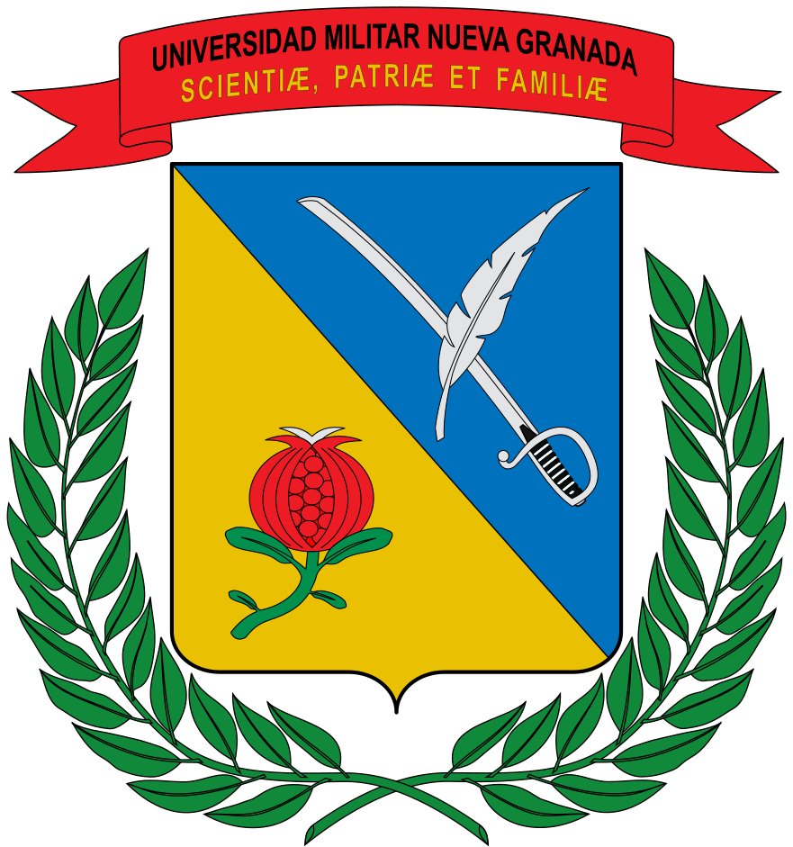</a>
      
      <a href="https://turing.iimas.unam.mx/~ricardoml/course/iap/" title="Universidad Nacional Autonoma de Mexico — Aprendizaje Profundo (Deep Learning) — Licenciatura en Ciencia de Datos — Berenice and Ricardo Montalvo Lezama" target="_blank" rel="noopener"></a>
      <a href="https://mlds.unal.edu.co/" title="Universidad Nacional de Colombia Sede Manizales" target="_blank" rel="noopener"></a>
      
      
      
      <a href="https://en.urjc.es/universidad/campus/sedes/7094-inteligencia-artificial" title="Universidad Rey Juan Carlos" target="_blank" rel="noopener"></a>
      <a href="https://www.d2l.com/es/por-que-elegir-d2l/clientes/usfq-2/" title="Universidad San Francisco de Quito" target="_blank" rel="noopener"></a>
      
      
      
      <a href="https://apps.uc.pt/courses/PT/unit/99807/25568/2025-2026?common_core=true&amp;type=ram&amp;id=12661" title="Universidade de Coimbra — 02056692 — Inteligência Artificial para Visão por Computador (AI for Computer Vision, 2025-26) — Jorge Manuel Moreira de Campos Pereira Batista" target="_blank" rel="noopener"></a>
      <a href="https://www.ic.unicamp.br/historico-ic/graduacao/plano-desenvolvimento-disciplinas/1s2025/MC934A.pdf" title="Universidade Estadual de Campinas" target="_blank" rel="noopener"></a>
      
      <a href="https://deep-ufmg.github.io/" title="Universidade Federal de Minas Gerais — Aprendizado Profundo (Deep Learning) — Flávio Figueiredo" target="_blank" rel="noopener"></a>
      
      <a href="https://deeplearning.cin.ufpe.br/" title="Universidade Federal de Pernambuco" target="_blank" rel="noopener">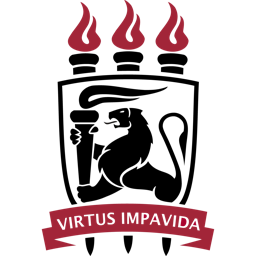</a>
      
      
      <a href="https://cursos.unipampa.edu.br/cursos/ppgcap/estrutura-curricular/componentes-curriculares/componente-deep-learning/" title="Universidade Federal do Pampa" target="_blank" rel="noopener"></a>
      
      <a href="https://guia.unl.pt/en/2022/fct/program/1059/course/12423" title="Universidade NOVA de Lisboa" target="_blank" rel="noopener">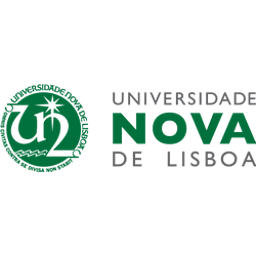</a>
      <a href="https://www.mackenzie.br/fileadmin/ARQUIVOS/Public/6-pos-graduacao/upm-higienopolis/EAD/Intelig%C3%AAncia_Artificial/EAD_EMENTA_-_INTELIGENCIA_ARTIFICIAL_.pdf" title="Universidade Presbiteriana Mackenzie" target="_blank" rel="noopener"></a>
      
      
      
      
      
      
      
      
      
      <a href="https://syllabus.unict.it/insegnamento.php?id=16349" title="Universita degli Studi di Catania — Deep Learning (Laurea Magistrale in Informatica / Data Science) — (DMI Department, UNICT)" target="_blank" rel="noopener"></a>
      
      <a href="http://www.ce.uniroma2.it/courses/ml2425/" title="Universita degli Studi di Roma Tor Vergata — Machine Learning (A.A. 2024/25 and 2023/24) — (Computer Engineering dept., ce.uniroma2.it / tvml.github.io)" target="_blank" rel="noopener"></a>
      <a href="https://www.unibo.it/en/study/course-units-transferable-skills-moocs/course-unit-catalogue/course-unit/2024/455807" title="Universita di Bologna — 91250 — Deep Learning (2024/25) — Matteo Ferrara" target="_blank" rel="noopener"></a>
      
      
      
      
      
      <a href="https://hci.iwr.uni-heidelberg.de/teaching/machine_learning_essentials_2023" title="Universitat Heidelberg" target="_blank" rel="noopener"></a>
      <a href="https://telecombcn-dl.github.io/dlai-2020/" title="Universitat Politecnica de Catalunya" target="_blank" rel="noopener"></a>
      <a href="https://uni-tuebingen.de/fakultaeten/mathematisch-naturwissenschaftliche-fakultaet/fachbereiche/informatik/lehrstuehle/autonomous-vision/lectures/deep-learning/" title="Universitat Tubingen" target="_blank" rel="noopener"></a>
      <a href="https://www.ubbcluj.ro/ro/infoubb/posturi_vacante/files/cercetare/2025/269/tematica.pdf" title="Universitatea Babes Bolyai" target="_blank" rel="noopener"></a>
      
      
      
      
      <a href="https://studiegids.universiteitleiden.nl/en/courses/122697/introduction-to-deep-learning" title="Universiteit Leiden — 4343INTDL — Introduction to Deep Learning (2024-25) — Dr. D.M. Pelt" target="_blank" rel="noopener"></a>
      
      <a href="https://csce.uark.edu/~lz006/course/2021fall/5063.html" title="University of Arkansas — CSCE 5063 — Machine Learning (Fall 2021) — Liang Zhao (csce.uark.edu/~lz006)" target="_blank" rel="noopener"></a>
      
      
      
      <a href="https://github.com/unica-ml/ml" title="University of Cagliari — Machine Learning (MSc Computer Engineering, Cybersecurity and AI, 2025-26) — Prof. Battista Biggio" target="_blank" rel="noopener"></a>
      <a href="https://c.d2l.ai/berkeley-stat-157/" title="University of California, Berkeley — STAT 157 — Introduction to Deep Learning (Spring 2019) — Alex Smola and Mu Li (authors of D2L)" target="_blank" rel="noopener"></a>
      
      <a href="https://uclaml.github.io/CS269-Spring2022/" title="University of California, Los Angeles — CS269 — Foundations of Deep Learning (Spring 2022) — Quanquan Gu" target="_blank" rel="noopener"></a>
      <a href="https://shangjingbo1226.github.io/teaching/2025-winter-CSE151A-ML" title="University of California, San Diego — CSE 151A — Introduction to Machine Learning (Winter 2025) — Jingbo Shang" target="_blank" rel="noopener"></a>
      <a href="https://lileicc.github.io/course/dl23w/" title="University of California, Santa Barbara — CS 190I — Deep Learning (Winter 2023) — Lei Li" target="_blank" rel="noopener"></a>
      
      <a href="https://www.cl.cam.ac.uk/teaching/2324/L46/" title="University of Cambridge" target="_blank" rel="noopener"></a>
      
      <a href="https://syllabus.unict.it/insegnamento.php?id=16349" title="University of Catania — Neural Computing (INF/01, 6 CFU), Master in Data Science / Deep Learning – Modulo BASIC, 2023/2024 — Sebastiano Battiato" target="_blank" rel="noopener"></a>
      
      <a href="https://cse.ucdenver.edu/~biswasa/teaching/2023-spring-DL-5931/" title="University of Colorado Denver — CSCI-5931 — Deep Learning (Spring 2023) — Ashis Biswas (&quot;Dr. B&quot;)" target="_blank" rel="noopener"></a>
      
      
      <a href="https://github.com/AIBiology/aibiology.github.io/blob/main/index.md (course site at aibiology.github.io)" title="University of Florida — ZOO4926 / ZOO6927 — AI in Biology (Spring 2022) — Not named in accessible materials" target="_blank" rel="noopener"></a>
      
      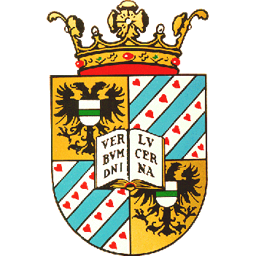
      
      
      
      
      <a href="https://slazebni.cs.illinois.edu/spring21/" title="University of Illinois at Urbana Champaign — CS 498 Introduction to Deep Learning, Spring 2021 (Svetlana Lazebnik, UIUC)" target="_blank" rel="noopener"></a>
      <a href="https://slazebni.cs.illinois.edu/spring24/" title="University of Illinois Urbana Champaign — CS 444 — Deep Learning for Computer Vision (Spring 2024) — Svetlana Lazebnik" target="_blank" rel="noopener"></a>
      
      <a href="https://uojai.github.io/deeplearning/resources.html" title="University of Juba — Deep Learning — Dr. Felix Gonda (Assistant Professor of Computer Science, AI Lab)" target="_blank" rel="noopener"></a>
      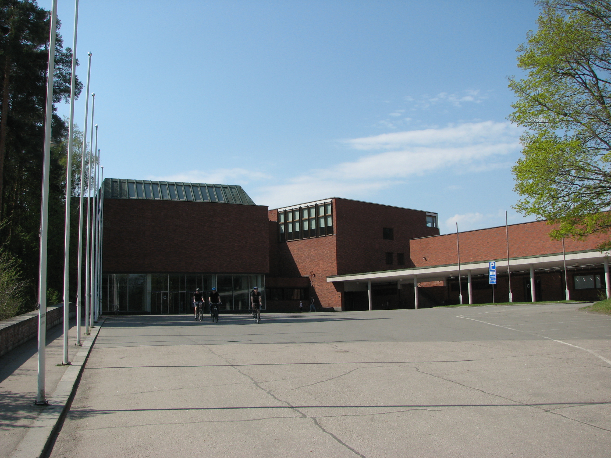
      <a href="https://github.com/ingambe/PracticumAAUDeepLearning" title="University of Klagenfurt" target="_blank" rel="noopener"></a>
      <a href="https://github.com/glouppe/info8010-deep-learning/blob/master/lecture4.md" title="University of Liege" target="_blank" rel="noopener"></a>
      <a href="https://www.cs.umd.edu/class/spring2019/cmsc498L/" title="University of Maryland — CMSC 498L — Introduction to Deep Learning (Spring 2019) — Abhinav Shrivastava" target="_blank" rel="noopener"></a>
      <a href="https://bdal.umbc.edu/resources/knowledge-base/" title="University of Maryland Baltimore County" target="_blank" rel="noopener"></a>
      
      <a href="http://www.ambujtewari.com/stats315-winter2024/" title="University of Michigan — STATS / DATA SCI 315 — Introduction to Deep Learning (Winter 2024) — Ambuj Tewari" target="_blank" rel="noopener"></a>
      <a href="https://elearning.unimib.it/course/info.php?id=51006" title="University of Milano Bicocca — Advanced Artificial Intelligence, Machine Learning and Deep Learning — Università degli Studi di Milano-Bicocca" target="_blank" rel="noopener"></a>
      <a href="https://sunju.org/teach/DL-Fall-2022/DL.pdf (course syllabus PDF)" title="University of Minnesota, Twin Cities — CSCI 5527 — Deep Learning: Models, Computation, and Applications, Fall 2022 (Ju Sun, UMN)" target="_blank" rel="noopener"></a>
      
      <a href="https://www.cs.unh.edu/~dietz/teaching/nn/index.html" title="University of New Hampshire — Neural Networks (deep learning) course, Laura Dietz, UNH Computer Science" target="_blank" rel="noopener">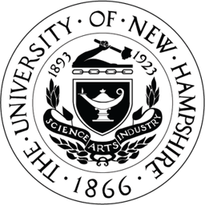</a>
      <a href="https://webcms3.cse.unsw.edu.au/COMP9444/25T2/outline" title="University of New South Wales — COMP9444 — Neural Networks and Deep Learning (2025 T2)" target="_blank" rel="noopener"></a>
      
      <a href="https://github.com/craffel/comp664-deep-learning-spring-2023" title="University of North Carolina at Chapel Hill — COMP 664 — Deep Learning (Spring 2023) — Colin Raffel" target="_blank" rel="noopener"></a>
      <a href="https://hengfan2010.github.io/teaching/24S-5218/index.htm" title="University of North Texas — CSCE 5218 — Deep Learning (Spring 2024) — Heng Fan" target="_blank" rel="noopener"></a>
      
      
      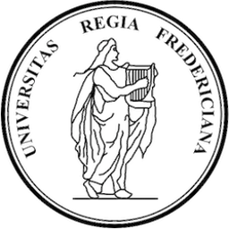
      <a href="https://www.seas.upenn.edu/~cis5190/fall2025/resources.html" title="University of Pennsylvania — CIS 4190/5190 — Applied Machine Learning, Fall 2025, UPenn SEAS" target="_blank" rel="noopener"></a>
      <a href="https://people.cs.pitt.edu/~kovashka/cs1678_sp24/" title="University of Pittsburgh — CS 1678/2078 — Intro to Deep Learning (Spring 2024) — Adriana Kovashka" target="_blank" rel="noopener"></a>
      <a href="https://www.cs.rochester.edu/~cxu22/t/298F21/" title="University of Rochester — CSC 298/578 — Deep Learning (Fall 2021)" target="_blank" rel="noopener"></a>
      <a href="https://www.icmc.usp.br/pos-graduacao/disciplinas?programa=55134&amp;disciplina=SSC5984" title="University of Sao Paulo" target="_blank" rel="noopener">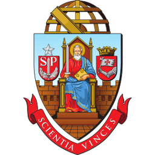</a>
      
      <a href="https://ee541.usc-ece.com/syllabus.html" title="University of Southern California — EE 541 — A Computational Introduction to Deep Learning, USC Viterbi" target="_blank" rel="noopener"></a>
      <a href="https://usm.maine.edu/department-computer-science/cos-472-artificial-intelligence-and-data-mining/" title="University of Southern Maine — COS 472 — Artificial Intelligence and Data Mining, USM Department of Computer Science" target="_blank" rel="noopener"></a>
      
      
      
      
      <a href="https://hhaji.github.io/Deep-Learning/" title="University of Tehran" target="_blank" rel="noopener"></a>
      
      <a href="https://github.com/craffel/csc413-2516-deep-learning-fall-2024" title="University of Toronto — CSC 413/2516 — Neural Networks and Deep Learning (Fall 2024) — Colin Raffel" target="_blank" rel="noopener"></a>
      
      <a href="http://dlsys.cs.washington.edu/materials" title="University of Washington — CSE 599W — Systems for ML (Deep Learning Systems), UW Paul G. Allen School" target="_blank" rel="noopener"></a>
      <a href="https://watml.github.io/" title="University of Waterloo — CS 480/680 — Introduction to Machine Learning (Winter 2024) — Hongyang Zhang and Yaoliang Yu" target="_blank" rel="noopener"></a>
      <a href="https://pages.cs.wisc.edu/~sharonli/courses/cs762_fall2023/index.html" title="University of Wisconsin — CS 762 — Advanced Deep Learning (Fall 2022, Fall 2023) — Sharon Li" target="_blank" rel="noopener"></a>
      
      
      
      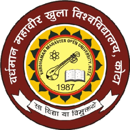
      
      <a href="https://xuanwang91.github.io/teaching/2023-Spring-CS5814-Intro-DL" title="Virginia Tech — CS 5814 — Introduction to Deep Learning, Spring 2023 (Xuan Wang, Virginia Tech)" target="_blank" rel="noopener"></a>
      <a href="https://ssc.wur.nl/Studiegids/Vak/GRS-34806" title="Wageningen University" target="_blank" rel="noopener"></a>
      
      <a href="https://www.eng.uwo.ca/electrical/undergraduate/Programs/AISE_4010_1259.pdf (course outline PDF)" title="Western University — AISE 4010 — Deep Learning for Time Series Data, Western University Faculty of Engineering (Artificial Intelligence Systems Engineering program)" target="_blank" rel="noopener"></a>
      
      
      
      
      
      <a href="https://yonseivnl.github.io/courses/dtp2022fall/" title="Yonsei University" target="_blank" rel="noopener"></a>
      
      <a href="https://www.icourse163.org/course/ZJU-1206573810" title="Zhejiang University — 机器学习 (Machine Learning) — MOOC on icourse163.org — (unknown — 浙江大学)" target="_blank" rel="noopener"></a>
      <!-- @universities-end -->
    </div>
    <p class="d2l-uni-note">Click a logo to see a course at that institution adopting the book.</p>
  </div>
</section>

<section>
  <h2>What people are saying</h2>
  <div class="d2l-quotes">
    <div class="d2l-quote">
      <blockquote>In a way that strikes the perfect balance between hands-on learning and mathematical rigor, this book is the most accessible and resourceful guide to deep learning we currently have.</blockquote>
      <p class="attrib"><strong>Course adopter</strong>, R1 university</p>
    </div>
    <div class="d2l-quote">
      <blockquote>The notebooks make it easy to get students from zero to a working model in a single lecture. The math is there when you want it and stays out of the way when you don't.</blockquote>
      <p class="attrib"><strong>Instructor</strong>, graduate ML course</p>
    </div>
    <div class="d2l-quote">
      <blockquote>I switched from PyTorch to JAX mid-semester and didn't have to switch textbooks. That alone is unheard of.</blockquote>
      <p class="attrib"><strong>Researcher</strong>, industry lab</p>
    </div>
  </div>
</section>

<section class="d2l-cite">
  <h2>Cite the book</h2>
  <pre><code>@book{zhang2023dive,
  title     = {Dive into Deep Learning},
  author    = {Zhang, Aston and Lipton, Zachary C. and Li, Mu and Smola, Alexander J.},
  publisher = {Cambridge University Press},
  note      = {\url{https://D2L.ai}},
  year      = {2023}
}</code></pre>
</section>

<section>
  <h2>Resources</h2>
  <div class="d2l-resources">
    <a href="chapter_preface/index.html">Read the book<small>Start with the preface</small></a>
    <a href="https://d2l.ai/d2l-en.pdf">PDF (PyTorch)<small>Single-file download</small></a>
    <a href="https://github.com/d2l-ai/d2l-en">Source on GitHub<small>Notebooks &amp; library</small></a>
    <a href="https://courses.d2l.ai">Courses<small>Slides &amp; videos</small></a>
    <a href="https://discuss.d2l.ai">Discussion forum<small>Per-chapter Q&amp;A</small></a>
    <a href="https://zh.d2l.ai">Chinese edition<small>中文版</small></a>
  </div>
</section>

</div>
```

```toc
:maxdepth: 1

chapter_preface/index
chapter_installation/index
chapter_notation/index
```


```toc
:maxdepth: 2
:numbered:

chapter_introduction/index
chapter_preliminaries/index
chapter_linear-regression/index
chapter_linear-classification/index
chapter_multilayer-perceptrons/index
chapter_builders-guide/index
chapter_convolutional-neural-networks/index
chapter_convolutional-modern/index
chapter_recurrent-neural-networks/index
chapter_recurrent-modern/index
chapter_attention-mechanisms-and-transformers/index
chapter_optimization/index
chapter_computational-performance/index
chapter_computer-vision/index
chapter_natural-language-processing-pretraining/index
chapter_natural-language-processing-applications/index
chapter_reinforcement-learning/index
chapter_gaussian-processes/index
chapter_hyperparameter-optimization/index
chapter_generative-adversarial-networks/index
chapter_recommender-systems/index
chapter_appendix-mathematics-for-deep-learning/index
chapter_appendix-tools-for-deep-learning/index

```


```toc
:maxdepth: 1

chapter_references/zreferences
```
